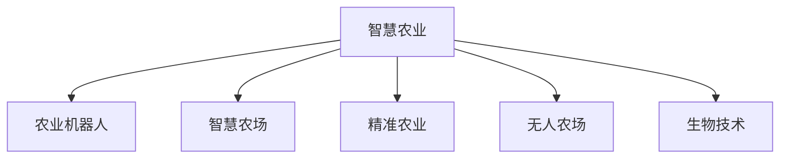

                 

# 未来的智慧农业：2050年的农业机器人与智慧农场

## 1. 背景介绍

### 1.1 问题由来
随着世界人口的不断增长和可耕作土地资源的日益稀缺，农业生产面临着前所未有的挑战。传统的农业模式依靠大量人力和化学肥料，环境污染和资源浪费严重。同时，气候变化、病虫害等问题也威胁着粮食安全。因此，探索可持续、高效、精准的农业生产方式，成为全球农业发展的迫切需求。

### 1.2 问题核心关键点
- 提高农业生产效率：减少人力成本和化学肥料使用，提高土地利用率和产出。
- 降低环境影响：减少水资源和化肥的浪费，避免农药过度使用对生态的影响。
- 保障粮食安全：提高农业生产稳定性，应对气候变化和自然灾害。
- 改善食品安全：确保农产品从田间到餐桌的全程可追溯，保障消费者健康。
- 实现自动化和智能化：通过农业机器人与智慧农场技术，提升农业生产的科技含量。

### 1.3 问题研究意义
发展智慧农业技术，对于应对粮食安全挑战、推动农业现代化、实现农业可持续发展具有重要意义：

1. 提高农业生产效率：通过智能农业设备，实现精准耕种、自动施肥、智能灌溉等，大幅提升农业产出。
2. 减少环境污染：采用生物技术和智能管理，减少化学肥料和农药的使用，保护土壤和生态。
3. 保障食品安全：建立农产品追溯系统，从源头确保食品质量，增强消费者信心。
4. 提升农业自动化水平：引入农业机器人，减轻人力负担，提高农业生产的标准化和规模化。
5. 促进农业可持续发展：通过智慧农业技术，实现资源的高效利用和环境的友好管理。

## 2. 核心概念与联系

### 2.1 核心概念概述

为了更好地理解智慧农业的未来发展，本节将介绍几个密切相关的核心概念：

- **智慧农业(Smart Agriculture)**：利用信息技术、物联网技术、机器人技术等手段，实现农业生产的自动化、智能化、精准化管理，提高农业生产效率和可持续性。
- **农业机器人(Agricultural Robotics)**：采用自主或半自主控制技术，用于农业生产中执行耕作、播种、收割、喷药等任务，提高农业生产效率和质量。
- **智慧农场(Smart Farm)**：融合传感器、物联网、云计算、大数据等技术，实现对农业生产全过程的实时监控、智能决策和管理，提升农业生产管理水平。
- **精准农业(Precision Agriculture)**：基于GIS、遥感、大数据等技术，实现对农业生产要素的精准管理和农业资源的优化配置，提升农业生产效率和资源利用率。
- **无人农场(Autonomous Farming)**：利用自动化和智能化技术，实现从农田管理到生产流程的全面自动化，减少人力需求，提高生产效率。
- **生物技术(Biotechnology)**：通过基因编辑、生物传感器、生物合成等技术，提高农业生产效率和产品质量，推动农业科技的发展。

这些核心概念之间的逻辑关系可以通过以下Mermaid流程图来展示：



这个流程图展示了一系列智慧农业的关键技术和方法，它们相互协同，共同构成了智慧农业的未来发展框架。

## 3. 核心算法原理 & 具体操作步骤

### 3.1 算法原理概述

智慧农业的实现，离不开对大量农业数据的采集、处理和分析。其核心算法原理包括：

- 传感器数据融合：将农田传感器数据、气象数据、土壤数据等进行融合，构建全面的农业数据环境。
- 大数据分析：利用机器学习、深度学习等技术，对农业数据进行建模和预测，优化农业生产决策。
- 物联网通信：通过物联网技术，实现农业设备的远程监控和控制，提升农业生产管理效率。
- 机器视觉识别：利用计算机视觉技术，实现对农田病虫害、农作物生长状态的实时监控和识别，及时采取措施。
- 自动导航与路径规划：通过无人驾驶和机器人技术，实现农业设备的精准导航和路径规划，提高作业效率和精度。

### 3.2 算法步骤详解

智慧农业的实现过程一般包括以下几个关键步骤：

**Step 1: 数据采集与传感器安装**
- 在农田关键位置安装传感器，如土壤湿度传感器、温度传感器、气象站、摄像头等，收集实时数据。
- 部署物联网设备，实现数据的实时传输和监控。

**Step 2: 数据融合与处理**
- 利用传感器数据融合技术，将不同来源的数据进行整合和处理，构建统一的农业数据环境。
- 应用大数据分析技术，对农业数据进行建模和预测，优化农业生产决策。

**Step 3: 智能决策与管理**
- 根据实时数据和历史数据，利用机器学习和深度学习算法，进行农业生产决策。
- 通过智能控制系统，实现对农业设备的远程监控和控制，提升农业生产管理效率。

**Step 4: 精准作业与自动化**
- 利用无人驾驶和机器人技术，实现农业设备的精准导航和路径规划，提高作业效率和精度。
- 应用生物技术和精准农业技术，实现对农业生产要素的精准管理和农业资源的优化配置。

**Step 5: 数据分析与反馈**
- 对农业生产数据进行实时分析和可视化展示，为农业生产者提供决策支持。
- 根据反馈数据，不断优化农业生产方案，提升农业生产效果。

### 3.3 算法优缺点

智慧农业技术具有以下优点：
1. 提高生产效率：通过自动化和智能化手段，大幅提高农业生产效率和资源利用率。
2. 减少环境污染：减少化学肥料和农药的使用，保护生态环境。
3. 优化资源配置：通过精准农业技术，实现农业资源的优化配置和高效利用。
4. 提升产品质量：通过智能监测和质量控制，确保农产品的安全性和品质。
5. 增强农业竞争力：提高农业生产的现代化水平，增强市场竞争力。

同时，该技术也存在一定的局限性：
1. 初始投入高：智慧农业技术需要较高的初始投资，包括传感器、物联网设备、数据处理平台等。
2. 技术门槛高：智慧农业技术涉及多种高科技手段，需要较高的技术水平和专业知识。
3. 数据安全和隐私：农业数据涉及敏感信息，需要采取有效的安全措施，保护数据隐私。
4. 设备故障率：农业机器人等自动化设备容易受到环境因素的影响，存在一定的故障率。

尽管存在这些局限性，但就目前而言，智慧农业技术仍是大势所趋，将逐渐成为未来农业生产的重要方式。未来相关研究的重点在于如何进一步降低技术门槛，提高系统的稳定性和可靠性，同时兼顾可扩展性和灵活性。

### 3.4 算法应用领域

智慧农业技术已经在多个领域得到了广泛应用，包括但不限于：

- 种植业：通过精准农业和无人农场技术，提高种植效率和产量。
- 畜牧业：应用智能牧场和自动饲养技术，优化饲料管理，提升畜牧生产效率。
- 渔业：利用水下机器人进行水质监测和自动化捕捞，提升渔业生产效率。
- 农业机械化：应用无人驾驶和机器人技术，实现农业机械的自动化和智能化操作。
- 农业物联网：构建智慧农业数据平台，实现农业设备的远程监控和管理。

## 4. 数学模型和公式 & 详细讲解  
### 4.1 数学模型构建

智慧农业的核心模型通常基于传感器数据、气象数据、作物生长数据等，构建多变量数学模型，实现对农业生产过程的预测和优化。

假设农业生产过程可以表示为多变量线性回归模型：

$$
y = \beta_0 + \sum_{i=1}^n \beta_i x_i + \epsilon
$$

其中 $y$ 为农业生产指标（如产量、产值等），$x_i$ 为影响因素（如土壤湿度、气温、光照等），$\beta_i$ 为模型参数，$\epsilon$ 为随机误差项。

### 4.2 公式推导过程

在实际应用中，智慧农业模型通常基于大量的历史数据进行训练，采用最小二乘法或梯度下降法求解模型参数 $\beta_i$。具体推导过程如下：

对于一组观测数据 $(x_{1j}, y_j)$，$i=1,2,\ldots,N$，求解线性回归模型的参数 $\beta_i$：

$$
\min_{\beta} \sum_{i=1}^N (y_i - \beta_0 - \sum_{i=1}^n \beta_i x_{i,j})^2
$$

对上述目标函数求偏导数，得到：

$$
\frac{\partial \sum_{i=1}^N (y_i - \beta_0 - \sum_{i=1}^n \beta_i x_{i,j})^2}{\partial \beta_j} = 0
$$

展开并简化后，得到线性回归模型的参数估计公式：

$$
\beta_j = \frac{\sum_{i=1}^N (y_i - \bar{y}) x_{i,j}}{\sum_{i=1}^N (x_{i,j} - \bar{x})^2}
$$

其中 $\bar{y}$ 和 $\bar{x}$ 分别为 $y$ 和 $x$ 的均值。

### 4.3 案例分析与讲解

以农作物产量预测为例，利用线性回归模型进行建模和预测。假设已有大量历史数据，包括气温、湿度、光照、土壤肥力等影响因素和对应的作物产量数据。

首先，对数据进行预处理和标准化：

$$
x_{i,j} = \frac{x_i - \bar{x}}{s_x}
$$

其中 $s_x$ 为 $x$ 的标准差。

然后，构建线性回归模型：

$$
y = \beta_0 + \beta_1 x_1 + \beta_2 x_2 + \ldots + \beta_n x_n + \epsilon
$$

通过最小二乘法或梯度下降法求解模型参数 $\beta_j$：

$$
\beta_j = \frac{\sum_{i=1}^N (y_i - \bar{y}) x_{i,j}}{\sum_{i=1}^N (x_{i,j} - \bar{x})^2}
$$

得到模型后，利用新的数据对模型进行验证和评估，计算预测误差，优化模型参数。

## 5. 项目实践：代码实例和详细解释说明
### 5.1 开发环境搭建

在进行智慧农业项目实践前，我们需要准备好开发环境。以下是使用Python进行TensorFlow开发的环境配置流程：

1. 安装Anaconda：从官网下载并安装Anaconda，用于创建独立的Python环境。

2. 创建并激活虚拟环境：
```bash
conda create -n tensorflow-env python=3.8 
conda activate tensorflow-env
```

3. 安装TensorFlow：根据CUDA版本，从官网获取对应的安装命令。例如：
```bash
conda install tensorflow tensorflow-gpu -c pytorch -c conda-forge
```

4. 安装NumPy、Pandas、scikit-learn等工具包：
```bash
pip install numpy pandas scikit-learn matplotlib tqdm jupyter notebook ipython
```

完成上述步骤后，即可在`tensorflow-env`环境中开始智慧农业项目的开发。

### 5.2 源代码详细实现

下面我们以农作物产量预测为例，给出使用TensorFlow进行智慧农业数据建模和预测的代码实现。

首先，定义数据处理函数：

```python
import pandas as pd
import numpy as np
import tensorflow as tf

def load_data(file_path):
    df = pd.read_csv(file_path)
    x = df.drop(['yield'], axis=1)
    y = df['yield']
    return x, y
```

然后，定义模型函数：

```python
def build_model(input_dim, output_dim):
    model = tf.keras.Sequential([
        tf.keras.layers.Dense(64, activation='relu', input_dim=input_dim),
        tf.keras.layers.Dense(64, activation='relu'),
        tf.keras.layers.Dense(output_dim)
    ])
    model.compile(optimizer=tf.keras.optimizers.Adam(learning_rate=0.001), loss='mse')
    return model
```

接着，进行数据加载和模型训练：

```python
x, y = load_data('data.csv')
model = build_model(x.shape[1], 1)

model.fit(x, y, epochs=100, batch_size=32, validation_split=0.2)
```

最后，使用训练好的模型进行预测：

```python
new_data = np.random.randn(10, x.shape[1])
predictions = model.predict(new_data)
print(predictions)
```

以上就是使用TensorFlow进行农作物产量预测的完整代码实现。可以看到，TensorFlow提供了强大的机器学习库，使得模型构建和训练变得简单高效。

### 5.3 代码解读与分析

让我们再详细解读一下关键代码的实现细节：

**load_data函数**：
- 定义数据加载函数，读取CSV文件，去除目标变量，返回特征数据和目标变量。

**build_model函数**：
- 定义模型结构，包含两个隐层，激活函数为ReLU，输出层为线性回归。
- 编译模型，选择Adam优化器和均方误差损失函数。

**数据加载和模型训练**：
- 使用load_data函数加载数据，定义模型，进行模型训练，设置epoch数和批量大小，保留20%的数据作为验证集。

**模型预测**：
- 生成新的随机数据，进行模型预测，输出预测结果。

可以看到，TensorFlow提供了丰富的API和工具，使得智慧农业模型的实现变得简单直观。开发者可以将更多精力放在模型改进和应用部署上，而不必过多关注底层的实现细节。

当然，工业级的系统实现还需考虑更多因素，如模型的保存和部署、超参数的自动搜索、更灵活的任务适配层等。但核心的智慧农业模型构建方法基本与此类似。

## 6. 实际应用场景
### 6.1 智能灌溉系统

智能灌溉系统是智慧农业的重要应用之一。传统灌溉方式依赖人工控制，容易导致水资源浪费和农作物生长不均。通过引入传感器和智能控制技术，智慧农业可以自动监测土壤湿度、气温等环境因素，实现精准灌溉。

具体而言，可以在农田关键位置安装土壤湿度传感器、气象站等设备，实时采集数据。通过物联网技术，将数据传输到中央控制平台，结合农作物生长模型，自动调整灌溉系统。例如，根据土壤湿度和气象条件，计算最优灌溉方案，实时控制灌溉阀门，避免过量灌溉或干旱。

### 6.2 病虫害监测与预警

病虫害是农作物生长过程中常见的问题，严重威胁农业生产。传统的病虫害监测依赖人工巡查，效率低、成本高。智慧农业技术可以借助计算机视觉和传感器技术，实现对病虫害的实时监测和预警。

具体而言，在农田安装高清摄像头和病虫害传感器，实时采集农田图像和病虫害信息。利用计算机视觉技术，识别图像中的病虫害特征，进行分类和统计。结合历史数据和机器学习模型，对病虫害趋势进行预测，及时发出预警，采取相应的防治措施。

### 6.3 智能施肥系统

智能施肥系统通过精准施肥，提高肥料利用率，减少资源浪费和环境污染。传统的施肥方式难以精准控制施肥量和施肥时间，容易导致肥料过剩或不足。智慧农业技术可以结合传感器数据和机器学习模型，实现智能施肥。

具体而言，在农田安装土壤湿度传感器、氮磷钾等土壤养分传感器，实时监测土壤养分和水分状况。结合作物生长模型和历史数据，利用机器学习算法，计算最优施肥方案。智能施肥设备根据计算结果，自动控制施肥量和施肥时间，确保肥料的合理分配。

### 6.4 未来应用展望

随着智慧农业技术的不断演进，未来在更多领域将得到应用，为农业生产带来深远影响。

在智慧城市中，智慧农业将发挥重要作用，提供稳定可靠的粮食供应，支持城市可持续发展。智慧农业技术的推广应用，将推动农业生产向高效、精准、智能方向发展，助力实现联合国可持续发展目标(SDGs)。

未来，智慧农业技术还将扩展到更多领域，如智慧林业、智慧牧业等，推动农业生产方式的全面变革。通过智慧农业，将大幅提升农业生产的科技含量，实现资源的高效利用和环境的友好管理，为构建可持续发展的未来社会提供有力支持。

## 7. 工具和资源推荐
### 7.1 学习资源推荐

为了帮助开发者系统掌握智慧农业的理论基础和实践技巧，这里推荐一些优质的学习资源：

1. 《智慧农业技术与应用》系列博文：由智慧农业技术专家撰写，深入浅出地介绍了智慧农业的核心技术，包括传感器技术、物联网、机器学习等。

2. Coursera《智慧农业》课程：由多所知名大学和机构联合开设，涵盖智慧农业的基础概念、技术原理和应用案例，适合初学者系统学习。

3. 《智慧农业技术发展白皮书》：产业研究机构发布的智慧农业技术发展白皮书，详细介绍了智慧农业的最新进展和未来趋势，值得深入阅读。

4. TensorFlow官方文档：TensorFlow提供丰富的农业模型库和开发工具，适合深入学习和实践。

5. 《智慧农业：技术与实践》书籍：全面介绍了智慧农业的核心技术和应用案例，适合工程实践和理论研究。

通过对这些资源的学习实践，相信你一定能够快速掌握智慧农业的关键技术，并用于解决实际的农业生产问题。

### 7.2 开发工具推荐

高效的开发离不开优秀的工具支持。以下是几款用于智慧农业开发的常用工具：

1. TensorFlow：基于Python的开源深度学习框架，适合大规模农业数据处理和模型训练。

2. PyTorch：灵活的深度学习框架，支持动态计算图和GPU加速，适合快速迭代研究。

3. GIS平台：如ArcGIS、QGIS等，提供空间数据分析和可视化工具，支持农业数据的地理信息管理。

4. 农业机器人控制平台：如Robot Operating System（ROS）、Rapyuta Robotics等，支持农业机器人的编程和控制。

5. 物联网开发平台：如ThingWorx、IoT Gateway等，支持农业物联网设备的开发和部署。

6. 可视化工具：如Tableau、Power BI等，支持农业数据的实时监控和可视化展示。

合理利用这些工具，可以显著提升智慧农业项目的开发效率，加快创新迭代的步伐。

### 7.3 相关论文推荐

智慧农业技术的发展源于学界的持续研究。以下是几篇奠基性的相关论文，推荐阅读：

1. "Precision Agriculture: Concepts, Technologies, and Future Directions"：探讨精准农业的概念、技术和未来发展方向，为智慧农业提供了理论基础。

2. "Smart Agriculture: Overview and Future Directions"：综述智慧农业的技术进展和未来趋势，适合系统学习智慧农业的核心技术。

3. "A Survey on Agricultural Robotics: Applications, Challenges and Future Directions"：介绍农业机器人的应用、挑战和未来发展方向，适合深入研究农业机器人技术。

4. "Machine Learning and Data Mining in Precision Agriculture: A Review"：综述机器学习和数据挖掘在精准农业中的应用，适合学习智慧农业的数据处理方法。

5. "The Future of Agriculture: AI, Robotics and Sustainability"：探讨人工智能、机器人在农业中的应用，适合了解智慧农业的未来趋势。

这些论文代表了大智慧农业技术的发展脉络。通过学习这些前沿成果，可以帮助研究者把握学科前进方向，激发更多的创新灵感。

## 8. 总结：未来发展趋势与挑战

### 8.1 总结

本文对智慧农业的未来发展进行了全面系统的介绍。首先阐述了智慧农业技术的研究背景和意义，明确了智慧农业在提高农业生产效率、减少环境污染、保障粮食安全等方面的独特价值。其次，从原理到实践，详细讲解了智慧农业的数学模型构建、算法步骤详解，给出了智慧农业项目开发的完整代码实例。同时，本文还广泛探讨了智慧农业技术在智能灌溉、病虫害监测、智能施肥等多个农业应用场景中的未来应用前景，展示了智慧农业技术的巨大潜力。此外，本文精选了智慧农业技术的各类学习资源，力求为读者提供全方位的技术指引。

通过本文的系统梳理，可以看到，智慧农业技术正在成为农业生产的重要范式，极大地拓展了农业生产的科技含量，推动农业生产向高效、精准、智能方向发展。未来，伴随智慧农业技术的持续演进，相信农业生产将更加智能化、可持续化，为实现农业现代化和粮食安全提供有力支撑。

### 8.2 未来发展趋势

展望未来，智慧农业技术将呈现以下几个发展趋势：

1. 数字化和自动化水平提升：智慧农业技术将进一步提升农业生产的数字化和自动化水平，实现精准管理、智能决策和自动化操作。

2. 多模态数据融合：智慧农业将融合多种数据源，包括传感器数据、卫星遥感数据、气象数据等，提升农业生产管理的科学性和精准性。

3. 人工智能与机器学习：通过人工智能和机器学习算法，智慧农业将实现更加精准的预测和决策，提升农业生产效率和资源利用率。

4. 可持续发展目标（SDGs）融入：智慧农业将更加注重可持续发展和环境保护，实现资源的循环利用和环境的友好管理。

5. 全球化与本地化结合：智慧农业技术将在全球范围内推广应用，同时根据不同地区的农业特点进行本地化优化，适应多样化的农业生产需求。

6. 跨学科融合：智慧农业将与其他学科（如生物学、化学工程、环境科学等）进行深度融合，推动农业科学的全面进步。

以上趋势凸显了智慧农业技术的广阔前景。这些方向的探索发展，必将进一步提升农业生产的科技含量，推动农业生产方式的全面变革。

### 8.3 面临的挑战

尽管智慧农业技术已经取得了瞩目成就，但在迈向更加智能化、普适化应用的过程中，它仍面临着诸多挑战：

1. 技术成本高：智慧农业技术需要较高的初始投资，包括传感器、物联网设备、数据处理平台等。

2. 技术门槛高：智慧农业技术涉及多种高科技手段，需要较高的技术水平和专业知识。

3. 数据安全和隐私：农业数据涉及敏感信息，需要采取有效的安全措施，保护数据隐私。

4. 设备故障率：农业机器人等自动化设备容易受到环境因素的影响，存在一定的故障率。

5. 数据质量问题：农业数据的准确性和一致性直接影响智慧农业的效果，需要有效的数据清洗和处理。

6. 资源利用效率：如何高效利用资源，实现资源的高效配置和利用，是智慧农业技术需要解决的重要问题。

正视智慧农业面临的这些挑战，积极应对并寻求突破，将是大智慧农业技术走向成熟的必由之路。相信随着学界和产业界的共同努力，这些挑战终将一一被克服，智慧农业技术必将在构建可持续发展的未来社会中扮演越来越重要的角色。

### 8.4 研究展望

面对智慧农业技术面临的种种挑战，未来的研究需要在以下几个方面寻求新的突破：

1. 探索低成本智慧农业技术：通过开源硬件和软件，降低智慧农业技术的门槛和成本，促进技术普及。

2. 开发智能化的农业设备：采用先进的传感器、机器人等技术，提升农业设备的智能化水平，实现自动化操作。

3. 融合多源数据和知识图谱：将不同来源的数据和知识图谱进行融合，提升农业生产管理的科学性和精准性。

4. 应用区块链技术：利用区块链技术，实现农业生产数据的透明化和可追溯性，增强消费者的信任。

5. 实现人机协同作业：通过人机协作，提升农业生产的灵活性和适应性，增强系统的鲁棒性。

6. 加强伦理和安全性研究：在智慧农业技术开发过程中，注重伦理和安全性问题，确保技术的公平、透明和可控。

这些研究方向的探索，必将引领智慧农业技术迈向更高的台阶，为构建安全、可靠、可解释、可控的智能系统铺平道路。面向未来，智慧农业技术还需要与其他人工智能技术进行更深入的融合，如知识表示、因果推理、强化学习等，多路径协同发力，共同推动农业生产的进步。只有勇于创新、敢于突破，才能不断拓展农业生产的边界，让智慧农业技术更好地造福人类社会。

## 9. 附录：常见问题与解答

**Q1：智慧农业的初始投资是否过高？**

A: 智慧农业技术的确需要较高的初始投资，包括传感器、物联网设备、数据处理平台等。但通过政府补贴、企业合作、众筹等渠道，可以有效降低初始成本。未来，随着技术成熟和规模化应用，智慧农业技术的成本也将逐渐下降。

**Q2：智慧农业技术是否适合所有地区？**

A: 智慧农业技术需要考虑地区的农业特点和资源条件。在一些气候条件恶劣、资源匮乏的地区，需要根据具体情况进行本地化优化。但总体而言，智慧农业技术在大部分地区都有应用潜力。

**Q3：智慧农业技术是否存在数据质量问题？**

A: 农业数据的准确性和一致性直接影响智慧农业的效果。为了解决数据质量问题，需要进行有效的数据清洗和预处理，引入自动化的数据采集和传感器技术，确保数据的实时性和准确性。

**Q4：智慧农业技术如何确保数据安全？**

A: 智慧农业涉及大量敏感数据，需要采取有效的安全措施，保护数据隐私。可以使用数据加密、访问控制、匿名化处理等技术，确保数据的安全性和隐私性。

**Q5：智慧农业技术如何提高资源利用效率？**

A: 智慧农业技术可以通过实时监控和优化算法，提高资源利用效率。例如，通过智能灌溉系统，实现精准灌溉，避免水资源浪费。通过智能施肥系统，实现精准施肥，提高肥料利用率。通过智慧能源管理系统，实现能源的高效利用。

这些问题的解答，展示了智慧农业技术在实际应用中面临的挑战和解决方案，有助于读者更好地理解智慧农业的实际应用。

---

作者：禅与计算机程序设计艺术 / Zen and the Art of Computer Programming

