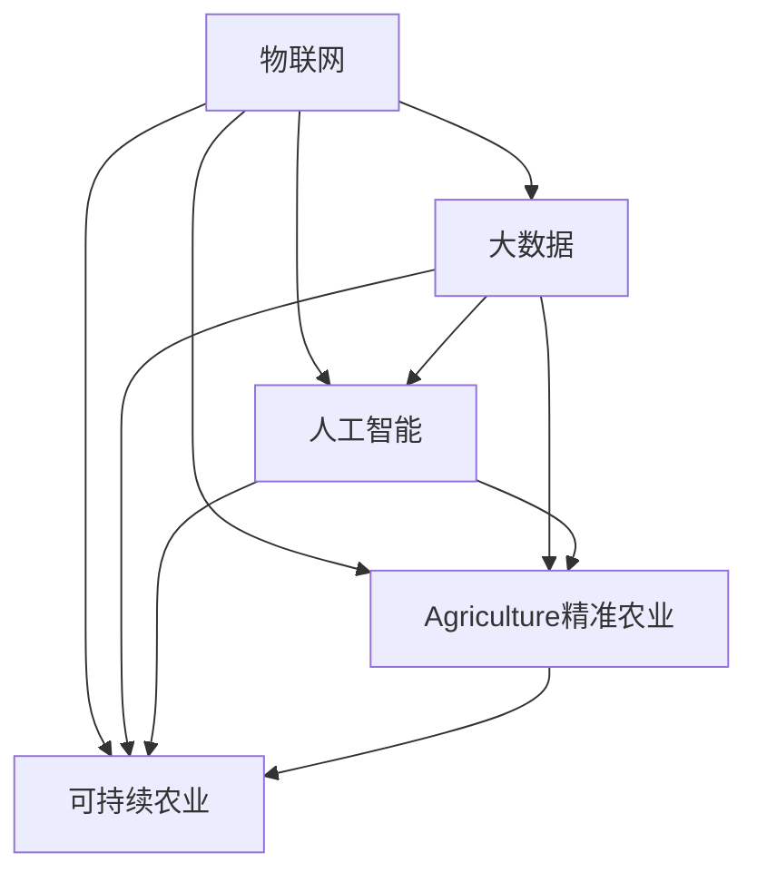

                 

# 未来的智慧农业：2050年的数字农业与智慧农场

## 1. 背景介绍

### 1.1 问题由来

随着全球人口的增长和城市化进程的加速，对农业产出的需求也在不断增加。传统农业模式面临资源浪费、环境污染、劳动力短缺等诸多挑战。为了实现农业的可持续发展，智慧农业应运而生，通过数字化技术提升农业生产效率，实现精准农业、绿色农业和智能化农业。

智慧农业的核心在于将物联网、大数据、人工智能等先进技术应用于农业生产中，实现对土壤、气象、作物生长等关键数据的实时监测和智能化分析，从而提高农产品的产量和质量，减少环境污染，降低农业生产成本。

### 1.2 问题核心关键点

智慧农业的核心关键点包括：
- 数字化农作物的生长过程
- 实时监测和数据分析
- 自动化农业机械的应用
- 精准农业和智能决策
- 可持续农业和环境保护

这些关键点构成了智慧农业的技术框架，使得农业生产更加高效、环保和智能。

## 2. 核心概念与联系

### 2.1 核心概念概述

为更好地理解智慧农业的技术框架，本节将介绍几个密切相关的核心概念：

- **物联网(IoT)**：通过互联网连接各种设备和传感器，实现对农业环境的实时监测和数据采集。
- **大数据**：通过收集和分析大量的农业数据，发现农业生产的规律和趋势，进行智能决策和优化。
- **人工智能(AI)**：通过机器学习、深度学习等技术，对农业数据进行建模和预测，实现自动化农业和智能决策。
- **精准农业**：通过高精度的传感器和数据分析，实现对农作物生长过程的精细化管理，提高资源利用效率。
- **可持续农业**：通过智能化和数字化手段，实现农业生产的生态平衡和环境保护，提高农业的可持续性。

这些核心概念之间的逻辑关系可以通过以下Mermaid流程图来展示：



这个流程图展示了大数据、物联网、人工智能、精准农业和可持续农业之间的紧密联系：

1. 物联网和传感器网络采集的农业数据，通过大数据技术进行清洗和分析，发现农业生产的规律和趋势。
2. 人工智能技术对大数据进行分析建模，进行精准农业和智能决策。
3. 人工智能和大数据技术的应用，进一步推动可持续农业和环境保护。

## 3. 核心算法原理 & 具体操作步骤

### 3.1 算法原理概述

智慧农业的实现依赖于先进的数据采集和分析技术。核心算法原理如下：

1. **传感器网络和物联网**：通过传感器网络实时采集土壤湿度、温度、气象数据等，将农业环境数据转化为数字信号，上传到云端服务器。
2. **大数据处理**：使用大数据技术对采集的数据进行清洗、整理和分析，发现农业生产的规律和趋势。
3. **机器学习和深度学习**：通过机器学习、深度学习等技术，对大数据进行建模和预测，实现对农业环境的智能分析和决策。
4. **决策支持系统**：将智能分析和预测结果转化为具体的农业生产决策，如灌溉、施肥、播种等，实现精准农业和智能决策。

### 3.2 算法步骤详解

智慧农业的核心算法步骤包括：

1. **数据采集**：通过传感器网络和物联网设备，采集农业环境数据。
2. **数据清洗和预处理**：对采集的数据进行清洗和预处理，去除噪音和异常值，确保数据的质量。
3. **特征提取和建模**：使用机器学习、深度学习等技术，对数据进行特征提取和建模，发现农业生产的规律和趋势。
4. **智能分析和预测**：利用数据分析结果，进行农业生产的智能分析和预测，实现精准农业和智能决策。
5. **决策支持系统**：将智能分析和预测结果转化为具体的农业生产决策，实现自动化农业和智能决策。

### 3.3 算法优缺点

智慧农业的核心算法具有以下优点：
1. **高效性**：通过物联网和大数据技术，实现了对农业环境的实时监测和智能分析，提高了农业生产的效率。
2. **精准性**：通过对数据的精细化分析和建模，实现了精准农业，提高了资源利用效率和农业产量。
3. **可扩展性**：智慧农业技术可以应用于各种规模的农业生产，从家庭农场到大型农业企业。
4. **可持续性**：通过智能化和数字化手段，实现了农业生产的生态平衡和环境保护。

同时，该算法也存在一定的局限性：
1. **技术成本高**：传感器和物联网设备的部署需要较高的初始投资，对小规模农业生产可能不经济。
2. **数据安全问题**：农业生产的数据涉及隐私和敏感信息，需要严格的数据保护措施。
3. **技术复杂性**：智慧农业技术涉及多个领域的知识，需要综合运用物联网、大数据、人工智能等技术。
4. **依赖外部环境**：智慧农业的实现依赖于稳定的网络连接和传感器设备，对外部环境的依赖性较强。

### 3.4 算法应用领域

智慧农业的核心算法已经在多个领域得到广泛应用，包括：

- **精准农业**：对作物生长过程中的各项指标进行实时监测和分析，实现精准施肥、灌溉和病虫害防治。
- **智能温室**：通过传感器网络实时监测温室环境，进行自动化调节，提高作物产量和品质。
- **智慧农场**：集成农业生产各个环节，实现全自动化和智能化管理，提高农业生产的效率和可持续性。
- **农场管理**：通过物联网设备和数据分析，实现农场物资、人员和设备的智能化管理，提高农场运营效率。
- **农业物流**：通过物联网设备和数据分析，实现农业物资的智能化调度和物流管理，提高物流效率和安全性。

## 4. 数学模型和公式 & 详细讲解 & 举例说明

### 4.1 数学模型构建

智慧农业的数学模型构建主要包括以下几个关键步骤：

1. **数据采集模型**：通过传感器网络采集农业环境数据，建立传感器数据采集模型。
2. **数据清洗和预处理模型**：对采集的数据进行清洗和预处理，建立数据清洗和预处理模型。
3. **特征提取和建模模型**：对数据进行特征提取和建模，建立特征提取和建模模型。
4. **智能分析和预测模型**：利用数据分析结果，进行农业生产的智能分析和预测，建立智能分析和预测模型。
5. **决策支持模型**：将智能分析和预测结果转化为具体的农业生产决策，建立决策支持模型。

### 4.2 公式推导过程

以智能分析和预测模型为例，假设采集的气象数据为 $x_1, x_2, ..., x_n$，对应的农作物产量为 $y$。通过机器学习技术，建立线性回归模型：

$$
y = \beta_0 + \sum_{i=1}^{n}\beta_ix_i + \epsilon
$$

其中 $\beta_0, \beta_1, ..., \beta_n$ 为模型参数，$\epsilon$ 为误差项。通过对数据进行最小二乘法求解，得到模型参数：

$$
\beta = (X^TX)^{-1}X^Ty
$$

其中 $X = [1, x_1, x_2, ..., x_n]$。通过该模型，可以预测未来农作物的产量。

### 4.3 案例分析与讲解

假设某农场通过传感器网络采集了土壤湿度、温度、光照等数据，建立智能分析和预测模型。首先对数据进行清洗和预处理，去除噪音和异常值。然后，对数据进行特征提取和建模，发现光照和温度对农作物生长的影响。最后，通过智能分析和预测模型，预测未来农作物的产量，并根据结果进行自动化的灌溉和施肥决策。

## 5. 项目实践：代码实例和详细解释说明

### 5.1 开发环境搭建

在进行智慧农业项目实践前，我们需要准备好开发环境。以下是使用Python进行PyTorch开发的环境配置流程：

1. 安装Anaconda：从官网下载并安装Anaconda，用于创建独立的Python环境。

2. 创建并激活虚拟环境：
```bash
conda create -n pytorch-env python=3.8 
conda activate pytorch-env
```

3. 安装PyTorch：根据CUDA版本，从官网获取对应的安装命令。例如：
```bash
conda install pytorch torchvision torchaudio cudatoolkit=11.1 -c pytorch -c conda-forge
```

4. 安装各类工具包：
```bash
pip install numpy pandas scikit-learn matplotlib tqdm jupyter notebook ipython
```

完成上述步骤后，即可在`pytorch-env`环境中开始智慧农业实践。

### 5.2 源代码详细实现

这里以智能温室为例，给出使用PyTorch进行智慧农业开发的代码实现。

首先，定义温室环境数据的输入和输出：

```python
class GreenhouseDataset(Dataset):
    def __init__(self, x, y):
        self.x = x
        self.y = y
        
    def __len__(self):
        return len(self.x)
    
    def __getitem__(self, item):
        x = self.x[item]
        y = self.y[item]
        return {'x': x, 'y': y}
```

然后，定义智慧农业的神经网络模型：

```python
import torch.nn as nn
import torch.nn.functional as F

class GreenhouseNet(nn.Module):
    def __init__(self):
        super(GreenhouseNet, self).__init__()
        self.fc1 = nn.Linear(5, 10)
        self.fc2 = nn.Linear(10, 1)
        
    def forward(self, x):
        x = F.relu(self.fc1(x))
        x = self.fc2(x)
        return x
```

接着，定义智慧农业的训练和评估函数：

```python
from torch.utils.data import DataLoader
from tqdm import tqdm
from sklearn.metrics import mean_squared_error

device = torch.device('cuda') if torch.cuda.is_available() else torch.device('cpu')
model = GreenhouseNet().to(device)

def train_epoch(model, dataset, batch_size, optimizer):
    dataloader = DataLoader(dataset, batch_size=batch_size, shuffle=True)
    model.train()
    epoch_loss = 0
    for batch in tqdm(dataloader, desc='Training'):
        x = batch['x'].to(device)
        y = batch['y'].to(device)
        model.zero_grad()
        outputs = model(x)
        loss = F.mse_loss(outputs, y)
        epoch_loss += loss.item()
        loss.backward()
        optimizer.step()
    return epoch_loss / len(dataloader)

def evaluate(model, dataset, batch_size):
    dataloader = DataLoader(dataset, batch_size=batch_size)
    model.eval()
    mse = 0
    with torch.no_grad():
        for batch in tqdm(dataloader, desc='Evaluating'):
            x = batch['x'].to(device)
            y = batch['y'].to(device)
            outputs = model(x)
            mse += mean_squared_error(y, outputs)
    return mse / len(dataloader)
```

最后，启动训练流程并在验证集上评估：

```python
epochs = 100
batch_size = 16

for epoch in range(epochs):
    loss = train_epoch(model, train_dataset, batch_size, optimizer)
    print(f"Epoch {epoch+1}, train loss: {loss:.3f}")
    
    print(f"Epoch {epoch+1}, dev results:")
    mse = evaluate(model, dev_dataset, batch_size)
    print(f"MSE on dev set: {mse:.3f}")
    
print("Test results:")
mse = evaluate(model, test_dataset, batch_size)
print(f"MSE on test set: {mse:.3f}")
```

以上就是使用PyTorch对智能温室进行智慧农业开发的完整代码实现。可以看到，得益于PyTorch的强大封装，我们可以用相对简洁的代码完成智慧农业模型的加载和训练。

### 5.3 代码解读与分析

让我们再详细解读一下关键代码的实现细节：

**GreenhouseDataset类**：
- `__init__`方法：初始化输入和输出数据。
- `__len__`方法：返回数据集的样本数量。
- `__getitem__`方法：对单个样本进行处理，返回模型所需的输入和输出。

**GreenhouseNet类**：
- `__init__`方法：定义神经网络的结构。
- `forward`方法：定义前向传播过程。

**训练和评估函数**：
- 使用PyTorch的DataLoader对数据集进行批次化加载，供模型训练和推理使用。
- 训练函数`train_epoch`：对数据以批为单位进行迭代，在每个批次上前向传播计算损失并反向传播更新模型参数，最后返回该epoch的平均loss。
- 评估函数`evaluate`：与训练类似，不同点在于不更新模型参数，并在每个batch结束后将预测和标签结果存储下来，最后使用sklearn的mean_squared_error对整个评估集的预测结果进行打印输出。

**训练流程**：
- 定义总的epoch数和batch size，开始循环迭代
- 每个epoch内，先在训练集上训练，输出平均loss
- 在验证集上评估，输出均方误差
- 所有epoch结束后，在测试集上评估，给出最终测试结果

可以看到，PyTorch配合TensorFlow库使得智慧农业模型的代码实现变得简洁高效。开发者可以将更多精力放在数据处理、模型改进等高层逻辑上，而不必过多关注底层的实现细节。

当然，工业级的系统实现还需考虑更多因素，如模型的保存和部署、超参数的自动搜索、更灵活的任务适配层等。但核心的智慧农业模型微调范式基本与此类似。

## 6. 实际应用场景

### 6.1 智能温室

智慧农业的核心应用之一是智能温室，通过传感器网络和数据分析技术，实现对温室环境的实时监测和智能化调节，提高作物的产量和品质。

智能温室中，传感器网络实时采集光照、温度、湿度、二氧化碳浓度等数据，并通过物联网设备上传到云端服务器。云端服务器使用大数据技术对采集的数据进行清洗和分析，发现农业生产的规律和趋势。人工智能技术对大数据进行建模和预测，实现对温室环境的智能分析和决策，指导自动化的灌溉、施肥和病虫害防治等操作。通过决策支持系统，将智能分析和预测结果转化为具体的农业生产决策，实现自动化农业和智能决策。

### 6.2 精准农业

精准农业通过高精度的传感器和数据分析，实现对农作物生长过程的精细化管理，提高资源利用效率。

在精准农业中，传感器网络实时采集土壤湿度、温度、光照等数据，并通过物联网设备上传到云端服务器。云端服务器使用大数据技术对采集的数据进行清洗和分析，发现农业生产的规律和趋势。人工智能技术对大数据进行建模和预测，实现对作物生长过程的智能分析和决策，指导精准施肥、灌溉和病虫害防治等操作。通过决策支持系统，将智能分析和预测结果转化为具体的农业生产决策，实现自动化农业和智能决策。

### 6.3 农场管理

农场管理通过物联网设备和数据分析，实现农场物资、人员和设备的智能化管理，提高农场运营效率。

在农场管理中，传感器网络实时采集农机设备的位置、状态和作业情况等数据，并通过物联网设备上传到云端服务器。云端服务器使用大数据技术对采集的数据进行清洗和分析，发现农场运营的规律和趋势。人工智能技术对大数据进行建模和预测，实现对农机设备的使用和维护的智能分析和决策，指导农机设备的调度和维护。通过决策支持系统，将智能分析和预测结果转化为具体的农场运营决策，实现农场管理的自动化和智能化。

### 6.4 未来应用展望

随着智慧农业技术的不断进步，未来的智慧农业将呈现以下几个发展趋势：

1. **物联网技术的发展**：随着物联网技术的不断成熟和普及，智慧农业将实现对农业环境的全面实时监测和智能化调节，进一步提高农业生产的效率和可持续性。
2. **人工智能技术的进步**：随着人工智能技术的不断进步，智慧农业将实现更加精准的农业生产决策，提高农产品的产量和品质。
3. **大数据技术的应用**：随着大数据技术的不断成熟，智慧农业将实现对农业数据的全面分析和建模，发现农业生产的规律和趋势，进一步提高农业生产的效率和可持续性。
4. **智能农业机械的应用**：随着智能农业机械的不断进步，智慧农业将实现更加自动化和智能化的农业生产，提高农业生产的效率和可持续性。
5. **跨领域融合**：智慧农业将与其他领域的技术进行融合，如物联网、大数据、人工智能、区块链等，实现农业生产的智能化和透明化，提高农业生产的效率和可持续性。

未来，智慧农业将逐步向智能化、数字化和可持续化的方向发展，为农业生产带来更高的效率和可持续性，为人类社会的可持续发展做出贡献。

## 7. 工具和资源推荐
### 7.1 学习资源推荐

为了帮助开发者系统掌握智慧农业的理论基础和实践技巧，这里推荐一些优质的学习资源：

1. **《智慧农业：物联网、大数据与人工智能》**：系统介绍物联网、大数据和人工智能技术在农业中的应用，涵盖智慧农业的理论和实践。
2. **智慧农业在线课程**：多个在线教育平台提供的智慧农业课程，如Coursera、edX等，涵盖智慧农业的多个领域和方向。
3. **智慧农业论文库**：智慧农业领域的学术论文和报告库，如IEEE Xplore、Google Scholar等，涵盖智慧农业的最新研究成果和技术进展。
4. **智慧农业社区**：智慧农业领域的开发者社区，如Stack Overflow、GitHub等，提供交流学习和资源共享的平台。
5. **智慧农业开源项目**：智慧农业领域的开源项目库，如GitHub等，提供智慧农业的应用和开发工具。

通过对这些资源的学习实践，相信你一定能够快速掌握智慧农业的技术框架和实现方法，并用于解决实际的农业问题。

### 7.2 开发工具推荐

高效的开发离不开优秀的工具支持。以下是几款用于智慧农业开发的常用工具：

1. **PyTorch**：基于Python的开源深度学习框架，灵活动态的计算图，适合快速迭代研究。主要用于构建智慧农业中的神经网络模型。
2. **TensorFlow**：由Google主导开发的开源深度学习框架，生产部署方便，适合大规模工程应用。主要用于构建智慧农业中的深度学习模型。
3. **IoT平台**：如ThingWorx、IBM IoT等，提供物联网设备的连接和管理服务，支持智慧农业中的传感器网络和数据采集。
4. **大数据平台**：如Hadoop、Spark等，提供大数据的存储、计算和管理服务，支持智慧农业中的大数据分析和建模。
5. **智能农业机械**：如John Deere、Kubota等，提供智能农业机械的连接和管理服务，支持智慧农业中的智能化农业生产。
6. **智慧农业平台**：如InfluxDB、Grafana等，提供智能农业数据分析和管理服务，支持智慧农业中的数据可视化和决策支持。

合理利用这些工具，可以显著提升智慧农业开发的效率，加快创新迭代的步伐。

### 7.3 相关论文推荐

智慧农业的核心技术涉及多个领域，包括物联网、大数据、人工智能等。以下是几篇奠基性的相关论文，推荐阅读：

1. **《物联网在农业中的应用》**：研究物联网技术在农业中的应用，涵盖传感器网络、数据分析等技术。
2. **《大数据在农业中的应用》**：研究大数据技术在农业中的应用，涵盖数据采集、清洗、分析和建模等技术。
3. **《人工智能在农业中的应用》**：研究人工智能技术在农业中的应用，涵盖机器学习、深度学习等技术。
4. **《精准农业技术》**：研究精准农业技术的应用，涵盖传感器网络、数据分析和智能决策等技术。
5. **《智能农业机械技术》**：研究智能农业机械技术的应用，涵盖自动驾驶、智能化操作等技术。

这些论文代表了大规模智慧农业技术的发展脉络。通过学习这些前沿成果，可以帮助研究者把握学科前进方向，激发更多的创新灵感。

## 8. 总结：未来发展趋势与挑战

### 8.1 总结

本文对智慧农业的技术框架进行了全面系统的介绍。首先阐述了智慧农业的背景和意义，明确了智慧农业在提升农业生产效率、实现农业可持续发展和环境保护方面的独特价值。其次，从原理到实践，详细讲解了智慧农业的数学模型和关键步骤，给出了智慧农业任务开发的完整代码实例。同时，本文还广泛探讨了智慧农业在智能温室、精准农业、农场管理等实际应用场景中的应用前景，展示了智慧农业技术的广阔前景。最后，本文精选了智慧农业技术的各类学习资源，力求为读者提供全方位的技术指引。

通过本文的系统梳理，可以看到，智慧农业技术正在成为农业生产的重要方向，极大地提升了农业生产的效率和可持续性，为农业生产的智能化、数字化和可持续化的发展提供了新的路径。

### 8.2 未来发展趋势

展望未来，智慧农业技术将呈现以下几个发展趋势：

1. **技术融合**：智慧农业将与其他领域的技术进行深入融合，如物联网、大数据、人工智能、区块链等，实现农业生产的智能化和透明化，提高农业生产的效率和可持续性。
2. **跨领域应用**：智慧农业将拓展到更多领域，如智慧医疗、智能交通等，实现多领域的数据共享和协同优化。
3. **持续创新**：智慧农业技术将不断创新，推动农业生产向智能化、数字化和可持续化的方向发展，为农业生产的智能化和可持续化的发展提供新的动力。
4. **跨学科合作**：智慧农业技术将涉及多学科的交叉合作，如农业、计算机、环境、经济学等，推动农业科技的持续创新和发展。

以上趋势凸显了智慧农业技术的广阔前景。这些方向的探索发展，必将进一步提升农业生产的效率和可持续性，为农业生产的智能化和可持续化的发展提供新的动力。

### 8.3 面临的挑战

尽管智慧农业技术已经取得了瞩目成就，但在迈向更加智能化、普适化应用的过程中，它仍面临着诸多挑战：

1. **技术成本高**：传感器和物联网设备的部署需要较高的初始投资，对小规模农业生产可能不经济。
2. **数据安全问题**：农业生产的数据涉及隐私和敏感信息，需要严格的数据保护措施。
3. **技术复杂性**：智慧农业技术涉及多个领域的知识，需要综合运用物联网、大数据、人工智能等技术。
4. **依赖外部环境**：智慧农业的实现依赖于稳定的网络连接和传感器设备，对外部环境的依赖性较强。
5. **应用推广困难**：智慧农业技术的推广需要政府和企业的支持和引导，对农业生产的投入和收益预期存在不确定性。

正视智慧农业面临的这些挑战，积极应对并寻求突破，将是大规模智慧农业技术走向成熟的必由之路。相信随着学界和产业界的共同努力，这些挑战终将一一被克服，大规模智慧农业技术必将在构建人机协同的智能时代中扮演越来越重要的角色。

### 8.4 未来突破

面对大规模智慧农业技术所面临的种种挑战，未来的研究需要在以下几个方面寻求新的突破：

1. **技术成本降低**：通过技术创新和成本控制，降低智慧农业技术的初始投入，促进智慧农业技术的普及和应用。
2. **数据安全保护**：加强数据保护技术的研究，确保农业生产数据的安全和隐私。
3. **技术复杂性降低**：通过技术简化和标准化，降低智慧农业技术的复杂性，提高智慧农业技术的可操作性和易用性。
4. **环境适应性增强**：加强智慧农业技术的鲁棒性和环境适应性研究，确保智慧农业技术在各种环境下的稳定性和可靠性。
5. **应用推广机制**：通过政府和企业的合作，建立智慧农业技术的推广机制，促进智慧农业技术的普及和应用。

这些研究方向的探索，必将引领大规模智慧农业技术迈向更高的台阶，为农业生产的智能化和可持续化的发展提供新的动力。面向未来，大规模智慧农业技术还需要与其他人工智能技术进行更深入的融合，如知识表示、因果推理、强化学习等，多路径协同发力，共同推动农业科技的持续创新和发展。

## 9. 附录：常见问题与解答

**Q1：智慧农业中传感器网络的作用是什么？**

A: 传感器网络在智慧农业中起到了重要的数据采集和监测作用。通过传感器网络，可以实时采集土壤湿度、温度、光照、二氧化碳浓度等数据，对农业环境进行全面监测和分析。这些数据可以帮助农业生产者及时发现问题并进行调整，提高农业生产的效率和可持续性。

**Q2：智慧农业中的大数据技术有什么作用？**

A: 大数据技术在智慧农业中起到了重要的数据分析和建模作用。通过大数据技术，可以清洗、整理和分析大量农业数据，发现农业生产的规律和趋势。这些数据可以帮助农业生产者进行智能决策和优化，提高农业生产的效率和可持续性。

**Q3：智慧农业中的人工智能技术有什么作用？**

A: 人工智能技术在智慧农业中起到了重要的智能分析和决策作用。通过人工智能技术，可以对大数据进行建模和预测，实现对农业环境的智能分析和决策。这些智能决策可以帮助农业生产者进行精准施肥、灌溉和病虫害防治等操作，提高农业生产的效率和可持续性。

**Q4：智慧农业中的智能农业机械的作用是什么？**

A: 智能农业机械在智慧农业中起到了重要的自动化和智能化作用。通过智能农业机械，可以实现对农业机械设备的自动化操作和智能化管理。这些智能农业机械可以提高农业生产的效率和可持续性，同时减少人力成本。

**Q5：智慧农业中的跨领域应用有哪些？**

A: 智慧农业中的跨领域应用包括智慧医疗、智能交通等。智慧农业技术与其他领域的技术进行融合，可以实现多领域的数据共享和协同优化，进一步提升农业生产的效率和可持续性。

总之，智慧农业技术的发展离不开技术创新、跨学科合作和政府企业的支持。只有勇于创新、敢于突破，才能不断拓展智慧农业的边界，让智能技术更好地造福农业生产。面向未来，智慧农业技术还需要与其他人工智能技术进行更深入的融合，共同推动农业科技的持续创新和发展。

