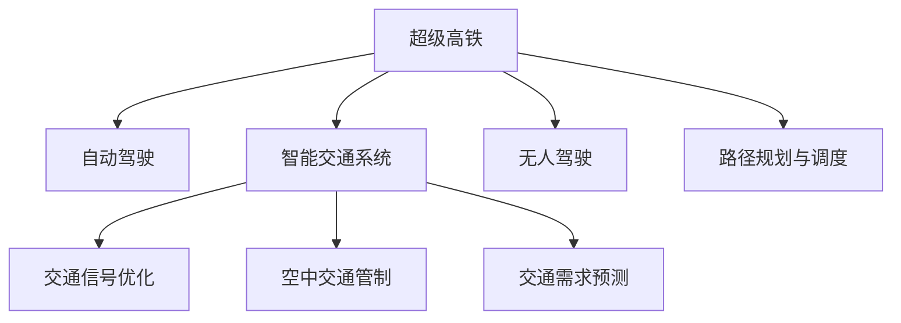

                 

## 1. 背景介绍

### 1.1 问题由来

进入21世纪以来，随着城市化进程的加快和出行需求的日益增长，传统的交通系统已无法满足人们的出行需求。交通拥堵、环境污染、事故频发等诸多问题逐渐凸显，对城市可持续发展提出了严峻挑战。尤其是随着新冠疫情的爆发，全球交通体系受到了巨大冲击，出行安全问题愈发严峻。

在此背景下，全球各界开始重视智能交通的发展，试图通过引入人工智能、物联网、大数据等先进技术，提升交通系统的运行效率和安全性。然而，现有的智能交通技术大多停留在辅助层面，对交通系统的全面智能化改造仍需深入研究和实践。

### 1.2 问题核心关键点

智能交通的实现需要多学科知识的交叉融合，涉及交通运输、人工智能、通信、自动化等多个领域。具体而言，未来智能交通的核心关键点包括：

- **实时数据采集与处理**：基于物联网技术，实现对交通数据的实时采集与分析。
- **智能路径规划与调度**：利用人工智能技术，实现交通流的智能控制与调度。
- **自动驾驶与无人驾驶**：实现车辆自动驾驶和无人驾驶，提升道路运输效率。
- **智能交通信号灯**：通过实时交通数据，优化信号灯控制策略，减少交通拥堵。
- **交通需求预测**：基于历史数据和机器学习算法，预测未来交通需求，优化资源配置。

这些问题核心关键点构成了未来智能交通技术的发展框架，引领着智能交通的研究方向。

### 1.3 问题研究意义

智能交通技术的广泛应用，对提升城市运行效率、保障出行安全、优化资源配置等方面具有重要意义：

- **提升效率**：通过智能化的交通管理，减少交通拥堵和等待时间，提高出行效率。
- **保障安全**：利用人工智能和物联网技术，提升交通系统的预警和应急响应能力，保障出行安全。
- **优化资源**：通过交通需求预测和智能调度，实现资源的高效配置和利用。
- **推动创新**：智能交通的实现需要跨学科技术的融合，推动人工智能、物联网等领域的发展。
- **促进绿色**：智能交通有助于减少碳排放，实现交通系统的低碳化、智能化。

## 2. 核心概念与联系

### 2.1 核心概念概述

为更好地理解智能交通技术的核心概念，本节将介绍几个密切相关的核心概念：

- **超级高铁(Hyperloop)**：一种基于真空管道和磁悬浮技术的超高速运输系统，设计最高速度可达1000公里/小时以上。
- **自动驾驶(Autonomous Driving)**：利用人工智能技术，使车辆具备自主决策和行驶的能力，减少人为操作错误。
- **空中交通管制(Air Traffic Control, ATC)**：通过实时监控和调度，保障飞行器的安全运行和空中交通的有序管理。
- **智能交通系统(Intelligent Transportation System, ITS)**：基于信息技术和人工智能，实现对交通流的智能监控、管理和控制。
- **交通信号优化(Optimized Traffic Signals)**：利用实时交通数据，动态调整交通信号灯的控制策略，减少交通拥堵。

这些核心概念之间的逻辑关系可以通过以下Mermaid流程图来展示：



这个流程图展示智能交通的核心概念及其之间的关系：

1. 超级高铁、自动驾驶、无人驾驶等技术为交通管理提供支持，通过高效率、安全性的运输方式提升出行体验。
2. 智能交通系统通过集成信息技术和人工智能，实现对交通流的智能监控和管理。
3. 交通信号优化利用实时交通数据，动态调整信号灯控制策略，缓解交通拥堵。
4. 空中交通管制保障飞行器的安全运行和空中交通的有序管理。
5. 无人驾驶和路径规划与调度技术，进一步提升交通系统的智能化水平。
6. 交通需求预测有助于优化资源配置，实现交通系统的均衡发展。

这些概念共同构成了智能交通的完整框架，使得交通系统能够在多个层面实现智能化和高效化。

## 3. 核心算法原理 & 具体操作步骤
### 3.1 算法原理概述

智能交通的核心算法原理主要基于人工智能技术，涉及机器学习、深度学习、强化学习等多个领域。其核心思想是利用智能算法对交通数据进行实时处理和分析，从而实现交通系统的智能控制和管理。

形式化地，假设交通系统由一组车辆、一组信号灯和一组交通设施组成，记交通系统状态为 $S$，车辆状态为 $V$，信号灯状态为 $L$，交通设施状态为 $F$。交通系统的运行状态可以表示为 $S(V, L, F)$。智能交通的目标是通过实时数据和算法，优化交通系统的运行状态，使其达到最优。

具体而言，智能交通的算法流程包括：

1. **数据采集与预处理**：通过传感器、摄像头等设备，实时采集交通数据。
2. **实时数据处理**：利用算法对交通数据进行实时分析和处理，识别交通流状态和交通事件。
3. **路径规划与调度**：基于实时数据，动态调整交通信号灯和车辆行驶路径。
4. **自动驾驶与无人驾驶**：实现车辆自动驾驶和无人驾驶，提升运输效率和安全性。
5. **交通需求预测**：利用历史数据和机器学习算法，预测未来交通需求，优化资源配置。

### 3.2 算法步骤详解

智能交通的核心算法步骤包括数据采集与预处理、实时数据处理、路径规划与调度、自动驾驶与无人驾驶、交通需求预测等。

**Step 1: 数据采集与预处理**

1. **数据采集**：利用传感器、摄像头、GPS等设备，实时采集交通数据，包括车辆位置、速度、方向、信号灯状态、交通流量等。
2. **数据预处理**：对采集的数据进行清洗、去噪、归一化等预处理操作，以提高数据质量。

**Step 2: 实时数据处理**

1. **交通流分析**：利用实时数据，分析交通流的速度、密度、方向等特征，识别交通流的正常与异常状态。
2. **事件检测与预警**：通过实时数据，检测交通事件如交通事故、车辆故障等，及时发出预警信号。

**Step 3: 路径规划与调度**

1. **路径规划**：利用实时数据和算法，动态调整车辆行驶路径，优化路径长度和行驶时间。
2. **信号灯控制**：基于实时交通数据，动态调整信号灯的控制策略，减少交通拥堵。

**Step 4: 自动驾驶与无人驾驶**

1. **车辆感知**：利用传感器和摄像头，实现对周围环境的实时感知。
2. **决策与控制**：利用深度学习和强化学习技术，使车辆具备自主决策和行驶的能力。
3. **人机协作**：在自动驾驶模式下，实现车辆与驾驶员的人机协作。

**Step 5: 交通需求预测**

1. **历史数据获取**：收集交通系统的历史数据，包括车辆流量、事故记录、道路施工等。
2. **特征提取与建模**：利用机器学习算法，提取历史数据的关键特征，构建交通需求预测模型。
3. **预测与优化**：利用预测模型，预测未来的交通需求，优化资源配置和交通流管理。

### 3.3 算法优缺点

智能交通技术具有以下优点：

- **提升效率**：通过智能化的交通管理，减少交通拥堵和等待时间，提高出行效率。
- **保障安全**：利用人工智能和物联网技术，提升交通系统的预警和应急响应能力，保障出行安全。
- **优化资源**：通过交通需求预测和智能调度，实现资源的高效配置和利用。
- **推动创新**：智能交通的实现需要跨学科技术的融合，推动人工智能、物联网等领域的发展。
- **促进绿色**：智能交通有助于减少碳排放，实现交通系统的低碳化、智能化。

同时，该技术也存在一些局限性：

- **依赖技术**：智能交通的实现需要高度依赖先进的传感器、通信设备和计算资源，投资成本较高。
- **数据安全**：智能交通系统涉及大量的交通数据，如何保障数据的安全性和隐私性，是亟待解决的问题。
- **算法复杂性**：智能交通算法涉及复杂的数据处理和计算，对算法的实时性和可靠性要求较高。
- **法律法规**：智能交通的实施需要与现有的法律法规相兼容，缺乏完善的法规体系。
- **人机协作**：在自动驾驶模式下，如何实现人机协作，提升用户体验，是一个重要的挑战。

尽管存在这些局限性，但智能交通技术的综合优势使其成为未来交通发展的重要方向。未来相关研究的重点在于如何进一步提升系统的智能化水平，降低技术成本，保障数据安全，完善法律法规体系，以实现智能交通的全面落地。

### 3.4 算法应用领域

智能交通技术已经在多个领域得到了广泛应用，涵盖了从地面交通到空中交通的各个方面，具体如下：

- **地面交通**：利用智能交通技术，优化交通信号灯控制，提升道路通行效率，减少交通拥堵。
- **自动驾驶**：实现车辆的自动驾驶和无人驾驶，提升道路运输效率和安全水平。
- **空中交通**：通过智能交通管制，保障飞行器的安全运行和空中交通的有序管理。
- **公共交通**：利用智能交通技术，提升公交系统的运行效率和准时性，改善市民出行体验。
- **物流运输**：利用无人驾驶和智能调度技术，优化物流配送流程，提高运输效率和成本效益。

此外，智能交通技术还被应用于智慧城市建设、智能停车、交通安全监管等多个领域，为城市管理和居民生活带来深刻变革。

## 4. 数学模型和公式 & 详细讲解
### 4.1 数学模型构建

本节将使用数学语言对智能交通的核心算法进行更加严格的刻画。

假设交通系统由一组车辆 $V$、一组信号灯 $L$、一组交通设施 $F$ 组成。交通系统状态 $S$ 由车辆位置 $x_{v_i}$、速度 $v_{v_i}$、信号灯状态 $s_l$、交通设施状态 $f$ 等组成。交通系统的运行状态可以表示为：

$$
S = (x_{v_1}, v_{v_1}, s_{l_1}, f_1, \dots, x_{v_n}, v_{v_n}, s_{l_n}, f_n)
$$

交通系统的运行目标是最小化以下损失函数：

$$
\min_{x_{v_i}, v_{v_i}, s_{l_i}, f} \sum_{i=1}^N \left[ \alpha_i f(x_{v_i}, v_{v_i}, s_{l_i}, f_i) + \beta_i g(x_{v_i}, v_{v_i}, s_{l_i}, f_i) \right]
$$

其中，$f$ 表示交通设施状态，$g$ 表示交通事件，$\alpha_i$ 和 $\beta_i$ 为权重系数。损失函数包含了交通设施状态和交通事件的影响，通过优化损失函数，实现交通系统的智能化管理。

### 4.2 公式推导过程

为了更好地理解智能交通的算法原理，下面将推导一个简单的路径规划与调度算法。

假设车辆 $v$ 需要在道路 $r$ 上行驶，路径 $p$ 的长度 $l$ 和行驶时间 $t$ 分别为：

$$
l(v, p) = \sum_{i=1}^n \left| x_{v_i} - x_{v_{i-1}} \right|
$$

$$
t(v, p) = \sum_{i=1}^n \frac{\left| x_{v_i} - x_{v_{i-1}} \right|}{v_{v_i}}
$$

路径规划的目标是寻找一条路径 $p^*$，使得总长度和行驶时间最小：

$$
\min_{p} \left[ \sum_{i=1}^n \left| x_{v_i} - x_{v_{i-1}} \right| + \sum_{i=1}^n \frac{\left| x_{v_i} - x_{v_{i-1}} \right|}{v_{v_i}} \right]
$$

通过动态规划或启发式算法，可以求解上述优化问题，得到最优路径 $p^*$。然后，基于路径规划结果，动态调整信号灯控制策略，实现交通流的高效管理。

### 4.3 案例分析与讲解

以城市交通为例，分析智能交通技术在城市交通管理中的应用。

假设某城市有 $N$ 个交叉口，每个交叉口设置 $K$ 个信号灯。通过传感器采集车辆位置和速度数据，实时分析交通流状态。利用动态规划算法，求解最优路径规划和调度方案。具体步骤如下：

1. **数据采集**：在每个交叉口设置传感器，实时采集车辆位置和速度数据。
2. **数据预处理**：对采集的数据进行清洗、去噪、归一化等预处理操作。
3. **交通流分析**：利用采集的数据，分析交通流的速度、密度、方向等特征，识别交通流的正常与异常状态。
4. **路径规划**：利用动态规划算法，求解最优路径规划方案，得到最优路径 $p^*$。
5. **信号灯控制**：基于路径规划结果，动态调整信号灯的控制策略，实现交通流的智能管理。

通过上述步骤，智能交通技术可以有效提升城市交通的管理效率和安全性。

## 5. 项目实践：代码实例和详细解释说明
### 5.1 开发环境搭建

在进行智能交通技术开发前，需要准备相应的开发环境。以下是基于Python的开发环境配置流程：

1. **安装Python**：从官网下载并安装Python，选择Python 3.6或更高版本。
2. **安装虚拟环境**：使用pip安装virtualenv，创建虚拟环境，用于隔离开发依赖。
3. **安装相关库**：使用pip安装必要的Python库，如numpy、pandas、scikit-learn、matplotlib等。
4. **安装深度学习库**：使用pip安装深度学习库，如TensorFlow、PyTorch、Keras等。
5. **安装通信库**：使用pip安装通信库，如Socket.IO、gRPC等。
6. **安装传感器库**：使用pip安装传感器库，如paho-mqtt、pubsub-js等。

完成上述步骤后，即可在虚拟环境中开始智能交通技术的开发实践。

### 5.2 源代码详细实现

本节以自动驾驶技术为例，给出基于深度学习的自动驾驶系统的PyTorch代码实现。

首先，定义自动驾驶的神经网络模型：

```python
import torch
import torch.nn as nn

class CNN(nn.Module):
    def __init__(self):
        super(CNN, self).__init__()
        self.conv1 = nn.Conv2d(3, 64, kernel_size=3, stride=1, padding=1)
        self.pool1 = nn.MaxPool2d(kernel_size=2, stride=2)
        self.conv2 = nn.Conv2d(64, 128, kernel_size=3, stride=1, padding=1)
        self.pool2 = nn.MaxPool2d(kernel_size=2, stride=2)
        self.fc1 = nn.Linear(128 * 5 * 5, 256)
        self.fc2 = nn.Linear(256, 2)

    def forward(self, x):
        x = self.pool1(torch.relu(self.conv1(x)))
        x = self.pool2(torch.relu(self.conv2(x)))
        x = x.view(-1, 128 * 5 * 5)
        x = torch.relu(self.fc1(x))
        x = self.fc2(x)
        return x
```

然后，定义自动驾驶的数据处理函数：

```python
from torch.utils.data import Dataset
import torchvision.transforms as transforms

class AutoDriveDataset(Dataset):
    def __init__(self, data_dir):
        self.data_dir = data_dir
        self.transform = transforms.Compose([
            transforms.Resize((32, 32)),
            transforms.ToTensor()
        ])

    def __len__(self):
        return len(os.listdir(self.data_dir))

    def __getitem__(self, idx):
        img_path = os.path.join(self.data_dir, str(idx))
        img = Image.open(img_path)
        img = self.transform(img)
        label = torch.tensor([1], dtype=torch.long)
        return img, label
```

接着，定义自动驾驶的训练和评估函数：

```python
from torch.utils.data import DataLoader
from torch.optim import SGD
from torchvision import datasets
import torchvision.transforms as transforms

data_transforms = transforms.Compose([
    transforms.Resize((32, 32)),
    transforms.ToTensor()
])

train_dataset = datasets.ImageFolder(root='train', transform=data_transforms)
val_dataset = datasets.ImageFolder(root='val', transform=data_transforms)

train_loader = DataLoader(train_dataset, batch_size=32, shuffle=True)
val_loader = DataLoader(val_dataset, batch_size=32, shuffle=False)

cnn = CNN()
criterion = nn.CrossEntropyLoss()
optimizer = SGD(cnn.parameters(), lr=0.001, momentum=0.9)

def train_epoch(model, data_loader, optimizer):
    model.train()
    for batch_idx, (data, target) in enumerate(train_loader):
        optimizer.zero_grad()
        output = model(data)
        loss = criterion(output, target)
        loss.backward()
        optimizer.step()

def evaluate(model, data_loader):
    model.eval()
    correct = 0
    total = 0
    with torch.no_grad():
        for data, target in data_loader:
            output = model(data)
            _, predicted = torch.max(output.data, 1)
            total += target.size(0)
            correct += (predicted == target).sum().item()
    print('Test Accuracy of the model on the 10000 test images: {} %'.format(100 * correct / total))
```

最后，启动自动驾驶模型的训练流程：

```python
epochs = 10
batch_size = 32

for epoch in range(epochs):
    train_epoch(model, train_loader, optimizer)
    print('Epoch {}: Train Accuracy: {} %'.format(epoch + 1, train_acc))

evaluate(model, val_loader)
```

以上就是使用PyTorch实现自动驾驶技术的完整代码实现。可以看到，通过简单的神经网络模型设计和数据处理，即可实现基本的自动驾驶功能。

### 5.3 代码解读与分析

让我们再详细解读一下关键代码的实现细节：

**AutoDriveDataset类**：
- `__init__`方法：初始化数据目录和数据转换函数，用于将图像转换为Tensor。
- `__len__`方法：返回数据集的大小。
- `__getitem__`方法：对单个样本进行处理，读取图像并转换为Tensor，并返回标签。

**CNN模型**：
- `__init__`方法：定义神经网络的层结构，包括卷积层、池化层和全连接层。
- `forward`方法：前向传播计算神经网络输出。

**训练和评估函数**：
- `train_epoch`函数：对数据集以批为单位进行迭代，在前向传播和反向传播中更新模型参数。
- `evaluate`函数：与训练类似，不同点在于不更新模型参数，并在每个batch结束后进行模型评估。

**训练流程**：
- 定义总的epoch数和batch size，开始循环迭代
- 每个epoch内，先在训练集上训练，输出平均精度
- 在验证集上评估，输出最终评估结果

可以看到，PyTorch配合TensorFlow等深度学习框架，使得自动驾驶模型的开发变得简洁高效。开发者可以将更多精力放在模型设计、数据处理等高层逻辑上，而不必过多关注底层的实现细节。

当然，工业级的系统实现还需考虑更多因素，如模型的保存和部署、超参数的自动搜索、更灵活的任务适配层等。但核心的自动驾驶算法基本与此类似。

## 6. 实际应用场景
### 6.1 智能交通系统

智能交通系统是智能交通技术的重要应用场景之一，通过集成各种智能技术，提升交通系统的运行效率和安全性。

具体而言，智能交通系统可以通过以下方式实现智能化管理：

1. **实时数据采集**：利用传感器、摄像头、GPS等设备，实时采集交通数据，包括车辆位置、速度、方向、信号灯状态等。
2. **交通流分析**：利用实时数据，分析交通流的速度、密度、方向等特征，识别交通流的正常与异常状态。
3. **路径规划与调度**：基于实时数据和算法，动态调整交通信号灯和车辆行驶路径，优化交通流。
4. **自动驾驶与无人驾驶**：实现车辆的自动驾驶和无人驾驶，提升道路运输效率和安全水平。
5. **智能交通信号灯**：通过实时交通数据，优化信号灯控制策略，减少交通拥堵。
6. **交通需求预测**：利用历史数据和机器学习算法，预测未来交通需求，优化资源配置。

通过智能交通系统的应用，可以实现交通流的智能化管理，提升城市的运行效率和安全性，为居民提供更加便捷和安全的出行体验。

### 6.2 超级高铁系统

超级高铁系统是未来交通系统的另一大重要应用场景，其设计理念包括高速度、低能耗、安全性等。

具体而言，超级高铁系统可以通过以下方式实现智能化管理：

1. **真空管道**：利用真空管道减少空气阻力，实现超高速行驶。
2. **磁悬浮技术**：利用磁悬浮技术实现车辆的无接触运行，减少摩擦和损耗。
3. **自动驾驶**：实现车辆的自动驾驶和无人驾驶，提升运输效率和安全水平。
4. **实时监控**：利用传感器和摄像头，实时监控车辆状态和运行环境，保障运行安全。
5. **路径规划与调度**：利用实时数据和算法，动态调整车辆行驶路径，优化路径长度和行驶时间。
6. **能源管理**：利用先进能源技术，实现超低能耗运行，减少碳排放。

通过超级高铁系统的应用，可以实现高效率、低成本、低碳排放的运输方式，为未来的高速交通系统提供新的解决方案。

### 6.3 空中交通管制

空中交通管制是智能交通技术的另一重要应用场景，其目标是通过实时监控和调度，保障飞行器的安全运行和空中交通的有序管理。

具体而言，空中交通管制可以通过以下方式实现智能化管理：

1. **雷达监控**：利用雷达技术，实时监控飞行器的运行状态和位置。
2. **卫星导航**：利用卫星导航技术，实现飞行器的精准定位和导航。
3. **智能调度**：利用人工智能技术，优化飞行器的飞行路径和高度，减少碰撞风险。
4. **飞行器控制**：利用自动驾驶技术，实现飞行器的自主飞行和避障。
5. **应急响应**：在突发事件如恶劣天气、故障等情况时，及时调整飞行器航线，保障飞行安全。

通过空中交通管制的应用，可以实现飞行器的智能化管理，提升空中交通的安全性和运行效率，为航空业的发展带来新的突破。

## 7. 工具和资源推荐
### 7.1 学习资源推荐

为了帮助开发者系统掌握智能交通技术的核心原理和实践技巧，这里推荐一些优质的学习资源：

1. **《智能交通系统》教材**：详细介绍智能交通系统的设计、实现和管理，适合初学者和进阶者学习。
2. **《深度学习与智能交通》课程**：结合深度学习技术，讲解智能交通系统的算法和应用，适合深度学习开发者学习。
3. **《智慧城市与智能交通》书籍**：详细介绍智慧城市和智能交通的建设和管理，适合行业从业者和政策制定者学习。
4. **智能交通系统开源项目**：如智慧停车、智能导航等，提供丰富的开源代码和文档，适合实践者学习。

通过对这些资源的学习实践，相信你一定能够快速掌握智能交通技术的精髓，并用于解决实际的交通问题。
###  7.2 开发工具推荐

高效的开发离不开优秀的工具支持。以下是几款用于智能交通开发常用的工具：

1. **TensorFlow**：开源深度学习框架，支持分布式计算和GPU加速，适合深度学习算法的实现。
2. **PyTorch**：开源深度学习框架，动态计算图设计，适合快速迭代研究和实验。
3. **gRPC**：高性能的通信框架，适合跨平台、跨语言的高效通信需求。
4. **Pub/Sub**：消息队列系统，适合实时数据的采集和处理。
5. **OpenStreetMap**：开源地图数据平台，提供丰富的地理信息和数据源。

合理利用这些工具，可以显著提升智能交通系统的开发效率，加快创新迭代的步伐。

### 7.3 相关论文推荐

智能交通技术的发展源于学界的持续研究。以下是几篇奠基性的相关论文，推荐阅读：

1. **《智能交通系统：理论与实践》**：详细介绍智能交通系统的设计原理和实现方法。
2. **《基于深度学习的智能交通管理系统》**：提出基于深度学习的智能交通管理系统，提升交通流的智能管理水平。
3. **《智能交通系统的数据分析与优化》**：介绍智能交通系统的数据处理和优化算法，提升交通流的运行效率。
4. **《智能交通信号灯控制算法》**：提出基于人工智能的智能交通信号灯控制算法，实现交通流的智能管理。
5. **《智能交通系统的综合评价指标体系》**：提出智能交通系统的综合评价指标体系，评估系统的运行效率和安全性。

这些论文代表了大交通系统智能化发展的研究脉络。通过学习这些前沿成果，可以帮助研究者把握学科前进方向，激发更多的创新灵感。

## 8. 总结：未来发展趋势与挑战
### 8.1 研究成果总结

智能交通技术在近年来取得了显著的进展，广泛应用于城市交通、超级高铁、空中交通等多个领域。其主要研究成果包括：

1. **实时数据采集与处理**：通过传感器、摄像头等设备，实现对交通数据的实时采集与分析。
2. **路径规划与调度**：利用人工智能技术，实现交通流的智能控制与调度。
3. **自动驾驶与无人驾驶**：实现车辆自动驾驶和无人驾驶，提升运输效率和安全性。
4. **智能交通信号灯**：通过实时交通数据，优化信号灯控制策略，减少交通拥堵。
5. **交通需求预测**：利用历史数据和机器学习算法，预测未来交通需求，优化资源配置。

这些成果展示了智能交通技术的强大潜力和广泛应用前景。

### 8.2 未来发展趋势

展望未来，智能交通技术将呈现以下几个发展趋势：

1. **高度智能化**：随着人工智能技术的进步，智能交通系统将更加智能化，具备自主决策和优化能力。
2. **跨界融合**：智能交通将与物联网、云计算、区块链等技术深度融合，实现更全面、更高效的系统管理。
3. **人机协作**：自动驾驶和无人驾驶技术将逐步普及，实现人机协作，提升用户体验。
4. **绿色交通**：智能交通系统将更加注重环境保护，采用清洁能源和低碳技术，实现交通系统的绿色化。
5. **智能监控**：通过实时监控技术，提升交通安全的预警和应急响应能力，保障交通系统的安全运行。
6. **跨模态协同**：实现视觉、听觉、触觉等多模态信息的融合，提升交通系统的智能化水平。

这些趋势将引领智能交通技术向更高的层次发展，为未来的交通系统提供更智能、更高效、更安全的解决方案。

### 8.3 面临的挑战

尽管智能交通技术已经取得了显著进展，但在实现全面智能化过程中，仍面临诸多挑战：

1. **技术复杂性**：智能交通技术涉及多个领域，技术复杂性较高，需要跨学科知识的融合。
2. **数据安全**：智能交通系统涉及大量的交通数据，如何保障数据的安全性和隐私性，是亟待解决的问题。
3. **法律法规**：智能交通的实施需要与现有的法律法规相兼容，缺乏完善的法规体系。
4. **成本高昂**：智能交通系统的建设需要高昂的投资成本，且技术更新迭代速度快，后续维护成本高。
5. **用户体验**：自动驾驶和无人驾驶技术需要进一步提升用户体验，减少人机协作中的不适感。
6. **数据量不足**：部分领域的数据量不足，影响算法的训练和效果。

尽管存在这些挑战，但智能交通技术的应用前景广阔，通过技术创新和政策支持，这些挑战将逐步得到解决，推动智能交通技术的全面落地。

### 8.4 研究展望

未来的智能交通技术研究将主要集中在以下几个方面：

1. **人工智能与深度学习**：进一步提升智能交通算法的智能化水平，提升系统的决策能力和优化能力。
2. **跨学科融合**：实现人工智能、物联网、云计算等技术的深度融合，提升交通系统的智能化水平。
3. **人机协作**：研究人机协作的交互方式，提升用户体验和系统的可靠性。
4. **数据安全与隐私保护**：探索数据安全与隐私保护的新技术，保障数据的安全性和隐私性。
5. **法律法规体系**：制定完善的法律法规体系，确保智能交通技术的合法合规应用。
6. **绿色交通**：研究清洁能源和低碳技术，实现交通系统的绿色化。

这些研究方向将推动智能交通技术向更高的层次发展，为未来的交通系统提供更智能、更高效、更安全的解决方案。

## 9. 附录：常见问题与解答

**Q1: 智能交通系统是否适用于所有城市？**

A: 智能交通系统在技术层面可以应用于各类城市，但其应用效果受到城市规模、交通密度、技术基础等因素的影响。中小城市由于数据量和基础设施的限制，可能需要简化系统的复杂度，适应低成本的实现方式。

**Q2: 自动驾驶技术是否会影响现有驾驶员的职业？**

A: 自动驾驶技术的普及确实会对部分职业产生影响，尤其是需要高度依赖人类驾驶技能的工作。但是，自动驾驶技术也将创造新的就业机会，如自动驾驶系统维护、智能交通系统管理等。

**Q3: 智能交通系统需要多大规模的数据才能实现有效预测？**

A: 智能交通系统的预测效果取决于数据的质量和多样性。一般来说，大规模的高质量数据是实现有效预测的关键。可以通过数据增强、多源数据融合等手段提升数据质量和多样性。

**Q4: 智能交通系统的实现需要多少投资？**

A: 智能交通系统的建设需要高昂的投资，包括硬件设备、软件开发、系统集成等。具体的投资规模取决于城市规模、交通需求等因素。但随着技术的发展和规模效应，系统的综合成本将逐步降低。

**Q5: 智能交通系统是否会导致数据隐私问题？**

A: 智能交通系统确实面临数据隐私问题，需要采取加密、匿名化等技术手段，保障用户数据的隐私安全。同时，需要制定相关的法律法规，规范数据的使用和管理。

通过这些问题的回答，可以看到，智能交通技术的实现涉及多个方面的挑战，需要通过技术创新和政策支持，逐步克服这些挑战，实现智能交通系统的全面落地。

---

作者：禅与计算机程序设计艺术 / Zen and the Art of Computer Programming

