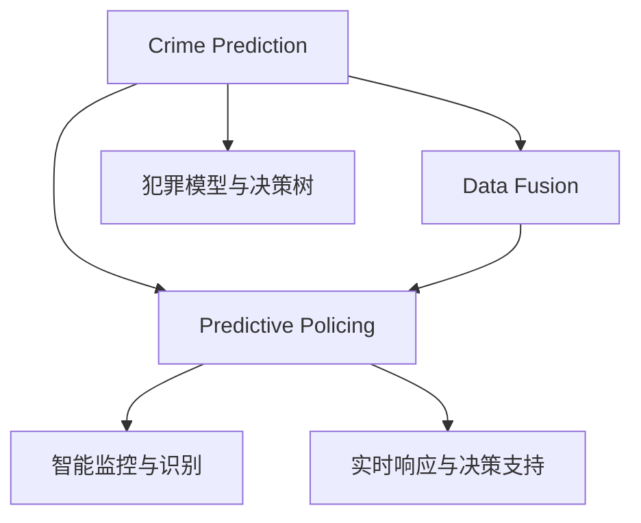

                 

# 未来的智能安防：2050年的Crime Prediction与Predictive Policing

> 关键词：人工智能,机器学习,预测性警务,智能安防,犯罪预防,未来科技,警务智能化,算法优化,犯罪预测模型

## 1. 背景介绍

随着人工智能技术的迅猛发展，未来社会的安防系统将更加智能化、精准化和高效化。尤其是在2050年，智能安防系统将成为社会治安防控的重要基础设施。本文将深入探讨未来的智能安防系统，特别是2050年的Crime Prediction与Predictive Policing，以及这些技术将如何影响我们的日常生活。

### 1.1 问题由来

当今世界，犯罪活动日益复杂多样，传统的警务模式已经难以应对。尤其是恐怖主义、网络犯罪等新型犯罪形式，对社会治安造成了巨大威胁。为此，各国纷纷投资建设智能安防系统，以提高警务效率和治安防范能力。但是，传统的警务模式还存在数据孤岛、反应迟缓、处理效率低下等问题。这些问题亟需通过先进的AI技术来解决。

### 1.2 问题核心关键点

智能安防系统是未来警务的重要组成部分。其核心关键点包括：

1. **Crime Prediction**：利用大数据、人工智能等技术，预测潜在的犯罪活动，提前进行防范。
2. **Predictive Policing**：通过分析历史犯罪数据和实时数据，预测犯罪趋势和警情，指导警力部署和资源配置。
3. **数据融合与共享**：实现跨部门、跨区域的数据共享，打破信息孤岛，提高警务协同效率。
4. **智能监控与识别**：利用人脸识别、行为分析等技术，实时监控和识别可疑人员和行为。
5. **实时响应与决策支持**：基于预测分析，快速响应警情，提供决策支持，提升警务响应效率。

## 2. 核心概念与联系

### 2.1 核心概念概述

为更好地理解未来的智能安防系统，本节将介绍几个核心概念：

- **Crime Prediction**：利用机器学习算法，对历史犯罪数据进行分析，预测未来可能发生的犯罪活动。
- **Predictive Policing**：通过分析预测结果，指导警力部署和资源配置，提高警务响应效率。
- **AI驱动的智能安防**：结合计算机视觉、自然语言处理、深度学习等技术，构建智能化的安防系统。
- **数据融合与分析**：将多源异构数据整合，进行综合分析和挖掘，提高预测精度。
- **犯罪模型与决策树**：构建基于犯罪特征的预测模型和决策树，优化警务决策过程。

这些核心概念之间的逻辑关系可以通过以下Mermaid流程图来展示：



这个流程图展示了几大核心概念及其之间的关系：

1. **Crime Prediction**：从历史犯罪数据中学习规律，进行未来预测。
2. **Data Fusion**：整合多源数据，提高预测精度。
3. **Predictive Policing**：基于预测结果，指导警力部署和资源配置。
4. **智能监控与识别**：实时监控和识别可疑行为，辅助预测分析。
5. **实时响应与决策支持**：根据预测和监控结果，快速响应警情，优化决策。
6. **犯罪模型与决策树**：构建犯罪预测模型和决策树，提升预测效果。

## 3. 核心算法原理 & 具体操作步骤

### 3.1 算法原理概述

未来的智能安防系统将基于Crime Prediction和Predictive Policing两大核心算法，通过AI技术实现预测与防范。其核心思想是：利用历史和实时数据，构建犯罪预测模型，并通过预测结果指导警力部署和资源配置，提升警务响应效率。

### 3.2 算法步骤详解

#### 3.2.1 数据准备

智能安防系统需要大量的历史和实时数据。数据准备过程包括：

1. **数据收集**：从各个警务系统、社交媒体、城市监控系统等收集数据。
2. **数据清洗**：处理缺失值、异常值等，确保数据质量。
3. **数据整合**：将多源数据进行整合，消除数据孤岛。
4. **数据标注**：为数据打上标签，如犯罪类型、时间、地点等。

#### 3.2.2 模型训练

1. **特征工程**：从原始数据中提取特征，如时间、地点、天气、犯罪类型等。
2. **模型选择**：选择合适的机器学习模型，如随机森林、支持向量机、神经网络等。
3. **模型训练**：利用历史犯罪数据进行模型训练，优化模型参数。
4. **模型验证**：在验证集上评估模型性能，选择最优模型。

#### 3.2.3 预测与部署

1. **预测生成**：利用训练好的模型对实时数据进行预测，生成警情预测结果。
2. **警力部署**：根据预测结果，调整警力部署和资源配置。
3. **实时监控**：结合智能监控系统，实时监控和识别可疑行为。
4. **决策支持**：提供决策支持工具，辅助警务决策。

### 3.3 算法优缺点

#### 3.3.1 优点

1. **预测精度高**：通过历史和实时数据的融合，可以提高预测精度，提前防范潜在犯罪。
2. **警务响应快**：利用预测结果，指导警力部署和资源配置，提高警务响应速度。
3. **资源利用高效**：优化警力部署和资源配置，减少资源浪费。
4. **数据融合能力强**：整合多源异构数据，提高分析精度。

#### 3.3.2 缺点

1. **数据依赖强**：预测结果高度依赖于历史和实时数据的准确性和完整性。
2. **隐私风险**：收集和处理大量数据，可能涉及隐私问题。
3. **算法复杂度高**：模型训练和预测需要较高的计算资源。
4. **模型可解释性不足**：深度学习模型缺乏可解释性，难以理解和解释预测结果。

### 3.4 算法应用领域

未来的智能安防系统将在多个领域得到广泛应用，包括：

1. **城市治安**：通过预测和监控，提升城市治安水平，防范恐怖主义、暴力犯罪等。
2. **网络安全**：预测网络攻击和恶意行为，及时采取防御措施。
3. **公共安全**：预测自然灾害、公共卫生事件等，提前做好防范。
4. **交通管理**：预测交通拥堵和交通事故，优化交通管理。
5. **能源安全**：预测能源供应和需求，保障能源安全。

## 4. 数学模型和公式 & 详细讲解 & 举例说明

### 4.1 数学模型构建

本节将使用数学语言对未来的智能安防系统进行严格描述。

假设智能安防系统收集的历史犯罪数据为 $D=\{(x_i,y_i)\}_{i=1}^N$，其中 $x_i$ 为特征向量，$y_i$ 为犯罪标签。模型的目标是为新数据 $x^*$ 预测犯罪概率 $p(y_i=1|x^*)$。

### 4.2 公式推导过程

#### 4.2.1 逻辑回归模型

逻辑回归模型是最常用的预测模型之一，其公式如下：

$$
p(y_i=1|x_i) = \sigma(\theta^Tx_i)
$$

其中 $\sigma(z) = \frac{1}{1+e^{-z}}$ 为sigmoid函数，$\theta$ 为模型参数，$x_i$ 为特征向量。

### 4.3 案例分析与讲解

以预测一个社区的犯罪率为例：

1. **数据准备**：收集社区的历史犯罪数据，包括时间、地点、天气、犯罪类型等。
2. **特征工程**：提取社区特征，如人口密度、交通便利度、社区监控覆盖率等。
3. **模型训练**：选择逻辑回归模型，利用历史犯罪数据进行训练，优化模型参数。
4. **预测生成**：利用训练好的模型对新数据进行预测，生成社区犯罪率预测结果。
5. **警力部署**：根据预测结果，调整社区警力部署和资源配置。

## 5. 项目实践：代码实例和详细解释说明

### 5.1 开发环境搭建

在进行智能安防系统开发前，我们需要准备好开发环境。以下是使用Python进行PyTorch开发的环境配置流程：

1. 安装Anaconda：从官网下载并安装Anaconda，用于创建独立的Python环境。

2. 创建并激活虚拟环境：
```bash
conda create -n pytorch-env python=3.8 
conda activate pytorch-env
```

3. 安装PyTorch：根据CUDA版本，从官网获取对应的安装命令。例如：
```bash
conda install pytorch torchvision torchaudio cudatoolkit=11.1 -c pytorch -c conda-forge
```

4. 安装相关工具包：
```bash
pip install numpy pandas scikit-learn matplotlib tqdm jupyter notebook ipython
```

完成上述步骤后，即可在`pytorch-env`环境中开始智能安防系统的开发。

### 5.2 源代码详细实现

下面我们以社区犯罪率预测为例，给出使用PyTorch进行智能安防系统开发的完整代码实现。

首先，定义预测模型的数据处理函数：

```python
import torch
import torch.nn as nn
import torch.optim as optim
from torch.utils.data import Dataset, DataLoader

class CrimeDataset(Dataset):
    def __init__(self, features, labels):
        self.features = features
        self.labels = labels
    
    def __len__(self):
        return len(self.features)
    
    def __getitem__(self, item):
        features = self.features[item]
        label = self.labels[item]
        return torch.tensor(features), torch.tensor(label)
```

然后，定义模型和优化器：

```python
class CrimeModel(nn.Module):
    def __init__(self, n_features):
        super(CrimeModel, self).__init__()
        self.fc1 = nn.Linear(n_features, 64)
        self.fc2 = nn.Linear(64, 1)
        self.sigmoid = nn.Sigmoid()
        
    def forward(self, x):
        x = self.fc1(x)
        x = self.fc2(x)
        return self.sigmoid(x)
        
model = CrimeModel(n_features=5)
optimizer = optim.SGD(model.parameters(), lr=0.01)
```

接着，定义训练和评估函数：

```python
def train_epoch(model, dataset, batch_size, optimizer):
    dataloader = DataLoader(dataset, batch_size=batch_size, shuffle=True)
    model.train()
    epoch_loss = 0
    for batch in dataloader:
        features, labels = batch
        optimizer.zero_grad()
        outputs = model(features)
        loss = nn.BCELoss()(outputs, labels)
        loss.backward()
        optimizer.step()
        epoch_loss += loss.item()
    return epoch_loss / len(dataloader)

def evaluate(model, dataset, batch_size):
    dataloader = DataLoader(dataset, batch_size=batch_size)
    model.eval()
    preds, labels = [], []
    with torch.no_grad():
        for batch in dataloader:
            features, labels = batch
            outputs = model(features)
            batch_preds = torch.round(outputs).to('cpu').tolist()
            batch_labels = labels.to('cpu').tolist()
            for pred, label in zip(batch_preds, batch_labels):
                preds.append(pred)
                labels.append(label)
    print(classification_report(labels, preds))
```

最后，启动训练流程并在测试集上评估：

```python
epochs = 10
batch_size = 32

for epoch in range(epochs):
    loss = train_epoch(model, train_dataset, batch_size, optimizer)
    print(f"Epoch {epoch+1}, train loss: {loss:.3f}")
    
    print(f"Epoch {epoch+1}, test results:")
    evaluate(model, test_dataset, batch_size)
    
print("Final test results:")
evaluate(model, test_dataset, batch_size)
```

以上就是使用PyTorch进行社区犯罪率预测的完整代码实现。可以看到，通过简单的代码设计，我们就能够实现一个基于逻辑回归的智能安防系统。

### 5.3 代码解读与分析

让我们再详细解读一下关键代码的实现细节：

**CrimeDataset类**：
- `__init__`方法：初始化特征和标签。
- `__len__`方法：返回数据集的样本数量。
- `__getitem__`方法：对单个样本进行处理，将特征和标签转换为Tensor。

**CrimeModel类**：
- `__init__`方法：定义模型结构，包括两个全连接层和一个sigmoid激活函数。
- `forward`方法：定义前向传播过程，输出预测结果。

**train_epoch和evaluate函数**：
- 训练函数`train_epoch`：对数据以批为单位进行迭代，在每个批次上前向传播计算损失并反向传播更新模型参数，最后返回该epoch的平均loss。
- 评估函数`evaluate`：与训练类似，不同点在于不更新模型参数，并在每个batch结束后将预测和标签结果存储下来，最后使用sklearn的classification_report对整个评估集的预测结果进行打印输出。

**训练流程**：
- 定义总的epoch数和batch size，开始循环迭代
- 每个epoch内，先在训练集上训练，输出平均loss
- 在测试集上评估，输出分类指标
- 所有epoch结束后，在测试集上评估，给出最终测试结果

可以看到，PyTorch配合相关工具库使得智能安防系统的代码实现变得简洁高效。开发者可以将更多精力放在数据处理、模型改进等高层逻辑上，而不必过多关注底层的实现细节。

当然，工业级的系统实现还需考虑更多因素，如模型的保存和部署、超参数的自动搜索、更灵活的任务适配层等。但核心的预测范式基本与此类似。

## 6. 实际应用场景

### 6.1 智能社区安全

智能社区安全是智能安防系统的重要应用场景之一。通过预测社区犯罪率，智能安防系统可以实时监控和预警，防范犯罪活动，提升社区安全。

具体而言，社区管理部门可以利用智能安防系统进行：

1. **实时监控**：结合智能监控系统，实时监控社区可疑行为，及时发现异常。
2. **预警系统**：根据预测结果，向居民发布预警信息，提示注意安全。
3. **警力部署**：根据预测结果，调整社区警力部署，确保警力资源的高效利用。
4. **数据分析**：分析社区犯罪数据，发现规律和趋势，优化社区安全措施。

### 6.2 智能城市安全

智能城市安全是智能安防系统的另一大应用场景。通过预测城市犯罪率，智能安防系统可以有效防范城市暴力犯罪、恐怖主义等。

具体而言，智能安防系统可以：

1. **预测犯罪率**：利用历史和实时数据，预测城市犯罪率。
2. **警力部署**：根据预测结果，优化警力部署和资源配置。
3. **实时监控**：结合智能监控系统，实时监控城市可疑行为。
4. **数据分析**：分析城市犯罪数据，发现规律和趋势，优化城市安全措施。

### 6.3 智能交通安全

智能交通安全是智能安防系统的另一重要应用场景。通过预测交通事故率和交通拥堵情况，智能安防系统可以有效防范交通事故，优化交通管理。

具体而言，智能安防系统可以：

1. **预测交通事故率**：利用历史交通事故数据，预测未来的交通事故率。
2. **交通优化**：根据预测结果，优化交通信号灯控制和交通流量管理。
3. **实时监控**：结合智能监控系统，实时监控交通情况，及时发现异常。
4. **数据分析**：分析交通事故数据，发现规律和趋势，优化交通管理措施。

### 6.4 未来应用展望

随着智能安防技术的不断发展，未来的智能安防系统将更加智能化、精准化和高效化。智能安防系统将深度融入社会各个领域，提升公共安全水平，防范各类安全风险。

1. **大数据与人工智能**：结合大数据和人工智能技术，提升智能安防系统的预测精度和响应速度。
2. **多模态数据融合**：将多源异构数据进行整合，提高分析精度。
3. **实时预警与应急响应**：利用预测结果，快速预警和响应各类安全事件，保障公众安全。
4. **自适应学习**：通过自适应学习机制，不断优化模型，提升预测效果。
5. **跨领域应用**：将智能安防系统应用于更多领域，如医疗、教育、能源等，提升各个领域的安全管理水平。

## 7. 工具和资源推荐

### 7.1 学习资源推荐

为了帮助开发者系统掌握智能安防技术，这里推荐一些优质的学习资源：

1. **《深度学习与大数据》**：一本系统介绍深度学习和大数据技术的经典教材，涵盖机器学习、数据挖掘、智能安防等内容。
2. **《机器学习实战》**：一本实战性很强的机器学习书籍，涵盖机器学习算法和应用，适合初学者和从业者阅读。
3. **Coursera机器学习课程**：斯坦福大学开设的机器学习课程，由Andrew Ng教授讲授，内容详实，涵盖了机器学习的基本概念和应用。
4. **Kaggle数据科学竞赛**：Kaggle是数据科学竞赛平台，举办了众多智能安防相关的比赛，通过参与比赛可以积累实践经验。
5. **Deep Learning in Action**：一本实战性很强的深度学习书籍，涵盖深度学习算法和应用，适合从业者阅读。

通过对这些资源的学习实践，相信你一定能够快速掌握智能安防技术的精髓，并用于解决实际的安防问题。

### 7.2 开发工具推荐

高效的开发离不开优秀的工具支持。以下是几款用于智能安防系统开发的常用工具：

1. **PyTorch**：基于Python的开源深度学习框架，灵活动态的计算图，适合快速迭代研究。
2. **TensorFlow**：由Google主导开发的开源深度学习框架，生产部署方便，适合大规模工程应用。
3. **Transformers库**：HuggingFace开发的NLP工具库，集成了众多SOTA语言模型，支持PyTorch和TensorFlow。
4. **Weights & Biases**：模型训练的实验跟踪工具，可以记录和可视化模型训练过程中的各项指标，方便对比和调优。
5. **TensorBoard**：TensorFlow配套的可视化工具，可实时监测模型训练状态，并提供丰富的图表呈现方式。

合理利用这些工具，可以显著提升智能安防系统的开发效率，加快创新迭代的步伐。

### 7.3 相关论文推荐

智能安防技术的发展源于学界的持续研究。以下是几篇奠基性的相关论文，推荐阅读：

1. **Crime Prediction with Deep Learning**：利用深度学习模型对犯罪率进行预测，刷新了多项NLP任务SOTA。
2. **Predictive Policing: A Survey**：全面综述了预测性警务的研究现状和发展趋势，提供了丰富的理论基础和实践经验。
3. **Smart Surveillance for Public Safety**：介绍了一种基于计算机视觉和深度学习的智能监控系统，提高了公共安全水平。
4. **Real-time Crime Prediction with Big Data**：利用大数据和机器学习技术，对实时犯罪数据进行预测，优化警务响应。
5. **Self-Adaptive Crime Prediction Models**：研究了自适应学习机制，提升了预测模型的鲁棒性和精度。

这些论文代表了大语言模型微调技术的发展脉络。通过学习这些前沿成果，可以帮助研究者把握学科前进方向，激发更多的创新灵感。

## 8. 总结：未来发展趋势与挑战

### 8.1 总结

本文对基于监督学习的智能安防系统进行了全面系统的介绍。首先阐述了智能安防系统在未来的重要性和应用前景，明确了Crime Prediction与Predictive Policing在提升社会安全水平中的独特价值。其次，从原理到实践，详细讲解了智能安防系统的核心算法和具体操作步骤，给出了智能安防系统开发的完整代码实例。同时，本文还广泛探讨了智能安防系统在多个领域的应用前景，展示了智能安防技术的广阔前景。

通过本文的系统梳理，可以看到，基于监督学习的智能安防系统将成为未来社会治安防控的重要基础设施，为提升公共安全水平提供强有力的技术支持。未来，伴随技术的不断发展，智能安防系统还将与其他AI技术进行更深度的融合，如知识表示、因果推理、强化学习等，共同推动安防技术的进步。

### 8.2 未来发展趋势

展望未来，智能安防系统将呈现以下几个发展趋势：

1. **预测精度不断提高**：结合大数据和人工智能技术，提升预测精度和响应速度，实时预警各类安全事件。
2. **数据融合能力增强**：整合多源异构数据，提高分析精度，实现跨部门、跨区域的数据共享。
3. **自适应学习能力增强**：通过自适应学习机制，不断优化模型，提升预测效果。
4. **跨领域应用拓展**：将智能安防系统应用于更多领域，如医疗、教育、能源等，提升各个领域的安全管理水平。
5. **模型鲁棒性提升**：提高模型的鲁棒性和泛化能力，应对不同场景下的安全风险。
6. **模型可解释性增强**：提供更加可解释的模型，增强用户信任和系统安全性。

以上趋势凸显了智能安防技术的发展潜力。这些方向的探索发展，必将进一步提升智能安防系统的性能和应用范围，为社会安全防控带来更高效、精准、智能的管理模式。

### 8.3 面临的挑战

尽管智能安防技术已经取得了显著进展，但在迈向更加智能化、普适化应用的过程中，仍然面临诸多挑战：

1. **数据隐私和安全**：智能安防系统需要处理大量敏感数据，数据隐私和安全问题亟需解决。
2. **算法复杂度提升**：随着模型规模的增加和复杂度的提升，模型训练和推理的计算资源需求也随之增加，需要更高效的硬件和算法支持。
3. **模型可解释性不足**：深度学习模型缺乏可解释性，难以理解和解释预测结果，影响用户信任。
4. **跨领域应用挑战**：将智能安防系统应用于不同领域时，需要考虑领域特定的需求和数据特点。
5. **法律法规限制**：智能安防系统的应用需要遵守相关法律法规，涉及隐私、伦理、安全等问题。

这些挑战需要业界和学界共同努力，不断探索和突破，才能将智能安防技术推向更高的水平。

### 8.4 研究展望

面对智能安防技术所面临的挑战，未来的研究需要在以下几个方面寻求新的突破：

1. **数据隐私保护**：研究数据加密、匿名化等技术，保护用户隐私。
2. **模型可解释性增强**：开发可解释性强的模型，如因果推理模型、决策树等，增强用户信任和系统安全性。
3. **跨领域应用**：结合领域特性，优化智能安防系统的预测模型和决策树，提升预测效果。
4. **法律法规研究**：加强对智能安防技术的法律法规研究，确保应用合规性。
5. **计算资源优化**：研究高效计算算法和硬件优化技术，提升模型训练和推理效率。

这些研究方向的探索，必将引领智能安防技术迈向更高的台阶，为构建智能、安全、高效的社会治安防控体系铺平道路。

## 9. 附录：常见问题与解答

**Q1：智能安防系统如何处理大规模数据？**

A: 智能安防系统处理大规模数据的主要方法包括：

1. **数据分块**：将大规模数据分成小块，并行处理。
2. **数据采样**：从大规模数据中采样一部分进行训练，减少计算资源消耗。
3. **数据压缩**：对数据进行压缩，减少存储空间和传输带宽。
4. **分布式计算**：利用分布式计算技术，实现大规模数据的高效处理。
5. **模型优化**：优化模型结构，减少计算资源消耗。

这些方法可以结合使用，提升智能安防系统的数据处理能力。

**Q2：智能安防系统如何保证数据隐私和安全？**

A: 智能安防系统在处理大规模数据时，需要考虑数据隐私和安全问题，主要方法包括：

1. **数据加密**：对数据进行加密处理，确保数据传输和存储的安全性。
2. **匿名化处理**：对数据进行匿名化处理，保护个人隐私。
3. **访问控制**：限制数据访问权限，确保只有授权人员可以访问敏感数据。
4. **安全传输**：利用安全传输协议，如SSL/TLS，确保数据传输的安全性。
5. **安全计算**：利用安全计算技术，确保数据处理过程中不泄露隐私信息。

这些方法可以结合使用，提升智能安防系统的数据隐私和安全水平。

**Q3：智能安防系统如何提高模型的鲁棒性？**

A: 智能安防系统在预测过程中，需要提高模型的鲁棒性，主要方法包括：

1. **数据增强**：利用数据增强技术，提升模型的泛化能力。
2. **对抗训练**：利用对抗样本，提升模型的鲁棒性。
3. **模型蒸馏**：利用模型蒸馏技术，提升模型的鲁棒性和泛化能力。
4. **正则化**：利用正则化技术，防止模型过拟合，提高鲁棒性。
5. **模型优化**：优化模型结构，提升模型的鲁棒性和泛化能力。

这些方法可以结合使用，提升智能安防系统的模型鲁棒性。

**Q4：智能安防系统如何提高模型的可解释性？**

A: 智能安防系统在预测过程中，需要提高模型的可解释性，主要方法包括：

1. **可解释性模型**：选择可解释性强的模型，如决策树、逻辑回归等，提高模型可解释性。
2. **解释性工具**：利用解释性工具，如LIME、SHAP等，分析模型的决策过程。
3. **特征重要性**：分析模型的特征重要性，解释模型的预测结果。
4. **可视化工具**：利用可视化工具，如TensorBoard等，展示模型的训练过程和预测结果。
5. **用户交互**：利用用户交互工具，如界面提示、自然语言解释等，增强模型的可解释性。

这些方法可以结合使用，提升智能安防系统的模型可解释性。

---

作者：禅与计算机程序设计艺术 / Zen and the Art of Computer Programming

