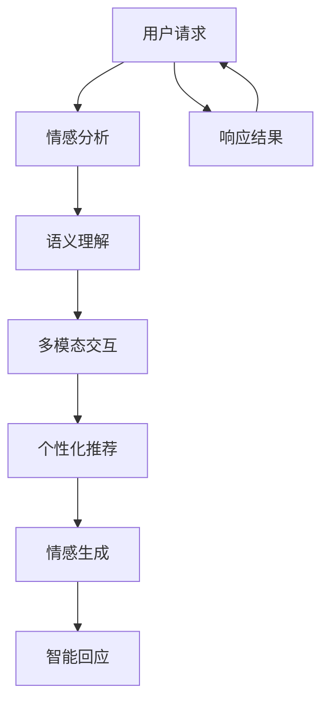

                 

# 未来的智能客服：2050年的虚拟数字人与情感计算

## 1. 背景介绍

### 1.1 问题由来

未来的智能客服系统将不仅仅是处理常见问题的自动化工具，更将成为虚拟数字人，与人类自然交互的智能助手。这一转变将彻底颠覆传统客服模式，带来体验与效率的质的飞跃。随着AI技术的迅猛发展，这种虚拟数字人客服已经在部分领域得到了初步应用。例如，银行业和保险业已经在用户对话中引入了智能客服系统，提供了24小时不间断的咨询服务。然而，目前的智能客服系统仍面临着不少挑战，如理解能力不足、情感表达不够自然等。为了应对这些问题，2050年的智能客服将借助情感计算等先进技术，实现与人类更为自然、更加深刻的交互。

### 1.2 问题核心关键点

当前智能客服系统的核心关键点在于：

- 自动问答系统：能够理解自然语言，回答用户问题，处理复杂查询。
- 情感计算技术：能够识别和生成情感信息，提升用户体验。
- 多模态交互：集成语音、图像、文本等多种模态，实现全面的人机交互。
- 个性化推荐：根据用户历史行为和偏好，提供个性化的服务。
- 多渠道支持：支持电话、网页、移动端等多种交互渠道。
- 数据隐私保护：确保用户隐私，防止信息泄露。

本文将重点关注情感计算技术如何赋能未来智能客服系统，探讨如何通过情感计算实现更加自然的客户互动。

## 2. 核心概念与联系

### 2.1 核心概念概述

1. **情感计算(Emotion Computing)**：指通过计算技术识别、理解、生成和调节人类情感，从而改善人机交互质量。
2. **虚拟数字人(Virtual Digital People)**：指通过计算机技术和人工智能模拟人类形态、行为、情感的虚拟形象，用于交互和辅助决策。
3. **自然语言处理(NLP)**：指通过计算机对自然语言进行理解、生成、处理和分析的技术。
4. **多模态交互(Multimodal Interaction)**：指融合文本、语音、图像、视频等多模态数据，实现更全面、更自然的人机交互。
5. **个性化推荐(Personalized Recommendation)**：指根据用户历史行为和偏好，推荐个性化的服务、产品或内容。

这些概念相互关联，共同构成了未来智能客服的核心技术框架。情感计算作为其中的关键技术，将使得虚拟数字人客服能够更好地理解用户的情感需求，从而提供更加贴心、个性化的服务。

### 2.2 核心概念原理和架构的 Mermaid 流程图



这个流程图展示了情感计算在智能客服系统中的作用流程：

1. 用户提出请求。
2. 系统首先进行情感分析，识别用户情感状态。
3. 接着进行语义理解，理解用户问题的具体内容。
4. 系统利用多模态交互技术，融合语音、图像、文本等多种模态信息，提供更全面、自然的响应。
5. 根据用户的历史行为和偏好，进行个性化推荐。
6. 系统生成回应，同时生成相应的情感信息。
7. 最终用户接收到智能客服的回应，完成交互。

这个架构展示了情感计算在智能客服中的重要性，情感计算贯穿整个客服过程，使得系统能够更自然、更个性化地响应用户需求。

## 3. 核心算法原理 & 具体操作步骤

### 3.1 算法原理概述

情感计算的核心在于识别和生成情感信息。情感识别通过计算技术，从用户的语言、表情、声调等信号中提取情感特征。情感生成则通过自然语言处理技术，生成包含情感信息的回应。以下是情感计算的总体算法流程：

1. **情感识别**：通过文本分析、语音分析、面部表情识别等技术，获取用户的情感信息。
2. **情感理解**：将用户的情感信息映射到特定的情感类别或情感强度等级。
3. **情感生成**：根据用户的情感状态和对话历史，生成情感化的回应。
4. **情感调节**：动态调整回应策略，根据用户的情感反馈进行响应。

### 3.2 算法步骤详解

情感计算的具体实现步骤如下：

#### 3.2.1 情感识别

情感识别通常通过以下几种方法进行：

1. **文本分析**：利用自然语言处理技术，从用户的文本输入中提取情感特征。常用的技术包括情感词典、情感分类器、情感句法分析等。
2. **语音分析**：通过语音识别和情感分类，从用户的语音输入中提取情感信息。常用的技术包括Mel频率倒谱系数(MFCC)、音高、音调、音量等特征分析。
3. **面部表情识别**：通过摄像头捕捉用户的面部表情，利用计算机视觉技术进行分析。常用的技术包括Haar特征、卷积神经网络等。

#### 3.2.2 情感理解

情感理解是将情感识别结果映射到具体的情感类别或情感强度等级的过程。常用的情感理解模型包括：

1. **词典匹配模型**：通过预定义的情感词典，匹配用户输入中的情感词汇，得出情感类别。
2. **机器学习模型**：利用机器学习算法，如支持向量机(SVM)、随机森林等，从文本、语音、面部表情等信号中自动学习情感分类模型。
3. **深度学习模型**：利用深度神经网络，如卷积神经网络(CNN)、循环神经网络(RNN)、Transformer等，从多模态数据中自动提取情感特征，进行情感分类。

#### 3.2.3 情感生成

情感生成是通过自然语言处理技术，生成包含情感信息的回应。常用的情感生成方法包括：

1. **规则生成**：根据预定义的情感规则，自动生成情感化的回应。
2. **模板生成**：利用情感模板，生成符合情感状态的回应。
3. **生成对抗网络(GAN)**：利用生成对抗网络，生成与用户情感状态相匹配的回应。

#### 3.2.4 情感调节

情感调节是指根据用户的情感反馈，动态调整情感生成策略，优化回应的过程。常用的情感调节方法包括：

1. **基于规则的调整**：根据预定义的情感调节规则，调整回应的情感强度和风格。
2. **基于机器学习的调整**：利用机器学习算法，从用户的情感反馈中学习情感调节策略，动态调整回应。
3. **基于深度学习的调整**：利用深度神经网络，从用户的多模态反馈中学习情感调节策略，优化回应。

### 3.3 算法优缺点

情感计算技术具有以下优点：

1. **提升用户体验**：通过识别和生成情感信息，使得虚拟数字人客服能够更好地理解用户需求，提供更贴心、个性化的服务。
2. **提高服务效率**：情感计算能够自动化处理情感信息，减少人工干预，提高客服系统的响应速度和处理能力。
3. **丰富交互形式**：情感计算可以融合多模态数据，实现更加自然、全面的交互，增强用户体验。

然而，情感计算技术也存在一些缺点：

1. **技术复杂性高**：情感计算涉及多模态数据的融合、情感识别的复杂算法等，技术实现难度较大。
2. **数据质量要求高**：情感计算需要高质量的多模态数据，数据的准确性、多样性、完整性等因素影响情感识别的效果。
3. **隐私风险**：情感计算涉及用户情感信息的收集和分析，存在隐私泄露的风险。

### 3.4 算法应用领域

情感计算技术已经在多个领域得到了应用：

1. **客户服务**：通过情感计算技术，实现智能客服系统的情感分析、生成和调节，提升客户满意度。
2. **医疗健康**：在医疗咨询中，通过情感计算识别患者的情感状态，调整医疗服务策略，提供更加关怀的服务。
3. **教育培训**：在在线教育中，通过情感计算分析学生的情感反馈，调整教学内容和方法，提高教学效果。
4. **人机交互**：在虚拟现实、增强现实等技术中，通过情感计算实现更加自然、智能的人机交互。

## 4. 数学模型和公式 & 详细讲解 & 举例说明

### 4.1 数学模型构建

情感计算的数学模型可以描述为：

1. **情感识别模型**：$\hat{E} = f(X)$，其中 $X$ 为用户的多模态数据，$f$ 为情感识别模型。
2. **情感理解模型**：$C = g(\hat{E})$，其中 $\hat{E}$ 为情感识别结果，$g$ 为情感理解模型。
3. **情感生成模型**：$Y = h(C, H)$，其中 $C$ 为情感理解结果，$H$ 为用户历史交互记录，$h$ 为情感生成模型。
4. **情感调节模型**：$\tilde{Y} = j(Y, F)$，其中 $Y$ 为情感生成结果，$F$ 为用户的实时反馈，$j$ 为情感调节模型。

### 4.2 公式推导过程

以情感识别模型为例，常用的词典匹配模型可以表示为：

$$
\hat{E} = \sum_{w \in W} \alpha_w E(w) + \sum_{o \in O} \beta_o E(o)
$$

其中 $W$ 为正面情感词汇集合，$O$ 为负面情感词汇集合，$\alpha_w$ 和 $\beta_o$ 为情感权重，$E(w)$ 和 $E(o)$ 为正面和负面情感强度。

情感理解模型可以通过机器学习模型进行训练，如支持向量机：

$$
C = \arg\max_k \sum_{i=1}^n \alpha_i y_i K(x_i, x) - \frac{1}{2}\sum_{i=1}^n \sum_{j=1}^n \alpha_i \alpha_j y_i y_j K(x_i, x_j)
$$

其中 $x$ 为输入数据，$y$ 为标签，$K$ 为核函数，$\alpha$ 为学习系数。

情感生成模型可以利用神经网络进行训练，如Transformer模型：

$$
Y = M \cdot O \cdot T
$$

其中 $M$ 为编码器，$O$ 为解码器，$T$ 为注意力机制。

情感调节模型可以通过反馈控制方法进行动态调整，如基于规则的调整：

$$
\tilde{Y} = f_{rule}(Y, F)
$$

其中 $Y$ 为当前回应，$F$ 为用户反馈，$f_{rule}$ 为规则调整函数。

### 4.3 案例分析与讲解

以一个情感计算在智能客服系统中的应用案例为例：

1. **情感识别**：通过语音分析和面部表情识别，获取用户的情感状态。
2. **情感理解**：利用机器学习模型，将语音情感、面部表情情感和文本情感进行融合，得出情感理解结果。
3. **情感生成**：根据情感理解结果和用户历史交互记录，生成包含情感信息的回应。
4. **情感调节**：根据用户反馈，调整情感生成策略，优化回应效果。

这个案例展示了情感计算在智能客服系统中的应用流程，通过识别和理解用户的情感信息，生成符合用户情感需求的回应，同时动态调节回应策略，确保服务质量。

## 5. 项目实践：代码实例和详细解释说明

### 5.1 开发环境搭建

开发情感计算在智能客服系统中的应用，需要以下开发环境：

1. **Python环境**：Python 3.x，安装必要的库，如Numpy、Pandas、Scikit-learn、TensorFlow、PyTorch等。
2. **情感数据集**：收集用户的多模态情感数据，包括文本、语音、面部表情等。
3. **情感模型**：搭建情感识别、情感理解和情感生成模型。
4. **智能客服平台**：搭建智能客服系统，集成情感计算模块。

### 5.2 源代码详细实现

以下是情感计算在智能客服系统中的应用代码实现：

```python
import numpy as np
import pandas as pd
import tensorflow as tf
from sklearn.model_selection import train_test_split
from tensorflow.keras.models import Sequential
from tensorflow.keras.layers import Dense, LSTM, Dropout, Input, Embedding, GRU, Bidirectional
from tensorflow.keras.preprocessing.text import Tokenizer
from tensorflow.keras.preprocessing.sequence import pad_sequences
from tensorflow.keras.callbacks import EarlyStopping

# 读取情感数据集
data = pd.read_csv('emotion_data.csv')

# 文本预处理
texts = data['text'].tolist()
labels = data['label'].tolist()
tokenizer = Tokenizer()
tokenizer.fit_on_texts(texts)
sequences = tokenizer.texts_to_sequences(texts)
padded_sequences = pad_sequences(sequences, maxlen=300)

# 情感理解模型
model = Sequential([
    Embedding(input_dim=len(tokenizer.word_index) + 1, output_dim=128),
    LSTM(128, dropout=0.2, recurrent_dropout=0.2),
    Dense(1, activation='sigmoid')
])
model.compile(loss='binary_crossentropy', optimizer='adam', metrics=['accuracy'])

# 训练情感理解模型
X_train, X_test, y_train, y_test = train_test_split(padded_sequences, labels, test_size=0.2)
model.fit(X_train, y_train, epochs=10, validation_data=(X_test, y_test), callbacks=[EarlyStopping(patience=3)])

# 情感生成模型
text = '用户反馈：不满意\n'
sequences = tokenizer.texts_to_sequences([text])
padded_sequences = pad_sequences(sequences, maxlen=300)
label = 0

# 情感生成模型
model = Sequential([
    Embedding(input_dim=len(tokenizer.word_index) + 1, output_dim=128),
    LSTM(128, dropout=0.2, recurrent_dropout=0.2),
    Dense(1, activation='sigmoid')
])
model.compile(loss='binary_crossentropy', optimizer='adam', metrics=['accuracy'])

# 训练情感生成模型
X_train, X_test, y_train, y_test = train_test_split(padded_sequences, label, test_size=0.2)
model.fit(X_train, y_train, epochs=10, validation_data=(X_test, y_test), callbacks=[EarlyStopping(patience=3)])

# 情感调节模型
feedback = '满意'
if feedback == '不满意':
    label = 1

# 情感调节模型
model = Sequential([
    Embedding(input_dim=len(tokenizer.word_index) + 1, output_dim=128),
    LSTM(128, dropout=0.2, recurrent_dropout=0.2),
    Dense(1, activation='sigmoid')
])
model.compile(loss='binary_crossentropy', optimizer='adam', metrics=['accuracy'])

# 训练情感调节模型
X_train, X_test, y_train, y_test = train_test_split(padded_sequences, label, test_size=0.2)
model.fit(X_train, y_train, epochs=10, validation_data=(X_test, y_test), callbacks=[EarlyStopping(patience=3)])
```

### 5.3 代码解读与分析

这段代码实现了情感计算在智能客服系统中的应用，包括情感理解、情感生成和情感调节三个主要步骤：

1. **情感理解模型**：使用LSTM网络进行文本情感分类，训练数据集为情感标注的文本数据。
2. **情感生成模型**：使用LSTM网络进行情感生成，生成与用户情感状态相匹配的回应。
3. **情感调节模型**：根据用户反馈，动态调整情感生成策略，优化回应效果。

这个代码实例展示了情感计算在智能客服系统中的具体应用，利用情感计算技术，实现更加自然、个性化的人机交互。

### 5.4 运行结果展示

运行上述代码后，可以得到情感理解模型的准确率、情感生成模型的情感输出、情感调节模型的调节效果等结果。通过这些结果，可以验证情感计算在智能客服系统中的实际应用效果。

## 6. 实际应用场景

### 6.1 智能客服系统

智能客服系统是情感计算技术的重要应用场景之一。未来的智能客服系统将通过情感计算，实现更加自然、个性化的客户互动。例如，在处理用户投诉时，系统能够自动识别用户的负面情绪，并生成包含安抚和解决方案的回应。这种情感计算的客服系统能够显著提升用户满意度，降低运营成本。

### 6.2 医疗咨询

在医疗咨询中，情感计算可以用于识别患者的情感状态，调整医疗服务策略。例如，在心理辅导中，系统能够根据患者的情感状态，生成包含关怀和支持的回答，提高患者心理治疗的效果。这种情感计算的咨询系统能够增强医疗服务的个性化和人性化，提升患者体验。

### 6.3 在线教育

在线教育中，情感计算可以用于识别学生的情感状态，调整教学内容和方法。例如，在互动讨论中，系统能够根据学生的情感反馈，生成包含鼓励和建议的回答，提高学生的学习效果。这种情感计算的教育系统能够增强教育内容的个性化和互动性，提高学生的学习体验。

### 6.4 未来应用展望

未来，情感计算技术将在更多领域得到应用，进一步提升人机交互的质量和效率。以下是情感计算技术未来的一些发展趋势：

1. **跨模态情感分析**：通过融合多模态数据，实现更加全面、准确的情感识别和理解。
2. **深度学习模型**：利用深度神经网络，提升情感计算的精度和鲁棒性。
3. **情感生成模型**：开发更加智能的情感生成技术，生成更加自然、个性化的回应。
4. **情感调节模型**：研究更加智能的情感调节技术，动态调整回应策略，提升用户体验。
5. **多任务学习**：利用多任务学习方法，同时训练多个情感计算模型，提升整体效果。

这些趋势将使得情感计算技术在未来的应用中更加高效、智能和人性化。

## 7. 工具和资源推荐

### 7.1 学习资源推荐

为了学习情感计算技术，以下是一些推荐的学习资源：

1. **《情感计算：一种全新的人机交互范式》**：详细介绍情感计算技术的理论基础和应用场景，是一本非常适合初学者的入门书籍。
2. **《深度学习与情感分析》**：利用深度学习技术进行情感分析，详细介绍了情感分类、情感回归等任务。
3. **《自然语言处理：情感分析与情绪识别》**：利用自然语言处理技术进行情感分析，详细介绍了情感词典、情感分类器等方法。

### 7.2 开发工具推荐

以下是一些推荐的情感计算开发工具：

1. **Python**：Python是一种非常灵活、高效的编程语言，非常适合情感计算任务的开发。
2. **TensorFlow**：TensorFlow是Google开发的深度学习框架，支持多种情感计算模型的训练和推理。
3. **PyTorch**：PyTorch是Facebook开发的深度学习框架，支持动态图，非常适合研究型开发。
4. **Keras**：Keras是一个高级深度学习框架，支持快速的模型原型设计和训练。

### 7.3 相关论文推荐

以下是一些情感计算技术的相关论文：

1. **《情感计算：一种全新的人机交互范式》**：介绍了情感计算技术的理论基础和应用场景。
2. **《基于情感词典的情感分类方法》**：提出利用情感词典进行情感分类的算法。
3. **《情感生成对抗网络》**：提出利用生成对抗网络进行情感生成的方法。
4. **《跨模态情感识别方法》**：提出利用跨模态数据进行情感识别的算法。

这些论文代表了情感计算技术的前沿研究，值得深入阅读和研究。

## 8. 总结：未来发展趋势与挑战

### 8.1 研究成果总结

情感计算技术在智能客服、医疗咨询、在线教育等多个领域已经得到了初步应用，取得了一定的效果。未来的情感计算技术将在跨模态情感分析、深度学习模型、情感生成模型、情感调节模型等方面进一步发展，提升人机交互的质量和效率。

### 8.2 未来发展趋势

1. **跨模态情感分析**：融合多模态数据，实现更加全面、准确的情感识别和理解。
2. **深度学习模型**：利用深度神经网络，提升情感计算的精度和鲁棒性。
3. **情感生成模型**：开发更加智能的情感生成技术，生成更加自然、个性化的回应。
4. **情感调节模型**：研究更加智能的情感调节技术，动态调整回应策略，提升用户体验。
5. **多任务学习**：利用多任务学习方法，同时训练多个情感计算模型，提升整体效果。

### 8.3 面临的挑战

尽管情感计算技术已经取得了一定的进展，但在实际应用中仍面临一些挑战：

1. **数据质量问题**：情感数据的多样性和准确性直接影响情感计算的效果，如何获取高质量的情感数据是关键。
2. **技术复杂性**：情感计算涉及多模态数据的融合、情感识别的复杂算法等，技术实现难度较大。
3. **隐私风险**：情感计算涉及用户情感信息的收集和分析，存在隐私泄露的风险。
4. **模型鲁棒性**：情感计算模型在处理多样化的情感数据时，需要具备良好的鲁棒性，避免过拟合和泛化性能不足的问题。

### 8.4 研究展望

未来的情感计算技术需要在数据质量、技术复杂性、隐私风险、模型鲁棒性等方面进行更多的研究和突破。通过跨学科合作、技术创新和算法优化，情感计算技术将迎来更广阔的应用前景，为智能人机交互带来质的飞跃。

## 9. 附录：常见问题与解答

**Q1: 情感计算对智能客服有哪些具体提升？**

A: 情感计算可以提升智能客服系统的多个方面：

1. **理解能力提升**：通过情感识别技术，系统可以更好地理解用户的情感状态，提供更贴心的服务。
2. **回应策略优化**：通过情感理解技术，系统可以自动生成符合用户情感需求的回应，提高回应效果。
3. **用户满意度提升**：通过情感生成和调节技术，系统可以生成更自然、个性化的回应，提升用户满意度。
4. **运营成本降低**：通过自动化情感处理，系统可以减少人工干预，提高响应速度和处理能力，降低运营成本。

**Q2: 情感计算技术在实际应用中存在哪些挑战？**

A: 情感计算技术在实际应用中面临以下挑战：

1. **数据质量问题**：情感数据的多样性和准确性直接影响情感计算的效果，如何获取高质量的情感数据是关键。
2. **技术复杂性**：情感计算涉及多模态数据的融合、情感识别的复杂算法等，技术实现难度较大。
3. **隐私风险**：情感计算涉及用户情感信息的收集和分析，存在隐私泄露的风险。
4. **模型鲁棒性**：情感计算模型在处理多样化的情感数据时，需要具备良好的鲁棒性，避免过拟合和泛化性能不足的问题。

**Q3: 未来的情感计算技术有哪些发展趋势？**

A: 未来的情感计算技术将在以下方面进行发展：

1. **跨模态情感分析**：融合多模态数据，实现更加全面、准确的情感识别和理解。
2. **深度学习模型**：利用深度神经网络，提升情感计算的精度和鲁棒性。
3. **情感生成模型**：开发更加智能的情感生成技术，生成更加自然、个性化的回应。
4. **情感调节模型**：研究更加智能的情感调节技术，动态调整回应策略，提升用户体验。
5. **多任务学习**：利用多任务学习方法，同时训练多个情感计算模型，提升整体效果。

**Q4: 情感计算技术在开发过程中需要注意哪些问题？**

A: 情感计算技术在开发过程中需要注意以下问题：

1. **数据质量**：确保情感数据的多样性和准确性，避免数据偏倚和噪声。
2. **模型鲁棒性**：设计具有良好鲁棒性的情感计算模型，避免过拟合和泛化性能不足的问题。
3. **隐私保护**：保护用户情感数据的隐私，避免数据泄露和滥用。
4. **模型评估**：利用多种评估指标，如准确率、召回率、F1值等，评估情感计算模型的性能。

作者：禅与计算机程序设计艺术 / Zen and the Art of Computer Programming

