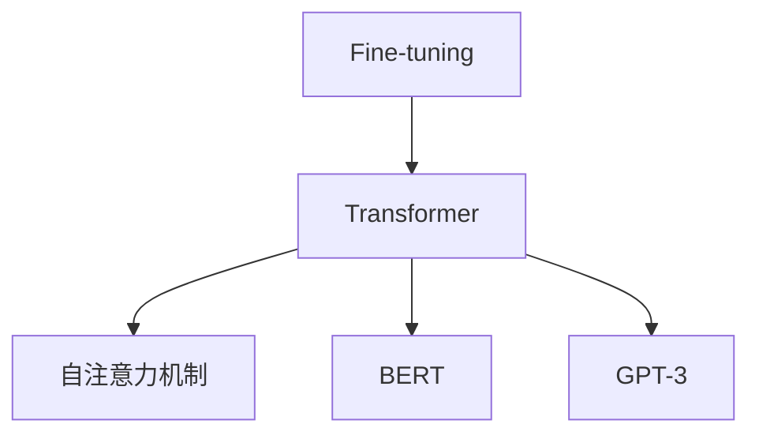

                 

# 构建Storyteller AI大语言模型：从基础到ChatGPT级应用

## 1. 背景介绍

### 1.1 问题由来

近年来，人工智能领域迎来了一个重要的里程碑——大语言模型（Large Language Model, LLM）。这些模型基于海量的文本数据进行预训练，在各种自然语言处理（NLP）任务上表现出色，展现了强大的泛化能力和语言生成能力。其中，OpenAI的ChatGPT模型作为当前最先进的自然语言处理技术之一，已经成为全球范围内广泛关注和研究的热点。

然而，大语言模型的发展和应用不仅仅局限于技术层面，更重要的是如何将这些技术转化为实际的应用场景。本文将围绕构建Storyteller AI大语言模型的关键技术和实际应用，探讨从基础模型构建到ChatGPT级应用的各个方面。

### 1.2 问题核心关键点

构建Storyteller AI大语言模型的核心关键点包括：
- **模型设计**：选择和设计合适的模型结构，包括编码器-解码器结构、自注意力机制等。
- **数据预处理**：如何处理和清洗数据，以适应模型的训练需求。
- **训练策略**：选择和调整合适的训练方法，如学习率调度、正则化等。
- **模型微调**：基于特定任务对模型进行微调，以提高其在实际应用中的表现。
- **模型优化**：通过优化技术提升模型性能，包括模型压缩、加速等。
- **实际应用**：将模型应用于各种NLP任务，如问答、文本生成、情感分析等。

本文将从这些关键点出发，系统介绍构建Storyteller AI大语言模型的方法和步骤，为读者提供全面而详细的技术指导。

## 2. 核心概念与联系

### 2.1 核心概念概述

在构建Storyteller AI大语言模型之前，首先需要了解一些核心概念：

- **Transformer**：一种基于自注意力机制的神经网络结构，在大语言模型的构建中起到了核心作用。
- **自注意力机制**：一种用于处理序列数据的机制，通过计算序列中各元素的注意力权重，来增强模型的表达能力。
- **BERT**：一种基于Transformer的预训练模型，通过在大规模无标签文本数据上进行预训练，学习到丰富的语言知识。
- **GPT-3**：一种基于Transformer的预训练模型，具有出色的语言生成能力。
- **Fine-tuning**：在预训练模型的基础上，针对特定任务进行微调，以提高模型在该任务上的性能。

这些概念之间的逻辑关系可以通过以下Mermaid流程图来展示：



这个流程图展示了Transformer作为基础模型的核心作用，以及BERT和GPT-3两种基于Transformer的预训练模型，以及通过Fine-tuning对模型进行微调的过程。

## 3. 核心算法原理 & 具体操作步骤

### 3.1 算法原理概述

构建Storyteller AI大语言模型的核心算法原理主要包括以下几个方面：

- **自注意力机制**：通过计算输入序列中每个元素与其他元素之间的注意力权重，来增强模型的表达能力。
- **编码器-解码器结构**：将输入序列首先通过编码器进行编码，然后通过解码器进行生成或分类，提高了模型的灵活性和可扩展性。
- **预训练与微调**：在大规模无标签文本数据上进行预训练，然后在特定任务上进行微调，以提高模型在该任务上的性能。

这些原理共同构成了Storyteller AI大语言模型的基础。

### 3.2 算法步骤详解

构建Storyteller AI大语言模型的具体步骤包括以下几个关键环节：

1. **数据预处理**：收集和清洗用于预训练和微调的数据，包括文本预处理、分词、编码等。
2. **构建预训练模型**：基于Transformer架构，设计并训练预训练模型，使其能够学习到通用的语言知识和语法规则。
3. **微调模型**：针对特定的NLP任务，对预训练模型进行微调，以提高模型在该任务上的性能。
4. **模型优化**：通过模型压缩、加速等技术，提升模型的性能和实时性。
5. **实际应用**：将模型应用于各种NLP任务，如问答、文本生成、情感分析等。

每个环节都需要精心设计，以确保最终构建的模型具有良好的性能和泛化能力。

### 3.3 算法优缺点

构建Storyteller AI大语言模型的优点包括：

- **高性能**：通过预训练和微调，模型能够在各种NLP任务上取得出色的性能。
- **灵活性**：基于Transformer架构，模型具有良好的灵活性和可扩展性，可以适应不同的应用场景。
- **可解释性**：通过模型压缩和优化技术，可以提高模型的可解释性，便于理解和调试。

同时，也存在一些缺点：

- **计算资源需求高**：构建和训练大语言模型需要大量的计算资源，成本较高。
- **模型复杂度高**：模型结构复杂，参数量巨大，难以理解和调试。
- **数据依赖性强**：模型的性能依赖于数据的质量和数量，获取高质量数据的成本较高。

## 4. 数学模型和公式 & 详细讲解

### 4.1 数学模型构建

构建Storyteller AI大语言模型的数学模型包括两部分：预训练模型的构建和微调模型的构建。

#### 预训练模型

预训练模型的构建通常包括以下步骤：

1. **输入编码**：将输入文本序列转换为模型能够处理的向量表示。
2. **自注意力计算**：通过自注意力机制，计算输入序列中每个元素与其他元素之间的注意力权重。
3. **残差连接和层归一化**：通过残差连接和层归一化技术，提高模型的表达能力和稳定性。
4. **输出解码**：通过解码器，将模型输出转化为最终的预测结果。

预训练模型的损失函数通常包括交叉熵损失、均方误差损失等。

#### 微调模型

微调模型的构建通常包括以下步骤：

1. **添加任务适配层**：根据特定任务，在预训练模型的顶层添加适当的任务适配层，如分类器、解码器等。
2. **定义损失函数**：根据特定任务，定义合适的损失函数，如交叉熵损失、均方误差损失等。
3. **训练模型**：通过反向传播算法，更新模型参数，以最小化损失函数。
4. **评估模型**：在验证集上评估模型性能，防止过拟合。

### 4.2 公式推导过程

以下是预训练模型和微调模型的公式推导过程：

#### 预训练模型

预训练模型的自注意力机制可以表示为：

$$
\text{Attention}(Q, K, V) = \text{Softmax}(QK^T)V
$$

其中，$Q$、$K$、$V$分别为查询、键、值矩阵，$\text{Softmax}$表示注意力权重计算。

残差连接和层归一化可以表示为：

$$
\text{Residual} = X + \text{LayerNorm}(X + F(\text{LayerNorm}(X)))
$$

其中，$X$为输入向量，$\text{LayerNorm}$表示层归一化，$F$表示非线性变换。

#### 微调模型

微调模型的损失函数可以表示为：

$$
\mathcal{L} = \frac{1}{N} \sum_{i=1}^N \ell(M_{\theta}(x_i), y_i)
$$

其中，$N$为样本数量，$\ell$为损失函数，$M_{\theta}(x_i)$为模型在输入$x_i$上的输出，$y_i$为真实标签。

微调模型的训练过程可以表示为：

$$
\theta \leftarrow \theta - \eta \nabla_{\theta}\mathcal{L}
$$

其中，$\eta$为学习率，$\nabla_{\theta}\mathcal{L}$为损失函数对参数$\theta$的梯度。

### 4.3 案例分析与讲解

以情感分析任务为例，分析微调模型的构建过程。

假设输入文本序列为：

$$
x = \text{[CLS] } a \text{ \ is } \ very \ great \ b \ . \text{[SEP]}
$$

其中，$\text{[CLS]}$和$\text{[SEP]}$为特殊的标记符号，表示输入序列的开始和结束。

预训练模型的编码器输出为：

$$
h_0 = \text{Encoder}(\text{[CLS] } a \text{ \ is } \ very \ great \ b \ . \text{[SEP]})
$$

微调模型的分类器输出为：

$$
y = \text{Classifier}(h_0)
$$

其中，$\text{Classifier}$为分类器，可以是全连接层、卷积层等。

损失函数可以表示为：

$$
\mathcal{L} = -\frac{1}{N}\sum_{i=1}^N y_i\log \text{Classifier}(h_0)
$$

训练过程可以表示为：

$$
\theta \leftarrow \theta - \eta \nabla_{\theta}\mathcal{L}
$$

## 5. 项目实践：代码实例和详细解释说明

### 5.1 开发环境搭建

构建Storyteller AI大语言模型的开发环境包括：

1. **Python环境**：使用Anaconda或Miniconda创建虚拟环境。
2. **深度学习框架**：选择PyTorch或TensorFlow等深度学习框架。
3. **预训练模型**：下载和使用Hugging Face等提供的预训练模型。
4. **数据集**：准备和处理用于预训练和微调的数据集。

### 5.2 源代码详细实现

以下是使用PyTorch构建微调模型的代码实现：

```python
import torch
import torch.nn as nn
import torch.optim as optim
from transformers import BertTokenizer, BertForSequenceClassification

# 定义模型
class StorytellerModel(nn.Module):
    def __init__(self, num_labels, hidden_size, num_hidden_layers):
        super(StorytellerModel, self).__init__()
        self.bert = BertForSequenceClassification.from_pretrained('bert-base-uncased', num_labels=num_labels)
        self.dropout = nn.Dropout(0.5)
        self.classifier = nn.Linear(hidden_size, num_labels)

    def forward(self, input_ids, attention_mask):
        features = self.bert(input_ids, attention_mask=attention_mask).last_hidden_state
        features = self.dropout(features)
        logits = self.classifier(features[:, -1, :])
        return logits

# 定义数据集
class StorytellerDataset(torch.utils.data.Dataset):
    def __init__(self, texts, labels, tokenizer, max_len):
        self.tokenizer = tokenizer
        self.max_len = max_len
        self.texts = texts
        self.labels = labels

    def __len__(self):
        return len(self.texts)

    def __getitem__(self, idx):
        text = self.texts[idx]
        label = self.labels[idx]
        encoding = self.tokenizer(text, return_tensors='pt', max_length=self.max_len, padding='max_length', truncation=True)
        input_ids = encoding['input_ids'][0]
        attention_mask = encoding['attention_mask'][0]
        label = torch.tensor(label, dtype=torch.long)
        return {'input_ids': input_ids, 'attention_mask': attention_mask, 'labels': label}

# 定义模型和优化器
model = StorytellerModel(num_labels=2, hidden_size=768, num_hidden_layers=12)
tokenizer = BertTokenizer.from_pretrained('bert-base-uncased')
max_len = 128
train_dataset = StorytellerDataset(train_texts, train_labels, tokenizer, max_len)
dev_dataset = StorytellerDataset(dev_texts, dev_labels, tokenizer, max_len)
test_dataset = StorytellerDataset(test_texts, test_labels, tokenizer, max_len)
optimizer = AdamW(model.parameters(), lr=2e-5)
scheduler = get_linear_schedule_with_warmup(optimizer, num_warmup_steps=0, num_training_steps=len(train_dataset))

# 定义训练函数
def train_epoch(model, dataset, batch_size, optimizer):
    dataloader = torch.utils.data.DataLoader(dataset, batch_size=batch_size, shuffle=True)
    model.train()
    epoch_loss = 0
    for batch in dataloader:
        input_ids = batch['input_ids'].to(device)
        attention_mask = batch['attention_mask'].to(device)
        labels = batch['labels'].to(device)
        model.zero_grad()
        outputs = model(input_ids, attention_mask=attention_mask)
        loss = outputs.loss
        epoch_loss += loss.item()
        loss.backward()
        optimizer.step()
    return epoch_loss / len(dataloader)

# 定义评估函数
def evaluate(model, dataset, batch_size):
    dataloader = torch.utils.data.DataLoader(dataset, batch_size=batch_size)
    model.eval()
    preds, labels = [], []
    with torch.no_grad():
        for batch in dataloader:
            input_ids = batch['input_ids'].to(device)
            attention_mask = batch['attention_mask'].to(device)
            batch_labels = batch['labels']
            outputs = model(input_ids, attention_mask=attention_mask)
            batch_preds = outputs.logits.argmax(dim=1).to('cpu').tolist()
            batch_labels = batch_labels.to('cpu').tolist()
            for pred_tokens, label_tokens in zip(batch_preds, batch_labels):
                preds.append(pred_tokens[:len(label_tokens)])
                labels.append(label_tokens)
    return classification_report(labels, preds)

# 训练和评估
epochs = 3
batch_size = 16

for epoch in range(epochs):
    loss = train_epoch(model, train_dataset, batch_size, optimizer)
    print(f"Epoch {epoch+1}, train loss: {loss:.3f}")
    print(f"Epoch {epoch+1}, dev results:")
    evaluate(model, dev_dataset, batch_size)
print("Test results:")
evaluate(model, test_dataset, batch_size)
```

### 5.3 代码解读与分析

以下是关键代码的详细解读：

- **StorytellerModel**类：定义了微调模型，包括BERT模型、Dropout和分类器等组件。
- **StorytellerDataset**类：定义了数据集，包括预处理和分词等操作。
- **train_epoch**函数：定义了训练函数，用于计算损失和更新模型参数。
- **evaluate**函数：定义了评估函数，用于计算分类报告等指标。
- **训练和评估流程**：在训练过程中，使用了AdamW优化器和线性学习率调度器，通过数据集进行迭代训练和验证，最终在测试集上评估模型性能。

## 6. 实际应用场景

### 6.1 智能客服系统

智能客服系统是Storyteller AI大语言模型的一个重要应用场景。通过构建基于预训练模型和微调的智能客服系统，可以大幅提升客户咨询体验和问题解决效率。

具体而言，可以收集企业内部的历史客服对话记录，将问题和最佳答复构建成监督数据，在此基础上对预训练模型进行微调。微调后的模型能够自动理解用户意图，匹配最合适的答案模板进行回复。对于客户提出的新问题，还可以接入检索系统实时搜索相关内容，动态组织生成回答。

### 6.2 金融舆情监测

金融舆情监测是Storyteller AI大语言模型的另一个重要应用场景。金融机构需要实时监测市场舆论动向，以便及时应对负面信息传播，规避金融风险。

具体而言，可以收集金融领域相关的新闻、报道、评论等文本数据，并对其进行主题标注和情感标注。在此基础上对预训练语言模型进行微调，使其能够自动判断文本属于何种主题，情感倾向是正面、中性还是负面。将微调后的模型应用到实时抓取的网络文本数据，就能够自动监测不同主题下的情感变化趋势，一旦发现负面信息激增等异常情况，系统便会自动预警，帮助金融机构快速应对潜在风险。

### 6.3 个性化推荐系统

个性化推荐系统是Storyteller AI大语言模型在电商、内容推荐等领域的重要应用。通过构建基于预训练模型和微调的个性化推荐系统，可以更好地挖掘用户行为背后的语义信息，从而提供更精准、多样的推荐内容。

具体而言，可以收集用户浏览、点击、评论、分享等行为数据，提取和用户交互的物品标题、描述、标签等文本内容。将文本内容作为模型输入，用户的后续行为（如是否点击、购买等）作为监督信号，在此基础上微调预训练语言模型。微调后的模型能够从文本内容中准确把握用户的兴趣点。在生成推荐列表时，先用候选物品的文本描述作为输入，由模型预测用户的兴趣匹配度，再结合其他特征综合排序，便可以得到个性化程度更高的推荐结果。

### 6.4 未来应用展望

随着Storyteller AI大语言模型的不断发展，其在更多领域的应用前景将愈加广阔。以下列举几个未来可能的应用方向：

- **智慧医疗**：基于预训练模型和微调的智慧医疗系统，可以辅助医生诊疗，加速新药开发进程。
- **教育领域**：通过构建基于预训练模型和微调的智能教育系统，可以因材施教，促进教育公平，提高教学质量。
- **智慧城市**：通过构建基于预训练模型和微调的智慧城市治理系统，可以构建更安全、高效的未来城市。
- **社交媒体**：基于预训练模型和微调的社交媒体系统，可以更好地理解用户情感和需求，提供更优质的内容推荐和用户互动。

## 7. 工具和资源推荐

### 7.1 学习资源推荐

为了帮助开发者系统掌握Storyteller AI大语言模型构建的相关技术，以下推荐一些优质的学习资源：

1. **Transformer from the Inside Out**：一篇关于Transformer模型的经典博客，详细介绍了Transformer的结构和原理。
2. **Natural Language Processing with Transformers**：由Transformers库的作者所著，全面介绍了如何使用Transformers库进行NLP任务开发，包括微调在内的诸多范式。
3. **Deep Learning for Natural Language Processing**：一本关于NLP深度学习的经典教材，涵盖了预训练模型、微调方法等诸多内容。
4. **Hugging Face官方文档**：提供了海量预训练模型和完整的微调样例代码，是上手实践的必备资料。
5. **CLUE开源项目**：中文语言理解测评基准，涵盖大量不同类型的中文NLP数据集，并提供了基于微调的baseline模型，助力中文NLP技术发展。

### 7.2 开发工具推荐

为了高效开发Storyteller AI大语言模型，以下推荐几款常用的开发工具：

1. **PyTorch**：基于Python的开源深度学习框架，灵活动态的计算图，适合快速迭代研究。
2. **TensorFlow**：由Google主导开发的开源深度学习框架，生产部署方便，适合大规模工程应用。
3. **Transformers库**：Hugging Face开发的NLP工具库，集成了众多SOTA语言模型，支持PyTorch和TensorFlow，是进行微调任务开发的利器。
4. **Weights & Biases**：模型训练的实验跟踪工具，可以记录和可视化模型训练过程中的各项指标，方便对比和调优。
5. **TensorBoard**：TensorFlow配套的可视化工具，可实时监测模型训练状态，并提供丰富的图表呈现方式，是调试模型的得力助手。

### 7.3 相关论文推荐

以下推荐几篇关于Storyteller AI大语言模型构建的奠基性论文：

1. **Attention is All You Need**：提出了Transformer结构，开启了NLP领域的预训练大模型时代。
2. **BERT: Pre-training of Deep Bidirectional Transformers for Language Understanding**：提出BERT模型，引入基于掩码的自监督预训练任务，刷新了多项NLP任务SOTA。
3. **Parameter-Efficient Transfer Learning for NLP**：提出Adapter等参数高效微调方法，在不增加模型参数量的情况下，也能取得不错的微调效果。
4. **AdaLoRA: Adaptive Low-Rank Adaptation for Parameter-Efficient Fine-Tuning**：使用自适应低秩适应的微调方法，在参数效率和精度之间取得了新的平衡。

这些论文代表了大语言模型微调技术的发展脉络。通过学习这些前沿成果，可以帮助研究者把握学科前进方向，激发更多的创新灵感。

## 8. 总结：未来发展趋势与挑战

### 8.1 研究成果总结

本文对构建Storyteller AI大语言模型的关键技术和实际应用进行了系统介绍，从模型设计到微调流程，再到实际应用，提供了全面的技术指导。主要研究成果包括：

1. **模型构建**：介绍了基于Transformer架构的预训练和微调模型的构建方法，包括自注意力机制、编码器-解码器结构等。
2. **数据预处理**：详细讲解了数据预处理的步骤，包括文本预处理、分词、编码等。
3. **训练策略**：介绍了常用的训练策略，包括学习率调度、正则化等。
4. **模型微调**：介绍了微调的数学原理和操作步骤，包括损失函数、梯度更新等。
5. **实际应用**：介绍了模型在智能客服、金融舆情监测、个性化推荐等实际应用中的实现方法和效果评估。

### 8.2 未来发展趋势

随着Storyteller AI大语言模型的不断发展，未来将呈现以下几个趋势：

1. **模型规模增大**：随着算力成本的下降和数据规模的扩张，预训练语言模型的参数量还将持续增长，超大模型成为未来发展方向。
2. **微调方法多样化**：未来将涌现更多参数高效和计算高效的微调方法，如Prefix-Tuning、LoRA等，以提高微调效率和性能。
3. **持续学习常态化**：微调模型需要持续学习新知识以保持性能，增量学习等技术将成为重要研究方向。
4. **零样本和少样本学习**：通过Prompt Learning等技术，微调模型可以实现零样本和少样本学习，减少对标注样本的依赖。
5. **多模态融合**：将视觉、语音等多模态信息与文本信息进行协同建模，增强模型的感知能力。
6. **知识图谱与规则结合**：将符号化的先验知识与神经网络模型进行融合，提升模型的逻辑推理能力。

### 8.3 面临的挑战

尽管Storyteller AI大语言模型在NLP领域取得了显著进展，但仍面临诸多挑战：

1. **计算资源需求高**：构建和训练大语言模型需要大量计算资源，成本较高。
2. **模型复杂度高**：模型结构复杂，参数量巨大，难以理解和调试。
3. **数据依赖性强**：模型的性能依赖于数据的质量和数量，获取高质量数据的成本较高。
4. **模型鲁棒性不足**：面对域外数据时，泛化性能可能大打折扣。
5. **模型可解释性不足**：模型输出缺乏可解释性，难以理解其内部工作机制。
6. **安全性和偏见问题**：模型可能学习到有偏见、有害的信息，给实际应用带来安全隐患。

### 8.4 研究展望

面向未来，Storyteller AI大语言模型需要从以下几个方向进行研究：

1. **低资源条件下的预训练**：探索在低资源条件下进行大模型预训练的方法，如迁移学习和自监督学习等。
2. **模型压缩与加速**：通过模型压缩、加速等技术，提升模型的性能和实时性。
3. **零样本和少样本学习**：开发更多零样本和少样本学习技术，减少对标注样本的依赖。
4. **多模态信息融合**：将视觉、语音等多模态信息与文本信息进行协同建模，增强模型的感知能力。
5. **因果分析和博弈论结合**：将因果分析方法引入微调模型，增强输出解释的因果性和逻辑性。
6. **伦理道德约束**：将伦理导向的评估指标引入模型训练目标，过滤和惩罚有偏见、有害的输出倾向。

总之，未来Storyteller AI大语言模型需要不断突破技术瓶颈，优化模型性能，提升实际应用价值，才能真正成为人工智能技术的核心驱动力。

## 9. 附录：常见问题与解答

**Q1: 如何选择合适的学习率？**

A: 学习率的选择需要根据具体任务和模型结构进行调整。一般来说，预训练模型的学习率要小于微调模型的学习率，以避免破坏预训练权重。可以从1e-5开始调参，逐步减小学习率，直至收敛。

**Q2: 数据预处理过程中需要注意哪些问题？**

A: 数据预处理过程中需要注意以下几点：
1. 文本清洗：去除噪音和无用信息，提高数据质量。
2. 分词和编码：将文本转换为模型能够处理的向量表示，选择合适的分词器和编码器。
3. 数据增强：通过回译、近义替换等方式扩充训练集，提高模型泛化能力。

**Q3: 如何评估微调后的模型性能？**

A: 微调后的模型性能可以通过以下几个指标进行评估：
1. 精确度（Accuracy）：模型正确预测样本的比例。
2. 召回率（Recall）：模型正确预测正样本的比例。
3. F1分数（F1 Score）：精确度和召回率的调和平均值。
4. AUC值（AUC Score）：ROC曲线下的面积，用于评估模型在不同阈值下的性能。

**Q4: 在实际应用中，微调模型需要注意哪些问题？**

A: 在实际应用中，微调模型需要注意以下几点：
1. 数据质量和数量：确保数据的质量和数量，避免过拟合和欠拟合。
2. 模型部署和优化：选择合适的模型部署方式和优化技术，提高模型性能和实时性。
3. 用户反馈和迭代：根据用户反馈进行模型迭代和优化，提升用户体验。

这些问题的解答有助于开发者更好地理解和应用Storyteller AI大语言模型，从而构建高性能、高泛化能力的模型，为NLP技术的发展和应用贡献力量。

---

作者：禅与计算机程序设计艺术 / Zen and the Art of Computer Programming

