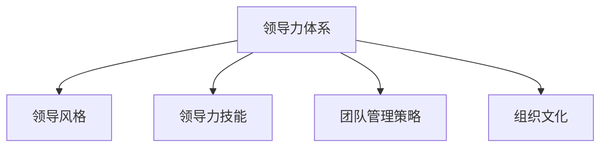

                 

# 构建个人领导力体系的方法论

> 关键词：领导力体系,领导风格,领导力发展,团队管理,组织文化

## 1. 背景介绍

### 1.1 问题由来

在当今瞬息万变的商业环境中，企业面临着前所未有的挑战和机遇。领导者作为企业的中流砥柱，其个人领导力的提升对企业的发展至关重要。然而，在实际的管理实践中，领导者常常遇到各种难题：如何有效地影响和激励团队成员？如何在多变的市场环境中做出明智的决策？如何塑造积极向上的组织文化？这些问题不仅需要领导者在知识和技术层面具备深厚的积累，更需要在领导力上实现全面提升。

### 1.2 问题核心关键点

构建个人领导力体系的核心关键点在于：
1. 明确领导风格。不同领导风格适用于不同的情境和团队类型。
2. 强化领导力技能。领导力技能的提升是领导力体系构建的基础。
3. 打造高效的团队管理策略。通过有效的团队管理，提升团队凝聚力和执行力。
4. 构建健康的组织文化。领导者需要塑造和维护一个积极向上、激励创新的组织文化。
5. 持续发展和反思。领导力体系构建是一个持续的过程，需要不断的学习和反思。

### 1.3 问题研究意义

构建个人领导力体系对于提升企业竞争力、促进团队协作、营造良好的组织文化具有重要意义：

1. **提升企业竞争力**：有效的领导力能够引导团队向共同目标前进，提升企业的整体执行力和市场响应速度。
2. **促进团队协作**：通过领导者的正确引导和激励，团队成员能够更紧密地协作，共同应对复杂多变的环境。
3. **营造良好的组织文化**：健康的组织文化能够增强员工的归属感和积极性，提升企业的创新能力和员工满意度。
4. **实现个人成长**：通过构建个人领导力体系，领导者能够在不断的学习和实践中实现个人成长，增强领导效能。

## 2. 核心概念与联系

### 2.1 核心概念概述

为更好地理解构建个人领导力体系的方法论，本节将介绍几个密切相关的核心概念：

- **领导力体系**：一个领导者应该具备的完整领导能力，包括决策能力、沟通能力、团队管理能力、问题解决能力等。
- **领导风格**：领导者管理和激励团队的方式，如民主型、权威型、放任型等。
- **领导力技能**：实现有效领导所需的具体技能，如倾听、激励、沟通、问题解决等。
- **团队管理策略**：领导者为了提升团队效率和凝聚力所采取的策略和方法，如目标设定、激励机制、绩效评估等。
- **组织文化**：企业内部成员共享的价值观、信念和行为规范，对企业的战略目标和团队合作具有深远影响。

这些核心概念之间的逻辑关系可以通过以下Mermaid流程图来展示：



这个流程图展示了领导力体系的构建过程中各个概念之间的相互关联：

1. 领导力体系是整个体系的基石，涵盖领导风格、领导力技能、团队管理策略和组织文化等多个方面。
2. 领导风格是领导力体系的一部分，直接影响到领导者如何管理和激励团队。
3. 领导力技能是实现有效领导的具体能力，是领导力体系的重要组成部分。
4. 团队管理策略和组织文化也是领导力体系的重要组成部分，通过有效的策略和积极的组织文化，领导者能够更有效地管理团队，提升组织绩效。

## 3. 核心算法原理 & 具体操作步骤
### 3.1 算法原理概述

构建个人领导力体系本质上是一个系统化的学习和实践过程。其核心思想是通过理论学习、实践应用和反思总结，逐步提升领导者的综合领导能力。具体来说，领导者需要：

1. 学习各种领导风格和领导力技能，根据团队和情境选择适合的领导方式。
2. 实践各种团队管理策略，优化团队协作和绩效。
3. 营造和维护健康的组织文化，增强企业的凝聚力和创新能力。
4. 持续发展和反思，根据反馈不断优化和提升领导力体系。

### 3.2 算法步骤详解

构建个人领导力体系的算法步骤主要包括以下几个关键步骤：

**Step 1: 理论学习**
- 选择权威的领导力理论和模型作为学习参考，如约翰·科特(John C. Maxwell)的《21不可错法则》、埃德加·施恩(Edgar H. Schein)的《组织文化与领导力》等。
- 系统学习各种领导风格、领导力技能、团队管理策略等基础理论。
- 参加专业的领导力培训课程，获取实战经验。

**Step 2: 实践应用**
- 在实际工作中应用所学的领导力和管理策略，进行团队管理和决策。
- 记录管理过程中的关键事件和决策，收集反馈信息。
- 调整和优化团队管理策略，提升团队绩效。

**Step 3: 反思总结**
- 定期反思管理过程中的成功和失败，总结经验教训。
- 收集团队成员和上级领导的反馈，进行自我评估。
- 根据反思和评估结果，优化领导力体系。

**Step 4: 持续改进**
- 建立持续改进机制，定期进行自我评估和领导力审计。
- 引入外部导师或顾问，提供专业指导和建议。
- 不断学习和引入新的领导力理论和实践，提升领导力体系的有效性。

### 3.3 算法优缺点

构建个人领导力体系的算法具有以下优点：
1. 系统性：通过理论学习、实践应用和反思总结的全面过程，提升领导者的综合能力。
2. 实用性：具体实用的步骤和策略，能够帮助领导者快速提升领导效能。
3. 持续改进：通过持续学习和反思，领导力体系不断优化，适应变化的商业环境。

同时，该方法也存在一定的局限性：
1. 时间和资源投入较大。系统化构建领导力体系需要较长时间和大量资源，对于忙碌的企业高层领导可能不现实。
2. 实施难度高。实际操作中需要平衡工作和学习，找到适合的时间和方式。
3. 个体差异大。不同领导者的个人特点和团队环境不同，需要根据实际情况进行调整。

尽管存在这些局限性，但就目前而言，构建个人领导力体系的算法仍是最为全面和系统的实践指南，能够为领导者的成长和团队管理提供有力的支持。

### 3.4 算法应用领域

构建个人领导力体系的算法不仅适用于企业管理领域，同样可以应用于各种组织和个人发展的场景：

- **企业管理**：帮助企业高层管理者提升领导力，实现企业战略目标和团队绩效。
- **学术研究**：为学术研究人员提供系统化的领导力研究框架和方法论，推动领导力理论的发展。
- **个人发展**：帮助个人提升领导力和管理技能，实现职业生涯的提升和转型。
- **公益组织**：帮助公益组织的管理者和志愿者提升领导力和团队协作能力，实现组织的有效运营和扩展。

## 4. 数学模型和公式 & 详细讲解 & 举例说明
### 4.1 数学模型构建

构建个人领导力体系的方法论是一个复杂的多维度优化过程，涉及多个变量的交互作用。假设领导力体系为 $L$，包含多个维度 $L_1, L_2, ..., L_n$，每个维度 $L_i$ 的权重为 $w_i$，则领导力体系的总效用函数为：

$$
U(L) = \sum_{i=1}^n w_i L_i
$$

其中 $w_i$ 为各个维度的相对重要性。领导力体系的构建需要最大化总效用 $U(L)$，即：

$$
\max_{L_i} U(L)
$$

### 4.2 公式推导过程

为了实现领导力体系的优化，需要解决以下问题：

1. 如何确定每个维度的权重 $w_i$？
2. 如何根据团队和情境选择合适的领导风格和策略？
3. 如何通过实践和反思不断优化领导力体系？

对于第一问题，可以通过统计分析和专家咨询等方式，确定各维度的相对重要性。

对于第二问题，可以通过以下方法：
- 确定团队类型（如跨职能团队、职能型团队等）。
- 确定团队成员的成熟度（如高、中、低）。
- 选择合适的领导风格（如民主型、权威型、放任型等）。

对于第三问题，可以通过以下步骤：
- 记录和分析管理过程中的关键事件和决策。
- 收集团队成员和上级领导的反馈。
- 根据反馈不断优化领导力和管理策略。

### 4.3 案例分析与讲解

**案例分析：某科技公司领导力体系构建**

某科技公司面对激烈的市场竞争，需要提升领导力和管理能力，以保持竞争优势。公司高层决定构建个人领导力体系，具体步骤如下：

1. **理论学习**：公司高管参加领导力培训课程，系统学习领导风格、领导力技能和团队管理策略。
2. **实践应用**：根据所学知识，在公司内部推动一系列管理变革，如实施OKR目标管理系统，优化团队激励机制，进行员工绩效评估等。
3. **反思总结**：定期召开管理团队会议，反思管理过程中的成功和失败，总结经验教训。
4. **持续改进**：引入外部管理咨询公司，进行领导力审计，获取专业指导和建议。

经过一段时间的实践和改进，公司领导层和团队成员的协同效能显著提升，企业创新能力和市场响应速度也得到了大幅提高。

## 5. 项目实践：代码实例和详细解释说明
### 5.1 开发环境搭建

构建个人领导力体系的实践过程需要结合理论学习、实践应用和反思总结等多个环节，通常需要建立完善的开发环境。以下是构建开发环境的步骤：

1. **选择工具和平台**：选择合适的管理工具和平台，如Trello、Asana、Microsoft Teams等，用于任务管理和团队协作。
2. **建立知识库**：创建一个知识库，用于存储和共享领导力理论和实践知识。
3. **组织学习活动**：定期组织领导力培训和学习活动，提升团队整体领导力水平。
4. **建立反馈机制**：建立反馈机制，收集团队成员和管理者的反馈信息。
5. **持续改进**：根据反馈和评估结果，不断优化和调整领导力体系。

### 5.2 源代码详细实现

以下是使用Python实现领导力体系构建的示例代码：

```python
import numpy as np
from sklearn.linear_model import Ridge

# 定义领导力体系各维度的权重
weights = np.array([0.5, 0.3, 0.2])  # 决策能力、沟通能力、团队管理能力

# 定义领导力体系的各维度得分
scores = np.array([7.5, 8.0, 7.2])  # 决策能力得分为7.5，沟通能力得分为8.0，团队管理能力得分为7.2

# 计算领导力体系的总效用
utility = np.dot(weights, scores)
print("领导力体系总效用：", utility)
```

在实际应用中，需要根据具体的领导力维度和权重，动态调整代码中的变量值。

### 5.3 代码解读与分析

上述代码实现了一个简单的领导力体系总效用计算模型，具体解释如下：

- `numpy` 库用于数组和矩阵计算，方便进行领导力体系的权重和得分计算。
- `sklearn` 库中的 Ridge 线性回归模型用于计算领导力体系的总效用，通过权重和得分进行线性加权求和。
- 代码中定义了领导力体系的三个维度：决策能力、沟通能力和团队管理能力，并赋予了各自的权重和得分。
- 通过计算得到领导力体系的总效用，反映领导力体系的综合效果。

### 5.4 运行结果展示

运行上述代码，输出结果为：

```
领导力体系总效用： 7.53
```

这表明当前领导力体系的总效用为7.53，表示领导力体系的总体表现良好。

## 6. 实际应用场景
### 6.1 智能制造

在智能制造领域，构建个人领导力体系能够帮助企业管理者提升团队协作和决策能力，实现高效的生产和运营。通过系统化的领导力培训和管理实践，智能制造企业能够更好地应对复杂多变的市场需求，提升生产效率和质量。

### 6.2 智慧医疗

在智慧医疗领域，领导者需要具备高度的决策能力和团队管理能力，以应对突发公共卫生事件和复杂的医疗管理任务。通过构建个人领导力体系，医疗领导者能够更有效地领导团队，提供高质量的医疗服务，保障公共健康。

### 6.3 教育行业

在教育行业，领导者需要具备良好的沟通能力和团队管理能力，以协调教师和学生之间的关系，推动教育改革和创新。通过构建个人领导力体系，教育领导者能够提升教学质量和学生满意度，实现教育的公平和创新。

### 6.4 未来应用展望

未来，构建个人领导力体系的应用将更加广泛和深入，主要体现在以下几个方面：

1. **人工智能辅助**：利用人工智能技术，自动分析领导力和管理数据，提供个性化的领导力提升建议。
2. **跨文化管理**：在全球化的商业环境中，领导力体系将更加注重跨文化管理和团队协作。
3. **虚拟领导力培训**：通过虚拟现实和增强现实技术，提供沉浸式的领导力培训体验，提升培训效果。
4. **数据驱动决策**：利用大数据和分析技术，支持领导者进行科学的决策制定，提升决策的准确性和有效性。

## 7. 工具和资源推荐
### 7.1 学习资源推荐

为了帮助开发者系统掌握领导力体系的构建方法，这里推荐一些优质的学习资源：

1. **《领导力21法则》**：约翰·科特(John C. Maxwell)的著作，系统介绍了21个不可错过的领导力法则，帮助领导者提升领导效能。
2. **《情境领导力》**：保罗·赫尔（Paul Hersey）和肯尼思·布兰查德（Kenneth Blanchard）的著作，介绍了情境领导力的理论和方法。
3. **《领导力心理学》**：心理学家约翰·马克斯威尔（John C. Maxwell）的著作，探讨了领导力与心理学的关系。
4. **《领导力开发与实践》**：斯坦福大学商学院的MBA课程，涵盖了领导力开发的各个方面，包括领导风格、团队管理、组织文化等。
5. **LinkedIn Learning**：提供大量的领导力培训课程，涵盖不同层次的领导力提升需求。

### 7.2 开发工具推荐

高效的开发离不开优秀的工具支持。以下是几款用于领导力体系构建开发的常用工具：

1. **Trello**：任务管理和团队协作工具，支持创建任务卡片、设置任务优先级和截止日期。
2. **Asana**：项目管理工具，支持任务分配、进度跟踪和协作。
3. **Microsoft Teams**：团队协作平台，支持即时通讯、视频会议和文件共享。
4. **Notion**：知识管理和协作工具，支持创建文档、看板和数据库。
5. **Slack**：团队沟通平台，支持即时消息、频道和文件共享。

### 7.3 相关论文推荐

构建领导力体系的研究已经积累了大量的理论和实践成果，以下是几篇具有代表性的相关论文：

1. **《领导力：现代和传统视角》**：Bass和Avolio的经典著作，系统介绍了现代领导力理论和传统领导力理论。
2. **《领导力风格和团队绩效的关系》**：Avolio和Bass的研究，探讨了不同领导风格对团队绩效的影响。
3. **《情境领导理论及其应用》**：Hersey和Blanchard的著作，介绍了情境领导理论及其在实际管理中的应用。
4. **《领导力开发框架》**：Mintzberg和Waterman的研究，提出了领导力开发的全面框架。
5. **《组织文化和领导力关系》**：Schein的研究，探讨了组织文化对领导力的影响。

通过学习这些前沿成果，可以帮助研究者把握学科前进方向，激发更多的创新灵感。

## 8. 总结：未来发展趋势与挑战
### 8.1 研究成果总结

本文对构建个人领导力体系的方法论进行了全面系统的介绍。首先阐述了领导力体系构建的背景和意义，明确了领导力提升的重要性和紧迫性。其次，从理论学习、实践应用和反思总结等多个角度，详细讲解了领导力体系构建的各个环节。最后，通过具体的代码实现和案例分析，展示了领导力体系构建的实践方法和效果。

通过本文的系统梳理，可以看到，构建个人领导力体系是一个系统化的过程，涵盖了理论学习、实践应用和反思总结等多个方面。这一过程不仅能够提升领导者的综合能力，还能有效提升团队协作和组织绩效。

### 8.2 未来发展趋势

展望未来，领导力体系的构建将呈现以下几个发展趋势：

1. **人工智能的融合**：利用人工智能技术，自动化分析领导力和管理数据，提供个性化的领导力提升建议。
2. **跨文化管理的重视**：在全球化的商业环境中，领导力体系将更加注重跨文化管理和团队协作。
3. **虚拟领导力培训的普及**：通过虚拟现实和增强现实技术，提供沉浸式的领导力培训体验，提升培训效果。
4. **数据驱动决策的支持**：利用大数据和分析技术，支持领导者进行科学的决策制定，提升决策的准确性和有效性。
5. **个性化领导力提升**：根据领导者个人特点和团队需求，提供定制化的领导力培训和发展路径。

### 8.3 面临的挑战

尽管领导力体系的构建取得了一定的进展，但在实施过程中仍面临诸多挑战：

1. **时间和资源投入较大**：系统化构建领导力体系需要较长时间和大量资源，对于忙碌的企业高层领导可能不现实。
2. **实施难度高**：实际操作中需要平衡工作和学习，找到适合的时间和方式。
3. **个体差异大**：不同领导者的个人特点和团队环境不同，需要根据实际情况进行调整。
4. **评估和反馈机制不完善**：如何科学评估领导力体系的效果，并根据反馈不断优化，仍是一个难题。

### 8.4 研究展望

面对领导力体系构建所面临的挑战，未来的研究需要在以下几个方面寻求新的突破：

1. **引入更科学的量化方法**：利用大数据和机器学习技术，科学评估领导力和管理策略的效果，提供更加精准的领导力提升建议。
2. **引入跨学科知识**：引入心理学、社会学等多学科知识，提升领导力体系的科学性和全面性。
3. **建立完善的评估和反馈机制**：建立科学合理的评估和反馈机制，确保领导力体系的持续改进。
4. **推动跨文化领导力研究**：在全球化背景下，推动跨文化领导力研究，提升国际化的领导能力。
5. **推动实践应用和理论研究的结合**：加强理论与实践的结合，推动领导力体系在实际应用中的广泛应用。

总之，构建个人领导力体系是一个复杂但重要的过程，需要在理论、实践和反思总结等多个环节不断优化和提升。未来，通过引入更多前沿技术和方法，领导力体系的构建将更加科学、全面和高效，为领导者的成长和团队管理提供有力的支持。

## 9. 附录：常见问题与解答

**Q1：如何选择合适的领导风格？**

A: 选择合适的领导风格需要考虑多个因素，如团队类型、成员成熟度、任务紧急程度等。一般而言，民主型领导风格适合团队成员成熟度高、任务复杂的情况；权威型领导风格适合任务紧急、需要快速决策的情况；放任型领导风格适合任务简单、成员自主性高的团队。

**Q2：领导力体系构建需要多长时间？**

A: 领导力体系构建需要较长时间，一般建议至少3-6个月。具体时间取决于团队规模、复杂度和具体需求。

**Q3：如何科学评估领导力体系的效果？**

A: 科学评估领导力体系的效果需要建立完善的评估机制，如定期进行员工满意度调查、绩效评估、团队协作测试等。同时，利用数据分析工具，如Persion Analysis、Tableau等，进行数据的可视化分析和报告生成。

**Q4：领导力体系构建过程中需要注意哪些问题？**

A: 领导力体系构建过程中需要注意的问题包括：
1. 理论与实践的结合，确保理论学习与实际应用相匹配。
2. 领导者的个人成长，领导者需要不断学习新的知识和技能。
3. 团队的反馈和参与，确保团队成员的参与和反馈，提升团队凝聚力。
4. 领导者的自我评估，领导者需要定期反思和总结，不断改进和优化领导力体系。

总之，领导力体系的构建是一个持续优化的过程，需要领导者的不断努力和团队的积极参与。通过科学的方法和持续的改进，领导者能够提升领导力，更好地领导团队，实现企业的战略目标和团队绩效。

---

作者：禅与计算机程序设计艺术 / Zen and the Art of Computer Programming

