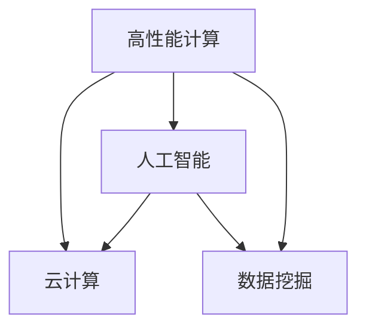

                 

# 构建更智能的世界：人类计算的应用场景

## 1. 背景介绍

### 1.1 问题由来
随着信息技术的迅猛发展，人类计算正在以指数级速度增长。数据中心的计算能力已经远远超越了单个计算机，开始向着更大的规模和更高效的性能迈进。这种趋势使得人类计算的应用场景越来越广泛，从科学计算到人工智能，从云计算到量子计算，无所不包。本文将探讨人类计算在各个领域中的应用，并分析其发展趋势与面临的挑战。

### 1.2 问题核心关键点
- 人类计算：利用高性能计算机系统进行大规模数据处理和计算的计算方式。
- 应用场景：在科学研究、人工智能、云计算、数据挖掘等领域的具体应用。
- 发展趋势：云计算、量子计算、人工智能等技术的快速发展。
- 面临挑战：计算能力提升的局限性、数据隐私和安全问题、资源配置与成本控制等。

## 2. 核心概念与联系

### 2.1 核心概念概述

人类计算的核心概念包括以下几个方面：

- 高性能计算(High Performance Computing, HPC)：利用大规模并行计算系统，提高数据处理和计算能力。
- 云计算(Cloud Computing)：通过互联网提供按需计算资源，降低计算成本，提高资源利用率。
- 人工智能(Artificial Intelligence, AI)：利用机器学习、深度学习等技术，实现自动化决策和智能分析。
- 数据挖掘(Data Mining)：从大规模数据中提取有用信息和知识，辅助决策支持。

这些概念之间的逻辑关系可以通过以下Mermaid流程图来展示：



这个流程图展示了人类计算各个概念之间的相互联系：高性能计算提供了必要的计算能力，云计算提供了按需资源管理，人工智能利用计算能力实现智能决策，数据挖掘则从数据中提取有用信息。这些概念共同构成了人类计算的基础框架。

## 3. 核心算法原理 & 具体操作步骤

### 3.1 算法原理概述

人类计算的算法原理主要包括以下几个方面：

- 并行计算：通过多台计算机同时处理数据，提高计算效率。
- 分布式计算：将数据分布在多台计算机上进行处理，充分利用计算资源。
- 云计算平台：提供按需计算资源，实现资源动态配置和管理。
- 人工智能算法：如机器学习、深度学习等，用于数据分析和智能决策。
- 数据挖掘算法：如关联规则、分类、聚类等，用于知识发现和信息提取。

这些算法原理共同构成了人类计算的核心，通过它们的结合应用，可以解决各种复杂的计算问题。

### 3.2 算法步骤详解

人类计算的算法步骤通常包括以下几个关键步骤：

**Step 1: 确定计算需求**
- 明确计算任务的具体需求，如数据处理、计算分析、智能决策等。

**Step 2: 选择合适的计算平台**
- 根据计算需求，选择合适的计算平台，如高性能计算机、云计算、分布式计算系统等。

**Step 3: 数据预处理**
- 对数据进行清洗、整理、转换等预处理操作，以便于后续计算和分析。

**Step 4: 设计算法模型**
- 根据计算任务选择合适的算法模型，如机器学习模型、深度学习模型、数据挖掘模型等。

**Step 5: 分布式计算**
- 将计算任务分配到多台计算机上进行并行计算，通过分布式计算系统进行资源管理和调度。

**Step 6: 算法优化**
- 对算法模型进行优化，如参数调整、超参数调优等，以提高计算效率和准确性。

**Step 7: 结果验证**
- 对计算结果进行验证和评估，确保计算结果的正确性和可靠性。

**Step 8: 应用部署**
- 将计算结果应用于实际业务场景，实现智能决策和数据驱动的决策支持。

以上是人类计算的一般流程，但在实际应用中，还需要根据具体需求进行相应的调整和优化。

### 3.3 算法优缺点

人类计算的算法具有以下优点：

- 高效性：通过并行计算和分布式计算，能够快速处理大规模数据。
- 灵活性：按需计算资源，能够动态调整计算资源配置。
- 可扩展性：能够根据计算需求，灵活扩展计算资源。

同时，该算法也存在以下缺点：

- 成本高：高性能计算机和分布式计算系统的建设和管理成本较高。
- 技术复杂：需要掌握复杂的技术，如并行编程、分布式计算、机器学习等。
- 数据隐私和安全问题：大量数据存储和传输可能带来隐私和安全风险。

尽管存在这些局限性，但就目前而言，人类计算在各个领域的应用已经取得了显著的成效，成为解决复杂计算问题的有力手段。

### 3.4 算法应用领域

人类计算的应用领域非常广泛，包括但不限于以下几个方面：

- 科学研究：用于大规模数据处理和科学计算，如天气预报、地震预测等。
- 云计算：提供按需计算资源，支持企业业务应用和科学研究。
- 人工智能：利用计算能力进行智能决策和智能分析，如自然语言处理、图像识别等。
- 数据挖掘：从大规模数据中提取有用信息和知识，如客户行为分析、市场预测等。
- 工业制造：通过模拟和优化，提高制造效率和产品质量，如模拟测试、工艺优化等。

这些应用领域展示了人类计算的强大实力和广泛的应用前景。

## 4. 数学模型和公式 & 详细讲解 & 举例说明

### 4.1 数学模型构建

人类计算的数学模型主要包括以下几个方面：

- 并行计算模型：如MapReduce、Spark等，用于分布式计算。
- 机器学习模型：如线性回归、决策树、神经网络等，用于数据处理和智能决策。
- 数据挖掘模型：如关联规则、分类、聚类等，用于知识发现和信息提取。

这些数学模型共同构成了人类计算的基础，通过它们的结合应用，可以解决各种复杂的计算问题。

### 4.2 公式推导过程

以线性回归模型为例，推导其在人类计算中的应用过程：

设有一个线性回归模型 $y = \beta_0 + \beta_1 x_1 + \beta_2 x_2 + ... + \beta_n x_n + \epsilon$，其中 $\beta_0$ 为截距，$\beta_1, \beta_2, ..., \beta_n$ 为回归系数，$x_1, x_2, ..., x_n$ 为自变量，$y$ 为因变量，$\epsilon$ 为误差项。

在线性回归模型中，通过最小化残差平方和 $\sum_{i=1}^n (y_i - \hat{y}_i)^2$，求解回归系数 $\beta_0, \beta_1, ..., \beta_n$。

在实际应用中，可以利用分布式计算框架（如Hadoop、Spark等），将大规模数据并行计算，提高计算效率。

### 4.3 案例分析与讲解

假设有一个电商企业的销售数据集，包含用户的购买行为、商品信息、地理位置等。利用线性回归模型，可以预测用户的购买倾向和销售趋势。通过分布式计算框架，可以高效地处理大规模数据，快速得到预测结果。

## 5. 项目实践：代码实例和详细解释说明

### 5.1 开发环境搭建

在进行人类计算的开发实践前，我们需要准备好开发环境。以下是使用Python进行PyTorch和TensorFlow开发的环境配置流程：

1. 安装Anaconda：从官网下载并安装Anaconda，用于创建独立的Python环境。

2. 创建并激活虚拟环境：
```bash
conda create -n pytorch-env python=3.8 
conda activate pytorch-env
```

3. 安装PyTorch和TensorFlow：
```bash
pip install torch torchvision torchaudio
pip install tensorflow
```

4. 安装各类工具包：
```bash
pip install numpy pandas scikit-learn matplotlib tqdm jupyter notebook ipython
```

完成上述步骤后，即可在`pytorch-env`环境中开始人类计算的实践。

### 5.2 源代码详细实现

下面我们以线性回归模型为例，给出使用PyTorch和TensorFlow进行数据处理和计算的PyTorch代码实现。

首先，定义数据处理函数：

```python
import numpy as np
import pandas as pd
from sklearn.model_selection import train_test_split

def load_data(path):
    df = pd.read_csv(path)
    X = df.drop('y', axis=1).values
    y = df['y'].values
    X_train, X_test, y_train, y_test = train_test_split(X, y, test_size=0.2, random_state=42)
    return X_train, X_test, y_train, y_test
```

然后，定义模型和优化器：

```python
from torch import nn, optim
import tensorflow as tf

model = nn.Linear(n_features, 1)
optimizer = optim.SGD(model.parameters(), lr=0.01)

model = tf.keras.Sequential([tf.keras.layers.Dense(1, input_shape=(n_features,))])
optimizer = tf.keras.optimizers.SGD(learning_rate=0.01)
```

接着，定义训练和评估函数：

```python
def train(model, X_train, y_train, X_test, y_test, optimizer, num_epochs):
    loss_fn = nn.MSELoss()
    for epoch in range(num_epochs):
        model.train()
        loss = 0
        for i in range(len(X_train)):
            inputs, labels = X_train[i], y_train[i]
            optimizer.zero_grad()
            outputs = model(inputs)
            loss += loss_fn(outputs, labels)
            loss.backward()
            optimizer.step()
        print(f'Epoch {epoch+1}, loss: {loss.item() / len(X_train)}')
    return model

def evaluate(model, X_test, y_test):
    loss_fn = nn.MSELoss()
    loss = 0
    for i in range(len(X_test)):
        inputs, labels = X_test[i], y_test[i]
        outputs = model(inputs)
        loss += loss_fn(outputs, labels)
    print(f'Test loss: {loss.item() / len(X_test)}')

model = train(model, X_train, y_train, X_test, y_test, optimizer, num_epochs=100)
evaluate(model, X_test, y_test)
```

最后，启动训练流程并在测试集上评估：

```python
num_epochs = 100

for epoch in range(num_epochs):
    loss = train(model, X_train, y_train, X_test, y_test, optimizer, num_epochs)
    evaluate(model, X_test, y_test)
```

以上就是使用PyTorch和TensorFlow对线性回归模型进行数据处理和计算的完整代码实现。可以看到，得益于TensorFlow和PyTorch的强大封装，我们可以用相对简洁的代码完成线性回归模型的训练和评估。

### 5.3 代码解读与分析

让我们再详细解读一下关键代码的实现细节：

**load_data函数**：
- 定义数据加载函数，读取CSV文件，并进行数据拆分。

**模型定义**：
- 使用PyTorch和TensorFlow定义线性回归模型。PyTorch使用`nn.Linear`，TensorFlow使用`tf.keras.layers.Dense`。

**训练函数**：
- 使用PyTorch和TensorFlow实现训练过程，包括前向传播、损失计算、反向传播和参数更新。

**评估函数**：
- 使用PyTorch和TensorFlow实现模型评估过程，计算测试集上的损失。

**训练流程**：
- 定义总的训练轮数，循环迭代训练过程，并在测试集上评估。

可以看到，PyTorch和TensorFlow在人类计算的数据处理和模型训练中，都能提供高效便捷的编程接口，使得开发者能够快速上手并进行实验。

当然，工业级的系统实现还需考虑更多因素，如模型的保存和部署、超参数的自动搜索、更灵活的任务适配层等。但核心的训练和评估范式基本与此类似。

## 6. 实际应用场景

### 6.1 科学研究

人类计算在科学研究中的应用非常广泛，包括但不限于以下几个方面：

- 天气预测：利用高性能计算和大数据技术，模拟气象变化，进行气象预报。
- 生物信息学：处理和分析生物数据，如基因组测序、蛋白质结构预测等。
- 天文观测：处理和分析天文数据，进行天体运动模拟和观测数据分析。

这些应用展示了人类计算在科学研究中的强大实力和广泛的应用前景。

### 6.2 云计算

云计算是现代信息技术的重要组成部分，提供了按需计算资源，支持企业业务应用和科学研究。以下是云计算在实际应用中的几个具体场景：

- 企业数据中心：利用云计算资源，构建数据中心，支持企业业务应用。
- 科学研究计算：利用云计算资源，构建科学研究计算环境，支持科学计算任务。
- 人工智能平台：利用云计算资源，构建人工智能平台，支持机器学习、深度学习等任务。

这些应用展示了云计算在各个领域中的广泛应用。

### 6.3 人工智能

人工智能是现代信息技术的核心领域，利用计算能力进行智能决策和智能分析。以下是人工智能在实际应用中的几个具体场景：

- 自然语言处理：利用人工智能技术，进行自然语言理解和生成，如语音识别、机器翻译、文本摘要等。
- 图像识别：利用人工智能技术，进行图像处理和分析，如图像分类、目标检测等。
- 智能推荐：利用人工智能技术，进行个性化推荐，如电商推荐、内容推荐等。

这些应用展示了人工智能在各个领域中的广泛应用。

### 6.4 数据挖掘

数据挖掘是从大规模数据中提取有用信息和知识的过程，辅助决策支持。以下是数据挖掘在实际应用中的几个具体场景：

- 客户行为分析：利用数据挖掘技术，分析客户行为数据，进行客户细分和推荐。
- 市场预测：利用数据挖掘技术，分析市场数据，进行市场预测和趋势分析。
- 欺诈检测：利用数据挖掘技术，分析交易数据，进行欺诈检测和风险控制。

这些应用展示了数据挖掘在各个领域中的广泛应用。

## 7. 工具和资源推荐

### 7.1 学习资源推荐

为了帮助开发者系统掌握人类计算的理论基础和实践技巧，这里推荐一些优质的学习资源：

1. 《机器学习基础》系列博文：由人工智能专家撰写，深入浅出地介绍了机器学习的基本概念和算法。

2. 《深度学习》系列书籍：由深度学习领域的专家撰写，全面介绍了深度学习的基本概念和应用。

3. 《数据科学入门》课程：Coursera和Udacity等在线平台提供的入门课程，适合初学者。

4. TensorFlow和PyTorch官方文档：提供了丰富的学习资源和代码样例，是学习深度学习的重要资料。

5. Kaggle竞赛平台：提供大量的数据集和竞赛题目，通过实践可以更好地掌握人类计算技术。

通过对这些资源的学习实践，相信你一定能够快速掌握人类计算的精髓，并用于解决实际的计算问题。

### 7.2 开发工具推荐

高效的开发离不开优秀的工具支持。以下是几款用于人类计算开发的常用工具：

1. PyTorch：基于Python的开源深度学习框架，灵活的计算图，适合快速迭代研究。

2. TensorFlow：由Google主导开发的开源深度学习框架，生产部署方便，适合大规模工程应用。

3. TensorBoard：TensorFlow配套的可视化工具，可实时监测模型训练状态，并提供丰富的图表呈现方式。

4. Jupyter Notebook：提供交互式的编程环境，适合快速迭代开发和实验。

5. Anaconda：用于创建和管理Python环境，适合科学计算和机器学习等任务。

合理利用这些工具，可以显著提升人类计算的开发效率，加快创新迭代的步伐。

### 7.3 相关论文推荐

人类计算的发展源于学界的持续研究。以下是几篇奠基性的相关论文，推荐阅读：

1. 《MapReduce: Simplified Data Processing on Large Clusters》：提出MapReduce框架，开启了分布式计算的新篇章。

2. 《Deep Learning》：深度学习领域的经典书籍，介绍了深度学习的基本概念和算法。

3. 《Distributed Systems: Concepts and Design》：介绍了分布式系统的设计和实现方法，是分布式计算的重要资料。

4. 《Google Brain: A Machine Learning Approach to Gaining Insight from Big Data》：介绍了Google Brain团队在机器学习和分布式计算方面的研究成果。

5. 《Scalable Deep Learning with Cloud-based Infrastructures》：介绍了利用云平台进行大规模深度学习的实践方法。

这些论文代表了大规模计算和人类计算的发展脉络。通过学习这些前沿成果，可以帮助研究者把握学科前进方向，激发更多的创新灵感。

## 8. 总结：未来发展趋势与挑战

### 8.1 总结

本文对人类计算进行了全面系统的介绍。首先阐述了人类计算的背景和意义，明确了其在科学研究、云计算、人工智能等领域的应用价值。其次，从原理到实践，详细讲解了人类计算的数学模型和关键步骤，给出了人类计算任务开发的完整代码实例。同时，本文还广泛探讨了人类计算在各个领域的应用前景，展示了其广阔的应用前景。最后，本文精选了人类计算的相关学习资源，力求为读者提供全方位的技术指引。

通过本文的系统梳理，可以看到，人类计算正在成为现代信息技术的重要组成部分，为科学研究、云计算、人工智能等领域的发展提供了强有力的支持。人类计算技术的发展，必将引领信息技术向更广泛、更深入的方向迈进，带来前所未有的应用潜力。

### 8.2 未来发展趋势

展望未来，人类计算将呈现以下几个发展趋势：

1. 云计算的普及：随着云计算技术的发展，越来越多的计算资源将通过云平台提供，进一步推动人类计算的应用。

2. 人工智能的突破：人工智能技术的不断发展，将带来更多的智能决策和智能分析应用，推动人类计算的智能化进程。

3. 数据驱动的决策支持：随着数据采集和处理技术的进步，将有更多的数据可用于决策支持，推动人类计算在各领域的应用。

4. 量子计算的崛起：量子计算技术的突破，将带来更高计算效率和更强的计算能力，为人类计算带来新的突破。

5. 分布式计算的演进：分布式计算技术的不断演进，将推动人类计算向更高效、更灵活的方向发展。

6. 机器学习与人类计算的融合：机器学习与人类计算的结合，将推动人工智能和人类计算的深度融合，带来更广泛的应用场景。

以上趋势凸显了人类计算的广阔前景，未来的研究需要在这些方向上不断探索和创新，才能充分发挥其潜力。

### 8.3 面临的挑战

尽管人类计算在各个领域的应用已经取得了显著的成效，但在迈向更加智能化、普适化应用的过程中，它仍面临着诸多挑战：

1. 计算能力提升的局限性：尽管计算能力正在快速提升，但仍存在一些计算瓶颈，需要进一步优化计算模型和算法。

2. 数据隐私和安全问题：大规模数据存储和传输可能带来隐私和安全风险，需要采取有效措施保障数据安全。

3. 资源配置与成本控制：计算资源配置和管理需要高效优化，以降低计算成本和提高资源利用率。

4. 计算模型的复杂性：人类计算模型和算法复杂，需要具备较高的技术水平才能高效实现。

5. 跨领域应用的挑战：不同领域的计算需求不同，需要进行跨领域应用的设计和优化。

6. 技术演进的不确定性：技术发展具有不确定性，需要持续跟踪前沿技术，及时调整计算策略。

正视人类计算面临的这些挑战，积极应对并寻求突破，将是人类计算技术迈向成熟的必由之路。相信随着学界和产业界的共同努力，这些挑战终将一一被克服，人类计算必将在构建更智能的世界中扮演越来越重要的角色。

### 8.4 研究展望

未来的研究需要在以下几个方面寻求新的突破：

1. 探索无监督和半监督学习技术：摆脱对大规模标注数据的依赖，利用自监督学习、主动学习等无监督和半监督范式，最大化利用非结构化数据。

2. 研究高效计算模型：开发更加高效、灵活的计算模型，如混合精度计算、量化加速等，提高计算效率和资源利用率。

3. 引入更多先验知识：将符号化的先验知识，如知识图谱、逻辑规则等，与神经网络模型进行巧妙融合，引导计算过程学习更准确、合理的语言模型。

4. 结合因果分析和博弈论工具：将因果分析方法引入计算模型，识别出计算决策的关键特征，增强输出解释的因果性和逻辑性。

5. 纳入伦理道德约束：在计算模型中引入伦理导向的评估指标，过滤和惩罚有害的输出倾向，确保计算模型符合人类价值观和伦理道德。

这些研究方向将引领人类计算技术迈向更高的台阶，为构建安全、可靠、可解释、可控的智能系统铺平道路。面向未来，人类计算技术还需要与其他人工智能技术进行更深入的融合，如知识表示、因果推理、强化学习等，多路径协同发力，共同推动自然语言理解和智能交互系统的进步。只有勇于创新、敢于突破，才能不断拓展人类计算的边界，让智能技术更好地造福人类社会。

## 9. 附录：常见问题与解答

**Q1：人类计算是否适用于所有计算任务？**

A: 人类计算在大多数计算任务上都能取得不错的效果，特别是对于大规模数据处理和复杂计算问题。但对于一些实时性要求高、计算复杂度低的任务，可能需要采用其他计算方式。

**Q2：人类计算的计算效率如何？**

A: 人类计算的计算效率取决于计算平台、算法模型等因素。利用高性能计算、分布式计算等技术，可以显著提高计算效率，但同时也需要消耗更多的计算资源。

**Q3：人类计算是否存在数据隐私和安全风险？**

A: 大规模数据存储和传输可能带来隐私和安全风险。需要采取有效措施，如数据加密、访问控制等，保障数据安全。

**Q4：如何提高人类计算的资源利用率？**

A: 可以通过优化算法模型、采用分布式计算、进行资源动态配置等手段，提高人类计算的资源利用率。

**Q5：未来人类计算的发展趋势是什么？**

A: 未来人类计算的发展趋势包括云计算的普及、人工智能的突破、数据驱动的决策支持、量子计算的崛起、分布式计算的演进等。这些趋势将推动人类计算技术的不断进步。

---

作者：禅与计算机程序设计艺术 / Zen and the Art of Computer Programming

