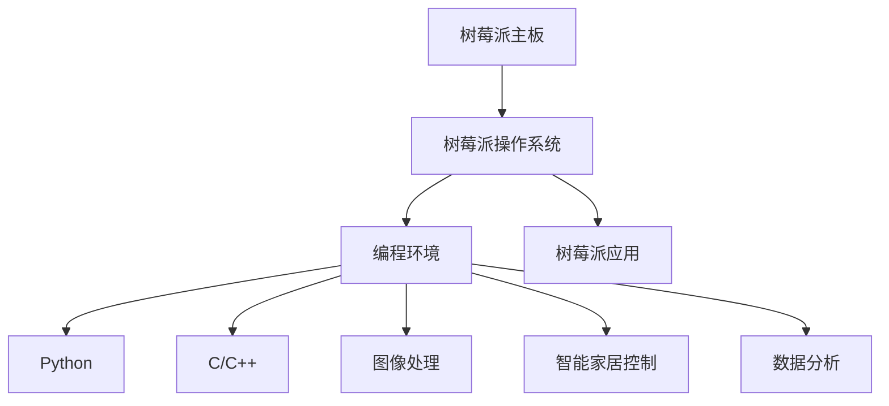

                 

# 树莓派开发：从硬件到软件的全栈方案

## 1. 背景介绍

### 1.1 问题由来
树莓派（Raspberry Pi）作为一款高性能、低成本的嵌入式计算平台，近年来受到了广大硬件和软件开发者们的青睐。它不仅具有强大的计算能力和丰富的外设接口，还提供了灵活的开发环境和友好的社区支持。然而，许多开发者在初次接触树莓派时，往往会遇到硬件搭建、操作系统配置、软件开发等多方面的挑战，需要花费大量时间和精力进行学习和调试。

为了帮助开发者系统、高效地进行树莓派开发，本文将详细介绍树莓派开发的全栈方案，包括硬件搭建、操作系统配置、编程环境搭建、主要应用开发等方面。通过这篇文章，读者将掌握从硬件到软件一体化的开发流程，顺利启动树莓派开发之旅。

## 2. 核心概念与联系

### 2.1 核心概念概述
树莓派开发涉及到硬件和软件两个方面的概念。硬件方面，包括树莓派主板、电源、摄像头、显示屏等外围设备；软件方面，包括树莓派操作系统、编程环境、主要应用等。

为更好地理解树莓派开发，本节将介绍几个核心概念：

- **树莓派主板（Raspberry Pi Board）**：树莓派的核心硬件，提供计算、存储、网络等功能。
- **树莓派操作系统（Raspberry Pi OS）**：运行在树莓派主板上的操作系统，支持Python、C/C++等多种编程语言。
- **树莓派编程环境**：包括IDE（如Thonny、PyCharm）、调试工具（如GDB）等，方便开发者进行代码编写和调试。
- **树莓派应用**：包括图像处理、智能家居控制、数据分析等各类应用，通过编写代码实现特定功能。

这些概念之间的联系可以通过以下Mermaid流程图来展示：



这个流程图展示了这个全栈方案中各组件的相互依赖关系：

1. 树莓派主板是硬件基础，操作系统、编程环境、应用均基于其运行。
2. 树莓派操作系统为编程环境和应用提供了运行平台。
3. 编程环境为代码开发和调试提供支持，包括IDE和调试工具。
4. 应用通过编程环境实现特定功能，包括图像处理、智能家居控制、数据分析等。

## 3. 核心算法原理 & 具体操作步骤

### 3.1 算法原理概述

树莓派开发的核心算法原理主要涉及计算机系统原理、操作系统原理、网络通信原理等。下面以嵌入式系统为例，简要介绍其核心原理：

- **嵌入式系统**：指运行在嵌入式硬件平台上的操作系统和应用程序。嵌入式系统通常资源受限，要求低功耗、高效能。
- **微控制器（MCU）**：嵌入式系统的核心，集成了CPU、内存、外设接口等。
- **实时操作系统（RTOS）**：专为嵌入式系统设计，提供高效的资源管理、任务调度等功能。

### 3.2 算法步骤详解

树莓派开发的具体步骤如下：

1. **硬件搭建**：
   - 选择合适的树莓派主板和外围设备。
   - 连接电源、显示屏、键盘、鼠标等设备。
   - 配置网络连接，如WiFi或以太网。

2. **操作系统配置**：
   - 安装树莓派操作系统，包括初始化和更新。
   - 设置时区、用户账户、软件包源等配置。
   - 安装常用软件包，如Python、Git、GitHub等。

3. **编程环境搭建**：
   - 安装IDE，如Thonny、PyCharm等。
   - 配置调试工具，如GDB、Valgrind等。
   - 搭建虚拟环境，如virtualenv、conda等。

4. **主要应用开发**：
   - 学习Python、C/C++等编程语言，掌握基本编程技巧。
   - 学习图像处理、智能家居控制、数据分析等树莓派应用。
   - 结合实际需求，开发并调试应用。

5. **测试和部署**：
   - 在开发环境中测试应用，确保功能正常。
   - 进行单元测试、集成测试、压力测试等。
   - 部署到实际环境中，进行系统测试和优化。

### 3.3 算法优缺点

树莓派开发具有以下优点：

- **低成本**：树莓派硬件价格低廉，外围设备相对便宜，降低了开发成本。
- **资源丰富**：树莓派操作系统支持多种编程语言，提供了丰富的库和工具。
- **社区支持**：树莓派有庞大的开发者社区，资源丰富，问题易于解决。

同时，树莓派开发也存在以下缺点：

- **性能受限**：树莓派硬件性能有限，适合轻量级应用。
- **开发门槛高**：初学者需要掌握嵌入式系统、编程语言等多方面知识。
- **实时性差**：树莓派系统一般不具备高实时性，不适合要求高精度的应用。

### 3.4 算法应用领域

树莓派开发广泛应用于以下领域：

- **物联网（IoT）**：树莓派可以作为物联网设备的计算核心，实现远程控制、数据采集等功能。
- **智能家居**：树莓派可以用于智能家居设备的控制和数据分析，实现自动化和智能化。
- **数据分析**：树莓派可以进行图像处理、声音识别等数据分析，获取有用信息。
- **教育**：树莓派用于教育实验和教学，培养学生的编程和嵌入式开发能力。
- **科学研究**：树莓派可以用于科学实验，如机器人控制、传感器数据分析等。

这些应用领域展示了树莓派开发的广泛适用性，让开发者可以针对实际需求，进行灵活的应用开发。

## 4. 数学模型和公式 & 详细讲解

### 4.1 数学模型构建

树莓派开发中的数学模型主要涉及操作系统调度、任务调度、资源管理等。以下以嵌入式系统的任务调度模型为例，简要介绍其数学模型：

- **任务队列**：采用队列数据结构，存储等待执行的任务。
- **优先级调度算法**：根据任务的优先级进行调度，通常使用时间片轮转、优先级抢占等算法。
- **时间片长度**：每个任务的执行时间限制，通常根据实际情况调整。

### 4.2 公式推导过程

嵌入式系统的时间片轮转调度算法可以表示为：

$$
\text{Scheduling Algorithm} = \text{Round Robin} = \frac{\text{Time Quantum}}{N}
$$

其中，$\text{Time Quantum}$表示时间片长度，$N$表示任务数量。算法的时间复杂度为$O(N)$。

### 4.3 案例分析与讲解

以下通过一个简单的示例，展示树莓派开发中任务调度的实际应用：

1. **任务定义**：假设树莓派需要执行两个任务，一个是图像处理任务，另一个是数据分析任务。
2. **任务队列**：将这两个任务放入队列中，按照优先级进行排序。
3. **时间片轮转调度**：每个任务执行时间片为100ms，交替执行两个任务。
4. **结果分析**：通过时间片轮转调度，两个任务交替执行，使得系统资源得到充分利用，任务执行效率提高。

## 5. 项目实践：代码实例和详细解释说明

### 5.1 开发环境搭建

树莓派开发环境的搭建包括以下步骤：

1. **硬件准备**：
   - 购买树莓派主板、电源、显示屏、键盘、鼠标等设备。
   - 连接设备，确保电源正常供电。

2. **操作系统安装**：
   - 下载树莓派操作系统镜像，如Raspberry Pi OS。
   - 使用SD卡格式化工具（如Balena Etcher）将镜像写入SD卡。
   - 将SD卡插入树莓派主板，连接显示器和键盘。
   - 开启树莓派，设置初始化密码。

3. **网络配置**：
   - 连接WiFi或以太网，确保树莓派能够访问互联网。
   - 配置网络设置，如IP地址、DNS服务器等。

### 5.2 源代码详细实现

以下是一个简单的Python程序，用于树莓派上显示问候语：

```python
import time
import RPi.GPIO as GPIO

GPIO.setmode(GPIO.BOARD)
GPIO.setup(17, GPIO.OUT)

while True:
    GPIO.output(17, GPIO.HIGH)
    time.sleep(1)
    GPIO.output(17, GPIO.LOW)
    time.sleep(1)
```

代码解释：

- **第一步**：导入time和RPi.GPIO库，设置GPIO引脚。
- **第二步**：开启循环，使用GPIO输出高电平和低电平，模拟灯泡亮灭。
- **第三步**：通过无限循环，使程序持续运行。

### 5.3 代码解读与分析

以下对该程序进行详细解读：

1. **第一步**：导入time和RPi.GPIO库，用于时间管理和GPIO控制。
2. **第二步**：设置GPIO引脚为输出模式，开启LED灯。
3. **第三步**：在循环中，通过GPIO输出高电平和低电平，控制LED灯亮灭。
4. **第四步**：通过无限循环，使程序持续运行，LED灯不断亮灭。

### 5.4 运行结果展示

运行上述程序，树莓派上的LED灯会交替亮灭，呈现出动态效果。这展示了树莓派开发的基本功能，可以通过编写代码实现简单的交互。

## 6. 实际应用场景

### 6.1 智能家居控制

树莓派可以作为智能家居设备的计算核心，实现远程控制、自动化等功能。通过编写代码，可以实现以下应用：

- **灯光控制**：通过树莓派控制灯光开关，实现定时开灯、节能模式等功能。
- **温度控制**：通过树莓派监测室内温度，自动调节空调或加热器，提升居住舒适度。
- **安防监控**：通过树莓派连接摄像头，实时监测家居环境，及时报警。

### 6.2 数据分析

树莓派可以进行图像处理、声音识别等数据分析，获取有用信息。以下是一个简单的图像处理应用示例：

1. **步骤一**：采集图像数据，如家庭照片。
2. **步骤二**：使用OpenCV等库对图像进行处理，提取特征。
3. **步骤三**：通过机器学习模型进行分类或识别，如人脸识别、物体识别等。
4. **步骤四**：根据识别结果，实现自动化操作，如登录网站、开启摄像头等。

### 6.3 教育实验

树莓派用于教育实验和教学，培养学生的编程和嵌入式开发能力。以下是一个简单的树莓派编程教学示例：

1. **步骤一**：选择适合的编程课程，如Python编程、嵌入式系统开发等。
2. **步骤二**：编写程序代码，实现特定功能。
3. **步骤三**：在树莓派上运行程序，展示运行结果。
4. **步骤四**：进行问题讨论，解决学生在编程过程中遇到的问题。

### 6.4 未来应用展望

随着树莓派硬件性能的提升和软件生态的完善，其应用领域将不断扩展，具体包括：

- **工业控制**：树莓派用于工业设备的控制和监控，提高生产效率和安全性。
- **医疗设备**：树莓派用于医疗设备的智能化改造，实现远程监控、数据分析等。
- **科学研究**：树莓派用于科学研究实验，进行数据采集、分析等。
- **物联网**：树莓派作为物联网设备的计算核心，实现设备互联和数据共享。

这些应用展望展示了树莓派开发的广阔前景，未来将有更多的创新应用出现。

## 7. 工具和资源推荐

### 7.1 学习资源推荐

为了帮助开发者系统掌握树莓派开发的技能，以下推荐一些优质的学习资源：

1. **《树莓派官方手册》**：树莓派官方文档，详细介绍了硬件、软件、编程等方面的内容。
2. **《树莓派实战》**：开源书籍，介绍了树莓派开发的实战案例和技巧。
3. **《嵌入式系统设计与开发》**：大学教材，介绍了嵌入式系统的原理和开发方法。
4. **《Python编程快速上手》**：入门书籍，介绍了Python语言的编程技巧。
5. **《树莓派开发实战》**：开源课程，通过实际项目进行树莓派开发教学。

通过这些资源的学习，相信你一定能够快速掌握树莓派开发的精髓，并用于解决实际的工程问题。

### 7.2 开发工具推荐

树莓派开发需要一些专业的工具，以下推荐几款常用的开发工具：

1. **Thonny**：一款友好的Python IDE，支持语法高亮、代码补全等功能。
2. **PyCharm**：一款功能强大的Python IDE，支持调试、测试、版本控制等。
3. **GDB**：一款流行的调试工具，支持多语言调试。
4. **Valgrind**：一款内存调试工具，用于检测内存泄漏等问题。
5. **git**：一款版本控制系统，用于代码管理和版本控制。

合理利用这些工具，可以显著提升树莓派开发的效率，加快创新迭代的步伐。

### 7.3 相关论文推荐

树莓派开发涉及多个学科，以下是几篇相关的论文，推荐阅读：

1. **《树莓派嵌入式系统设计与实现》**：介绍树莓派硬件设计和软件实现的技术细节。
2. **《树莓派操作系统开发与优化》**：介绍树莓派操作系统的开发和优化方法。
3. **《基于树莓派的智能家居系统设计》**：介绍树莓派在智能家居中的应用。
4. **《树莓派图像处理与分析》**：介绍树莓派在图像处理和分析中的应用。
5. **《树莓派嵌入式编程实践》**：介绍树莓派嵌入式编程的实践经验。

这些论文代表了大规模语言模型微调技术的发展脉络。通过学习这些前沿成果，可以帮助研究者把握学科前进方向，激发更多的创新灵感。

## 8. 总结：未来发展趋势与挑战

### 8.1 总结

本文对树莓派开发的全栈方案进行了全面系统的介绍。首先阐述了树莓派开发的背景和意义，明确了从硬件到软件一体化的开发流程。其次，从原理到实践，详细讲解了树莓派开发的步骤和关键技术，给出了树莓派开发的完整代码实例。同时，本文还广泛探讨了树莓派开发在智能家居、数据分析、教育实验等众多领域的应用前景，展示了树莓派开发的广泛适用性。此外，本文精选了树莓派开发的各类学习资源，力求为读者提供全方位的技术指引。

通过本文的系统梳理，可以看到，树莓派开发具有极高的实用价值，能够满足多种嵌入式系统开发的需求。相信随着树莓派硬件和软件生态的不断完善，其应用将更加广泛，为智能设备的普及和普及做出更多贡献。

### 8.2 未来发展趋势

展望未来，树莓派开发将呈现以下几个发展趋势：

1. **硬件性能提升**：随着技术的发展，树莓派硬件性能将不断提升，支持更多复杂的应用场景。
2. **软件生态丰富**：树莓派社区将不断完善软件生态，提供更多的库、工具和框架。
3. **应用场景扩展**：树莓派开发将进一步扩展到更多领域，如工业控制、医疗设备等。
4. **开发者社区壮大**：树莓派开发者社区将不断壮大，推动技术交流和知识共享。
5. **标准化规范**：树莓派将逐步制定标准化规范，提高开发效率和可维护性。

这些趋势展示了树莓派开发的广阔前景，相信在未来，树莓派将有更多的创新应用出现，推动嵌入式系统开发的发展。

### 8.3 面临的挑战

尽管树莓派开发在技术上不断进步，但仍面临以下挑战：

1. **硬件性能瓶颈**：树莓派硬件性能有限，可能无法满足一些高要求的应用场景。
2. **软件生态不足**：树莓派软件生态还不够完善，缺少一些高精度的库和工具。
3. **开发门槛高**：树莓派开发涉及硬件和软件多个方面，初学者需要掌握多个领域的知识。
4. **资源限制**：树莓派资源有限，可能无法满足一些高性能计算任务的需求。
5. **实时性问题**：树莓派系统一般不具备高实时性，不适合要求高精度的应用。

这些挑战需要开发者不断探索和解决，以便更好地利用树莓派的优势，发挥其潜力。

### 8.4 研究展望

针对以上挑战，未来的研究需要在以下几个方面寻求新的突破：

1. **硬件性能优化**：研究硬件优化技术，提升树莓派的计算能力和存储能力。
2. **软件生态建设**：开发更多高精度的库和工具，完善树莓派软件生态。
3. **开发者培训**：开发树莓派开发者培训课程，降低开发门槛，提高开发效率。
4. **资源管理优化**：优化树莓派资源管理，提高系统性能和稳定性。
5. **实时性改进**：研究实时操作系统和实时任务调度算法，提升树莓派的实时性。

这些研究方向的探索，必将引领树莓派开发技术迈向更高的台阶，为嵌入式系统开发提供更多的创新思路。总之，树莓派开发需要从硬件、软件、应用等多个方面进行全面优化，才能实现其广泛应用。

## 9. 附录：常见问题与解答

**Q1：树莓派开发需要掌握哪些知识？**

A: 树莓派开发需要掌握以下知识：
- 嵌入式系统原理
- 树莓派硬件搭建
- 树莓派操作系统配置
- 编程语言（如Python、C/C++）
- 树莓派编程环境搭建
- 树莓派应用开发

**Q2：树莓派开发常见的问题有哪些？**

A: 树莓派开发常见的问题包括：
- 硬件连接问题
- 操作系统配置问题
- 编程环境搭建问题
- 应用开发问题
- 网络配置问题

**Q3：如何解决树莓派开发中的问题？**

A: 解决树莓派开发中问题的步骤如下：
- 确定问题所在，找到问题根源。
- 查阅文档和教程，寻找解决方案。
- 在线社区和论坛寻求帮助，获取更多资源。
- 实践验证，确认解决方案是否可行。
- 总结经验，避免类似问题再次出现。

这些问答展示了树莓派开发的常见问题及解决方法，帮助开发者更快地掌握树莓派开发技能。

---

作者：禅与计算机程序设计艺术 / Zen and the Art of Computer Programming

