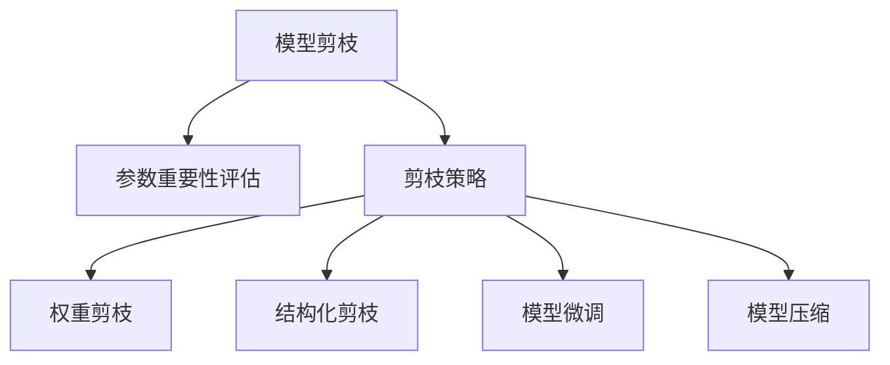

                 

## 1. 背景介绍

### 1.1 问题由来
随着深度学习模型的不断深化，模型的参数规模越来越大，导致其存储和计算需求大幅提升。这在计算资源有限的场景下，带来了严重的问题，如推理速度慢、内存占用大等。因此，模型剪枝（Model Pruning）技术应运而生，通过去除冗余参数和计算，大幅降低模型规模和复杂度，同时保持模型性能的稳定。

### 1.2 问题核心关键点
模型剪枝的核心在于如何在保留模型精度的情况下，通过删除部分冗余的权重和计算图，大幅减小模型规模，提升计算和存储效率。具体来说，模型剪枝一般分为以下步骤：
1. 评估模型中各参数的重要程度。
2. 根据重要性对参数进行排序。
3. 选择合适的剪枝策略，并删除低重要性参数。
4. 通过微调或回退训练恢复模型性能。

### 1.3 问题研究意义
研究模型剪枝技术，对于优化深度学习模型的性能，提高计算效率，具有重要的理论和实践意义：

1. **降低计算资源成本**：通过剪枝，大幅度减小模型参数规模，可以显著降低训练和推理所需的计算资源。
2. **提升推理速度**：剪枝后的模型具有更小的计算图，推理速度更快，适合在移动端和边缘计算等资源受限的场景下使用。
3. **优化内存占用**：剪枝可以减小模型的内存占用，使其更加适合部署在内存有限的环境中。
4. **提高模型可解释性**：剪枝后的模型结构更加简单，参数数量较少，更易于解释和调试。

## 2. 核心概念与联系

### 2.1 核心概念概述

为更好地理解模型剪枝方法，本节将介绍几个密切相关的核心概念：

- **模型剪枝（Model Pruning）**：一种通过去除模型中冗余参数和计算图，减小模型规模和复杂度，提升计算和存储效率的技术。
- **参数重要性评估（Parameter Importance Estimation）**：评估模型中每个参数对模型输出的贡献大小，确定重要性与不重要的参数。
- **剪枝策略（Pruning Strategy）**：决定如何从模型中删除参数和连接，常用的策略有结构化剪枝、权重剪枝等。
- **模型微调（Model Fine-Tuning）**：在剪枝后的模型上进行微调，通过少量样本，恢复模型性能，避免过拟合。
- **模型压缩（Model Compression）**：包括模型剪枝、量化、蒸馏等多种技术，旨在减小模型规模，提升模型效率。

这些核心概念之间的逻辑关系可以通过以下Mermaid流程图来展示：



这个流程图展示了一些模型剪枝的核心概念及其之间的关系：

1. 模型剪枝基于参数重要性评估，以确定哪些参数可以安全删除。
2. 不同的剪枝策略可以应用到模型中，如权重剪枝、结构化剪枝等。
3. 微调是剪枝后的重要步骤，通过训练，恢复模型性能。
4. 模型压缩是模型剪枝的一种扩展，包括多种技术，如量化、蒸馏等。

这些概念共同构成了模型剪枝的技术框架，使其能够在模型优化中发挥重要的作用。通过理解这些核心概念，我们可以更好地把握模型剪枝的工作原理和优化方向。

## 3. 核心算法原理 & 具体操作步骤
### 3.1 算法原理概述

模型剪枝本质上是一个参数选择和去除的过程，其核心在于如何评估和去除不重要的参数。通常有以下两种策略：

**权重剪枝**：基于模型权重的重要性进行剪枝，删除权重较小的参数。这种方法简单易实现，但难以保证剪枝后模型的性能。

**结构化剪枝**：通过修改模型结构，去除部分层、神经元或连接，保留关键路径。这种方法需要更复杂的算法和计算，但剪枝后模型的精度和效率都能显著提升。

### 3.2 算法步骤详解

#### 步骤1: 参数重要性评估
首先，我们需要评估模型中各个参数对模型输出的贡献大小。常用的方法包括：

- **梯度范数（Gradient Norm）**：计算参数梯度的大小，越大表示参数对损失函数的贡献越大。
- **参数范数（Parameter Norm）**：计算参数的L1或L2范数，越小表示参数的重要性越低。
- **激活范数（Activation Norm）**：计算参数激活值的大小，越大表示参数的重要性越高。
- **模型准确率（Model Accuracy）**：通过剪枝前后的模型准确率差异，判断哪些参数可以安全删除。

#### 步骤2: 剪枝策略选择
根据步骤1中的参数重要性评估结果，选择适合的剪枝策略。常用的剪枝策略包括：

- **权重剪枝**：直接删除权重较小的参数，常用于资源受限的场景。
- **结构化剪枝**：通过修改模型结构，删除部分层、神经元或连接，常用于保持模型复杂度的情况下。

#### 步骤3: 剪枝实施
在步骤1和步骤2的基础上，实施剪枝操作。常用的剪枝方法包括：

- **逐层剪枝（Layer-wise Pruning）**：逐层删除模型中的层，保留关键路径。
- **逐神经元剪枝（Neuron-wise Pruning）**：逐神经元删除参数，保留高重要性神经元。
- **逐连接剪枝（Connection-wise Pruning）**：逐连接删除参数，保留关键连接。

#### 步骤4: 模型微调
剪枝后的模型通常需要微调，以恢复模型性能。常用的微调方法包括：

- **细粒度微调（Fine-Grained Fine-Tuning）**：只微调被剪枝的层或神经元，保留大部分预训练权重。
- **全模型微调（Full Model Fine-Tuning）**：对剪枝后的模型进行全模型微调，以恢复模型性能。

### 3.3 算法优缺点

**优点**：
1. **提升计算效率**：剪枝后模型规模减小，计算和存储效率大幅提升，适合资源受限的场景。
2. **提高模型可解释性**：剪枝后的模型结构更加简单，参数数量减少，更容易理解和调试。
3. **节省训练时间**：剪枝后的模型训练时间更短，加速模型迭代。

**缺点**：
1. **精度下降**：剪枝后模型的精度可能有所下降，需要微调或细粒度微调来恢复性能。
2. **计算开销**：剪枝和微调操作本身需要额外的计算资源，增加了系统负担。
3. **难以实现**：结构化剪枝等复杂剪枝方法需要更复杂的算法和计算，实现难度较高。

### 3.4 算法应用领域

模型剪枝技术广泛应用于深度学习模型的优化和部署，尤其是在资源受限的场景中。具体应用领域包括：

- **计算机视觉（CV）**：通过剪枝减少卷积神经网络（CNN）的参数规模，加速推理速度，提高资源利用率。
- **自然语言处理（NLP）**：通过剪枝减少RNN、Transformer等模型的参数规模，提升计算效率和存储效率。
- **语音识别**：通过剪枝减少循环神经网络（RNN）的参数规模，优化推理速度和资源消耗。
- **推荐系统**：通过剪枝减少深度神经网络的参数规模，提高实时推荐速度和用户响应时间。
- **移动端应用**：在移动设备上部署剪枝后的模型，以提升用户体验和系统性能。

## 4. 数学模型和公式 & 详细讲解 & 举例说明

### 4.1 数学模型构建

在模型剪枝中，我们通常使用以下数学模型来描述参数重要性评估和剪枝过程：

假设模型 $M$ 包含 $n$ 个参数 $\theta = (\theta_1, \theta_2, ..., \theta_n)$，每个参数的权重为 $w_i$，激活值为 $a_i$，梯度为 $g_i$。模型剪枝的目标是删除部分参数，使得模型输出的损失函数 $L$ 最小化。

### 4.2 公式推导过程

在剪枝过程中，我们需要计算每个参数的重要性，通常使用以下指标：

- **梯度范数（Gradient Norm）**：$||g_i||$
- **参数范数（Parameter Norm）**：$||\theta_i||$
- **激活范数（Activation Norm）**：$||a_i||$

根据这些指标，我们可以计算每个参数的重要性得分 $I_i$，然后按照得分排序，选择重要性较低的参数进行剪枝。

设模型剪枝后保留的参数数量为 $m$，则剪枝后的模型 $M'$ 为：

$$
M'(\cdot) = M(\cdot) - \sum_{i=1}^{n-m} \theta_i
$$

### 4.3 案例分析与讲解

以CNN卷积层为例，假设我们希望从模型中删除一半的参数。我们可以首先计算每个卷积核的梯度范数 $||g_i||$，然后按照梯度范数排序，选择梯度范数最小的 $n/2$ 个卷积核进行删除。删除后，模型输出的损失函数可能有所下降，此时我们可以通过微调来恢复模型性能。

## 5. 项目实践：代码实例和详细解释说明
### 5.1 开发环境搭建

在进行模型剪枝实践前，我们需要准备好开发环境。以下是使用Python进行TensorFlow开发的环境配置流程：

1. 安装Anaconda：从官网下载并安装Anaconda，用于创建独立的Python环境。

2. 创建并激活虚拟环境：
```bash
conda create -n tf-env python=3.8 
conda activate tf-env
```

3. 安装TensorFlow：根据CUDA版本，从官网获取对应的安装命令。例如：
```bash
conda install tensorflow -c tf -c conda-forge
```

4. 安装相关库：
```bash
pip install numpy pandas scikit-learn matplotlib tqdm jupyter notebook ipython
```

完成上述步骤后，即可在`tf-env`环境中开始模型剪枝实践。

### 5.2 源代码详细实现

这里我们以CNN模型为例，使用TensorFlow实现权重剪枝和微调。

首先，定义CNN模型：

```python
import tensorflow as tf

model = tf.keras.Sequential([
    tf.keras.layers.Conv2D(32, (3, 3), activation='relu', input_shape=(28, 28, 1)),
    tf.keras.layers.MaxPooling2D((2, 2)),
    tf.keras.layers.Flatten(),
    tf.keras.layers.Dense(10, activation='softmax')
])

model.summary()
```

接着，定义剪枝函数：

```python
import numpy as np
from tensorflow.keras import backend as K

def prune_model(model, sparsity):
    prune_layer = tf.keras.layers.experimental.preprocessing.SparseTensorMasking(sparsity)
    return prune_layer(model)
```

最后，定义微调函数：

```python
def fine_tune(model, x_train, y_train, x_val, y_val, epochs=5, batch_size=32):
    model.compile(optimizer='adam', loss='sparse_categorical_crossentropy', metrics=['accuracy'])
    model.fit(x_train, y_train, epochs=epochs, batch_size=batch_size, validation_data=(x_val, y_val))
```

完整代码如下：

```python
import tensorflow as tf
import numpy as np
from tensorflow.keras import backend as K

# 定义CNN模型
model = tf.keras.Sequential([
    tf.keras.layers.Conv2D(32, (3, 3), activation='relu', input_shape=(28, 28, 1)),
    tf.keras.layers.MaxPooling2D((2, 2)),
    tf.keras.layers.Flatten(),
    tf.keras.layers.Dense(10, activation='softmax')
])

# 定义剪枝函数
def prune_model(model, sparsity):
    prune_layer = tf.keras.layers.experimental.preprocessing.SparseTensorMasking(sparsity)
    return prune_layer(model)

# 定义微调函数
def fine_tune(model, x_train, y_train, x_val, y_val, epochs=5, batch_size=32):
    model.compile(optimizer='adam', loss='sparse_categorical_crossentropy', metrics=['accuracy'])
    model.fit(x_train, y_train, epochs=epochs, batch_size=batch_size, validation_data=(x_val, y_val))

# 加载数据
(x_train, y_train), (x_val, y_val) = tf.keras.datasets.mnist.load_data()
x_train = x_train.reshape(-1, 28, 28, 1).astype('float32') / 255.0
x_val = x_val.reshape(-1, 28, 28, 1).astype('float32') / 255.0
y_train = tf.keras.utils.to_categorical(y_train, 10)
y_val = tf.keras.utils.to_categorical(y_val, 10)

# 剪枝并微调
sparsity = 0.5
pruned_model = prune_model(model, sparsity)
fine_tune(pruned_model, x_train, y_train, x_val, y_val, epochs=5, batch_size=32)
```

以上代码实现了基于权重剪枝的CNN模型微调。可以看到，使用TensorFlow的高级API，我们可以非常方便地实现模型剪枝和微调。

### 5.3 代码解读与分析

让我们再详细解读一下关键代码的实现细节：

**CNN模型定义**：
- 使用`tf.keras.Sequential`定义多层神经网络模型。
- 第一层为卷积层，32个卷积核，3x3的卷积窗口，激活函数为ReLU。
- 第二层为池化层，2x2的池化窗口。
- 第三层为全连接层，输出维度为10，激活函数为softmax。

**剪枝函数**：
- 导入`numpy`和`tf.keras`库。
- 定义剪枝函数`prune_model`，使用`SparseTensorMasking`类实现权重剪枝。
- `sparsity`参数控制剪枝比例，越小表示剪枝越多。
- `prune_layer`函数返回剪枝后的模型。

**微调函数**：
- 定义微调函数`fine_tune`，使用`adam`优化器，交叉熵损失函数，准确率作为评估指标。
- 通过`fit`函数进行模型训练，指定训练集、验证集、迭代轮数和批次大小。

**数据加载**：
- 使用`tf.keras.datasets.mnist.load_data`加载MNIST数据集。
- 将数据集重新整理形状，并进行归一化处理。
- 将标签转换为独热编码形式。

**剪枝并微调**：
- 定义剪枝比例`sparsity`为0.5，即剪去50%的权重。
- 使用`prune_model`函数进行剪枝。
- 使用`fine_tune`函数进行微调。

通过以上代码实现，我们完成了基于TensorFlow的CNN模型剪枝和微调。

## 6. 实际应用场景
### 6.1 计算机视觉
在计算机视觉中，模型剪枝可以显著降低模型的计算和存储开销，提高推理速度和资源利用率。例如，通过剪枝减少卷积神经网络（CNN）的参数规模，可以在移动端和嵌入式设备上实现实时推理。

### 6.2 自然语言处理
在自然语言处理中，模型剪枝可以减小Transformer模型的规模，提升计算效率和存储效率。例如，通过剪枝减少Transformer层的参数，可以加快模型的推理速度，使其适合部署在移动设备或边缘计算场景中。

### 6.3 语音识别
在语音识别中，模型剪枝可以优化循环神经网络（RNN）的计算图，提升推理速度和资源利用率。例如，通过剪枝减少RNN的参数规模，可以实现实时语音识别，适合在智能家居、车载等应用场景中。

### 6.4 推荐系统
在推荐系统中，模型剪枝可以减少深度神经网络的参数规模，提高实时推荐速度和用户响应时间。例如，通过剪枝减少推荐模型的计算图，可以降低服务器的计算负担，提升推荐系统的性能。

### 6.5 未来应用展望
随着深度学习模型的不断发展和计算资源的逐步普及，模型剪枝技术将在大规模模型的优化中发挥重要作用。未来，模型剪枝将结合更多的前沿技术，如量化、蒸馏等，实现更加高效、精确的模型压缩。

## 7. 工具和资源推荐
### 7.1 学习资源推荐

为了帮助开发者系统掌握模型剪枝技术，这里推荐一些优质的学习资源：

1. 《深度学习基础与实践》：由Google资深工程师撰写，详细介绍了深度学习模型的构建、训练和优化技巧。
2. 《TensorFlow实战》：全面介绍了TensorFlow的高级API，包括模型剪枝、微调等技术。
3. 《模型压缩与加速》：涵盖了模型剪枝、量化、蒸馏等多种模型压缩技术，是深度学习优化的必读书籍。
4. 《计算机视觉中的深度学习》：由斯坦福大学教授撰写，详细介绍了深度学习在计算机视觉中的应用，包括模型剪枝。

通过学习这些资源，相信你一定能够系统掌握模型剪枝技术，并用于解决实际的深度学习优化问题。

### 7.2 开发工具推荐

高效的开发离不开优秀的工具支持。以下是几款用于模型剪枝开发的常用工具：

1. TensorFlow：Google开源的深度学习框架，支持多种剪枝方法和微调技术，易于使用。
2. PyTorch：Facebook开源的深度学习框架，灵活性强，支持动态图计算，适合研究和实验。
3. Keras：高层次的深度学习API，简单易用，适合快速原型开发和实验。
4. ONNX：开源的深度学习模型格式，支持多种框架的模型转换和剪枝，方便跨平台部署。
5. Sugart：模型压缩工具，支持多种剪枝方法和微调技术，易于使用。

合理利用这些工具，可以显著提升模型剪枝任务的开发效率，加快创新迭代的步伐。

### 7.3 相关论文推荐

模型剪枝技术的研究始于20世纪80年代，近年来随着深度学习的发展，研究热度不断攀升。以下是几篇奠基性的相关论文，推荐阅读：

1. Learning Both Weights and Connections for Efficient Neural Networks（2017）：提出网络剪枝方法，通过删除冗余连接和权重，提高模型效率。
2. Structured Pruning via Rank Aware Iterative Trimming（2017）：提出基于梯度排序的剪枝方法，通过迭代剪枝提高模型效率。
3. Weight Pruning via Regularized Rank Aware Training（2018）：提出基于正则化的剪枝方法，通过稀疏性正则化提高模型效率。
4. The Lottery Ticket Hypothesis：Finding Sparse, Trainable Neural Networks（2018）：提出 lottery ticket hypothesis，通过剪枝保留高效的子网络。
5. Densely Connected Convolutional Networks（2017）：提出密集连接卷积网络（DenseNet），通过连接全局的结构提高模型效率。

这些论文代表了大规模模型剪枝技术的发展脉络。通过学习这些前沿成果，可以帮助研究者把握模型剪枝技术的最新进展，激发更多的创新灵感。

## 8. 总结：未来发展趋势与挑战
### 8.1 总结

本文对模型剪枝技术进行了全面系统的介绍。首先阐述了模型剪枝的基本原理和重要意义，明确了剪枝在深度学习模型优化中的独特价值。其次，从原理到实践，详细讲解了模型剪枝的数学模型和操作步骤，给出了剪枝任务开发的完整代码实例。同时，本文还广泛探讨了剪枝方法在计算机视觉、自然语言处理、语音识别等多个领域的应用前景，展示了剪枝范式的巨大潜力。此外，本文精选了剪枝技术的各类学习资源，力求为读者提供全方位的技术指引。

通过本文的系统梳理，可以看到，模型剪枝技术正在成为深度学习模型优化的重要范式，极大地优化了模型的计算效率和存储效率，为模型在大规模应用场景中的部署提供了有力支持。未来，伴随深度学习模型的不断演进，剪枝方法还将不断创新和发展，进一步推动人工智能技术的产业化进程。

### 8.2 未来发展趋势

展望未来，模型剪枝技术将呈现以下几个发展趋势：

1. **自动化剪枝**：通过自动化剪枝工具和算法，减少人工干预，提高剪枝效率和效果。
2. **多任务剪枝**：结合多任务学习技术，在剪枝过程中同时优化多个任务，提升模型性能。
3. **跨领域剪枝**：将剪枝应用于跨领域的模型优化，提升不同领域模型的效率。
4. **动态剪枝**：根据模型实时表现，动态调整剪枝策略，实现模型的自适应优化。
5. **分布式剪枝**：利用分布式计算技术，实现大规模模型的剪枝优化。
6. **混合剪枝**：结合多种剪枝方法，如权重剪枝、结构化剪枝等，实现更优的剪枝效果。

以上趋势凸显了模型剪枝技术的广阔前景。这些方向的探索发展，必将进一步提升深度学习模型的性能和应用范围，为人工智能技术的发展注入新的动力。

### 8.3 面临的挑战

尽管模型剪枝技术已经取得了一定成果，但在实际应用中也面临诸多挑战：

1. **精度损失**：剪枝后的模型精度可能有所下降，需要微调或细粒度微调来恢复性能。
2. **计算开销**：剪枝和微调操作本身需要额外的计算资源，增加了系统负担。
3. **难以实现**：结构化剪枝等复杂剪枝方法需要更复杂的算法和计算，实现难度较高。
4. **资源限制**：大规模模型的剪枝和微调需要高性能的计算资源，资源限制可能成为瓶颈。
5. **过拟合风险**：剪枝后模型容易受到过拟合的影响，需要额外的正则化措施。

正视模型剪枝面临的这些挑战，积极应对并寻求突破，将使模型剪枝技术不断成熟，实现更加高效的模型优化。

### 8.4 研究展望

面对模型剪枝面临的挑战，未来的研究需要在以下几个方面寻求新的突破：

1. **剪枝算法优化**：开发更加高效的剪枝算法，如动态剪枝、自动化剪枝等，提升剪枝效率和效果。
2. **多任务剪枝**：结合多任务学习技术，在剪枝过程中同时优化多个任务，提升模型性能。
3. **混合剪枝**：结合多种剪枝方法，如权重剪枝、结构化剪枝等，实现更优的剪枝效果。
4. **量化和压缩**：结合量化、蒸馏等技术，实现更优的模型压缩效果，提升模型效率和精度。
5. **动态剪枝**：根据模型实时表现，动态调整剪枝策略，实现模型的自适应优化。
6. **跨领域剪枝**：将剪枝应用于跨领域的模型优化，提升不同领域模型的效率。

这些研究方向的探索，必将引领模型剪枝技术迈向更高的台阶，为构建高效、可解释、可控的深度学习模型提供强有力的技术支持。面向未来，模型剪枝技术还需要与其他人工智能技术进行更深入的融合，如知识表示、因果推理、强化学习等，多路径协同发力，共同推动深度学习技术的进步。只有勇于创新、敢于突破，才能不断拓展深度学习模型的边界，为人工智能技术的发展提供新的动力。

## 9. 附录：常见问题与解答

**Q1: 模型剪枝后的精度是否会下降？**

A: 模型剪枝后的精度可能有所下降，但通常可以通过微调或细粒度微调来恢复模型性能。一般来说，剪枝比例越大，精度下降越明显。可以通过交叉验证和超参数调整，找到最优的剪枝比例和微调策略。

**Q2: 如何选择合适的剪枝策略？**

A: 选择合适的剪枝策略需要考虑具体任务和数据的特点。常用的剪枝策略包括权重剪枝、结构化剪枝等。在实际应用中，可以通过试验对比，选择最优的剪枝策略。

**Q3: 剪枝操作是否会影响模型的可解释性？**

A: 剪枝后的模型结构更加简单，参数数量减少，更容易理解和调试。但在某些复杂任务中，剪枝后的模型可能失去某些重要的信息，导致可解释性下降。需要根据具体任务进行权衡。

**Q4: 剪枝后模型的推理速度是否会提升？**

A: 剪枝后模型的计算图更小，推理速度通常会提升。但对于某些任务，如密集连接网络（DenseNet），剪枝后的模型性能可能下降。需要通过实验验证剪枝对推理速度的影响。

**Q5: 如何评估模型剪枝的效果？**

A: 评估模型剪枝的效果通常需要综合考虑以下几个方面：
1. 剪枝后模型的参数数量和计算图大小。
2. 剪枝前后模型的推理速度和存储需求。
3. 剪枝前后模型的准确率和性能指标。
4. 剪枝前后模型的可解释性和调试难度。

通过综合评估，可以确定剪枝策略的有效性和适用性。

通过本文的系统梳理，可以看到，模型剪枝技术正在成为深度学习模型优化的重要范式，极大地优化了模型的计算效率和存储效率，为模型在大规模应用场景中的部署提供了有力支持。未来，伴随深度学习模型的不断演进，剪枝方法还将不断创新和发展，进一步推动人工智能技术的产业化进程。

