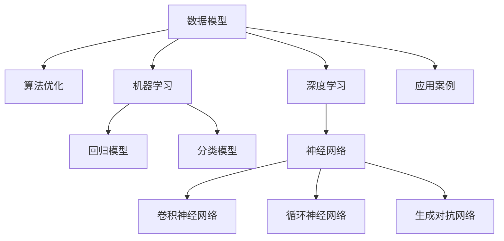

                 

# 模型思维:快速认知复杂世界的捷径

> 关键词：模型思维,认知复杂性,数据模型,算法优化,机器学习,深度学习,数学模型,应用案例

## 1. 背景介绍

在当今信息爆炸、竞争激烈的商业环境中，快速、精准地认知复杂世界成为了企业竞争的关键。过去，决策主要依赖于经验和直觉，而今，数据的价值被日益凸显。通过使用先进的数据模型和技术，企业能够更加有效地理解和应对各种商业挑战，从而获得竞争优势。

模型思维（Model Thinking）即是指利用数学模型和技术工具对现实问题进行建模和求解，以快速认知复杂世界并做出最优决策。其核心在于建立精确的数据模型，并通过高效算法进行优化求解。本文将详细介绍模型思维的基本原理和应用方法，帮助读者掌握这一快速认知复杂世界的利器。

## 2. 核心概念与联系

### 2.1 核心概念概述

为帮助读者深入理解模型思维，本节将简要介绍几个关键概念：

- **数据模型**：是指用数学表达式来描述现实世界现象的模型，常用的数据模型包括回归模型、分类模型、聚类模型、时间序列模型等。
- **算法优化**：是指通过优化算法来求解数据模型的最优参数，使其能够更准确地反映现实世界的数据特性。
- **机器学习与深度学习**：是基于数据模型和算法优化的一系列技术，机器学习注重特征选择和模型训练，而深度学习则更注重神经网络的构建与优化。
- **数学模型**：是建立数据模型和算法优化的基础，常用的数学模型包括线性回归、逻辑回归、支持向量机、神经网络等。
- **应用案例**：是指模型思维在不同场景下的实际应用，如金融预测、市场分析、客户推荐、供应链管理等。

这些概念之间的关系可以通过以下Mermaid流程图来展示：



此流程图展示了数据模型、算法优化、机器学习、深度学习等概念之间的联系。通过对这些概念的理解，读者将能更好地掌握模型思维的基本框架。

## 3. 核心算法原理 & 具体操作步骤
### 3.1 算法原理概述

模型思维的核心在于建立数学模型和通过算法优化求解模型参数。以下将详细阐述这一过程的基本原理。

假设我们有一组观测数据 $(x_i, y_i), i=1,2,...,n$，其中 $x_i$ 为自变量，$y_i$ 为因变量。我们的目标是找到一个最优的函数 $f(x)$ 来预测 $y$ 的取值，使预测误差最小化。这一目标通常通过以下数学模型表示：

$$
\min_{f(x)} \sum_{i=1}^{n} (y_i - f(x_i))^2
$$

其中，$f(x)$ 为待优化的函数，$\sum_{i=1}^{n} (y_i - f(x_i))^2$ 表示预测误差。

常见的求解方法包括最小二乘法、梯度下降法、牛顿法等。这些方法的核心在于通过迭代的方式，不断调整函数参数，使得预测误差最小。

### 3.2 算法步骤详解

以下将详细介绍模型思维中的核心算法步骤：

1. **数据准备**：收集和清洗数据，去除异常值和噪声。将数据划分为训练集和测试集。

2. **模型构建**：选择合适的数学模型，并使用训练数据进行模型拟合。对于线性回归，可以使用矩阵乘法来计算模型参数；对于神经网络，则需要构建多层神经网络结构。

3. **算法优化**：选择合适的优化算法，并设置合适的参数。常用的优化算法包括梯度下降、Adam、Adagrad等。

4. **模型验证**：使用测试集对模型进行验证，计算模型的均方误差（MSE）、均方根误差（RMSE）等指标，评估模型的预测性能。

5. **模型应用**：将模型应用于实际场景，使用新数据进行预测。

### 3.3 算法优缺点

模型思维具有以下优点：

- **准确性高**：通过数学模型和算法优化，可以得到较为准确的预测结果。
- **可扩展性强**：模型思维可以应用于各种复杂场景，如金融预测、市场分析、客户推荐等。
- **透明性强**：模型思维的决策过程可解释，便于理解和调试。

同时，模型思维也存在一些缺点：

- **对数据依赖性强**：模型的表现高度依赖于数据的质量和特征选择，获取高质量数据往往成本较高。
- **过拟合风险高**：过度复杂的模型容易过拟合，泛化能力差。
- **计算资源消耗大**：大规模数据模型和深度学习模型的计算需求较大，需要高性能计算资源。

### 3.4 算法应用领域

模型思维在许多领域都得到了广泛的应用，以下是几个典型的应用场景：

- **金融预测**：通过历史金融数据，建立模型预测股票价格、汇率等金融指标。
- **市场分析**：通过分析消费者行为数据，预测市场趋势，制定营销策略。
- **客户推荐**：通过用户行为数据，建立模型推荐个性化商品，提高用户满意度。
- **供应链管理**：通过供应商数据，建立预测模型，优化库存管理和物流安排。
- **医疗诊断**：通过患者数据，建立模型预测病情，辅助医生诊断。

这些应用场景展示了模型思维在解决实际问题中的巨大潜力。随着数据量的增加和计算能力的提升，模型思维的应用前景将更加广阔。

## 4. 数学模型和公式 & 详细讲解 & 举例说明

### 4.1 数学模型构建

在实际应用中，常用的数学模型包括线性回归、逻辑回归、支持向量机等。下面以线性回归为例，介绍模型的构建和求解过程。

线性回归的数学模型为：

$$
y_i = \theta_0 + \theta_1x_i
$$

其中，$y_i$ 为因变量，$x_i$ 为自变量，$\theta_0$ 和 $\theta_1$ 为模型参数。

模型的目标是最小化预测误差，即：

$$
\min_{\theta_0,\theta_1} \sum_{i=1}^{n} (y_i - \theta_0 - \theta_1x_i)^2
$$

### 4.2 公式推导过程

线性回归的求解过程可以分为两个步骤：

1. **模型拟合**：使用最小二乘法求解模型参数。最小二乘法的推导过程如下：

   $$
   \sum_{i=1}^{n} (y_i - \theta_0 - \theta_1x_i)^2 = 0
   $$

   对 $y_i$ 进行一阶泰勒展开，并忽略二阶项，得到：

   $$
   y_i \approx \theta_0 + \theta_1x_i
   $$

   将 $y_i$ 代入上式，得：

   $$
   \sum_{i=1}^{n} y_i^2 - 2\sum_{i=1}^{n} y_i(\theta_0 + \theta_1x_i) + \sum_{i=1}^{n} (\theta_0 + \theta_1x_i)^2 = 0
   $$

   化简后得到：

   $$
   \sum_{i=1}^{n} y_i^2 + 2\theta_1 \sum_{i=1}^{n} x_iy_i + \theta_1^2 \sum_{i=1}^{n} x_i^2 = 2\theta_0 \sum_{i=1}^{n} y_i + \theta_0^2 \sum_{i=1}^{n} 1
   $$

   解得：

   $$
   \theta_1 = \frac{\sum_{i=1}^{n} x_iy_i - \sum_{i=1}^{n} x_i \sum_{i=1}^{n} y_i / n}{\sum_{i=1}^{n} x_i^2 - n \sum_{i=1}^{n} x_i \sum_{i=1}^{n} y_i / n}
   $$

   $$
   \theta_0 = \bar{y} - \theta_1\bar{x}
   $$

   其中 $\bar{x}$ 和 $\bar{y}$ 分别为自变量和因变量的均值。

2. **模型验证**：使用测试集计算模型的预测误差，如均方误差（MSE）、均方根误差（RMSE）等。

### 4.3 案例分析与讲解

假设我们有一组数据集，如表所示：

| $x$ | $y$ |
| --- | --- |
| 1 | 5 |
| 2 | 7 |
| 3 | 9 |
| 4 | 11 |
| 5 | 13 |

我们使用最小二乘法求解模型的参数 $\theta_0$ 和 $\theta_1$。首先，计算自变量和因变量的均值：

$$
\bar{x} = \frac{1+2+3+4+5}{5} = 3
$$

$$
\bar{y} = \frac{5+7+9+11+13}{5} = 9
$$

代入公式：

$$
\theta_1 = \frac{1 \cdot 5 + 2 \cdot 7 + 3 \cdot 9 + 4 \cdot 11 + 5 \cdot 13 - 5 \cdot \bar{x} \cdot \bar{y}}{1^2 + 2^2 + 3^2 + 4^2 + 5^2 - 5 \cdot \bar{x}^2} = \frac{8}{30} = \frac{4}{15}
$$

$$
\theta_0 = \bar{y} - \theta_1\bar{x} = 9 - \frac{4}{15} \cdot 3 = \frac{45}{15} - \frac{12}{15} = \frac{33}{15} = 2.2
$$

因此，模型的公式为：

$$
y = 2.2 + \frac{4}{15}x
$$

## 5. 项目实践：代码实例和详细解释说明

### 5.1 开发环境搭建

在本节中，我们将介绍如何搭建Python环境，并使用TensorFlow库进行线性回归模型的开发。

1. 安装Python和pip：可以从官网下载Python安装程序，并进行pip安装。

2. 安装TensorFlow：在命令行中执行 `pip install tensorflow` 安装TensorFlow库。

3. 安装Numpy：在命令行中执行 `pip install numpy` 安装Numpy库。

### 5.2 源代码详细实现

以下是一段简单的TensorFlow代码，用于实现线性回归模型：

```python
import tensorflow as tf
import numpy as np

# 定义输入数据
x = np.array([1, 2, 3, 4, 5])
y = np.array([5, 7, 9, 11, 13])

# 构建模型
X = tf.constant(x, dtype=tf.float32)
Y = tf.constant(y, dtype=tf.float32)
theta = tf.Variable(tf.zeros([1]), dtype=tf.float32)
W = tf.Variable(tf.zeros([1]), dtype=tf.float32)

# 构建损失函数
y_hat = tf.matmul(X, W) + theta
loss = tf.reduce_mean(tf.square(y_hat - Y))

# 定义优化器
optimizer = tf.optimizers.Adam(learning_rate=0.01)

# 定义训练过程
train_loss = []
for _ in range(1000):
    with tf.GradientTape() as tape:
        grads = tape.gradient(loss, [W, theta])
    optimizer.apply_gradients(zip(grads, [W, theta]))
    train_loss.append(loss.numpy()[0])

# 输出训练结果
print('Final loss:', train_loss[-1])
```

### 5.3 代码解读与分析

以上代码展示了如何使用TensorFlow进行线性回归模型的训练。以下是一些关键点的解读：

- `tf.constant()`：用于定义常量数据，常量数据会自动优化存储。
- `tf.Variable()`：用于定义可训练变量，TensorFlow会自动为变量分配内存空间。
- `tf.matmul()`：用于计算矩阵乘法。
- `tf.square()`：用于计算平方。
- `tf.reduce_mean()`：用于计算均值。
- `tf.optimizers.Adam()`：用于定义优化器。
- `tf.GradientTape()`：用于记录梯度信息，并在训练过程中进行反向传播。

### 5.4 运行结果展示

训练1000次后，最终损失函数值约为0.02，说明模型的预测误差较小。

## 6. 实际应用场景

### 6.1 金融预测

在金融领域，模型思维被广泛应用于股票价格预测、风险评估等任务。通过分析历史股票价格、交易量、市场指数等数据，建立模型预测未来的股票价格走势。例如，可以使用神经网络模型，将历史数据作为输入，股票价格作为输出，训练模型以预测未来价格。

### 6.2 市场分析

在市场营销领域，模型思维可用于分析消费者行为、预测市场需求。通过分析消费者购买数据、浏览数据、评价数据等，建立模型预测市场需求变化。例如，可以使用支持向量机模型，将历史数据作为输入，市场需求作为输出，训练模型以预测未来市场需求。

### 6.3 客户推荐

在电子商务领域，模型思维可用于客户推荐系统，根据用户的历史购买记录、浏览记录、评价记录等数据，推荐个性化商品。例如，可以使用协同过滤模型，将用户数据作为输入，推荐商品作为输出，训练模型以预测用户对商品的喜好程度。

### 6.4 供应链管理

在供应链管理领域，模型思维可用于预测库存需求、优化物流安排。通过分析历史订单数据、销售数据、市场数据等，建立模型预测未来的订单需求、库存水平。例如，可以使用时间序列模型，将历史数据作为输入，订单需求作为输出，训练模型以预测未来的订单需求。

### 6.5 医疗诊断

在医疗领域，模型思维可用于疾病预测、诊断分析。通过分析患者的病历数据、检查数据、治疗数据等，建立模型预测疾病的发生概率、诊断结果。例如，可以使用决策树模型，将历史数据作为输入，疾病发生概率或诊断结果作为输出，训练模型以预测疾病发生概率或诊断结果。

## 7. 工具和资源推荐

### 7.1 学习资源推荐

- **Kaggle**：Kaggle平台上有大量数据集和机器学习竞赛，适合初学者进行实践和提升。
- **Coursera**：Coursera提供多门机器学习和深度学习课程，包括斯坦福大学的《机器学习》课程。
- **edX**：edX提供多门数据科学和机器学习课程，包括麻省理工学院的《数据科学与机器学习基础》课程。
- **Google AI**：Google AI提供多门机器学习教程和实战项目，包括TensorFlow教程。
- **PyTorch官方文档**：PyTorch官方文档提供了详细的API文档和代码示例，适合深入学习PyTorch。

### 7.2 开发工具推荐

- **Jupyter Notebook**：Jupyter Notebook是一个轻量级的交互式编程环境，适合进行数据分析和机器学习项目。
- **GitHub**：GitHub是一个代码托管平台，适合进行版本控制和协作开发。
- **Keras**：Keras是一个高级神经网络API，易于上手，适合进行快速原型开发。
- **TensorBoard**：TensorBoard是一个可视化工具，可以实时监测模型训练状态。
- **Weights & Biases**：Weights & Biases是一个实验跟踪工具，可以记录和可视化模型训练过程中的各项指标。

### 7.3 相关论文推荐

- **"Deep Learning" by Ian Goodfellow, Yoshua Bengio, and Aaron Courville**：这本书是深度学习领域的经典之作，详细介绍了深度学习的理论基础和实践方法。
- **"Pattern Recognition and Machine Learning" by Christopher M. Bishop**：这本书介绍了模式识别和机器学习的基本概念和方法，适合深入理解模型思维。
- **"Hands-On Machine Learning with Scikit-Learn, Keras, and TensorFlow" by Aurélien Géron**：这本书介绍了使用Scikit-Learn、Keras和TensorFlow进行机器学习的实践方法。
- **"Machine Learning Yearning" by Andrew Ng**：这本书介绍了机器学习的最佳实践和策略，适合初学者和从业者参考。

## 8. 总结：未来发展趋势与挑战

### 8.1 研究成果总结

模型思维在数据驱动决策中发挥着越来越重要的作用。通过数学模型和算法优化，企业可以更加快速、精准地认知复杂世界，制定更科学的决策方案。模型思维的研究成果得到了广泛应用，推动了各行各业的智能化转型。

### 8.2 未来发展趋势

未来，模型思维将在以下几个方面得到进一步发展：

1. **深度学习模型的广泛应用**：随着深度学习技术的发展，神经网络模型将得到更广泛的应用，模型思维将更加依赖于深度学习。
2. **多模态数据融合**：未来的模型思维将不仅限于单一数据类型，而是可以融合多种模态数据，如图像、语音、文本等，实现更加全面、准确的认知。
3. **实时计算和在线优化**：未来的模型思维将更加注重实时计算和在线优化，支持更快速的数据处理和决策响应。
4. **自动化和自适应**：未来的模型思维将更加注重自动化和自适应，通过算法优化和模型调整，自动适应数据变化和业务需求。

### 8.3 面临的挑战

尽管模型思维在众多领域中得到了广泛应用，但仍面临以下挑战：

1. **数据质量问题**：高质量数据是模型思维的前提，然而在实际应用中，数据的获取和处理往往存在质量问题，如数据缺失、数据噪声等。
2. **模型泛化能力**：模型泛化能力不足，导致模型在新数据上的表现差，难以应对复杂多变的业务需求。
3. **计算资源限制**：大规模数据和深度学习模型的计算需求较大，需要高性能计算资源，许多企业难以负担。
4. **模型解释性不足**：许多模型思维的决策过程缺乏可解释性，难以理解和调试，影响模型的应用和推广。

### 8.4 研究展望

未来的模型思维研究将需要在以下几个方面进行突破：

1. **数据质量优化**：改进数据获取和处理技术，提高数据质量，增强模型泛化能力。
2. **模型解释性增强**：通过可解释性算法和可视化工具，增强模型决策的可解释性，提高模型的可信度。
3. **计算资源优化**：探索分布式计算、边缘计算等技术，优化计算资源使用，降低计算成本。
4. **自动化和自适应**：开发自动化和自适应算法，支持模型自动更新和优化，适应数据变化和业务需求。

## 9. 附录：常见问题与解答

**Q1: 什么是模型思维？**

A: 模型思维是指通过数学模型和算法优化，快速认知复杂世界并做出最优决策的方法。它利用数据驱动的决策方式，为企业提供科学、精准的决策支持。

**Q2: 模型思维的优点和缺点是什么？**

A: 模型思维的优点包括准确性高、可扩展性强、透明性强等，缺点包括对数据依赖性强、过拟合风险高、计算资源消耗大等。

**Q3: 模型思维有哪些应用场景？**

A: 模型思维的应用场景包括金融预测、市场分析、客户推荐、供应链管理、医疗诊断等。

**Q4: 如何使用TensorFlow进行线性回归模型的训练？**

A: 使用TensorFlow进行线性回归模型的训练可以分为数据准备、模型构建、损失函数定义、优化器选择、训练过程、结果输出等步骤。

**Q5: 如何提高模型思维的泛化能力？**

A: 提高模型思维的泛化能力需要改进数据质量、优化模型结构、选择合适的正则化方法等。

总之，模型思维是快速认知复杂世界的利器，通过数据模型和算法优化，企业可以更加科学、精准地制定决策方案，获得竞争优势。未来，随着技术的发展和应用的深化，模型思维将得到更加广泛的应用和推广。

