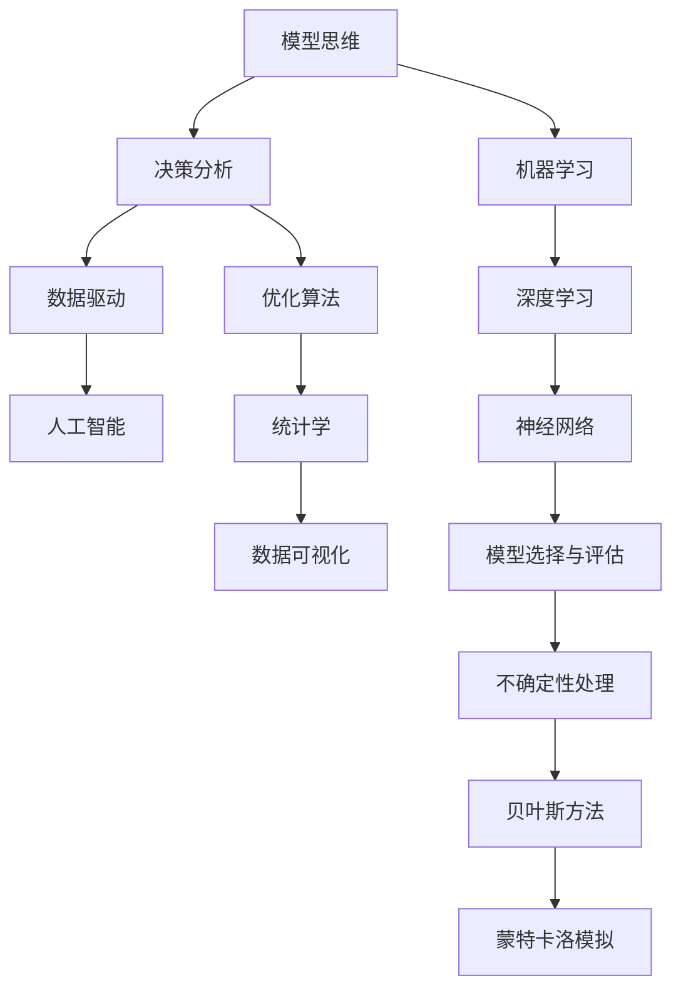

                 

# 模型思维在决策分析中的运用

> 关键词：模型思维, 决策分析, 优化算法, 数据驱动, 人工智能, 机器学习, 统计学, 数据可视化

## 1. 背景介绍

### 1.1 问题由来
决策分析是现代企业管理、工程、科学等领域的一项重要工具，它通过构建模型来预测未来事件，优化决策过程，从而帮助决策者做出最优的决策。在数据驱动的今天，决策分析中的模型思维变得尤为重要。然而，传统的决策分析模型往往需要人为设定许多参数和假设，而且不易于处理复杂的非线性关系。随着机器学习和人工智能技术的飞速发展，模型思维在决策分析中的应用越来越广泛，尤其是数据驱动的模型思维方式，为决策者提供了一种全新的视角。

### 1.2 问题核心关键点
模型思维在决策分析中的应用，主要体现在以下几个方面：
- **数据驱动**：利用大数据、机器学习等技术，构建和优化模型，从而在决策过程中更准确地预测未来。
- **模型选择与评估**：根据问题特点，选择合适的模型进行建模，并通过多种评估方法确保模型可靠性和有效性。
- **优化与迭代**：通过不断迭代优化模型，提升模型精度和泛化能力，从而更准确地支持决策。
- **不确定性处理**：合理处理模型中的不确定性，如使用贝叶斯方法、蒙特卡洛模拟等技术，确保决策的稳健性。
- **可视化与解释**：通过数据可视化等手段，帮助决策者理解模型输出和结果，提高决策透明度和可靠性。

这些关键点构成了模型思维在决策分析中的核心应用范式，使得模型思维方式成为决策过程中不可或缺的一部分。

## 2. 核心概念与联系

### 2.1 核心概念概述

为更好地理解模型思维在决策分析中的应用，本节将介绍几个密切相关的核心概念：

- **模型思维**：指通过构建和优化数学或统计模型，来分析和预测复杂现象的方法。模型思维强调数据的驱动，通过模型来揭示数据中的潜在规律和关系。
- **决策分析**：指利用数学、统计、运筹学等方法，通过模型来支持决策的过程。决策分析的目标是利用模型来优化决策，减少决策的偏差和不确定性。
- **优化算法**：指用于求解优化问题的一类算法，包括线性规划、非线性规划、遗传算法、粒子群算法等。优化算法用于模型参数的选择和调整，以提升模型性能。
- **数据驱动**：指在决策分析过程中，将数据作为主要依据，通过数据分析来指导决策。数据驱动强调客观性和科学性，避免主观偏见。
- **人工智能**：指利用计算机科学和数学等技术，使机器模拟人类的智能行为。人工智能中的模型思维，特别是在机器学习和深度学习中的应用，为决策分析提供了新的工具和方法。

这些核心概念之间的逻辑关系可以通过以下Mermaid流程图来展示：



这个流程图展示了这个系统中的核心概念及其之间的关系：

1. 模型思维是决策分析的基础。
2. 数据驱动是模型思维的关键。
3. 优化算法用于模型优化。
4. 人工智能为模型思维提供技术支持。
5. 统计学和数据可视化是数据分析的工具。
6. 模型选择与评估是确保模型可靠性的重要步骤。
7. 不确定性处理是模型思维应对不确定性的手段。

这些概念共同构成了模型思维在决策分析中的理论和实践框架，使其能够更好地发挥作用。

## 3. 核心算法原理 & 具体操作步骤
### 3.1 算法原理概述

模型思维在决策分析中的应用，其核心在于构建和优化数学或统计模型，以支持决策过程。通常，这一过程包括以下几个步骤：

1. **数据收集**：从各种来源收集相关数据。
2. **数据清洗**：对数据进行清洗和预处理，去除噪声和异常值。
3. **模型选择**：根据问题特点，选择合适的模型。
4. **模型训练**：利用历史数据对模型进行训练，调整参数。
5. **模型评估**：使用测试数据集评估模型性能，选择最优模型。
6. **结果解释**：通过数据可视化等手段解释模型输出和结果。

模型思维的核心算法原理可以概括为数据驱动、模型优化和结果解释。

### 3.2 算法步骤详解

以下是具体的算法步骤详解：

**Step 1: 数据收集**
- 确定决策问题的数据需求。
- 从数据仓库、传感器、数据库等不同来源收集数据。
- 确保数据的完整性和准确性。

**Step 2: 数据清洗**
- 处理缺失值、异常值等噪声数据。
- 数据归一化、标准化等预处理步骤。
- 特征选择和特征工程，提取对决策有用的特征。

**Step 3: 模型选择**
- 根据问题类型和数据特征，选择合适的模型。
- 常见的模型包括线性回归、逻辑回归、决策树、支持向量机等。
- 在复杂问题上，可以考虑使用深度学习模型，如神经网络。

**Step 4: 模型训练**
- 使用历史数据对模型进行训练。
- 选择适当的优化算法，如梯度下降、随机梯度下降、遗传算法等。
- 调整模型参数，通过交叉验证等技术评估模型性能。

**Step 5: 模型评估**
- 使用测试数据集评估模型性能。
- 计算各种评估指标，如均方误差、准确率、召回率等。
- 选择最优模型，确保其泛化能力。

**Step 6: 结果解释**
- 通过数据可视化展示模型输出和结果。
- 提供决策建议，解释模型预测的依据。
- 帮助决策者理解模型的决策过程。

### 3.3 算法优缺点

模型思维在决策分析中应用的优势：
1. 数据驱动：利用数据驱动决策，减少主观偏见。
2. 模型优化：通过模型选择和参数调整，提升模型精度和泛化能力。
3. 结果解释：通过可视化等手段，帮助决策者理解模型输出和结果。

同时，模型思维也存在一些缺点：
1. 数据需求高：模型构建需要大量高质量的数据，数据收集和清洗工作复杂。
2. 模型选择困难：在面对复杂问题时，选择合适的模型是一个难题。
3. 解释性不足：一些复杂的深度学习模型难以解释，缺乏透明性。
4. 计算资源需求高：模型训练和评估需要大量的计算资源。

尽管存在这些局限性，但模型思维在决策分析中的应用已变得越来越广泛，尤其是在处理复杂问题时，模型思维方式显得尤为重要。

### 3.4 算法应用领域

模型思维在决策分析中的应用，已经渗透到各行各业，特别是在以下领域：

- **金融**：用于风险评估、投资组合优化、信用评分等。
- **医疗**：用于疾病诊断、治疗方案优化、患者风险评估等。
- **制造**：用于生产流程优化、质量控制、供应链管理等。
- **营销**：用于市场细分、客户细分、广告投放优化等。
- **交通**：用于交通流量预测、路线优化、事故预测等。
- **环境**：用于气候变化预测、污染控制、资源管理等。

随着数据驱动的决策需求不断增加，模型思维在更多领域将得到更广泛的应用。

## 4. 数学模型和公式 & 详细讲解  
### 4.1 数学模型构建

决策分析中的模型构建通常包括以下几个步骤：

1. **确定问题类型**：
   - 是分类问题还是回归问题？
   - 是否需要考虑时间序列数据？
   - 是否需要考虑不确定性和风险？

2. **选择模型结构**：
   - 线性回归、逻辑回归、决策树、支持向量机等。
   - 深度学习模型，如神经网络、卷积神经网络、循环神经网络等。

3. **确定模型参数**：
   - 初始化参数：如学习率、正则化系数等。
   - 训练算法：如梯度下降、随机梯度下降、遗传算法等。

4. **评估模型性能**：
   - 均方误差、均方根误差、准确率、召回率等。
   - 使用交叉验证等技术评估模型泛化能力。

以线性回归模型为例，其数学模型构建如下：

$$
y = \beta_0 + \beta_1 x_1 + \beta_2 x_2 + ... + \beta_n x_n + \epsilon
$$

其中 $y$ 为因变量，$x_1, x_2, ..., x_n$ 为自变量，$\beta_0, \beta_1, ..., \beta_n$ 为模型参数，$\epsilon$ 为误差项。

### 4.2 公式推导过程

以线性回归模型为例，推导其梯度下降算法的公式：

设损失函数为均方误差损失：

$$
\mathcal{L}(\beta) = \frac{1}{2m} \sum_{i=1}^m (y_i - \hat{y}_i)^2
$$

其中 $y_i$ 为真实值，$\hat{y}_i = \beta_0 + \beta_1 x_{i1} + ... + \beta_n x_{in}$ 为模型预测值，$m$ 为样本数。

梯度下降算法的目标是最小化损失函数 $\mathcal{L}(\beta)$，通过求解导数 $\frac{\partial \mathcal{L}(\beta)}{\partial \beta_j}$ 来更新参数 $\beta_j$：

$$
\frac{\partial \mathcal{L}(\beta)}{\partial \beta_j} = \frac{1}{m} \sum_{i=1}^m -2(x_{i1}, ..., x_{in}, y_i - \hat{y}_i) (\beta_0, ..., \beta_n)
$$

将上式展开，得到：

$$
\frac{\partial \mathcal{L}(\beta)}{\partial \beta_j} = -\frac{2}{m} \sum_{i=1}^m \left[(x_{i1}, ..., x_{in}, y_i - \hat{y}_i) x_{ij}\right]
$$

其中 $j$ 表示第 $j$ 个自变量，$n$ 为自变量个数。

通过迭代更新参数 $\beta_j$，最小化损失函数 $\mathcal{L}(\beta)$，即可构建出线性回归模型。

### 4.3 案例分析与讲解

以房价预测为例，分析线性回归模型的构建和优化过程：

**Step 1: 数据收集**
- 收集不同地区的房价数据。
- 确定数据集中的特征变量，如房屋面积、地理位置、交通便利性等。

**Step 2: 数据清洗**
- 处理缺失值和异常值。
- 数据归一化，确保数据在一个合理的范围内。

**Step 3: 模型选择**
- 确定线性回归模型作为预测房价的模型。
- 选择梯度下降算法作为优化算法。

**Step 4: 模型训练**
- 使用历史数据对模型进行训练。
- 调整学习率、正则化系数等参数，使用交叉验证评估模型性能。

**Step 5: 模型评估**
- 使用测试数据集评估模型性能。
- 计算均方误差等指标，确定模型泛化能力。

**Step 6: 结果解释**
- 通过数据可视化展示模型输出和结果。
- 提供决策建议，解释模型预测的依据。

通过以上步骤，可以构建出一个线性回归模型来预测房价，帮助决策者做出更为科学的决策。

## 5. 项目实践：代码实例和详细解释说明
### 5.1 开发环境搭建

在进行模型思维在决策分析中的应用实践前，我们需要准备好开发环境。以下是使用Python进行Scikit-Learn开发的环境配置流程：

1. 安装Anaconda：从官网下载并安装Anaconda，用于创建独立的Python环境。

2. 创建并激活虚拟环境：
```bash
conda create -n sklearn-env python=3.8 
conda activate sklearn-env
```

3. 安装Scikit-Learn：
```bash
conda install scikit-learn
```

4. 安装numpy、pandas、matplotlib等各类工具包：
```bash
pip install numpy pandas matplotlib seaborn
```

5. 安装jupyter notebook，用于交互式编程：
```bash
pip install jupyter notebook
```

完成上述步骤后，即可在`sklearn-env`环境中开始模型构建实践。

### 5.2 源代码详细实现

下面我们以线性回归模型为例，给出使用Scikit-Learn构建和优化模型的PyTorch代码实现。

首先，定义数据集和模型：

```python
from sklearn.datasets import load_boston
from sklearn.model_selection import train_test_split
from sklearn.linear_model import LinearRegression
import numpy as np
import pandas as pd
import matplotlib.pyplot as plt
import seaborn as sns

# 加载波士顿房价数据集
boston = load_boston()
X = boston.data
y = boston.target

# 数据标准化
X_scaled = (X - X.mean()) / X.std()

# 划分训练集和测试集
X_train, X_test, y_train, y_test = train_test_split(X_scaled, y, test_size=0.2, random_state=42)

# 构建线性回归模型
model = LinearRegression()
```

然后，训练模型并评估性能：

```python
# 训练模型
model.fit(X_train, y_train)

# 评估模型性能
mse = np.mean((model.predict(X_test) - y_test) ** 2)
print(f"测试集均方误差: {mse:.2f}")
```

最后，绘制数据可视化结果：

```python
# 绘制回归直线
sns.lmplot(x=X_test[:, 0], y=y_test, data=pd.DataFrame(X_test), scatter_kws={'alpha': 0.5}, line_kws={'color': 'red'}, x_vars=[0], y_vars=[1])
plt.show()
```

以上就是使用Scikit-Learn构建和优化线性回归模型的完整代码实现。可以看到，Scikit-Learn封装了大量的模型和算法，使得模型构建和优化变得更加简单高效。

### 5.3 代码解读与分析

让我们再详细解读一下关键代码的实现细节：

**load_boston函数**：
- 用于加载波士顿房价数据集，包含了房屋特征和房价数据。

**train_test_split函数**：
- 用于将数据集划分为训练集和测试集，通常用于评估模型性能。

**LinearRegression类**：
- 用于构建线性回归模型，自动计算损失函数和梯度，并进行参数更新。

**X标准化**：
- 通过减去均值和除以标准差，对特征数据进行标准化，提高模型训练效果。

**测试集均方误差计算**：
- 使用均方误差作为模型评估指标，评估模型预测误差。

**数据可视化**：
- 使用Seaborn库绘制回归直线，直观展示模型预测效果。

## 6. 实际应用场景
### 6.1 金融风险评估

金融领域广泛应用模型思维进行风险评估和信用评分。模型通过分析历史数据，构建风险模型，预测贷款申请者的违约概率，帮助银行和金融机构做出更为准确的贷款决策。

**实际案例**：
- 某银行使用线性回归模型预测信用卡客户的违约风险。通过收集客户的信用历史、收入情况、职业等数据，构建线性回归模型，评估每个客户的违约概率，从而制定合理的贷款利率和信用额度。

**数据处理**：
- 数据收集：从信用卡申请数据、历史交易数据中收集相关信息。
- 数据清洗：处理缺失值、异常值，确保数据完整性。
- 特征工程：提取对违约风险有影响的特征，如收入、职业、年龄等。

**模型构建**：
- 选择线性回归模型，对数据进行标准化处理。
- 使用历史数据进行模型训练，调整参数。
- 通过交叉验证评估模型性能，选择最优模型。

**结果解释**：
- 通过数据可视化展示模型预测结果，提供违约风险评估依据。

### 6.2 医疗疾病诊断

医疗领域使用模型思维进行疾病诊断和治疗方案优化。通过分析历史数据，构建预测模型，识别出患者的疾病风险和适合的治疗方案，提升医疗服务质量。

**实际案例**：
- 某医院使用随机森林模型预测患者患某疾病的概率。通过收集患者的病历数据、实验室检查结果等，构建随机森林模型，预测每个患者的疾病风险，从而制定合适的治疗方案。

**数据处理**：
- 数据收集：从医院病历数据库、实验室检查结果中收集相关信息。
- 数据清洗：处理缺失值、异常值，确保数据完整性。
- 特征工程：提取对疾病风险有影响的特征，如年龄、性别、家族病史等。

**模型构建**：
- 选择随机森林模型，对数据进行标准化处理。
- 使用历史数据进行模型训练，调整参数。
- 通过交叉验证评估模型性能，选择最优模型。

**结果解释**：
- 通过数据可视化展示模型预测结果，提供疾病风险评估依据。

### 6.3 制造生产优化

制造业广泛应用模型思维进行生产流程优化和质量控制。通过分析历史生产数据，构建预测模型，优化生产过程，减少废品率，提升生产效率。

**实际案例**：
- 某汽车制造厂使用时间序列分析模型预测生产线的停机时间。通过收集生产线的历史数据，构建时间序列分析模型，预测未来的停机时间，从而提前安排维护和调整，减少生产中断。

**数据处理**：
- 数据收集：从生产线传感器、监控数据中收集相关信息。
- 数据清洗：处理缺失值、异常值，确保数据完整性。
- 特征工程：提取对停机时间有影响的特征，如温度、湿度、设备状态等。

**模型构建**：
- 选择时间序列分析模型，对数据进行标准化处理。
- 使用历史数据进行模型训练，调整参数。
- 通过交叉验证评估模型性能，选择最优模型。

**结果解释**：
- 通过数据可视化展示模型预测结果，提供生产优化建议。

## 7. 工具和资源推荐
### 7.1 学习资源推荐

为了帮助开发者系统掌握模型思维在决策分析中的应用，这里推荐一些优质的学习资源：

1. **《数据科学导论》（Introduction to Data Science）**：麻省理工学院公开课，介绍了数据科学的基本概念和常用工具。
2. **《机器学习实战》（Machine Learning in Action）**：李航教授的入门书籍，介绍了机器学习的基本算法和实现方法。
3. **Coursera上的《机器学习》课程（Machine Learning by Andrew Ng）**：斯坦福大学公开课，介绍了机器学习的基本原理和算法。
4. **Scikit-Learn官方文档**：Scikit-Learn库的官方文档，提供了详细的模型介绍和代码示例。
5. **Kaggle竞赛**：Kaggle网站提供了大量的数据集和竞赛，帮助学习者练习和应用模型思维。

通过对这些资源的学习实践，相信你一定能够快速掌握模型思维在决策分析中的精髓，并用于解决实际的决策问题。

### 7.2 开发工具推荐

高效的开发离不开优秀的工具支持。以下是几款用于模型思维在决策分析中应用的常用工具：

1. **Python**：Python是数据科学和机器学习的主流语言，拥有丰富的库和框架。
2. **Scikit-Learn**：Scikit-Learn是Python中最流行的机器学习库之一，提供了大量的模型和算法。
3. **TensorFlow和PyTorch**：用于构建和训练深度学习模型，支持大规模数据处理。
4. **Jupyter Notebook**：交互式编程环境，方便代码调试和模型验证。
5. **RapidMiner**：商业化的数据科学平台，提供了可视化建模工具和预处理功能。
6. **Tableau**：数据可视化工具，支持复杂的数据探索和报告生成。

合理利用这些工具，可以显著提升模型思维在决策分析中的开发效率，加快创新迭代的步伐。

### 7.3 相关论文推荐

模型思维在决策分析中的应用源于学界的持续研究。以下是几篇奠基性的相关论文，推荐阅读：

1. **《机器学习实战》**：李航教授的入门书籍，介绍了机器学习的基本算法和实现方法。
2. **《统计学习方法》**：李航教授的经典书籍，介绍了统计学习的基本理论和算法。
3. **《深度学习》**：Ian Goodfellow等人所著，介绍了深度学习的基本原理和实现方法。
4. **《决策树与随机森林》**：李航教授的论文，介绍了决策树和随机森林的基本原理和算法。
5. **《时间序列分析》**：R. S. Tsay的书籍，介绍了时间序列分析的基本理论和应用方法。

这些论文代表了大数据和模型思维在决策分析中的发展脉络。通过学习这些前沿成果，可以帮助研究者把握学科前进方向，激发更多的创新灵感。

## 8. 总结：未来发展趋势与挑战
### 8.1 总结

本文对模型思维在决策分析中的应用进行了全面系统的介绍。首先阐述了模型思维的研究背景和应用意义，明确了模型思维在决策分析中的核心作用。其次，从原理到实践，详细讲解了模型思维的数学原理和关键步骤，给出了模型思维应用实践的完整代码实现。同时，本文还广泛探讨了模型思维在金融、医疗、制造等多个行业领域的应用前景，展示了模型思维的巨大潜力。此外，本文精选了模型思维学习的各类资源，力求为读者提供全方位的技术指引。

通过本文的系统梳理，可以看到，模型思维在决策分析中的应用已经成为决策过程中不可或缺的一部分。这些关键点构成了模型思维在决策分析中的核心应用范式，使得模型思维方式成为决策过程中不可或缺的一部分。

### 8.2 未来发展趋势

展望未来，模型思维在决策分析中的应用将呈现以下几个发展趋势：

1. **数据驱动**：随着数据量的不断增加，模型思维将更加依赖数据驱动，减少主观偏见，提高决策的科学性和客观性。
2. **深度学习**：深度学习模型的应用将更加广泛，能够处理更加复杂和动态的数据。
3. **自动化和智能化**：自动化和智能化的决策分析工具将更加普及，提高决策效率和准确性。
4. **跨领域应用**：模型思维将更多地应用于跨领域问题，如金融、医疗、制造、交通等领域。
5. **实时分析**：实时分析和预测将成为模型思维的重要方向，提升决策的时效性。
6. **可解释性和透明度**：模型思维的可解释性和透明度将成为重要研究课题，确保决策的透明性和可信度。

这些趋势凸显了模型思维在决策分析中的广阔前景。这些方向的探索发展，必将进一步提升决策分析的精确性和科学性，为决策者提供更加全面、可靠的信息支持。

### 8.3 面临的挑战

尽管模型思维在决策分析中的应用已经取得了一定的进展，但在迈向更加智能化、普适化应用的过程中，它仍面临着诸多挑战：

1. **数据质量问题**：数据质量的差异将直接影响模型的精度和泛化能力。
2. **模型选择和调参困难**：选择合适的模型和调整模型参数是一个复杂的过程，需要丰富的经验和专业知识。
3. **计算资源需求高**：模型训练和评估需要大量的计算资源，对硬件提出了较高的要求。
4. **模型解释性不足**：一些复杂的深度学习模型难以解释，缺乏透明性。
5. **伦理和道德问题**：模型思维的应用需要考虑伦理和道德问题，避免模型偏见和有害输出。

尽管存在这些挑战，但模型思维在决策分析中的应用前景广阔。相信随着学界和产业界的共同努力，这些挑战终将一一被克服，模型思维必将在决策分析中发挥更大的作用。

### 8.4 研究展望

面对模型思维在决策分析中面临的挑战，未来的研究需要在以下几个方面寻求新的突破：

1. **自动化和智能化**：开发更加自动化和智能化的决策分析工具，提高决策效率和准确性。
2. **模型选择和调参**：开发更加智能化和自动化的模型选择和调参方法，减少人工干预。
3. **计算资源优化**：开发更加高效的计算方法和模型压缩技术，降低计算资源需求。
4. **可解释性和透明度**：开发更加可解释和透明的模型，提高决策的透明度和可信度。
5. **伦理和道德问题**：研究模型思维的伦理和道德问题，确保模型应用的安全性和公正性。

这些研究方向的探索，必将引领模型思维在决策分析中迈向更高的台阶，为构建安全、可靠、可解释、可控的智能系统铺平道路。面向未来，模型思维在决策分析中的应用需要与其他人工智能技术进行更深入的融合，如知识表示、因果推理、强化学习等，多路径协同发力，共同推动决策分析的进步。只有勇于创新、敢于突破，才能不断拓展模型思维的边界，让模型思维在决策分析中发挥更大的作用。

## 9. 附录：常见问题与解答
**Q1：模型思维和传统决策分析方法的区别是什么？**

A: 模型思维和传统决策分析方法的主要区别在于其数据驱动的思维方式。传统方法往往依赖于专家知识和经验，而模型思维则通过数据驱动，从数据中学习规律和模式，从而辅助决策。

**Q2：如何选择合适的模型？**

A: 选择合适的模型需要考虑多个因素，包括问题类型、数据特征、模型复杂度等。常见的选择方法包括：
1. 观察数据的分布和特征，选择适合的模型类型。
2. 使用交叉验证等技术评估模型性能，选择最优模型。
3. 考虑模型的解释性和透明度，选择可解释性强的模型。

**Q3：模型训练中的超参数调整有何技巧？**

A: 超参数调整是模型构建中的一个重要步骤。常见的技巧包括：
1. 使用网格搜索或随机搜索方法，在一定范围内搜索最优超参数。
2. 使用交叉验证等技术评估模型性能，选择最优超参数。
3. 使用自动化调参工具，如Hyperopt、Scikit-Learn等，减少人工干预。

**Q4：模型思维在决策分析中如何避免过拟合？**

A: 避免过拟合是模型思维在决策分析中的一个重要问题。常见的解决方法包括：
1. 数据增强：通过回译、近义替换等方式扩充训练集。
2. 正则化：使用L2正则、Dropout、Early Stopping等方法，避免过拟合。
3. 对抗训练：引入对抗样本，提高模型鲁棒性。
4. 参数高效微调：只更新少量参数，减小过拟合风险。

**Q5：模型思维在实际应用中如何确保结果的可靠性？**

A: 确保模型思维在决策分析中的结果可靠性，需要考虑以下因素：
1. 数据质量：确保数据的完整性和准确性，减少数据噪声。
2. 模型选择：选择合适的模型，避免模型选择不当带来的误差。
3. 模型训练：通过交叉验证等技术评估模型性能，选择最优模型。
4. 结果解释：通过数据可视化等手段，提供决策依据，确保结果透明和可信。

通过以上步骤，可以确保模型思维在决策分析中的结果可靠性，为决策者提供科学依据。

---

作者：禅与计算机程序设计艺术 / Zen and the Art of Computer Programming

