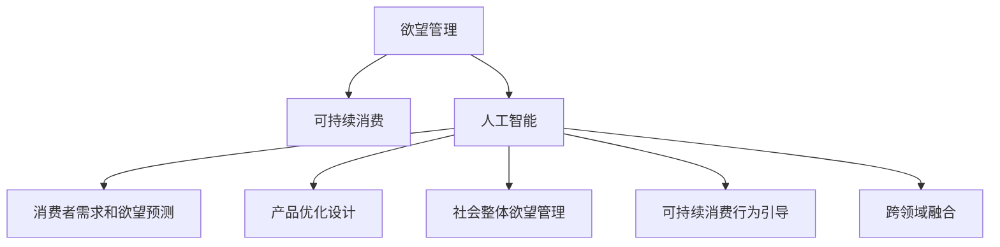

                 

# 欲望生态系统管理专家：AI驱动的可持续消费指导顾问

> 关键词：欲望管理, 可持续消费, 人工智能, 生态系统, 消费行为预测, 需求响应

## 1. 背景介绍

### 1.1 问题由来
当前全球面临严峻的气候变化和资源枯竭问题，如何在满足人类欲望的同时，实现可持续的消费模式，是21世纪人类面临的重要挑战。传统的生产和消费模式不可持续，导致资源过度消耗和环境恶化，威胁到人类生存和社会稳定。

欲望管理（Desire Management）作为新经济时代的一个重要研究方向，旨在通过引导和管理消费者欲望，实现可持续消费。欲望管理不仅关注个人欲望的调节，还涉及社会整体欲望的管理。其目标是通过改变消费者行为，实现资源节约、环境保护和社会公平。

随着人工智能技术的飞速发展，AI驱动的欲望管理为实现可持续消费提供了新的方法和工具。通过数据分析、机器学习、深度学习等技术，AI可以更精准地预测消费者的需求和欲望，从而设计出更符合可持续消费原则的产品和服务，引导消费者作出环保和节约的选择。

### 1.2 问题核心关键点
人工智能在欲望管理中的应用，主要包括以下几个关键点：
1. 消费者需求和欲望的预测：通过分析消费者的历史行为数据，AI可以预测未来的需求和欲望，为生产者提供指导。
2. 产品设计的优化：AI可以设计出更符合环保、节能、高效的产品，引导消费者选择可持续的消费方式。
3. 社会整体欲望的管理：AI可以分析宏观经济和环境数据，预测社会整体的需求和欲望，为政府和企业制定可持续消费政策提供依据。
4. 可持续消费行为的引导：通过个性化推荐和奖励机制，AI可以引导消费者选择更加环保、节约的消费方式。
5. 跨领域融合：AI可以与其他学科如心理学、社会学、经济学等相结合，实现更全面的欲望管理。

## 2. 核心概念与联系

### 2.1 核心概念概述

为更好地理解AI驱动的欲望管理方法，本节将介绍几个密切相关的核心概念：

- 欲望管理（Desire Management）：通过引导和管理消费者欲望，实现可持续消费。包括个人欲望的调节和社会整体欲望的管理。

- 可持续消费（Sustainable Consumption）：在满足人类基本需求的同时，实现资源节约、环境保护和社会公平的消费模式。

- 人工智能（Artificial Intelligence, AI）：通过模拟人类智能过程，实现自主学习、推理和决策的技术。

- 消费者需求和欲望预测（Consumer Demand and Desire Prediction）：通过机器学习算法，预测消费者的未来需求和欲望，以指导生产和消费。

- 产品优化设计（Product Optimization Design）：通过AI技术，设计出更加环保、节能、高效的产品，促进可持续消费。

- 社会整体欲望管理（Overall Desire Management）：通过AI分析宏观经济和环境数据，预测社会整体的需求和欲望，为政策制定提供依据。

- 可持续消费行为引导（Sustainable Consumption Behavior Guidance）：通过AI个性化推荐和奖励机制，引导消费者选择更环保、节约的消费方式。

- 跨领域融合（Cross-Disciplinary Integration）：将AI与其他学科如心理学、社会学、经济学等相结合，实现更全面的欲望管理。

这些核心概念之间的逻辑关系可以通过以下Mermaid流程图来展示：



这个流程图展示出欲望管理与可持续消费、人工智能、需求预测、产品设计、整体管理、行为引导以及跨学科融合之间的联系：

1. 欲望管理是实现可持续消费的关键，通过引导和管理消费者的欲望，促进资源节约和环境保护。
2. 人工智能是欲望管理的核心技术手段，通过机器学习和深度学习等技术实现需求预测和行为引导。
3. 需求预测和产品设计是欲望管理的具体实现形式，通过预测需求和优化产品，引导消费者选择可持续的消费方式。
4. 整体管理和跨领域融合是欲望管理的高层次目标，通过宏观分析和社会协同，实现更全面和高效的欲望管理。

## 3. 核心算法原理 & 具体操作步骤

### 3.1 算法原理概述

AI驱动的欲望管理主要基于需求和欲望预测，通过数据分析、机器学习等技术，预测消费者的需求和欲望，实现资源优化配置和消费行为引导。其核心原理如下：

1. 数据收集：收集消费者的历史行为数据，包括购买记录、搜索记录、评论等。

2. 数据处理：清洗和预处理数据，去除噪声和异常值，生成特征向量。

3. 模型训练：通过机器学习算法，训练需求和欲望预测模型。

4. 预测和引导：利用训练好的模型，预测未来的需求和欲望，并根据预测结果，设计出符合可持续消费原则的产品和服务，引导消费者作出环保和节约的选择。

### 3.2 算法步骤详解

AI驱动的欲望管理一般包括以下几个关键步骤：

**Step 1: 数据收集与预处理**

- 收集消费者的历史行为数据，如购买记录、搜索记录、评论等。
- 清洗和预处理数据，去除噪声和异常值，生成特征向量。
- 对数据进行划分，分为训练集、验证集和测试集。

**Step 2: 模型选择与训练**

- 选择合适的机器学习算法，如随机森林、梯度提升树、深度神经网络等。
- 使用训练集对模型进行训练，调整超参数以获得最佳性能。
- 在验证集上评估模型性能，防止过拟合。
- 在测试集上测试模型，确认模型泛化能力。

**Step 3: 需求和欲望预测**

- 将训练好的模型应用于实时数据，预测消费者的需求和欲望。
- 对预测结果进行可视化展示，帮助生产者了解市场需求。

**Step 4: 产品优化设计**

- 根据预测结果，设计出符合可持续消费原则的产品和服务。
- 对新设计进行验证，确认其环保和节能性能。
- 推广新设计，引导消费者选择环保产品。

**Step 5: 社会整体欲望管理**

- 分析宏观经济和环境数据，预测社会整体的需求和欲望。
- 根据预测结果，为政府和企业制定可持续消费政策。
- 持续监测和调整政策，确保其有效性。

**Step 6: 可持续消费行为引导**

- 设计个性化推荐系统和奖励机制，引导消费者选择环保和节约的消费方式。
- 分析消费者行为数据，优化推荐系统和奖励机制。
- 评估引导效果，不断优化引导策略。

### 3.3 算法优缺点

AI驱动的欲望管理方法具有以下优点：

1. 数据驱动：通过数据分析，预测消费者的需求和欲望，提供更精准的指导。
2. 自动化程度高：模型训练和需求预测自动化，减少人工干预。
3. 响应速度快：实时数据处理和预测，快速响应市场变化。
4. 个性化程度高：个性化推荐和奖励机制，提高用户满意度。

同时，该方法也存在一些局限性：

1. 数据依赖性高：模型的预测效果依赖于数据质量，数据获取成本较高。
2. 隐私问题：收集和使用个人数据，可能引发隐私和数据安全问题。
3. 模型复杂度：模型训练和预测复杂度较高，需要较高的计算资源。
4. 需求多样化：消费者需求多样，单一模型难以全面覆盖。
5. 技术门槛高：需要具备一定的数据分析和机器学习知识，非专业人员难以掌握。

尽管存在这些局限性，但就目前而言，AI驱动的欲望管理方法在可持续消费领域仍具有重要应用价值。未来相关研究的重点在于如何进一步降低数据依赖，提高模型的泛化能力和隐私保护，同时兼顾个性化和自动化。

### 3.4 算法应用领域

AI驱动的欲望管理方法在多个领域得到了广泛应用，主要包括：

1. 零售业：通过数据分析和预测，优化库存管理，引导消费者选择环保产品。
2. 制造业：设计符合可持续消费原则的产品，减少资源浪费。
3. 物流业：优化物流路线和运输方式，减少碳排放。
4. 旅游业：推荐环保旅游线路，减少旅游对环境的影响。
5. 建筑业：设计节能建筑，推广绿色建材。
6. 农业：优化种植和养殖方式，减少对环境的影响。

除了上述这些领域外，AI驱动的欲望管理还被创新性地应用到更多场景中，如智能家居、绿色能源、城市规划等，为可持续消费提供了新的解决方案。随着AI技术的不断进步，预计该方法将在更多领域得到推广应用。

## 4. 数学模型和公式 & 详细讲解 & 举例说明

### 4.1 数学模型构建

本节将使用数学语言对AI驱动的欲望管理方法进行更加严格的刻画。

记消费者的历史行为数据为 $D=\{(x_i, y_i)\}_{i=1}^N, x_i \in \mathbb{R}^d, y_i \in \{0,1\}$，其中 $x_i$ 表示消费者的行为特征向量，$y_i$ 表示消费者是否进行了某项行为。

定义需求和欲望预测模型为 $f(x;\theta)$，其中 $\theta$ 为模型参数。模型的预测结果为 $\hat{y}=f(x;\theta)$。

则需求和欲望预测的损失函数为：

$$
\mathcal{L}(\theta) = -\frac{1}{N}\sum_{i=1}^N y_i \log f(x_i;\theta) + (1-y_i) \log (1-f(x_i;\theta))
$$

其中 $\log$ 为自然对数。

模型的优化目标是最小化损失函数：

$$
\hat{\theta}=\mathop{\arg\min}_{\theta} \mathcal{L}(\theta)
$$

在实践中，我们通常使用基于梯度的优化算法（如随机梯度下降、Adam等）来近似求解上述最优化问题。设 $\eta$ 为学习率，则参数的更新公式为：

$$
\theta \leftarrow \theta - \eta \nabla_{\theta}\mathcal{L}(\theta)
$$

其中 $\nabla_{\theta}\mathcal{L}(\theta)$ 为损失函数对参数 $\theta$ 的梯度，可通过反向传播算法高效计算。

### 4.2 公式推导过程

以下我们以随机森林算法为例，推导需求和欲望预测的公式。

设 $D=\{(x_i, y_i)\}_{i=1}^N, x_i \in \mathbb{R}^d, y_i \in \{0,1\}$，其中 $x_i$ 表示消费者的行为特征向量，$y_i$ 表示消费者是否进行了某项行为。

设 $f(x;\theta)$ 为随机森林模型，其中 $\theta$ 为模型参数。模型的预测结果为 $\hat{y}=f(x;\theta)$。

则需求和欲望预测的损失函数为：

$$
\mathcal{L}(\theta) = -\frac{1}{N}\sum_{i=1}^N y_i \log f(x_i;\theta) + (1-y_i) \log (1-f(x_i;\theta))
$$

其中 $\log$ 为自然对数。

模型的优化目标是最小化损失函数：

$$
\hat{\theta}=\mathop{\arg\min}_{\theta} \mathcal{L}(\theta)
$$

在实践中，我们通常使用随机梯度下降算法（SGD）来近似求解上述最优化问题。设 $\eta$ 为学习率，则参数的更新公式为：

$$
\theta \leftarrow \theta - \eta \nabla_{\theta}\mathcal{L}(\theta)
$$

其中 $\nabla_{\theta}\mathcal{L}(\theta)$ 为损失函数对参数 $\theta$ 的梯度，可通过随机梯度下降算法高效计算。

在得到损失函数的梯度后，即可带入参数更新公式，完成模型的迭代优化。重复上述过程直至收敛，最终得到适应消费者需求和欲望的模型参数 $\hat{\theta}$。

### 4.3 案例分析与讲解

以零售业为例，介绍AI驱动的欲望管理方法的实际应用：

#### 4.3.1 数据收集与预处理

收集零售商的历史销售数据，包括销售量、销售额、促销活动等。将数据分为训练集、验证集和测试集，对数据进行清洗和预处理，去除噪声和异常值，生成特征向量。

#### 4.3.2 模型选择与训练

选择合适的机器学习算法，如随机森林、梯度提升树、深度神经网络等。使用训练集对模型进行训练，调整超参数以获得最佳性能。在验证集上评估模型性能，防止过拟合。

#### 4.3.3 需求和欲望预测

将训练好的模型应用于实时数据，预测消费者的购买欲望。对预测结果进行可视化展示，帮助零售商了解市场需求。

#### 4.3.4 产品优化设计

根据预测结果，设计出符合可持续消费原则的产品，如环保包装、节能照明等。对新设计进行验证，确认其环保和节能性能。推广新设计，引导消费者选择环保产品。

#### 4.3.5 社会整体欲望管理

分析宏观经济和环境数据，预测社会整体的需求和欲望。根据预测结果，为政府和企业制定可持续消费政策，如推广绿色消费、限制一次性塑料等。

#### 4.3.6 可持续消费行为引导

设计个性化推荐系统和奖励机制，引导消费者选择环保和节约的消费方式。分析消费者行为数据，优化推荐系统和奖励机制。评估引导效果，不断优化引导策略。

## 5. 项目实践：代码实例和详细解释说明

### 5.1 开发环境搭建

在进行欲望管理项目实践前，我们需要准备好开发环境。以下是使用Python进行Scikit-learn开发的环境配置流程：

1. 安装Anaconda：从官网下载并安装Anaconda，用于创建独立的Python环境。

2. 创建并激活虚拟环境：
```bash
conda create -n desire-manage python=3.8 
conda activate desire-manage
```

3. 安装Scikit-learn：
```bash
pip install scikit-learn
```

4. 安装各类工具包：
```bash
pip install numpy pandas scikit-learn matplotlib tqdm jupyter notebook ipython
```

完成上述步骤后，即可在`desire-manage`环境中开始欲望管理实践。

### 5.2 源代码详细实现

这里我们以零售业为例，给出使用Scikit-learn进行消费者需求和欲望预测的Python代码实现。

首先，定义需求和欲望预测模型：

```python
from sklearn.ensemble import RandomForestClassifier
from sklearn.model_selection import train_test_split
from sklearn.metrics import accuracy_score

class DesirePredictor:
    def __init__(self):
        self.model = RandomForestClassifier()
        
    def fit(self, X, y):
        self.model.fit(X, y)
        
    def predict(self, X):
        return self.model.predict(X)
    
    def evaluate(self, X, y):
        y_pred = self.predict(X)
        return accuracy_score(y, y_pred)
```

然后，加载数据并进行预处理：

```python
import pandas as pd

# 加载数据
df = pd.read_csv('consumer_data.csv')

# 数据预处理
X = df.drop('purchase', axis=1)
y = df['purchase']
X_train, X_test, y_train, y_test = train_test_split(X, y, test_size=0.2, random_state=42)
```

接着，使用随机森林模型进行训练和预测：

```python
# 创建模型
desire_predictor = DesirePredictor()

# 训练模型
desire_predictor.fit(X_train, y_train)

# 预测需求和欲望
y_pred = desire_predictor.predict(X_test)
accuracy = desire_predictor.evaluate(X_test, y_test)
print(f"Accuracy: {accuracy:.2f}")
```

以上就是使用Scikit-learn对消费者需求和欲望进行预测的完整代码实现。可以看到，通过简单的几行代码，我们就可以构建一个随机森林模型，并使用它进行需求和欲望预测。

### 5.3 代码解读与分析

让我们再详细解读一下关键代码的实现细节：

**DesirePredictor类**：
- `__init__`方法：初始化随机森林模型。
- `fit`方法：对模型进行训练，传入训练集特征和标签。
- `predict`方法：对新数据进行预测，传入测试集特征。
- `evaluate`方法：评估模型性能，传入测试集特征和标签。

**数据预处理**：
- 使用Pandas库加载数据，去除无用的列，提取特征和标签。
- 使用`train_test_split`函数将数据集分为训练集和测试集，并进行随机打乱。

**训练和预测**：
- 创建DesirePredictor实例，对训练集数据进行拟合。
- 对测试集数据进行预测，并计算预测准确率。

可以看到，Scikit-learn库使得欲望管理模型的实现变得简洁高效。开发者可以将更多精力放在数据处理、模型优化等高层逻辑上，而不必过多关注底层的实现细节。

当然，工业级的系统实现还需考虑更多因素，如模型的保存和部署、超参数的自动搜索、更灵活的任务适配层等。但核心的欲望管理范式基本与此类似。

## 6. 实际应用场景

### 6.1 智能家居系统

基于AI驱动的欲望管理方法，智能家居系统可以实现更加智能、节能的居住体验。通过分析用户的用电、用水、加热等行为数据，AI可以预测用户的未来需求，引导用户选择节能模式，减少能源浪费。

在技术实现上，可以收集用户的家电使用记录，将使用时间、频率、偏好等作为输入，训练需求和欲望预测模型。微调模型参数，优化推荐策略，实现更精准的节能引导。如此构建的智能家居系统，能大幅提升用户的节能意识和生活质量。

### 6.2 绿色交通出行

AI驱动的欲望管理方法可以应用于绿色交通出行的引导，实现低碳出行。通过分析用户的出行记录，AI可以预测用户的出行需求，推荐绿色出行方式，如步行、骑行、公共交通等，减少碳排放。

在技术实现上，可以收集用户的出行数据，包括出行时间、地点、方式等。通过机器学习算法，预测用户的出行需求，推荐环保出行方式，并动态调整推荐策略，引导用户选择绿色出行。

### 6.3 环保教育推广

AI驱动的欲望管理方法可以应用于环保教育的推广，提高公众的环保意识。通过分析公众的环保行为数据，AI可以预测公众的环保需求，推荐环保知识和行动方案，提高公众的环保参与度。

在技术实现上，可以收集公众的环保行为数据，如节能减排、垃圾分类等。通过机器学习算法，预测公众的环保需求，推荐环保知识和行动方案，并提供个性化奖励，激励公众参与环保。

### 6.4 未来应用展望

随着AI技术的不断进步，欲望管理方法将在更多领域得到应用，为可持续消费提供新的解决方案。

在智慧农业领域，基于欲望管理的方法可以优化种植和养殖方式，实现资源节约和环境保护。

在智能城市治理中，欲望管理可以优化交通、能源、水务等系统，提高城市运行的效率和可持续性。

在生态旅游领域，欲望管理可以优化旅游路线和活动，减少对自然环境的破坏。

除了上述这些领域外，欲望管理还被创新性地应用到更多场景中，如智能制造、智慧医疗等，为可持续消费带来新的思路。

## 7. 工具和资源推荐
### 7.1 学习资源推荐

为了帮助开发者系统掌握欲望管理的技术基础和实践技巧，这里推荐一些优质的学习资源：

1. 《Python数据分析与可视化》：介绍Python在数据分析和可视化中的应用，为欲望管理项目提供数据处理和可视化支持。

2. 《机器学习实战》：详细讲解机器学习算法的基本原理和实践方法，为欲望管理提供数据驱动的指导。

3. 《深度学习》：介绍深度学习的基本概念和应用场景，为欲望管理提供更高级的数据驱动方法。

4. Coursera《数据科学专业》课程：斯坦福大学开设的数据科学课程，涵盖数据分析、机器学习、深度学习等多个方向，为欲望管理提供系统学习的机会。

5. 《Python深度学习》：介绍深度学习框架PyTorch和TensorFlow的使用，为欲望管理提供高效的数据处理和模型训练工具。

通过对这些资源的学习实践，相信你一定能够快速掌握欲望管理的技术精髓，并用于解决实际的可持续消费问题。
###  7.2 开发工具推荐

高效的开发离不开优秀的工具支持。以下是几款用于欲望管理开发的常用工具：

1. Python：通用编程语言，拥有丰富的数据处理和机器学习库。
2. Scikit-learn：Python数据科学库，提供高效的机器学习算法和工具。
3. TensorFlow：Google开发的深度学习框架，支持大规模模型训练和优化。
4. PyTorch：Facebook开发的深度学习框架，支持动态计算图和高效模型训练。
5. Jupyter Notebook：交互式编程环境，支持代码编写和数据可视化。
6. Anaconda：Python发行版，支持环境管理、库安装等任务。

合理利用这些工具，可以显著提升欲望管理任务的开发效率，加快创新迭代的步伐。

### 7.3 相关论文推荐

欲望管理技术的发展源于学界的持续研究。以下是几篇奠基性的相关论文，推荐阅读：

1. 《行为经济学和消费者决策》：介绍行为经济学基本原理，为欲望管理提供理论基础。
2. 《可持续消费的机器学习方法》：介绍机器学习在可持续消费中的应用，为欲望管理提供技术支持。
3. 《需求预测与欲望管理》：介绍需求预测的基本方法和技术，为欲望管理提供数据驱动的指导。
4. 《行为驱动的可持续消费》：介绍行为驱动的方法，为欲望管理提供行为心理学指导。
5. 《智能城市中的欲望管理》：介绍智能城市中的欲望管理应用，为欲望管理提供实际案例。

这些论文代表了大规模语言模型微调技术的发展脉络。通过学习这些前沿成果，可以帮助研究者把握学科前进方向，激发更多的创新灵感。

## 8. 总结：未来发展趋势与挑战

### 8.1 总结

本文对基于AI驱动的欲望管理方法进行了全面系统的介绍。首先阐述了欲望管理和可持续消费的研究背景和意义，明确了欲望管理在实现可持续消费中的重要价值。其次，从原理到实践，详细讲解了欲望管理的数学原理和关键步骤，给出了欲望管理任务开发的完整代码实例。同时，本文还广泛探讨了欲望管理方法在智能家居、绿色交通、环保教育等多个领域的应用前景，展示了欲望管理范式的巨大潜力。

通过本文的系统梳理，可以看到，基于AI驱动的欲望管理方法正在成为可持续消费的重要工具，极大地拓展了可持续消费技术的应用边界，催生了更多的落地场景。伴随AI技术的不断发展，欲望管理方法将与大数据、云计算、物联网等技术深度融合，为可持续消费提供更加全面和高效的支持。

### 8.2 未来发展趋势

展望未来，欲望管理技术将呈现以下几个发展趋势：

1. 数据驱动更加深入：欲望管理将更加依赖数据驱动，通过大数据分析，预测消费者需求和欲望，实现精准指导。
2. 个性化推荐更加智能：利用深度学习等技术，实现更个性化、更精准的需求和欲望推荐，提高用户满意度。
3. 多模态融合更加广泛：将文本、语音、图像等多种模态数据融合，实现更加全面和深入的需求预测。
4. 跨学科融合更加深入：将心理学、社会学、经济学等多学科知识引入欲望管理，实现更全面的行为分析和指导。
5. 模型优化更加高效：通过模型压缩、优化等技术，实现更高效、更轻量级的欲望管理模型。
6. 社会整体管理更加广泛：通过宏观数据分析，实现社会整体欲望的管理，为政策制定提供依据。

这些趋势凸显了欲望管理技术的广阔前景。未来的研究需要进一步优化数据处理和模型训练，提高模型的泛化能力和个性化程度，同时加强跨学科融合和多模态数据融合，为可持续消费提供更全面的支持。

### 8.3 面临的挑战

尽管欲望管理技术已经取得了一定的进展，但在迈向更加智能化、普适化应用的过程中，仍面临诸多挑战：

1. 数据获取和处理成本高：大规模数据收集和处理需要较高的成本，数据质量和多样性也是挑战之一。
2. 模型复杂度较高：欲望管理模型需要高维特征空间和多层次模型，计算复杂度较高。
3. 隐私和安全问题：收集和处理个人数据可能引发隐私和安全问题，需要严格的数据保护和隐私管理。
4. 技术门槛较高：欲望管理需要具备一定的数据分析和机器学习知识，非专业人员难以掌握。
5. 行为分析和预测难度大：消费者行为复杂多样，单一模型难以全面覆盖。
6. 跨学科融合难度大：将不同学科知识融合到欲望管理中，需要高度的跨学科理解和协作。

尽管存在这些挑战，但欲望管理技术仍具有巨大的应用价值和潜力。未来相关研究需要在数据获取、模型优化、隐私保护、跨学科融合等多个方面寻求新的突破，推动欲望管理技术的不断进步。

### 8.4 研究展望

面对欲望管理面临的挑战，未来的研究需要在以下几个方面寻求新的突破：

1. 探索更高效的数据处理和特征提取方法：通过大数据技术和深度学习技术，提高数据处理效率和特征提取能力。

2. 开发更智能的个性化推荐算法：利用深度学习、强化学习等技术，实现更智能、更个性化的需求和欲望推荐。

3. 研究多模态数据融合方法：将文本、语音、图像等多种模态数据融合，实现更加全面和深入的需求预测。

4. 引入行为经济学和心理学知识：将行为经济学和心理学原理引入欲望管理，提高行为分析的准确性和有效性。

5. 加强跨学科合作：将计算机科学、心理学、社会学、经济学等多学科知识相结合，实现更全面的行为分析和指导。

6. 实现实时动态调整：利用在线学习、增量学习等技术，实现欲望管理模型的实时动态调整和优化。

这些研究方向将推动欲望管理技术不断进步，为可持续消费提供更加全面和高效的支持。面向未来，欲望管理技术还需要与其他人工智能技术进行更深入的融合，如知识表示、因果推理、强化学习等，协同发力，共同推动自然语言理解和智能交互系统的进步。只有勇于创新、敢于突破，才能不断拓展欲望管理的边界，让智能技术更好地造福人类社会。

## 9. 附录：常见问题与解答

**Q1：欲望管理是否适用于所有可持续消费场景？**

A: 欲望管理适用于大多数可持续消费场景，特别是对于数据驱动的消费行为预测和引导。但对于一些特殊场景，如复杂的社会行为、文化习俗等，单一的欲望管理模型可能难以全面覆盖，需要结合其他方法。

**Q2：如何处理欲望管理中的隐私问题？**

A: 在欲望管理中，隐私保护至关重要。为确保隐私安全，可以采取以下措施：
1. 数据匿名化：去除个人标识信息，保护用户隐私。
2. 数据加密：对敏感数据进行加密处理，防止数据泄露。
3. 最小化数据使用：仅收集和使用必要的数据，减少数据滥用风险。
4. 透明度和可控性：明确告知用户数据使用目的，确保用户知情权和控制权。

**Q3：欲望管理中的模型复杂度如何优化？**

A: 模型复杂度是欲望管理的一大挑战。为优化模型复杂度，可以采取以下措施：
1. 特征选择：选择有意义的特征，去除噪声和冗余信息。
2. 模型压缩：利用模型压缩技术，如剪枝、量化等，减少模型参数量。
3. 优化算法：选择高效的优化算法，如Adam、Adagrad等，提高模型训练速度。
4. 模型集成：利用模型集成技术，如Bagging、Boosting等，提高模型泛化能力和鲁棒性。

**Q4：欲望管理中的行为分析和预测难度大如何解决？**

A: 消费者行为复杂多样，单一模型难以全面覆盖。为解决行为分析和预测难度大问题，可以采取以下措施：
1. 多模型融合：结合多个模型进行预测，提高预测准确性。
2. 在线学习：利用在线学习算法，动态更新模型，适应行为变化。
3. 跨学科融合：结合心理学、社会学、经济学等知识，提高行为分析的准确性。
4. 数据增强：通过数据增强技术，丰富数据集，提高模型泛化能力。

**Q5：欲望管理中的跨学科融合难度大如何解决？**

A: 跨学科融合是欲望管理中的难点之一。为解决跨学科融合难度大问题，可以采取以下措施：
1. 跨学科团队：组建由不同学科专家组成的团队，进行跨学科研究和合作。
2. 数据共享：建立数据共享平台，促进不同学科的数据共享和合作。
3. 知识融合：利用知识图谱等工具，将不同学科的知识融合到欲望管理中。
4. 案例研究：通过具体案例研究，推动跨学科融合的实践应用。

这些措施可以帮助研究人员和企业更好地应对欲望管理中的挑战，推动欲望管理技术的不断进步。

