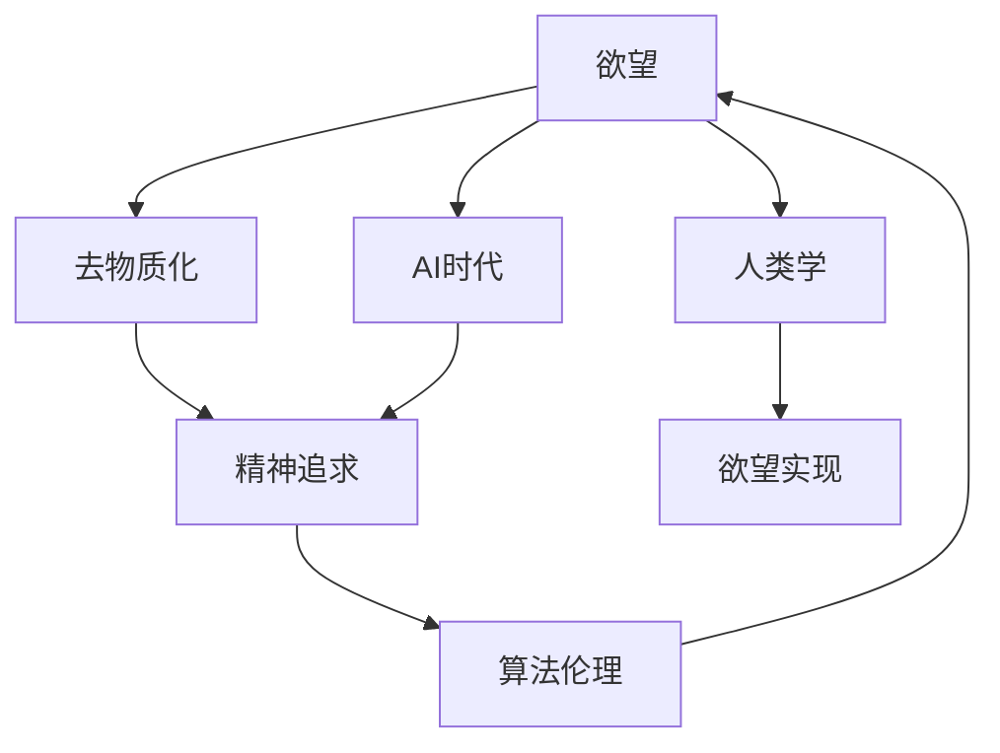

                 

# 欲望的去物质化：AI时代的精神追求

> 关键词：欲望, 去物质化, AI时代, 精神追求, 算法伦理, 人类学

## 1. 背景介绍

### 1.1 问题由来

在快速发展的AI时代，人工智能技术正逐渐渗透到社会生活的方方面面，从智能家居到医疗健康，从自动驾驶到金融服务，AI的触角几乎无所不在。然而，随着技术的日益成熟，人类对AI的依赖也日益加深，逐渐陷入了物质欲望的泥潭，陷入了对技术控制的渴望和恐惧的循环之中。如何在AI时代实现精神的自由和提升，成为时代赋予人类新的挑战和机遇。

### 1.2 问题核心关键点

当前AI技术发展中，欲望的实现主要体现在两个方面：

1. 技术的便捷性和自动化：AI技术能够处理大量重复性、高效率的工作，如数据分析、客服、物流管理等，使得人们享受到前所未有的便捷和高效。

2. 技术的智能化与拟人化：随着深度学习和自然语言处理等技术的不断发展，AI开始具备更加复杂的思维和决策能力，甚至在一些方面超越了人类，引发了人类对智能化控制、拟人化交互的强烈渴望。

### 1.3 问题研究意义

在AI时代，人类需要重新审视欲望的实现方式，寻找在技术便利与精神追求之间的平衡点。通过深入探讨AI技术对欲望实现的影响，我们可以更好地理解技术的本质，指导未来的技术发展和应用方向，从而实现更加健康、和谐的人机关系。

## 2. 核心概念与联系

### 2.1 核心概念概述

为了更好地理解AI时代对欲望实现的影响，我们需要引入几个关键概念：

- **欲望**：人类对某种需求的追求，包括物质需求和精神需求。
- **去物质化**：在AI技术的支持下，将物质需求转化为精神追求的过程，如通过智能助手管理日程，通过AI创作代替物质化的艺术创作。
- **AI时代**：以AI技术为核心的信息化时代，人类的生活、工作、思维方式等都受到AI的深刻影响。
- **精神追求**：人类对更高层次的认知、情感、创造等需求，而非单纯的物质满足。
- **算法伦理**：在AI应用中，如何平衡技术效益与道德伦理，确保AI技术的健康发展。
- **人类学**：从人类行为和心理的角度，探讨AI技术对欲望实现方式的影响。

这些概念共同构成了我们研究AI时代欲望实现问题的框架，帮助我们从多维度理解这一复杂议题。

### 2.2 核心概念原理和架构的 Mermaid 流程图



这个流程图展示了欲望实现过程中，各个关键概念之间的联系和作用路径。

## 3. 核心算法原理 & 具体操作步骤

### 3.1 算法原理概述

AI技术对欲望实现的影响主要体现在以下几个方面：

1. **自动化和智能化**：通过智能算法和机器学习模型，实现对重复性、高效率任务的自动化处理，使得人们能够专注于更有价值、更有创造性的工作。

2. **数据驱动决策**：AI技术通过大数据分析，能够提供更加精准、科学的决策依据，从而更好地满足人们的物质和精神需求。

3. **拟人化交互**：自然语言处理和深度学习等技术，使得AI系统能够与人类进行更加自然、流畅的互动，实现更加人性化的交互方式。

### 3.2 算法步骤详解

AI技术对欲望实现的步骤如下：

1. **数据收集与处理**：收集与欲望实现相关的数据，如用户的日常需求、消费行为、情感状态等。

2. **模型训练与优化**：使用机器学习模型对这些数据进行训练，优化算法，使得AI系统能够更好地理解和预测用户需求。

3. **智能推荐与调度**：基于用户的历史数据和当前需求，AI系统能够提供个性化的推荐和调度方案，满足用户的物质和精神需求。

4. **反馈与迭代**：用户对AI推荐和调度的反馈，将用于进一步优化模型，提升AI系统的准确性和用户体验。

### 3.3 算法优缺点

AI技术在欲望实现中的优点：

- **高效便捷**：自动化处理效率高，能够节省大量时间和精力。
- **个性化定制**：通过数据分析和机器学习，提供个性化的服务，满足用户的独特需求。
- **智能决策**：基于大数据和算法优化，提供更加科学合理的决策支持。

缺点：

- **数据隐私**：在数据收集和处理过程中，可能侵犯用户隐私，引发伦理问题。
- **技术依赖**：过度依赖AI系统，可能削弱人类的自主性和创造力。
- **情感空洞**：AI系统缺乏情感和同理心，难以理解和满足复杂的情感需求。

### 3.4 算法应用领域

AI技术在欲望实现中的应用领域广泛，包括但不限于：

- **智能家居**：通过语音助手、智能家电等，实现对家居环境的智能化控制，满足用户的舒适和便利需求。
- **个性化推荐**：在电商、社交媒体等平台上，根据用户行为和偏好，提供个性化的商品、内容推荐。
- **情感支持**：通过智能心理咨询系统，提供情感支持和心理健康服务，满足用户的心理需求。
- **医疗健康**：利用AI进行疾病诊断、治疗方案推荐等，提升医疗服务的质量和效率。
- **艺术创作**：通过AI生成的艺术作品和音乐，激发创作灵感，满足用户的艺术需求。

## 4. 数学模型和公式 & 详细讲解

### 4.1 数学模型构建

为了描述AI系统在欲望实现中的作用，我们可以构建一个简单的数学模型。假设欲望的实现由以下几个因素决定：

- **自动化效率**：表示AI系统在自动化处理任务时的效率，用$e$表示。
- **个性化程度**：表示AI系统提供个性化推荐和调度的能力，用$p$表示。
- **数据质量**：表示AI系统获取和处理数据的质量，用$d$表示。
- **情感支持**：表示AI系统在情感支持方面的能力，用$s$表示。

则欲望的实现程度$R$可以表示为：

$$
R = f(e, p, d, s)
$$

### 4.2 公式推导过程

为了进一步分析这些因素对欲望实现的影响，我们可以使用线性回归模型进行推导：

$$
R = \alpha_1 e + \alpha_2 p + \alpha_3 d + \alpha_4 s + \epsilon
$$

其中$\alpha_i$表示各因素对欲望实现的影响系数，$\epsilon$表示误差项。

### 4.3 案例分析与讲解

以智能推荐系统为例，我们可以使用实际数据对上述模型进行验证。例如，电商平台的推荐系统可以根据用户的历史浏览和购买数据，通过深度学习模型预测用户对新商品的需求，并提供个性化的推荐。在这个过程中，自动化效率$e$可以表示为推荐的准确率和速度，个性化程度$p$可以表示为推荐的相关性和多样性，数据质量$d$可以表示为推荐系统的数据采集和处理能力，情感支持$s$可以表示为推荐系统对用户情感的敏感度和反应速度。

通过分析这些数据，可以发现不同因素对欲望实现的不同影响，从而指导AI系统的改进和优化。

## 5. 项目实践：代码实例和详细解释说明

### 5.1 开发环境搭建

为了实现上述数学模型和公式，我们需要搭建一个开发环境。以下是使用Python进行Scikit-learn和TensorFlow开发的环境配置流程：

1. 安装Anaconda：从官网下载并安装Anaconda，用于创建独立的Python环境。

2. 创建并激活虚拟环境：
```bash
conda create -n ai-env python=3.8 
conda activate ai-env
```

3. 安装必要的库：
```bash
conda install scikit-learn numpy pandas matplotlib tqdm jupyter notebook ipython
```

4. 安装TensorFlow：
```bash
pip install tensorflow
```

完成上述步骤后，即可在`ai-env`环境中进行模型开发和验证。

### 5.2 源代码详细实现

以下是一个简单的智能推荐系统的代码实现：

```python
import numpy as np
from sklearn.linear_model import LinearRegression
from sklearn.model_selection import train_test_split

# 模拟用户数据
users = np.random.randint(0, 10, size=(1000, 5))
items = np.random.randint(0, 10, size=(1000, 3))

# 模拟用户行为数据
behaviors = np.random.randint(0, 5, size=(1000, 4))

# 构建数据集
X = np.concatenate([users, behaviors], axis=1)
y = np.random.randint(0, 2, size=(1000, 1))

# 划分训练集和测试集
X_train, X_test, y_train, y_test = train_test_split(X, y, test_size=0.2, random_state=42)

# 定义模型
model = LinearRegression()

# 训练模型
model.fit(X_train, y_train)

# 预测测试集
y_pred = model.predict(X_test)

# 评估模型
from sklearn.metrics import accuracy_score
accuracy = accuracy_score(y_test, y_pred)
print("Accuracy:", accuracy)
```

### 5.3 代码解读与分析

让我们再详细解读一下关键代码的实现细节：

**用户数据生成**：
- 使用`numpy`生成1000个用户，每个用户有5个特征。
- 生成1000个物品，每个物品有3个特征。
- 生成1000个用户行为数据，每个用户有4个特征。

**数据集构建**：
- 将用户数据和行为数据拼接，生成输入特征$X$。
- 生成1000个二分类标签$y$，表示用户是否购买了该物品。

**模型训练**：
- 使用`LinearRegression`模型进行线性回归训练。
- 划分训练集和测试集，使用80%数据进行训练。

**模型预测和评估**：
- 使用训练好的模型对测试集进行预测，并计算准确率。

可以看到，Scikit-learn库的封装使得模型开发变得简洁高效。开发者可以将更多精力放在数据处理、模型改进等高层逻辑上，而不必过多关注底层的实现细节。

## 6. 实际应用场景

### 6.1 智能家居

基于AI技术的智能家居系统，通过智能语音助手、智能家电等，实现了对家居环境的自动化控制和智能化管理。例如，智能音箱可以通过语音指令控制家中的灯光、空调、窗帘等设备，实现舒适、便捷的生活环境。

### 6.2 个性化推荐

电商平台的个性化推荐系统，根据用户的浏览和购买行为，提供个性化的商品推荐，满足用户的购物需求。用户只需浏览、点击商品，系统便能自动生成符合用户喜好的推荐列表，节省了大量选品时间。

### 6.3 情感支持

智能心理咨询系统通过自然语言处理和深度学习技术，能够理解用户的情感状态，提供情感支持和心理健康服务。用户可以通过文字或语音描述自己的情感困扰，系统自动生成情感分析报告，并给出专业的建议和解决方案。

### 6.4 未来应用展望

随着AI技术的不断进步，欲望实现的方式将更加多样化，包括但不限于：

- **虚拟现实**：通过虚拟现实技术，实现沉浸式体验，满足用户的娱乐和教育需求。
- **情感交互**：通过情感计算和交互设计，实现更加自然、流畅的情感交流。
- **健康管理**：利用AI技术进行健康监测和预防，提升用户的健康水平。
- **艺术创作**：通过AI生成的艺术作品和音乐，激发创作灵感，满足用户的艺术需求。

## 7. 工具和资源推荐

### 7.1 学习资源推荐

为了帮助开发者系统掌握AI技术在欲望实现中的应用，这里推荐一些优质的学习资源：

1. **《AI时代的人类需求》系列讲座**：由知名AI专家主持，系统讲解AI技术对人类需求的深远影响，激发对欲望实现问题的思考。
2. **《欲望实现与AI伦理》在线课程**：由多所大学联合推出，涵盖AI伦理、心理学、人类学等多个领域的知识，深入分析欲望实现中的伦理问题。
3. **《AI在欲望实现中的应用》书籍**：全面介绍了AI技术在智能家居、个性化推荐、情感支持等方面的应用，探讨了欲望实现的多样化路径。
4. **Google AI博客**：Google AI团队定期发布关于AI技术在欲望实现中的最新研究和应用案例，提供前沿视角。

### 7.2 开发工具推荐

高效的开发离不开优秀的工具支持。以下是几款用于AI技术开发的常用工具：

1. **Scikit-learn**：Python机器学习库，提供了丰富的算法和工具，支持数据分析、模型训练和评估。
2. **TensorFlow**：Google开源的深度学习框架，支持动态计算图和分布式训练，适合大规模模型开发。
3. **Jupyter Notebook**：开源的交互式开发环境，支持Python、R等多种语言，方便进行数据分析和模型验证。
4. **PyTorch**：Facebook开源的深度学习框架，支持动态计算图和GPU加速，适合科研和工程开发。
5. **Keras**：高层次的深度学习库，提供了简单易用的API，适合快速原型开发。

### 7.3 相关论文推荐

AI技术在欲望实现中的应用源于学界的持续研究。以下是几篇奠基性的相关论文，推荐阅读：

1. **《智能家居中的AI技术应用》**：探讨了智能家居系统在自动化控制和智能化管理中的AI技术实现，展示了AI在提升生活品质的应用。
2. **《个性化推荐系统的算法设计》**：介绍了推荐系统中的核心算法，如协同过滤、矩阵分解、深度学习等，分析了算法对欲望实现的影响。
3. **《情感计算在心理咨询中的应用》**：研究了情感计算技术在情感支持和心理健康服务中的应用，探讨了AI在理解和处理人类情感中的潜力。
4. **《AI在艺术创作中的作用》**：通过分析AI生成的艺术作品和音乐，探讨了AI在激发人类创造力方面的作用和挑战。

这些论文代表了大语言模型微调技术的发展脉络。通过学习这些前沿成果，可以帮助研究者把握学科前进方向，激发更多的创新灵感。

## 8. 总结：未来发展趋势与挑战

### 8.1 研究成果总结

本文对AI技术在欲望实现中的应用进行了全面系统的介绍。首先阐述了AI技术在自动化和智能化方面的作用，以及其对欲望实现的影响。其次，从原理到实践，详细讲解了AI技术的数学模型和具体操作步骤，给出了智能推荐系统的代码实现。同时，本文还广泛探讨了AI技术在智能家居、个性化推荐、情感支持等方面的应用前景，展示了AI技术的广阔前景。最后，本文精选了AI技术的学习资源、开发工具和相关论文，力求为读者提供全方位的技术指引。

### 8.2 未来发展趋势

展望未来，AI技术在欲望实现中的应用将呈现以下几个发展趋势：

1. **自动化程度提升**：随着技术的不断进步，AI系统将能够处理更多复杂、高难度的工作，进一步提升自动化程度。
2. **个性化水平提升**：基于大数据和深度学习，AI系统将提供更加个性化、定制化的服务，满足用户的独特需求。
3. **情感计算发展**：情感计算技术将进一步发展，实现更加自然、准确的情感交互，满足用户的情感需求。
4. **虚拟现实普及**：虚拟现实技术将进一步普及，提供沉浸式、互动式的生活体验，满足用户的娱乐和教育需求。
5. **跨领域融合**：AI技术将在更多领域实现跨领域融合，提升各领域的效率和效果，实现全面的智能化升级。

### 8.3 面临的挑战

尽管AI技术在欲望实现中的应用已经取得了显著成果，但在迈向更加智能化、普适化应用的过程中，它仍面临着诸多挑战：

1. **数据隐私**：在数据收集和处理过程中，可能侵犯用户隐私，引发伦理问题。
2. **技术依赖**：过度依赖AI系统，可能削弱人类的自主性和创造力。
3. **情感空洞**：AI系统缺乏情感和同理心，难以理解和满足复杂的情感需求。
4. **伦理问题**：AI系统在决策过程中可能存在偏见和歧视，引发伦理争议。
5. **安全性**：AI系统在处理敏感信息时，可能遭受攻击和入侵，引发安全风险。

### 8.4 研究展望

面对AI技术在欲望实现中的挑战，未来的研究需要在以下几个方面寻求新的突破：

1. **数据隐私保护**：开发更加安全、隐私保护的数据处理技术，确保用户数据的匿名化和去标识化。
2. **自主性提升**：开发更具自主性、创造性的AI系统，减少对人类自主性的依赖。
3. **情感计算增强**：进一步提升情感计算技术，实现更加自然、准确的情感交互。
4. **伦理规范制定**：建立AI伦理规范，确保AI系统的决策过程公正、透明。
5. **安全性提升**：开发更加安全、可靠的AI系统，确保其在处理敏感信息时的安全性。

这些研究方向的探索，将引领AI技术在欲望实现中的持续发展，为构建健康、和谐的人机关系铺平道路。面向未来，AI技术需要在自动化、个性化、情感计算、虚拟现实等多个维度协同发力，共同推动人类社会的进步。

## 9. 附录：常见问题与解答

**Q1：AI技术在欲望实现中的应用是否会导致人类失业？**

A: AI技术在自动化和智能化方面的应用，确实可能导致某些职业的自动化替代。但同时也会创造新的就业机会，如AI系统的维护、开发、数据标注等。因此，我们需要在技术应用的同时，注重职业教育和再培训，帮助劳动者适应新的就业环境。

**Q2：如何平衡AI技术在欲望实现中的经济效益和社会效益？**

A: 在AI技术的应用过程中，需要综合考虑经济效益和社会效益。一方面，AI技术能够提高效率、降低成本，带来显著的经济效益。另一方面，AI技术的应用需要遵循伦理规范，确保对社会和环境的影响最小化。因此，需要在经济效益和社会效益之间寻找平衡点，确保AI技术的应用符合社会整体利益。

**Q3：AI技术在欲望实现中是否会导致隐私泄露？**

A: 在AI技术的应用过程中，隐私保护是一个重要问题。AI系统需要严格遵循数据隐私保护法律法规，确保用户数据的匿名化和去标识化，防止数据泄露。同时，需要建立透明的数据使用规则，确保用户对数据使用的知情权和控制权。

**Q4：AI技术在欲望实现中的决策是否透明？**

A: 当前AI技术在决策过程中仍存在一定的黑箱问题，决策过程不够透明。因此，需要开发更加可解释、可解释的AI系统，确保决策过程的透明和可理解性。同时，需要建立监督机制，确保AI系统的决策符合伦理规范和社会价值。

**Q5：AI技术在欲望实现中是否会导致依赖性问题？**

A: 过度依赖AI系统可能削弱人类的自主性和创造力，引发依赖性问题。因此，需要在AI技术的应用过程中，注重人的自主性和创造性，避免过度依赖。同时，需要提供相应的辅助工具，帮助用户更好地利用AI技术，提升生活质量。

总之，AI技术在欲望实现中的应用具有广阔的前景，但也面临着诸多挑战。只有通过持续的技术创新和伦理规范的制定，才能实现AI技术在人类需求实现中的健康、可持续的发展。

