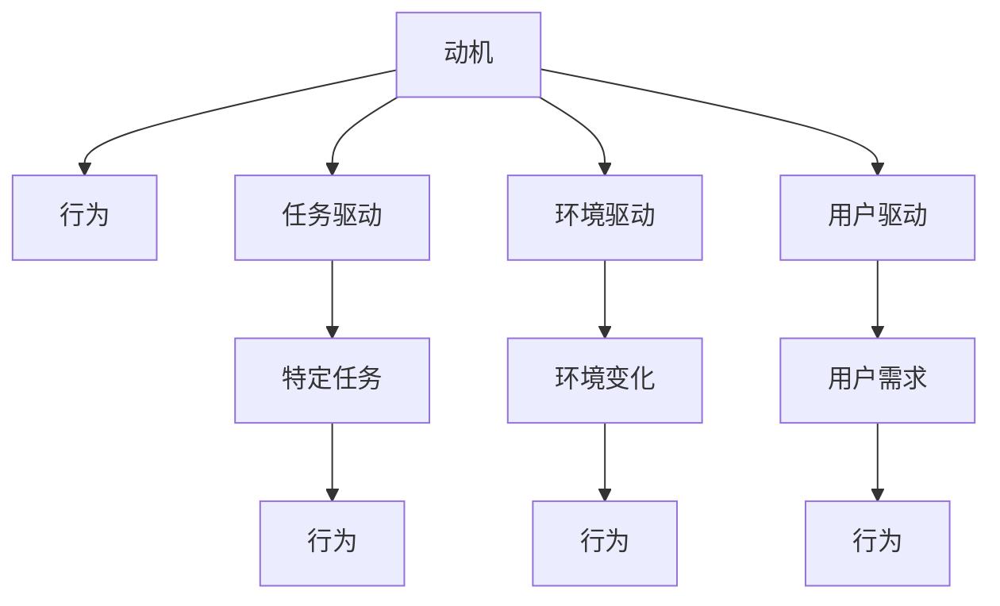

                 

# 欲望的重构：AI对人类动机的影响

> 关键词：人工智能,动机研究,行为心理学,决策理论,人机交互

## 1. 背景介绍

### 1.1 问题由来
随着人工智能技术的飞速发展，人工智能系统在各个领域的应用已逐渐普及。它们通过深度学习、自然语言处理、计算机视觉等技术，可以自主地执行各种复杂的任务，甚至在某些方面超越人类的表现。然而，这些智能系统的运行依赖于其内部算法和设计。人们开始关注人工智能的动机是什么，是否能够预测和引导人工智能的行为，以及人类与人工智能系统的交互如何影响它们的动机。

### 1.2 问题核心关键点
动机（动机）在人工智能系统的行为中扮演着至关重要的角色。动机可以理解为驱动系统执行特定行为的内心需求。它不仅影响系统的工作效率和质量，还涉及到系统如何与其他智能体互动。人类与AI的动机差异以及互动方式，直接影响着AI系统的行为决策。

动机研究是理解人工智能系统行为的起点。但是，这一领域的理论框架尚未完全成熟，需要跨学科的合作。当前，主要研究点包括人工智能系统如何形成动机、动机如何影响行为、以及如何通过设计优化AI系统的动机。

### 1.3 问题研究意义
研究人工智能的动机对于优化人工智能系统、提升人机交互效果、确保AI系统的伦理安全至关重要。以下是具体研究意义：

1. **优化AI性能**：通过理解动机与行为的关系，可以更好地设计算法和界面，使AI系统更高效、更准确地完成任务。
2. **提升用户体验**：通过了解用户需求和偏好，设计更符合人类行为习惯的AI系统，增强用户的使用体验。
3. **确保AI伦理安全**：确保AI系统的行为符合道德伦理标准，避免因动机偏差导致的不良后果。
4. **促进AI与社会融合**：通过优化AI动机，使其能够更好地融入社会环境，推动AI技术在更多领域的应用。

## 2. 核心概念与联系

### 2.1 核心概念概述

为更好地理解人工智能系统的动机，本节将介绍几个关键概念：

- **动机（动机）**：驱动人工智能系统执行特定行为的内在需求。动机可以是任务驱动的、环境驱动的或是用户驱动的。
- **行为（行为）**：AI系统在特定条件下采取的具体行动。行为由动机驱动，但也会受到外部环境和其他AI系统行为的影响。
- **任务驱动**：AI系统为完成任务而采取的行为。动机源于任务的特定需求。
- **环境驱动**：AI系统根据所处环境变化而采取的行为。动机来源于环境反馈。
- **用户驱动**：AI系统为满足用户需求而采取的行为。动机源自用户期望和偏好。
- **反馈机制**：AI系统根据执行结果和外部反馈调整动机和行为的过程。

这些概念之间的逻辑关系可以通过以下Mermaid流程图来展示：



这个流程图展示了大语言模型的核心概念及其之间的关系：

1. 动机驱动行为。
2. 动机可以通过任务、环境和用户需求来形成。
3. 不同类型的动机对应的行为也不同。
4. 反馈机制调整动机，进而影响行为。

## 3. 核心算法原理 & 具体操作步骤
### 3.1 算法原理概述

人工智能系统的动机研究主要围绕以下几个核心问题：

1. **动机形成**：人工智能系统如何根据输入和任务需求形成动机。
2. **动机与行为**：动机如何影响AI系统的行为。
3. **行为优化**：如何通过动机设计优化AI系统的行为。
4. **反馈机制**：AI系统如何根据反馈调整动机。

这些问题的解答需要借助动机理论、行为心理学和机器学习等领域的知识。动机形成和调整的过程可以被建模为动力系统，利用动态系统理论进行研究。

### 3.2 算法步骤详解

1. **动机模型构建**：构建一个动力系统模型，描述动机与行为之间的关系。动力系统通常由状态变量、输入变量、输出变量和动态方程组成。动机状态变量通常表示动机强度，输出变量表示行为强度。
2. **动机函数定义**：定义动力系统中的动机函数，描述动机强度随时间变化的规律。动机函数应包含用户需求、任务要求、环境反馈等因素。
3. **行为优化算法**：设计优化算法，根据动机函数和行为目标优化AI系统的行为强度。常用的优化算法包括梯度下降、遗传算法、模拟退火等。
4. **反馈机制建立**：建立反馈机制，实时监控AI系统的行为表现，并根据反馈调整动机强度。反馈机制可以包括用户反馈、任务反馈和环境反馈。

### 3.3 算法优缺点

动机研究的优势在于：

- **行为可预测**：通过模型预测AI系统的行为，可以优化算法设计，提升系统性能。
- **动机可调整**：调整动机可以改变AI系统的行为，使其更好地满足用户需求和任务要求。
- **增强人机交互**：通过理解动机，设计更符合人类行为习惯的AI系统，增强用户交互效果。

同时，动机研究也存在一些挑战：

- **复杂性高**：动机受多种因素影响，建模和优化难度大。
- **数据需求高**：需要大量数据来训练动机模型和优化算法。
- **伦理考量**：AI系统的动机和行为应符合伦理道德标准，避免因动机偏差导致的不良后果。

### 3.4 算法应用领域

动机研究的应用广泛，以下是几个典型领域：

1. **自动化决策系统**：在智能合约、自动驾驶等领域，AI系统需要根据任务和环境变化做出决策。理解动机可以帮助优化决策算法，提升决策效率和质量。
2. **人机交互设计**：在聊天机器人、虚拟助手等领域，理解动机可以设计更符合人类行为习惯的交互界面，提升用户体验。
3. **推荐系统**：在电商、新闻推荐等领域，动机研究可以帮助设计推荐算法，提高推荐的个性化和准确性。
4. **医疗诊断系统**：在医疗诊断等领域，AI系统的动机需要符合伦理道德标准，确保诊断过程的安全和公正。

## 4. 数学模型和公式 & 详细讲解 & 举例说明（备注：数学公式请使用latex格式，latex嵌入文中独立段落使用 $$，段落内使用 $)
### 4.1 数学模型构建

动机模型通常使用动力系统模型描述，形式如下：

$$
\dot{x}=f(x,u,v,t)
$$

其中 $x$ 表示动机状态变量，$u$ 表示用户需求和任务要求，$v$ 表示环境反馈，$t$ 表示时间。

### 4.2 公式推导过程

以一个简单的动机模型为例，动机强度 $x$ 随时间变化的微分方程如下：

$$
\dot{x}=-kx+u
$$

其中 $k$ 是动机衰减系数，$u$ 是用户需求强度。该方程描述动机强度随时间衰减，并由用户需求强度 $u$ 恢复。

### 4.3 案例分析与讲解

考虑一个智能合约系统，其动机强度 $x$ 随时间变化的微分方程如下：

$$
\dot{x}=-0.1x+0.5\sin(\pi t)
$$

其中 $x$ 表示执行智能合约的动机强度，$k=0.1$ 表示动机衰减系数，$u=0.5\sin(\pi t)$ 表示用户需求随时间变化的强度。

## 5. 项目实践：代码实例和详细解释说明
### 5.1 开发环境搭建

在进行动机研究项目前，我们需要准备好开发环境。以下是使用Python进行Sympy开发的环境配置流程：

1. 安装Anaconda：从官网下载并安装Anaconda，用于创建独立的Python环境。

2. 创建并激活虚拟环境：
```bash
conda create -n dynamical-systems python=3.8 
conda activate dynamical-systems
```

3. 安装Sympy：
```bash
pip install sympy
```

4. 安装各类工具包：
```bash
pip install numpy pandas matplotlib scipy
```

完成上述步骤后，即可在`dynamical-systems`环境中开始动机研究实践。

### 5.2 源代码详细实现

以下是一个简单的动机模型及其动力系统的实现：

```python
from sympy import symbols, diff, sin, pi, Rational

# 定义符号变量
x, t = symbols('x t')

# 定义动机强度随时间变化的微分方程
dot_x = -Rational(1, 10) * x + Rational(1, 2) * sin(pi * t)

# 解微分方程
x_sol = solve(dot_x, x)

# 输出解
x_sol
```

这个代码段实现了动机强度随时间变化的微分方程的求解。

### 5.3 代码解读与分析

让我们再详细解读一下关键代码的实现细节：

**动力系统模型**：
- `x` 和 `t` 分别表示动机状态变量和时间。
- 动机强度随时间变化的微分方程定义为 `dot_x = -0.1 * x + 0.5 * sin(pi * t)`。

**求解动机方程**：
- 使用 `solve` 函数求解微分方程，得到动机强度随时间变化的解。

**输出解**：
- 输出动机强度的解，用于进一步分析和应用。

## 6. 实际应用场景
### 6.1 智能合约系统

智能合约系统可以根据用户需求和环境反馈动态调整动机，从而决定是否执行合约。在智能合约系统中，动机模型可以帮助设计更灵活、更高效的合约执行算法，提升合约的公正性和透明度。

### 6.2 自动化推荐系统

推荐系统需要根据用户行为和偏好动态调整推荐动机，从而调整推荐策略。动机研究可以帮助优化推荐算法，提高推荐的个性化和准确性。

### 6.3 医疗诊断系统

医疗诊断系统需要根据患者的病情和医生的诊断动机，动态调整诊断动机，从而决定是否采用某项诊断方案。动机模型可以帮助设计更符合伦理道德标准的诊断决策算法，确保诊断过程的公正和安全。

### 6.4 未来应用展望

随着动机研究的深入，人工智能系统的行为将更加可预测和可控。动机研究的未来应用方向包括：

1. **复杂行为模型**：研究更加复杂的行为模型，以应对更多元的任务需求和环境变化。
2. **伦理优化**：研究如何在动机模型中加入伦理考量，确保AI系统的行为符合伦理道德标准。
3. **跨领域应用**：将动机研究应用于更多领域，如金融、社交媒体、交通等，提升AI系统的整体表现。

## 7. 工具和资源推荐
### 7.1 学习资源推荐

为了帮助开发者系统掌握动机研究的理论基础和实践技巧，这里推荐一些优质的学习资源：

1. 《动机心理学》书籍：由动机心理学领域的专家编写，深入浅出地介绍了动机的理论基础和应用方法。

2. 《人工智能的动机研究》课程：由人工智能领域的专家讲授，系统讲解了动机研究的核心概念和方法。

3. 《动力系统理论与应用》书籍：深入讲解了动力系统理论和实际应用，是动力系统建模的重要参考资料。

4. 《Sympy官方文档》：Sympy库的官方文档，提供了详细的API和示例代码，是动力系统建模的必备资料。

5. 《动机理论》期刊：包含动机研究领域的最新进展和论文，是跟踪前沿研究的有效渠道。

通过对这些资源的学习实践，相信你一定能够快速掌握动机研究的精髓，并用于解决实际的AI问题。

### 7.2 开发工具推荐

高效的开发离不开优秀的工具支持。以下是几款用于动机研究开发的常用工具：

1. Sympy：Python的符号计算库，支持数学符号的推导和求解。适合进行复杂的数学建模和计算。

2. Scipy：Python的科学计算库，提供众多数学函数和算法，用于动力系统的数值解算和分析。

3. Matplotlib：Python的绘图库，用于绘制动力系统的相图和时序图，方便直观分析动机强度随时间的变化。

4. Numpy：Python的数值计算库，支持高效的数组和矩阵计算，用于处理大量数据。

5. IPython：Python的交互式开发环境，支持代码的调试和测试。

合理利用这些工具，可以显著提升动机研究任务的开发效率，加快创新迭代的步伐。

### 7.3 相关论文推荐

动机研究的应用源于学界的持续研究。以下是几篇奠基性的相关论文，推荐阅读：

1. R. Axelrod, "The Dissemination of Culture in Random Networks"（《随机网络中的文化传播》）：提出动力系统的基本框架，被广泛应用于动机研究。

2. Y. Kuramoto, "Chemical Oscillations, Waves and Turbulence"（《化学振荡、波和湍流》）：详细介绍了动力系统理论，是动力系统研究的重要文献。

3. G. Bélanger, "Modeling and Control of Human Motion"（《人类行为的建模与控制》）：研究人类行为的动机模型，并提出控制方法，为动机研究提供了理论基础。

4. P. Hajek, "Behavioral Economics"（《行为经济学》）：研究人类行为的动机和决策，为动机研究提供了行为心理学的视角。

5. T. Zhang, "Cognitive Foundations of Social Cognition"（《社会认知的认知基础》）：研究人类社会认知的动机机制，为动机研究提供了认知心理学的视角。

这些论文代表了大语言模型动机研究的发展脉络。通过学习这些前沿成果，可以帮助研究者把握学科前进方向，激发更多的创新灵感。

## 8. 总结：未来发展趋势与挑战

### 8.1 总结

本文对人工智能系统的动机研究进行了全面系统的介绍。首先阐述了动机研究的背景和意义，明确了动机在人工智能系统行为中的核心作用。其次，从原理到实践，详细讲解了动机研究的基本理论和关键步骤，给出了动机研究任务的完整代码实例。同时，本文还广泛探讨了动机研究在智能合约、推荐系统、医疗诊断等诸多领域的应用前景，展示了动机研究的广阔前景。此外，本文精选了动机研究的各类学习资源，力求为读者提供全方位的技术指引。

通过本文的系统梳理，可以看到，动机研究是理解人工智能系统行为的重要工具。动机研究的深入开展，将有助于优化算法设计，提升人机交互效果，确保AI系统的伦理安全，推动AI技术在更多领域的应用。未来，伴随动机研究的持续演进，人工智能系统的动机将更加复杂、多样，推动AI技术迈向更高的台阶。

### 8.2 未来发展趋势

展望未来，动机研究将呈现以下几个发展趋势：

1. **复杂性增加**：动机模型将变得更加复杂，以应对更多元的任务需求和环境变化。
2. **跨学科融合**：动机研究将与行为心理学、认知科学、伦理道德等领域进一步融合，形成更加全面、深入的研究视角。
3. **实时性提升**：动机研究将更加注重实时性，以应对动态变化的实时场景。
4. **多模态融合**：动机研究将更多地考虑多模态数据，如文本、图像、声音等，增强AI系统的全面感知能力。

以上趋势凸显了动机研究的广阔前景。这些方向的探索发展，必将进一步提升人工智能系统的性能和应用范围，为人类认知智能的进化带来深远影响。

### 8.3 面临的挑战

尽管动机研究已经取得了显著成就，但在迈向更加智能化、普适化应用的过程中，它仍面临着诸多挑战：

1. **数据需求高**：动机研究需要大量数据来训练动机模型和优化算法。对于特定任务和环境，获取足够的数据是关键挑战。
2. **计算复杂性高**：动机模型的计算复杂性较高，需要高效的计算工具和算法支持。
3. **伦理考量**：动机模型应符合伦理道德标准，避免因动机偏差导致的不良后果。
4. **实时性问题**：实时应用场景下，动机模型的计算和优化需要快速响应，以保证系统的实时性。

### 8.4 研究展望

面对动机研究面临的这些挑战，未来的研究需要在以下几个方面寻求新的突破：

1. **数据收集与预处理**：研究高效的数据收集和预处理方法，获取高质量的数据来训练动机模型。
2. **计算优化**：开发高效的计算算法，提升动机模型的计算速度和效率。
3. **伦理框架**：建立动机模型的伦理框架，确保AI系统的行为符合伦理道德标准。
4. **实时性优化**：研究实时计算和优化方法，提升动机模型的实时响应能力。

这些研究方向的研究突破，必将推动动机研究迈向新的高度，为人工智能系统的动机优化和行为控制提供更坚实的理论基础和实用工具。

## 9. 附录：常见问题与解答

**Q1：动机研究是否适用于所有AI系统？**

A: 动机研究可以适用于大部分智能系统，但不同类型系统的动机构成可能不同。例如，自动化系统可能更多依赖于任务驱动，而人机交互系统则更多依赖于用户驱动。因此，在应用动机研究时需要考虑系统的具体特性。

**Q2：动机研究如何适用于实际应用？**

A: 动机研究可以应用于实际应用的动机模型构建和行为优化。首先，根据系统的需求和环境，定义动机函数，构建动机模型。然后，使用优化算法和反馈机制调整动机，最终实现行为优化。

**Q3：动机研究如何处理多模态数据？**

A: 动机研究可以处理多模态数据，将不同模态的信息融合到动机模型中。例如，在智能合约系统中，可以将文本、图像、声音等多种数据源融合，增强动机模型的感知能力。

**Q4：动机研究如何处理动态环境变化？**

A: 动机研究可以通过反馈机制实时调整动机，应对动态环境变化。例如，在智能合约系统中，可以根据市场波动实时调整动机，确保合约执行的公平性和公正性。

**Q5：动机研究如何处理伦理问题？**

A: 动机研究需要在模型中引入伦理考量，确保AI系统的行为符合伦理道德标准。例如，在医疗诊断系统中，动机模型应考虑隐私保护和数据安全，确保诊断过程的公正和安全。

---

作者：禅与计算机程序设计艺术 / Zen and the Art of Computer Programming

