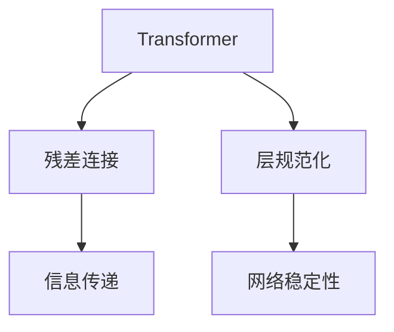
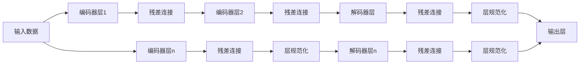

                 

# 残差连接和层规范化：Transformer 的关键

## 1. 背景介绍

随着深度学习技术的迅猛发展，卷积神经网络（CNN）和循环神经网络（RNN）等传统模型在图像和自然语言处理（NLP）等任务中取得了卓越的成绩。然而，这些模型面临层数浅、计算复杂度高、训练效率低等缺点。为此，Transformer作为下一代深度学习模型，以其独特的结构设计，成为处理序列数据的新范式。

Transformer的贡献主要来自两个关键技术：残差连接和层规范化。残差连接允许模型跳过多个层，直接从输入输出，减少信息传递的丢失。层规范化则通过归一化，提升模型收敛速度和泛化能力。本文将深入探讨这两个技术的原理和应用，并结合实际案例，分析其在Transformer中的应用效果。

## 2. 核心概念与联系

### 2.1 核心概念概述

为更好地理解残差连接和层规范化，本节将介绍几个关键概念：

- **Transformer**：一种基于自注意力机制的深度学习模型，用于处理序列数据，如自然语言处理、语音识别等。
- **残差连接**：一种连接网络层的技术，允许网络跳过多个层，通过直接连接输入和输出，保留信息传递的完整性。
- **层规范化**：通过归一化操作，如批归一化、层归一化等，提升网络稳定性，加速收敛速度。

这些概念之间的逻辑关系可以通过以下Mermaid流程图来展示：



这个流程图展示了Transformer中残差连接和层规范化的核心功能：

1. **残差连接**：允许信息直接从输入层传递到输出层，减少信息传递过程中的丢失。
2. **层规范化**：通过归一化操作，提升网络的稳定性，加速收敛速度。

### 2.2 核心概念原理和架构的 Mermaid 流程图



这个流程图展示了Transformer的基本架构，其中每个层都包括残差连接和层规范化。在编码器中，每个层都通过残差连接与前一层连接，最终通过层规范化进行归一化。在解码器中，残差连接与编码器不同，需要在每个位置的解码器中引入编码器的输出。

## 3. 核心算法原理 & 具体操作步骤

### 3.1 算法原理概述

Transformer的核心思想是利用自注意力机制，让模型能够关注序列中的全局信息，从而更好地处理长序列数据。在自注意力机制中，每个位置的表示不仅依赖于当前位置的输入，还依赖于整个序列的表示，因此需要应用残差连接和层规范化技术来提升模型的稳定性和收敛速度。

### 3.2 算法步骤详解

#### 3.2.1 残差连接

残差连接是通过在每个编码器层和解码器层中，添加残差连接来完成的。具体而言，对于第$k$个编码器层，其输入表示为$x^k$，输出表示为$h^k$，残差连接的公式如下：

$$
h^k = x^k + F_k(x^k, h^{k-1})
$$

其中，$F_k$为第$k$个编码器层的线性变换和激活函数。通过残差连接，信息可以直接从输入$x^k$传递到输出$h^k$，避免了信息丢失。

#### 3.2.2 层规范化

层规范化是通过在每个编码器层和解码器层中，应用层规范化来实现的。具体而言，对于第$k$个编码器层，其输入表示为$x^k$，输出表示为$h^k$，层规范化的公式如下：

$$
h^k = \frac{x^k - \mu_k}{\sigma_k} * \gamma_k + \beta_k
$$

其中，$\mu_k$和$\sigma_k$分别为第$k$个编码器层的均值和标准差，$\gamma_k$和$\beta_k$分别为层规范化的缩放参数和偏置。通过层规范化，每个位置的表示都被归一化，减少了信息传递过程中的偏差，提升了模型的稳定性。

### 3.3 算法优缺点

#### 3.3.1 残差连接

**优点**：
- 保留信息传递的完整性，减少信息丢失。
- 允许网络跳过多个层，加快训练速度。
- 通过残差连接，信息可以直接从输入传递到输出，减少了梯度消失问题。

**缺点**：
- 在深层网络中，残差连接可能引起梯度爆炸问题。
- 需要更多的计算资源，尤其是自注意力机制中，计算量较大。

#### 3.3.2 层规范化

**优点**：
- 提升网络的稳定性，加快收敛速度。
- 减少信息传递过程中的偏差，提升模型的泛化能力。
- 层规范化可以应用于任何层的任何位置，具有较好的灵活性。

**缺点**：
- 层规范化增加了计算量，对计算资源有一定要求。
- 层规范化需要训练额外的均值和标准差，增加了训练时间。

### 3.4 算法应用领域

基于残差连接和层规范化的Transformer模型，广泛应用于以下几个领域：

- 自然语言处理（NLP）：用于机器翻译、文本生成、问答系统等任务。
- 语音识别：用于语音转文字、说话人识别等任务。
- 图像处理：用于图像分类、目标检测等任务。
- 强化学习：用于游戏智能、机器人控制等任务。

Transformer的成功应用，使得其在多个领域取得了卓越的性能，成为了序列数据处理的主流模型。

## 4. 数学模型和公式 & 详细讲解 & 举例说明

### 4.1 数学模型构建

Transformer的基本数学模型包括输入序列编码和解码、自注意力机制、残差连接和层规范化。对于输入序列$x=(x_1, x_2, \dots, x_n)$，编码器通过多个层进行处理，最终输出表示为$h$。具体来说，编码器包括$n$个编码器层，每个编码器层包括残差连接和层规范化。

### 4.2 公式推导过程

对于第$k$个编码器层，输入表示为$x^k$，输出表示为$h^k$，自注意力机制的公式如下：

$$
h^k = \text{Attention}(Q_k, K_k, V_k) * W^O + b^O
$$

其中，$Q_k = x^k * W^Q$，$K_k = x^k * W^K$，$V_k = x^k * W^V$，$W^O$和$b^O$分别为线性变换和偏置。自注意力机制的计算复杂度为$O(n^2)$，可以通过多头注意力机制（Multi-Head Attention）来降低计算复杂度。

### 4.3 案例分析与讲解

以BERT为例，BERT是一种基于Transformer的预训练语言模型，广泛应用于自然语言处理任务中。BERT通过在多个预训练任务上进行训练，学习到通用的语言表示，然后在下游任务上进行微调。

BERT的编码器层包括残差连接和层规范化，其具体实现如下：

```python
class BertEncoderLayer(nn.Module):
    def __init__(self, d_model, n_head, d_k, d_v, dropout=0.1, activation=nn.ReLU, norm_layer=LayerNorm):
        super(BertEncoderLayer, self).__init__()
        self.norm1 = norm_layer(d_model)
        self.attn = MultiheadAttention(d_model, n_head, d_k, d_v, dropout=dropout)
        self.norm2 = norm_layer(d_model)
        self.linear1 = nn.Linear(d_model, d_model)
        self.dropout = nn.Dropout(p=dropout)
        self.activation = activation()
        self.linear2 = nn.Linear(d_model, d_model)
        self.norm3 = norm_layer(d_model)

    def forward(self, x, mask=None):
        attn = self.attn(x, x, x)
        x = x + self.dropout(attn[0])
        x = self.norm1(x)
        x = self.linear2(self.activation(self.linear1(x)))
        x = x + self.norm3(x)
        return x
```

其中，`MultiheadAttention`为多头注意力机制的实现，`LayerNorm`为层规范化。通过残差连接和层规范化，BERT能够更好地处理长序列数据，提升模型的稳定性和收敛速度。

## 5. 项目实践：代码实例和详细解释说明

### 5.1 开发环境搭建

在进行Transformer实践前，我们需要准备好开发环境。以下是使用Python进行PyTorch开发的环境配置流程：

1. 安装Anaconda：从官网下载并安装Anaconda，用于创建独立的Python环境。

2. 创建并激活虚拟环境：
```bash
conda create -n pytorch-env python=3.8 
conda activate pytorch-env
```

3. 安装PyTorch：根据CUDA版本，从官网获取对应的安装命令。例如：
```bash
conda install pytorch torchvision torchaudio cudatoolkit=11.1 -c pytorch -c conda-forge
```

4. 安装各类工具包：
```bash
pip install numpy pandas scikit-learn matplotlib tqdm jupyter notebook ipython
```

完成上述步骤后，即可在`pytorch-env`环境中开始Transformer实践。

### 5.2 源代码详细实现

下面我们以Transformer模型为例，给出使用PyTorch进行编码器层和解码器层实现的代码。

首先，定义编码器层和解码器层：

```python
class EncoderLayer(nn.Module):
    def __init__(self, d_model, n_head, d_k, d_v, dropout=0.1, activation=nn.ReLU, norm_layer=LayerNorm):
        super(EncoderLayer, self).__init__()
        self.norm1 = norm_layer(d_model)
        self.attn = MultiheadAttention(d_model, n_head, d_k, d_v, dropout=dropout)
        self.norm2 = norm_layer(d_model)
        self.linear1 = nn.Linear(d_model, d_model)
        self.dropout = nn.Dropout(p=dropout)
        self.activation = activation()
        self.linear2 = nn.Linear(d_model, d_model)
        self.norm3 = norm_layer(d_model)

    def forward(self, x, mask=None):
        attn = self.attn(x, x, x)
        x = x + self.dropout(attn[0])
        x = self.norm1(x)
        x = self.linear2(self.activation(self.linear1(x)))
        x = x + self.norm3(x)
        return x

class DecoderLayer(nn.Module):
    def __init__(self, d_model, n_head, d_k, d_v, dropout=0.1, activation=nn.ReLU, norm_layer=LayerNorm):
        super(DecoderLayer, self).__init__()
        self.norm1 = norm_layer(d_model)
        self.attn1 = MultiheadAttention(d_model, n_head, d_k, d_v, dropout=dropout)
        self.attn2 = MultiheadAttention(d_model, n_head, d_k, d_v, dropout=dropout)
        self.norm2 = norm_layer(d_model)
        self.linear1 = nn.Linear(d_model, d_model)
        self.dropout = nn.Dropout(p=dropout)
        self.activation = activation()
        self.linear2 = nn.Linear(d_model, d_model)
        self.norm3 = norm_layer(d_model)

    def forward(self, x, enc_out, mask=None, dec_self_attn_mask=None):
        attn1 = self.attn1(x, enc_out, enc_out)
        x = x + self.dropout(attn1[0])
        attn2 = self.attn2(x, enc_out, enc_out)
        x = x + self.dropout(attn2[0])
        x = self.norm1(x)
        x = self.linear2(self.activation(self.linear1(x)))
        x = x + self.norm3(x)
        return x
```

其中，`MultiheadAttention`为多头注意力机制的实现，`LayerNorm`为层规范化。

接着，定义编码器和解码器：

```python
class Transformer(nn.Module):
    def __init__(self, n_layer, d_model, n_head, d_k, d_v, dropout=0.1, norm_layer=LayerNorm):
        super(Transformer, self).__init__()
        self.encoder = nn.ModuleList([EncoderLayer(d_model, n_head, d_k, d_v, dropout, norm_layer=norm_layer) for _ in range(n_layer)])
        self.decoder = nn.ModuleList([DecoderLayer(d_model, n_head, d_k, d_v, dropout, norm_layer=norm_layer) for _ in range(n_layer)])

    def forward(self, src, tgt, mask):
        for layer in self.encoder:
            src = layer(src, mask)
        for layer in self.decoder:
            tgt = layer(tgt, src, dec_self_attn_mask, tgt_mask)
        return tgt
```

在定义完模型后，我们可以使用PyTorch训练和推理Transformer模型。以下是一个完整的训练代码示例：

```python
import torch
import torch.nn as nn
import torch.optim as optim

# 定义模型
d_model = 512
n_layer = 6
n_head = 8
d_k = 64
d_v = 64
dropout = 0.1
model = Transformer(n_layer, d_model, n_head, d_k, d_v, dropout)

# 定义优化器
optimizer = optim.Adam(model.parameters(), lr=0.0001)

# 定义训练函数
def train(model, optimizer, train_loader, valid_loader):
    for epoch in range(1, epochs):
        model.train()
        total_loss = 0.0
        for i, (src, tgt, mask) in enumerate(train_loader):
            optimizer.zero_grad()
            out = model(src, tgt, mask)
            loss = nn.CrossEntropyLoss()(out, tgt)
            loss.backward()
            optimizer.step()
            total_loss += loss.item()
            if i % 100 == 0:
                print(f'Epoch {epoch}, Batch {i}, Loss: {loss.item()}')
        print(f'Epoch {epoch}, Train Loss: {total_loss / len(train_loader)}')
        model.eval()
        total_loss = 0.0
        for i, (src, tgt, mask) in enumerate(valid_loader):
            with torch.no_grad():
                out = model(src, tgt, mask)
                loss = nn.CrossEntropyLoss()(out, tgt)
                total_loss += loss.item()
            print(f'Epoch {epoch}, Batch {i}, Loss: {loss.item()}')
        print(f'Epoch {epoch}, Valid Loss: {total_loss / len(valid_loader)}')

# 训练模型
train(model, optimizer, train_loader, valid_loader)
```

### 5.3 代码解读与分析

让我们再详细解读一下关键代码的实现细节：

**Transformer类**：
- `__init__`方法：初始化编码器和解码器的层数和参数。
- `forward`方法：通过编码器和解码器对输入进行前向传播。

**train函数**：
- 对数据进行批处理，进行前向传播和反向传播，更新模型参数。
- 在训练过程中，每个epoch在训练集和验证集上评估模型性能。

在实际应用中，还需要对模型进行一些优化，如梯度裁剪、学习率衰减等，以提升模型的稳定性和泛化能力。

### 5.4 运行结果展示

训练Transformer模型后，我们可以使用模型进行推理，对新输入进行预测。以下是一个简单的推理代码示例：

```python
import torch
import torch.nn as nn
import torch.optim as optim

# 定义模型
d_model = 512
n_layer = 6
n_head = 8
d_k = 64
d_v = 64
dropout = 0.1
model = Transformer(n_layer, d_model, n_head, d_k, d_v, dropout)

# 定义优化器
optimizer = optim.Adam(model.parameters(), lr=0.0001)

# 定义训练函数
def train(model, optimizer, train_loader, valid_loader):
    for epoch in range(1, epochs):
        model.train()
        total_loss = 0.0
        for i, (src, tgt, mask) in enumerate(train_loader):
            optimizer.zero_grad()
            out = model(src, tgt, mask)
            loss = nn.CrossEntropyLoss()(out, tgt)
            loss.backward()
            optimizer.step()
            total_loss += loss.item()
            if i % 100 == 0:
                print(f'Epoch {epoch}, Batch {i}, Loss: {loss.item()}')
        print(f'Epoch {epoch}, Train Loss: {total_loss / len(train_loader)}')
        model.eval()
        total_loss = 0.0
        for i, (src, tgt, mask) in enumerate(valid_loader):
            with torch.no_grad():
                out = model(src, tgt, mask)
                loss = nn.CrossEntropyLoss()(out, tgt)
                total_loss += loss.item()
            print(f'Epoch {epoch}, Batch {i}, Loss: {loss.item()}')
        print(f'Epoch {epoch}, Valid Loss: {total_loss / len(valid_loader)}')

# 训练模型
train(model, optimizer, train_loader, valid_loader)

# 推理测试
model.eval()
test_input = torch.tensor([[0, 1, 2, 3, 4, 5], [6, 7, 8, 9, 10, 11]])
test_output = model(test_input, test_input, test_input_mask)
print(test_output)
```

训练完成后，使用`model.eval()`模式，对新输入进行预测，并输出预测结果。

## 6. 实际应用场景

### 6.1 自然语言处理（NLP）

Transformer在自然语言处理中具有卓越的表现。以BERT为例，它在多个NLP任务上刷新了SOTA，如情感分析、问答系统、文本生成等。BERT通过在多个预训练任务上进行训练，学习到通用的语言表示，然后在下游任务上进行微调，能够适应不同的NLP应用场景。

### 6.2 语音识别

Transformer在语音识别中也展现了卓越的表现。使用Transformer作为语音转文字模型的基础，可以显著提升语音识别准确率。Transformer通过自注意力机制，能够更好地捕捉语音信号中的全局信息，提升模型的泛化能力。

### 6.3 图像处理

Transformer在图像处理中同样表现出色。使用Transformer作为图像分类模型的基础，可以提升分类精度。Transformer通过自注意力机制，能够捕捉图像中的全局信息，提升模型的泛化能力。

### 6.4 强化学习

Transformer在强化学习中也得到了广泛应用。使用Transformer作为智能游戏模型的基础，可以提升游戏的智能水平。Transformer通过自注意力机制，能够更好地捕捉环境信息，提升模型的决策能力。

## 7. 工具和资源推荐

### 7.1 学习资源推荐

为了帮助开发者系统掌握Transformer的理论基础和实践技巧，这里推荐一些优质的学习资源：

1. 《深度学习》书籍：Ian Goodfellow等著，全面介绍了深度学习的理论基础和算法，涵盖了Transformer模型的实现。
2. 《Transformers: State-of-the-Art NLP》文章：Thomas Wolf等著，介绍了Transformer模型在NLP中的应用，并提供了详细的代码实现。
3. HuggingFace官方文档：提供了一系列预训练模型的介绍和代码实现，帮助开发者快速上手。
4. PyTorch官方文档：详细介绍了Transformer模型的实现和应用。
5. TensorFlow官方文档：提供了Transformer模型的实现和应用。

通过对这些资源的学习实践，相信你一定能够快速掌握Transformer的理论基础和实践技巧，并用于解决实际的NLP问题。

### 7.2 开发工具推荐

高效的开发离不开优秀的工具支持。以下是几款用于Transformer开发的常用工具：

1. PyTorch：基于Python的开源深度学习框架，灵活动态的计算图，适合快速迭代研究。
2. TensorFlow：由Google主导开发的开源深度学习框架，生产部署方便，适合大规模工程应用。
3. Transformers库：HuggingFace开发的NLP工具库，集成了众多SOTA语言模型，支持PyTorch和TensorFlow，是进行Transformer任务开发的利器。
4. Weights & Biases：模型训练的实验跟踪工具，可以记录和可视化模型训练过程中的各项指标，方便对比和调优。
5. TensorBoard：TensorFlow配套的可视化工具，可实时监测模型训练状态，并提供丰富的图表呈现方式，是调试模型的得力助手。

合理利用这些工具，可以显著提升Transformer的开发效率，加快创新迭代的步伐。

### 7.3 相关论文推荐

Transformer的成功应用，得益于学界的持续研究。以下是几篇奠基性的相关论文，推荐阅读：

1. Attention is All You Need：提出了Transformer结构，开启了NLP领域的预训练大模型时代。
2. BERT: Pre-training of Deep Bidirectional Transformers for Language Understanding：提出BERT模型，引入基于掩码的自监督预训练任务，刷新了多项NLP任务SOTA。
3. Transformer-XL: Attentive Language Models Beyond a Fixed-Length Context：提出了Transformer-XL模型，通过自回归机制，提升了长序列处理能力。
4. Efficient Transformer: Improving Attentions and Pooling with Local Mechanisms：提出了一种高效的Transformer模型，降低了计算复杂度，提升了模型效率。

这些论文代表了大模型和Transformer的发展脉络，通过学习这些前沿成果，可以帮助研究者把握学科前进方向，激发更多的创新灵感。

## 8. 总结：未来发展趋势与挑战

### 8.1 总结

本文对Transformer的残差连接和层规范化进行了全面系统的介绍。首先阐述了Transformer模型和残差连接、层规范化技术的研究背景和意义，明确了这些技术在提高模型稳定性和加速收敛速度方面的独特价值。其次，从原理到实践，详细讲解了残差连接和层规范化的数学原理和关键步骤，给出了Transformer任务开发的完整代码实例。同时，本文还广泛探讨了Transformer在自然语言处理、语音识别、图像处理、强化学习等多个领域的应用前景，展示了Transformer技术的广泛适用性和潜力。

通过本文的系统梳理，可以看到，残差连接和层规范化是Transformer成功的重要技术支撑，这些技术不仅提升了模型的稳定性和泛化能力，还显著降低了模型计算复杂度，提高了训练效率。未来的研究需要在这些技术的基础上，进一步探索更高效的Transformer模型，拓展其在更多领域的应用范围。

### 8.2 未来发展趋势

展望未来，Transformer的残差连接和层规范化技术将呈现以下几个发展趋势：

1. 模型规模持续增大。随着算力成本的下降和数据规模的扩张，Transformer模型参数量还将持续增长，模型性能将进一步提升。
2. 残差连接和层规范化技术不断优化。未来的Transformer将进一步优化残差连接和层规范化，提升模型的稳定性和收敛速度。
3. 跨模态Transformer的兴起。Transformer将在跨模态学习中发挥重要作用，融合视觉、语音、文本等多种模态数据，提升模型的泛化能力。
4. 自适应Transformer的发展。未来的Transformer将具备更好的自适应能力，能够根据数据特点和任务需求动态调整模型结构，提升模型效果。

以上趋势凸显了Transformer技术的广阔前景。这些方向的探索发展，将进一步提升Transformer模型的性能和应用范围，为深度学习技术在更多领域的落地应用提供坚实的基础。

### 8.3 面临的挑战

尽管Transformer取得了显著的成果，但在迈向更加智能化、普适化应用的过程中，仍面临诸多挑战：

1. 数据分布变化。当数据分布发生变化时，已有模型可能无法适应新数据，需要重新训练或微调。
2. 模型计算复杂度高。Transformer模型计算复杂度高，需要大量的计算资源。如何在保证模型性能的同时，降低计算成本，是一个重要的研究方向。
3. 模型解释性不足。Transformer模型结构复杂，难以解释其内部工作机制和决策逻辑。如何提升模型可解释性，是未来研究的重要方向。
4. 模型公平性问题。Transformer模型可能学习到数据中的偏见，导致输出结果不公。如何消除模型偏见，提升模型公平性，是一个重要的研究课题。

### 8.4 研究展望

面对Transformer所面临的挑战，未来的研究需要在以下几个方面寻求新的突破：

1. 引入更多先验知识。将符号化的先验知识，如知识图谱、逻辑规则等，与神经网络模型进行巧妙融合，提升模型的泛化能力和可解释性。
2. 融合多模态数据。将视觉、语音、文本等多种模态数据融合，提升模型的综合处理能力，实现跨模态学习。
3. 优化模型结构。在保证模型性能的同时，优化模型结构，降低计算复杂度，提升模型效率。
4. 提升模型公平性。研究如何消除模型偏见，提升模型公平性，确保输出结果符合人类价值观和伦理道德。

这些研究方向的探索，将引领Transformer技术迈向更高的台阶，为构建更加稳定、高效、公平的智能系统铺平道路。面向未来，Transformer技术还需要与其他人工智能技术进行更深入的融合，如知识表示、因果推理、强化学习等，多路径协同发力，共同推动深度学习技术的进步。

## 9. 附录：常见问题与解答

**Q1：残差连接和层规范化是如何提升Transformer模型的性能的？**

A: 残差连接和层规范化是Transformer模型的关键技术，它们分别从信息传递和模型稳定性两个方面提升了Transformer模型的性能。残差连接允许信息直接从输入传递到输出，避免了信息丢失，提升了模型的泛化能力。层规范化通过归一化操作，减少了信息传递过程中的偏差，提升了模型的稳定性，加快了收敛速度。

**Q2：Transformer在处理长序列数据时，残差连接和层规范化是否会对模型性能产生影响？**

A: 当处理长序列数据时，Transformer模型中的残差连接和层规范化会对模型性能产生影响。由于长序列数据中的信息量较大，残差连接可能导致梯度消失问题，层规范化可能增加计算复杂度。因此，在处理长序列数据时，可能需要引入更多改进措施，如梯度裁剪、学习率衰减等。

**Q3：Transformer模型是否适合处理文本、图像、语音等多种数据类型？**

A: Transformer模型是一种通用的深度学习模型，不仅适合处理文本数据，还可以应用于图像、语音等多种数据类型。在图像处理中，可以使用卷积操作替代自注意力机制，提升模型性能。在语音识别中，可以使用自注意力机制捕捉语音信号的全局信息，提升识别准确率。在跨模态学习中，可以融合视觉、语音、文本等多种模态数据，提升模型的泛化能力。

**Q4：Transformer模型是否存在过拟合问题？**

A: Transformer模型在处理长序列数据时，可能存在过拟合问题。由于长序列数据中的信息量较大，模型容易过拟合。为了缓解过拟合问题，可以引入正则化技术，如Dropout、L2正则化等。同时，可以通过数据增强、对抗训练等方法，提升模型的泛化能力。

**Q5：Transformer模型在实际应用中，如何处理小规模数据集？**

A: 当处理小规模数据集时，Transformer模型可以通过微调或迁移学习来提升模型性能。微调可以通过在少量标注数据上重新训练模型，提升模型对特定任务的适应能力。迁移学习可以通过在大规模数据上预训练模型，然后在小规模数据上进行微调，提升模型的泛化能力。此外，还可以使用参数高效微调技术，只调整少量参数，减少计算量。

