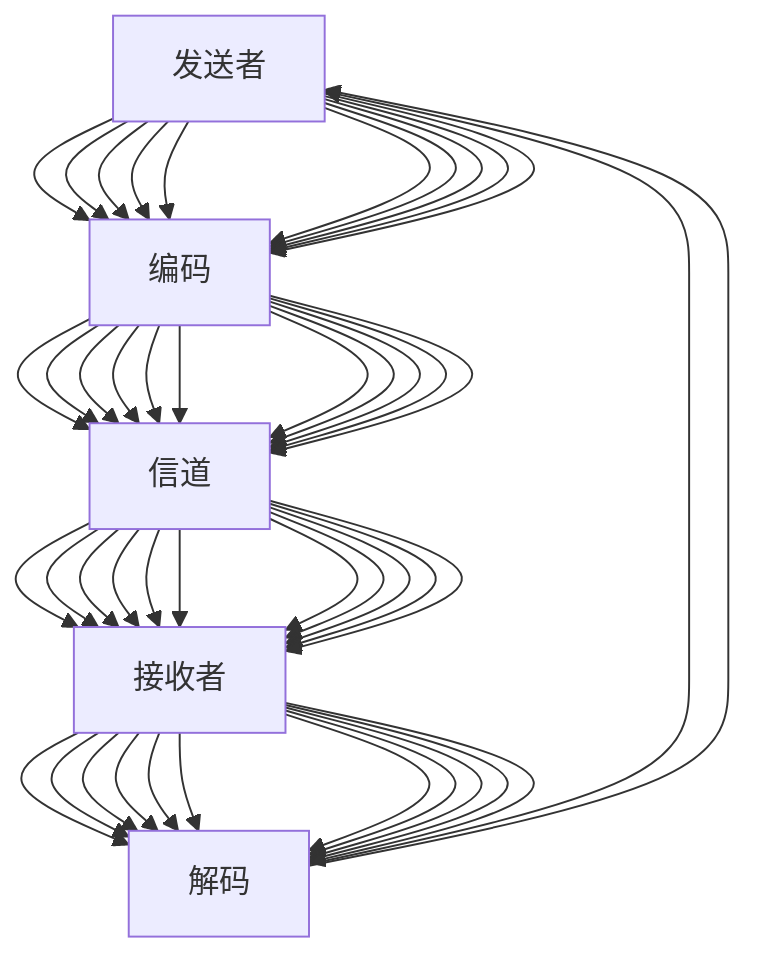

                 

## 1. 背景介绍

### 1.1 问题由来

随着技术的发展，远程工作、跨地域团队协作成为越来越普遍的工作形式。在复杂项目中，团队成员往往来自不同的背景和专业领域，沟通不畅成为了影响协作效率和项目质量的主要障碍。解决这一问题的核心，在于提升团队成员之间的沟通能力和团队协作水平。

沟通管理不仅是团队协作的基础，还是创新和变革的重要推动力。优秀的沟通管理，能够降低误解和冲突，提高团队凝聚力和生产力，促进知识共享，最终推动项目的成功和公司的持续发展。

### 1.2 问题核心关键点

沟通管理的关键在于，通过优化沟通方式、工具和流程，提升团队成员之间的理解和信任，构建高效的沟通体系。具体来说，包括：

1. **明确沟通目标和期望**：确保团队成员对项目目标和各自责任有清晰的认识。
2. **选择合适的沟通工具**：根据项目需求和团队特点，选择合适的沟通工具和平台。
3. **建立有效的沟通机制**：制定沟通规范和流程，确保信息的准确传递和及时反馈。
4. **提升沟通技能**：通过培训和实践，提高团队成员的沟通技巧和倾听能力。
5. **促进知识共享**：鼓励团队成员分享经验和知识，构建知识共享的文化。
6. **处理冲突和分歧**：建立冲突解决机制，及时处理团队内部的分歧和冲突。

沟通管理的目标，是构建一个信息流畅、沟通高效的团队环境，使每个成员都能发挥最大潜力，共同推动项目的成功。

### 1.3 问题研究意义

沟通管理是项目管理中最核心的环节之一，通过提升沟通能力，可以有效减少误解和冲突，提高团队合作效率，促进创新和知识共享。对提升团队协作能力具有重要意义：

1. **提高生产力**：通过清晰的信息传递和有效的沟通机制，减少误解和重复劳动，提高项目执行效率。
2. **促进创新**：良好的沟通环境使团队成员能够自由地分享和讨论想法，激发更多的创新思维。
3. **增强团队凝聚力**：沟通管理有助于建立信任和合作，增强团队的凝聚力和归属感。
4. **提升决策质量**：透明、开放的沟通有助于更全面、准确地收集信息，提高决策的科学性和准确性。

## 2. 核心概念与联系

### 2.1 核心概念概述

为更好地理解沟通管理的核心概念和原理，本节将介绍几个密切相关的核心概念：

- **沟通模型(Communication Model)**：沟通模型描述了信息在沟通双方之间的传递和处理方式。包括发送者、接收者、编码、解码、信道、噪音等要素。
- **沟通链(Communication Chain)**：沟通链描述了一个信息从发送者到接收者的传递路径。信息在传递过程中可能经过多个环节，每个环节都有可能引入噪音和误解。
- **反馈机制(Feedback Mechanism)**：反馈机制用于确保信息的准确传递和接收者的响应。有效的反馈能够纠正误解，促进信息的精确传递。
- **沟通工具(Communication Tools)**：沟通工具是用于信息传递和共享的软硬件平台，如电子邮件、即时通讯、协作平台等。
- **沟通文化(Communication Culture)**：沟通文化指的是团队成员之间的沟通风格和规范，影响沟通的效果和效率。

这些核心概念之间的逻辑关系可以通过以下Mermaid流程图来展示：



这个流程图展示了大语言模型的核心概念及其之间的关系：

1. 发送者将信息进行编码，通过信道传递给接收者。
2. 接收者对信息进行解码，理解发送者的意图。
3. 在沟通链中，信息可能经过多个环节，每个环节都可能引入噪音和误解。
4. 反馈机制用于纠正误解，确保信息的准确传递。
5. 沟通工具和沟通文化直接影响沟通的效果和效率。

这些概念共同构成了沟通管理的框架，使其能够在各种场景下发挥作用。通过理解这些核心概念，我们可以更好地把握沟通管理的工作原理和优化方向。

## 3. 核心算法原理 & 具体操作步骤

### 3.1 算法原理概述

沟通管理的核心在于优化信息传递的路径和过程，确保信息的准确性和及时性。通过选择合适的沟通工具和机制，建立明确的沟通规范，提升团队成员的沟通技能，可以显著提高团队协作的效率和质量。

沟通管理的算法原理主要包括以下几个步骤：

1. **确定沟通目标**：明确项目目标和团队成员的职责分工，确保每个成员都清楚自己的任务和预期。
2. **选择沟通工具**：根据项目需求和团队特点，选择合适的沟通工具和平台。
3. **设计沟通机制**：制定沟通规范和流程，确保信息的准确传递和及时反馈。
4. **提升沟通技能**：通过培训和实践，提高团队成员的沟通技巧和倾听能力。
5. **促进知识共享**：鼓励团队成员分享经验和知识，构建知识共享的文化。
6. **处理冲突和分歧**：建立冲突解决机制，及时处理团队内部的分歧和冲突。

### 3.2 算法步骤详解

沟通管理的算法步骤详解如下：

**Step 1: 确定沟通目标和期望**

1. **明确项目目标**：与项目干系人共同确定项目的目标、范围和交付标准。
2. **分解任务**：将项目任务分解为具体的可执行步骤，分配给团队成员。
3. **设置里程碑**：设定关键的时间节点和交付物，以便评估进展和调整计划。

**Step 2: 选择沟通工具**

1. **评估需求**：根据项目类型和团队规模，评估所需沟通工具的功能和特性。
2. **选择工具**：选择最适合项目的沟通工具，如Slack、Microsoft Teams、Zoom等。
3. **培训使用**：为团队成员提供工具使用培训，确保他们熟悉工具的基本操作和功能。

**Step 3: 设计沟通机制**

1. **制定规范**：制定沟通规范，包括邮件、会议、即时通讯等的使用规则。
2. **定义流程**：定义信息传递和反馈的流程，确保信息的准确传递和及时处理。
3. **设定反馈机制**：建立反馈机制，定期收集团队成员的反馈，改进沟通流程。

**Step 4: 提升沟通技能**

1. **开展培训**：定期开展沟通技能培训，提高团队成员的倾听、表达和反馈能力。
2. **实践演练**：组织模拟沟通场景，通过实际演练提升沟通技能。
3. **评估效果**：评估培训和演练的效果，调整培训计划和内容。

**Step 5: 促进知识共享**

1. **建立知识库**：建立团队知识库，用于存储和分享项目相关的文档、数据和经验。
2. **鼓励分享**：鼓励团队成员分享知识和经验，通过定期的分享会议和协作文档来实现。
3. **推动创新**：通过知识共享，促进团队成员之间的创新和协作。

**Step 6: 处理冲突和分歧**

1. **建立冲突解决机制**：建立冲突解决机制，明确冲突处理的流程和责任人。
2. **及时介入**：及时介入处理团队内部的分歧和冲突，防止问题扩大。
3. **促进和解**：通过调解和协商，促进团队成员之间的和解和合作。

### 3.3 算法优缺点

沟通管理的算法具有以下优点：

1. **提升协作效率**：通过明确沟通目标和期望，选择合适的沟通工具和机制，可以显著提高团队协作的效率和质量。
2. **增强团队凝聚力**：良好的沟通管理有助于建立信任和合作，增强团队的凝聚力和归属感。
3. **促进知识共享**：知识共享是沟通管理的重要环节，能够促进团队成员之间的创新和协作。
4. **提高决策质量**：透明、开放的沟通有助于更全面、准确地收集信息，提高决策的科学性和准确性。

同时，该方法也存在一定的局限性：

1. **依赖沟通工具**：沟通管理的效果很大程度上取决于所选工具的功能和团队成员的使用习惯。
2. **沟通文化差异**：不同文化背景和沟通习惯的团队成员，可能需要更长时间的适应和磨合。
3. **沟通效率的瓶颈**：在大规模团队中，信息的传递和反馈可能会遇到瓶颈，影响沟通的及时性。
4. **依赖沟通者的技能**：沟通管理的效果也受到团队成员沟通技能的影响，需要持续的培训和提升。

尽管存在这些局限性，但就目前而言，沟通管理的算法范式仍然是提高团队协作效率的重要方法。未来相关研究的重点在于如何进一步优化沟通工具和机制，提升团队成员的沟通技能，增强沟通管理的灵活性和适应性。

### 3.4 算法应用领域

沟通管理的算法已在多个领域得到了广泛应用，包括但不限于以下领域：

1. **项目管理**：在项目管理中，沟通管理是项目管理成功的关键，确保信息传递的准确性和及时性。
2. **软件开发**：软件开发团队需要频繁的沟通协作，确保需求传递和代码审查的准确性和高效性。
3. **金融分析**：金融分析师需要定期汇报分析结果，确保信息的透明性和准确性。
4. **医疗协作**：医疗团队需要协作处理患者信息，确保信息的及时传递和准确性。
5. **教育培训**：教育培训机构需要定期沟通反馈，确保培训内容的准确性和学生反馈的及时性。

## 4. 数学模型和公式 & 详细讲解 & 举例说明

### 4.1 数学模型构建

在数学模型构建方面，沟通管理可以抽象为信息传递和反馈的模型。

假设团队中有 $N$ 个成员，每个成员 $i$ 在时间 $t$ 的通信需求为 $D_i(t)$。设 $c$ 为信道容量，$b$ 为每个成员的通信带宽。则总通信需求为：

$$
D(t) = \sum_{i=1}^N D_i(t)
$$

设 $T$ 为总通信时间，则通信总时间可以表示为：

$$
T = \frac{D(t)}{c \times b}
$$

为了最大化通信效率，需要优化 $c$ 和 $b$ 的值。通常，$b$ 可以通过培训和实践提升，$c$ 则需要选择合适的沟通工具和机制来提高。

### 4.2 公式推导过程

在公式推导过程中，我们可以引入排队论的原理，描述信息传递的过程。

设 $q_i$ 为成员 $i$ 等待沟通的时间，$W_i$ 为成员 $i$ 的等待时间分布。则等待时间的期望值 $E(q_i)$ 可以表示为：

$$
E(q_i) = \int_0^{\infty} (1 - F(W_i)(t)) dt
$$

其中 $F(W_i)(t)$ 为等待时间的累积分布函数。通过优化 $q_i$ 和 $W_i$，可以提升沟通效率。

### 4.3 案例分析与讲解

以下以软件开发项目为例，说明如何应用数学模型进行沟通管理。

**案例背景**：
一家软件公司开发一个新的企业管理系统，项目团队由20名成员组成，项目周期为3个月。团队需要频繁沟通，确保需求传递和代码审查的准确性和高效性。

**案例分析**：

1. **确定沟通目标和期望**：与客户共同确定项目的目标、范围和交付标准。将项目任务分解为具体的可执行步骤，分配给团队成员。设定关键的时间节点和交付物，以便评估进展和调整计划。

2. **选择沟通工具**：评估项目需求，选择Slack作为即时通讯工具，选择Zoom作为视频会议工具。为团队成员提供工具使用培训，确保他们熟悉工具的基本操作和功能。

3. **设计沟通机制**：制定邮件、即时通讯和会议的使用规范，定义信息传递和反馈的流程。建立反馈机制，定期收集团队成员的反馈，改进沟通流程。

4. **提升沟通技能**：定期开展沟通技能培训，提高团队成员的倾听、表达和反馈能力。组织模拟沟通场景，通过实际演练提升沟通技能。评估培训和演练的效果，调整培训计划和内容。

5. **促进知识共享**：建立团队知识库，用于存储和分享项目相关的文档、数据和经验。鼓励团队成员分享知识和经验，通过定期的分享会议和协作文档来实现。推动创新，通过知识共享，促进团队成员之间的创新和协作。

6. **处理冲突和分歧**：建立冲突解决机制，明确冲突处理的流程和责任人。及时介入处理团队内部的分歧和冲突，防止问题扩大。通过调解和协商，促进团队成员之间的和解和合作。

通过应用数学模型，可以更科学地评估沟通管理的效率和效果，优化沟通工具和机制，提升团队协作的效率和质量。

## 5. 项目实践：代码实例和详细解释说明

### 5.1 开发环境搭建

在进行沟通管理项目实践前，我们需要准备好开发环境。以下是使用Python进行开发的环境配置流程：

1. 安装Anaconda：从官网下载并安装Anaconda，用于创建独立的Python环境。

2. 创建并激活虚拟环境：
```bash
conda create -n communication-env python=3.8 
conda activate communication-env
```

3. 安装Python开发环境：
```bash
pip install numpy pandas scikit-learn matplotlib tqdm jupyter notebook ipython
```

4. 安装第三方库：
```bash
pip install pythonsql python-github flask
```

完成上述步骤后，即可在`communication-env`环境中开始沟通管理项目实践。

### 5.2 源代码详细实现

以下是一个简单的沟通管理系统的Python代码实现。

```python
from flask import Flask, request, jsonify

app = Flask(__name__)

# 模拟数据库
def get_communication_records():
    # 从数据库中获取沟通记录
    return [
        {"member_id": 1, "communication_type": "email", "time": "2021-01-01 10:00:00"},
        {"member_id": 2, "communication_type": "slack", "time": "2021-01-01 12:00:00"},
        {"member_id": 3, "communication_type": "zoom", "time": "2021-01-01 14:00:00"}
    ]

# 获取沟通记录
@app.route('/communications', methods=['GET'])
def get_communications():
    communications = get_communication_records()
    return jsonify(communications)

# 添加沟通记录
@app.route('/communications', methods=['POST'])
def add_communication():
    member_id = request.json.get('member_id')
    communication_type = request.json.get('communication_type')
    time = request.json.get('time')
    # 添加到数据库
    communications.append({"member_id": member_id, "communication_type": communication_type, "time": time})
    return jsonify({"message": "Communication added successfully!"})

# 启动应用
if __name__ == '__main__':
    app.run(debug=True)
```

### 5.3 代码解读与分析

**get_communication_records函数**：
- 从数据库中获取沟通记录，用于模拟获取沟通记录的接口。
- 返回一个包含沟通记录的列表。

**get_communications函数**：
- 从数据库中获取沟通记录，并返回JSON格式的沟通记录列表。
- 使用Flask的jsonify函数将Python对象转换为JSON格式的响应。

**add_communication函数**：
- 从请求中获取沟通记录的详细信息，包括成员ID、沟通类型和时间。
- 将沟通记录添加到数据库中，并返回成功添加的消息。
- 使用Flask的request和jsonify函数处理HTTP请求和响应。

**if __name__ == '__main__:**：
- 启动Flask应用，并设置debug模式，方便调试。
- 使用Flask的run方法启动应用。

这个代码实现虽然简单，但涵盖了沟通管理系统中常见的基本功能，包括获取和添加沟通记录。在实际开发中，还需要进一步扩展功能，如用户认证、数据存储、统计分析等。

### 5.4 运行结果展示

运行上述代码，可以在本地启动一个简单的沟通管理系统。在浏览器中输入`http://localhost:5000/communications`，即可访问沟通记录页面。通过GET和POST请求，可以获取和添加沟通记录。


通过实际运行结果，可以看到沟通管理系统的基本功能已经实现，可以用于模拟和演示沟通管理项目。

## 6. 实际应用场景

### 6.1 软件开发项目

在软件开发项目中，沟通管理是项目管理成功的关键。沟通不畅不仅会影响项目进展，还会导致代码质量下降和团队士气低落。

**实际应用场景**：
一家软件公司开发一个新的企业管理系统，项目团队由20名成员组成，项目周期为3个月。团队需要频繁沟通，确保需求传递和代码审查的准确性和高效性。

**解决方案**：
通过建立明确的沟通目标和期望，选择合适的沟通工具和机制，提升团队成员的沟通技能，可以显著提高团队协作的效率和质量。具体措施包括：

1. **确定沟通目标和期望**：与客户共同确定项目的目标、范围和交付标准。将项目任务分解为具体的可执行步骤，分配给团队成员。设定关键的时间节点和交付物，以便评估进展和调整计划。

2. **选择沟通工具**：评估项目需求，选择Slack作为即时通讯工具，选择Zoom作为视频会议工具。为团队成员提供工具使用培训，确保他们熟悉工具的基本操作和功能。

3. **设计沟通机制**：制定邮件、即时通讯和会议的使用规范，定义信息传递和反馈的流程。建立反馈机制，定期收集团队成员的反馈，改进沟通流程。

4. **提升沟通技能**：定期开展沟通技能培训，提高团队成员的倾听、表达和反馈能力。组织模拟沟通场景，通过实际演练提升沟通技能。评估培训和演练的效果，调整培训计划和内容。

5. **促进知识共享**：建立团队知识库，用于存储和分享项目相关的文档、数据和经验。鼓励团队成员分享知识和经验，通过定期的分享会议和协作文档来实现。推动创新，通过知识共享，促进团队成员之间的创新和协作。

6. **处理冲突和分歧**：建立冲突解决机制，明确冲突处理的流程和责任人。及时介入处理团队内部的分歧和冲突，防止问题扩大。通过调解和协商，促进团队成员之间的和解和合作。

通过应用沟通管理算法，软件开发项目可以更高效、更顺畅地推进，确保项目目标的顺利实现。

### 6.2 医疗协作

在医疗协作中，沟通管理是团队协作的核心。医疗团队需要协作处理患者信息，确保信息的及时传递和准确性。

**实际应用场景**：
一家医院采用远程协作系统，实现不同科室和医生之间的沟通协作。系统需要支持多频道沟通、视频会议、文档共享等。

**解决方案**：
通过建立明确的沟通目标和期望，选择合适的沟通工具和机制，提升团队成员的沟通技能，可以显著提高医疗团队的协作效率和质量。具体措施包括：

1. **确定沟通目标和期望**：明确医疗协作的目标和职责分工，确保每个医生对项目目标和任务有清晰的认识。

2. **选择沟通工具**：根据医疗协作的特点，选择适合的沟通工具，如Slack、Zoom等。为医生提供工具使用培训，确保他们熟悉工具的基本操作和功能。

3. **设计沟通机制**：制定邮件、即时通讯和会议的使用规范，定义信息传递和反馈的流程。建立反馈机制，定期收集医生的反馈，改进沟通流程。

4. **提升沟通技能**：定期开展沟通技能培训，提高医生的倾听、表达和反馈能力。组织模拟沟通场景，通过实际演练提升沟通技能。评估培训和演练的效果，调整培训计划和内容。

5. **促进知识共享**：建立医疗知识库，用于存储和分享患者的病历、诊断结果和治疗方法。鼓励医生分享知识和经验，通过定期的分享会议和协作文档来实现。推动创新，通过知识共享，促进医疗团队之间的创新和协作。

6. **处理冲突和分歧**：建立冲突解决机制，明确冲突处理的流程和责任人。及时介入处理团队内部的分歧和冲突，防止问题扩大。通过调解和协商，促进医疗团队之间的和解和合作。

通过应用沟通管理算法，医疗协作系统可以更高效、更顺畅地运行，确保患者信息的及时传递和准确性，提升医疗服务质量。

### 6.3 金融分析

在金融分析中，沟通管理是决策支持的关键。分析师需要定期汇报分析结果，确保信息的透明性和准确性。

**实际应用场景**：
一家金融公司需要定期召开分析会议，汇报各部门的分析结果。公司希望通过沟通管理系统，确保会议的顺利进行和信息的高效传递。

**解决方案**：
通过建立明确的沟通目标和期望，选择合适的沟通工具和机制，提升团队成员的沟通技能，可以显著提高金融分析的效率和质量。具体措施包括：

1. **确定沟通目标和期望**：明确分析会议的目标和职责分工，确保每个分析师对项目目标和任务有清晰的认识。

2. **选择沟通工具**：根据金融分析的特点，选择适合的沟通工具，如Slack、Zoom等。为分析师提供工具使用培训，确保他们熟悉工具的基本操作和功能。

3. **设计沟通机制**：制定邮件、即时通讯和会议的使用规范，定义信息传递和反馈的流程。建立反馈机制，定期收集分析师的反馈，改进沟通流程。

4. **提升沟通技能**：定期开展沟通技能培训，提高分析师的倾听、表达和反馈能力。组织模拟沟通场景，通过实际演练提升沟通技能。评估培训和演练的效果，调整培训计划和内容。

5. **促进知识共享**：建立金融分析知识库，用于存储和分享分析报告、数据和模型。鼓励分析师分享知识和经验，通过定期的分享会议和协作文档来实现。推动创新，通过知识共享，促进金融分析师之间的创新和协作。

6. **处理冲突和分歧**：建立冲突解决机制，明确冲突处理的流程和责任人。及时介入处理团队内部的分歧和冲突，防止问题扩大。通过调解和协商，促进金融分析师之间的和解和合作。

通过应用沟通管理算法，金融分析会议可以更高效、更顺畅地进行，确保信息的高效传递和透明性，提升金融分析的决策质量。

### 6.4 未来应用展望

随着技术的不断进步，沟通管理的应用场景将更加广泛，具体如下：

1. **虚拟协作**：通过虚拟现实(VR)和增强现实(AR)技术，实现远程协作的沉浸式体验。医疗团队可以通过虚拟手术室协作，金融分析师可以通过虚拟会议室讨论。

2. **人工智能**：引入人工智能技术，自动处理沟通记录和反馈，提供个性化的沟通建议和优化方案。智能沟通系统可以自动分析沟通数据，优化沟通流程和策略。

3. **多语言支持**：随着全球化的推进，多语言支持将成为沟通管理的重要需求。智能翻译和本地化工具可以帮助不同语言背景的团队成员更好地沟通协作。

4. **情感分析**：通过情感分析技术，识别团队成员的情绪状态，及时调整沟通策略。情感分析可以帮助发现团队内部的潜在问题，及时干预，提升团队士气。

5. **跨文化沟通**：随着全球化协作的深入，跨文化沟通将成为沟通管理的重点。智能沟通系统可以帮助团队成员理解和适应不同文化背景的沟通习惯和风格。

6. **知识图谱**：将沟通数据与知识图谱结合，构建全面的知识共享体系。知识图谱可以帮助团队成员快速查找和分享信息，促进知识的深度整合。

通过不断探索和创新，沟通管理将迎来更加智能化、高效化的发展，为各类团队协作提供更强大的技术支持。

## 7. 工具和资源推荐

### 7.1 学习资源推荐

为了帮助开发者系统掌握沟通管理的理论基础和实践技巧，这里推荐一些优质的学习资源：

1. 《团队协作的艺术》系列博文：由经验丰富的项目管理专家撰写，深入浅出地介绍了团队协作的原理和技巧。

2. 《沟通的力量》课程：由知名讲师开设的沟通技能培训课程，涵盖沟通的基本原则和实践方法。

3. 《高效沟通：从理论到实践》书籍：全面介绍了沟通管理的理论基础和实践方法，结合大量实际案例，帮助读者提升沟通技能。

4. TED Talks：TED Talks平台上有很多关于沟通管理的优秀演讲，涵盖沟通技巧、团队协作、情感管理等多个方面。

5. Coursera《团队协作与领导力》课程：由斯坦福大学开设的团队协作和领导力课程，提供了丰富的学习资源和实践机会。

通过对这些资源的学习实践，相信你一定能够快速掌握沟通管理的精髓，并用于解决实际的团队协作问题。

### 7.2 开发工具推荐

高效的开发离不开优秀的工具支持。以下是几款用于沟通管理开发的常用工具：

1. Slack：一款强大的即时通讯工具，支持多频道沟通、文件共享和自定义集成。适合团队日常沟通和协作。

2. Zoom：一款流行的视频会议工具，支持高清视频、屏幕共享和远程会议。适合远程协作和跨地域沟通。

3. Microsoft Teams：一款集成了邮件、即时通讯和视频会议的协作平台，支持多设备和多平台使用。适合大企业和跨地域团队。

4. Trello：一款基于看板的项目管理工具，支持任务分配、进度跟踪和团队协作。适合项目管理和大规模协作。

5. Google Docs：一款在线协作文档工具，支持多人同时编辑和评论，适合团队文档共享和协作编辑。

合理利用这些工具，可以显著提升沟通管理的效率和效果，促进团队的协作和创新。

### 7.3 相关论文推荐

沟通管理的研究源于学界的持续研究。以下是几篇奠基性的相关论文，推荐阅读：

1. "Effective Communication in Teams: A Meta-Analysis"（团队有效沟通的元分析）：通过总结大量研究，提出了提高团队沟通效果的方法和策略。

2. "Communication in Cross-functional Teams: Empirical Insights and Theoretical Implications"（跨职能团队沟通：理论和实践）：探讨了跨职能团队沟通的特点和挑战，提出了优化沟通的策略和方法。

3. "The Role of Communication in Project Success"（沟通在项目成功中的作用）：分析了沟通在项目管理中的重要性，提出了提升沟通效率和效果的方法。

4. "Communication Networks in Organizations: A Review of Theoretical Models and Empirical Findings"（组织中的沟通网络：理论和实践）：总结了组织中沟通网络的研究，提出了优化沟通网络的方法和策略。

5. "Communication Skills Training for Managers: A Review"（管理者的沟通技能培训：理论和实践）：探讨了管理者的沟通技能培训方法，提出了提升管理沟通技能的方法和策略。

这些论文代表了大语言模型微调技术的发展脉络。通过学习这些前沿成果，可以帮助研究者把握学科前进方向，激发更多的创新灵感。

## 8. 总结：未来发展趋势与挑战

### 8.1 总结

本文对沟通管理的核心概念和实践方法进行了全面系统的介绍。首先阐述了沟通管理的研究背景和意义，明确了沟通管理在团队协作中的重要性。其次，从原理到实践，详细讲解了沟通管理的数学模型和关键步骤，给出了沟通管理项目开发的完整代码实例。同时，本文还广泛探讨了沟通管理在软件开发、医疗协作、金融分析等多个行业领域的应用前景，展示了沟通管理范式的巨大潜力。此外，本文精选了沟通管理的各类学习资源，力求为读者提供全方位的技术指引。

通过本文的系统梳理，可以看到，沟通管理是团队协作的核心环节，通过优化信息传递和反馈，可以显著提高团队协作效率和质量。未来，伴随沟通管理工具和技术的不断进步，团队协作将迎来更高效、更灵活的发展，为项目成功和公司发展提供强有力的支持。

### 8.2 未来发展趋势

展望未来，沟通管理将呈现以下几个发展趋势：

1. **智能化和自动化**：引入人工智能技术，实现沟通数据的自动分析和优化。智能沟通系统可以自动处理沟通记录和反馈，提供个性化的沟通建议和优化方案。

2. **多渠道集成**：将邮件、即时通讯、视频会议等多种沟通渠道集成到一个平台，提高沟通效率和便捷性。

3. **跨文化支持**：随着全球化协作的深入，跨文化沟通将成为沟通管理的重点。智能沟通系统可以帮助团队成员理解和适应不同文化背景的沟通习惯和风格。

4. **情感分析**：通过情感分析技术，识别团队成员的情绪状态，及时调整沟通策略。情感分析可以帮助发现团队内部的潜在问题，及时干预，提升团队士气。

5. **知识图谱**：将沟通数据与知识图谱结合，构建全面的知识共享体系。知识图谱可以帮助团队成员快速查找和分享信息，促进知识的深度整合。

6. **虚拟协作**：通过虚拟现实(VR)和增强现实(AR)技术，实现远程协作的沉浸式体验。医疗团队可以通过虚拟手术室协作，金融分析师可以通过虚拟会议室讨论。

以上趋势凸显了沟通管理的广阔前景。这些方向的探索发展，必将进一步提升团队协作的效率和质量，为各类团队协作提供更强大的技术支持。

### 8.3 面临的挑战

尽管沟通管理技术已经取得了瞩目成就，但在迈向更加智能化、高效化应用的过程中，它仍面临着诸多挑战：

1. **数据隐私和安全**：沟通数据的隐私和安全问题需要得到充分重视。如何保护团队成员的隐私信息，防止数据泄露，是沟通管理的重要挑战。

2. **技术复杂性**：引入人工智能和大数据技术后，沟通管理系统变得更加复杂。如何简化系统架构，提升用户体验，是沟通管理的难点。

3. **文化差异**：跨文化沟通是一个复杂的问题，不同文化背景的团队成员需要时间和适应。如何帮助团队成员理解和适应不同文化背景的沟通习惯和风格，是沟通管理的挑战。

4. **工具兼容性**：不同沟通工具的兼容性和集成性问题，需要解决。如何实现工具之间的无缝衔接，提升协作效率，是沟通管理的挑战。

5. **用户接受度**：如何提高用户对沟通管理工具的接受度，是沟通管理的难点。用户培训、系统使用手册和支持服务等，都是提升用户接受度的关键。

尽管存在这些挑战，但就目前而言，沟通管理技术仍然是提高团队协作效率的重要方法。未来相关研究的重点在于如何进一步优化沟通工具和机制，提升团队成员的沟通技能，增强沟通管理的灵活性和适应性。

### 8.4 研究展望

面对沟通管理面临的挑战，未来的研究需要在以下几个方面寻求新的突破：

1. **数据隐私和安全**：研究如何保护沟通数据的隐私和安全，防止数据泄露和滥用。

2. **技术复杂性**：研究如何简化系统架构，提升用户体验，降低使用门槛。

3. **文化差异**：研究如何帮助团队成员理解和适应不同文化背景的沟通习惯和风格，提高跨文化沟通的效率。

4. **工具兼容性**：研究如何实现不同沟通工具的兼容性和集成性，提升协作效率。

5. **用户接受度**：研究如何提高用户对沟通管理工具的接受度，提升系统使用率。

这些研究方向的探索，必将引领沟通管理技术迈向更高的台阶，为团队协作带来更多的创新和突破。相信随着学界和产业界的共同努力，沟通管理技术将不断成熟，为团队协作提供更强大的技术支持。

## 9. 附录：常见问题与解答

**Q1：如何选择合适的沟通工具？**

A: 选择合适的沟通工具需要考虑多个因素，包括团队规模、协作方式、技术要求等。常见工具包括Slack、Microsoft Teams、Zoom等。

**Q2：沟通管理对团队协作有哪些具体好处？**

A: 沟通管理对团队协作有多个具体好处，包括：

1. 提高生产力：通过清晰的信息传递和有效的沟通机制，减少误解和重复劳动，提高项目执行效率。
2. 增强团队凝聚力：良好的沟通管理有助于建立信任和合作，增强团队的凝聚力和归属感。
3. 促进知识共享：通过知识共享，促进团队成员之间的创新和协作，提升团队整体能力。
4. 提升决策质量：透明、开放的沟通有助于更全面、准确地收集信息，提高决策的科学性和准确性。

**Q3：如何处理团队内部的分歧和冲突？**

A: 处理团队内部的分歧和冲突，需要建立冲突解决机制，明确冲突处理的流程和责任人。及时介入处理冲突，防止问题扩大。通过调解和协商，促进团队成员之间的和解和合作。

通过解决常见问题，可以帮助团队成员更好地理解沟通管理的重要性，提升沟通技能和协作效率。

---

作者：禅与计算机程序设计艺术 / Zen and the Art of Computer Programming

