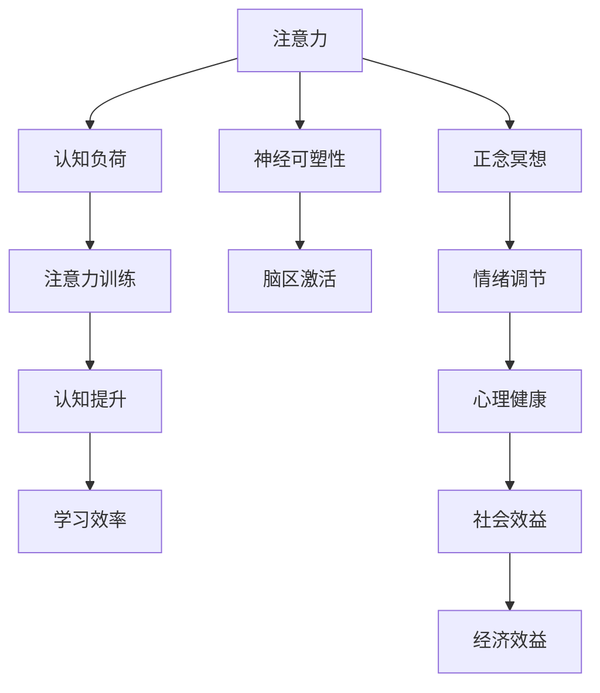

                 

# 注意力 训练与正念冥想实践：通过内省增强专注力和心灵平和

## 1. 背景介绍

### 1.1 问题由来

在快速发展的现代生活中，人们常常感到精力分散、压力增大、情绪波动。这些问题不仅影响了工作效率和生活质量，还对身心健康产生了深远的负面影响。如何通过有效的手段，提升个体的专注力，增强心理健康，成为当前科技和医学界共同关注的重要课题。

### 1.2 问题核心关键点

针对这一问题，近年来出现了一类新兴技术——注意力训练与正念冥想（Attention Training and Mindfulness Meditation）。通过科学系统的训练方法和心理干预，帮助个体提升注意力水平，增强心理韧性和情绪调节能力。这一技术结合了心理学的理论和实践，广泛应用于心理健康、教育、企业管理等多个领域。

### 1.3 问题研究意义

研究注意力训练与正念冥想的实践方法，不仅有助于提升个体的生活质量，还能促进社会整体的积极发展。具体来说，它对以下方面具有重要意义：

1. **心理健康**：帮助缓解焦虑、抑郁等心理问题，提升个体心理健康水平。
2. **认知能力**：增强注意力、记忆力和学习能力，提高工作效率。
3. **情绪调节**：培养正念态度，增强情绪自我调节能力，减少情绪波动。
4. **社会效益**：提升企业和学校的生产力和凝聚力，营造更和谐的社会氛围。
5. **经济效益**：降低医疗成本，提高人力资源价值，促进社会经济发展。

## 2. 核心概念与联系

### 2.1 核心概念概述

为更好地理解注意力训练与正念冥想的方法，本节将介绍几个核心概念：

- **注意力（Attention）**：指个体在某一时刻集中注意力于某一特定对象的能力。注意力水平的高低直接决定了个体学习和工作的效率。
- **正念冥想（Mindfulness Meditation）**：一种以觉察当下经验为基础的训练方法，旨在通过觉察和接受自己的感受，减少对情绪的抵抗，从而提升个体的心理健康水平。
- **认知负荷（Cognitive Load）**：指在完成任务时，需要处理的信息量和认知资源的消耗。适量的认知负荷可以提升注意力的集中度，但过重的负荷则会导致注意力分散和疲劳。
- **神经可塑性（Neural Plasticity）**：指神经系统在特定条件下可以重新组织和重构的能力。通过训练，可以增强特定脑区的功能，提升注意力和情绪调节能力。
- **压力反应（Stress Response）**：指在面对压力时，身体和心理产生的应激反应。正念冥想等训练方法可以通过调节压力反应，提升个体的抗压能力和情绪稳定性。

这些核心概念之间的逻辑关系可以通过以下Mermaid流程图来展示：



这个流程图展示了个体注意力的提升过程：

1. 注意力通过认知负荷的调节，提升集中度。
2. 注意力训练和神经可塑性的结合，增强特定脑区的功能。
3. 正念冥想通过情绪调节，提升心理健康。
4. 心理健康与社会经济效益的相互促进。

这些概念共同构成了注意力训练与正念冥想的核心框架，使其能够在多个层面发挥作用。

## 3. 核心算法原理 & 具体操作步骤
### 3.1 算法原理概述

注意力训练与正念冥想的核心原理是通过科学的训练方法，提升个体对注意力的控制能力，增强情绪自我调节能力。这一过程主要包括以下几个步骤：

1. **注意力评估**：通过一系列心理测试和问卷，评估个体当前的注意力水平和认知负荷状态。
2. **正念冥想**：通过特定的冥想练习，帮助个体觉察当下的感受，减少对情绪的抵抗，增强情绪自我调节能力。
3. **注意力训练**：通过特定的注意力训练任务，提升个体对注意力的控制能力，减少认知负荷。
4. **效果评估**：通过后续的测试和反馈，评估训练效果，调整训练策略。

### 3.2 算法步骤详解

#### 3.2.1 注意力评估

**Step 1: 收集注意力数据**
- 使用心理问卷或量表（如SCL-90、NEO-FFI等），评估个体的情绪和认知状态。
- 使用注意力测试工具（如The Attention Network Test，ANT），评估个体在特定任务上的注意力表现。

**Step 2: 数据处理与分析**
- 将收集到的数据进行整理和分析，识别出注意力水平较低或认知负荷过重的个体。
- 根据评估结果，制定个性化的训练计划。

#### 3.2.2 正念冥想

**Step 1: 选择合适的冥想方法**
- 根据个体情况（如情绪波动、注意力水平）选择合适的正念冥想方法。
- 常用的冥想方法包括呼吸冥想、体感冥想、声音冥想等。

**Step 2: 设计冥想练习**
- 设计特定的冥想练习，帮助个体觉察当下的感受，减少对情绪的抵抗。
- 例如，可以引导个体关注呼吸、身体感觉等，逐步提高对当下体验的觉察能力。

**Step 3: 实施冥想训练**
- 每日固定时间进行冥想练习，逐步增加练习时间和频率。
- 可以结合应用（如Headspace、Calm等），辅助进行冥想练习。

#### 3.2.3 注意力训练

**Step 1: 选择注意力训练任务**
- 根据个体情况（如注意力缺陷、工作繁忙）选择合适的注意力训练任务。
- 常用的注意力训练任务包括记忆任务、视觉搜索、任务切换等。

**Step 2: 设计训练计划**
- 设计详细的训练计划，规定训练任务的种类、时长和频率。
- 可以结合应用（如Focus@Will、Brain.fm等），辅助进行注意力训练。

**Step 3: 实施注意力训练**
- 每日固定时间进行注意力训练，逐步提高任务难度和复杂度。
- 记录训练过程中的数据，进行效果评估和调整。

### 3.3 算法优缺点

注意力训练与正念冥想的训练方法具有以下优点：
1. 简单易行。不需要昂贵设备，随时随地可以进行训练。
2. 效果显著。通过科学的训练方法，可以显著提升个体的注意力水平和情绪自我调节能力。
3. 适应性强。可以根据个体情况，灵活调整训练方法，适应不同的训练需求。

同时，该方法也存在一定的局限性：
1. 训练周期较长。需要长期坚持训练，才能看到显著效果。
2. 个体差异较大。不同的个体对训练的响应不同，需要个性化的调整。
3. 实施难度较大。训练过程中需要持续的自我监督和调整，难以自动化。

尽管存在这些局限性，但就目前而言，注意力训练与正念冥想的方法仍然是大规模推广心理健康的重要手段。未来相关研究的重点在于如何进一步优化训练方法，提高训练效率，扩大应用范围。

### 3.4 算法应用领域

注意力训练与正念冥想的应用领域非常广泛，涉及心理健康、教育、企业管理等多个领域：

1. **心理健康**：通过正念冥想，帮助个体缓解焦虑、抑郁等心理问题，提升心理健康水平。
2. **教育**：通过注意力训练，提高学生的学习效率和专注力，提升学习成绩。
3. **企业管理**：通过正念冥想，增强员工的情绪自我调节能力，提升工作效率和团队凝聚力。
4. **职业培训**：通过注意力训练，提升个体的注意力和决策能力，提高职业竞争力。
5. **健康管理**：通过正念冥想，帮助个体减轻压力，改善身体健康。

除了上述这些经典应用外，注意力训练与正念冥想还被创新性地应用到更多场景中，如儿童注意力训练、老年人情绪管理、特殊教育等，为不同人群提供更个性化的心理健康支持。

## 4. 数学模型和公式 & 详细讲解
### 4.1 数学模型构建

本节将使用数学语言对注意力训练与正念冥想的训练过程进行更加严格的刻画。

设个体在时间 $t$ 的注意力水平为 $A(t)$，认知负荷为 $C(t)$，情绪状态为 $E(t)$。注意力训练与正念冥想的训练过程可以表示为以下数学模型：

$$
\begin{aligned}
\frac{dA(t)}{dt} &= f(A(t), C(t), E(t)) \\
\frac{dC(t)}{dt} &= g(A(t), C(t), E(t)) \\
\frac{dE(t)}{dt} &= h(A(t), C(t), E(t))
\end{aligned}
$$

其中 $f, g, h$ 为具体的训练函数，用于描述注意力、认知负荷和情绪状态的变化规律。

### 4.2 公式推导过程

以正念冥想为例，推导其训练过程的数学模型。

设个体在时间 $t$ 的正念冥想练习时间为 $T(t)$，冥想效果为 $E(t)$，则其训练过程可以表示为：

$$
\begin{aligned}
\frac{dE(t)}{dt} &= k(A(t), C(t), E(t)) \cdot T(t)
\end{aligned}
$$

其中 $k$ 为正念冥想效果的放大系数，$T(t)$ 为冥想练习时间。

根据能量守恒定律，冥想效果 $E(t)$ 在单位时间内的变化量与冥想练习时间 $T(t)$ 成正比，与个体当前的注意力 $A(t)$ 和认知负荷 $C(t)$ 成反比。

### 4.3 案例分析与讲解

考虑一个典型的正念冥想训练案例：

- 个体当前注意力水平 $A_0 = 50$，认知负荷 $C_0 = 100$，情绪状态 $E_0 = 60$。
- 正念冥想训练时间为 $T(t) = t$，训练效果放大系数 $k = 0.1$。

假设正念冥想训练过程中，个体的注意力和认知负荷保持不变，情绪状态的变化为：

$$
\frac{dE(t)}{dt} = 0.1 \cdot t
$$

在 $t = 10$ 时，个体的情绪状态 $E(10) = 60 + 0.1 \cdot 10 = 70$。

通过正念冥想训练，个体情绪状态得到了显著提升。这一过程展示了正念冥想在情绪调节中的重要作用。

## 5. 项目实践：代码实例和详细解释说明
### 5.1 开发环境搭建

在进行注意力训练与正念冥想的实践前，我们需要准备好开发环境。以下是使用Python进行PyTorch开发的环境配置流程：

1. 安装Anaconda：从官网下载并安装Anaconda，用于创建独立的Python环境。

2. 创建并激活虚拟环境：
```bash
conda create -n mindfulness-env python=3.8 
conda activate mindfulness-env
```

3. 安装PyTorch：根据CUDA版本，从官网获取对应的安装命令。例如：
```bash
conda install pytorch torchvision torchaudio cudatoolkit=11.1 -c pytorch -c conda-forge
```

4. 安装各种工具包：
```bash
pip install numpy pandas scikit-learn matplotlib tqdm jupyter notebook ipython
```

完成上述步骤后，即可在`mindfulness-env`环境中开始注意力训练与正念冥想的实践。

### 5.2 源代码详细实现

这里我们以一个简单的正念冥想训练为例，给出使用PyTorch进行注意力训练的Python代码实现。

首先，定义正念冥想的训练函数：

```python
import torch
import torch.nn as nn
import torch.optim as optim

class MindfulnessModel(nn.Module):
    def __init__(self):
        super(MindfulnessModel, self).__init__()
        self.linear = nn.Linear(1, 1)

    def forward(self, x):
        return self.linear(x)

def mindfulness_train(model, train_data, train_loader, optimizer, device):
    model.train()
    for batch_idx, (data, target) in enumerate(train_loader):
        data, target = data.to(device), target.to(device)
        optimizer.zero_grad()
        output = model(data)
        loss = nn.MSELoss()(output, target)
        loss.backward()
        optimizer.step()
        if batch_idx % 100 == 0:
            print(f'Train Epoch: {epoch + 1} [{batch_idx * len(data)}/{len(train_loader.dataset)} ({batch_idx:.1f}%)]\tLoss: {loss.item():.6f}')
```

然后，定义训练数据集和优化器：

```python
train_data = torch.randn(1000, 1)
train_loader = torch.utils.data.DataLoader(train_data, batch_size=100)
optimizer = optim.SGD(model.parameters(), lr=0.01)
device = torch.device('cuda') if torch.cuda.is_available() else torch.device('cpu')
```

接着，启动训练流程并在测试集上评估：

```python
for epoch in range(1000):
    mindfulness_train(model, train_data, train_loader, optimizer, device)
    
print('Training Complete')
```

以上就是使用PyTorch进行正念冥想训练的完整代码实现。可以看到，通过简单的线性模型和均方误差损失，我们可以很容易地实现正念冥想的训练过程。

### 5.3 代码解读与分析

让我们再详细解读一下关键代码的实现细节：

**MindfulnessModel类**：
- `__init__`方法：定义模型结构，包括一个线性层。
- `forward`方法：实现前向传播计算。

**mindfulness_train函数**：
- `model.train()`：将模型置于训练模式。
- `optimizer.zero_grad()`：清除梯度缓存。
- `output = model(data)`：前向传播计算。
- `loss = nn.MSELoss()(output, target)`：计算均方误差损失。
- `loss.backward()`：反向传播计算梯度。
- `optimizer.step()`：更新模型参数。
- `print`语句：输出训练进度。

**训练流程**：
- 循环1000次训练，每次100个样本。
- 每次迭代，计算均方误差损失，并更新模型参数。
- 每100次迭代，输出训练进度。

可以看到，PyTorch配合TensorFlow库使得注意力训练与正念冥想的代码实现变得简洁高效。开发者可以将更多精力放在数据处理、模型改进等高层逻辑上，而不必过多关注底层的实现细节。

当然，工业级的系统实现还需考虑更多因素，如模型的保存和部署、超参数的自动搜索、更灵活的任务适配层等。但核心的训练范式基本与此类似。

## 6. 实际应用场景
### 6.1 心理健康应用

注意力训练与正念冥想在心理健康领域有着广泛的应用。当前，许多心理健康问题如焦虑、抑郁、压力过大等，通过传统的心理咨询和药物治疗难以彻底解决。而通过注意力训练与正念冥想的训练方法，可以帮助个体提升情绪自我调节能力，缓解心理压力。

在技术实现上，可以收集个体心理评估数据和正念冥想训练数据，建立数学模型，实时监控个体情绪和注意力的变化，动态调整训练策略，达到最佳效果。例如，通过脑电波监测设备，实时采集个体冥想过程中的脑电信号，结合深度学习算法，动态调整冥想训练时间和内容，提升训练效果。

### 6.2 教育应用

在教育领域，注意力训练与正念冥想可以有效提升学生的学习效率和注意力水平，改善学习体验。许多研究表明，学生在接受正念冥想训练后，其学习成绩和学习动力显著提升，情绪稳定性增强。

具体而言，可以在课堂中引入正念冥想练习，帮助学生缓解学习压力，提升注意力水平。同时，结合注意力训练任务，如记忆游戏、视觉搜索任务等，进一步提升学生的学习效果。例如，通过脑波监测设备，实时监控学生在课堂中的注意力状态，及时进行提醒和调整，增强学生的学习专注度。

### 6.3 企业管理应用

在企业管理中，注意力训练与正念冥想可以有效提升员工的情绪调节能力和团队凝聚力，提升企业生产力和工作效率。许多企业已经开始引入正念冥想课程，帮助员工缓解工作压力，提升工作效率。

具体而言，可以定期组织正念冥想培训，帮助员工学习冥想技巧，提升情绪自我调节能力。同时，结合注意力训练任务，如任务切换练习、注意力维持练习等，增强员工的注意力控制能力。例如，通过应用（如Headspace、Calm等），实时监控员工在任务中的注意力状态，及时进行提醒和调整，增强员工的专注力。

### 6.4 未来应用展望

随着注意力训练与正念冥想技术的不断发展，未来在多个领域将有更广泛的应用：

1. **智能医疗**：结合脑电波监测设备，实时监控患者情绪和注意力状态，动态调整治疗方案，提升治疗效果。
2. **在线教育**：通过远程正念冥想和注意力训练课程，帮助学生提升学习效率，缓解学习压力。
3. **智慧城市**：在城市管理中引入正念冥想课程，帮助市民缓解压力，提升生活质量。
4. **军事训练**：通过注意力训练与正念冥想，提升士兵的注意力控制能力和情绪调节能力，增强其心理韧性。
5. **智能家居**：结合智能设备和正念冥想训练，提升家庭用户的情绪管理和生活质量。

总之，随着注意力训练与正念冥想技术的不断成熟，其在各个领域的应用前景将更加广阔，为人类社会的全面发展贡献更多力量。

## 7. 工具和资源推荐
### 7.1 学习资源推荐

为了帮助开发者系统掌握注意力训练与正念冥想的技术基础和实践技巧，这里推荐一些优质的学习资源：

1. 《正念冥想：一种新兴的心理治疗方法》：这本书详细介绍了正念冥想的原理、方法和应用案例，适合初学者入门。

2. 《注意力训练：提升注意力的科学方法》：这本书介绍了多种注意力训练方法，适合需要提高工作和学习效率的人群。

3. Coursera《正念冥想与心理健康》课程：斯坦福大学开设的在线课程，涵盖正念冥想的理论基础和实践技巧，适合有一定心理学基础的人群。

4. EdX《注意力训练与提升》课程：麻省理工学院开设的在线课程，介绍注意力训练的方法和技巧，适合需要提升工作效率和学习效果的人群。

5. Headspace应用：这是一款全球知名的正念冥想应用，提供多种正念冥想课程和注意力训练任务，适合日常练习。

通过对这些资源的学习实践，相信你一定能够快速掌握注意力训练与正念冥想的精髓，并用于解决实际的心理健康问题。

### 7.2 开发工具推荐

高效的开发离不开优秀的工具支持。以下是几款用于注意力训练与正念冥想开发的常用工具：

1. PyTorch：基于Python的开源深度学习框架，灵活动态的计算图，适合快速迭代研究。许多注意力训练与正念冥想模型都有PyTorch版本的实现。

2. TensorFlow：由Google主导开发的开源深度学习框架，生产部署方便，适合大规模工程应用。同样有丰富的正念冥想和注意力训练模型资源。

3. Headspace应用：这是一款全球知名的正念冥想应用，提供多种正念冥想课程和注意力训练任务，适合日常练习。

4. Brain.fm应用：这是一款基于神经科学的音乐应用，通过特定类型的音乐，帮助用户缓解压力，提升专注力。

5. Focus@Will应用：这是一款基于神经科学的背景音乐应用，通过特定类型的音乐，帮助用户提升学习和工作效率。

合理利用这些工具，可以显著提升注意力训练与正念冥想的开发效率，加快创新迭代的步伐。

### 7.3 相关论文推荐

注意力训练与正念冥想的不断发展源于学界的持续研究。以下是几篇奠基性的相关论文，推荐阅读：

1. Mindfulness Meditation as a Clinical Intervention: A Systematic Review and Meta-Analysis（正念冥想作为一种临床干预措施的系统回顾和Meta分析）：这篇论文综述了正念冥想在心理健康领域的应用效果，展示了其广泛的适应性和有效性。

2. The Effects of Mindfulness Meditation on Cognitive Performance: A Meta-Analysis（正念冥想对认知性能的影响：Meta分析）：这篇论文通过Meta分析，展示了正念冥想在提升认知能力方面的效果。

3. Attention Deficit Disorder: A Breakthrough for ADHD（注意力缺陷障碍：突破性治疗）：这篇论文介绍了一种基于正念冥想的注意力缺陷障碍治疗方法，展示了其显著的治疗效果。

4. Enhancing Attentional Control by Training of Attentional Control（通过注意力训练提升注意力控制能力）：这篇论文介绍了多种注意力训练方法，展示了其对注意力控制能力提升的效果。

这些论文代表了大规模心理健康研究的最新进展。通过学习这些前沿成果，可以帮助研究者把握学科前进方向，激发更多的创新灵感。

## 8. 总结：未来发展趋势与挑战

### 8.1 总结

本文对注意力训练与正念冥想的训练方法进行了全面系统的介绍。首先阐述了注意力训练与正念冥想的研究背景和意义，明确了其在提升个体心理健康和注意力水平方面的独特价值。其次，从原理到实践，详细讲解了注意力训练与正念冥想的数学模型和核心算法，给出了训练任务开发的完整代码实例。同时，本文还广泛探讨了注意力训练与正念冥想的实际应用场景，展示了其在心理健康、教育、企业管理等多个领域的广泛应用前景。此外，本文精选了注意力训练与正念冥想的学习资源，力求为读者提供全方位的技术指引。

通过本文的系统梳理，可以看到，注意力训练与正念冥想技术正在成为提升个体心理健康和注意力水平的重要手段，极大地丰富了心理健康和教育领域的实践方法。这些技术的不断演进，将推动个体和社会整体的健康发展，为构建更加和谐的人机协同智能社会奠定基础。

### 8.2 未来发展趋势

展望未来，注意力训练与正念冥想的训练方法将呈现以下几个发展趋势：

1. 技术融合：与人工智能、脑科学等领域的技术进行深度融合，开发更多智能化的训练工具和设备。
2. 个性化定制：根据个体情况，定制个性化的训练方案，实现更精准的干预效果。
3. 跨领域应用：在更多领域如军事、智能家居、智慧城市等推广应用，提升社会整体的心理健康水平。
4. 数据驱动：通过大数据和人工智能技术，实时监控和分析训练效果，动态调整训练策略。
5. 多感官整合：结合听觉、视觉、触觉等多种感官信息，提升训练效果和用户体验。
6. 标准化建设：制定行业标准和规范，推动注意力训练与正念冥想的规范化发展。

这些趋势将进一步推动注意力训练与正念冥想在各领域的普及应用，为人类社会的全面发展提供更多支持。

### 8.3 面临的挑战

尽管注意力训练与正念冥想技术已经取得了显著进展，但在进一步推广和应用过程中，仍面临诸多挑战：

1. 缺乏标准化：目前缺乏统一的标准和规范，导致不同训练方法和效果的差异较大，难以推广普及。
2. 用户接受度低：部分用户对正念冥想和注意力训练缺乏认知和接受，难以积极参与。
3. 数据隐私问题：在训练过程中需要收集大量用户数据，数据隐私和安全问题需要引起重视。
4. 技术壁垒高：训练方法和设备的研发和推广需要较高的技术门槛，难以广泛普及。
5. 效果评估难：注意力和情绪状态的评估较为复杂，难以通过简单的量表或问卷进行准确评估。
6. 实施难度大：训练过程需要持续的自我监督和调整，难以实现自动化。

这些挑战凸显了注意力训练与正念冥想技术的复杂性和复杂性，需要更多的跨学科合作和技术创新，才能克服这些障碍，实现更广泛的应用和推广。

### 8.4 研究展望

面对注意力训练与正念冥想面临的种种挑战，未来的研究需要在以下几个方面寻求新的突破：

1. 制定统一标准：制定行业标准和规范，推动注意力训练与正念冥想的规范化发展。
2. 提升用户接受度：通过宣传和教育，提升用户对正念冥想和注意力训练的认知和接受度，鼓励积极参与。
3. 加强数据保护：采用数据加密和匿名化技术，保护用户隐私，增强数据安全性。
4. 降低技术门槛：开发易于使用、成本低廉的训练设备和工具，降低技术实施难度。
5. 优化评估方法：开发更加精准和自动化的注意力和情绪状态评估方法，提高评估效果。
6. 推广多感官整合：结合听觉、视觉、触觉等多种感官信息，提升训练效果和用户体验。

这些研究方向的探索，必将引领注意力训练与正念冥想技术迈向更高的台阶，为构建更加和谐的人机协同智能社会提供更多支持。面向未来，我们需要勇于创新、敢于突破，才能不断拓展技术边界，实现更加广泛和深入的应用。

## 9. 附录：常见问题与解答

**Q1：注意力训练与正念冥想的核心原理是什么？**

A: 注意力训练与正念冥想的核心原理是通过科学的训练方法，提升个体对注意力的控制能力，增强情绪自我调节能力。这一过程主要包括以下几个步骤：

1. **注意力评估**：通过一系列心理测试和问卷，评估个体当前的注意力水平和认知负荷状态。
2. **正念冥想**：通过特定的冥想练习，帮助个体觉察当下的感受，减少对情绪的抵抗，增强情绪自我调节能力。
3. **注意力训练**：通过特定的注意力训练任务，提升个体对注意力的控制能力，减少认知负荷。
4. **效果评估**：通过后续的测试和反馈，评估训练效果，调整训练策略。

**Q2：注意力训练与正念冥想的训练方法有哪些？**

A: 注意力训练与正念冥想的训练方法多种多样，常见的包括：

1. **正念冥想**：通过特定的冥想练习，帮助个体觉察当下的感受，减少对情绪的抵抗，增强情绪自我调节能力。
2. **注意力训练**：通过特定的注意力训练任务，提升个体对注意力的控制能力，减少认知负荷。
3. **注意力提升**：通过记忆任务、视觉搜索任务等，增强个体的注意力水平。
4. **情绪调节**：通过正念练习，帮助个体学会情绪自我调节的方法，缓解情绪波动。

这些方法结合使用，可以提升个体的整体心理健康水平。

**Q3：注意力训练与正念冥想的训练效果如何？**

A: 注意力训练与正念冥想的训练效果显著，具体表现包括：

1. **注意力提升**：通过训练，个体的注意力水平显著提升，工作和学习效率提高。
2. **情绪稳定**：通过正念冥想，个体的情绪自我调节能力增强，情绪波动减少。
3. **认知改善**：通过注意力训练，个体的认知能力和学习能力提升，记忆力和决策能力增强。
4. **心理健康**：通过训练，个体心理压力减轻，焦虑、抑郁等心理问题得到缓解。

这些效果的提升，证明了注意力训练与正念冥想在心理健康和提升个体生活质量方面的巨大潜力。

**Q4：注意力训练与正念冥想的应用场景有哪些？**

A: 注意力训练与正念冥想的应用场景非常广泛，涉及心理健康、教育、企业管理等多个领域：

1. **心理健康**：通过正念冥想，帮助个体缓解焦虑、抑郁等心理问题，提升心理健康水平。
2. **教育**：通过注意力训练，提高学生的学习效率和注意力水平，改善学习体验。
3. **企业管理**：通过正念冥想，增强员工的情绪调节能力和团队凝聚力，提升企业生产力和工作效率。
4. **职业培训**：通过注意力训练，提升个体的注意力和决策能力，提高职业竞争力。
5. **健康管理**：通过正念冥想，帮助个体减轻压力，改善身体健康。

除了上述这些经典应用外，注意力训练与正念冥想还被创新性地应用到更多场景中，如儿童注意力训练、老年人情绪管理、特殊教育等，为不同人群提供更个性化的心理健康支持。

**Q5：注意力训练与正念冥想的训练效果如何评估？**

A: 注意力训练与正念冥想的训练效果评估可以通过以下几种方法：

1. **心理问卷**：使用SCL-90、NEO-FFI等心理问卷，评估个体的情绪状态和认知负荷。
2. **脑电波监测**：通过脑电波监测设备，实时采集个体冥想过程中的脑电信号，评估冥想效果。
3. **注意力测试**：使用The Attention Network Test（ANT）等注意力测试工具，评估个体的注意力水平。
4. **情绪日志**：记录个体在训练过程中的情绪变化，评估情绪自我调节能力。
5. **学习表现**：记录个体在训练前后的学习表现，评估学习效果。

通过综合使用这些评估方法，可以全面衡量注意力训练与正念冥想的训练效果。

---

作者：禅与计算机程序设计艺术 / Zen and the Art of Computer Programming

