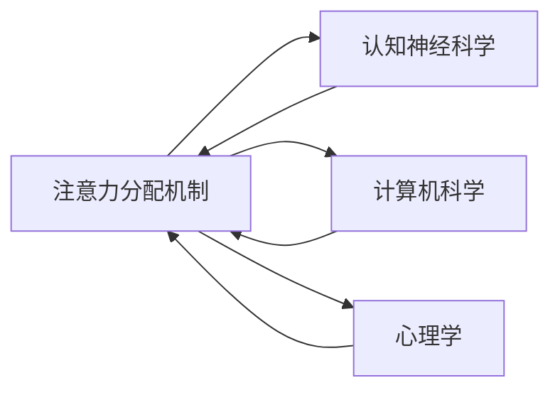

                 

# 注意力分配:元宇宙时代的个人效能管理

在元宇宙的宏伟蓝图中，人类将跨足虚拟空间，进行无缝连接与协作。这一切的实现，离不开注意力分配机制的强大支撑。然而，在元宇宙时代，如何更高效地管理和优化个人注意力，成为了个人效能提升的新命题。本文深入探讨注意力分配的核心概念、算法原理、操作步骤，并结合项目实践、应用场景、工具和资源推荐，全面阐述元宇宙时代个人效能管理的要点和策略。

## 1. 背景介绍

### 1.1 问题由来

随着元宇宙概念的火热，我们即将进入一个全新的时代，人类不仅存在于现实世界，而且将在数字世界中有更多的存在感。虚拟空间、虚拟工作、虚拟社交、虚拟娱乐等将成为日常生活的重要组成部分。在这样的大背景下，个人如何在元宇宙中保持高效、富有成效，是当前急需解决的关键问题。

### 1.2 问题核心关键点

1. **注意力分散**：在元宇宙环境中，信息流无时无刻不在干扰我们的注意力，导致我们的工作和学习效率降低。
2. **多任务管理**：元宇宙时代，我们将同时进行虚拟和现实世界的多任务操作，如何高效地切换和管理这些任务，成为了一个重要课题。
3. **实时互动**：元宇宙是高度实时互动的空间，如何在保持高互动性的同时，保持个人注意力的集中，是一个新的挑战。
4. **个性化需求**：每个人在元宇宙中的需求和偏好不同，如何根据个体差异进行个性化注意力分配管理，提升用户满意度。
5. **安全与隐私**：元宇宙的开放性和虚拟性使得安全与隐私问题变得复杂，如何在这其中进行有效的注意力管理，保障个人隐私安全。

### 1.3 问题研究意义

在元宇宙时代，注意力分配不仅关乎个人的工作效率和生产力，还影响到个人的健康、心理健康以及生活质量。通过系统地研究注意力分配管理，我们可以构建更高效、更有序的虚拟生活和工作环境，保障元宇宙时代的生产力与创造力。同时，注意力分配研究对于提升元宇宙应用的用户体验，推动元宇宙技术的应用与普及，具有重要意义。

## 2. 核心概念与联系

### 2.1 核心概念概述

注意力分配在元宇宙时代尤为重要，它涉及到了认知神经科学、计算机科学、心理学等多个领域的交叉。以下是几个核心概念：

- **注意力 (Attention)**：大脑对环境刺激的选择性响应过程，是个体信息处理的核心机制。
- **多任务处理 (Multitasking)**：同时进行多项任务，需要良好的注意力分配和切换能力。
- **认知负荷 (Cognitive Load)**：个体在执行任务时的心理负担，影响注意力分配的有效性。
- **交互式界面 (Interactive Interface)**：元宇宙中高度互动的虚拟界面，对注意力分配有显著影响。
- **时间管理 (Time Management)**：优化时间分配，提升个人效能的重要手段。

### 2.2 核心概念原理和架构的 Mermaid 流程图



这个流程图展示了注意力分配的核心概念与各学科之间的联系。认知神经科学关注注意力在大脑中的生理机制；计算机科学专注于如何通过算法实现高效注意力管理；心理学则探讨如何从用户心理出发，优化注意力分配。

## 3. 核心算法原理 & 具体操作步骤

### 3.1 算法原理概述

在元宇宙时代，注意力分配管理可以基于多种算法原理，主要包括：

- **模型驱动 (Model-driven)**：通过构建认知模型，模拟注意力分配过程，如各种注意力模型。
- **数据驱动 (Data-driven)**：通过大量用户行为数据，学习最优的注意力分配策略，如强化学习。
- **混合方法 (Hybrid Approach)**：结合模型驱动和数据驱动，既利用模型仿真，又通过实际数据反馈不断优化。

### 3.2 算法步骤详解

注意力分配管理的步骤可以概括为以下几个方面：

1. **收集数据**：通过元宇宙平台收集用户的行为数据，如操作时间、切换任务频率、使用频率等。
2. **构建模型**：基于收集的数据，选择合适的模型，构建注意力分配的预测模型，如RNN、LSTM、Transformer等。
3. **训练模型**：利用数据驱动的方法，训练模型，找出最优的注意力分配策略。
4. **评估与优化**：通过实际应用反馈，评估模型效果，不断优化模型参数。
5. **实施与调整**：将模型应用于元宇宙平台，实时监控效果，并根据反馈进行调整。

### 3.3 算法优缺点

**优点**：

- **个性化适应**：能够根据个体差异进行个性化管理，提升用户体验。
- **实时优化**：实时监控和调整，适应环境变化，提升效率。
- **跨平台应用**：适用于虚拟和现实环境，具备通用性。

**缺点**：

- **数据隐私**：大量数据收集和处理可能涉及隐私问题，需要确保数据安全。
- **算法复杂度**：训练和优化复杂模型需要较大的计算资源和时间。
- **用户适应性**：模型需要与用户进行交互，才能逐步适应，初期效果可能不佳。

### 3.4 算法应用领域

注意力分配管理的应用领域广泛，包括但不限于以下方面：

- **虚拟工作**：在虚拟办公环境中，进行任务分配与切换。
- **虚拟学习**：在虚拟教室中，进行学习任务与资源管理。
- **虚拟社交**：在虚拟社交平台，进行互动管理与关系维护。
- **虚拟娱乐**：在虚拟游戏与虚拟世界中，进行体验优化与任务调度。
- **虚拟健康**：在虚拟健康应用中，进行康复训练与心理支持。

## 4. 数学模型和公式 & 详细讲解 & 举例说明

### 4.1 数学模型构建

注意力分配管理可以构建如下数学模型：

$$
\text{Attention} = f(\text{Context}, \text{Cognitive Load}, \text{Interaction Interface})
$$

其中，$f$ 为函数，$\text{Context}$ 为任务环境上下文，$\text{Cognitive Load}$ 为认知负荷，$\text{Interaction Interface}$ 为交互界面。

### 4.2 公式推导过程

注意力分配模型的推导基于认知心理学和神经科学的研究成果，如“双任务处理模型”。以下公式描述了注意力分配的基本行为：

$$
\text{Attention}_{t+1} = \alpha \times \text{Attention}_t + \beta \times \text{Reinforcement}_t + \gamma \times \text{External Stimulus}_t
$$

其中：

- $\text{Attention}_t$：当前时间点的注意力分配情况。
- $\text{Reinforcement}_t$：任务完成后的强化信号。
- $\text{External Stimulus}_t$：外界刺激因素。
- $\alpha, \beta, \gamma$：模型参数。

### 4.3 案例分析与讲解

以虚拟工作为例，用户需要同时处理多个任务，如会议、文档编辑、邮件回复等。根据公式，注意力分配情况可以表示为：

- $\text{Context}$：当前会议的讨论主题、文档编辑的内容、邮件回复的对象。
- $\text{Cognitive Load}$：当前任务的工作量、用户的疲劳程度、任务切换频率。
- $\text{Interaction Interface}$：会议界面、编辑界面、邮件界面的交互特性。

通过模型计算，可以实时调整用户的注意力分配，确保每个任务都能得到合理的关注。

## 5. 项目实践：代码实例和详细解释说明

### 5.1 开发环境搭建

开发环境搭建需要以下步骤：

1. **安装编程语言**：如Python，需要安装相关依赖库，如Numpy、Pandas、Scikit-learn等。
2. **搭建模型环境**：可以使用PyTorch、TensorFlow等深度学习框架，搭建注意力分配模型。
3. **数据收集工具**：可以使用TensorBoard、Weights & Biases等工具，进行数据监控和实验跟踪。

### 5.2 源代码详细实现

以下是基于TensorFlow构建注意力分配模型的示例代码：

```python
import tensorflow as tf
from tensorflow.keras import layers

# 定义注意力分配模型
class AttentionModel(tf.keras.Model):
    def __init__(self):
        super(AttentionModel, self).__init__()
        self.layers = layers.Sequential(
            layers.Dense(64, activation='relu'),
            layers.Dense(64, activation='relu'),
            layers.Dense(1, activation='sigmoid')
        )
    
    def call(self, inputs):
        return self.layers(inputs)

# 加载数据
data = # 用户行为数据

# 构建模型
model = AttentionModel()

# 训练模型
optimizer = tf.keras.optimizers.Adam(learning_rate=0.001)
model.compile(optimizer=optimizer, loss='binary_crossentropy')
model.fit(data, labels, epochs=100, batch_size=32)

# 使用模型
new_data = # 新的用户行为数据
attention_score = model.predict(new_data)
```

### 5.3 代码解读与分析

该代码定义了一个简单的注意力分配模型，包含三个全连接层，用于模拟注意力分配行为。模型训练时，使用Adam优化器进行优化，损失函数为二元交叉熵，适合分类任务。训练完毕后，可以使用模型对新的用户行为数据进行预测，输出注意力分配分数。

### 5.4 运行结果展示

运行上述代码，可以得到训练后模型的预测结果。例如，当输入的数据为一个用户在高负荷工作环境中的行为数据，模型可能输出一个较低的注意力分配分数，表示该用户当前需要更多的注意力休息。

## 6. 实际应用场景

### 6.1 虚拟工作

在虚拟工作环境中，注意力分配管理尤为重要。以下场景可以应用注意力分配：

- **任务调度**：自动调整任务优先级，确保重要任务得到及时处理。
- **会议管理**：实时监控会议参与度，动态调整参与者的注意力分配。
- **文档编辑**：优化文档编辑过程，避免频繁切换任务导致效率降低。

### 6.2 虚拟学习

虚拟学习中，注意力分配管理可以提升学习效果：

- **学习计划制定**：根据学习内容难度、用户认知负荷，动态调整学习计划。
- **资源推荐**：根据用户兴趣和注意力，推荐适合的课程和资料。
- **互动监控**：实时监控互动行为，提升学习参与度。

### 6.3 虚拟社交

在虚拟社交平台，通过注意力分配管理，可以提升社交体验：

- **关系维护**：智能推荐与维护社交关系，增加用户的粘性。
- **互动优化**：优化用户互动，提升社交质量。
- **心理支持**：通过注意力分配管理，减轻用户心理负担，提升心理健康。

### 6.4 虚拟娱乐

虚拟娱乐中，注意力分配管理可以增强体验：

- **游戏任务分配**：合理分配游戏任务，提升游戏体验。
- **虚拟环境互动**：优化虚拟环境的互动体验，增加用户沉浸感。
- **个性化推荐**：根据用户注意力，推荐个性化的虚拟体验内容。

### 6.5 虚拟健康

在虚拟健康应用中，注意力分配管理可以辅助康复训练：

- **康复计划制定**：根据用户注意力和身体状态，制定个性化康复计划。
- **心理支持**：通过注意力分配管理，减轻用户心理负担，提升心理健康。
- **康复进度监控**：实时监控用户康复进度，及时调整康复计划。

## 7. 工具和资源推荐

### 7.1 学习资源推荐

1. **《Attention is All You Need》**：Transformer论文，介绍了注意力机制的原理和应用。
2. **《Deep Learning》**：Ian Goodfellow等人所著，全面介绍了深度学习的基本概念和算法。
3. **《Reinforcement Learning: An Introduction》**：Richard S. Sutton和Andrew G. Barto所著，介绍了强化学习的理论基础和应用。
4. **Coursera《Deep Learning Specialization》**：Andrew Ng教授开设的深度学习课程，系统讲解深度学习理论与实践。
5. **Coursera《Reinforcement Learning》**：David Silver教授开设的强化学习课程，深入讲解强化学习原理。

### 7.2 开发工具推荐

1. **TensorFlow**：Google开发的深度学习框架，支持多种模型构建和训练。
2. **PyTorch**：Facebook开发的深度学习框架，易于使用，支持动态图构建。
3. **Jupyter Notebook**：开源的交互式计算环境，支持Python、R等多种语言。
4. **TensorBoard**：TensorFlow配套的可视化工具，可实时监控模型训练状态。
5. **Weights & Biases**：模型实验跟踪工具，可记录和可视化模型训练过程中的各项指标。

### 7.3 相关论文推荐

1. **《Multi-task Learning Using Prediction to Attention Mechanism》**：提出了基于注意力机制的多任务学习算法，适用于元宇宙中的任务管理。
2. **《Attention-based Time Management System》**：提出了基于注意力机制的时间管理模型，优化用户的时间分配。
3. **《Reinforcement Learning for Attention Allocation in Virtual Reality》**：提出强化学习模型，用于虚拟现实中的注意力分配。
4. **《Attention-based Personalized Learning System》**：提出基于注意力的个性化学习系统，提升学习效果。
5. **《Attention-based Interactive Interface Design》**：提出基于注意力的交互界面设计方法，提升用户体验。

## 8. 总结：未来发展趋势与挑战

### 8.1 研究成果总结

本文系统介绍了注意力分配在元宇宙时代的重要性，结合数学模型和项目实践，提出了基于注意力分配的个人效能管理方案。重点关注了虚拟工作、学习、社交、娱乐和健康等多个应用场景，提出了具体的实现方法和应用策略。

### 8.2 未来发展趋势

1. **多模态注意力**：未来将结合视觉、听觉等多模态数据，进行更加全面和精准的注意力分配。
2. **实时反馈与调整**：通过实时数据反馈，动态调整注意力分配策略，提升用户体验。
3. **个性化与自适应**：基于个体差异进行个性化优化，提升注意力分配的效果。
4. **跨平台与跨设备**：适用于虚拟和现实环境，具备通用性和跨设备兼容性。
5. **高效算法与模型优化**：不断优化算法与模型，提升注意力分配管理的效率和准确性。

### 8.3 面临的挑战

1. **数据隐私与安全**：大量用户数据的收集和处理可能涉及隐私和安全问题。
2. **算法复杂性与计算资源**：构建和优化复杂的注意力分配模型需要大量的计算资源。
3. **用户体验与接受度**：用户对新系统可能存在一定的接受度问题，需要细致的用户体验设计。
4. **跨领域与多任务处理**：注意力分配管理需要在跨领域和多任务处理中进行平衡和优化。
5. **技术成熟度**：当前的技术成熟度可能尚未完全满足元宇宙应用的需求。

### 8.4 研究展望

未来，在注意力分配管理的研究方向上，可以从以下几个方面进行深入探索：

1. **自适应学习与优化**：结合自适应学习算法，不断优化注意力分配模型，提升用户体验。
2. **多任务与跨领域优化**：结合多任务学习和跨领域迁移学习，提升注意力分配管理的适应性。
3. **融合跨模态信息**：结合视觉、听觉、触觉等多模态数据，进行更加全面和精准的注意力分配。
4. **增强模型的自解释性**：提升模型的可解释性，帮助用户理解和接受注意力分配管理方案。
5. **引入伦理与安全约束**：在模型设计中引入伦理与安全约束，保障用户隐私与数据安全。

## 9. 附录：常见问题与解答

**Q1：注意力分配管理在虚拟环境中如何保证数据隐私与安全？**

A: 在元宇宙环境中，数据隐私和安全是至关重要的。可以通过以下措施来保障数据隐私与安全：
1. **数据加密**：对数据进行加密处理，防止数据泄露。
2. **访问控制**：使用访问控制技术，限制数据的访问权限。
3. **匿名化处理**：对数据进行匿名化处理，防止用户被识别。
4. **安全传输**：使用安全的传输协议，防止数据在传输过程中被篡改或窃取。
5. **定期审计**：定期进行数据审计，确保数据安全。

**Q2：注意力分配管理在虚拟环境中如何提升用户体验？**

A: 在元宇宙环境中，提升用户体验是关键。可以通过以下措施来提升用户体验：
1. **个性化优化**：根据用户行为和偏好，进行个性化优化，提升用户体验。
2. **实时反馈与调整**：通过实时数据反馈，动态调整注意力分配策略，提升用户体验。
3. **界面设计优化**：优化虚拟界面设计，提升用户体验。
4. **交互设计优化**：优化用户交互设计，提升用户体验。
5. **性能优化**：优化系统性能，提升用户体验。

**Q3：注意力分配管理在虚拟环境中如何处理多任务处理问题？**

A: 在元宇宙环境中，多任务处理是一个常见问题。可以通过以下措施来处理多任务处理问题：
1. **优先级管理**：根据任务重要性和紧急程度，进行优先级管理，确保重要任务得到及时处理。
2. **任务分配**：合理分配任务，避免用户同时处理过多任务。
3. **任务切换优化**：优化任务切换过程，减少切换时间，提升效率。
4. **任务反馈**：及时反馈任务完成情况，帮助用户调整任务分配策略。
5. **资源分配**：合理分配资源，确保任务高效完成。

**Q4：注意力分配管理在虚拟环境中如何保障安全与隐私？**

A: 在元宇宙环境中，保障安全与隐私是关键。可以通过以下措施来保障安全与隐私：
1. **数据加密**：对数据进行加密处理，防止数据泄露。
2. **访问控制**：使用访问控制技术，限制数据的访问权限。
3. **匿名化处理**：对数据进行匿名化处理，防止用户被识别。
4. **安全传输**：使用安全的传输协议，防止数据在传输过程中被篡改或窃取。
5. **定期审计**：定期进行数据审计，确保数据安全。

**Q5：注意力分配管理在虚拟环境中如何优化认知负荷？**

A: 在元宇宙环境中，优化认知负荷是提升用户体验的重要措施。可以通过以下措施来优化认知负荷：
1. **任务分配合理**：合理分配任务，避免用户同时处理过多任务。
2. **任务难度适中**：根据用户认知水平，合理设置任务难度。
3. **任务休息机制**：设置合理的任务休息机制，避免用户疲劳。
4. **心理支持**：通过心理支持，减轻用户心理负担，提升用户体验。
5. **实时监控与调整**：实时监控用户认知负荷，动态调整任务分配策略，提升用户体验。

总之，元宇宙时代需要多方位、多层次的注意力分配管理策略，才能确保用户高效、有序地进行虚拟生活和工作。通过系统地研究注意力分配，我们能够在元宇宙中构建更加智能、高效、有序的个人效能管理系统。

