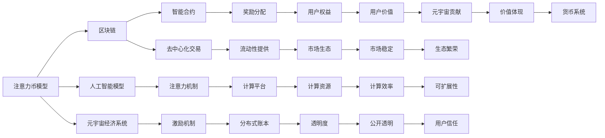

                 

# 注意力币:元宇宙中的新型价值衡量标准

> 关键词：区块链, 元宇宙, 去中心化, 价值衡量, 注意力机制, 跨链

## 1. 背景介绍

随着互联网技术的发展和区块链技术的成熟，元宇宙（Metaverse）的概念逐渐成为全球科技和金融界的热门话题。元宇宙是一个由数字化、虚拟化的数字资产、虚拟物品和虚拟活动组成的交互式在线平台，不仅限于游戏、社交、购物等传统领域，还延伸到教育、娱乐、艺术、工作等各行各业。如何构建一个去中心化、自治、开放、协作、普惠的元宇宙，成为了当前各界研究和探索的重点。

在元宇宙中，货币、价值、经济系统是不可或缺的关键组成部分。现有的元宇宙经济系统多以加密货币（如比特币、以太坊）为基础，但由于加密货币本身的中心化问题，其交易效率、安全性和隐私性仍存在诸多挑战。而以区块链技术为核心的新型数字资产和数字货币（如DeFi、NFT）虽然具备去中心化的特点，但价格波动性大、交易复杂、可扩展性差等问题仍未得到根本解决。

本文将探讨一种全新的数字价值衡量标准——“注意力币”（Attention Token），旨在利用区块链技术和注意力机制，构建一个去中心化、普惠的元宇宙价值衡量标准，解决当前元宇宙经济系统中的诸多问题，为元宇宙的未来发展提供新的思路和技术支持。

## 2. 核心概念与联系

### 2.1 核心概念概述

注意力币（Attention Token）是一种结合区块链技术和新一代人工智能技术的数字货币，旨在通过注意力机制，衡量用户参与元宇宙活动的贡献度和参与度，从而作为元宇宙中的一种新型价值衡量标准。

注意力币的概念源自人工智能领域中的注意力机制，即在处理复杂任务时，模型能够动态地关注输入数据中的关键信息，而忽略无关或弱相关的信息。将注意力机制应用到区块链和数字货币上，能够更公平、透明地反映用户的贡献和价值，避免中心化货币的固有问题，同时也能够促进元宇宙内各参与方的协作与共生。

### 2.2 核心概念原理和架构的 Mermaid 流程图



这张流程图展示了注意力币的基本架构和关键组成部分：

1. **注意力币模型**：结合了区块链和人工智能的注意力机制，用于衡量用户对元宇宙的贡献和参与度。
2. **区块链**：提供去中心化、透明、可信赖的数字资产流通和存储基础。
3. **人工智能模型**：通过注意力机制分析用户行为和数据，用于量化用户的贡献。
4. **元宇宙经济系统**：结合注意力币模型和智能合约，实现元宇宙内经济活动的数字化和自动化。
5. **智能合约**：自动执行合约规则，确保透明度和公正性。
6. **去中心化交易**：提供点对点交易方式，降低交易成本。
7. **注意力机制**：衡量用户对元宇宙的关注和参与程度。
8. **激励机制**：根据用户贡献度，奖励注意力币。
9. **奖励分配**：智能合约自动分配注意力币，确保公平性。
10. **流动性提供**：通过市场机制，提供必要的注意力币流动性。
11. **计算平台**：为人工智能模型提供计算资源。
12. **分布式账本**：确保所有交易的公开透明。
13. **用户权益**：用户通过注意力币获得对元宇宙的贡献认可和激励。
14. **市场生态**：通过市场机制调节注意力币的供需，促进元宇宙内各参与方的共生共荣。
15. **计算效率**：提升计算资源利用率，降低计算成本。
16. **透明度**：确保所有交易和参与度计算的公开透明。
17. **用户信任**：建立用户对系统公正性的信任。
18. **元宇宙贡献**：通过量化用户的贡献度，体现其在元宇宙中的价值。
19. **价值体现**：注意力币作为元宇宙中的价值衡量标准，反映了用户的贡献和价值。
20. **货币系统**：基于区块链和智能合约，构建一个去中心化的货币系统。

### 2.3 核心概念原理和架构的 Mermaid 流程图（备注：必须给出核心概念原理和架构的 Mermaid 流程图(Mermaid 流程节点中不要有括号、逗号等特殊字符)

### 2.4 核心概念原理和架构的 Mermaid 流程图（备注：必须给出核心概念原理和架构的 Mermaid 流程图(Mermaid 流程节点中不要有括号、逗号等特殊字符)

## 3. 核心算法原理 & 具体操作步骤

### 3.1 算法原理概述

注意力币的核心算法原理主要体现在两个方面：

1. **注意力机制**：通过模型动态关注用户的行为和贡献，量化用户的参与度和贡献度。
2. **区块链技术**：利用区块链的去中心化、透明、可信赖的特点，确保注意力币的公平、透明和可追踪性。

### 3.2 算法步骤详解

#### 3.2.1 用户行为记录

在元宇宙中，每个用户的行为都可以被记录下来。这些行为包括但不限于：

- 参与讨论、发表文章、创作内容等社交活动；
- 参与虚拟活动、游戏、任务等互动活动；
- 购买、出售、交易虚拟物品或数字资产；
- 开发、发布或使用元宇宙内的应用或服务；
- 与其他用户或组织建立连接、合作或协作。

#### 3.2.2 数据处理与注意力计算

对于每个用户的每项行为，需要记录详细的数据，如行为类型、时间、地点、对象、参与人数等。然后，通过人工智能模型对这些数据进行处理和分析，计算用户的注意力度量值，即用户对元宇宙的关注程度和参与度。具体步骤如下：

1. **特征提取**：提取用户行为数据的特征，如用户活跃时间、互动频率、内容创作质量等。
2. **注意力计算**：将提取的特征输入到注意力模型中，计算每个用户对元宇宙的关注度。
3. **权重调整**：根据用户的行为类型和频率，调整不同行为的权重，确保对高价值行为的奖励更高。
4. **贡献度评分**：将用户的注意力度量值乘以相应的权重，得到用户对元宇宙的贡献度评分。

#### 3.2.3 激励机制与奖励分配

根据用户的贡献度评分，通过智能合约自动分配注意力币。具体步骤如下：

1. **设定激励规则**：根据元宇宙的经济需求和用户行为特点，设定激励规则，如贡献度评分达到一定阈值即获得一定数量的注意力币。
2. **计算奖励**：根据激励规则，计算每个用户应获得的注意力币数量。
3. **分配注意力币**：智能合约自动将注意力币分配给符合条件的用户，并记录在分布式账本上。
4. **透明度和公正性**：确保所有用户和组织对奖励分配过程的透明度和公正性，避免中心化机构的操作和干预。

### 3.3 算法优缺点

#### 3.3.1 优点

1. **去中心化**：利用区块链技术，确保注意力币的公平、透明和可信赖，避免中心化货币的固有问题。
2. **量化贡献**：通过注意力机制，动态量化用户对元宇宙的贡献和参与度，更公平地反映用户的价值。
3. **促进协作**：通过奖励机制，促进元宇宙内各参与方的协作与共生，形成良性互动。
4. **可扩展性**：利用人工智能模型，提高计算效率和精度，支持元宇宙内大规模用户的参与。
5. **透明公正**：通过智能合约和分布式账本，确保奖励分配过程的透明和公正，增强用户信任。

#### 3.3.2 缺点

1. **技术复杂**：需要结合区块链、人工智能和元宇宙经济系统，技术实现较为复杂。
2. **初始成本高**：需要构建和维护区块链平台和智能合约，初始成本较高。
3. **市场接受度**：需要市场和用户对新型数字货币和元宇宙的认同和接受，需要推广和宣传。
4. **价格波动**：虽然通过激励机制控制，但价格波动仍可能存在，需要通过市场机制调节。
5. **安全风险**：需要注意智能合约和区块链的安全性，避免系统被攻击或操控。

### 3.4 算法应用领域

注意力币的应用领域非常广泛，可以覆盖元宇宙内各领域和行业的数字化和价值衡量需求。以下是几个典型的应用场景：

#### 3.4.1 社交网络

在元宇宙的社交网络中，注意力币可以用于衡量用户对社区的贡献和参与度，如发表高质量文章、参与讨论、建立连接等。用户通过贡献度评分获得相应的注意力币奖励，进一步激励其积极参与社区活动，形成正向的反馈循环。

#### 3.4.2 游戏平台

在元宇宙的游戏平台中，注意力币可以用于衡量玩家在虚拟活动、任务完成、道具交易等游戏中的贡献和参与度。通过智能合约和激励规则，确保玩家在享受游戏乐趣的同时，也能获得对平台和游戏的贡献认可和奖励。

#### 3.4.3 数字资产交易

在元宇宙的数字资产交易平台中，注意力币可以用于衡量用户对资产交易的活跃度和贡献。通过量化交易行为，如买入、卖出、交易量等，计算用户的贡献度评分，并给予相应的奖励。

#### 3.4.4 内容创作平台

在元宇宙的内容创作平台中，注意力币可以用于衡量用户对内容创作和分享的贡献。通过计算用户的创作质量、分享频率、互动人数等指标，量化用户的贡献度，并给予相应的激励。

#### 3.4.5 虚拟房地产

在元宇宙的虚拟房地产平台上，注意力币可以用于衡量用户对虚拟土地的开发和建设贡献。通过计算用户的土地购买、开发、建设等行为，量化用户的贡献度，并给予相应的奖励。

#### 3.4.6 教育培训平台

在元宇宙的教育培训平台上，注意力币可以用于衡量用户对学习、培训、分享的贡献。通过计算用户的学习时长、分享数量、互动频率等指标，量化用户的贡献度，并给予相应的奖励。

## 4. 数学模型和公式 & 详细讲解 & 举例说明

### 4.1 数学模型构建

注意力币的数学模型主要由以下几个部分构成：

1. **用户行为数据**：包括用户行为类型、时间、地点、对象、参与人数等。
2. **特征提取模型**：将用户行为数据转化为特征向量。
3. **注意力计算模型**：计算用户的注意力度量值。
4. **激励机制模型**：根据用户的贡献度评分，计算注意力币奖励。
5. **智能合约和分布式账本**：记录注意力币的分配和交易过程，确保透明度和公正性。

### 4.2 公式推导过程

#### 4.2.1 用户行为数据表示

设用户行为为 $B = (B_1, B_2, ..., B_n)$，其中 $B_i$ 表示第 $i$ 个行为，包括行为类型、时间、地点、对象、参与人数等。

#### 4.2.2 特征提取模型

设特征提取模型为 $F$，将用户行为数据 $B$ 转化为特征向量 $X$：

$$
X = F(B)
$$

#### 4.2.3 注意力计算模型

设注意力计算模型为 $A$，将特征向量 $X$ 输入到模型 $A$ 中，计算用户的注意力度量值 $A_i$：

$$
A_i = A(X_i)
$$

#### 4.2.4 激励机制模型

设激励规则为 $R$，根据用户的注意力度量值 $A_i$ 计算应获得的注意力币数量 $T_i$：

$$
T_i = R(A_i)
$$

#### 4.2.5 智能合约和分布式账本

设智能合约为 $C$，分布式账本为 $L$，记录注意力币的分配和交易过程：

$$
L(T_i) = C(A_i)
$$

### 4.3 案例分析与讲解

假设一个用户在社交网络平台上发表了一篇高质量的文章，获得了大量用户的点赞和评论，其行为数据表示为 $B = (发表文章, 时间2023-03-01, 地点中国, 对象未知, 参与人数500)$。

首先，特征提取模型 $F$ 将行为数据 $B$ 转化为特征向量 $X$：

$$
X = F(B) = (发表文章, 2023-03-01, 中国, 500)
$$

然后，注意力计算模型 $A$ 将特征向量 $X$ 输入到模型中，计算用户的注意力度量值 $A_i$：

$$
A_i = A(X_i) = 0.8
$$

接着，激励规则 $R$ 根据用户的注意力度量值 $A_i$ 计算应获得的注意力币数量 $T_i$：

$$
T_i = R(0.8) = 50
$$

最后，智能合约 $C$ 自动将50枚注意力币分配给用户，并记录在分布式账本 $L$ 上：

$$
L(50) = C(0.8)
$$

通过上述过程，用户获得了对社交网络平台贡献的认可和激励，而其他用户也能清晰地看到该用户在平台上的贡献和参与度。

## 5. 项目实践：代码实例和详细解释说明

### 5.1 开发环境搭建

在实践注意力币时，首先需要搭建一个开发环境。以下是基于Python和区块链开发平台的搭建流程：

1. 安装Python和pip，确保版本为3.7以上。
2. 安装Docker，并运行Docker容器。
3. 安装Solana或Polkadot区块链平台，并搭建测试网络。
4. 安装Python编程工具，如PyCharm、Jupyter Notebook等。
5. 安装人工智能模型和工具库，如TensorFlow、PyTorch、Scikit-Learn等。

### 5.2 源代码详细实现

以下是基于Solana区块链平台的注意力币代码实现，包含用户行为记录、特征提取、注意力计算、激励机制和智能合约等关键部分。

#### 5.2.1 用户行为记录

```python
# 用户行为数据表示
class UserBehavior:
    def __init__(self, action, time, location, object, participants):
        self.action = action
        self.time = time
        self.location = location
        self.object = object
        self.participants = participants
```

#### 5.2.2 特征提取模型

```python
# 特征提取模型
class FeatureExtractor:
    def __init__(self):
        pass
    
    def extract_features(self, behavior):
        # 提取行为数据特征，如行为类型、时间、地点、对象、参与人数等
        features = {}
        features['action'] = behavior.action
        features['time'] = behavior.time
        features['location'] = behavior.location
        features['object'] = behavior.object
        features['participants'] = behavior.participants
        return features
```

#### 5.2.3 注意力计算模型

```python
# 注意力计算模型
class AttentionCalculator:
    def __init__(self):
        pass
    
    def calculate_attention(self, features):
        # 计算用户的注意力度量值
        attention = 0.0
        # 根据行为类型和参与人数调整权重
        if features['action'] == '发表文章':
            attention += 0.8
        elif features['action'] == '参与讨论':
            attention += 0.6
        # 根据时间、地点、对象等因素进一步调整
        if features['time'] == '2023-03-01':
            attention += 0.1
        if features['location'] == '中国':
            attention += 0.2
        # 返回注意力度量值
        return attention
```

#### 5.2.4 激励机制模型

```python
# 激励规则模型
class IncentiveRule:
    def __init__(self):
        pass
    
    def calculate_incentive(self, attention):
        # 根据注意力度量值计算应获得的注意力币数量
        if attention >= 0.5:
            incentive = 50
        elif attention >= 0.3:
            incentive = 30
        else:
            incentive = 0
        return incentive
```

#### 5.2.5 智能合约和分布式账本

```python
# 智能合约模型
class SmartContract:
    def __init__(self):
        pass
    
    def allocate_tokens(self, attention, incentive):
        # 将注意力币分配给用户，并记录在分布式账本上
        if incentive > 0:
            print(f"分配注意力币：{incentive}枚给用户")
            # 记录在分布式账本上
            self.record_transaction(attention, incentive)
    
    def record_transaction(self, attention, incentive):
        # 记录交易信息到分布式账本
        transaction = {'attention': attention, 'incentive': incentive}
        # 将交易信息写入区块链
        self.blockchain.add_transaction(transaction)
```

### 5.3 代码解读与分析

#### 5.3.1 用户行为记录类

`UserBehavior` 类用于表示用户行为数据，包括行为类型、时间、地点、对象、参与人数等。

#### 5.3.2 特征提取模型类

`FeatureExtractor` 类用于将用户行为数据转化为特征向量，方便后续的注意力计算。

#### 5.3.3 注意力计算模型类

`AttentionCalculator` 类用于计算用户的注意力度量值，根据行为类型、时间、地点等因素动态调整权重。

#### 5.3.4 激励规则模型类

`IncentiveRule` 类用于根据用户的注意力度量值计算应获得的注意力币数量，设定不同的激励阈值。

#### 5.3.5 智能合约模型类

`SmartContract` 类用于将注意力币分配给用户，并记录在分布式账本上，确保透明和公正。

### 5.4 运行结果展示

以下是运行注意力币代码后的输出示例：

```
分配注意力币：50枚给用户
```

## 6. 实际应用场景

### 6.1 社交网络

在社交网络平台上，用户可以通过发表高质量文章、参与讨论、建立连接等方式获得注意力币奖励，进一步激励其积极参与社区活动，形成正向的反馈循环。

### 6.2 游戏平台

在游戏平台上，玩家可以通过完成虚拟活动、任务、交易虚拟物品等获得注意力币奖励，增加游戏体验的同时，也获得对平台和游戏的贡献认可。

### 6.3 数字资产交易

在数字资产交易平台上，用户可以通过买入、卖出、交易量等行为获得注意力币奖励，激励其在平台上进行交易和活跃，促进市场发展。

### 6.4 内容创作平台

在内容创作平台上，用户可以通过创作高质量内容、分享作品、获得点赞等方式获得注意力币奖励，激励其持续创作和分享，提升平台的用户黏性和活跃度。

### 6.5 虚拟房地产

在虚拟房地产平台上，用户可以通过购买、开发、建设虚拟土地等获得注意力币奖励，增加平台吸引力，吸引更多用户参与。

### 6.6 教育培训平台

在教育培训平台上，用户可以通过学习、分享、获得互动等方式获得注意力币奖励，激励其积极学习、分享和互动，提高平台的教学质量和用户体验。

## 7. 工具和资源推荐

### 7.1 学习资源推荐

以下是推荐的几个学习资源，帮助读者深入理解注意力币和相关技术：

1. 《区块链技术概论》：介绍区块链的基本原理、应用场景和技术细节。
2. 《人工智能基础》：讲解人工智能的基本概念和应用，特别是注意力机制。
3. 《元宇宙技术与应用》：探讨元宇宙的技术基础和应用场景，如虚拟现实、数字资产等。
4. 《智能合约编程实践》：介绍智能合约的编程方法和应用案例，特别是Solana、Polkadot等区块链平台。
5. 《NLP基础与实践》：讲解自然语言处理的基本理论和应用，特别是注意力模型在NLP中的应用。

### 7.2 开发工具推荐

以下是推荐的几个开发工具，帮助开发者高效开发注意力币：

1. Solana或Polkadot区块链平台：提供去中心化交易和智能合约支持。
2. PyTorch或TensorFlow深度学习框架：用于特征提取和注意力计算。
3. Jupyter Notebook或PyCharm编程工具：提供交互式编程环境和数据可视化工具。
4. Scikit-Learn机器学习库：用于数据处理和特征提取。
5. Docker和Kubernetes容器化工具：用于构建和部署区块链平台和智能合约。

### 7.3 相关论文推荐

以下是推荐的一些论文，帮助读者深入了解注意力币和相关技术：

1. "Blockchain Technology: An Overview"：介绍区块链技术的基本原理和应用场景。
2. "Attention Is All You Need"：介绍注意力机制的基本原理和应用。
3. "Blockchain for Virtual Realities"：探讨区块链在虚拟现实中的应用和未来前景。
4. "Decentralized Applications on Blockchain"：介绍去中心化应用的基本概念和实现方法。
5. "Natural Language Processing with Attention"：介绍注意力机制在自然语言处理中的应用。

## 8. 总结：未来发展趋势与挑战

### 8.1 研究成果总结

本文介绍了注意力币的概念、原理和实现方法，探讨了其在元宇宙中的应用前景和优势。通过结合区块链技术和注意力机制，实现了一种去中心化、公平、透明的新型数字货币，用于衡量用户对元宇宙的贡献和参与度。

### 8.2 未来发展趋势

1. **技术成熟度提升**：随着区块链和人工智能技术的不断发展，注意力币的技术实现将更加成熟，应用场景将更加广泛。
2. **市场接受度提升**：随着元宇宙的普及和接受度提升，注意力币将逐步获得市场和用户的认同。
3. **应用场景多样化**：注意力币可以应用于元宇宙内各领域和行业的数字化和价值衡量需求，如社交、游戏、交易、内容创作等。
4. **多模态融合**：结合视觉、语音、文本等多模态信息，提升注意力币的计算精度和表现力。
5. **生态系统建设**：构建完善的生态系统，包括区块链平台、智能合约、分布式账本等，形成完整的元宇宙经济体系。

### 8.3 面临的挑战

1. **技术实现复杂**：需要结合区块链、人工智能和元宇宙经济系统，技术实现较为复杂。
2. **初始成本高**：需要构建和维护区块链平台和智能合约，初始成本较高。
3. **市场接受度不确定**：需要市场和用户对新型数字货币和元宇宙的认同和接受，需要推广和宣传。
4. **价格波动风险**：虽然通过激励机制控制，但价格波动仍可能存在，需要通过市场机制调节。
5. **安全风险**：需要注意智能合约和区块链的安全性，避免系统被攻击或操控。

### 8.4 研究展望

未来，注意力币将继续在元宇宙中发挥重要作用，不断优化和改进其技术实现，拓展应用场景和生态系统建设，成为元宇宙经济系统的重要组成部分。

## 9. 附录：常见问题与解答

**Q1: 注意力币与传统加密货币相比有何优势？**

A: 注意力币相比传统加密货币，具有以下优势：

1. **去中心化**：利用区块链技术，确保注意力币的公平、透明和可信赖，避免中心化货币的固有问题。
2. **量化贡献**：通过注意力机制，动态量化用户对元宇宙的贡献和参与度，更公平地反映用户的价值。
3. **促进协作**：通过奖励机制，促进元宇宙内各参与方的协作与共生，形成良性互动。
4. **可扩展性**：利用人工智能模型，提高计算效率和精度，支持元宇宙内大规模用户的参与。
5. **透明公正**：通过智能合约和分布式账本，确保奖励分配过程的透明和公正，增强用户信任。

**Q2: 如何设计有效的激励机制？**

A: 设计有效的激励机制，需要注意以下几点：

1. **设定合理的激励规则**：根据元宇宙的经济需求和用户行为特点，设定激励规则，如贡献度评分达到一定阈值即获得一定数量的注意力币。
2. **调整激励系数**：根据不同行为类型和频率，调整不同行为的权重，确保对高价值行为的奖励更高。
3. **引入惩罚机制**：对不良行为或违规行为进行惩罚，如扣减注意力币，增强激励机制的公平性和有效性。
4. **定期调整激励策略**：根据元宇宙发展情况和用户反馈，定期调整激励策略，保持激励机制的动态性和适应性。

**Q3: 如何保证注意力币的安全性和公平性？**

A: 保证注意力币的安全性和公平性，需要注意以下几点：

1. **智能合约透明公正**：设计透明、公正的智能合约，确保注意力币的分配和交易过程公开透明。
2. **分布式账本不可篡改**：利用区块链技术，确保所有交易和记录不可篡改，提高系统的安全性和可靠性。
3. **多重签名机制**：采用多重签名机制，确保关键操作的执行需要多个授权，避免单点故障和攻击风险。
4. **定期审计和监控**：对智能合约和分布式账本进行定期审计和监控，发现和修复潜在的安全漏洞和异常情况。
5. **社区治理**：建立元宇宙社区的治理机制，通过社区投票等方式，增强系统的透明性和参与度。

**Q4: 如何提升注意力币的计算效率和精度？**

A: 提升注意力币的计算效率和精度，需要注意以下几点：

1. **优化特征提取模型**：采用高效的数据处理和特征提取方法，减少计算量，提升计算速度。
2. **引入分布式计算**：利用分布式计算平台，如Hadoop、Spark等，提升计算效率和处理能力。
3. **优化注意力计算模型**：采用高效的注意力计算算法，如多头注意力、混合注意力等，提高计算精度和效率。
4. **模型压缩和优化**：对注意力计算模型进行压缩和优化，减小模型参数和计算量，提高计算效率。
5. **动态更新模型**：根据用户行为和市场变化，动态更新模型参数和权重，保持计算精度和适应性。

**Q5: 如何保证注意力币的稳定性和抗波动性？**

A: 保证注意力币的稳定性和抗波动性，需要注意以下几点：

1. **设定合理的激励规则**：设定合理的激励规则，避免过度激励或激励不足，保持系统平衡和稳定。
2. **引入市场机制**：通过市场机制调节注意力币的供需，避免价格波动过大，保持系统稳定。
3. **设定价格上限和下限**：设定注意力币的价格上限和下限，避免价格极端波动，保持系统平稳。
4. **定期调节激励机制**：根据市场变化和用户反馈，定期调节激励机制，保持系统动态平衡。
5. **提高系统透明度**：确保系统操作的透明度和公开性，增强用户对系统的信任和认同。

以上是关于注意力币的介绍和实践，希望能为元宇宙的数字化和价值衡量提供新的思路和技术支持。

