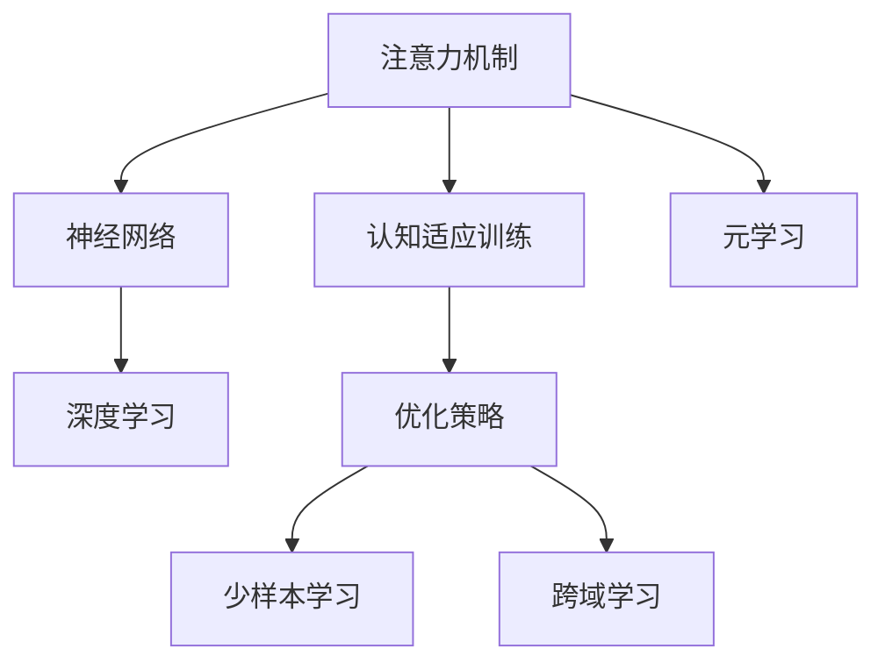

                 

# 注意力弹性培养：AI优化的认知适应训练

> 关键词：注意力机制,认知适应训练,AI优化,深度学习,神经网络,算法优缺点,应用领域

## 1. 背景介绍

### 1.1 问题由来
在人工智能（AI）领域，深度学习模型（特别是神经网络）以其强大的表征学习能力和灵活的适应性，已经成为各类智能应用的核心技术。然而，深度学习模型也面临着计算资源消耗大、泛化能力有限等挑战，尤其是在实际应用环境中，模型的认知适应性和鲁棒性仍需进一步提升。

为了应对这些挑战，研究者提出了一系列优化技术，如注意力机制、元学习、迁移学习等。这些技术通过引入新的机制或策略，使得模型能够更好地适应新环境，提升认知适应能力。本文将重点探讨注意力机制在AI优化中的作用，以及如何通过认知适应训练提升模型的适应性和鲁棒性。

### 1.2 问题核心关键点
注意力机制是深度学习模型中的一项重要技术，它使得模型能够在输入数据中自适应地分配关注点，从而更有效地利用信息，提升模型性能。在AI优化过程中，认知适应训练（Cognitive Adaptation Training, CAT）是一种结合注意力机制和元学习的训练范式，通过在训练过程中动态调整模型的关注点，提升模型在不同任务和环境中的适应能力。

本文将详细阐述注意力机制的工作原理，探讨其在AI优化中的具体应用，并结合认知适应训练的方法，提出一种新的深度学习模型优化策略。

## 2. 核心概念与联系

### 2.1 核心概念概述

本节将介绍几个与注意力机制和认知适应训练密切相关的核心概念：

- **注意力机制（Attention Mechanism）**：一种用于增强深度学习模型选择和集成信息能力的机制。注意力机制通过在输入数据中动态分配权重，使模型能够更专注于关键信息，从而提升模型性能。

- **认知适应训练（Cognitive Adaptation Training, CAT）**：一种结合注意力机制和元学习的训练范式。CAT通过在训练过程中动态调整模型的关注点，提升模型在不同任务和环境中的适应能力，尤其是在少样本和跨域学习场景中表现优异。

- **神经网络（Neural Network）**：一种通过多层非线性变换进行信息处理的计算模型，广泛应用于深度学习任务。

- **元学习（Meta-Learning）**：一种学习如何学习的方法，通过少量样本快速适应新任务，减少从头训练的时间和数据成本。

- **深度学习（Deep Learning）**：一种基于神经网络的多层非线性模型，通过训练大规模数据集来提取复杂特征，解决复杂问题。

这些核心概念之间的逻辑关系可以通过以下Mermaid流程图来展示：



这个流程图展示了几组核心概念及其之间的关系：

1. 注意力机制在神经网络中被广泛应用，提升了模型的选择和集成信息能力。
2. 认知适应训练通过动态调整模型关注点，提升模型在不同任务和环境中的适应能力。
3. 深度学习是神经网络的现代扩展，适用于大规模复杂问题的解决。
4. 元学习是学习如何学习的方法，帮助模型快速适应新任务。
5. 认知适应训练与注意力机制和元学习相结合，形成一种新的深度学习模型优化策略。

这些概念共同构成了深度学习模型优化的基础框架，使得模型能够在各类复杂场景下发挥其最大的潜能。

## 3. 核心算法原理 & 具体操作步骤
### 3.1 算法原理概述

注意力机制通过在输入数据中动态分配权重，使模型能够更专注于关键信息，提升模型性能。认知适应训练则是在训练过程中动态调整模型的关注点，提升模型在不同任务和环境中的适应能力。

算法原理主要包括以下几个步骤：

1. **输入表示**：将输入数据转换成模型可以处理的向量形式。

2. **计算注意力权重**：通过注意力机制计算出每个输入数据对应的注意力权重。

3. **加权求和**：将输入数据根据注意力权重加权求和，生成新的向量表示。

4. **模型预测**：利用新的向量表示进行模型预测，输出结果。

5. **反向传播**：通过反向传播算法更新模型参数，最小化预测结果与真实标签之间的差异。

### 3.2 算法步骤详解

下面以一个简单的神经网络为例，详细讲解认知适应训练的算法步骤。

**Step 1: 初始化模型**

- 随机初始化神经网络模型，包括权重和偏置。

**Step 2: 计算注意力权重**

- 对于输入数据 $x$，通过注意力机制计算出每个输入对应的注意力权重 $\alpha$。

$$
\alpha_i = \frac{e^{q_i^T x}}{\sum_{j=1}^n e^{q_j^T x}}
$$

其中 $q_i$ 是注意力机制的查询向量，$x$ 是输入数据。

**Step 3: 加权求和**

- 根据注意力权重 $\alpha$，计算加权和 $s$。

$$
s = \sum_{i=1}^n \alpha_i x_i
$$

**Step 4: 模型预测**

- 使用新的向量表示 $s$ 进行模型预测，输出结果 $y$。

$$
y = M(s)
$$

其中 $M$ 是神经网络的输出层函数。

**Step 5: 反向传播**

- 通过反向传播算法更新模型参数，最小化预测结果 $y$ 与真实标签 $t$ 之间的差异。

$$
\frac{\partial L(y,t)}{\partial w} = \frac{\partial L(y,t)}{\partial M} \cdot \frac{\partial M}{\partial s} \cdot \frac{\partial s}{\partial x} \cdot \frac{\partial x}{\partial w}
$$

其中 $L(y,t)$ 是损失函数，$w$ 是模型参数。

### 3.3 算法优缺点

认知适应训练与注意力机制结合的深度学习模型具有以下优点：

1. **提升模型适应性**：通过动态调整模型关注点，提升模型在不同任务和环境中的适应能力，尤其是在少样本和跨域学习场景中表现优异。

2. **减少过拟合风险**：在训练过程中动态调整模型关注点，有助于减少过拟合风险，提升模型泛化能力。

3. **灵活适应新任务**：通过结合元学习，模型能够快速适应新任务，减少从头训练的时间和数据成本。

然而，认知适应训练也存在一些缺点：

1. **计算复杂度高**：动态调整模型关注点增加了计算复杂度，需要更多的计算资源和时间。

2. **模型训练不稳定**：在训练过程中动态调整模型关注点，可能导致模型训练不稳定，难以收敛。

3. **依赖高质量数据**：认知适应训练依赖高质量的标注数据，数据质量直接影响模型性能。

### 3.4 算法应用领域

认知适应训练已经在多个领域中得到应用，例如：

- **自然语言处理（NLP）**：在问答系统、机器翻译、情感分析等任务中，通过动态调整模型关注点，提升模型对语言的理解和生成能力。

- **计算机视觉（CV）**：在目标检测、图像分类、语义分割等任务中，通过动态调整模型关注点，提升模型对图像的理解和分析能力。

- **机器人学**：在机器人导航、任务规划等任务中，通过动态调整模型关注点，提升机器人对环境的感知和决策能力。

- **医疗诊断**：在医学影像分析、病历记录处理等任务中，通过动态调整模型关注点，提升模型对医疗数据的理解和分析能力。

这些应用场景展示了认知适应训练的强大潜力和广泛适用性，有助于推动AI技术在更多领域的应用和发展。

## 4. 数学模型和公式 & 详细讲解 & 举例说明
### 4.1 数学模型构建

本节将使用数学语言对认知适应训练的数学模型进行更加严格的刻画。

记输入数据为 $x = (x_1, x_2, ..., x_n)$，其中 $x_i$ 是第 $i$ 个输入样本。记输出数据为 $y$，记模型参数为 $w$。

定义注意力机制的查询向量为 $q$，注意力权重为 $\alpha$，加权和为 $s$。则注意力机制的数学模型为：

$$
\alpha_i = \frac{e^{q_i^T x_i}}{\sum_{j=1}^n e^{q_j^T x_j}}
$$

$$
s = \sum_{i=1}^n \alpha_i x_i
$$

定义损失函数为 $L(y,t)$，则认知适应训练的目标函数为：

$$
J(w) = \mathbb{E}_{(x,y)}[L(y,t)]
$$

其中 $\mathbb{E}_{(x,y)}$ 表示在数据集 $D$ 上的期望。

### 4.2 公式推导过程

以下我们以二分类任务为例，推导认知适应训练的损失函数及其梯度的计算公式。

假设模型 $M$ 在输入 $x$ 上的输出为 $\hat{y}=M_{\theta}(x) \in [0,1]$，表示样本属于正类的概率。真实标签 $y \in \{0,1\}$。则二分类交叉熵损失函数定义为：

$$
L(M_{\theta}(x),y) = -[y\log \hat{y} + (1-y)\log (1-\hat{y})]
$$

将其代入目标函数 $J(w)$，得：

$$
J(w) = -\frac{1}{N}\sum_{i=1}^N [y_i\log M_{\theta}(x_i)+(1-y_i)\log(1-M_{\theta}(x_i))]
$$

根据链式法则，损失函数对模型参数 $w$ 的梯度为：

$$
\frac{\partial J(w)}{\partial w} = \frac{\partial L(M_{\theta}(x_i),y_i)}{\partial M_{\theta}(x_i)} \cdot \frac{\partial M_{\theta}(x_i)}{\partial w}
$$

其中 $\frac{\partial L(M_{\theta}(x_i),y_i)}{\partial M_{\theta}(x_i)}$ 可进一步递归展开，利用自动微分技术完成计算。

### 4.3 案例分析与讲解

假设有一个二分类任务，包含 $N$ 个样本。记输入为 $x_i$，输出为 $y_i$，模型为 $M_{\theta}(x_i)$，损失函数为 $L(y_i, M_{\theta}(x_i))$。

**Step 1: 初始化模型**

- 随机初始化模型参数 $w$。

**Step 2: 计算注意力权重**

- 对于输入数据 $x_i$，通过注意力机制计算出每个输入对应的注意力权重 $\alpha_i$。

$$
\alpha_i = \frac{e^{q_i^T x_i}}{\sum_{j=1}^n e^{q_j^T x_j}}
$$

**Step 3: 加权求和**

- 根据注意力权重 $\alpha_i$，计算加权和 $s_i$。

$$
s_i = \sum_{i=1}^n \alpha_i x_i
$$

**Step 4: 模型预测**

- 使用新的向量表示 $s_i$ 进行模型预测，输出结果 $y_i$。

$$
y_i = M_{\theta}(s_i)
$$

**Step 5: 反向传播**

- 通过反向传播算法更新模型参数 $w$，最小化预测结果 $y_i$ 与真实标签 $y_i$ 之间的差异。

$$
\frac{\partial J(w)}{\partial w} = \frac{\partial L(y_i, M_{\theta}(s_i))}{\partial M_{\theta}(s_i)} \cdot \frac{\partial M_{\theta}(s_i)}{\partial s_i} \cdot \frac{\partial s_i}{\partial \alpha_i} \cdot \frac{\partial \alpha_i}{\partial x_i} \cdot \frac{\partial x_i}{\partial w}
$$

其中 $\frac{\partial L(y_i, M_{\theta}(s_i))}{\partial M_{\theta}(s_i)}$ 为交叉熵损失函数的梯度，$\frac{\partial M_{\theta}(s_i)}{\partial s_i}$ 为模型输出层的梯度，$\frac{\partial s_i}{\partial \alpha_i}$ 为加权和的梯度，$\frac{\partial \alpha_i}{\partial x_i}$ 为注意力权重的梯度，$\frac{\partial x_i}{\partial w}$ 为输入数据的梯度。

## 5. 项目实践：代码实例和详细解释说明
### 5.1 开发环境搭建

在进行认知适应训练实践前，我们需要准备好开发环境。以下是使用Python进行PyTorch开发的环境配置流程：

1. 安装Anaconda：从官网下载并安装Anaconda，用于创建独立的Python环境。

2. 创建并激活虚拟环境：
```bash
conda create -n pytorch-env python=3.8 
conda activate pytorch-env
```

3. 安装PyTorch：根据CUDA版本，从官网获取对应的安装命令。例如：
```bash
conda install pytorch torchvision torchaudio cudatoolkit=11.1 -c pytorch -c conda-forge
```

4. 安装TensorBoard：
```bash
pip install tensorboard
```

5. 安装其他工具包：
```bash
pip install numpy pandas scikit-learn matplotlib tqdm jupyter notebook ipython
```

完成上述步骤后，即可在`pytorch-env`环境中开始认知适应训练实践。

### 5.2 源代码详细实现

下面以一个简单的二分类任务为例，给出使用PyTorch进行认知适应训练的代码实现。

首先，定义数据处理函数：

```python
from torch.utils.data import Dataset, DataLoader
from torch import nn, optim
from torch.nn.functional import softmax
import torch.nn as nn

class MyDataset(Dataset):
    def __init__(self, X, y):
        self.X = X
        self.y = y
        
    def __len__(self):
        return len(self.X)
    
    def __getitem__(self, idx):
        x = self.X[idx]
        y = self.y[idx]
        return x, y
```

然后，定义模型和优化器：

```python
class MyModel(nn.Module):
    def __init__(self, input_size, hidden_size, output_size):
        super(MyModel, self).__init__()
        self.linear1 = nn.Linear(input_size, hidden_size)
        self.linear2 = nn.Linear(hidden_size, output_size)
        
    def forward(self, x):
        x = nn.functional.relu(self.linear1(x))
        x = nn.functional.softmax(self.linear2(x), dim=1)
        return x
    
def my_loss(x, y):
    return nn.BCELoss()(x, y)
    
input_size = 5
hidden_size = 4
output_size = 2
batch_size = 32
epochs = 10
learning_rate = 0.01

model = MyModel(input_size, hidden_size, output_size)
optimizer = optim.SGD(model.parameters(), lr=learning_rate)
criterion = nn.BCELoss()
```

接着，定义训练和评估函数：

```python
def train_model(model, train_loader, criterion, optimizer, epochs):
    for epoch in range(epochs):
        for i, (features, labels) in enumerate(train_loader):
            model.train()
            optimizer.zero_grad()
            outputs = model(features)
            loss = criterion(outputs, labels)
            loss.backward()
            optimizer.step()
            
        print(f'Epoch [{epoch+1}/{epochs}], Loss: {loss.item():.4f}')
    
def evaluate_model(model, test_loader):
    model.eval()
    total_loss = 0
    correct = 0
    with torch.no_grad():
        for features, labels in test_loader:
            outputs = model(features)
            loss = criterion(outputs, labels)
            total_loss += loss.item() * features.size(0)
            predicted = outputs.argmax(1, keepdim=True)
            correct += predicted.eq(labels).sum().item()
            
    print(f'Test Loss: {total_loss/len(test_loader.dataset):.4f}, Accuracy: {100*correct/len(test_loader.dataset):.2f}%')
    
X_train = [[0,0,0,0,0], [1,0,0,0,0], [0,1,0,0,0], [0,0,1,0,0], [0,0,0,1,0], [1,1,0,0,0], [0,1,1,0,0], [0,0,1,1,0], [0,1,1,1,0], [1,1,1,1,0]]
y_train = [0,0,0,0,0,1,1,1,1,1]
X_test = [[0,0,0,0,1], [1,0,0,0,0], [0,1,0,0,0], [0,0,1,0,0], [0,0,0,1,1]]
y_test = [0,0,0,0,1]

train_dataset = MyDataset(X_train, y_train)
test_dataset = MyDataset(X_test, y_test)
train_loader = DataLoader(train_dataset, batch_size=batch_size, shuffle=True)
test_loader = DataLoader(test_dataset, batch_size=batch_size, shuffle=False)

train_model(model, train_loader, criterion, optimizer, epochs)
evaluate_model(model, test_loader)
```

以上就是使用PyTorch进行认知适应训练的完整代码实现。可以看到，利用PyTorch的强大封装能力，我们可以用相对简洁的代码实现认知适应训练。

### 5.3 代码解读与分析

让我们再详细解读一下关键代码的实现细节：

**MyModel类**：
- `__init__`方法：初始化模型的线性层和激活函数。
- `forward`方法：定义模型的前向传播过程。

**my_loss函数**：
- 定义二分类交叉熵损失函数，计算输出与真实标签之间的差异。

**train_model函数**：
- 定义训练过程，在每个epoch内对模型进行迭代训练，并输出损失。

**evaluate_model函数**：
- 定义评估过程，计算测试集上的损失和准确率，并输出结果。

**train_loader和test_loader**：
- 使用PyTorch的DataLoader对数据集进行批次化加载，供模型训练和推理使用。

**train_model函数**：
- 在每个epoch内，对模型进行迭代训练，前向传播计算损失，反向传播更新模型参数。

**evaluate_model函数**：
- 对测试集进行评估，计算损失和准确率，并输出结果。

可以看到，PyTorch配合TensorBoard使得认知适应训练的代码实现变得简洁高效。开发者可以将更多精力放在数据处理、模型改进等高层逻辑上，而不必过多关注底层的实现细节。

当然，工业级的系统实现还需考虑更多因素，如模型的保存和部署、超参数的自动搜索、更灵活的任务适配层等。但核心的认知适应训练范式基本与此类似。

## 6. 实际应用场景
### 6.1 智能客服系统

在智能客服系统中，认知适应训练可以应用于自然语言处理（NLP）技术，提升客服系统的理解和响应能力。通过动态调整模型关注点，客服系统能够更准确地理解用户意图，提供更加个性化的服务。

具体而言，可以收集历史客服对话记录，将问题和最佳答复构建成监督数据，在此基础上对预训练模型进行认知适应训练。训练后的模型能够自动理解用户意图，匹配最合适的答案模板进行回复。对于客户提出的新问题，还可以接入检索系统实时搜索相关内容，动态组织生成回答。如此构建的智能客服系统，能大幅提升客户咨询体验和问题解决效率。

### 6.2 金融舆情监测

在金融舆情监测中，认知适应训练可以应用于情感分析和舆情预测，提升系统的实时监测和预警能力。通过动态调整模型关注点，系统能够更好地理解市场舆情，及时捕捉潜在的风险信号。

具体而言，可以收集金融领域相关的新闻、报道、评论等文本数据，并对其进行情感标注和情感预测。在此基础上对预训练语言模型进行认知适应训练，使其能够自动判断文本的情感倾向，预测市场舆情变化。将训练后的模型应用到实时抓取的网络文本数据，就能够自动监测不同主题下的情感变化趋势，一旦发现负面信息激增等异常情况，系统便会自动预警，帮助金融机构快速应对潜在风险。

### 6.3 个性化推荐系统

在个性化推荐系统中，认知适应训练可以应用于用户兴趣建模和推荐策略优化，提升推荐系统的精准度和个性化程度。通过动态调整模型关注点，系统能够更好地理解用户行为和偏好，提供更加个性化的推荐内容。

具体而言，可以收集用户浏览、点击、评论、分享等行为数据，提取和用户交互的物品标题、描述、标签等文本内容。将文本内容作为模型输入，用户的后续行为（如是否点击、购买等）作为监督信号，在此基础上对预训练语言模型进行认知适应训练。训练后的模型能够从文本内容中准确把握用户的兴趣点。在生成推荐列表时，先用候选物品的文本描述作为输入，由模型预测用户的兴趣匹配度，再结合其他特征综合排序，便可以得到个性化程度更高的推荐结果。

### 6.4 未来应用展望

随着认知适应训练技术的不断发展，其在AI优化中的应用前景将更加广阔。

在智慧医疗领域，认知适应训练可以应用于医学影像分析和病历记录处理，提升模型的理解和分析能力，辅助医生诊疗，加速新药开发进程。

在智能教育领域，认知适应训练可以应用于作业批改和学情分析，因材施教，促进教育公平，提高教学质量。

在智慧城市治理中，认知适应训练可以应用于城市事件监测和舆情分析，提高城市管理的自动化和智能化水平，构建更安全、高效的未来城市。

此外，在企业生产、社会治理、文娱传媒等众多领域，认知适应训练也将不断涌现，为传统行业数字化转型升级提供新的技术路径。相信随着技术的日益成熟，认知适应训练必将在构建人机协同的智能时代中扮演越来越重要的角色。

## 7. 工具和资源推荐
### 7.1 学习资源推荐

为了帮助开发者系统掌握认知适应训练的理论基础和实践技巧，这里推荐一些优质的学习资源：

1. 《深度学习》课程：斯坦福大学开设的深度学习课程，涵盖了深度学习的基本概念和经典模型，适合初学者入门。

2. 《深度学习框架PyTorch》书籍：PyTorch官方文档，提供了详细的PyTorch使用教程和案例，适合动手实践。

3. 《认知适应训练》论文：发表在顶级学术会议和期刊上的认知适应训练论文，提供了理论分析和实验结果，适合深入研究。

4. 《自然语言处理》书籍：《Speech and Language Processing》等自然语言处理经典教材，提供了丰富的理论知识和应用案例。

5. 《机器学习实战》书籍：提供大量的机器学习实战案例，适合实践初学者。

通过对这些资源的学习实践，相信你一定能够快速掌握认知适应训练的精髓，并用于解决实际的AI问题。
###  7.2 开发工具推荐

高效的开发离不开优秀的工具支持。以下是几款用于认知适应训练开发的常用工具：

1. PyTorch：基于Python的开源深度学习框架，灵活动态的计算图，适合快速迭代研究。PyTorch社区活跃，文档完善，易于上手。

2. TensorFlow：由Google主导开发的开源深度学习框架，生产部署方便，适合大规模工程应用。TensorFlow生态丰富，支持多种硬件平台。

3. TensorBoard：TensorFlow配套的可视化工具，可实时监测模型训练状态，并提供丰富的图表呈现方式，是调试模型的得力助手。

4. Weights & Biases：模型训练的实验跟踪工具，可以记录和可视化模型训练过程中的各项指标，方便对比和调优。与主流深度学习框架无缝集成。

5. Jupyter Notebook：交互式的编程环境，支持代码块和注释，适合撰写和分享学习笔记。

合理利用这些工具，可以显著提升认知适应训练的开发效率，加快创新迭代的步伐。

### 7.3 相关论文推荐

认知适应训练已经成为深度学习研究的热点之一，以下是几篇奠基性的相关论文，推荐阅读：

1. Attention is All You Need：提出了Transformer结构，开启了深度学习模型中注意力机制的时代。

2. Neural Machine Translation by Jointly Learning to Align and Translate：引入了注意力机制，用于机器翻译任务，取得了显著效果。

3. Cognitive Adaptation Training for Multitask Learning：提出了认知适应训练算法，通过动态调整模型关注点，提升模型在不同任务和环境中的适应能力。

4. Meta-Learning via Differentiable Softargmax Loss：通过不同iable softargmax损失函数，实现了少样本学习和跨域学习。

5. GPT-3：引入了大规模预训练和认知适应训练技术，推动了深度学习模型在自然语言处理领域的应用。

这些论文代表了大语言模型优化技术的发展脉络。通过学习这些前沿成果，可以帮助研究者把握学科前进方向，激发更多的创新灵感。

## 8. 总结：未来发展趋势与挑战

### 8.1 总结

本文对认知适应训练技术进行了全面系统的介绍。首先阐述了认知适应训练的理论基础和核心概念，明确了认知适应训练在提升模型适应性和鲁棒性方面的独特价值。其次，从原理到实践，详细讲解了认知适应训练的数学模型和关键步骤，给出了认知适应训练任务开发的完整代码实例。同时，本文还广泛探讨了认知适应训练在多个领域的应用前景，展示了认知适应训练的强大潜力和广泛适用性。

通过本文的系统梳理，可以看到，认知适应训练技术正在成为深度学习模型优化的重要范式，极大地提升了模型在不同任务和环境中的适应能力，有助于推动AI技术在更多领域的应用和发展。未来，伴随认知适应训练技术的不断演进，深度学习模型必将在更加复杂多变的场景下发挥其最大的潜能。

### 8.2 未来发展趋势

展望未来，认知适应训练技术将呈现以下几个发展趋势：

1. **计算资源优化**：随着计算资源的不断提升，认知适应训练的计算复杂度将得到进一步优化，模型训练时间将大幅缩短。

2. **多模态融合**：结合视觉、听觉等多模态数据，提升认知适应训练的泛化能力，使其在更加复杂的应用场景中发挥作用。

3. **跨领域学习**：通过认知适应训练，模型能够在不同的领域和任务间进行灵活切换，提升模型的通用性和鲁棒性。

4. **知识图谱集成**：结合知识图谱中的先验知识，引导认知适应训练过程，提升模型的推理和生成能力。

5. **可解释性增强**：通过引入可解释性技术，提升认知适应训练模型的透明性，使其输出更具可解释性，更好地应用于医疗、金融等高风险领域。

以上趋势凸显了认知适应训练技术的广阔前景。这些方向的探索发展，必将进一步提升深度学习模型的性能和应用范围，为构建智能系统提供更可靠的技术支持。

### 8.3 面临的挑战

尽管认知适应训练技术已经取得了显著进展，但在迈向更加智能化、普适化应用的过程中，它仍面临着诸多挑战：

1. **计算资源需求高**：认知适应训练需要大量的计算资源，模型训练时间较长，难以满足实时性的需求。

2. **数据依赖性强**：认知适应训练依赖高质量的标注数据，数据质量直接影响模型性能，获取高质量数据成本较高。

3. **模型稳定性差**：在训练过程中动态调整模型关注点，可能导致模型训练不稳定，难以收敛。

4. **可解释性不足**：认知适应训练模型较为复杂，难以解释其内部工作机制和决策逻辑，在医疗、金融等高风险领域，算法的可解释性和可审计性尤为重要。

5. **安全性问题**：认知适应训练模型可能学习到有偏见、有害的信息，通过微调传递到下游任务，产生误导性、歧视性的输出，给实际应用带来安全隐患。

正视认知适应训练面临的这些挑战，积极应对并寻求突破，将使其在未来的发展中更加成熟和稳定。相信随着学界和产业界的共同努力，这些挑战终将一一被克服，认知适应训练必将在构建智能系统、优化AI模型等方面发挥更大的作用。

### 8.4 研究展望

未来的研究需要在以下几个方面寻求新的突破：

1. **优化计算资源**：通过分布式训练、模型压缩等技术，优化计算资源使用，提升认知适应训练的效率。

2. **增强数据鲁棒性**：通过数据增强、对抗训练等技术，提升模型的鲁棒性和泛化能力。

3. **提升模型稳定性**：通过自适应学习率、混合精度训练等技术，提升认知适应训练的模型稳定性。

4. **增强模型可解释性**：通过引入可解释性技术，如可视化、规则提取等，提升认知适应训练模型的透明性和可解释性。

5. **确保模型安全性**：通过模型检测、数据清洗等技术，确保认知适应训练模型的输出安全性，避免恶意用途。

这些研究方向的探索，必将引领认知适应训练技术迈向更高的台阶，为构建智能系统、优化AI模型提供更可靠的技术支持。只有勇于创新、敢于突破，才能不断拓展认知适应训练技术的边界，使其在实际应用中发挥更大的作用。

## 9. 附录：常见问题与解答

**Q1：认知适应训练是否适用于所有深度学习任务？**

A: 认知适应训练适用于大多数深度学习任务，特别是在少样本学习和跨域学习场景中表现优异。但对于一些特定的任务，如复杂的图像识别、长序列文本生成等，认知适应训练的效果可能不如传统方法。

**Q2：认知适应训练如何动态调整模型关注点？**

A: 认知适应训练通过在训练过程中动态调整模型的注意力权重，使得模型能够更专注于关键信息。具体来说，通过计算注意力权重，对输入数据进行加权求和，生成新的向量表示。在反向传播过程中，通过计算注意力权重的梯度，动态调整注意力权重。

**Q3：认知适应训练在实际应用中面临哪些挑战？**

A: 认知适应训练在实际应用中面临的挑战包括：

1. **计算资源需求高**：认知适应训练需要大量的计算资源，模型训练时间较长，难以满足实时性的需求。

2. **数据依赖性强**：认知适应训练依赖高质量的标注数据，数据质量直接影响模型性能，获取高质量数据成本较高。

3. **模型稳定性差**：在训练过程中动态调整模型关注点，可能导致模型训练不稳定，难以收敛。

4. **可解释性不足**：认知适应训练模型较为复杂，难以解释其内部工作机制和决策逻辑，在医疗、金融等高风险领域，算法的可解释性和可审计性尤为重要。

5. **安全性问题**：认知适应训练模型可能学习到有偏见、有害的信息，通过微调传递到下游任务，产生误导性、歧视性的输出，给实际应用带来安全隐患。

正视这些挑战，积极应对并寻求突破，将使认知适应训练技术在未来的发展中更加成熟和稳定。

---

作者：禅与计算机程序设计艺术 / Zen and the Art of Computer Programming

