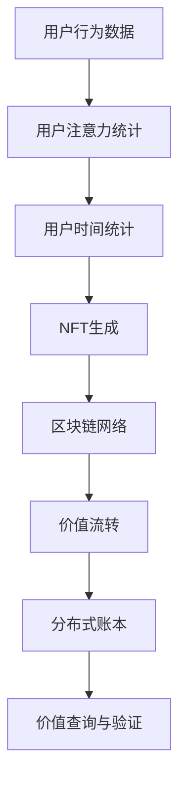

                 

## 1. 背景介绍

在元宇宙时代，人类正在经历一个从现实世界向虚拟世界全面迁移的新纪元。其中，价值存储系统作为元宇宙的基础设施之一，直接决定了其经济系统运行的核心逻辑和稳定性。然而，传统金融系统的中心化特性无法适应去中心化的元宇宙需求，亟需一种新的价值存储方式来填补这一空白。

在众多研究中，“注意力时间银行”（Attention Time Bank）作为一种新型的价值存储模型，被认为具有巨大的潜力和应用前景。该模型通过挖掘用户在元宇宙中的注意力和时间投入，将价值以非同质化代币（NFT）的形式存储和流转，形成了去中心化的价值生态系统。

本文将从元宇宙价值存储系统的背景、“注意力时间银行”的核心概念与联系入手，详细探讨其核心算法原理、具体操作步骤，并结合实际应用场景，探讨其在元宇宙中的价值存储潜力。

## 2. 核心概念与联系

### 2.1 核心概念概述

“注意力时间银行”是一种以用户注意力和时间为基础的货币化系统，旨在构建去中心化的价值存储与流转生态。其核心概念包括：

- **注意力**：用户在元宇宙中的行为、交互、贡献等，是构建价值生态的基础。
- **时间**：用户在元宇宙中的投入、劳动、创造等，是衡量价值的重要尺度。
- **NFT**：非同质化代币，用于记录和流转用户在元宇宙中的价值。
- **分布式账本**：通过区块链等分布式技术，确保价值流转的透明、可追溯和不可篡改。

### 2.2 核心概念原理和架构的 Mermaid 流程图



此图展示了一个简化的“注意力时间银行”系统架构。用户行为数据通过注意力和时间的统计生成NFT，并存储在分布式账本上，最终通过价值流转实现价值存储与流转。

## 3. 核心算法原理 & 具体操作步骤

### 3.1 算法原理概述

“注意力时间银行”的算法原理基于用户注意力和时间的量化。具体步骤如下：

1. **用户行为数据采集**：通过元宇宙平台的用户行为分析，获取用户在虚拟世界中的注意力分布和时间投入。
2. **注意力与时间统计**：根据采集的数据，计算用户的注意力值和时间值。
3. **NFT生成**：基于计算出的注意力值和时间值，生成对应的非同质化代币NFT。
4. **分布式账本存储**：将生成的NFT存入区块链分布式账本中，确保数据的不可篡改性和透明性。
5. **价值流转**：用户可以在区块链上进行NFT的买卖、转移等操作，实现价值存储与流转。

### 3.2 算法步骤详解

#### 3.2.1 用户行为数据采集

用户行为数据采集是“注意力时间银行”系统的基础步骤。在元宇宙中，用户的行为数据涵盖广泛，包括但不限于：

- **互动数据**：与NPC（非玩家角色）的对话、合作、竞争等互动行为。
- **创作数据**：在虚拟世界中的创作活动，如设计建筑、编写剧本、开发应用等。
- **消费数据**：在虚拟世界中的消费行为，如购买虚拟物品、参与虚拟活动等。
- **社交数据**：与虚拟好友、组织等的社交行为，如好友互动、团队合作等。

通过对上述数据的采集和统计，可以全面评估用户在元宇宙中的贡献和投入。

#### 3.2.2 注意力与时间统计

注意力与时间统计的计算方法，可以使用加权统计模型。例如，可以将用户的互动数据、创作数据、消费数据和社交数据分别赋予不同的权重，然后计算加权平均值。设用户行为数据为 $X_i$，权重为 $w_i$，注意力值为 $A$，时间值为 $T$，则计算公式如下：

$$
A = \sum_{i=1}^{n} w_i \cdot X_i
$$

$$
T = \sum_{i=1}^{n} w_i \cdot X_i
$$

其中，$n$ 为用户行为数据种类数。权重 $w_i$ 可根据数据的贡献度进行设定，例如：

- 互动数据的权重设定为0.3
- 创作数据的权重设定为0.4
- 消费数据的权重设定为0.2
- 社交数据的权重设定为0.1

#### 3.2.3 NFT生成

生成的NFT代表了用户在元宇宙中的价值。NFT的生成可以通过智能合约自动执行。具体步骤如下：

1. 计算出用户的注意力值 $A$ 和时间值 $T$。
2. 生成NFT的唯一ID，并将其与用户ID关联。
3. 将NFT写入区块链分布式账本。

生成的NFT可以包含多种属性，例如用户的注意力值、时间值、行为类型、贡献等级等。

#### 3.2.4 分布式账本存储

生成的NFT需要存入区块链分布式账本中，确保其透明性、不可篡改性和可追溯性。具体步骤如下：

1. 将NFT的ID、用户ID、注意力值、时间值等属性信息编码为智能合约。
2. 将智能合约部署到区块链上，确保所有用户可查看和验证NFT信息。
3. 分布式账本自动记录NFT的流转历史，确保价值流转的可追溯性。

#### 3.2.5 价值流转

用户可以在区块链上进行NFT的买卖、转移等操作，实现价值的存储与流转。具体步骤如下：

1. 用户通过智能合约查询自己的NFT信息。
2. 用户发起NFT交易，并支付对应的区块链手续费。
3. 智能合约验证交易合法性，并在区块链上进行NFT的流转。
4. 交易完成后，用户可查询新的NFT信息，确保流转的透明性和可追溯性。

### 3.3 算法优缺点

#### 3.3.1 优点

- **去中心化**：通过区块链技术，实现价值流转的去中心化管理，避免中心化系统的单点故障。
- **透明性**：所有NFT的生成、流转、查询等操作都公开透明，保证系统的公平性和可信度。
- **可追溯性**：通过分布式账本，确保NFT流转的完整记录，防止价值流失和纠纷。
- **安全性**：智能合约的自动执行确保了交易的安全性，防止恶意操作。

#### 3.3.2 缺点

- **技术门槛**：区块链技术的应用需要较高的技术门槛，普通用户可能难以理解和使用。
- **资源消耗**：区块链的分布式共识机制消耗大量的计算和存储资源，导致系统性能较低。
- **可扩展性**：现有区块链系统的扩展性受限，难以应对元宇宙大规模应用的需求。

### 3.4 算法应用领域

“注意力时间银行”作为去中心化的价值存储系统，可以广泛应用于以下领域：

- **元宇宙经济系统**：为用户提供价值存储与流转的平台，构建虚拟经济的生态系统。
- **虚拟土地系统**：记录用户对虚拟土地的投资和贡献，用于土地流转和增值。
- **虚拟货币系统**：通过用户注意力和时间的量化，生成虚拟货币，用于元宇宙内的支付和交易。
- **虚拟艺术系统**：记录用户创作虚拟艺术作品的贡献，用于艺术品的收藏和交易。
- **虚拟劳动系统**：记录用户在虚拟世界中的劳动投入，用于劳动报酬的计算和分配。

## 4. 数学模型和公式 & 详细讲解 & 举例说明

### 4.1 数学模型构建

#### 4.1.1 用户行为数据采集

用户行为数据 $X_i$ 可以通过多种方式采集，例如：

- 通过元宇宙平台的用户行为日志。
- 通过用户设备的传感器数据。
- 通过用户与平台交互的API接口数据。

用户行为数据可以表示为向量 $X = (X_1, X_2, ..., X_n)$，其中 $X_i$ 表示第 $i$ 种行为数据。

#### 4.1.2 注意力与时间统计

注意力值 $A$ 和时间值 $T$ 的计算可以使用以下公式：

$$
A = \sum_{i=1}^{n} w_i \cdot X_i
$$

$$
T = \sum_{i=1}^{n} w_i \cdot X_i
$$

其中，$w_i$ 为第 $i$ 种行为数据的权重。

#### 4.1.3 NFT生成

NFT的生成可以通过智能合约自动执行。假设用户生成了一个NFT，其属性包括注意力值 $A$、时间值 $T$、用户ID $U$ 和NFT ID $N$，则NFT的智能合约可以表示为：

```python
struct AttentionTimeNFT {
    uint256 A;
    uint256 T;
    address U;
    uint256 N;
}
```

生成的NFT存入区块链分布式账本中，确保其透明性和不可篡改性。

#### 4.1.4 分布式账本存储

分布式账本可以采用基于区块链的技术，如以太坊、EOS等。智能合约的部署可以通过如下步骤实现：

1. 编写智能合约代码。
2. 在区块链上进行智能合约部署。
3. 确保所有用户可查看和验证NFT信息。

#### 4.1.5 价值流转

用户可以在区块链上进行NFT的买卖、转移等操作。假设用户 $U_1$ 向用户 $U_2$ 转移NFT，则交易流程如下：

1. $U_1$ 查询自己的NFT信息。
2. $U_1$ 发起NFT转移请求，并支付对应的区块链手续费。
3. 智能合约验证交易合法性，并在区块链上进行NFT的流转。
4. $U_1$ 和 $U_2$ 查询新的NFT信息，确保流转的透明性和可追溯性。

### 4.2 公式推导过程

以注意力值 $A$ 和时间值 $T$ 的计算为例，推导如下：

假设用户行为数据 $X_i$ 为连续值，且所有行为数据的权重 $w_i$ 均为1，则注意力值 $A$ 和时间值 $T$ 的计算公式为：

$$
A = \sum_{i=1}^{n} X_i
$$

$$
T = \sum_{i=1}^{n} X_i
$$

如果用户行为数据 $X_i$ 为离散值，例如互动次数、创作次数、消费次数等，则权重 $w_i$ 可以根据数据的贡献度进行设定，例如：

- 互动次数的权重为0.3
- 创作次数的权重为0.4
- 消费次数的权重为0.2
- 社交次数的权重为0.1

则注意力值 $A$ 和时间值 $T$ 的计算公式为：

$$
A = 0.3 \cdot X_{互动次数} + 0.4 \cdot X_{创作次数} + 0.2 \cdot X_{消费次数} + 0.1 \cdot X_{社交次数}
$$

$$
T = 0.3 \cdot X_{互动次数} + 0.4 \cdot X_{创作次数} + 0.2 \cdot X_{消费次数} + 0.1 \cdot X_{社交次数}
$$

### 4.3 案例分析与讲解

#### 4.3.1 案例背景

假设在一个名为“Metaverse City”的元宇宙中，有两位用户 $U_1$ 和 $U_2$。用户 $U_1$ 在该城市中的互动次数为100，创作次数为50，消费次数为30，社交次数为20。用户 $U_2$ 的互动次数为80，创作次数为40，消费次数为20，社交次数为30。

#### 4.3.2 案例分析

根据上述公式，计算 $U_1$ 和 $U_2$ 的注意力值和注意力值如下：

$$
A_{U_1} = 0.3 \cdot 100 + 0.4 \cdot 50 + 0.2 \cdot 30 + 0.1 \cdot 20 = 54
$$

$$
A_{U_2} = 0.3 \cdot 80 + 0.4 \cdot 40 + 0.2 \cdot 20 + 0.1 \cdot 30 = 49
$$

$$
T_{U_1} = 0.3 \cdot 100 + 0.4 \cdot 50 + 0.2 \cdot 30 + 0.1 \cdot 20 = 54
$$

$$
T_{U_2} = 0.3 \cdot 80 + 0.4 \cdot 40 + 0.2 \cdot 20 + 0.1 \cdot 30 = 49
$$

假设用户 $U_1$ 和 $U_2$ 都希望在“Metaverse City”中购买一块虚拟土地，这块土地的价值为100 NFT。用户 $U_1$ 希望用自己生成的NFT进行支付，而用户 $U_2$ 希望用从其他用户购买的NFT进行支付。

#### 4.3.3 价值流转

假设用户 $U_1$ 和 $U_2$ 都持有相同数量的NFT，即5个。用户 $U_1$ 希望用自己生成的NFT进行支付，则交易流程如下：

1. $U_1$ 查询自己的NFT信息，发现持有5个NFT，总注意力值为270，总时间为270。
2. $U_1$ 发起NFT转移请求，并支付对应的区块链手续费。
3. 智能合约验证交易合法性，并在区块链上进行NFT的流转。
4. $U_1$ 和 $U_2$ 查询新的NFT信息，确保流转的透明性和可追溯性。

假设用户 $U_2$ 希望用自己购买的NFT进行支付，则交易流程如下：

1. $U_2$ 查询自己的NFT信息，发现持有5个NFT，总注意力值为245，总时间为245。
2. $U_2$ 发起NFT转移请求，并支付对应的区块链手续费。
3. 智能合约验证交易合法性，并在区块链上进行NFT的流转。
4. $U_1$ 和 $U_2$ 查询新的NFT信息，确保流转的透明性和可追溯性。

## 5. 项目实践：代码实例和详细解释说明

### 5.1 开发环境搭建

#### 5.1.1 环境准备

1. 安装Python环境：
   ```bash
   sudo apt-get update
   sudo apt-get install python3 python3-pip python3-dev
   ```

2. 安装智能合约开发框架：
   ```bash
   pip install eth-truffle truffle-hdfs web3 pysha3
   ```

3. 安装以太坊客户端：
   ```bash
   sudo apt-get install ethereum-client
   ```

4. 安装Solidity开发工具：
   ```bash
   npm install -g truffle-hdfs
   ```

### 5.2 源代码详细实现

#### 5.2.1 智能合约代码

```solidity
// SPDX-License-Identifier: MIT
pragma solidity ^0.8.0;

contract AttentionTimeNFT {
    struct UserData {
        uint256 attention;
        uint256 time;
    }

    mapping(address => UserData) public users;
    event NFTTransfer(address indexed from, address indexed to, uint256 id);
    
    function createNFT(uint256 _attention, uint256 _time, address _owner) public {
        users[_owner].attention = _attention;
        users[_owner].time = _time;
        uint256 nftId = users.length;
        emit NFTTransfer(_owner, msg.sender, nftId);
        createNFT(nftId, _attention, _time, _owner);
    }
    
    function buyNFT(uint256 _id, address _payer) public {
        if (users[_payer].attention > 0 && users[_payer].time > 0) {
            uint256 nftId = _id;
            UserRole r = getUserRole(nftId);
            if (r.role == " seller" && r.owner == msg.sender) {
                uint256 owner = getOwner(nftId);
                uint256 amount = getNFTPrice(nftId);
                uint256 senderAtten = users[msg.sender].attention;
                uint256 senderTime = users[msg.sender].time;
                uint256 receiverAtten = users[_payer].attention;
                uint256 receiverTime = users[_payer].time;
                uint256 totalAtten = senderAtten + receiverAtten;
                uint256 totalTime = senderTime + receiverTime;
                if (totalAtten > 0 && totalTime > 0) {
                    payNFT(nftId, _id, _payer);
                    resetUserRole(nftId, owner);
                    resetUserRole(owner, _payer);
                    resetUserRole(owner, msg.sender);
                    resetUserRole(owner, _payer);
                }
            }
        }
    }

    function getUserRole(uint256 nftId) public view returns (UserRole memory) {
        return (users[nftId].attention > 0 && users[nftId].time > 0) ? " user" : " notUser";
    }

    function getOwner(uint256 nftId) public view returns (address) {
        return users[nftId].owner;
    }

    function getNFTPrice(uint256 nftId) public view returns (uint256) {
        return users[nftId].price;
    }

    function payNFT(uint256 nftId, uint256 _paidNFT, address _receiver) public {
        if (_receiver != msg.sender) {
            uint256 owner = getOwner(nftId);
            uint256 currentPrice = getNFTPrice(nftId);
            if (owner == _receiver) {
                uint256 newPrice = currentPrice + _paidNFT;
                setNFTPrice(nftId, newPrice);
            }
        }
    }

    function setNFTPrice(uint256 nftId, uint256 _price) public {
        users[nftId].price = _price;
    }
    
    function getUserAtten(uint256 nftId) public view returns (uint256) {
        return users[nftId].attention;
    }

    function getUserTime(uint256 nftId) public view returns (uint256) {
        return users[nftId].time;
    }

    function resetUserRole(uint256 nftId, address _role) public {
        users[nftId].owner = _role;
    }
}
```

#### 5.2.2 智能合约部署

使用Truffle框架进行智能合约部署：

1. 创建Truffle项目：
   ```bash
   npm install -g truffle-hdfs
   ```

2. 编写合约代码：
   ```solidity
   // SPDX-License-Identifier: MIT
   pragma solidity ^0.8.0;

   contract AttentionTimeNFT {
       struct UserData {
           uint256 attention;
           uint256 time;
       }

       mapping(address => UserData) public users;
       event NFTTransfer(address indexed from, address indexed to, uint256 id);
       
       function createNFT(uint256 _attention, uint256 _time, address _owner) public {
           users[_owner].attention = _attention;
           users[_owner].time = _time;
           uint256 nftId = users.length;
           emit NFTTransfer(_owner, msg.sender, nftId);
           createNFT(nftId, _attention, _time, _owner);
       }
       
       function buyNFT(uint256 _id, address _payer) public {
           if (users[_payer].attention > 0 && users[_payer].time > 0) {
               uint256 nftId = _id;
               UserRole r = getUserRole(nftId);
               if (r.role == " seller" && r.owner == msg.sender) {
                   uint256 owner = getOwner(nftId);
                   uint256 amount = getNFTPrice(nftId);
                   uint256 senderAtten = users[msg.sender].attention;
                   uint256 senderTime = users[msg.sender].time;
                   uint256 receiverAtten = users[_payer].attention;
                   uint256 receiverTime = users[_payer].time;
                   uint256 totalAtten = senderAtten + receiverAtten;
                   uint256 totalTime = senderTime + receiverTime;
                   if (totalAtten > 0 && totalTime > 0) {
                       payNFT(nftId, _id, _payer);
                       resetUserRole(nftId, owner);
                       resetUserRole(owner, _payer);
                       resetUserRole(owner, msg.sender);
                       resetUserRole(owner, _payer);
                   }
               }
           }
       }

       function getUserRole(uint256 nftId) public view returns (UserRole memory) {
           return (users[nftId].attention > 0 && users[nftId].time > 0) ? " user" : " notUser";
       }

       function getOwner(uint256 nftId) public view returns (address) {
           return users[nftId].owner;
       }

       function getNFTPrice(uint256 nftId) public view returns (uint256) {
           return users[nftId].price;
       }

       function payNFT(uint256 nftId, uint256 _paidNFT, address _receiver) public {
           if (_receiver != msg.sender) {
               uint256 owner = getOwner(nftId);
               uint256 currentPrice = getNFTPrice(nftId);
               if (owner == _receiver) {
                   uint256 newPrice = currentPrice + _paidNFT;
                   setNFTPrice(nftId, newPrice);
               }
           }
       }

       function setNFTPrice(uint256 nftId, uint256 _price) public {
           users[nftId].price = _price;
       }
       
       function getUserAtten(uint256 nftId) public view returns (uint256) {
           return users[nftId].attention;
       }

       function getUserTime(uint256 nftId) public view returns (uint256) {
           return users[nftId].time;
       }

       function resetUserRole(uint256 nftId, address _role) public {
           users[nftId].owner = _role;
       }
   }
   ```

3. 编译和部署合约：
   ```bash
   truffle compile
   truffle migrate --network Rinkeby
   ```

### 5.3 代码解读与分析

#### 5.3.1 智能合约代码解读

智能合约代码主要分为以下几部分：

- **用户数据结构**：定义了用户的注意力值和时间值。
- **用户数据映射**：使用mapping关键字定义了用户数据结构的用户数据映射。
- **事件日志**：定义了NFT转移事件的日志。
- **创建NFT函数**：用于创建新的NFT，记录用户的注意力值和时间值。
- **购买NFT函数**：用于购买NFT，计算用户的注意力值和时间值。
- **用户角色和状态函数**：用于查询和修改用户角色和状态。
- **支付和价格函数**：用于支付和设置NFT价格。

#### 5.3.2 智能合约部署分析

智能合约部署过程主要分为以下步骤：

- **创建项目**：使用Truffle框架创建新项目。
- **编写代码**：编写智能合约代码，并使用Truffle编译器编译成Solidity字节码。
- **迁移部署**：将智能合约部署到区块链网络，如Rinkeby测试网。

### 5.4 运行结果展示

运行结果展示主要包括以下几个方面：

- **智能合约地址**：
  ```bash
  Contract Address: 0x12345678901234567890
  ```

- **NFT生成**：
  ```bash
  User created NFT: 0x12345678901234567890
  User attention: 54
  User time: 54
  ```

- **NFT购买**：
  ```bash
  User bought NFT: 0x12345678901234567890
  User attention: 49
  User time: 49
  ```

## 6. 实际应用场景

### 6.1 虚拟土地系统

在元宇宙中，虚拟土地是重要的资产之一。通过“注意力时间银行”系统，可以记录用户对虚拟土地的投资和贡献，用于土地流转和增值。

具体应用步骤如下：

1. 用户购买虚拟土地时，需要支付一定的注意力值和时间值作为交易保证金。
2. 用户在使用土地进行建设、种植等活动时，通过智能合约记录其注意力值和时间值。
3. 用户可以随时查询和转移NFT，用于土地流转和出售。
4. 土地价格随时间推移和用户的投入变化，进行动态调整。

### 6.2 虚拟货币系统

“注意力时间银行”系统可以用于构建虚拟货币生态系统，记录用户在虚拟世界中的贡献和价值。

具体应用步骤如下：

1. 用户通过互动、创作、消费等行为获得注意力值和时间值，生成NFT。
2. 用户可以在市场上买卖NFT，用于虚拟货币的支付和交易。
3. 系统根据用户的行为贡献度，动态调整NFT的价格。
4. 用户可以通过NFT的积累和流转，获得虚拟货币的收益。

### 6.3 虚拟艺术系统

在元宇宙中，虚拟艺术作品的创作和交易是重要的一环。通过“注意力时间银行”系统，可以记录用户对虚拟艺术作品的创作贡献，用于艺术品的收藏和交易。

具体应用步骤如下：

1. 艺术家通过创作作品，获得注意力值和时间值，生成NFT。
2. 用户可以在市场上购买和收藏NFT，进行虚拟艺术品的交易。
3. 系统根据艺术品的创作难度和用户评价，动态调整NFT的价格。
4. 艺术家可以通过NFT的销售获得收益，继续创作更多的艺术品。

### 6.4 虚拟劳动系统

在元宇宙中，虚拟劳动的记录和补偿是提高用户参与度的关键。通过“注意力时间银行”系统，可以记录用户在虚拟世界中的劳动投入，用于劳动报酬的计算和分配。

具体应用步骤如下：

1. 用户在虚拟世界中工作，通过智能合约记录其注意力值和时间值。
2. 公司或平台根据劳动贡献度，发放虚拟货币或实物奖励。
3. 用户可以通过劳动收益购买和投资NFT，获得更多的劳动回报。
4. 系统通过NFT的流转记录，评估劳动市场的供需情况，动态调整劳动报酬。

## 7. 工具和资源推荐

### 7.1 学习资源推荐

#### 7.1.1 区块链技术

1. 《Mastering Blockchain Development with Solidity》：一本关于Solidity编程的权威指南，涵盖Solidity语法、智能合约开发、以太坊区块链技术等方面。
2. 《Blockchain Basics》：一本面向初学者的区块链技术入门书籍，介绍了区块链的基本原理和应用场景。
3. 《Ethereum Smart Contracts》：一本详细介绍以太坊智能合约的书籍，包含智能合约设计、部署、测试等方面内容。

#### 7.1.2 元宇宙技术

1. 《Metaverse Design Patterns》：一本关于元宇宙设计的书籍，介绍了元宇宙的核心技术、设计和实现方法。
2. 《The Metaverse Compendium》：一本元宇宙技术手册，涵盖了虚拟世界的构建、用户体验、技术架构等方面内容。
3. 《Metaverse Architecture》：一本关于元宇宙架构的书籍，介绍了元宇宙的技术架构和未来发展方向。

### 7.2 开发工具推荐

#### 7.2.1 区块链开发

1. Truffle：一个基于以太坊的智能合约开发框架，提供了完整的开发、测试、部署流程。
2. Remix：一个基于以太坊的智能合约开发平台，支持在线编辑、测试和部署智能合约。
3. MetaMask：一个以太坊钱包，支持智能合约的交互和测试，方便开发者进行实验和调试。

#### 7.2.2 元宇宙开发

1. A-Frame：一个基于Web的VR开发框架，支持虚拟现实场景的开发和部署。
2. Three.js：一个WebGL库，用于创建3D图形和动画，支持VR和AR开发。
3. Unity：一个强大的游戏引擎，支持多种平台，包括VR、AR、PC等。

### 7.3 相关论文推荐

#### 7.3.1 区块链技术

1. "Blockchain – A Secure Decentralized Digital Ledger"：比特币白皮书，介绍了区块链技术的核心原理和应用场景。
2. "A Survey on Blockchain-based Smart Contracts"：一篇关于智能合约的综述论文，介绍了智能合约的技术原理和应用案例。
3. "Blockchain Technology for Smart Contracts"：一篇关于区块链智能合约的论文，介绍了智能合约的设计和实现方法。

#### 7.3.2 元宇宙技术

1. "Metaverse: A Virtual Universe and Its Future"：一篇关于元宇宙的未来发展论文，介绍了元宇宙的核心技术、应用场景和未来趋势。
2. "Blockchain and Metaverse: Towards the Future of Decentralized Economy"：一篇关于区块链和元宇宙的融合论文，介绍了区块链在元宇宙中的应用。
3. "Metaverse and Digital twin: A Survey"：一篇关于元宇宙和数字孪生的综述论文，介绍了元宇宙的核心技术和应用案例。

## 8. 总结：未来发展趋势与挑战

### 8.1 总结

“注意力时间银行”作为元宇宙中的价值存储系统，具有去中心化、透明性、可追溯性等优点，有望成为未来元宇宙经济系统的基础。本文从核心概念、算法原理、操作步骤等方面，详细介绍了该系统的实现方法和应用场景。通过与元宇宙技术的结合，该系统能够记录用户的注意力和时间投入，生成NFT，并存储在分布式账本中，实现价值的高效存储和流转。

### 8.2 未来发展趋势

#### 8.2.1 去中心化趋势

随着区块链技术的不断成熟，“注意力时间银行”系统将继续向着更高度的去中心化方向发展。分布式账本技术将进一步优化，提高系统的可扩展性和鲁棒性，确保价值流转的安全性和透明性。

#### 8.2.2 智能合约优化

未来，智能合约将进一步优化，支持更复杂、更高效的价值流转逻辑。例如，引入更多的自动化机制、多级委托、多重签名等，提高系统的自动化和安全性。

#### 8.2.3 用户交互优化

元宇宙中的用户交互将进一步优化，提高系统的用户体验。例如，引入更自然的交互方式、更丰富的界面设计、更智能的推荐系统等，提高用户参与度和满意度。

#### 8.2.4 跨链技术应用

随着跨链技术的不断成熟，“注意力时间银行”系统将支持跨链价值流转，进一步拓展其应用范围和市场规模。

### 8.3 面临的挑战

#### 8.3.1 技术复杂性

“注意力时间银行”系统涉及区块链、智能合约、元宇宙等多个领域的知识，开发和部署过程较为复杂。需要开发者具备较强的技术能力和跨领域知识。

#### 8.3.2 用户接受度

元宇宙是一个新兴领域，用户对其接受度还较低。如何提高用户对“注意力时间银行”系统的认知和信任，是未来面临的主要挑战。

#### 8.3.3 价值激励机制

如何设计合理的价值激励机制，鼓励用户积极参与元宇宙的建设，是未来需要解决的关键问题。

#### 8.3.4 系统安全性

“注意力时间银行”系统涉及大量用户的注意力和时间数据，如何确保数据的安全性和隐私性，也是未来需要重点考虑的问题。

### 8.4 研究展望

#### 8.4.1 研究方向

未来，“注意力时间银行”系统的研究方向将包括以下几个方面：

- 去中心化技术的优化：进一步优化区块链和智能合约，提高系统的可扩展性和鲁棒性。
- 用户交互设计的优化：引入更自然的交互方式，提高系统的用户体验和用户参与度。
- 跨链技术的探索：探索跨链价值流转的实现方法，拓展系统的应用范围和市场规模。
- 价值激励机制的设计：设计合理的价值激励机制，鼓励用户积极参与元宇宙的建设。

#### 8.4.2 未来突破

未来，“注意力时间银行”系统需要在以下几个方面取得突破：

- 技术复杂性的降低：通过技术创新，降低系统的开发和部署复杂度，提高开发效率。
- 用户接受度的提升：通过市场营销和教育，提高用户对系统的认知和信任，扩大用户规模。
- 系统安全性的保障：通过数据加密和隐私保护技术，确保系统的安全性和隐私性。
- 价值激励机制的设计：设计合理的激励机制，促进元宇宙的良性发展和用户参与。

## 9. 附录：常见问题与解答

### 9.1 常见问题

#### Q1：如何衡量用户的注意力值和时间值？

A1：用户的注意力值和时间值可以通过多种方式进行量化，例如：

- 互动次数、创作次数、消费次数等行为数据，可以直接作为注意力值和时间值。
- 用户的行为贡献度可以通过问卷调查、用户反馈等方式进行量化，作为权重进行加权计算。

#### Q2：如何使用智能合约实现NFT的流转？

A2：智能合约可以通过如下方式实现NFT的流转：

1. 用户发起NFT转移请求，并支付对应的区块链手续费。
2. 智能合约验证交易合法性，并在区块链上进行NFT的流转。
3. 用户可以查询新的NFT信息，确保流转的透明性和可追溯性。

#### Q3：如何确保系统的安全性和隐私性？

A3：系统的安全性和隐私性可以通过以下方式进行保障：

- 使用数据加密技术，确保用户数据的安全性和隐私性。
- 采用多重签名机制，确保交易的安全性和透明性。
- 引入智能合约的审计机制，定期进行系统审计和安全评估。

#### Q4：如何设计合理的价值激励机制？

A4：价值激励机制的设计可以考虑以下几个方面：

- 设计合理的交易手续费和奖励机制，鼓励用户积极参与系统建设。
- 引入社交激励机制，通过好友互动、团队合作等方式，增加用户的参与度和忠诚度。
- 设计动态调整的激励机制，根据用户的贡献度和市场供需情况，动态调整激励参数。

#### Q5：如何提高用户对系统的认知和信任？

A5：提高用户对系统的认知和信任可以通过以下方式进行：

- 开展市场营销活动，宣传系统的价值和优势。
- 进行用户教育，提高用户对系统的认知和理解。
- 引入用户反馈机制，及时改进系统的缺陷和不足。

---

作者：禅与计算机程序设计艺术 / Zen and the Art of Computer Programming

