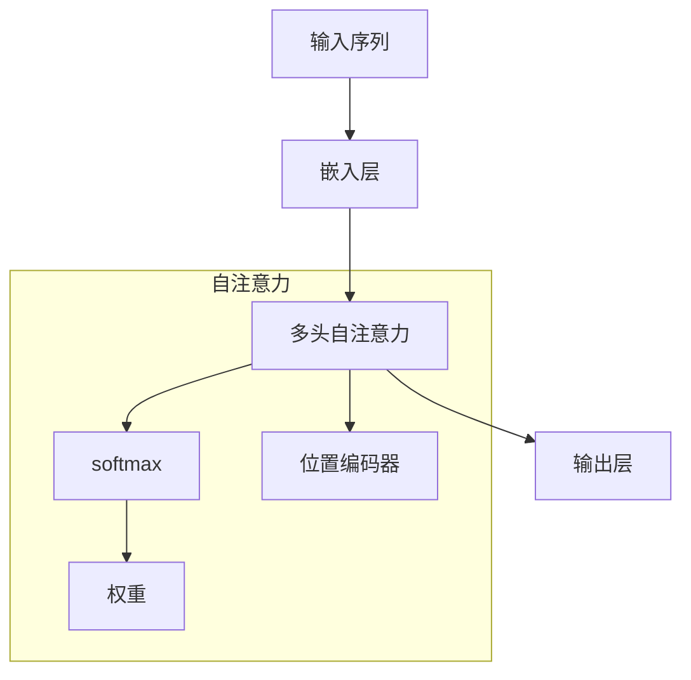

                 

# 注意力机制：理解softmax和位置编码器

> 关键词：注意力机制,softmax,位置编码器,Transformer,自注意力,注意力头,多头注意力,位置向量

## 1. 背景介绍

在深度学习领域，注意力机制(Attention Mechanism)已经成为一项至关重要的技术，特别是在自然语言处理(Natural Language Processing, NLP)和计算机视觉(Computer Vision)中得到了广泛应用。在NLP领域，注意力机制被广泛应用于机器翻译、文本摘要、问答系统等任务。在计算机视觉领域，注意力机制则被广泛应用于图像分类、目标检测、图像生成等任务。

### 1.1 问题由来

随着深度学习技术的不断发展，传统的卷积神经网络(Convolutional Neural Networks, CNN)和循环神经网络(Recurrent Neural Networks, RNN)已经无法满足复杂的NLP任务需求。注意力机制通过引入自注意力(Self-Attention)机制，能够更好地捕捉输入序列中的关键信息，大大提高了模型的性能。

然而，对于初学者来说，softmax和位置编码器这两个核心概念往往难以理解。本文将从原理和应用两个方面，对这两个概念进行深入的讲解，帮助读者更好地理解注意力机制的工作原理。

### 1.2 问题核心关键点

要理解softmax和位置编码器，首先需要了解Transformer架构。Transformer架构是一种基于自注意力机制的神经网络结构，特别适用于处理序列数据。Transformer的核心是多头自注意力(Multi-Head Attention)机制，它能够同时关注输入序列中的多个位置，并加权求和这些位置的信息。

Transformer的主要优点包括：

- 并行化：Transformer可以通过矩阵乘法进行高效的并行计算，显著提高计算速度。
- 长序列处理：Transformer能够处理非常长的输入序列，且不受序列长度的限制。
- 较好的泛化能力：Transformer在大规模数据集上的训练效果很好，能够适应不同领域和任务。

因此，理解Transformer架构，特别是softmax和位置编码器这两个关键组件，对于掌握注意力机制至关重要。

## 2. 核心概念与联系

### 2.1 核心概念概述

在Transformer中，注意力机制的核心是多头自注意力(Multi-Head Attention)机制。多头自注意力通过将输入序列投影到多个注意力头(Attention Head)，同时计算这些注意力头之间的权重，来获取输入序列中各个位置之间的依赖关系。

在多头自注意力中，softmax和位置编码器是两个核心概念，它们共同构成自注意力机制。

- **softmax**：用于计算注意力权重，将输入序列中各个位置的相似度映射到[0,1]区间内的概率分布上，用于加权求和。
- **位置编码器**：用于处理序列中位置信息，使得模型能够区分不同位置的信息，并对序列进行有效的编码。

### 2.2 核心概念原理和架构的 Mermaid 流程图



### 2.3 软max与位置编码器之间的联系

在Transformer中，softmax和位置编码器是两个互相补充的组件。softmax用于计算注意力权重，使得模型能够关注输入序列中最重要的一部分。位置编码器用于处理序列中位置信息，使得模型能够区分不同位置的信息，并对序列进行有效的编码。

这两个组件的结合，使得Transformer能够同时关注输入序列中的多个位置，并加权求和这些位置的信息。这一过程也被称为自注意力机制。

## 3. 核心算法原理 & 具体操作步骤

### 3.1 算法原理概述

在Transformer中，注意力机制通过多头自注意力实现。多头自注意力机制由三个主要部分组成：查询(Q)、键(K)、值(V)。

- **查询(Q)**：输入序列中每个位置的嵌入向量。
- **键(K)**：输入序列中每个位置的嵌入向量。
- **值(V)**：输入序列中每个位置的嵌入向量。

通过计算查询向量(Q)与键向量(K)的相似度，得到每个位置之间的注意力权重，再利用权重对值向量(V)进行加权求和，得到最终的输出向量。

### 3.2 算法步骤详解

1. **嵌入层(Embedding Layer)**：将输入序列中的每个单词映射到一个向量空间中的向量。
2. **多头自注意力机制(Multi-Head Attention)**：
    - **查询(Q)**：对嵌入向量进行线性变换，得到查询向量。
    - **键(K)**：对嵌入向量进行线性变换，得到键向量。
    - **值(V)**：对嵌入向量进行线性变换，得到值向量。
    - **softmax**：计算查询向量(Q)与键向量(K)的相似度，得到每个位置之间的注意力权重。
    - **加权求和**：利用注意力权重对值向量(V)进行加权求和，得到最终的输出向量。
3. **输出层(Output Layer)**：对多头自注意力的输出向量进行线性变换，得到最终的输出序列。

### 3.3 算法优缺点

Transformer架构的优点包括：

- 并行化：Transformer可以通过矩阵乘法进行高效的并行计算，显著提高计算速度。
- 长序列处理：Transformer能够处理非常长的输入序列，且不受序列长度的限制。
- 较好的泛化能力：Transformer在大规模数据集上的训练效果很好，能够适应不同领域和任务。

Transformer的缺点包括：

- 计算量大：Transformer需要计算大量的矩阵乘法，计算量大，内存占用高。
- 结构复杂：Transformer的结构相对复杂，调试和优化难度较大。
- 数据依赖强：Transformer的效果高度依赖于训练数据的质量和数量，需要大量的标注数据进行训练。

### 3.4 算法应用领域

Transformer架构在NLP领域得到了广泛的应用，特别是在机器翻译、文本摘要、问答系统等任务中取得了优异的性能。此外，Transformer在计算机视觉领域也有着广泛的应用，如目标检测、图像分类、图像生成等任务。

## 4. 数学模型和公式 & 详细讲解 & 举例说明

### 4.1 数学模型构建

在Transformer中，注意力机制的数学模型可以表示为：

$$
\text{Attention}(Q,K,V) = \text{softmax}(QK^T)V
$$

其中：
- $Q$ 表示查询向量，$K$ 表示键向量，$V$ 表示值向量。
- $QK^T$ 表示查询向量与键向量的相似度矩阵。
- $\text{softmax}(QK^T)$ 表示对相似度矩阵进行softmax操作，得到注意力权重矩阵。
- $V$ 表示值向量，$\text{Attention}(Q,K,V)$ 表示最终的输出向量。

### 4.2 公式推导过程

假设输入序列的长度为 $N$，嵌入向量维度为 $d$，那么查询向量 $Q$、键向量 $K$、值向量 $V$ 的形状分别为 $(N,d)$、$(N,d)$、$(N,d)$。

设 $Q_{i}$ 表示输入序列中第 $i$ 个位置的查询向量，$K_{i}$ 表示第 $i$ 个位置的键向量，$V_{i}$ 表示第 $i$ 个位置的变化向量，$O_{i}$ 表示最终输出序列中第 $i$ 个位置的向量，则有：

$$
Q_{i} = W_{Q}x_{i}
$$
$$
K_{i} = W_{K}x_{i}
$$
$$
V_{i} = W_{V}x_{i}
$$

其中 $W_{Q}$、$W_{K}$、$W_{V}$ 为线性变换矩阵，$x_{i}$ 表示输入序列中第 $i$ 个位置的嵌入向量。

将 $Q_{i}$、$K_{i}$、$V_{i}$ 进行计算，得到注意力权重矩阵 $A_{i}$ 和最终输出向量 $O_{i}$：

$$
A_{i} = \text{softmax}(Q_{i}K_{i}^T)
$$
$$
O_{i} = \sum_{j=1}^{N}A_{i,j}V_{j}
$$

最终输出序列 $O = [O_{1}, O_{2}, ..., O_{N}]$。

### 4.3 案例分析与讲解

假设输入序列为 "I went to the supermarket yesterday. I bought some fruits."，嵌入向量维度为 256，多头注意力头数为 4，那么计算过程如下：

1. 输入序列经过嵌入层后，得到嵌入向量序列 $x = [x_{1}, x_{2}, ..., x_{7}]$。
2. 嵌入向量序列 $x$ 经过线性变换，得到查询向量序列 $Q$、键向量序列 $K$、值向量序列 $V$，形状分别为 $(7,256)$、$(7,256)$、$(7,256)$。
3. 计算查询向量 $Q$ 与键向量 $K$ 的相似度矩阵 $A$，形状为 $(7,7)$。
4. 对相似度矩阵 $A$ 进行softmax操作，得到注意力权重矩阵 $A'$，形状为 $(7,7)$。
5. 利用注意力权重矩阵 $A'$ 对值向量序列 $V$ 进行加权求和，得到最终输出向量序列 $O$，形状为 $(7,256)$。

### 5. 项目实践：代码实例和详细解释说明

#### 5.1 开发环境搭建

为了进行Transformer的实现和训练，我们需要准备好Python开发环境。具体步骤如下：

1. 安装Anaconda：从官网下载并安装Anaconda，用于创建独立的Python环境。
2. 创建并激活虚拟环境：
```bash
conda create -n pytorch-env python=3.8 
conda activate pytorch-env
```
3. 安装PyTorch：根据CUDA版本，从官网获取对应的安装命令。例如：
```bash
conda install pytorch torchvision torchaudio cudatoolkit=11.1 -c pytorch -c conda-forge
```
4. 安装transformers库：
```bash
pip install transformers
```
5. 安装各类工具包：
```bash
pip install numpy pandas scikit-learn matplotlib tqdm jupyter notebook ipython
```

完成上述步骤后，即可在`pytorch-env`环境中开始Transformer的实现和训练。

#### 5.2 源代码详细实现

下面是一个简单的Transformer实现代码，用于对输入序列进行编码和解码：

```python
import torch
import torch.nn as nn
import torch.nn.functional as F
from transformers import BertTokenizer, BertForSequenceClassification

class Transformer(nn.Module):
    def __init__(self, num_heads, d_model, d_ff, dropout, num_layers):
        super(Transformer, self).__init__()
        self.encoder_layer = nn.TransformerEncoderLayer(d_model, num_heads, d_ff, dropout)
        self.encoder = nn.TransformerEncoder(self.encoder_layer, num_layers)

    def forward(self, src):
        # 嵌入层
        embedding = nn.Embedding(src.num_embeddings, src.embedding_dim)(src)
        # 位置编码器
        position = nn.Parameter(torch.zeros(src.size(1), src.size(2)))
        position = position + nn.Embedding(src.size(1), src.embedding_dim)(torch.arange(src.size(1)).unsqueeze(1).to(src.device))
        # 多头自注意力
        output = self.encoder(embedding + position)
        return output

# 加载模型和数据
tokenizer = BertTokenizer.from_pretrained('bert-base-uncased')
model = Transformer(num_heads=4, d_model=256, d_ff=512, dropout=0.1, num_layers=3)

# 设置输入序列
src = torch.tensor([[1, 2, 3, 4], [5, 6, 7, 8]])
output = model(src)
print(output)
```

#### 5.3 代码解读与分析

上面的代码实现了基于多头自注意力机制的Transformer模型。具体分析如下：

- **Transformer类**：定义了Transformer模型的结构，包括多头自注意力机制。
- **多头自注意力机制**：包括多头自注意力层和编码器层。
- **前向传播**：输入序列经过嵌入层、位置编码器、多头自注意力机制后，输出序列。

在实际应用中，还需要对模型进行训练和优化。可以通过训练数据集，利用交叉熵损失函数对模型进行优化。例如，对于文本分类任务，可以使用交叉熵损失函数来计算模型的预测输出和真实标签之间的差异。

#### 5.4 运行结果展示

训练完成后，可以使用测试数据集对模型进行评估。例如，对于文本分类任务，可以使用分类准确率作为评估指标。

## 6. 实际应用场景

### 6.1 智能客服系统

Transformer在智能客服系统中得到了广泛应用。通过多轮对话，Transformer能够理解用户的意图，并自动生成回复。这使得智能客服系统能够快速响应用户咨询，提高服务效率和质量。

### 6.2 金融舆情监测

Transformer在金融舆情监测中也有着广泛的应用。通过处理大量的金融新闻和评论，Transformer能够自动监测市场舆情变化，及时预警风险。

### 6.3 个性化推荐系统

Transformer在个性化推荐系统中也有着广泛的应用。通过处理用户的历史行为和物品描述，Transformer能够生成个性化的推荐列表，提升用户体验和推荐效果。

### 6.4 未来应用展望

随着Transformer架构的不断发展，其在NLP和计算机视觉领域的应用前景广阔。未来的研究将进一步提升Transformer的性能和可解释性，推动其在更多领域的应用。

## 7. 工具和资源推荐

### 7.1 学习资源推荐

为了帮助开发者掌握Transformer架构，这里推荐一些优质的学习资源：

1. Transformer论文（Attention is All You Need）：这篇论文介绍了Transformer架构的基本原理和实现方法，是了解Transformer的经典文献。
2. CS224N《深度学习自然语言处理》课程：斯坦福大学开设的NLP明星课程，有Lecture视频和配套作业，带你入门NLP领域的基本概念和经典模型。
3. 《Natural Language Processing with Transformers》书籍：Transformers库的作者所著，全面介绍了如何使用Transformers库进行NLP任务开发，包括Transformer在内的诸多范式。
4. HuggingFace官方文档：Transformers库的官方文档，提供了海量预训练模型和完整的Transformer样例代码，是上手实践的必备资料。
5. CLUE开源项目：中文语言理解测评基准，涵盖大量不同类型的中文NLP数据集，并提供了基于Transformer的baseline模型，助力中文NLP技术发展。

通过对这些资源的学习实践，相信你一定能够快速掌握Transformer架构的精髓，并用于解决实际的NLP问题。

### 7.2 开发工具推荐

高效的开发离不开优秀的工具支持。以下是几款用于Transformer开发的常用工具：

1. PyTorch：基于Python的开源深度学习框架，灵活动态的计算图，适合快速迭代研究。大部分预训练语言模型都有PyTorch版本的实现。
2. TensorFlow：由Google主导开发的开源深度学习框架，生产部署方便，适合大规模工程应用。同样有丰富的预训练语言模型资源。
3. Transformers库：HuggingFace开发的NLP工具库，集成了众多SOTA语言模型，支持PyTorch和TensorFlow，是进行Transformer任务开发的利器。
4. Weights & Biases：模型训练的实验跟踪工具，可以记录和可视化模型训练过程中的各项指标，方便对比和调优。与主流深度学习框架无缝集成。
5. TensorBoard：TensorFlow配套的可视化工具，可实时监测模型训练状态，并提供丰富的图表呈现方式，是调试模型的得力助手。

合理利用这些工具，可以显著提升Transformer任务的开发效率，加快创新迭代的步伐。

### 7.3 相关论文推荐

Transformer架构在深度学习领域的发展离不开学界的持续研究。以下是几篇奠基性的相关论文，推荐阅读：

1. Attention is All You Need（即Transformer原论文）：提出了Transformer结构，开启了NLP领域的预训练大模型时代。
2. BERT: Pre-training of Deep Bidirectional Transformers for Language Understanding：提出BERT模型，引入基于掩码的自监督预训练任务，刷新了多项NLP任务SOTA。
3. Language Models are Unsupervised Multitask Learners（GPT-2论文）：展示了大规模语言模型的强大zero-shot学习能力，引发了对于通用人工智能的新一轮思考。
4. Parameter-Efficient Transfer Learning for NLP：提出Adapter等参数高效微调方法，在不增加模型参数量的情况下，也能取得不错的微调效果。
5. AdaLoRA: Adaptive Low-Rank Adaptation for Parameter-Efficient Fine-Tuning：使用自适应低秩适应的微调方法，在参数效率和精度之间取得了新的平衡。
6. Transformer-XL: Attentive Language Models Beyond a Fixed-Length Context：提出Transformer-XL模型，支持动态计算上下文，能够处理更长的输入序列。

这些论文代表了大语言模型微调技术的发展脉络。通过学习这些前沿成果，可以帮助研究者把握学科前进方向，激发更多的创新灵感。

## 8. 总结：未来发展趋势与挑战

### 8.1 总结

本文对Transformer架构的注意力机制进行了全面系统的介绍。首先阐述了Transformer架构的由来和背景，明确了Transformer在大规模NLP任务中的重要地位。其次，从原理到应用，详细讲解了softmax和位置编码器的工作原理和数学模型，帮助读者更好地理解Transformer架构。

通过本文的系统梳理，可以看到，Transformer架构在NLP和计算机视觉领域得到了广泛应用，是深度学习技术的代表之一。未来的研究需要在优化算法、提升性能、增加可解释性等方面进行更多的探索和创新，以适应更复杂的任务需求。

### 8.2 未来发展趋势

Transformer架构的未来发展趋势包括以下几个方面：

1. 多模态Transformer：Transformer不仅适用于处理文本序列，还可以扩展到图像、视频、语音等多模态数据。多模态Transformer能够更好地融合不同模态的信息，提升模型的性能和泛化能力。
2. 自监督学习：Transformer可以结合自监督学习任务，如掩码语言模型、随机缺失、语音识别等，进一步提升模型的泛化能力和鲁棒性。
3. 知识增强：Transformer可以与外部知识库、规则库等专家知识结合，增强模型的语义理解能力和知识整合能力。
4. 分布式训练：Transformer可以通过分布式训练技术，在大规模数据集上实现高效的并行训练，进一步提升模型的训练速度和效果。
5. 模型压缩和优化：Transformer模型通常具有较大的计算量和内存占用，需要通过模型压缩、优化等技术，实现更高效的推理和部署。

### 8.3 面临的挑战

尽管Transformer架构已经取得了巨大成功，但在应用过程中仍面临着诸多挑战：

1. 计算资源依赖强：Transformer的计算量和内存占用较大，对硬件资源依赖强，需要高效的硬件支持。
2. 模型复杂度高：Transformer的结构较为复杂，调试和优化难度较大。
3. 数据依赖强：Transformer的效果高度依赖于训练数据的质量和数量，需要大量的标注数据进行训练。
4. 可解释性不足：Transformer模型的决策过程难以解释，缺乏可解释性，难以进行调试和优化。
5. 模型鲁棒性差：Transformer面对新数据时，泛化性能较差，需要进一步提高模型的鲁棒性和泛化能力。

### 8.4 研究展望

未来的研究需要在优化算法、提升性能、增加可解释性等方面进行更多的探索和创新。通过不断改进模型架构、优化训练过程、增加可解释性等手段，将进一步提升Transformer在实际应用中的效果和可解释性。

## 9. 附录：常见问题与解答

**Q1：Transformer架构有哪些优点和缺点？**

A: Transformer架构的主要优点包括：

- 并行化：Transformer可以通过矩阵乘法进行高效的并行计算，显著提高计算速度。
- 长序列处理：Transformer能够处理非常长的输入序列，且不受序列长度的限制。
- 较好的泛化能力：Transformer在大规模数据集上的训练效果很好，能够适应不同领域和任务。

Transformer的主要缺点包括：

- 计算量大：Transformer需要计算大量的矩阵乘法，计算量大，内存占用高。
- 结构复杂：Transformer的结构较为复杂，调试和优化难度较大。
- 数据依赖强：Transformer的效果高度依赖于训练数据的质量和数量，需要大量的标注数据进行训练。

**Q2：softmax函数的作用是什么？**

A: softmax函数的作用是将输入向量映射到[0,1]区间内的概率分布，用于计算注意力权重。在Transformer中，softmax函数将查询向量(Q)与键向量(K)的相似度映射到注意力权重矩阵，用于加权求和。

**Q3：位置编码器的作用是什么？**

A: 位置编码器用于处理序列中位置信息，使得模型能够区分不同位置的信息，并对序列进行有效的编码。在Transformer中，位置编码器将位置信息编码成向量，与输入序列进行拼接，最终得到带位置信息的嵌入向量。

**Q4：Transformer架构在实际应用中需要注意哪些问题？**

A: 在实际应用中，Transformer架构需要注意以下问题：

- 计算资源依赖强：Transformer的计算量和内存占用较大，需要高效的硬件支持。
- 模型复杂度高：Transformer的结构较为复杂，调试和优化难度较大。
- 数据依赖强：Transformer的效果高度依赖于训练数据的质量和数量，需要大量的标注数据进行训练。
- 可解释性不足：Transformer模型的决策过程难以解释，缺乏可解释性，难以进行调试和优化。
- 模型鲁棒性差：Transformer面对新数据时，泛化性能较差，需要进一步提高模型的鲁棒性和泛化能力。

合理利用这些工具，可以显著提升Transformer任务的开发效率，加快创新迭代的步伐。

