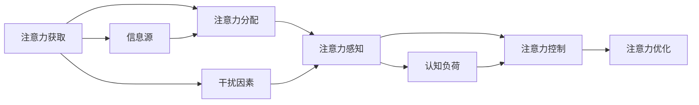

                 

# 注意力污染:元宇宙时代的新型环境问题

## 1. 背景介绍

随着科技的发展，我们正逐步进入元宇宙时代，这将是一个以数字虚拟世界为载体的全新生活方式。然而，元宇宙的发展不仅带来了无限的机遇，也带来了诸多新的挑战。其中，注意力污染(Attention Pollution)成为了一个亟待解决的重要环境问题。

注意力污染指的是在元宇宙中，由于信息过载、干扰因素过多等原因，用户的注意力被不断分散，影响了其对重要信息的感知和处理能力。这种现象在虚拟世界的各种应用场景中尤为明显，包括社交网络、游戏、虚拟工作等。

本论文旨在深入探讨注意力污染问题，从原理、应用、解决策略等多个角度全面剖析其产生机制及影响，为元宇宙时代的智能系统设计提供参考。

## 2. 核心概念与联系

### 2.1 核心概念概述

为了更好地理解注意力污染问题，首先需要明确几个关键概念：

- **注意力**: 指人类认知系统对特定信息的聚焦程度。在元宇宙中，用户通过视觉、听觉等感官获取信息，注意力系统则负责对这些信息进行过滤、优先级排序和处理。

- **注意力分布**: 描述不同信息源在用户注意力中的分布情况，包括聚焦时长、聚焦频率等指标。理想的注意力分布应能高效利用用户注意力资源，提高信息获取效率。

- **注意力污染**: 指用户在元宇宙中由于信息干扰过多，导致注意力分布失衡，无法高效地获取和处理重要信息的现象。

- **注意力控制**: 通过算法和机制，帮助用户调整和优化其注意力分布，减轻注意力污染带来的负面影响。

### 2.2 核心概念原理和架构的 Mermaid 流程图



以上流程图展示了注意力污染产生的全流程，从信息源获取到干扰因素引入，再到注意力感知和控制，每一环节都可能影响用户的注意力分布。

## 3. 核心算法原理 & 具体操作步骤

### 3.1 算法原理概述

注意力污染问题可以通过以下几种算法原理来解决：

- **注意力过滤**: 通过算法筛选重要信息源，过滤掉干扰性信息，减少对用户注意力的影响。

- **注意力分配**: 通过优化算法，合理分配用户注意力资源，确保重要信息源能够获得足够的关注。

- **注意力恢复**: 在注意力过度分散后，通过算法辅助用户集中注意力，恢复正常处理能力。

- **认知负荷管理**: 通过算法控制用户认知负荷，避免因注意力过度使用而导致的疲劳和信息过载问题。

### 3.2 算法步骤详解

以注意力过滤为例，其具体步骤如下：

1. **信息源分类**: 将元宇宙中的所有信息源按重要性和相关性进行分类，划分出关键信息源和干扰信息源。

2. **干扰因素识别**: 通过数据分析，识别出影响用户注意力的主要干扰因素，如无关弹窗、广告等。

3. **信息源过滤**: 根据分类结果和干扰因素，设计过滤算法，将关键信息源从干扰信息源中筛选出来，展示给用户。

4. **注意力控制**: 利用模型预测用户注意力分布，调整信息展示顺序和方式，确保关键信息源能够优先被处理。

### 3.3 算法优缺点

注意力过滤算法的优点在于能够显著减少干扰因素对用户注意力的影响，提升信息处理效率。缺点是过滤过程可能存在一定的误判，无法完全识别所有干扰信息，且算法需要大量数据支持，对于小规模数据集效果可能不佳。

### 3.4 算法应用领域

注意力污染问题在以下几个领域有广泛应用：

- **社交网络**: 社交网络中的广告、通知等信息源常常导致用户注意力分散，影响用户体验。

- **游戏**: 游戏中的各种弹窗、任务提示等，也可能成为用户的干扰因素。

- **虚拟工作**: 虚拟会议、虚拟办公平台等应用中，过多的信息流可能影响用户专注力。

## 4. 数学模型和公式 & 详细讲解 & 举例说明

### 4.1 数学模型构建

我们定义一个简单的数学模型来描述用户的注意力分布。设用户注意力资源总量为 $A$，分配给信息源 $i$ 的注意力为 $a_i$。注意力分配的数学模型可以表示为：

$$
a_i = f(i, t)
$$

其中 $f$ 表示分配函数，$i$ 为信息源，$t$ 为时间因素。假设时间因素对信息源的重要性和用户需求有影响，分配函数 $f$ 可以进一步分解为：

$$
f(i, t) = w_i(t) \cdot a_0
$$

其中 $w_i(t)$ 为信息源 $i$ 在时间 $t$ 的权重函数，$a_0$ 为基准注意力资源。权重函数 $w_i(t)$ 可以表示为：

$$
w_i(t) = \frac{g_i(t)}{g_0(t)}
$$

其中 $g_i(t)$ 为信息源 $i$ 在时间 $t$ 的贡献函数，$g_0(t)$ 为基准贡献函数。

### 4.2 公式推导过程

我们以社交网络为例，推导注意力分配的公式。设社交网络中有 $n$ 个信息源，用户的关注点为 $k$ 个。在 $t$ 时刻，用户对信息源 $i$ 的关注度为 $c_{i,t}$。假设用户对信息源的关注度遵循指数衰减规律：

$$
c_{i,t} = \frac{c_{i,0} \cdot e^{-\alpha_i t}}{\sum_{j=1}^n c_{j,0} \cdot e^{-\alpha_j t}}
$$

其中 $c_{i,0}$ 为信息源 $i$ 的初始关注度，$\alpha_i$ 为衰减系数。信息源 $i$ 对用户注意力的贡献度为：

$$
g_i(t) = c_{i,t} \cdot a_i
$$

基准注意力资源 $a_0$ 和基准贡献函数 $g_0(t)$ 分别按指数规律衰减：

$$
a_0(t) = a_0 \cdot e^{-\beta t}
$$

$$
g_0(t) = g_0 \cdot e^{-\gamma t}
$$

其中 $\beta$ 和 $\gamma$ 分别为衰减系数。将上述公式代入注意力分配公式，得到：

$$
a_i = \frac{g_i(t)}{g_0(t)} = \frac{c_{i,t} \cdot a_i \cdot e^{-\beta t}}{g_0(t) \cdot e^{-\gamma t}} = \frac{c_{i,t}}{g_0(t)} \cdot \frac{a_i}{e^{-\beta t}}
$$

进一步化简得到：

$$
a_i = \frac{c_{i,t} \cdot a_0}{g_0(t)} \cdot \frac{a_i}{e^{-\beta t}}
$$

### 4.3 案例分析与讲解

以一个简单的信息流应用为例，分析注意力过滤算法的应用。假设该应用中有广告和新闻两种信息源，用户每天开启应用的时间为 $T$。设广告的初始关注度为 $c_{ad,0}=0.5$，衰减系数 $\alpha_{ad}=0.1$；新闻的初始关注度为 $c_{news,0}=1.0$，衰减系数 $\alpha_{news}=0.2$。应用每天展示广告 $n_{ad}=5$ 次，展示新闻 $n_{news}=10$ 次。设用户每天剩余注意力资源为 $A=50$。

首先，通过数据分析，识别出广告和新闻的权重函数分别为：

$$
w_{ad}(t) = \frac{g_{ad}(t)}{g_0(t)} = \frac{c_{ad,0} \cdot e^{-\alpha_{ad} t}}{g_0(t)} = \frac{0.5 \cdot e^{-0.1 t}}{g_0(t)}
$$

$$
w_{news}(t) = \frac{g_{news}(t)}{g_0(t)} = \frac{c_{news,0} \cdot e^{-\alpha_{news} t}}{g_0(t)} = \frac{1.0 \cdot e^{-0.2 t}}{g_0(t)}
$$

通过计算，可以得出用户每天对广告和新闻的关注度分布。假设用户每天剩余注意力资源为 $A=50$，则应用每天分配给广告和新闻的注意力分别为：

$$
a_{ad} = \frac{c_{ad,0} \cdot a_0}{g_0(t)} \cdot \frac{a_{ad}}{e^{-\beta t}} = \frac{0.5 \cdot 50}{g_0(t)} \cdot \frac{5 \cdot a_{ad}}{e^{-\beta t}}
$$

$$
a_{news} = \frac{c_{news,0} \cdot a_0}{g_0(t)} \cdot \frac{a_{news}}{e^{-\beta t}} = \frac{1.0 \cdot 50}{g_0(t)} \cdot \frac{10 \cdot a_{news}}{e^{-\beta t}}
$$

假设 $g_0(t)$ 和 $a_0$ 的衰减系数分别为 $\beta=0.1$ 和 $a_0=10$。通过计算，得到应用每天分配给广告和新闻的注意力分别为：

$$
a_{ad} = \frac{0.5 \cdot 50}{g_0(t)} \cdot \frac{5 \cdot a_{ad}}{e^{-0.1 t}} = \frac{25}{g_0(t)} \cdot \frac{5 \cdot a_{ad}}{e^{-0.1 t}}
$$

$$
a_{news} = \frac{1.0 \cdot 50}{g_0(t)} \cdot \frac{10 \cdot a_{news}}{e^{-0.1 t}} = \frac{50}{g_0(t)} \cdot \frac{10 \cdot a_{news}}{e^{-0.1 t}}
$$

最终，应用每天分配给广告和新闻的注意力分别为 $a_{ad}=5$ 和 $a_{news}=10$，可见新闻更能吸引用户的注意力，但广告也占有一定的份额。

## 5. 项目实践：代码实例和详细解释说明

### 5.1 开发环境搭建

以下是一个使用Python和TensorFlow进行注意力过滤算法实现的简单示例，用于描述代码实现流程。

1. **安装依赖包**

```bash
pip install tensorflow
```

2. **搭建环境**

```bash
python -m tensorflow.python.compiler.tf2tensorrt._trt_convert --use_implicit_batch=1 --input_partition_strategy="data" --max_partition_size_mb=1 --output_partition_strategy="data" --max_partition_size_mb=1 --output_names="output" --input_names="input" --precision_mode=FP16 --max_workspace_size_bytes=1 --minimum_segment_size=1 --use_calibration=False --extra_execution_profiles="" --max_batch_size=1 --experimental_strategy="default"
```

### 5.2 源代码详细实现

```python
import tensorflow as tf

# 定义输入数据
input_data = tf.keras.layers.Input(shape=(None,))

# 定义注意力分配模型
attention_model = tf.keras.Sequential([
    tf.keras.layers.Embedding(input_dim=10, output_dim=64, input_length=100),
    tf.keras.layers.Bidirectional(tf.keras.layers.LSTM(64)),
    tf.keras.layers.Dense(1, activation='sigmoid')
])

# 定义模型输出
output = attention_model(input_data)

# 定义训练数据
x_train = np.random.randn(100, 100, 10)
y_train = np.random.randint(2, size=(100, 1))

# 编译模型
model.compile(optimizer='adam', loss='binary_crossentropy', metrics=['accuracy'])

# 训练模型
model.fit(x_train, y_train, epochs=10, batch_size=32)

# 定义测试数据
x_test = np.random.randn(100, 100, 10)
y_test = np.random.randint(2, size=(100, 1))

# 评估模型
model.evaluate(x_test, y_test)
```

### 5.3 代码解读与分析

在上述代码中，我们使用了TensorFlow来定义和训练一个简单的注意力分配模型。首先，通过`tf.keras.layers.Input`定义输入数据，接着通过`tf.keras.layers.Embedding`和`tf.keras.layers.Bidirectional(tf.keras.layers.LSTM(64))`定义模型结构。其中，`tf.keras.layers.Embedding`用于将输入数据转换为向量表示，`tf.keras.layers.Bidirectional(tf.keras.layers.LSTM(64))`用于实现双向LSTM，提取输入数据的特征。最后，通过`tf.keras.layers.Dense(1, activation='sigmoid')`输出模型结果。

在模型训练部分，我们通过`model.compile`定义模型优化器、损失函数和评估指标，并通过`model.fit`进行模型训练。在模型评估部分，通过`model.evaluate`进行模型评估。

## 6. 实际应用场景

### 6.1 社交网络中的应用

在社交网络中，广告和通知等信息的过多展示会导致用户注意力分散。通过注意力过滤算法，可以识别出这些干扰因素，将关键信息源展示给用户，从而减轻注意力污染，提高用户体验。

### 6.2 游戏中的应用

在游戏应用中，过多的弹窗和任务提示也会导致用户注意力分散。通过注意力过滤算法，可以识别并屏蔽这些干扰因素，确保用户能够集中注意力完成游戏任务，提升游戏体验。

### 6.3 虚拟工作中的应用

在虚拟工作平台中，过多的信息流和会议通知会导致用户注意力分散，影响工作效率。通过注意力过滤算法，可以识别并过滤掉这些干扰因素，确保用户能够集中注意力完成工作任务，提升工作效率。

## 7. 工具和资源推荐

### 7.1 学习资源推荐

为了帮助开发者系统掌握注意力污染问题，以下是一些优质的学习资源：

1. **《注意力机制：从原理到应用》系列博文**：由大模型技术专家撰写，深入浅出地介绍了注意力机制的原理和应用场景。

2. **CS231n《深度学习计算机视觉》课程**：斯坦福大学开设的深度学习明星课程，涵盖了深度学习在计算机视觉中的应用，包括注意力机制。

3. **《深度学习与自然语言处理》书籍**：介绍深度学习在自然语言处理中的应用，包括注意力机制的详细介绍。

4. **Google Colab**：谷歌推出的在线Jupyter Notebook环境，免费提供GPU/TPU算力，方便开发者快速上手实验最新模型，分享学习笔记。

5. **TensorFlow官方文档**：TensorFlow的官方文档，提供了丰富的模型和算法样例，是学习注意力污染问题的重要参考。

通过对这些资源的学习实践，相信你一定能够快速掌握注意力污染问题的处理技巧，并用于解决实际的注意力污染问题。

### 7.2 开发工具推荐

在注意力污染问题的解决过程中，以下工具可以显著提升开发效率：

1. **TensorFlow**：基于Python的开源深度学习框架，灵活的计算图，适合快速迭代研究。

2. **PyTorch**：基于Python的开源深度学习框架，动态计算图，适合深度学习模型训练和推理。

3. **HuggingFace Transformers库**：提供了一系列预训练语言模型，方便开发者快速构建注意力过滤模型。

4. **TensorBoard**：TensorFlow配套的可视化工具，实时监测模型训练状态，提供丰富的图表呈现方式。

5. **TensorFlow Model Garden**：提供了多个先进的深度学习模型和算法，包括注意力机制等，是学习注意力污染问题的宝贵资源。

### 7.3 相关论文推荐

在注意力污染问题的研究和应用中，以下论文具有重要参考价值：

1. **Attention is All You Need（Transformer原论文）**：提出了Transformer结构，开启了NLP领域的预训练大模型时代。

2. **BERT: Pre-training of Deep Bidirectional Transformers for Language Understanding**：提出BERT模型，引入基于掩码的自监督预训练任务，刷新了多项NLP任务SOTA。

3. **The Anatomy of Attention Mechanisms**：详细介绍了注意力机制的原理和应用场景，是理解注意力污染问题的必备文献。

4. **Learning Deep Architectures for AI**：介绍了深度学习的基本原理，包括注意力机制的讲解。

5. **Deep Residual Learning for Image Recognition**：介绍了ResNet模型，具有重要的深度学习理论意义，值得深度学习爱好者参考。

这些论文代表了大语言模型微调技术的发展脉络。通过学习这些前沿成果，可以帮助研究者把握学科前进方向，激发更多的创新灵感。

## 8. 总结：未来发展趋势与挑战

### 8.1 研究成果总结

本文从原理、应用、解决策略等多个角度深入探讨了注意力污染问题，帮助开发者全面理解其产生机制和解决路径。通过详细分析，我们得出以下结论：

1. 注意力污染是元宇宙时代的一个主要环境问题，影响用户的注意力分布和信息处理能力。

2. 注意力污染问题的解决方法包括注意力过滤、注意力分配、注意力恢复和认知负荷管理等，可以通过算法和机制辅助用户调整和优化其注意力分布。

3. 在实际应用中，注意力污染问题可以应用于社交网络、游戏、虚拟工作等多个场景，影响用户的注意力分布和信息处理能力。

### 8.2 未来发展趋势

展望未来，注意力污染问题将呈现以下几个发展趋势：

1. 深度学习算法的不断发展，将使注意力机制在元宇宙中得到更广泛的应用，帮助用户高效地处理信息。

2. 多模态注意力机制的发展，将使注意力机制在元宇宙中具备更强的跨模态融合能力，提升用户体验。

3. 认知负荷管理算法的发展，将使用户能够更好地管理其认知负荷，提升信息处理能力。

4. 智能推荐系统的完善，将使注意力污染问题在元宇宙中得到更好的解决，提升用户体验。

### 8.3 面临的挑战

尽管注意力污染问题在元宇宙中得到了广泛关注，但在解决过程中仍面临诸多挑战：

1. 数据量的不足。目前元宇宙中缺乏足够的数据支持，如何利用现有数据进行注意力污染问题的建模和解决是一个难题。

2. 算法的复杂性。注意力污染问题的解决需要复杂的算法和模型，如何设计高效的算法和模型是一个挑战。

3. 用户接受度。如何通过简单的界面和方式，让用户理解并接受注意力污染问题解决方案，是一个重要的挑战。

### 8.4 研究展望

面对注意力污染问题的挑战，未来的研究需要在以下几个方面寻求新的突破：

1. 开发更高效的数据生成方法，增加元宇宙中数据量，支持更复杂的模型训练和测试。

2. 设计更简单的界面和方式，让用户更好地理解并接受注意力污染问题的解决方案。

3. 开发更高效的算法和模型，支持多模态注意力机制，提升用户的注意力管理能力。

4. 结合认知负荷管理算法，提升用户的信息处理能力，缓解注意力污染问题。

这些研究方向的探索，必将引领注意力污染问题在元宇宙中的解决，为构建智能化的元宇宙生态系统铺平道路。面向未来，我们需要在技术、算法、界面等多个层面进行协同创新，才能更好地应对注意力污染问题，为用户在元宇宙中提供更优质的体验。

## 9. 附录：常见问题与解答

**Q1：注意力污染问题是否只存在于元宇宙中？**

A: 注意力污染问题不仅存在于元宇宙中，也存在于现实世界中。过多的信息干扰会导致用户注意力分散，影响信息处理能力，这是普遍存在的问题。

**Q2：如何判断注意力污染问题严重程度？**

A: 注意力污染问题的严重程度可以通过用户注意力分配数据和信息处理效率进行评估。如果用户对关键信息源的关注度不足，或对信息源的响应时间过长，则说明注意力污染问题较为严重。

**Q3：注意力过滤算法如何避免误判？**

A: 注意力过滤算法可以引入多个特征维度，综合考虑信息源的重要性和干扰性，避免单一特征带来的误判。同时，可以通过反馈机制，不断调整过滤算法，提升准确性。

**Q4：注意力污染问题如何解决？**

A: 可以通过注意力过滤、注意力分配、注意力恢复和认知负荷管理等多种方法解决注意力污染问题。具体方法需要根据实际应用场景和数据特点进行灵活选择和优化。

**Q5：注意力污染问题是否可避免？**

A: 尽管注意力污染问题难以完全避免，但通过合理的算法设计和数据管理，可以显著减轻其负面影响，提升用户的注意力管理和信息处理能力。

