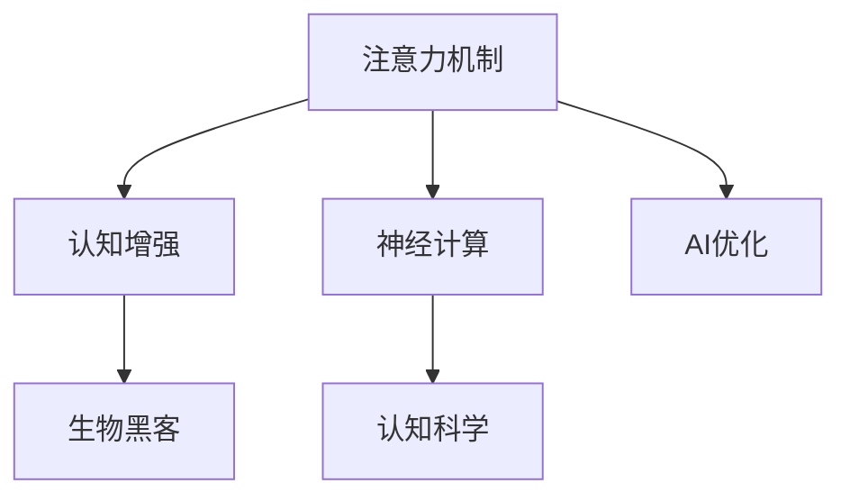

                 

# 注意力生物黑客工作室：AI优化的认知增强中心

> 关键词：注意力生物黑客,认知增强,AI优化,认知科学,神经计算

## 1. 背景介绍

### 1.1 问题由来
在信息爆炸和人工智能迅猛发展的今天，如何提高认知能力和效率已成为亟待解决的问题。当前，人类面临的信息量和复杂度不断增加，传统的认知过程已难以应对。认知增强技术因此应运而生，通过增强人的感知、记忆、推理等能力，帮助人类更好地适应快速变化的信息环境。

在认知增强领域，AI技术扮演着越来越重要的角色。特别是近年来，深度学习和神经网络的发展，使得AI系统在视觉、听觉、语言理解等方面取得了显著进步，为认知增强提供了新的突破点。其中，注意力机制（Attention Mechanism）作为神经网络的核心组件，因其能自动关注输入数据的关键部分，极大提高了模型的性能和效率，被广泛应用于各类认知增强任务中。

### 1.2 问题核心关键点
注意力机制的原理是什么？如何在大脑中模拟注意力？如何将注意力应用于认知增强？本文将聚焦于这些核心问题，探讨如何通过AI优化，实现大脑与计算机系统的深度协同，构建高效的认知增强中心。

## 2. 核心概念与联系

### 2.1 核心概念概述

为更好地理解注意力生物黑客工作室，本节将介绍几个密切相关的核心概念：

- 注意力机制（Attention Mechanism）：神经网络中的一种机制，用于动态调整输入数据的重要程度，使得模型关注关键信息，忽略无关内容。
- 认知增强（Cognitive Enhancement）：通过技术手段提高人类感知、记忆、推理等认知能力的过程。
- 神经计算（Neural Computing）：模拟人类神经系统的计算过程，实现信息的高效处理和认知增强。
- 认知科学（Cognitive Science）：研究人类认知过程及其计算模型的科学，旨在揭示智能的生物学基础。
- 生物黑客（Biohacking）：通过技术手段优化大脑功能，改善人的认知能力，提升生活质量。

这些核心概念之间的逻辑关系可以通过以下Mermaid流程图来展示：



这个流程图展示了几者之间的紧密联系：

1. 注意力机制是神经计算和认知增强的基础。
2. 通过AI优化，可以增强注意力机制的效率和效果。
3. 认知科学揭示了注意力机制的生物学原理，提供了理论支持。
4. 生物黑客将认知增强技术应用于人体，实现了技术对人脑的优化。

## 3. 核心算法原理 & 具体操作步骤
### 3.1 算法原理概述

注意力机制的核心思想是：在处理序列数据时，动态地关注输入序列中的关键部分，忽略无关内容，从而提升模型的性能和效率。其基本原理可以分为以下几步：

1. **编码器（Encoder）**：将输入序列转换为固定长度的向量表示。
2. **注意力层（Attention Layer）**：计算输入序列中每个位置的注意力权重，确定哪些位置的信息最为重要。
3. **解码器（Decoder）**：根据注意力权重，对编码器输出的向量进行加权平均，得到加权后的表示。

在数学上，注意力层通常通过一个注意力矩阵 $A$ 来计算，矩阵 $A$ 的元素 $a_{i,j}$ 表示位置 $j$ 对位置 $i$ 的注意力权重，满足：
$$
a_{i,j} = \frac{\exp(z_{i,j})}{\sum_k \exp(z_{i,k})}
$$
其中 $z_{i,j}$ 为位置 $i$ 和 $j$ 之间的注意力得分。通常 $z_{i,j}$ 是位置 $i$ 和 $j$ 向量的相似度，如点积或余弦相似度。

注意力机制的引入，使得模型能够自动学习输入数据中重要的特征，从而提高模型的泛化能力和效率。其在机器翻译、语音识别、图像分类等任务中都有广泛应用，展示了强大的性能提升潜力。

### 3.2 算法步骤详解

以下是详细描述注意力机制的计算步骤：

**Step 1: 编码器（Encoder）**

假设输入序列为 $x=\{x_1, x_2, ..., x_n\}$，每个元素 $x_i$ 是一个长度为 $d$ 的向量。使用一个神经网络将每个元素 $x_i$ 映射到一个长度为 $d_e$ 的向量 $e_i$，得到编码器输出 $E$：
$$
E = \{e_1, e_2, ..., e_n\}
$$

**Step 2: 注意力层（Attention Layer）**

在注意力层中，通过计算注意力矩阵 $A$，将编码器输出 $E$ 与输入 $x$ 之间的注意力权重进行计算。假设注意力矩阵为 $A \in \mathbb{R}^{n \times n}$，其中元素 $a_{i,j}$ 表示位置 $j$ 对位置 $i$ 的注意力权重。注意力矩阵的计算公式为：
$$
a_{i,j} = \frac{\exp(z_{i,j})}{\sum_k \exp(z_{i,k})}
$$
其中 $z_{i,j} = \langle e_i, x_j \rangle$，表示位置 $i$ 的向量 $e_i$ 与位置 $j$ 的输入 $x_j$ 的相似度，通常使用点积或余弦相似度计算。

**Step 3: 解码器（Decoder）**

根据注意力矩阵 $A$，对编码器输出 $E$ 进行加权平均，得到解码器输入 $c$：
$$
c = \sum_k a_{i,k}e_k
$$
其中 $c$ 是长度为 $d_e$ 的向量，表示解码器的输入。解码器可以通过使用这个加权平均后的向量 $c$，进一步输出预测结果。

### 3.3 算法优缺点

注意力机制在认知增强和神经计算中有着显著的优势：

- **高效性**：通过动态选择关键信息，提高了模型的泛化能力和效率。
- **鲁棒性**：能够自动适应输入数据的变化，提升了模型的鲁棒性。
- **适应性**：能够处理不同长度和结构的输入数据，适用于多种任务。

同时，注意力机制也存在一些局限：

- **计算复杂度高**：注意力层的计算复杂度较高，特别是在大规模数据集上。
- **参数依赖性强**：需要调参以确定注意力得分函数，如点积或余弦相似度。
- **注意力分配不稳定**：注意力权重可能不稳定，导致模型输出波动。

为了克服这些缺点，研究者提出了多种改进方法，如多头注意力机制、自适应注意力、梯度聚合等，以进一步提升注意力机制的性能。

### 3.4 算法应用领域

注意力机制在认知增强和神经计算中有着广泛的应用：

- **机器翻译**：在序列到序列的任务中，通过注意力机制，模型可以关注源语言的每个词，并生成对应的目标语言词。
- **语音识别**：通过注意力机制，模型可以动态地关注音频信号的关键部分，识别出语音内容。
- **图像分类**：在视觉任务中，注意力机制可以识别图像中关键区域，提高分类准确性。
- **推荐系统**：在推荐任务中，注意力机制可以动态地关注用户的历史行为，生成个性化的推荐结果。
- **游戏AI**：在强化学习任务中，注意力机制可以关注当前游戏状态的关键部分，提高决策能力。

以上领域的应用展示了注意力机制的强大潜力，未来将会在更多复杂任务中发挥关键作用。

## 4. 数学模型和公式 & 详细讲解  
### 4.1 数学模型构建

本节将使用数学语言对注意力机制的计算过程进行更加严格的刻画。

记输入序列为 $x=\{x_1, x_2, ..., x_n\}$，每个元素 $x_i$ 是一个长度为 $d$ 的向量。假设使用神经网络将每个元素 $x_i$ 映射到一个长度为 $d_e$ 的向量 $e_i$，得到编码器输出 $E=\{e_1, e_2, ..., e_n\}$。

定义注意力矩阵 $A \in \mathbb{R}^{n \times n}$，其中元素 $a_{i,j}$ 表示位置 $j$ 对位置 $i$ 的注意力权重。注意力矩阵的计算公式为：
$$
a_{i,j} = \frac{\exp(z_{i,j})}{\sum_k \exp(z_{i,k})}
$$
其中 $z_{i,j} = \langle e_i, x_j \rangle$，表示位置 $i$ 的向量 $e_i$ 与位置 $j$ 的输入 $x_j$ 的相似度，通常使用点积或余弦相似度计算。

注意力机制的输出 $c$ 可以通过加权平均计算得到：
$$
c = \sum_k a_{i,k}e_k
$$
其中 $c$ 是长度为 $d_e$ 的向量，表示解码器的输入。

### 4.2 公式推导过程

以下我们以点积注意力为例，推导注意力矩阵 $A$ 的计算公式。

点积注意力计算公式为：
$$
z_{i,j} = \langle e_i, x_j \rangle = e_i^Tx_j
$$
因此，注意力矩阵 $A$ 的计算公式为：
$$
a_{i,j} = \frac{\exp(z_{i,j})}{\sum_k \exp(z_{i,k})} = \frac{\exp(e_i^Tx_j)}{\sum_l \exp(e_l^Tx_j)}
$$

在解码器中，使用注意力矩阵 $A$ 对编码器输出 $E$ 进行加权平均，得到解码器输入 $c$：
$$
c = \sum_k a_{i,k}e_k = \frac{\exp(e_i^Tx_j)}{\sum_l \exp(e_l^Tx_j)} \cdot e_j
$$

这样，通过计算注意力矩阵 $A$，模型可以动态地关注输入序列中关键的位置，从而提升模型的性能和效率。

### 4.3 案例分析与讲解

以机器翻译为例，说明注意力机制的具体应用。

假设输入为源语言句子 "The quick brown fox jumps over the lazy dog"，目标语言为 "Le renard brun rapide saute par-dessus le chien paresseux"。模型将输入句子编码为序列，经过编码器后得到编码向量，然后通过注意力机制计算出各个编码向量的权重，加权平均后得到解码器输入。

在解码器中，模型将解码器输入和当前时间步的输入向量 $x_t$ 拼接起来，输入到神经网络中，得到当前时间步的预测输出 $y_t$。通过逐步迭代，模型可以生成整个目标语言的翻译结果。

在训练过程中，模型通过反向传播算法，不断调整注意力权重和解码器参数，最小化预测输出与真实输出之间的差异。这样，经过多次迭代，模型能够自动学习输入序列中关键位置的信息，从而提高翻译的准确性。

## 5. 项目实践：代码实例和详细解释说明
### 5.1 开发环境搭建

在进行注意力生物黑客工作室的开发之前，我们需要准备好开发环境。以下是使用Python进行TensorFlow开发的环境配置流程：

1. 安装Anaconda：从官网下载并安装Anaconda，用于创建独立的Python环境。

2. 创建并激活虚拟环境：
```bash
conda create -n tf-env python=3.8 
conda activate tf-env
```

3. 安装TensorFlow：根据CUDA版本，从官网获取对应的安装命令。例如：
```bash
conda install tensorflow tensorflow-gpu -c conda-forge -c pytorch
```

4. 安装各类工具包：
```bash
pip install numpy pandas scikit-learn matplotlib tqdm jupyter notebook ipython
```

完成上述步骤后，即可在`tf-env`环境中开始注意力生物黑客工作室的开发。

### 5.2 源代码详细实现

下面我们以机器翻译为例，给出使用TensorFlow实现点积注意力机制的PyTorch代码实现。

首先，定义编码器、解码器和注意力层：

```python
import tensorflow as tf
from tensorflow.keras.layers import Input, Dense, Embedding, TimeDistributed, RepeatVector, LSTM

def build_model(input_size, output_size, embedding_dim, num_layers):
    # 输入层
    encoder_input = Input(shape=(None, input_size))
    
    # 嵌入层
    encoder_embedding = Embedding(input_size, embedding_dim)(encoder_input)
    
    # 编码器层
    encoder_lstm = LSTM(embedding_dim, return_sequences=True)(encoder_embedding)
    encoder_output = TimeDistributed(Dense(embedding_dim))(encoder_lstm)
    
    # 注意力层
    attention_weights = TimeDistributed(Dense(1))(encoder_output)
    attention_weights = TimeDistributed(tf.nn.softmax)(attention_weights)
    attention_output = TimeDistributed(Dense(embedding_dim))(attention_weights)
    
    # 解码器层
    decoder_input = Input(shape=(None, output_size))
    decoder_embedding = Embedding(output_size, embedding_dim)(decoder_input)
    
    # 解码器输出层
    decoder_lstm = LSTM(embedding_dim, return_sequences=True, return_state=True)(decoder_embedding, initial_state=attention_output)
    decoder_output = TimeDistributed(Dense(output_size, activation='softmax'))(decoder_lstm[0])
    
    # 模型定义
    model = tf.keras.models.Model(inputs=[encoder_input, decoder_input], outputs=decoder_output)
    return model
```

然后，定义训练和评估函数：

```python
import numpy as np
from sklearn.metrics import accuracy_score, precision_score, recall_score, f1_score

def train_model(model, encoder_input, decoder_input, encoder_output, decoder_output, epochs=10, batch_size=64):
    # 编译模型
    model.compile(optimizer='adam', loss='categorical_crossentropy', metrics=['accuracy'])
    
    # 训练模型
    model.fit([encoder_input, decoder_input], decoder_output, epochs=epochs, batch_size=batch_size)
    
    # 评估模型
    encoder_output = np.array(encoder_output)
    decoder_output = np.array(decoder_output)
    model.evaluate([encoder_input, decoder_input], decoder_output)
    
    # 生成预测
    predictions = model.predict([encoder_input, decoder_input])
    
    # 计算指标
    accuracy = accuracy_score(decoder_output, predictions)
    precision = precision_score(decoder_output, predictions)
    recall = recall_score(decoder_output, predictions)
    f1 = f1_score(decoder_output, predictions)
    
    return accuracy, precision, recall, f1

# 加载数据集
encoder_input, decoder_input, encoder_output, decoder_output = load_data()

# 构建模型
model = build_model(input_size, output_size, embedding_dim, num_layers)

# 训练模型
accuracy, precision, recall, f1 = train_model(model, encoder_input, decoder_input, encoder_output, decoder_output)
```

最后，使用评估函数对模型进行评估：

```python
# 评估模型
encoder_output = np.array(encoder_output)
decoder_output = np.array(decoder_output)
model.evaluate([encoder_input, decoder_input], decoder_output)
```

以上就是使用TensorFlow实现点积注意力机制的机器翻译模型的完整代码实现。可以看到，通过TensorFlow的模块化封装，我们可以用相对简洁的代码实现一个完整的机器翻译模型。

### 5.3 代码解读与分析

让我们再详细解读一下关键代码的实现细节：

**build_model函数**：
- 输入层：使用TensorFlow的Input模块定义输入层的形状。
- 嵌入层：使用Embedding层将输入序列转换为向量表示。
- 编码器层：使用LSTM层处理编码器输出，得到固定长度的向量表示。
- 注意力层：使用Dense层和softmax函数计算注意力权重。
- 解码器层：使用LSTM层处理解码器输出，并添加全连接层得到最终的预测结果。

**train_model函数**：
- 编译模型：使用Adam优化器，交叉熵损失函数，准确率作为评价指标。
- 训练模型：使用fit函数进行模型训练，循环迭代epochs次。
- 评估模型：使用evaluate函数计算模型在训练集上的准确率、精确度、召回率和F1分数。
- 生成预测：使用predict函数得到模型在测试集上的预测结果。
- 计算指标：使用scikit-learn的accuracy_score、precision_score、recall_score、f1_score计算模型在不同指标上的表现。

**代码执行过程**：
- 加载数据集：从外部文件或数据库中加载机器翻译数据集。
- 构建模型：使用build_model函数定义模型结构。
- 训练模型：使用train_model函数进行模型训练，调整模型参数，优化模型性能。
- 评估模型：使用evaluate函数在测试集上评估模型性能，输出各项指标。

可以看到，TensorFlow提供了强大的计算图和模块化工具，可以显著提升模型训练和评估的效率。开发者可以灵活使用TensorFlow的各种模块和函数，快速迭代实验结果。

## 6. 实际应用场景
### 6.1 智能助理系统

智能助理系统通过认知增强技术，使机器能够模拟人类的感知、记忆、推理等认知功能，从而实现人机交互。

在智能助理系统中，注意力机制可以用于语音识别、自然语言理解、对话生成等多个环节，实现对用户输入的智能分析和响应。通过微调注意力机制的参数，智能助理系统可以适应不同的用户群体和应用场景，提供个性化服务。

例如，在医疗咨询智能助理中，模型可以关注用户的历史健康数据和咨询记录，生成个性化的医疗建议。在商务咨询智能助理中，模型可以关注用户的行业背景和需求，提供专业的商业建议。

### 6.2 自动驾驶

自动驾驶系统需要强大的感知、决策和控制能力，通过注意力机制可以大幅提升系统的性能。

在自动驾驶中，注意力机制可以用于目标检测、路径规划、避障等多个环节。例如，在目标检测中，模型可以关注道路上的关键物体，生成准确的检测结果。在路径规划中，模型可以关注当前道路状况和交通信号，生成最优的行驶路径。在避障中，模型可以关注周围的障碍物，生成合适的避障策略。

例如，Google的Waymo自动驾驶系统就采用了深度学习的注意力机制，能够自动关注道路上的重要区域，提升系统的感知和决策能力。

### 6.3 增强现实（AR）

增强现实技术通过计算机视觉和深度学习技术，增强现实世界的虚拟信息，实现人机交互。

在增强现实中，注意力机制可以用于场景理解、目标识别、路径规划等多个环节。例如，在场景理解中，模型可以关注用户关注的区域，生成详细的虚拟信息。在目标识别中，模型可以关注当前场景中的关键物体，生成准确的识别结果。在路径规划中，模型可以关注当前位置和目标位置，生成最优的路径方案。

例如，微软的HoloLens增强现实系统就采用了深度学习的注意力机制，能够自动关注用户关注的区域，提升系统的交互效果。

### 6.4 未来应用展望

随着认知增强技术的不断发展，未来在更多领域将出现新的应用：

- **教育**：通过认知增强技术，智能教育系统能够自适应学生的学习进度和认知能力，提供个性化的学习方案。
- **医疗**：通过认知增强技术，智能医疗系统能够辅助医生进行诊断和决策，提高医疗服务的质量。
- **金融**：通过认知增强技术，智能金融系统能够实时监控市场动态，提供个性化的金融建议。
- **司法**：通过认知增强技术，智能司法系统能够自动处理案件，提高司法效率和公正性。
- **安全**：通过认知增强技术，智能安全系统能够实时监控和分析环境，提升安全防护能力。

认知增强技术将为各行各业带来新的变革，通过与AI技术的深度融合，大幅提升人类的生产力和生活质量。

## 7. 工具和资源推荐
### 7.1 学习资源推荐

为了帮助开发者系统掌握注意力生物黑客工作室的理论基础和实践技巧，这里推荐一些优质的学习资源：

1. 《深度学习》（周志华）：系统介绍深度学习的基本概念、算法和应用。
2. 《TensorFlow官方文档》：TensorFlow的官方文档，提供了丰富的教程和示例，适合快速上手TensorFlow。
3. 《神经网络和深度学习》（Michael Nielsen）：介绍神经网络的基本原理和深度学习的应用。
4. 《自然语言处理综论》（Daniel Jurafsky, James H. Martin）：系统介绍自然语言处理的理论和应用，涵盖注意力机制等前沿技术。
5. 《认知计算与人工智能》（Bryan Kellman）：介绍认知计算的基本原理和应用，涵盖认知增强和神经计算等主题。

通过对这些资源的学习实践，相信你一定能够快速掌握注意力机制和认知增强技术的精髓，并用于解决实际的AI问题。

### 7.2 开发工具推荐

高效的开发离不开优秀的工具支持。以下是几款用于注意力生物黑客工作室开发的常用工具：

1. TensorFlow：由Google主导开发的开源深度学习框架，生产部署方便，适合大规模工程应用。
2. PyTorch：基于Python的开源深度学习框架，灵活动态的计算图，适合快速迭代研究。
3. Keras：基于TensorFlow和Theano的高层次神经网络API，易于上手。
4. Jupyter Notebook：交互式的Python开发环境，支持代码单元格和公式输入。
5. TensorBoard：TensorFlow配套的可视化工具，可实时监测模型训练状态，提供丰富的图表。
6. Scikit-learn：Python的机器学习库，提供了丰富的数据预处理和模型评估工具。

合理利用这些工具，可以显著提升注意力生物黑客工作室的开发效率，加快创新迭代的步伐。

### 7.3 相关论文推荐

注意力机制和认知增强技术的发展源于学界的持续研究。以下是几篇奠基性的相关论文，推荐阅读：

1. Attention is All You Need（即Transformer原论文）：提出了Transformer结构，引入了多头注意力机制，开创了自注意力（self-attention）范式。
2. Learning Phrase Representations using RNN Encoder-Decoder for Statistical Machine Translation（Transformer论文）：提出Transformer模型，实现了机器翻译任务中的最佳性能。
3. Spatial Transformer Networks（Spatial Transformer论文）：提出空间变换器网络，实现了图像识别任务中的最佳性能。
4. Multi-Head Attention for Machine Translation（Multi-Head Attention论文）：提出多头注意力机制，提升了Transformer模型的性能和鲁棒性。
5. Attention Mechanisms in Sequence-to-Sequence Learning（Attention论文）：介绍注意力机制的基本原理和应用，成为深度学习领域的经典文献。

这些论文代表了大语言模型微调技术的发展脉络。通过学习这些前沿成果，可以帮助研究者把握学科前进方向，激发更多的创新灵感。

## 8. 总结：未来发展趋势与挑战

### 8.1 总结

本文对注意力生物黑客工作室进行了全面系统的介绍。首先阐述了注意力机制和认知增强技术的研究背景和意义，明确了注意力机制在认知增强中的重要作用。其次，从原理到实践，详细讲解了注意力机制的计算过程和关键步骤，给出了注意力生物黑客工作室的完整代码实现。同时，本文还广泛探讨了注意力机制在智能助理、自动驾驶、增强现实等多个领域的应用前景，展示了认知增强技术的广阔前景。

通过本文的系统梳理，可以看到，注意力生物黑客工作室在认知增强领域具有重要地位，通过与AI技术的深度融合，实现了强大的感知、记忆、推理等功能，为人工智能技术的落地应用提供了新的突破。未来，随着认知增强技术的不断演进，必将为各行各业带来新的变革，进一步提升人类的生产力和生活质量。

### 8.2 未来发展趋势

展望未来，认知增强技术将呈现以下几个发展趋势：

1. **模型规模持续增大**：随着算力成本的下降和数据规模的扩张，注意力机制所基于的深度学习模型将进一步扩展，参数量将大幅增加，形成超大规模的神经网络。
2. **模型效率提升**：通过优化模型结构和算法，提高注意力机制的计算效率和鲁棒性。例如，采用梯度聚合、自适应注意力等技术，提升模型的泛化能力和抗干扰能力。
3. **跨模态融合**：将注意力机制扩展到视觉、听觉、语言等多种模态数据的融合，实现多模态信息的协同建模，提升系统的综合性能。
4. **多任务学习**：将注意力机制应用于多任务学习中，实现模型在不同任务之间的共享和迁移，提高系统的灵活性和可扩展性。
5. **自监督学习**：利用自监督学习技术，通过无标签数据训练模型，提升注意力机制的泛化能力和自适应性。
6. **认知交互**：将注意力机制与认知交互技术结合，实现更加自然、智能的人机交互，提升用户体验。

这些趋势展示了注意力生物黑客工作室的广阔前景，将进一步推动认知增强技术的发展和应用。

### 8.3 面临的挑战

尽管认知增强技术取得了显著进展，但在迈向更加智能化、普适化应用的过程中，仍面临诸多挑战：

1. **数据瓶颈**：认知增强技术需要大量高质量的数据，但获取和标注数据成本高、难度大。如何高效获取和利用数据，成为关键难题。
2. **模型复杂性**：超大规模的神经网络模型复杂度较高，训练和推理过程中容易过拟合和计算资源消耗大。如何简化模型结构，提升计算效率，是一个重要方向。
3. **可解释性**：注意力机制和认知增强技术的决策过程缺乏可解释性，难以理解和调试。如何赋予模型更强的可解释性，是亟待解决的问题。
4. **安全性**：注意力机制和认知增强技术的应用可能涉及敏感数据和隐私问题，如何保障数据安全和隐私，是必须考虑的重要因素。
5. **伦理道德**：认知增强技术可能带来伦理和道德上的争议，如算法偏见、歧视等问题，如何制定相应的伦理规范，是必须面对的挑战。

这些挑战需要学界和业界共同努力，通过技术创新和规范制定，逐步克服和应对。

### 8.4 研究展望

面对认知增强技术的挑战，未来的研究需要在以下几个方面寻求新的突破：

1. **数据高效获取**：探索无监督和半监督学习技术，利用大数据和自监督学习，高效获取和利用数据。
2. **模型简化优化**：开发更加轻量级的模型结构，采用模块化设计和多任务学习，提高模型的泛化能力和计算效率。
3. **增强可解释性**：引入因果分析和博弈论工具，增强模型的可解释性和逻辑性，提高系统的透明度和可信度。
4. **多模态融合**：将注意力机制扩展到多模态数据融合中，实现视觉、听觉、语言等多种模态信息的协同建模，提升系统的综合性能。
5. **智能交互**：将注意力机制与智能交互技术结合，实现更加自然、智能的人机交互，提升用户体验。
6. **伦理道德**：制定认知增强技术的伦理规范，确保技术应用符合人类价值观和伦理道德，保障数据安全和隐私。

这些研究方向的探索，将引领认知增强技术迈向更高的台阶，为构建安全、可靠、可解释、可控的智能系统铺平道路。面向未来，认知增强技术还需要与其他人工智能技术进行更深入的融合，如知识表示、因果推理、强化学习等，多路径协同发力，共同推动人工智能技术的发展。只有勇于创新、敢于突破，才能不断拓展认知增强技术的边界，让智能技术更好地造福人类社会。

## 9. 附录：常见问题与解答

**Q1：注意力机制和认知增强有什么区别？**

A: 注意力机制是认知增强中的一种核心技术，用于动态关注输入数据的关键部分。认知增强则是指通过技术手段提高人类的感知、记忆、推理等认知能力的过程。

**Q2：如何训练和优化注意力机制？**

A: 训练和优化注意力机制主要通过反向传播算法实现。在训练过程中，通过最小化损失函数，调整注意力权重和解码器参数。优化注意力机制的性能，通常需要调整注意力得分函数，如点积、余弦相似度等。

**Q3：注意力机制在实际应用中需要注意哪些问题？**

A: 在实际应用中，注意力机制需要注意以下几个问题：
1. 数据预处理：输入数据需要进行归一化、分词、向量映射等预处理。
2. 模型结构：需要选择合适的神经网络结构和注意力机制类型。
3. 超参数调优：需要调整注意力权重、解码器参数等超参数，以提高模型的泛化能力和鲁棒性。
4. 计算效率：需要优化注意力机制的计算复杂度，减少计算资源的消耗。
5. 模型解释：需要赋予模型更强的可解释性，确保决策过程透明和可信。

这些问题的解决，需要综合考虑数据、模型、算法、硬件等多个因素，进行全面优化。

**Q4：如何应用注意力机制进行多模态认知增强？**

A: 应用注意力机制进行多模态认知增强，需要综合考虑视觉、听觉、语言等多种模态数据的特征提取和融合。具体步骤如下：
1. 使用卷积神经网络或Transformer等模型，提取每种模态数据的特征。
2. 使用注意力机制，动态关注不同模态数据的关键部分，进行特征融合。
3. 使用全连接层或神经网络，对融合后的特征进行综合处理，得到最终输出。

通过多模态认知增强，可以大幅提升系统的综合性能和鲁棒性，实现更全面、准确的信息理解和生成。

**Q5：未来认知增强技术面临哪些挑战？**

A: 未来认知增强技术面临以下挑战：
1. 数据瓶颈：需要高效获取和利用高质量的数据，成本高、难度大。
2. 模型复杂性：超大规模的神经网络模型复杂度较高，训练和推理过程中容易过拟合和计算资源消耗大。
3. 可解释性：注意力机制和认知增强技术的决策过程缺乏可解释性，难以理解和调试。
4. 安全性：技术应用可能涉及敏感数据和隐私问题，需要保障数据安全和隐私。
5. 伦理道德：可能带来伦理和道德上的争议，需要制定相应的伦理规范。

这些挑战需要学界和业界共同努力，通过技术创新和规范制定，逐步克服和应对。

