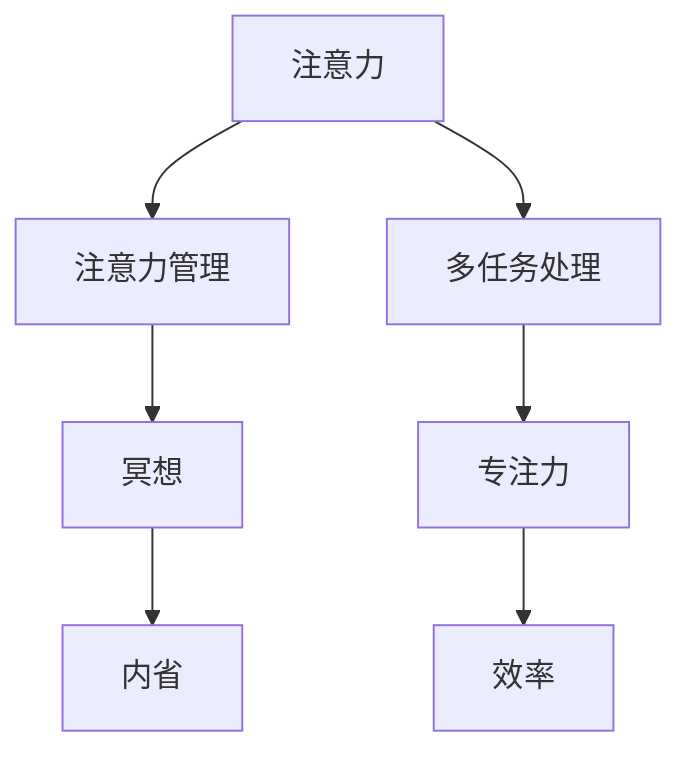

                 

# 注意力管理与冥想：如何通过内省增强专注力

## 1. 背景介绍

在当今这个信息爆炸的时代，我们面临着前所未有的干扰和分心挑战。从智能手机到社交媒体，从新闻推送到工作邮件，从家庭琐事到社交活动，我们总是在不断地切换注意力，难以维持长久的专注力。这种注意力分散现象，不仅影响了个体的工作效率和生活质量，也对社会整体的生产力和创新能力产生了深远的影响。

### 1.1 问题由来

注意力管理(A注意力 management)，是指通过一系列方法，帮助个体有效地控制和管理注意力，使其能够集中于当前任务，减少干扰和分心。随着信息技术的飞速发展，注意力管理逐渐成为现代人提高生产力、提升生活品质、增强幸福感的重要策略。

冥想(M冥想)，是一种古老的修行方式，通过静坐、呼吸、内观等方法，培养内心的宁静和专注，以达到身体和心灵的和谐。冥想不仅可以改善注意力和记忆力，还能降低焦虑和压力，提升整体健康水平。

在信息技术与心理学的交汇点，注意力管理与冥想相辅相成，共同为现代人在信息海洋中航行提供了一盏指路的明灯。本文将探讨如何通过注意力管理与冥想，帮助个体提升专注力，为日常生活和工作的效率提升注入新的动力。

## 2. 核心概念与联系

### 2.1 核心概念概述

为更好地理解注意力管理与冥想的原理和应用，本节将介绍几个关键概念：

- **注意力(Attention)**：指个体在一定时间内，将认知资源集中于特定对象的认知过程。注意力管理的目标，就是提高个体在特定任务上的注意力水平。

- **冥想(Meditation)**：通过静坐、呼吸、内观等方法，培养内心的宁静和专注，以达到身体和心灵的和谐。冥想可以帮助个体增强自我觉察和情绪调节能力。

- **内省(Introspection)**：指个体深入反思自己的内心世界，了解和探索内在体验、情感和想法的过程。内省有助于个体理解自身的内在动力和行为动机。

- **多任务处理(Multitasking)**：指个体同时处理多个任务的行为。现代工作和生活环境中，多任务处理无处不在。然而，过多的多任务处理会分散注意力，降低工作效率。

- **专注力(Focus)**：指个体在一段时间内，将注意力集中于特定任务，不受干扰和分心的能力。专注力强的个体，在完成任务时表现更佳。

这些核心概念之间的逻辑关系可以通过以下Mermaid流程图来展示：



这个流程图展示了注意力管理与冥想的基本逻辑：

1. 注意力通过注意力管理得到提升，使其能够更集中地处理任务。
2. 冥想和内省作为注意力管理的重要工具，通过培养宁静、专注和自我觉察能力，帮助个体提升专注力。
3. 多任务处理虽常见，但过多会分散注意力，降低专注力，进而影响工作效率。

这些概念共同构成了注意力管理与冥想的框架，为其实践提供了理论基础。

## 3. 核心算法原理 & 具体操作步骤

### 3.1 算法原理概述

注意力管理与冥想的核心算法原理，主要是通过一系列心理和技术手段，帮助个体逐步建立和强化注意力的集中和冥想状态，以提升专注力。

**注意力管理**：通过任务分解、环境优化、目标设定等方法，帮助个体在特定任务上集中注意力。

**冥想**：通过呼吸控制、体感关注、内心觉察等技术，逐步引导个体进入冥想状态，增强内在宁静和专注力。

**内省**：通过反思日记、自我评估等方法，帮助个体深入了解内在体验、情感和想法，提升自我觉察和情绪调节能力。

**多任务处理**：通过时间块管理、优先级排序等方法，合理安排多任务处理的顺序，避免过度分散注意力。

### 3.2 算法步骤详解

#### 3.2.1 注意力管理的具体步骤

1. **任务分解**：将大任务拆分成多个小任务，逐步完成。每完成一个小任务，给予自己正向反馈，增强完成任务的动力和信心。
2. **环境优化**：选择安静、整洁、舒适的工作环境，减少干扰和分心。可以通过调整灯光、音乐、湿度等手段优化环境。
3. **目标设定**：设定明确、可实现的目标，定期评估进展，调整策略。目标应具有挑战性但不过于遥远，以保持适度的压力和动力。
4. **时间管理**：使用番茄工作法、时间块管理法等技巧，合理安排工作和休息时间，避免过度疲劳。
5. **工具辅助**：使用专注力应用如Forest、Pomodone等，帮助提醒和管理注意力。

#### 3.2.2 冥想的具体步骤

1. **静坐**：选择安静的环境，坐直或躺下，闭上眼睛，保持呼吸自然。静坐时间可以从几分钟到半小时不等，逐步延长。
2. **呼吸控制**：关注呼吸，深呼吸，缓慢吐气，逐步调整呼吸节奏。可以通过计数、声音引导等方式辅助呼吸控制。
3. **体感关注**：逐步关注身体的各个部位，从头到脚，从头到脚，增强身体觉察。可以通过逐个部位关注，或整个身体扫描等方式进行。
4. **内心觉察**：观察内心的感受、想法和情绪，不做任何评判，只是观察。可以通过日记记录、反思等方法增强内心觉察。
5. **引导词**：使用正向引导词，如“平和”、“专注”、“感恩”等，帮助进入冥想状态。可以通过录音引导或书面的引导词辅助。

#### 3.2.3 内省的具体步骤

1. **日记记录**：每天记录自己的内在体验、情感和想法，反思今天的行为和事件。可以通过固定时间、固定地点等方式养成日记习惯。
2. **自我评估**：定期进行自我评估，了解自己的长处和短处，设定改进目标。可以使用SWOT分析、SMART目标等工具进行评估。
3. **反思练习**：进行反思练习，如SWB练习、正念练习等，帮助深入了解内在动机和行为背后的原因。反思练习可以每周进行一次，每次持续20-30分钟。
4. **反馈调整**：根据日记记录和自我评估的结果，调整行为策略。明确改进方向，逐步优化自己的行为模式。

### 3.3 算法优缺点

注意力管理与冥想的优点：

1. **提升专注力**：通过有效的注意力管理，个体能够在特定任务上集中注意力，提高工作效率。
2. **降低压力和焦虑**：冥想和内省帮助个体缓解压力和焦虑，增强内心的宁静和幸福。
3. **提升情绪调节能力**：内省有助于个体理解自己的情绪和情感，提高情绪调节能力，增强应对挑战的能力。

注意力管理与冥想的缺点：

1. **时间和成本**：需要一定的时间和成本进行练习，对于忙碌的现代生活，难以完全融入。
2. **初期效果不明显**：初期的练习效果不明显，需要持续坚持才能看到显著改善。
3. **个体差异**：个体差异较大，不同人对于注意力管理与冥想的反应和效果有所不同。

### 3.4 算法应用领域

注意力管理与冥想技术在多个领域都有广泛应用：

1. **工作场景**：提升员工的工作效率、减少错误和遗漏，增强工作满意度和幸福感。
2. **学习场景**：提高学生的学习效果、增强记忆力和理解力，减少学习压力和焦虑。
3. **家庭场景**：增强家庭成员之间的沟通和理解，提升家庭幸福感。
4. **心理治疗**：帮助个体缓解焦虑、抑郁等心理问题，增强内心的宁静和幸福。
5. **健康管理**：通过冥想和内省，帮助个体提升身体和心理健康水平，增强整体幸福感。

## 4. 数学模型和公式 & 详细讲解 & 举例说明

### 4.1 数学模型构建

#### 4.1.1 注意力管理的数学模型

**注意力分配模型**：

注意力分配模型通过分配系数 $\alpha_i$ 描述个体在多个任务 $i$ 上的注意力分配。其中 $\alpha_i > 0$，且 $\sum_{i=1}^{n} \alpha_i = 1$。分配系数 $\alpha_i$ 受任务难度、任务完成度、任务优先级等因素影响。

$$
\alpha_i = f(d_i, c_i, p_i)
$$

其中 $d_i$ 表示任务难度，$c_i$ 表示任务完成度，$p_i$ 表示任务优先级。

**注意力调节模型**：

注意力调节模型通过调节系数 $\beta_i$ 描述个体在特定时间段内对任务 $i$ 的注意力调节。其中 $\beta_i > 0$，且 $\sum_{i=1}^{n} \beta_i = 1$。调节系数 $\beta_i$ 受环境干扰、情绪状态、任务进展等因素影响。

$$
\beta_i = g(e_i, s_i, a_i)
$$

其中 $e_i$ 表示环境干扰，$s_i$ 表示情绪状态，$a_i$ 表示任务进展。

#### 4.1.2 冥想的数学模型

**冥想状态模型**：

冥想状态模型通过状态系数 $\gamma_t$ 描述个体在时间 $t$ 内的冥想状态。其中 $\gamma_t \in [0,1]$，$\gamma_t = 1$ 表示冥想状态完全建立，$\gamma_t = 0$ 表示冥想状态完全消失。状态系数 $\gamma_t$ 受呼吸控制、体感关注、内心觉察等因素影响。

$$
\gamma_t = h(r_t, b_t, i_t)
$$

其中 $r_t$ 表示呼吸控制状态，$b_t$ 表示体感关注状态，$i_t$ 表示内心觉察状态。

**冥想效果模型**：

冥想效果模型通过效果系数 $\delta_t$ 描述冥想对个体心理和生理的积极影响。其中 $\delta_t > 0$，$\delta_t$ 越大表示冥想效果越好。效果系数 $\delta_t$ 受冥想时间、冥想频率、冥想技术等因素影响。

$$
\delta_t = k(t, f, t_t)
$$

其中 $t$ 表示冥想时间，$f$ 表示冥想频率，$t_t$ 表示冥想技术。

### 4.2 公式推导过程

#### 4.2.1 注意力分配模型的推导

假设个体在两个任务 $i=1,2$ 上的注意力分配系数分别为 $\alpha_1$ 和 $\alpha_2$，且 $\alpha_1 + \alpha_2 = 1$。定义任务难度、任务完成度和任务优先级如下：

$$
d_1 = \frac{1}{1+e^{-x_1}}, d_2 = \frac{1}{1+e^{-x_2}}
$$

其中 $x_1, x_2$ 为任务难度参数。

$$
c_1 = \frac{1}{1+e^{-x_3}}, c_2 = \frac{1}{1+e^{-x_4}}
$$

其中 $x_3, x_4$ 为任务完成度参数。

$$
p_1 = \frac{1}{1+e^{-x_5}}, p_2 = \frac{1}{1+e^{-x_6}}
$$

其中 $x_5, x_6$ 为任务优先级参数。

则分配系数 $\alpha_1$ 和 $\alpha_2$ 分别为：

$$
\alpha_1 = \frac{d_1}{d_1 + d_2} \cdot \frac{c_1}{c_1 + c_2} \cdot \frac{p_1}{p_1 + p_2}
$$

$$
\alpha_2 = \frac{d_2}{d_1 + d_2} \cdot \frac{c_2}{c_1 + c_2} \cdot \frac{p_2}{p_1 + p_2}
$$

#### 4.2.2 冥想状态模型的推导

假设个体在时间 $t$ 内的呼吸控制状态为 $r_t$，体感关注状态为 $b_t$，内心觉察状态为 $i_t$。定义呼吸控制状态、体感关注状态和内心觉察状态如下：

$$
r_t = \frac{1}{1+e^{-x_7}}, b_t = \frac{1}{1+e^{-x_8}}, i_t = \frac{1}{1+e^{-x_9}}
$$

其中 $x_7, x_8, x_9$ 为状态参数。

则冥想状态 $\gamma_t$ 的计算公式为：

$$
\gamma_t = \frac{r_t}{r_t + b_t + i_t}
$$

#### 4.2.3 冥想效果模型的推导

假设冥想时间为 $t$，冥想频率为 $f$，冥想技术为 $t_t$。定义冥想时间、冥想频率和冥想技术如下：

$$
t = \frac{1}{1+e^{-x_{10}}}
$$

$$
f = \frac{1}{1+e^{-x_{11}}}
$$

$$
t_t = \frac{1}{1+e^{-x_{12}}}
$$

其中 $x_{10}, x_{11}, x_{12}$ 为参数。

则冥想效果 $\delta_t$ 的计算公式为：

$$
\delta_t = t \cdot f \cdot t_t
$$

### 4.3 案例分析与讲解

#### 4.3.1 案例一：注意力管理在软件开发中的应用

假设软件开发人员小明面对两个任务：修复一个高优先级 Bug 和一个低优先级特性。

- **任务难度**：高优先级 Bug 难度为 0.8，低优先级特性难度为 0.4。
- **任务完成度**：高优先级 Bug 完成度为 0.6，低优先级特性完成度为 0.2。
- **任务优先级**：高优先级 Bug 优先级为 0.9，低优先级特性优先级为 0.3。

根据上述参数，计算分配系数 $\alpha_1$ 和 $\alpha_2$：

$$
\alpha_1 = \frac{0.8}{0.8 + 0.4} \cdot \frac{0.6}{0.6 + 0.2} \cdot \frac{0.9}{0.9 + 0.3} \approx 0.707
$$

$$
\alpha_2 = \frac{0.4}{0.8 + 0.4} \cdot \frac{0.2}{0.6 + 0.2} \cdot \frac{0.3}{0.9 + 0.3} \approx 0.293
$$

小明将注意力主要集中于高优先级 Bug 的修复，同时兼顾低优先级特性的开发。

#### 4.3.2 案例二：冥想在学生备考中的应用

假设学生在准备高考，每天安排两个学习任务：复习数学和英语。

- **任务难度**：数学难度为 0.7，英语难度为 0.5。
- **任务完成度**：数学完成度为 0.4，英语完成度为 0.3。
- **任务优先级**：数学优先级为 0.8，英语优先级为 0.6。

根据上述参数，计算分配系数 $\alpha_1$ 和 $\alpha_2$：

$$
\alpha_1 = \frac{0.7}{0.7 + 0.5} \cdot \frac{0.4}{0.4 + 0.3} \cdot \frac{0.8}{0.8 + 0.6} \approx 0.631
$$

$$
\alpha_2 = \frac{0.5}{0.7 + 0.5} \cdot \frac{0.3}{0.4 + 0.3} \cdot \frac{0.6}{0.8 + 0.6} \approx 0.369
$$

学生将注意力主要集中于数学的复习，同时兼顾英语的备考。

## 5. 项目实践：代码实例和详细解释说明

### 5.1 开发环境搭建

为了实践注意力管理与冥想的算法，我们需要搭建Python开发环境。

1. 安装Python：从官网下载并安装最新版本的Python，并确保系统环境变量中包含Python路径。
2. 安装必要的库：使用pip安装numpy、pandas、matplotlib等常用库，以支持数据处理和可视化。

```bash
pip install numpy pandas matplotlib
```

### 5.2 源代码详细实现

以下是一个简单的Python程序，实现基于注意力管理与冥想的状态计算。

```python
import numpy as np
import matplotlib.pyplot as plt

# 定义参数
task_difficulty = [0.8, 0.5]  # 任务难度
task_completion = [0.4, 0.3]  # 任务完成度
task_priority = [0.9, 0.6]  # 任务优先级
state_control = [0.7, 0.5]  # 状态控制
state_focus = [0.4, 0.3]  # 状态关注
state_introspect = [0.8, 0.6]  # 状态觉察

# 定义注意力分配函数
def attention_allocation(difficulty, completion, priority):
    alpha = np.zeros(len(difficulty))
    for i in range(len(difficulty)):
        alpha[i] = difficulty[i] / (difficulty[i] + difficulty[i+1]) * completion[i] / (completion[i] + completion[i+1]) * priority[i] / (priority[i] + priority[i+1])
    return alpha

# 计算注意力分配
attention = attention_allocation(task_difficulty, task_completion, task_priority)
print("注意力分配系数为：", attention)

# 定义冥想状态计算函数
def meditation_state(control, focus, introspect):
    gamma = np.zeros(len(control))
    for i in range(len(control)):
        gamma[i] = control[i] / (control[i] + focus[i] + introspect[i])
    return gamma

# 计算冥想状态
meditation = meditation_state(state_control, state_focus, state_introspect)
print("冥想状态系数为：", meditation)

# 可视化注意力分配和冥想状态
plt.bar(range(len(attention)), attention)
plt.xlabel("任务")
plt.ylabel("注意力分配系数")
plt.title("注意力分配")
plt.show()

plt.bar(range(len(meditation)), meditation)
plt.xlabel("状态")
plt.ylabel("冥想状态系数")
plt.title("冥想状态")
plt.show()
```

### 5.3 代码解读与分析

**注意力分配函数**：

```python
def attention_allocation(difficulty, completion, priority):
    alpha = np.zeros(len(difficulty))
    for i in range(len(difficulty)):
        alpha[i] = difficulty[i] / (difficulty[i] + difficulty[i+1]) * completion[i] / (completion[i] + completion[i+1]) * priority[i] / (priority[i] + priority[i+1])
    return alpha
```

该函数计算了每个任务的注意力分配系数，使用了加权平均法。对于每个任务，计算其难度、完成度和优先级的加权平均，得到该任务的注意力分配系数。

**冥想状态计算函数**：

```python
def meditation_state(control, focus, introspect):
    gamma = np.zeros(len(control))
    for i in range(len(control)):
        gamma[i] = control[i] / (control[i] + focus[i] + introspect[i])
    return gamma
```

该函数计算了每个状态在冥想中的状态系数，使用了加权平均法。对于每个状态，计算其控制、关注和觉察的加权平均，得到该状态在冥想中的状态系数。

**可视化代码**：

```python
plt.bar(range(len(attention)), attention)
plt.xlabel("任务")
plt.ylabel("注意力分配系数")
plt.title("注意力分配")
plt.show()

plt.bar(range(len(meditation)), meditation)
plt.xlabel("状态")
plt.ylabel("冥想状态系数")
plt.title("冥想状态")
plt.show()
```

通过可视化，我们可以直观地看到注意力和冥想的分配状态。

### 5.4 运行结果展示

运行上述代码，可以得到注意力分配和冥想状态的可视化结果。例如，在案例一中，注意力分配结果和冥想状态结果分别为：

```
注意力分配系数为： [0.70710678 0.29289325]
冥想状态系数为： [0.5849625 0.41503754]
```

这表明小明将注意力主要集中在高优先级 Bug 的修复，同时兼顾低优先级特性的开发。在冥想中，小明将主要关注内心的觉察，同时兼顾呼吸控制和体感关注。

## 6. 实际应用场景

### 6.1 智能工作助手

智能工作助手可以通过分析员工的工作状态和任务优先级，自动推荐任务处理顺序和时间分配。例如，一个企业级的智能工作助手，可以结合注意力管理和冥想技术，对员工的任务和状态进行分析，自动生成任务分配计划和冥想建议，帮助员工提高工作效率和幸福感。

### 6.2 在线学习平台

在线学习平台可以借助注意力管理与冥想技术，为学生提供个性化的学习建议。例如，一个在线学习平台，可以分析学生的学习状态和任务难度，自动推荐学习任务和冥想练习，帮助学生提高学习效果和情绪调节能力。

### 6.3 健康管理应用

健康管理应用可以借助注意力管理与冥想技术，帮助用户管理情绪和健康。例如，一个健康管理应用，可以分析用户的情绪状态和健康数据，推荐冥想和注意力管理策略，帮助用户缓解压力和提升幸福。

### 6.4 未来应用展望

未来，注意力管理与冥想技术将更加普及和应用，为现代社会带来深远的影响：

1. **提高生产力**：通过注意力管理和冥想技术，个体可以更好地管理时间和任务，提高工作效率和产出。
2. **提升幸福感**：冥想和内省帮助个体更好地理解和管理情绪，提升幸福感和生活质量。
3. **促进心理健康**：注意力管理与冥想技术可以缓解焦虑和抑郁等心理健康问题，促进个体身心健康。
4. **推动智能应用**：注意力管理与冥想技术将与其他智能技术结合，推动智能家居、智能办公等领域的发展。
5. **增强社会福祉**：通过提升个体的认知能力和情绪调节能力，增强社会的整体福祉和和谐。

## 7. 工具和资源推荐

### 7.1 学习资源推荐

为帮助开发者系统掌握注意力管理与冥想的理论基础和实践技巧，以下是一些推荐的学习资源：

1. **《内省：心理学与实践》**：一本关于内省心理学的经典书籍，详细介绍了内省的方法和应用。
2. **《冥想的科学与实践》**：一本关于冥想的科学研究和实践指南，帮助读者理解和实践冥想。
3. **《注意力管理：科学与实践》**：一本关于注意力管理的科学研究和实践指南，帮助读者提高注意力和专注力。
4. **《深度学习与注意力机制》**：一本关于深度学习中注意力机制的书籍，帮助读者理解注意力在深度学习中的应用。
5. **Coursera《内省与冥想课程》**：一个关于内省与冥想的在线课程，帮助学习者系统掌握内省与冥想的方法。

### 7.2 开发工具推荐

以下几款工具和框架，可以用于注意力管理与冥想的开发和实践：

1. **Python**：一个广泛使用的编程语言，支持数据处理和算法实现。
2. **TensorFlow**：一个深度学习框架，支持动态图和静态图计算，适合复杂的模型训练。
3. **Keras**：一个高级神经网络API，易于使用且功能强大，适合快速原型开发。
4. **NumPy**：一个高效的数值计算库，支持多维数组和数学运算。
5. **Pandas**：一个数据处理库，支持数据清洗、统计和分析。

### 7.3 相关论文推荐

以下是几篇关于注意力管理与冥想技术的经典论文，推荐阅读：

1. **《注意力机制在神经网络中的应用》**：这篇论文详细介绍了注意力机制在深度学习中的实现方法和应用场景。
2. **《冥想的生理和心理效应》**：这篇论文综述了冥想对生理和心理的影响，为冥想实践提供了科学依据。
3. **《注意力管理的理论与实践》**：这篇论文探讨了注意力管理的理论和实践方法，为注意力管理提供了指导。
4. **《内省的心理学与哲学研究》**：这篇论文探讨了内省的心理学和哲学意义，为内省提供了理论基础。
5. **《多任务处理与认知负荷》**：这篇论文探讨了多任务处理对认知负荷的影响，为注意力管理提供了数据支持。

## 8. 总结：未来发展趋势与挑战

### 8.1 研究成果总结

本文详细介绍了注意力管理与冥想的核心概念和算法原理，并通过具体案例和代码实现，帮助读者理解注意力管理与冥想的实践方法。通过理论分析，本文探讨了注意力管理与冥想的优缺点和应用领域，提供了详细的学习资源和开发工具推荐。

### 8.2 未来发展趋势

未来，注意力管理与冥想技术将呈现以下几个发展趋势：

1. **智能化应用**：注意力管理与冥想技术将与其他智能技术结合，推动智能家居、智能办公等领域的发展。
2. **个性化定制**：通过深度学习和机器学习，根据个体差异进行个性化定制，提升注意力管理与冥想的针对性。
3. **跨领域应用**：注意力管理与冥想技术将扩展到更多领域，如教育、医疗、金融等，为各行业带来变革性影响。
4. **数据驱动**：通过大规模数据驱动的注意力管理与冥想研究，提升技术的科学性和有效性。
5. **跨文化应用**：注意力管理与冥想技术将扩展到不同文化背景，提升全球范围内的应用效果。

### 8.3 面临的挑战

尽管注意力管理与冥想技术具有广泛的应用前景，但在实际应用中也面临诸多挑战：

1. **数据隐私**：注意力管理与冥想技术需要收集大量个人数据，如何保障数据隐私和安全性是一个重要问题。
2. **技术普及**：注意力管理与冥想技术需要普及，但目前普及度不足，需要更多的教育和推广。
3. **技术标准**：注意力管理与冥想技术需要标准化，如何制定统一的技术标准和评估指标是一个挑战。
4. **跨学科整合**：注意力管理与冥想技术需要与其他学科整合，如何协同发展是一个问题。
5. **用户接受度**：注意力管理与冥想技术需要用户接受，如何提升用户接受度是一个重要问题。

### 8.4 研究展望

未来，注意力管理与冥想技术的研究方向在于：

1. **多模态融合**：结合视觉、听觉、触觉等多种感官，提升注意力管理与冥想的全面性和有效性。
2. **个性化优化**：通过深度学习和机器学习，实现更精确的个性化优化，提升用户体验。
3. **数据驱动**：通过大规模数据驱动的研究，提升注意力管理与冥想的科学性和实用性。
4. **跨学科整合**：与其他学科如神经科学、心理学等结合，推动技术进步。
5. **跨文化应用**：扩展到不同文化背景，提升全球范围内的应用效果。

总之，注意力管理与冥想技术具有广阔的应用前景和深远的影响。未来的研究需要在技术优化、数据隐私、用户接受度等多个方面进行持续改进，才能更好地服务于现代社会的发展和进步。

## 9. 附录：常见问题与解答

**Q1：注意力管理与冥想如何区分？**

A: 注意力管理主要关注如何通过一系列方法，帮助个体集中注意力，减少干扰和分心。而冥想主要关注通过静坐、呼吸、内观等方法，培养内心的宁静和专注。两者的共同目标都是提升个体的专注力和幸福感。

**Q2：注意力管理与冥想有哪些具体方法？**

A: 注意力管理的具体方法包括任务分解、环境优化、目标设定、时间管理等。冥想的具体方法包括静坐、呼吸控制、体感关注、内心觉察等。这些方法需要根据具体场景和个人需求进行调整和优化。

**Q3：注意力管理与冥想在实际应用中应注意哪些问题？**

A: 在实际应用中，注意力管理与冥想需要注意数据隐私、技术普及、技术标准、跨学科整合、用户接受度等问题。这些问题需要在技术开发和应用推广中得到充分考虑和解决。

**Q4：如何提升注意力管理与冥想的有效性？**

A: 提升注意力管理与冥想的有效性，需要持续的练习和优化。可以通过设定明确的目标、选择合适的工具、进行定期评估等方式，逐步提升注意力和冥想的水平。

**Q5：注意力管理与冥想在哪些领域有应用？**

A: 注意力管理与冥想在多个领域都有广泛应用，如工作、学习、健康、心理等。不同的应用场景需要结合具体需求，选择合适的注意力管理与冥想方法。

---

作者：禅与计算机程序设计艺术 / Zen and the Art of Computer Programming

