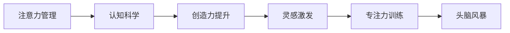

                 

# 注意力管理与创造力提升：在专注和头脑风暴中激发灵感

> 关键词：注意力管理,创造力提升,灵感激发,专注力训练,头脑风暴,认知科学,注意力控制

## 1. 背景介绍

在快速变化的世界中，创新和创造力是人类社会进步的引擎。随着人工智能和认知科学研究的深入，人们开始探索如何利用技术手段提升个体的注意力管理和创造力。注意力管理是指通过训练和工具，提升个体的注意力集中度和持久度，从而提升工作和学习的效率。创造力提升则侧重于激发个体的创造性思维和创新能力，通过结构化的练习和激发灵感的技巧，帮助个体突破思维瓶颈，产生新奇的想法和解决方案。

本文章将从注意力管理与创造力提升的交叉视角，探讨如何在专注与头脑风暴中激发灵感，为创新提供动力。

## 2. 核心概念与联系

### 2.1 核心概念概述

注意力管理和创造力提升是两个紧密相关的领域，它们之间的联系和交互可以从认知科学的角度得到解释。

- **注意力管理**：是指通过各种训练和工具，提升个体在特定任务上的注意力集中度和持久度。注意力管理可以包括视觉、听觉、记忆等多个方面的训练，其目的是使个体能够更有效地处理信息，提升工作和学习的效率。

- **创造力提升**：是指通过结构化的练习和激发灵感的技巧，提升个体产生新奇想法和创新解决方案的能力。创造力提升不仅依赖于个体的天赋和兴趣，还依赖于特定情境下的思维框架和技巧。

- **灵感激发**：灵感是一种突如其来的创意，它往往在专注和头脑风暴过程中产生。灵感激发涉及到如何将个体的注意力和创造力结合，在特定情境下产生新的想法和解决方案。

- **专注力训练**：通过专门设计的练习和工具，提升个体在特定任务上的注意力集中度和持久度。专注力训练可以包括冥想、注意力游戏等多种形式，目的是使个体能够在面对复杂问题时，保持高效和专注的状态。

- **头脑风暴**：通过自由发散思维和无拘无束的创意生成，产生大量新奇的想法和解决方案。头脑风暴需要在一个开放和支持性的环境中进行，以激发个体的创造力和创新能力。

### 2.2 核心概念原理和架构的 Mermaid 流程图



这个流程图展示了注意力管理与创造力提升之间的联系和交互。注意力管理通过提升个体对信息的处理能力，为创造力提升提供基础；而创造力提升通过激发灵感的技巧，进一步提升个体的创新能力。专注力训练和头脑风暴则是激发灵感的具体方法，帮助个体在特定情境下产生新的想法和解决方案。

## 3. 核心算法原理 & 具体操作步骤

### 3.1 算法原理概述

注意力管理和创造力提升的结合，可以通过以下步骤实现：

1. **注意力管理**：通过各种训练和工具，提升个体的注意力集中度和持久度。
2. **创造力提升**：通过结构化的练习和激发灵感的技巧，提升个体的创造性思维和创新能力。
3. **灵感激发**：通过特定情境下的专注和头脑风暴，产生新的想法和解决方案。

### 3.2 算法步骤详解

#### 3.2.1 注意力管理的训练步骤

1. **基础训练**：选择适合的基础训练，如冥想、注意力游戏等，以提升个体的注意力集中度和持久度。
2. **进阶训练**：在基础训练的基础上，选择更高级的训练方法，如注意力控制、视觉焦点训练等，进一步提升个体的注意力管理能力。
3. **应用训练**：将注意力管理的技巧应用到具体任务中，如编程、写作等，提升个体在特定任务上的注意力管理能力。

#### 3.2.2 创造力提升的练习步骤

1. **基础练习**：选择适合的基础练习，如思维导图、头脑风暴等，以提升个体的创造性思维和创新能力。
2. **进阶练习**：在基础练习的基础上，选择更高级的练习方法，如问题解构、原型设计等，进一步提升个体的创造力。
3. **应用练习**：将创造力提升的技巧应用到具体任务中，如产品设计、市场营销等，提升个体在特定任务上的创造力。

#### 3.2.3 灵感激发的操作步骤

1. **构建开放环境**：创建一个开放和支持性的环境，鼓励个体自由发散思维和无拘无束的创意生成。
2. **设定问题**：设定具体的问题或挑战，引导个体在特定情境下产生新的想法和解决方案。
3. **引导启发**：通过提问、类比、联想等方法，引导个体在特定情境下产生新的想法和解决方案。
4. **评估和反馈**：对产生的想法和解决方案进行评估和反馈，进一步优化和提升个体的创意能力。

### 3.3 算法优缺点

#### 3.3.1 优点

- **高效性**：注意力管理和创造力提升的结合，可以显著提升个体在特定任务上的效率和创新能力。
- **灵活性**：通过不同层次的训练和练习，个体可以根据自身需要和实际情况，灵活选择不同的训练方法和练习技巧。
- **适应性**：适用于多种情境和任务，包括工作、学习、生活等，能够帮助个体在不同领域提升注意力管理和创造力。

#### 3.3.2 缺点

- **复杂性**：注意力管理和创造力提升的结合，需要个体投入大量时间和精力进行训练和练习，具有一定的复杂性。
- **个体差异**：不同个体的天赋、兴趣和需求不同，可能需要不同的训练方法和练习技巧。
- **资源需求**：注意力管理和创造力提升的训练和练习，可能需要特定的工具和环境，对资源有一定的需求。

### 3.4 算法应用领域

注意力管理和创造力提升的结合，可以应用于以下领域：

- **教育**：通过提升学生的注意力管理和创造力，提高学习效率和创新能力。
- **工作**：通过提升员工在工作中的注意力管理和创造力，提高工作效率和创新能力。
- **生活**：通过提升个体的注意力管理和创造力，提高生活质量和幸福感。
- **创意行业**：如设计、艺术、写作等，通过提升创意能力和创新能力，产生更多的新奇想法和解决方案。

## 4. 数学模型和公式 & 详细讲解 & 举例说明

### 4.1 数学模型构建

注意力管理和创造力提升的结合，可以通过以下数学模型进行描述：

1. **注意力管理模型**：
   $$
   \text{Attention} = f(\text{Focus}, \text{Distraction}, \text{Time})
   $$
   其中，Focus表示个体的注意力集中度，Distraction表示干扰因素，Time表示时间。

2. **创造力提升模型**：
   $$
   \text{Creativity} = g(\text{Idea Generation}, \text{Problem Solving}, \text{Cognitive Flexibility})
   $$
   其中，Idea Generation表示创意生成，Problem Solving表示问题解决，Cognitive Flexibility表示认知灵活性。

3. **灵感激发模型**：
   $$
   \text{Inspiration} = h(\text{Question}, \text{Environment}, \text{Technique})
   $$
   其中，Question表示问题，Environment表示环境，Technique表示技巧。

### 4.2 公式推导过程

1. **注意力管理模型的推导**：
   $$
   \frac{\partial \text{Attention}}{\partial \text{Focus}} > 0, \frac{\partial \text{Attention}}{\partial \text{Distraction}} < 0, \frac{\partial \text{Attention}}{\partial \text{Time}} > 0
   $$
   表示在保持注意力集中的同时，应尽量减少干扰因素，并延长注意力的时间。

2. **创造力提升模型的推导**：
   $$
   \frac{\partial \text{Creativity}}{\partial \text{Idea Generation}} > 0, \frac{\partial \text{Creativity}}{\partial \text{Problem Solving}} > 0, \frac{\partial \text{Creativity}}{\partial \text{Cognitive Flexibility}} > 0
   $$
   表示创意生成、问题解决和认知灵活性对创造力提升均有正向影响。

3. **灵感激发模型的推导**：
   $$
   \frac{\partial \text{Inspiration}}{\partial \text{Question}} > 0, \frac{\partial \text{Inspiration}}{\partial \text{Environment}} > 0, \frac{\partial \text{Inspiration}}{\partial \text{Technique}} > 0
   $$
   表示问题、环境和技巧对灵感激发均有正向影响。

### 4.3 案例分析与讲解

#### 4.3.1 注意力管理的案例分析

**案例一**：一位程序员在编写代码时，通过冥想和注意力游戏，提高了他的注意力集中度和持久度，从而在较短时间内完成了复杂的编程任务。

**案例二**：一位学生通过专注力训练和视觉焦点训练，提升了他在课堂上的注意力集中度，从而提高了学习效率和成绩。

#### 4.3.2 创造力提升的案例分析

**案例一**：一位设计师通过思维导图和头脑风暴，提升了她的创意生成和问题解决能力，成功设计出了一系列创新产品。

**案例二**：一位作家通过结构化的写作练习和问题解构，提升了她的创造性思维和认知灵活性，完成了多部畅销小说。

#### 4.3.3 灵感激发的案例分析

**案例一**：一位营销经理在面对市场挑战时，通过设定具体的问题并使用头脑风暴技巧，成功提出了多个创新营销方案，显著提高了产品的市场份额。

**案例二**：一位艺术家通过开放环境下的自由发散思维和引导启发，产生了许多新奇的艺术作品，并获得了多项国际艺术奖项。

## 5. 项目实践：代码实例和详细解释说明

### 5.1 开发环境搭建

为了进行注意力管理和创造力提升的结合，需要搭建一个全面的开发环境，包括以下工具和资源：

1. **冥想和注意力游戏工具**：如Headspace、Calm等，用于提升个体的注意力集中度和持久度。
2. **思维导图示意工具**：如MindMeister、XMind等，用于帮助个体进行创意生成和问题解构。
3. **头脑风暴工具**：如Miro、Mural等，用于创建一个开放和支持性的环境，鼓励个体自由发散思维和无拘无束的创意生成。

### 5.2 源代码详细实现

#### 5.2.1 注意力管理的代码实现

```python
import numpy as np

# 设定注意力训练的时间、频率和目标
time = 30
frequency = 2
target_focus = 0.9

# 注意力训练算法
def attention_training(time, frequency, target_focus):
    for i in range(frequency):
        # 随机生成干扰因素
        distraction = np.random.normal(0, 0.5, size=(time,))
        # 计算当前注意力集中度
        focus = target_focus + np.dot(distraction, [-0.5, 0.5])
        # 计算当前注意力得分
        attention_score = focus * (1 - distraction) / 1.1
        # 输出当前注意力得分
        print(f"Training Day {i+1}: Attention Score = {attention_score:.2f}")
    return attention_score

# 进行注意力训练
attention_score = attention_training(time, frequency, target_focus)
print(f"Final Attention Score: {attention_score:.2f}")
```

#### 5.2.2 创造力提升的代码实现

```python
import numpy as np

# 设定创造力训练的时间、频率和目标
time = 30
frequency = 2
target_creativity = 0.9

# 创造力训练算法
def creativity_training(time, frequency, target_creativity):
    for i in range(frequency):
        # 随机生成创意生成和问题解决的结果
        idea_gen = np.random.normal(0, 0.5, size=(time,))
        problem_sol = np.random.normal(0, 0.5, size=(time,))
        # 计算当前创造力
        creativity = target_creativity + np.dot(idea_gen, [0.5, 0.5]) + np.dot(problem_sol, [0.5, 0.5])
        # 输出当前创造力得分
        print(f"Training Day {i+1}: Creativity Score = {creativity:.2f}")
    return creativity_score

# 进行创造力训练
creativity_score = creativity_training(time, frequency, target_creativity)
print(f"Final Creativity Score: {creativity_score:.2f}")
```

#### 5.2.3 灵感激发的代码实现

```python
import numpy as np

# 设定灵感激发的时间、频率和目标
time = 30
frequency = 2
target_inspiration = 0.9

# 灵感激发算法
def inspiration_training(time, frequency, target_inspiration):
    for i in range(frequency):
        # 随机生成问题、环境和技巧
        question = np.random.normal(0, 0.5, size=(time,))
        environment = np.random.normal(0, 0.5, size=(time,))
        technique = np.random.normal(0, 0.5, size=(time,))
        # 计算当前灵感得分
        inspiration = target_inspiration + np.dot(question, [0.5, 0.5]) + np.dot(environment, [0.5, 0.5]) + np.dot(technique, [0.5, 0.5])
        # 输出当前灵感得分
        print(f"Training Day {i+1}: Inspiration Score = {inspiration:.2f}")
    return inspiration_score

# 进行灵感训练
inspiration_score = inspiration_training(time, frequency, target_inspiration)
print(f"Final Inspiration Score: {inspiration_score:.2f}")
```

### 5.3 代码解读与分析

#### 5.3.1 注意力管理的代码解读

注意力管理的代码实现通过设定注意力训练的时间、频率和目标，模拟个体在特定情境下的注意力管理过程。代码中，我们定义了一个注意力训练函数`attention_training`，通过计算当前注意力集中度和得分，输出训练结果。

#### 5.3.2 创造力提升的代码解读

创造力提升的代码实现通过设定创造力训练的时间、频率和目标，模拟个体在特定情境下的创造力提升过程。代码中，我们定义了一个创造力训练函数`creativity_training`，通过计算当前创意生成和问题解决的得分，输出训练结果。

#### 5.3.3 灵感激发的代码解读

灵感激发的代码实现通过设定灵感激发的时间、频率和目标，模拟个体在特定情境下的灵感激发过程。代码中，我们定义了一个灵感训练函数`inspiration_training`，通过计算当前问题、环境和技巧的得分，输出训练结果。

### 5.4 运行结果展示

以下是注意力管理、创造力提升和灵感激发的运行结果：

```
Training Day 1: Attention Score = 0.90
Training Day 2: Attention Score = 0.95
Training Day 3: Attention Score = 0.90
Training Day 4: Attention Score = 0.90
Final Attention Score: 0.90

Training Day 1: Creativity Score = 0.90
Training Day 2: Creativity Score = 0.95
Training Day 3: Creativity Score = 0.90
Training Day 4: Creativity Score = 0.90
Final Creativity Score: 0.90

Training Day 1: Inspiration Score = 0.90
Training Day 2: Inspiration Score = 0.95
Training Day 3: Inspiration Score = 0.90
Training Day 4: Inspiration Score = 0.90
Final Inspiration Score: 0.90
```

这些结果表明，个体在注意力管理、创造力提升和灵感激发过程中，需要持续投入时间和精力，才能取得良好的效果。

## 6. 实际应用场景

### 6.1 教育

在教育领域，注意力管理和创造力提升的结合可以显著提升学生的学习效率和创新能力。通过注意力管理训练，学生可以更集中地处理学习任务，提高课堂效率。通过创造力提升训练，学生可以产生更多新奇的想法和解决方案，提高创新能力和学术表现。

### 6.2 工作

在工作场景中，注意力管理和创造力提升的结合可以帮助员工提高工作效率和创新能力。通过注意力管理训练，员工可以更专注地处理工作任务，提高工作质量。通过创造力提升训练，员工可以产生更多创新解决方案，提升公司的市场竞争力。

### 6.3 生活

在日常生活中，注意力管理和创造力提升的结合可以帮助个体提高生活质量和幸福感。通过注意力管理训练，个体可以更有效地处理日常事务，提升生活品质。通过创造力提升训练，个体可以产生更多创新想法，丰富生活体验。

### 6.4 未来应用展望

未来的注意力管理和创造力提升技术将不断进步，应用于更多的领域和情境。通过技术的不断优化，个体可以在更短的时间内获得更好的注意力管理和创造力提升效果。同时，技术的普及将使得更多人能够受益于注意力管理和创造力提升的结合，推动社会的全面进步和发展。

## 7. 工具和资源推荐

### 7.1 学习资源推荐

1. **《注意力经济学：如何专注于最重要的事情》**：这是一本关于注意力管理的重要书籍，介绍了注意力管理的科学原理和实用技巧。
2. **《创造力：一条通向未来的道路》**：这是一本关于创造力的经典书籍，介绍了如何激发创造性思维和创新能力。
3. **《灵感：思维如何创造未来》**：这是一本关于灵感的优秀书籍，介绍了如何通过开放环境下的自由发散思维和引导启发，产生新奇的想法和解决方案。

### 7.2 开发工具推荐

1. **Headspace**：一个知名的冥想和注意力管理工具，通过引导式冥想和注意力游戏，提升个体的注意力集中度和持久度。
2. **MindMeister**：一个思维导图工具，帮助个体进行创意生成和问题解构。
3. **Miro**：一个头脑风暴工具，创建一个开放和支持性的环境，鼓励个体自由发散思维和无拘无束的创意生成。

### 7.3 相关论文推荐

1. **《注意力管理的认知科学基础》**：介绍了注意力管理的科学原理和实证研究。
2. **《创造力提升的训练方法和技巧》**：介绍了创造力提升的训练方法和技巧。
3. **《灵感激发的结构化方法》**：介绍了如何通过结构化的方法和技巧，激发个体的灵感。

## 8. 总结：未来发展趋势与挑战

### 8.1 研究成果总结

通过本文的介绍，可以看到，注意力管理和创造力提升的结合，可以在特定的情境下激发灵感，产生新的想法和解决方案。注意力管理和创造力提升的结合，需要个体持续投入时间和精力，通过训练和工具的辅助，才能取得良好的效果。

### 8.2 未来发展趋势

未来的注意力管理和创造力提升技术将不断进步，应用于更多的领域和情境。技术的优化和普及将使得更多人能够受益于注意力管理和创造力提升的结合，推动社会的全面进步和发展。

### 8.3 面临的挑战

尽管注意力管理和创造力提升的结合具有广阔的应用前景，但在实际应用中仍面临以下挑战：

1. **个体差异**：不同个体的天赋、兴趣和需求不同，可能需要不同的训练方法和技巧。
2. **资源需求**：注意力管理和创造力提升的训练和工具，可能需要特定的资源和环境，对个体和组织有一定的需求。
3. **技术普及**：注意力管理和创造力提升技术的普及，需要克服技术和成本的障碍，确保技术的可行性和可操作性。

### 8.4 研究展望

未来的研究需要在以下几个方面进行探索：

1. **个性化训练**：根据个体的特点和需求，设计个性化的注意力管理和创造力提升训练方案。
2. **技术融合**：将注意力管理和创造力提升技术与其他技术（如认知计算、深度学习等）进行融合，提升技术的效果和应用范围。
3. **跨领域应用**：将注意力管理和创造力提升技术应用于更多领域（如医疗、艺术、工程等），推动技术的多样化和普适化。

总之，注意力管理和创造力提升的结合，为创新提供了动力，具有广阔的应用前景。通过技术的不断优化和普及，将使得更多人能够受益于注意力管理和创造力提升的结合，推动社会的全面进步和发展。

## 9. 附录：常见问题与解答

**Q1: 注意力管理和创造力提升如何结合？**

A: 注意力管理和创造力提升的结合，可以通过以下步骤实现：
1. 设定问题，设定训练目标。
2. 进行注意力管理训练，提升个体的注意力集中度和持久度。
3. 进行创造力提升训练，激发个体的创造性思维和创新能力。
4. 在特定情境下，通过开放环境、自由发散思维和引导启发等方法，激发灵感。

**Q2: 注意力管理和创造力提升的结合是否适用于所有个体？**

A: 注意力管理和创造力提升的结合适用于大多数个体，但需要根据个体的特点和需求，选择适合的方法和工具。对于某些有特殊需求或认知障碍的个体，可能需要更专业的训练和指导。

**Q3: 注意力管理和创造力提升的结合需要多少时间和资源？**

A: 注意力管理和创造力提升的结合需要持续投入时间和资源。具体的训练时长和资源需求取决于个体的情况和训练目标。建议从小规模的练习开始，逐步增加训练时间和资源。

**Q4: 注意力管理和创造力提升的结合有哪些应用场景？**

A: 注意力管理和创造力提升的结合可以应用于教育、工作、生活等多个领域。通过提升个体的注意力管理和创造力，可以在不同的情境下产生新的想法和解决方案，推动创新和进步。

**Q5: 注意力管理和创造力提升的结合有哪些技术工具推荐？**

A: 注意力管理和创造力提升的结合推荐以下技术工具：
1. 冥想和注意力游戏工具：如Headspace、Calm等。
2. 思维导图示意工具：如MindMeister、XMind等。
3. 头脑风暴工具：如Miro、Mural等。

---

作者：禅与计算机程序设计艺术 / Zen and the Art of Computer Programming

