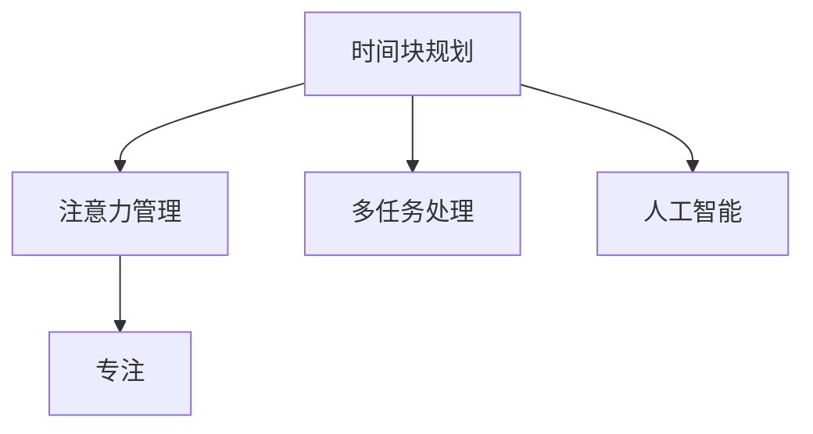

                 

# 注意力管理与时间块规划：通过专注的时间块提高效率

> 关键词：注意力管理, 时间块规划, 专注, 效率提升, 多任务处理, 人工智能, 时间管理, 项目管理

## 1. 背景介绍

### 1.1 问题由来
在当今信息爆炸的时代，我们每天面临着海量的信息和任务。如何高效地管理和利用这些信息与任务，成为了一个亟待解决的问题。尤其对于那些需要长时间集中注意力的任务，如编程、写作、设计等，时间管理和注意力管理显得尤为重要。传统的“即时处理”模式往往会导致注意力的频繁切换，进而影响工作效率和效果。因此，我们需要一种更系统、更科学的时间管理方法来提升工作效率。

### 1.2 问题核心关键点
时间块规划（Time Blocking）和注意力管理（Attention Management）是提高效率的两个重要工具。时间块规划是一种将工作时间分成固定时间段的方法，旨在帮助人们更专注、更有条理地完成工作。而注意力管理则是通过控制注意力流向，避免注意力分散，提高任务完成质量和速度。两者结合，能够在限定的时间内高效地完成任务。

## 2. 核心概念与联系

### 2.1 核心概念概述

- **时间块规划**：将工作时间划分为若干固定时间段，每个时间段内专注于特定任务，避免任务间的频繁切换。
- **注意力管理**：通过方法或工具，如番茄工作法、时间盒子等，帮助集中注意力，提高工作效率。
- **专注**：指在一段时间内不受外界干扰，全神贯注地完成特定任务的状态。
- **多任务处理**：同时处理多项任务，但需注意分配优先级，避免因多任务导致的效率下降。
- **人工智能**：利用AI技术（如时间管理应用、智能助手等）来辅助进行时间管理和注意力管理。

这些概念之间的逻辑关系可以通过以下Mermaid流程图来展示：



这个流程图展示时间块规划和注意力管理之间的关系：

1. 时间块规划帮助划分工作时间段，让注意力有据可依。
2. 注意力管理帮助保持专注，避免注意力分散。
3. 专注是效率提升的关键，需要通过时间块规划和注意力管理来实现。
4. 多任务处理虽有效，但需注意任务优先级和时间块分配。
5. 人工智能可以辅助进行时间管理，如自动生成时间块、提醒任务等。

## 3. 核心算法原理 & 具体操作步骤
### 3.1 算法原理概述

时间块规划和注意力管理的核心原理是利用心理学和时间管理的理论，通过设定时间块和注意力集中的策略，来提升工作效率。其核心思想是将工作时间进行合理划分，在每个时间块内专注于单一任务，避免任务切换带来的效率损失。同时，通过注意力管理，帮助集中精力，减少外界干扰，从而提高任务完成的质量和速度。

### 3.2 算法步骤详解

**Step 1: 定义时间块**

1. **时间块划分**：根据任务的复杂度和优先级，将工作时间划分为若干固定时间段，如25分钟工作-5分钟休息（即番茄工作法）。
2. **任务分配**：将需要完成的任务按照优先级分配到各个时间块中，确保时间块内的任务相对简单且可完成。

**Step 2: 执行时间块**

1. **关闭干扰**：在工作时间块内关闭所有不必要的通知和应用，避免外界干扰。
2. **专注工作**：在时间块内全神贯注地完成分配的任务，尽量避免任务切换。
3. **休息与调整**：在每个时间块结束后，进行短暂休息或调整，避免疲劳。

**Step 3: 评估与优化**

1. **任务完成情况评估**：每个时间块结束后，评估任务的完成情况，并记录时间块的效率。
2. **调整时间块策略**：根据任务完成情况，调整时间块的长度和任务分配，优化时间块策略。
3. **持续优化**：根据实践经验，持续优化时间块策略，使其更适合个人工作习惯和任务特点。

### 3.3 算法优缺点

**优点**：

- **提升专注度**：通过时间块划分，帮助集中注意力，避免任务切换带来的分心。
- **提高效率**：在限定的时间内专注于单一任务，减少任务间切换带来的效率损失。
- **灵活调整**：可以根据任务复杂度和个人习惯，灵活调整时间块策略，适应不同的工作环境。

**缺点**：

- **过度刚性**：时间块规划过于刚性，可能不适应突发事件和紧急任务。
- **时间分配困难**：合理分配任务到时间块中可能较为困难，需要一定的规划和预见性。
- **执行难度**：需要较强的自我约束力，否则容易在时间块内被其他事物干扰。

### 3.4 算法应用领域

时间块规划和注意力管理在多个领域中都有广泛应用，包括但不限于：

- **软件开发**：将代码编写任务分成小块，每块专注25分钟，可以提高代码编写效率。
- **内容创作**：将写作、设计等创意工作分成多个时间块，可以帮助集中精力，提升作品质量。
- **项目管理**：将项目任务分成多个时间块，每个时间块专注于一个任务或任务组，提高项目进度。
- **学习提升**：将学习任务分成多个时间块，每个时间块专注学习某个主题，提高学习效果。

## 4. 数学模型和公式 & 详细讲解

### 4.1 数学模型构建

设每个时间块的长度为 $T$，任务数为 $N$，任务的复杂度为 $C_i$（$i=1,...,N$），其中 $C_i$ 越低表示任务越简单，越易完成。设每个任务分配到的时间块数为 $t_i$，则总时间块的数量为 $T_{total} = \sum_{i=1}^N t_i$。

**目标函数**：最大化任务完成情况，最小化任务切换带来的效率损失。

$$
\max_{t_1,...,t_N} \sum_{i=1}^N \frac{t_i}{C_i}
$$

**约束条件**：
1. $t_i \leq T$
2. $T_{total} \leq T_{available}$

其中 $T_{available}$ 表示可用工作时间。

### 4.2 公式推导过程

1. **任务分配策略**：根据任务的复杂度和优先级，将任务分配到各个时间块中，使得 $t_i$ 最小化。
2. **任务完成情况**：在每个时间块内，集中注意力完成分配的任务，最大化 $t_i/C_i$。
3. **时间块长度优化**：通过调整时间块长度 $T$ 和任务数量 $N$，优化总任务完成情况。

### 4.3 案例分析与讲解

以软件开发为例，假设每个任务的工作量为 $C_i$，总工作量为 $C_{total} = \sum_{i=1}^N C_i$。每个时间块的长度为25分钟，任务分配策略为优先完成简单任务，并在每个时间块内专注工作。假设总可用时间为8小时，即480分钟，则总时间块数为 $480/25 = 19.2$，即19个完整时间块和1个剩余时间块。通过分配策略和任务完成情况，可以计算出每个时间块的任务完成情况和效率，从而优化时间块规划和注意力管理。

## 5. 项目实践：代码实例和详细解释说明
### 5.1 开发环境搭建

首先需要安装必要的开发工具，如Visual Studio Code、Git、Python等。然后，安装时间管理应用，如Todoist、Trello等，用于任务分配和时间块规划。

### 5.2 源代码详细实现

以下是一个简单的Python代码示例，用于模拟时间块规划和任务分配：

```python
import random

# 定义任务列表
tasks = ['任务1', '任务2', '任务3', '任务4', '任务5']
task_complexity = [20, 30, 15, 25, 40]

# 定义时间块长度和可用时间
block_length = 25
total_time = 480

# 定义时间块数
num_blocks = total_time // block_length

# 分配任务到时间块中
block_tasks = []
for i in range(num_blocks):
    block_tasks.append([])
    for task in tasks:
        if random.randint(0, 10) < 2:  # 随机选择任务分配到时间块中
            block_tasks[i].append(task)

# 输出时间块分配结果
for i, block in enumerate(block_tasks):
    print(f"Time Block {i+1}: {block}")
```

### 5.3 代码解读与分析

以上代码实现了一个简单的任务分配模拟，通过随机选择任务分配到时间块中，模拟任务分配和执行过程。实际应用中，可以根据任务的复杂度和优先级，通过算法优化任务分配，提高任务完成效率。

## 6. 实际应用场景
### 6.1 软件开发

在软件开发中，时间块规划和注意力管理尤为重要。通过将代码编写任务分成小块，每块专注25分钟，可以提高代码编写效率。同时，通过合理分配任务和优化时间块策略，可以避免任务切换带来的效率损失，提高代码质量。

### 6.2 内容创作

内容创作如写作、设计等，需要通过时间块规划和注意力管理来提升作品质量。将创作任务分成多个时间块，每个时间块专注于一个主题或任务，可以帮助集中精力，减少分心，提高创作效率。

### 6.3 项目管理

在项目管理中，时间块规划和注意力管理可以提升项目进度和质量。将项目任务分成多个时间块，每个时间块专注于一个任务或任务组，可以提高项目完成效率，减少任务切换带来的影响。

### 6.4 学习提升

学习提升同样可以利用时间块规划和注意力管理。将学习任务分成多个时间块，每个时间块专注于一个主题或知识点，可以提高学习效果，避免因多任务导致的效率下降。

## 7. 工具和资源推荐
### 7.1 学习资源推荐

为了更好地掌握时间块规划和注意力管理的理论和技术，以下推荐一些优质的学习资源：

1. **《深度工作》（Deep Work）**：作者卡尔·纽波特（Cal Newport），深入探讨了专注工作和深度工作的理论和方法，对时间管理和注意力管理有深刻的见解。
2. **《番茄工作法图解》**：作者弗朗西斯科·西里洛（Francesco Cirillo），详细介绍番茄工作法的原理和实践，适合初学者和实践者。
3. **《时间管理》课程**：Coursera平台上的《Time Management》课程，由印度理工学院（IIT）教授授课，全面介绍了时间管理的理论和实践。
4. **《精益高效》（Lean Habits of Highly Effective People）**：作者史蒂芬·柯维（Stephen R. Covey），介绍了高效人士的时间管理和习惯养成方法。
5. **《高效能人士的七个习惯》**：作者史蒂芬·柯维，提出了七个高效能人士的习惯，对时间管理和效率提升有深刻的启发。

通过这些资源的学习，可以更好地理解时间块规划和注意力管理的理论基础和实践技巧。

### 7.2 开发工具推荐

以下是几款用于时间块规划和注意力管理的常用工具：

1. **Todoist**：任务管理和时间块规划工具，支持任务分配、时间块设置、任务提醒等功能。
2. **Trello**：项目管理工具，支持任务板、时间块分配、任务进度跟踪等功能。
3. **Focus@Will**：音乐应用，提供专注工作背景音乐，帮助集中注意力。
4. **Pomodone**：番茄工作法应用，支持时间块划分、任务分配、统计分析等功能。
5. **RescueTime**：自动时间记录工具，帮助用户了解时间使用情况，优化时间管理。

这些工具可以帮助开发者更好地进行时间管理和注意力管理，提升工作效率。

### 7.3 相关论文推荐

时间块规划和注意力管理的研究始于心理学和时间管理理论，近年来随着人工智能技术的发展，相关研究也在不断进步。以下是几篇重要的相关论文，推荐阅读：

1. **《深度工作》（Deep Work）**：作者卡尔·纽波特（Cal Newport），探讨了深度工作的重要性及其影响因素。
2. **《番茄工作法图解》**：作者弗朗西斯科·西里洛（Francesco Cirillo），详细介绍了番茄工作法的原理和实践。
3. **《时间管理》课程**：Coursera平台上的《Time Management》课程，介绍了时间管理的理论和实践。
4. **《精益高效》（Lean Habits of Highly Effective People）**：作者史蒂芬·柯维（Stephen R. Covey），介绍了高效能人士的时间管理和习惯养成方法。
5. **《高效能人士的七个习惯》**：作者史蒂芬·柯维，提出了七个高效能人士的习惯，对时间管理和效率提升有深刻的启发。

这些论文代表了大语言模型微调技术的发展脉络。通过学习这些前沿成果，可以帮助研究者把握学科前进方向，激发更多的创新灵感。

## 8. 总结：未来发展趋势与挑战
### 8.1 总结

本文对时间块规划和注意力管理进行了全面系统的介绍。首先阐述了时间块规划和注意力管理的理论基础和实际应用，明确了其提升工作效率的关键作用。其次，从原理到实践，详细讲解了时间块规划和注意力管理的数学模型和操作步骤，给出了任务分配的代码实现。同时，本文还广泛探讨了时间块规划和注意力管理在软件开发、内容创作、项目管理、学习提升等多个行业领域的应用前景，展示了其巨大的潜力。此外，本文精选了时间块规划和注意力管理的各类学习资源，力求为读者提供全方位的技术指引。

通过本文的系统梳理，可以看到，时间块规划和注意力管理是提升工作效率的重要工具，其理论和技术已经广泛应用于多个领域。未来，伴随人工智能技术的不断进步，时间块规划和注意力管理将得到更广泛的应用，进一步提升人类工作效率和生活质量。

### 8.2 未来发展趋势

展望未来，时间块规划和注意力管理将呈现以下几个发展趋势：

1. **智能时间块规划**：利用人工智能技术，根据任务复杂度和优先级，自动生成最优时间块规划，提高效率。
2. **动态时间调整**：通过实时监控工作状态，动态调整时间块长度和任务分配，以适应突发事件和紧急任务。
3. **个性化时间管理**：根据个人工作习惯和生理节律，生成个性化的时间块规划，提高适应性和执行效果。
4. **跨平台时间管理**：实现跨设备和跨应用的时间块管理，提升时间管理的便捷性和连贯性。
5. **多任务协同管理**：利用人工智能技术，实现多任务协同管理，提升同时处理多项任务的能力。

以上趋势凸显了时间块规划和注意力管理的广阔前景。这些方向的探索发展，必将进一步提升时间管理的智能化和自动化水平，为人类工作效率和生活质量带来新的提升。

### 8.3 面临的挑战

尽管时间块规划和注意力管理已经取得了显著成效，但在向更高层次智能化和自动化发展过程中，仍面临诸多挑战：

1. **用户适应性**：时间块规划和注意力管理需要用户自我约束和长期坚持，不同用户对时间块的接受度和适应性差异较大。
2. **数据隐私**：时间管理工具需要记录和分析用户的时间使用情况，数据隐私和安全成为重要问题。
3. **跨平台兼容性**：不同平台和时间管理工具之间的兼容性和数据互通性，是实现时间块规划和注意力管理跨平台应用的关键。
4. **智能算法优化**：时间块规划和注意力管理算法需要不断优化，以适应不同任务和用户需求。
5. **用户行为建模**：时间管理工具需要对用户行为进行建模，以实现更智能的规划和推荐。

正视时间块规划和注意力管理面临的这些挑战，积极应对并寻求突破，将是大语言模型微调走向成熟的必由之路。相信随着学界和产业界的共同努力，这些挑战终将一一被克服，时间块规划和注意力管理必将在构建高效智能系统方面发挥越来越重要的作用。

### 8.4 未来突破

面对时间块规划和注意力管理所面临的挑战，未来的研究需要在以下几个方面寻求新的突破：

1. **智能算法优化**：利用深度学习、强化学习等技术，优化时间块规划和注意力管理算法，提高算法适应性和效果。
2. **数据隐私保护**：在时间管理工具中引入隐私保护技术，如差分隐私、联邦学习等，确保用户数据安全和隐私保护。
3. **跨平台兼容性和互通性**：实现跨平台和跨应用的时间管理工具，提升时间管理的便捷性和连贯性。
4. **用户行为建模**：利用机器学习和用户行为分析技术，对用户行为进行建模，实现更智能的规划和推荐。
5. **多任务协同管理**：利用多任务协同管理技术，实现多任务的协调和优化，提升同时处理多项任务的能力。

这些研究方向的探索，必将引领时间块规划和注意力管理技术迈向更高的台阶，为人类工作效率和生活质量带来新的提升。面向未来，时间块规划和注意力管理需要与其他人工智能技术进行更深入的融合，共同推动智能系统的发展和应用。总之，时间块规划和注意力管理需要开发者从数据、算法、工程、业务等多个维度协同发力，方能真正实现效率提升和智能管理。

## 9. 附录：常见问题与解答

**Q1：时间块规划和注意力管理是否适用于所有工作场景？**

A: 时间块规划和注意力管理适用于需要长时间集中注意力的工作场景，如软件开发、内容创作、设计等。对于一些需要灵活处理突发事件和紧急任务的工作，如医疗、客服等，可能需要结合其他方法进行时间管理。

**Q2：如何确定时间块的长度？**

A: 时间块的长度应根据任务复杂度和个人工作习惯确定。一般建议每次时间块的长度在25-30分钟之间，以保持高效专注和短暂休息之间的平衡。

**Q3：如何处理突发事件和紧急任务？**

A: 在时间块规划中，预留一些时间块用于处理突发事件和紧急任务。如果突发事件和紧急任务无法在当前时间块内完成，可以考虑延长当前时间块，或者将其中的任务挪到下一个时间块。

**Q4：时间块规划和注意力管理是否需要固定的执行时间？**

A: 时间块规划和注意力管理需要坚持执行，但不一定需要固定时间。可以根据个人习惯和任务特点，灵活调整时间块长度和分配。

**Q5：如何进行时间块的回顾和优化？**

A: 每个时间块结束后，可以进行回顾和总结，评估任务完成情况和效率。根据回顾结果，调整时间块长度和任务分配，优化时间块规划策略。

**Q6：如何在多任务处理中应用时间块规划和注意力管理？**

A: 在多任务处理中，可以将任务按照优先级和复杂度进行分配，每个时间块专注于一个任务或任务组。对于复杂的任务，可以将其拆分成多个小任务，分别在时间块中完成。

这些问题的解答，有助于理解时间块规划和注意力管理的实际应用和注意事项。通过不断实践和优化，时间块规划和注意力管理将带来显著的工作效率提升。

---

作者：禅与计算机程序设计艺术 / Zen and the Art of Computer Programming

