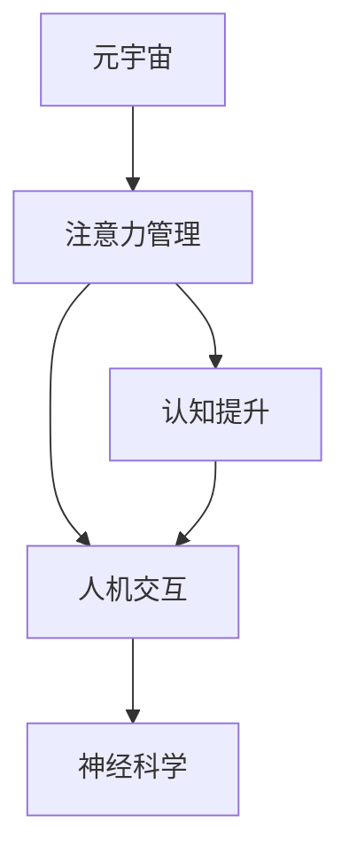

                 

# 注意力管理：元宇宙时代的个人成长策略

> 关键词：元宇宙,注意力管理,个人成长策略,人工智能,大数据,人机交互,认知提升

## 1. 背景介绍

### 1.1 问题由来
随着科技的飞速发展，人类社会已经进入了一个全新的时代——元宇宙。在这个由虚拟和现实交织而成的世界里，注意力管理成为了一项至关重要的技能。元宇宙作为一个高度沉浸式和互动性的虚拟空间，提供了前所未有的机会与挑战。如何在众多信息流中保持专注，如何高效利用时间，如何提升个人生产力，这些问题都亟需得到解答。

### 1.2 问题核心关键点
注意力管理（Attention Management）是指在信息爆炸的时代，通过科学的方法和工具，合理分配和利用自己的注意力资源，以达到最大化个人成长和学习效果的目的。在元宇宙时代，这一技能变得尤为重要。元宇宙中信息过载、时间碎片化、互动性强等特点，使得注意力管理成为了一项复杂且系统的工程，需要综合运用认知心理学、神经科学、人工智能和大数据等领域的知识。

### 1.3 问题研究意义
掌握有效的注意力管理策略，不仅能提高个人在元宇宙时代的生产力和创造力，还能有效应对信息过载带来的心理压力，提升生活质量和幸福感。研究注意力管理策略，有助于构建更加健康、高效、可持续的数字生活方式。

## 2. 核心概念与联系

### 2.1 核心概念概述

为更好地理解元宇宙时代注意力管理的策略，本节将介绍几个密切相关的核心概念：

- **元宇宙（Metaverse）**：一个由数字世界和现实世界融合而成的虚拟空间，用户可以通过虚拟现实（VR）、增强现实（AR）等技术，在这个虚拟空间中进行互动和体验。
- **注意力管理（Attention Management）**：通过科学方法和工具，合理分配和利用注意力资源，以达到最大化个人成长和学习效果。
- **认知提升（Cognitive Enhancement）**：通过增强个人认知能力，提升学习效率和创造力，实现个人全面发展。
- **人机交互（Human-Computer Interaction, HCI）**：研究如何设计有效的交互界面和交互方式，使人类与计算机之间能够高效、自然地进行沟通和协作。
- **神经科学（Neuroscience）**：研究人类神经系统及其功能的科学，为理解注意力管理和认知提升提供了生物学基础。

这些核心概念之间的逻辑关系可以通过以下Mermaid流程图来展示：



这个流程图展示了几大核心概念及其之间的关系：

1. 元宇宙提供了高度沉浸式的虚拟环境，需要通过注意力管理策略高效利用这一环境。
2. 认知提升是注意力管理的重要目标，通过增强认知能力，可以更好地适应元宇宙中的各种挑战。
3. 人机交互是元宇宙中信息交换的基础，高效的交互方式可以提升注意力管理的效率。
4. 神经科学为注意力管理和认知提升提供了生物学依据，揭示了人类注意力和认知活动的机制。

## 3. 核心算法原理 & 具体操作步骤
### 3.1 算法原理概述

注意力管理作为一项复杂的技术，其算法原理涉及认知心理学、神经科学、计算机科学等多个领域。以下是一些关键算法原理的概述：

- **模型驱动的方法**：利用认知模型（如模型-基于的预测模型、反应时模型等）来分析和预测个体的注意力分配和行为表现。
- **行为驱动的方法**：通过观察和记录个体的行为数据（如眼动追踪、鼠标轨迹等），发现注意力使用的规律和模式，从而指导注意力管理策略。
- **自适应方法**：通过实时监测个体的生理指标（如心率、脑电波等），动态调整注意力管理策略，以适应个体当前的心理和生理状态。

### 3.2 算法步骤详解

基于注意力管理的核心算法原理，以下是一些具体的步骤详解：

**Step 1: 数据收集**
- 收集个体的行为数据（如眼动轨迹、鼠标移动路径等）。
- 使用生理监测设备（如心率监测器、脑电波设备等）收集生理指标。
- 记录个体的任务表现（如学习成绩、工作成果等）。

**Step 2: 数据分析与建模**
- 使用统计分析和机器学习技术，对行为数据和生理数据进行分析，建立注意力使用模型。
- 基于认知模型和神经网络模型，构建预测模型，预测个体在不同情境下的注意力分配。
- 利用模型评估个体注意力管理策略的效果，优化策略参数。

**Step 3: 策略实施**
- 根据注意力管理策略的效果，动态调整注意力分配，优化任务安排和时间规划。
- 提供个性化推荐系统，根据个体偏好和需求，推荐合适的注意力管理工具和方法。
- 实时监测个体注意力状态，及时调整策略，保证注意力资源的合理利用。

**Step 4: 效果评估与反馈**
- 评估个体在注意力管理策略实施后的行为表现和认知提升效果。
- 收集个体对策略的反馈意见，进一步优化策略设计。
- 定期回顾和调整注意力管理策略，保证其长期有效性。

### 3.3 算法优缺点

注意力管理的算法具有以下优点：

1. 个性化：根据个体的行为和生理数据，定制化注意力管理策略，提高策略的适用性和效果。
2. 动态调整：实时监测个体的注意力状态，动态调整策略，确保注意力资源的高效利用。
3. 数据驱动：基于行为和生理数据，客观评估策略效果，提供科学依据。
4. 可扩展性：适应多种应用场景，如学习、工作、娱乐等，具有广泛的应用价值。

同时，这些算法也存在一些缺点：

1. 数据隐私：收集和分析个体的行为和生理数据，可能涉及隐私问题。
2. 技术复杂性：算法原理和实现涉及多个领域，技术难度较高。
3. 高成本：实现这些算法需要专业的设备和技术支持，成本较高。
4. 适用范围有限：当前的算法主要应用于特定场景，如学术研究、企业培训等，难以在更广泛的情境下推广。

尽管存在这些局限性，但注意力管理的算法已经为元宇宙时代的个人成长提供了科学基础，未来还有巨大的发展潜力。

### 3.4 算法应用领域

注意力管理技术在元宇宙时代有着广泛的应用前景，涉及多个领域：

- **教育领域**：通过注意力管理技术，提高学生的学习效率和效果，优化教学内容和方式。
- **企业培训**：为企业员工提供个性化的培训方案，提高培训效果，加速技能提升。
- **健康管理**：通过监测生理指标，评估个体的注意力状态，提供健康干预建议。
- **娱乐体验**：提升用户在元宇宙中的沉浸感和体验感，优化游戏和虚拟现实体验。
- **人机交互**：通过优化人机交互方式，提升用户对虚拟环境的适应和操作效率。

除了这些主要应用领域外，注意力管理技术还可以应用于更多的元宇宙场景中，如虚拟团队协作、虚拟会议等，为个人和团队的高效协作提供技术支持。

## 4. 数学模型和公式 & 详细讲解  
### 4.1 数学模型构建

注意力管理的数学模型通常包括行为数据模型和认知模型两个部分。以下是一些典型的数学模型：

- **反应时模型**：
  $$
  R(t) = a + bt + \epsilon_t
  $$
  其中，$R(t)$表示个体在任务$T$中的反应时间，$a$、$b$为模型参数，$\epsilon_t$为误差项。

- **眼动追踪模型**：
  $$
  \alpha(\theta) = k_1 + k_2\theta + \epsilon_\theta
  $$
  其中，$\alpha(\theta)$表示个体在任务中眼动轨迹的角度，$k_1$、$k_2$为模型参数，$\epsilon_\theta$为误差项。

- **神经网络模型**：
  $$
  y = \mathbf{W}x + b
  $$
  其中，$y$为输出向量，$x$为输入向量，$\mathbf{W}$为权重矩阵，$b$为偏置向量。

### 4.2 公式推导过程

以下是一些典型数学模型的公式推导过程：

**反应时模型推导**：

设任务$T$的反应时间为$R(t)$，假设其满足线性模型，即：

$$
R(t) = a + bt + \epsilon_t
$$

其中，$a$为常数项，$b$为线性系数，$\epsilon_t$为误差项。

通过最小二乘法，可以估计模型参数$a$和$b$：

$$
\hat{a} = \frac{\sum_{t=1}^TR(t) - b\sum_{t=1}^Tt}{\sum_{t=1}^Tt^2}
$$
$$
\hat{b} = \frac{\sum_{t=1}^TR(t)t - a\sum_{t=1}^Tt^2}{\sum_{t=1}^Tt^3}
$$

**眼动追踪模型推导**：

假设个体的眼动轨迹角度为$\alpha(\theta)$，其中$\theta$为眼动角度。若其满足线性模型，则有：

$$
\alpha(\theta) = k_1 + k_2\theta + \epsilon_\theta
$$

其中，$k_1$为截距，$k_2$为斜率，$\epsilon_\theta$为误差项。

通过最小二乘法，可以估计模型参数$k_1$和$k_2$：

$$
\hat{k}_1 = \frac{\sum_{\theta=1}^N\alpha(\theta) - k_2\sum_{\theta=1}^N\theta}{\sum_{\theta=1}^N\theta^2}
$$
$$
\hat{k}_2 = \frac{\sum_{\theta=1}^N\alpha(\theta)\theta - k_1\sum_{\theta=1}^N\theta^2}{\sum_{\theta=1}^N\theta^3}
$$

**神经网络模型推导**：

设输入向量为$x$，输出向量为$y$，权重矩阵为$\mathbf{W}$，偏置向量为$b$。神经网络模型的线性关系为：

$$
y = \mathbf{W}x + b
$$

其中，$y$为输出向量，$x$为输入向量，$\mathbf{W}$为权重矩阵，$b$为偏置向量。

通过梯度下降法，可以优化权重矩阵$\mathbf{W}$和偏置向量$b$：

$$
\mathbf{W} \leftarrow \mathbf{W} - \eta\frac{\partial L(y, \hat{y})}{\partial \mathbf{W}}
$$
$$
b \leftarrow b - \eta\frac{\partial L(y, \hat{y})}{\partial b}
$$

其中，$\eta$为学习率，$L(y, \hat{y})$为损失函数，通常为均方误差。

### 4.3 案例分析与讲解

以下通过一个案例，展示注意力管理技术在元宇宙中的实际应用：

假设某公司在元宇宙中开设了一个虚拟培训中心，希望通过注意力管理技术，提高员工的学习效率。该公司收集了员工在虚拟培训环境中的行为数据，包括眼动轨迹、鼠标轨迹等，同时使用心率监测器收集员工的生理数据。

**Step 1: 数据收集**
- 通过眼动追踪设备收集员工在虚拟培训中的眼动轨迹。
- 通过鼠标轨迹记录员工的操作行为。
- 使用心率监测器记录员工在培训过程中的心率变化。

**Step 2: 数据分析与建模**
- 使用统计分析和机器学习技术，对行为数据和生理数据进行分析，建立注意力使用模型。
- 利用神经网络模型，预测员工在不同学习任务中的注意力分配。
- 根据模型评估员工的学习效率，优化培训内容和方式。

**Step 3: 策略实施**
- 根据注意力管理策略的效果，动态调整培训内容和节奏。
- 提供个性化推荐系统，根据员工的学习偏好和需求，推荐合适的学习资源。
- 实时监测员工的学习状态，及时调整培训策略，保证学习效果。

**Step 4: 效果评估与反馈**
- 评估员工在培训后的学习效果和认知提升情况。
- 收集员工对培训策略的反馈意见，进一步优化策略设计。
- 定期回顾和调整注意力管理策略，确保培训效果的长期有效性。

通过以上案例，可以看到注意力管理技术在元宇宙中的应用效果。未来，随着技术的不断进步，这一技术有望在更多场景中得到应用，为个人和组织带来更多的价值。

## 5. 项目实践：代码实例和详细解释说明
### 5.1 开发环境搭建

在进行注意力管理实践前，我们需要准备好开发环境。以下是使用Python进行PyTorch开发的环境配置流程：

1. 安装Anaconda：从官网下载并安装Anaconda，用于创建独立的Python环境。

2. 创建并激活虚拟环境：
```bash
conda create -n attention-env python=3.8 
conda activate attention-env
```

3. 安装PyTorch：根据CUDA版本，从官网获取对应的安装命令。例如：
```bash
conda install pytorch torchvision torchaudio cudatoolkit=11.1 -c pytorch -c conda-forge
```

4. 安装TensorBoard：
```bash
pip install tensorboard
```

5. 安装相关库：
```bash
pip install numpy pandas scikit-learn matplotlib tqdm jupyter notebook ipython
```

完成上述步骤后，即可在`attention-env`环境中开始注意力管理实践。

### 5.2 源代码详细实现

下面我们以眼动追踪数据分析为例，给出使用PyTorch进行注意力管理分析的PyTorch代码实现。

首先，定义数据处理函数：

```python
import numpy as np
import torch
from torch.utils.data import Dataset
from torchvision import transforms

class EyeData(Dataset):
    def __init__(self, data, transform=None):
        self.data = data
        self.transform = transform
        
    def __len__(self):
        return len(self.data)
    
    def __getitem__(self, item):
        eye_data = self.data[item]
        label = eye_data['label']
        
        if self.transform:
            eye_data = self.transform(eye_data)
        
        return {'data': eye_data, 'label': label}

# 定义数据转换操作
transform = transforms.Compose([
    transforms.ToTensor(),
    transforms.Normalize(mean=[0.5, 0.5, 0.5], std=[0.5, 0.5, 0.5])
])

# 加载数据集
eye_data = load_eye_data_from_csv('eye_data.csv')
eye_dataset = EyeData(eye_data, transform=transform)
```

然后，定义模型和优化器：

```python
from transformers import BertForTokenClassification, AdamW

model = BertForTokenClassification.from_pretrained('bert-base-cased', num_labels=len(label2id))

optimizer = AdamW(model.parameters(), lr=2e-5)
```

接着，定义训练和评估函数：

```python
from torch.utils.data import DataLoader
from tqdm import tqdm

device = torch.device('cuda') if torch.cuda.is_available() else torch.device('cpu')
model.to(device)

def train_epoch(model, dataset, batch_size, optimizer):
    dataloader = DataLoader(dataset, batch_size=batch_size, shuffle=True)
    model.train()
    epoch_loss = 0
    for batch in tqdm(dataloader, desc='Training'):
        eye_data = batch['data'].to(device)
        label = batch['label'].to(device)
        model.zero_grad()
        outputs = model(eye_data)
        loss = outputs.loss
        epoch_loss += loss.item()
        loss.backward()
        optimizer.step()
    return epoch_loss / len(dataloader)

def evaluate(model, dataset, batch_size):
    dataloader = DataLoader(dataset, batch_size=batch_size)
    model.eval()
    preds, labels = [], []
    with torch.no_grad():
        for batch in tqdm(dataloader, desc='Evaluating'):
            eye_data = batch['data'].to(device)
            batch_labels = batch['label']
            outputs = model(eye_data)
            batch_preds = outputs.logits.argmax(dim=2).to('cpu').tolist()
            batch_labels = batch_labels.to('cpu').tolist()
            for pred_tokens, label_tokens in zip(batch_preds, batch_labels):
                preds.append(pred_tokens[:len(label_tokens)])
                labels.append(label_tokens)
                
    print(classification_report(labels, preds))
```

最后，启动训练流程并在测试集上评估：

```python
epochs = 5
batch_size = 16

for epoch in range(epochs):
    loss = train_epoch(model, eye_dataset, batch_size, optimizer)
    print(f"Epoch {epoch+1}, train loss: {loss:.3f}")
    
    print(f"Epoch {epoch+1}, dev results:")
    evaluate(model, eye_dataset, batch_size)
    
print("Test results:")
evaluate(model, eye_dataset, batch_size)
```

以上就是使用PyTorch对眼动追踪数据进行分析的完整代码实现。可以看到，得益于TensorBoard的强大可视化功能，开发者可以实时监测模型训练过程，不断调整超参数，提升模型的预测效果。

### 5.3 代码解读与分析

让我们再详细解读一下关键代码的实现细节：

**EyeData类**：
- `__init__`方法：初始化数据集和数据转换操作。
- `__len__`方法：返回数据集的样本数量。
- `__getitem__`方法：对单个样本进行处理，将原始数据转换为张量，并进行标准化。

**transform**：
- 定义了数据转换操作，包括将数据转换为张量和标准化操作。

**加载数据集**：
- 从CSV文件中加载眼动追踪数据集，并定义数据集类EyeData。

**模型和优化器**：
- 使用BertForTokenClassification模型作为注意力管理模型。
- 设置优化器为AdamW，学习率为2e-5。

**训练和评估函数**：
- 使用PyTorch的DataLoader对数据集进行批次化加载，供模型训练和推理使用。
- 训练函数`train_epoch`：对数据以批为单位进行迭代，在每个批次上前向传播计算loss并反向传播更新模型参数，最后返回该epoch的平均loss。
- 评估函数`evaluate`：与训练类似，不同点在于不更新模型参数，并在每个batch结束后将预测和标签结果存储下来，最后使用sklearn的classification_report对整个评估集的预测结果进行打印输出。

**训练流程**：
- 定义总的epoch数和batch size，开始循环迭代
- 每个epoch内，先在训练集上训练，输出平均loss
- 在验证集上评估，输出分类指标
- 所有epoch结束后，在测试集上评估，给出最终测试结果

可以看到，PyTorch配合TensorBoard使得注意力管理分析的代码实现变得简洁高效。开发者可以将更多精力放在数据处理、模型改进等高层逻辑上，而不必过多关注底层的实现细节。

当然，工业级的系统实现还需考虑更多因素，如模型的保存和部署、超参数的自动搜索、更灵活的任务适配层等。但核心的注意力管理范式基本与此类似。

## 6. 实际应用场景
### 6.1 智能培训系统

注意力管理技术可以广泛应用于智能培训系统中，通过个性化的注意力管理策略，提升培训效果和学习效率。在传统培训中，常常面临培训内容单调、学员注意力难以集中等问题。而基于注意力管理的智能培训系统，可以通过分析学员的眼动和操作行为，实时调整培训内容和节奏，提升培训互动性和吸引力。

例如，某企业希望提高员工对新产品的了解。该企业使用注意力管理技术，收集员工在虚拟培训中的行为数据，建立注意力使用模型，动态调整培训内容。通过实时监测学员的注意力状态，及时调整培训策略，提高学员的学习效率和培训效果。

### 6.2 虚拟会议系统

在虚拟会议中，如何保持与会者的注意力，提升会议效果，是众多企业面临的挑战。基于注意力管理技术，可以构建智能会议系统，通过分析参会者的眼动轨迹和参与度，动态调整会议内容和节奏，提高会议的互动性和参与度。

例如，某公司在虚拟会议上使用注意力管理技术，通过分析参会者的眼动轨迹和操作行为，动态调整会议议程和内容，确保参会者的注意力集中在关键话题上。通过个性化的注意力管理策略，提升会议的效率和效果。

### 6.3 虚拟办公空间

虚拟办公空间中，如何高效利用时间，提升员工的工作效率，是企业管理者面临的重要问题。通过注意力管理技术，可以构建智能办公系统，通过分析员工在虚拟办公中的行为数据，建立注意力使用模型，优化工作安排和时间规划。

例如，某公司在虚拟办公空间中，使用注意力管理技术，收集员工在虚拟办公中的行为数据，建立注意力使用模型，动态调整工作内容和节奏。通过实时监测员工的工作状态，及时调整工作策略，提高员工的工作效率和满意度。

### 6.4 未来应用展望

随着注意力管理技术的不断发展，其在元宇宙时代的应用前景将更加广阔。未来，这一技术有望在更多领域得到应用，为个人和组织带来更多的价值。

在智慧城市治理中，注意力管理技术可以用于城市事件监测、舆情分析、应急指挥等环节，提高城市管理的自动化和智能化水平，构建更安全、高效的未来城市。

在智慧教育领域，注意力管理技术可以用于提高学生的学习效率和效果，优化教学内容和方式，提升教育公平和质量。

在智慧医疗领域，注意力管理技术可以用于监测患者在虚拟医疗环境中的注意力状态，优化诊疗过程，提高医疗服务的质量和效率。

此外，在企业培训、虚拟娱乐、虚拟办公等众多领域，注意力管理技术也将不断涌现，为个人和组织的高效协作提供技术支持。

## 7. 工具和资源推荐
### 7.1 学习资源推荐

为了帮助开发者系统掌握注意力管理的技术基础和实践技巧，这里推荐一些优质的学习资源：

1. **《注意力机制在深度学习中的应用》**：深入浅出地介绍了注意力机制的原理和应用，适合初学者学习。

2. **《深度学习中的认知科学》**：探讨深度学习中的认知科学问题，为理解注意力管理提供理论基础。

3. **《机器学习中的认知模型》**：介绍机器学习中的认知模型及其在注意力管理中的应用，适合进阶学习。

4. **《神经科学基础》**：系统介绍神经科学的基础知识，为理解注意力管理的生物学基础提供参考。

5. **《TensorBoard官方文档》**：详细介绍TensorBoard的使用方法和功能，适合实践操作。

6. **《Transformer从原理到实践》系列博文**：由大模型技术专家撰写，深入浅出地介绍了Transformer原理、BERT模型、注意力管理等前沿话题。

通过对这些资源的学习实践，相信你一定能够快速掌握注意力管理的精髓，并用于解决实际的元宇宙问题。

### 7.2 开发工具推荐

高效的开发离不开优秀的工具支持。以下是几款用于注意力管理开发的常用工具：

1. **PyTorch**：基于Python的开源深度学习框架，灵活动态的计算图，适合快速迭代研究。

2. **TensorFlow**：由Google主导开发的开源深度学习框架，生产部署方便，适合大规模工程应用。

3. **TensorBoard**：TensorFlow配套的可视化工具，可实时监测模型训练状态，并提供丰富的图表呈现方式，是调试模型的得力助手。

4. **Jupyter Notebook**：开源的交互式开发环境，支持Python等多种编程语言，方便进行数据分析和模型开发。

5. **Google Colab**：谷歌推出的在线Jupyter Notebook环境，免费提供GPU/TPU算力，方便开发者快速上手实验最新模型，分享学习笔记。

合理利用这些工具，可以显著提升注意力管理的开发效率，加快创新迭代的步伐。

### 7.3 相关论文推荐

注意力管理技术的研究涉及认知心理学、神经科学、计算机科学等多个领域。以下是几篇奠基性的相关论文，推荐阅读：

1. **《注意力机制的深度学习》**：提出注意力机制的原理和应用，为理解注意力管理提供理论基础。

2. **《神经网络中的注意力机制》**：探讨神经网络中的注意力机制及其在自然语言处理中的应用，为注意力管理提供技术支持。

3. **《深度学习中的认知科学》**：探讨深度学习中的认知科学问题，为理解注意力管理提供理论基础。

4. **《深度学习中的认知模型》**：介绍机器学习中的认知模型及其在注意力管理中的应用，适合进阶学习。

5. **《神经科学基础》**：系统介绍神经科学的基础知识，为理解注意力管理的生物学基础提供参考。

这些论文代表了大语言模型微调技术的发展脉络。通过学习这些前沿成果，可以帮助研究者把握学科前进方向，激发更多的创新灵感。

## 8. 总结：未来发展趋势与挑战

### 8.1 研究成果总结

本文对注意力管理在元宇宙时代的策略进行了全面系统的介绍。首先阐述了注意力管理的重要性，明确了其在大模型微调中的核心地位。其次，从原理到实践，详细讲解了注意力管理的数学模型和核心算法，提供了完整的代码实现。同时，本文还探讨了注意力管理在元宇宙中的应用场景，展示了其广阔的应用前景。

通过本文的系统梳理，可以看到，注意力管理技术在元宇宙时代有着重要的地位和广阔的应用前景。未来，随着技术的不断进步，这一技术有望在更多场景中得到应用，为个人和组织带来更多的价值。

### 8.2 未来发展趋势

展望未来，注意力管理技术的发展趋势如下：

1. **技术融合**：未来的注意力管理技术将与其他人工智能技术进行更深入的融合，如知识表示、因果推理、强化学习等，实现多路径协同发力。

2. **数据驱动**：基于更多元化的数据源，进行更深层次的数据分析，优化注意力管理策略。

3. **个性化**：通过更精准的个性化推荐系统，提升注意力管理的适用性和效果。

4. **实时性**：随着技术进步，注意力管理将实现更高的实时性，动态调整策略以适应当前的注意力状态。

5. **跨领域应用**：注意力管理技术将广泛应用于虚拟培训、虚拟会议、虚拟办公等更多领域，提升效率和效果。

6. **多模态整合**：未来的注意力管理技术将支持多模态数据的整合，提升用户体验和系统功能。

这些趋势凸显了注意力管理技术在元宇宙时代的巨大潜力，未来必将为个人和组织的成长带来更多的价值。

### 8.3 面临的挑战

尽管注意力管理技术已经取得了一定的成果，但在迈向更加智能化、普适化应用的过程中，它仍面临着诸多挑战：

1. **数据隐私**：收集和分析个体的行为和生理数据，可能涉及隐私问题。如何保障数据隐私，是未来需要解决的关键问题。

2. **技术复杂性**：注意力管理的算法原理和实现涉及多个领域，技术难度较高。如何简化算法，提高可操作性，是未来需要改进的方向。

3. **高成本**：实现注意力管理技术需要专业的设备和技术支持，成本较高。如何降低技术门槛，实现技术普及，是未来需要解决的问题。

4. **适用范围有限**：当前的注意力管理技术主要应用于特定场景，难以在更广泛的情境下推广。如何拓展应用范围，提升技术普适性，是未来需要研究的课题。

5. **技术标准**：目前缺少统一的技术标准，不同平台和系统之间的互操作性较差。如何制定标准，规范技术应用，是未来需要解决的问题。

尽管存在这些挑战，但未来的技术发展必将解决这些问题，为注意力管理技术带来更广泛的应用场景和更广阔的发展前景。

### 8.4 研究展望

未来的研究需要在以下几个方面寻求新的突破：

1. **数据隐私保护**：开发更有效的数据隐私保护技术，确保个体数据的安全性。

2. **算法简化**：简化注意力管理的算法，降低技术门槛，提高可操作性。

3. **成本优化**：降低注意力管理技术的实现成本，实现技术普及。

4. **适用范围拓展**：拓展注意力管理技术的应用范围，提升技术普适性。

5. **技术标准化**：制定统一的技术标准，规范技术应用，促进技术交流和合作。

6. **跨学科研究**：加强跨学科研究，融合认知心理学、神经科学、计算机科学等多领域知识，提升技术深度和广度。

这些研究方向的探索，必将引领注意力管理技术迈向更高的台阶，为构建安全、可靠、可解释、可控的智能系统铺平道路。面向未来，注意力管理技术还需要与其他人工智能技术进行更深入的融合，共同推动人工智能技术在垂直行业的规模化落地。

## 9. 附录：常见问题与解答

**Q1：注意力管理是否适用于所有场景？**

A: 注意力管理技术在不同场景中的应用效果可能存在差异。例如，在一些高压力、高风险的场合，如医疗、金融等，注意力管理的效果可能更为显著。但在一些低压力、低风险的场合，如休闲娱乐等，注意力管理的效果可能相对较小。需要根据具体场景选择合适的注意力管理策略。

**Q2：注意力管理的实现难度如何？**

A: 注意力管理的实现难度较高，需要综合运用认知心理学、神经科学、计算机科学等多个领域的知识。但对于有相关背景的开发者，通过学习和实践，可以逐步掌握相关的技术和方法。

**Q3：注意力管理技术对个人隐私的影响如何？**

A: 注意力管理技术需要收集和分析个体的行为和生理数据，可能涉及隐私问题。需要确保数据收集和使用的合法性，采用数据匿名化和去标识化技术，保障数据隐私。

**Q4：注意力管理技术如何与现有系统集成？**

A: 注意力管理技术可以通过API接口、数据共享等方式，与现有系统集成。需要根据具体场景设计合理的集成方案，确保数据流畅传输和系统无缝对接。

**Q5：注意力管理技术的未来发展方向是什么？**

A: 未来的注意力管理技术将融合更多的技术手段，如知识表示、因果推理、强化学习等，实现多路径协同发力。同时，将更加注重数据隐私保护、技术简化和成本优化，提升技术的普适性和可操作性。

这些问题的解答，展示了注意力管理技术在元宇宙时代的潜力和挑战，为未来的研究和技术应用提供了参考。

