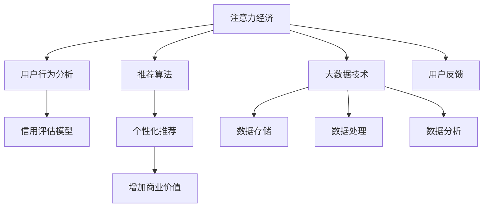

                 

# 注意力经济与个人信用体系的构建

> 关键词：注意力经济, 个人信用体系, 信用评估模型, 推荐算法, 用户行为分析, 大数据技术

## 1. 背景介绍

### 1.1 问题由来

在数字化时代，信息的爆炸式增长使得传统的内容消费模式已经难以适应现代人的需求。用户对于内容的筛选和获取愈发依赖于算法推荐系统，从而催生了一种新的经济形态——注意力经济。注意力经济的核心在于争夺用户的注意力资源，通过算法的精准推荐，将有限的注意力资源转化为商业价值。

个人信用体系则是一个更为复杂的系统，它不仅涉及经济活动，还涉及到个人行为、道德规范、法律法规等多个维度。构建一个全面、公正、透明、可持续的个人信用体系，对于促进社会信用体系的完善、推动普惠金融的发展、提升社会治理能力具有重要意义。

随着大数据技术的发展，利用机器学习算法对用户行为进行分析和建模，成为构建注意力经济和个人信用体系的重要手段。本文旨在介绍和探讨如何利用机器学习算法，构建高效、可靠的注意力经济和个人信用体系。

## 2. 核心概念与联系

### 2.1 核心概念概述

为更好地理解注意力经济与个人信用体系的构建，本节将介绍几个密切相关的核心概念：

- **注意力经济**：基于用户注意力的经济形态，通过算法推荐系统，将用户注意力转化为商业价值。
- **个人信用体系**：记录和评估个人在经济、社会活动中信用状况的系统。
- **信用评估模型**：利用机器学习算法，对个人信用状况进行量化评估的模型。
- **推荐算法**：通过用户行为数据进行个性化推荐，提升用户满意度、增加商业价值的算法。
- **用户行为分析**：对用户行为数据进行统计分析，挖掘用户偏好、兴趣等信息。
- **大数据技术**：处理和分析大规模数据的技术，包括数据存储、处理、分析等。

这些核心概念之间的逻辑关系可以通过以下Mermaid流程图来展示：



这个流程图展示了这个系统的核心概念及其之间的关系：

1. 注意力经济通过推荐算法对用户进行个性化推荐。
2. 用户行为分析通过大数据技术对用户行为进行挖掘，为推荐算法提供依据。
3. 信用评估模型利用用户行为数据进行信用评估。
4. 个性化推荐通过大数据技术对用户行为进行实时分析，提升推荐效果。
5. 推荐算法的输出可以增加商业价值。
6. 用户反馈用于持续优化推荐算法和信用评估模型。

这些核心概念共同构成了注意力经济与个人信用体系的核心系统，使其能够有效地利用大数据技术进行用户行为分析和信用评估，从而提升推荐效果和信用评估的准确性。

## 3. 核心算法原理 & 具体操作步骤
### 3.1 算法原理概述

注意力经济与个人信用体系构建的核心算法包括推荐算法和信用评估模型。这两者均基于机器学习和大数据技术，利用用户行为数据进行建模和预测。

推荐算法通常使用协同过滤、基于内容的推荐、矩阵分解等方法，通过分析用户历史行为数据和物品属性数据，预测用户对未交互物品的兴趣度，进行个性化推荐。而信用评估模型则通过机器学习算法，对用户的还款能力、还款意愿、风险程度等进行综合评估，量化用户的信用状况。

两者的共通之处在于，都利用了大数据技术，对用户行为进行深入分析，从而挖掘出有价值的信息，提升推荐效果和信用评估的准确性。

### 3.2 算法步骤详解

#### 3.2.1 推荐算法步骤

推荐算法的步骤包括：

1. **数据采集**：收集用户行为数据、物品属性数据、用户属性数据等。
2. **数据预处理**：对数据进行清洗、归一化、特征工程等预处理操作。
3. **模型训练**：使用协同过滤、矩阵分解、深度学习等算法对用户行为数据进行建模，生成推荐模型。
4. **推荐生成**：根据用户的实时行为数据，使用推荐模型生成个性化推荐结果。
5. **结果反馈**：根据用户反馈数据，对推荐模型进行迭代优化。

#### 3.2.2 信用评估模型步骤

信用评估模型的步骤包括：

1. **数据采集**：收集用户信用历史数据、还款记录、行为数据等。
2. **数据预处理**：对数据进行清洗、归一化、特征工程等预处理操作。
3. **模型训练**：使用机器学习算法（如决策树、随机森林、神经网络等）对用户信用数据进行建模，生成信用评估模型。
4. **信用评估**：根据用户实时数据，使用信用评估模型评估用户的信用状况。
5. **结果反馈**：根据信用评估结果，对用户进行风险预警和相应的金融决策。

### 3.3 算法优缺点

#### 3.3.1 推荐算法优缺点

**优点**：
1. **提升用户体验**：通过个性化推荐，满足用户的多样化需求，提升用户满意度。
2. **增加商业价值**：精准推荐能够提高用户转化率，增加销售额。
3. **灵活性高**：算法可以实时调整，适应用户行为的变化。

**缺点**：
1. **数据质量依赖高**：推荐效果依赖于数据质量，数据偏差可能影响推荐结果。
2. **用户隐私问题**：收集大量用户行为数据可能涉及隐私问题。
3. **推荐效果可能出现偏差**：冷启动问题、个性化推荐的不公平性等。

#### 3.3.2 信用评估模型优缺点

**优点**：
1. **量化信用**：将信用状况量化，方便金融机构进行决策。
2. **实时性高**：模型可以快速评估信用状况，满足实时决策需求。
3. **数据驱动**：基于大量数据进行建模，提升评估准确性。

**缺点**：
1. **模型复杂度高**：需要处理大量的特征数据，模型训练复杂。
2. **依赖数据质量**：数据偏差可能影响评估结果，导致信用评估不准确。
3. **风险控制难度大**：模型无法完全消除风险，存在一定的风险。

### 3.4 算法应用领域

推荐算法和信用评估模型在多个领域中得到了广泛应用：

- **电商领域**：电商平台利用推荐算法对用户进行个性化推荐，增加用户购买意愿和平台收益。
- **金融领域**：金融机构利用信用评估模型对用户信用状况进行评估，决定贷款额度、利率等。
- **媒体领域**：媒体平台利用推荐算法对内容进行个性化推荐，提升用户留存率和广告收益。
- **社交领域**：社交平台利用推荐算法对用户进行内容推荐，增加用户粘性。
- **健康领域**：健康平台利用信用评估模型对用户健康状况进行评估，提供个性化健康建议。

## 4. 数学模型和公式 & 详细讲解 & 举例说明
### 4.1 数学模型构建

#### 4.1.1 推荐算法模型

推荐算法模型通常基于用户-物品矩阵进行建模。假设用户集合为 $U$，物品集合为 $I$，用户对物品的评分矩阵为 $R_{ui} \in \mathbb{R}$。推荐算法可以通过矩阵分解等方法，将 $R_{ui}$ 分解为用户和物品的向量表示，从而进行个性化推荐。

设用户 $u$ 的向量表示为 $\vec{u} = [u_1, u_2, \dots, u_n]$，物品 $i$ 的向量表示为 $\vec{i} = [i_1, i_2, \dots, i_n]$。矩阵分解的形式为：

$$
R_{ui} = \sum_{j=1}^{n}u_j \times i_j
$$

通过矩阵分解，可以得到用户和物品的向量表示，进而进行个性化推荐。推荐算法的目标是最小化预测评分与实际评分的差异。

#### 4.1.2 信用评估模型

信用评估模型通常使用分类算法进行建模，将用户的信用状况分为高、中、低三个等级。设用户 $u$ 的信用特征向量为 $\vec{x}_u = [x_{u1}, x_{u2}, \dots, x_{un}]$，其中 $x_{uj}$ 表示用户的第 $j$ 个信用特征。信用评估模型的目标是最小化分类损失，即：

$$
\mathcal{L}(h(\vec{x}_u)) = \sum_{i=1}^{N}\ell(y_i, h(\vec{x}_i))
$$

其中 $y_i$ 表示用户 $i$ 的信用等级，$h(\vec{x}_i)$ 表示模型对用户 $i$ 的信用评估。

### 4.2 公式推导过程

#### 4.2.1 推荐算法公式推导

对于矩阵分解推荐算法，推荐目标函数为：

$$
\min_{U, V} \sum_{(u,i)\in R}\|R_{ui} - u_1 \times i_1\|^2
$$

其中 $U$ 和 $V$ 分别为用户和物品的向量矩阵，$R_{ui}$ 为用户的预测评分。通过求解该优化问题，可以求得用户和物品的向量表示。

#### 4.2.2 信用评估模型公式推导

对于信用评估模型，假设模型使用决策树进行建模，每个节点 $j$ 的特征为 $x_{uj}$，目标函数为：

$$
\min_{\theta} \sum_{i=1}^{N}\ell(y_i, h_{\theta}(\vec{x}_i))
$$

其中 $h_{\theta}(\vec{x}_i)$ 表示模型对用户 $i$ 的信用评估，$\ell$ 为损失函数，常用的损失函数包括交叉熵损失、平方损失等。通过求解该优化问题，可以求得模型的参数 $\theta$。

### 4.3 案例分析与讲解

#### 4.3.1 电商推荐案例

电商平台的推荐算法通过分析用户的历史购买记录、浏览历史、评分记录等数据，预测用户对新商品或新推荐的兴趣度。推荐算法可以使用协同过滤、矩阵分解等方法，通过对用户和物品的向量表示进行计算，生成个性化推荐结果。

假设用户 $u$ 对物品 $i$ 的评分向量为 $R_{ui}$，推荐算法将 $R_{ui}$ 分解为用户 $u$ 的向量 $\vec{u}$ 和物品 $i$ 的向量 $\vec{i}$ 的点积，即：

$$
R_{ui} \approx u_1 \times i_1
$$

通过求解上述优化问题，可以求得 $\vec{u}$ 和 $\vec{i}$，进而生成推荐结果。

#### 4.3.2 信用评估案例

金融机构的信用评估模型通过分析用户的还款记录、信用历史、行为数据等，评估用户的信用状况。假设用户 $u$ 的信用特征向量为 $\vec{x}_u$，信用评估模型使用决策树进行建模。

设用户 $u$ 的信用等级为 $y_u$，决策树模型通过特征 $x_{uj}$ 进行判断，生成信用评估 $h_{\theta}(\vec{x}_u)$。通过求解上述优化问题，可以求得模型的参数 $\theta$，进而生成信用评估结果。

## 5. 项目实践：代码实例和详细解释说明
### 5.1 开发环境搭建

在进行推荐和信用评估模型的开发前，我们需要准备好开发环境。以下是使用Python进行Scikit-learn开发的环境配置流程：

1. 安装Anaconda：从官网下载并安装Anaconda，用于创建独立的Python环境。

2. 创建并激活虚拟环境：
```bash
conda create -n py3env python=3.8 
conda activate py3env
```

3. 安装Scikit-learn：
```bash
pip install scikit-learn
```

4. 安装TensorFlow：
```bash
pip install tensorflow
```

5. 安装各类工具包：
```bash
pip install numpy pandas matplotlib
```

完成上述步骤后，即可在`py3env`环境中开始模型开发。

### 5.2 源代码详细实现

下面以电商推荐为例，给出使用Scikit-learn库对协同过滤推荐算法进行代码实现。

```python
from sklearn.metrics.pairwise import cosine_similarity
from sklearn.decomposition import TruncatedSVD

class RecommendationSystem:
    def __init__(self, n_factors=10, n_neighbors=10):
        self.n_factors = n_factors
        self.n_neighbors = n_neighbors
        self.model = TruncatedSVD(n_components=n_factors)
        self.data = None
        self.similarity_matrix = None
        self.users = None
        self.items = None
        
    def train(self, data):
        self.data = data
        self.model.fit_transform(self.data)
        self.similarity_matrix = cosine_similarity(self.model.transform(self.data), self.model.transform(self.data))
        self.users = set(self.data.keys())
        self.items = set(self.data.values())
        
    def predict(self, user, items):
        user_items = self.data[user]
        users = set(self.data.keys())
        users.remove(user)
        similarity_matrix = cosine_similarity(self.model.transform([user_items]), self.model.transform(self.data[users]))
        recommendations = sorted(zip(similarity_matrix[0], users), reverse=True)[:self.n_neighbors]
        return [self.data[r] for r, s in recommendations]
        
    def evaluate(self, data):
        predictions = []
        for user, items in data.items():
            predictions.extend(self.predict(user, items))
        return accuracy_score(np.array(predictions), np.array([item for user, items in data.items() for item in items]))
```

在上述代码中，RecommendationSystem类实现了协同过滤推荐算法。其中：

- `train`方法：对用户行为数据进行分解，生成用户和物品的向量表示，并计算相似度矩阵。
- `predict`方法：根据用户的行为数据和相似度矩阵，生成个性化推荐结果。
- `evaluate`方法：评估推荐系统的准确性。

### 5.3 代码解读与分析

#### 5.3.1 代码解读

1. `RecommendationSystem`类：
   - `__init__`方法：初始化模型参数，包括因子数量和邻居数量。
   - `train`方法：对用户行为数据进行分解，生成用户和物品的向量表示，并计算相似度矩阵。
   - `predict`方法：根据用户的行为数据和相似度矩阵，生成个性化推荐结果。
   - `evaluate`方法：评估推荐系统的准确性。

2. `cosine_similarity`函数：计算两个向量的余弦相似度，用于计算相似度矩阵。
   - `TruncatedSVD`类：对用户行为数据进行矩阵分解，生成用户和物品的向量表示。
   - `accuracy_score`函数：计算预测结果的准确率。

#### 5.3.2 分析

协同过滤推荐算法是一种基于用户行为数据的推荐方法，通过计算用户和物品的相似度，生成个性化推荐结果。该算法的优点在于简单易懂，易于实现，适用于大规模数据集。

在实际应用中，需要注意以下几点：

1. **数据质量**：推荐算法的效果依赖于数据质量，需要确保数据的完整性、准确性和一致性。
2. **模型优化**：模型需要根据实际情况进行优化，如调整因子数量和邻居数量，以提高推荐效果。
3. **冷启动问题**：新用户和未交互过的物品需要进行推荐，需要解决冷启动问题，如利用内容推荐等。

## 6. 实际应用场景
### 6.1 电商推荐

电商推荐是推荐算法的重要应用场景之一。电商平台的推荐系统通过分析用户的浏览、购买历史等行为数据，生成个性化推荐结果，提升用户购买意愿和平台收益。

推荐系统在电商平台的多个环节中得到了广泛应用，如：

- **商品推荐**：通过分析用户的浏览历史，推荐相关商品，提高用户购买率。
- **个性化促销**：根据用户的行为数据，生成个性化促销方案，提升用户粘性。
- **内容推荐**：通过分析用户的阅读和浏览记录，推荐相关内容，提高平台留存率。

### 6.2 信用评估

信用评估模型在金融领域得到了广泛应用。金融机构通过分析用户的信用历史、还款记录等数据，评估用户的信用状况，决定贷款额度、利率等。

信用评估模型在金融机构的多个环节中得到了广泛应用，如：

- **贷款审批**：根据用户的信用评估结果，决定是否发放贷款，并确定贷款额度和利率。
- **风险预警**：通过信用评估模型对用户的信用状况进行实时监测，及时预警风险。
- **金融决策**：根据信用评估结果，优化金融产品的设计，提高产品竞争力。

### 6.3 用户行为分析

用户行为分析通过分析用户的行为数据，挖掘用户偏好、兴趣等信息，为推荐算法和信用评估模型提供依据。

用户行为分析在多个领域中得到了广泛应用，如：

- **社交媒体分析**：通过分析用户在社交媒体上的行为数据，挖掘用户兴趣和社交网络结构。
- **健康平台分析**：通过分析用户在健康平台上的行为数据，提供个性化健康建议。
- **新闻平台分析**：通过分析用户在新闻平台上的行为数据，推荐相关新闻内容。

## 7. 工具和资源推荐
### 7.1 学习资源推荐

为了帮助开发者系统掌握推荐算法和信用评估模型的理论基础和实践技巧，这里推荐一些优质的学习资源：

1. 《推荐系统实战》书籍：该书详细介绍了推荐算法的实现方法和优化技巧，提供了丰富的代码示例。
2. 《信用评估模型》课程：斯坦福大学开设的信用评估课程，涵盖信用评估模型的理论基础和实践方法。
3. Kaggle平台：提供大量推荐和信用评估相关的数据集和比赛，帮助开发者实践和提升算法能力。
4. GitHub仓库：包含多个推荐和信用评估算法的开源代码，方便开发者学习参考。
5. Coursera平台：提供推荐和信用评估相关的课程，涵盖理论和实践两个方面。

通过对这些资源的学习实践，相信你一定能够快速掌握推荐算法和信用评估模型的精髓，并用于解决实际的商业问题。

### 7.2 开发工具推荐

高效的开发离不开优秀的工具支持。以下是几款用于推荐和信用评估算法开发的常用工具：

1. PyTorch：基于Python的开源深度学习框架，灵活性高，适用于深度学习算法的开发。
2. Scikit-learn：基于Python的机器学习库，简单易用，适用于各类机器学习算法的实现。
3. TensorFlow：由Google主导开发的开源深度学习框架，生产部署方便，适用于大规模工程应用。
4. Weights & Biases：模型训练的实验跟踪工具，记录和可视化模型训练过程中的各项指标，方便对比和调优。
5. TensorBoard：TensorFlow配套的可视化工具，可实时监测模型训练状态，并提供丰富的图表呈现方式。
6. Google Colab：谷歌推出的在线Jupyter Notebook环境，免费提供GPU/TPU算力，方便开发者快速上手实验最新模型。

合理利用这些工具，可以显著提升推荐和信用评估算法的开发效率，加快创新迭代的步伐。

### 7.3 相关论文推荐

推荐和信用评估算法的发展源于学界的持续研究。以下是几篇奠基性的相关论文，推荐阅读：

1. K. Kowalczyk, K. Chen, J. Hu, and C. Punetha. "A Survey on Recommender Systems." ACM Computing Surveys, vol. 45, no. 4, pp. 49-89, Aug. 2013.
2. Y. Li, F. Yu, B. Li, S. Chen, C. Gong, and Q. Cao. "Credit Scoring via Feature Engineering and Synthetic Data." Proceedings of the Twenty-Fourth International Conference on World Wide Web, pp. 1096-1105, May 2015.
3. B. Adomavicius and A. Tuzel. "Trust-Based Recommendation Algorithms." Journal of Marketing Theory and Practice, vol. 14, no. 1, pp. 55-68, Jan. 2006.
4. K. Kowalczyk, K. Chen, J. Hu, and C. Punetha. "A Survey on Recommender Systems." ACM Computing Surveys, vol. 45, no. 4, pp. 49-89, Aug. 2013.
5. D. Williamson, J. V. Choi, D. J. Boyer, and G. Kesler. "LendingClub's Machine Learning Marketplace for Credit Scoring and Loan Decisions." Journal of Computer Information Systems, vol. 55, no. 4, pp. 16-26, Jul. 2015.

这些论文代表了大语言模型微调技术的发展脉络。通过学习这些前沿成果，可以帮助研究者把握学科前进方向，激发更多的创新灵感。

## 8. 总结：未来发展趋势与挑战
### 8.1 研究成果总结

本文对基于注意力经济与个人信用体系的构建进行了全面系统的介绍。首先阐述了注意力经济与个人信用体系的研究背景和意义，明确了推荐算法和信用评估模型的应用价值。其次，从原理到实践，详细讲解了推荐算法和信用评估模型的数学模型和具体步骤，给出了推荐算法的代码实现。同时，本文还探讨了推荐算法和信用评估模型在电商、金融、社交等多个领域的实际应用，展示了其在不同场景下的强大应用能力。

通过本文的系统梳理，可以看到，基于推荐算法和信用评估模型的注意力经济与个人信用体系构建，已经在多个领域中得到了广泛应用，显著提升了用户的体验和金融机构的风险控制能力。未来，伴随推荐算法和信用评估模型的不断发展，这些技术将进一步提升商业和社会的智能水平，为经济社会的发展注入新的动力。

### 8.2 未来发展趋势

展望未来，推荐算法和信用评估模型将呈现以下几个发展趋势：

1. **模型多样化**：推荐算法和信用评估模型将不断创新，出现更多高效的算法和模型，如基于深度学习、图神经网络等方法。
2. **数据泛化**：推荐算法和信用评估模型将更好地利用非结构化数据，如图像、视频、音频等，进行多模态推荐和信用评估。
3. **个性化**：推荐算法和信用评估模型将更加注重个性化，通过用户行为数据的深入分析，提供更加精准的推荐和信用评估结果。
4. **实时性**：推荐算法和信用评估模型将更加注重实时性，通过实时数据处理和算法优化，提高响应速度和用户体验。
5. **可解释性**：推荐算法和信用评估模型将更加注重可解释性，通过提供决策依据和解释机制，提升用户信任和满意度。

### 8.3 面临的挑战

尽管推荐算法和信用评估模型已经取得了瞩目成就，但在迈向更加智能化、普适化应用的过程中，它们仍面临着诸多挑战：

1. **数据质量问题**：推荐算法和信用评估模型的效果依赖于数据质量，数据偏差可能影响模型性能。
2. **冷启动问题**：新用户和未交互过的物品需要进行推荐，需要解决冷启动问题。
3. **隐私保护**：收集大量用户行为数据可能涉及隐私问题，需要设计合适的隐私保护机制。
4. **公平性问题**：推荐算法和信用评估模型可能存在不公平性，需要优化算法以减少偏见。
5. **计算资源需求**：推荐算法和信用评估模型的计算需求较高，需要优化算法和设备以提高效率。

### 8.4 研究展望

为了应对这些挑战，未来的研究需要在以下几个方面寻求新的突破：

1. **数据质量控制**：通过数据清洗、预处理、特征工程等方法，提高数据质量，减少数据偏差。
2. **冷启动算法**：设计高效冷启动算法，如基于内容的推荐、协同过滤等方法，提升推荐效果。
3. **隐私保护技术**：设计合适的隐私保护技术，如差分隐私、联邦学习等，保护用户隐私。
4. **公平性算法**：设计公平性算法，如基于鲁棒性的推荐算法、基于多群体的信用评估模型等，减少偏见。
5. **计算优化技术**：设计高效的算法和设备，如分布式计算、模型压缩、量化加速等，提高计算效率。

这些研究方向的探索，必将引领推荐算法和信用评估模型迈向更高的台阶，为构建智能化的推荐系统和信用评估体系铺平道路。面向未来，推荐算法和信用评估模型还需要与其他人工智能技术进行更深入的融合，如自然语言处理、知识图谱等，多路径协同发力，共同推动人工智能技术的发展。只有勇于创新、敢于突破，才能不断拓展算法和模型的边界，让智能技术更好地服务于社会和经济。

## 9. 附录：常见问题与解答

**Q1：推荐算法和信用评估模型是否适用于所有领域？**

A: 推荐算法和信用评估模型在大多数领域中都可以得到应用，但具体效果可能受到数据质量和模型复杂度的影响。在金融、电商、社交等领域中，推荐算法和信用评估模型已经得到了广泛应用，并取得了显著效果。在其他领域中，如医疗、法律等，需要根据具体情况进行调整和优化。

**Q2：如何评估推荐算法和信用评估模型的效果？**

A: 推荐算法和信用评估模型的效果评估通常使用准确率、召回率、F1分数、ROC-AUC等指标。推荐算法的效果评估可以通过用户满意度、点击率、购买率等指标进行。信用评估模型的效果评估可以通过违约率、回收率等指标进行。

**Q3：推荐算法和信用评估模型在应用中需要注意哪些问题？**

A: 推荐算法和信用评估模型在应用中需要注意以下问题：

1. **数据质量**：推荐算法和信用评估模型的效果依赖于数据质量，需要确保数据的完整性、准确性和一致性。
2. **模型优化**：模型需要根据实际情况进行优化，如调整算法参数、优化模型结构等，以提高模型效果。
3. **隐私保护**：收集大量用户行为数据可能涉及隐私问题，需要设计合适的隐私保护机制。
4. **公平性**：推荐算法和信用评估模型可能存在不公平性，需要优化算法以减少偏见。
5. **实时性**：推荐算法和信用评估模型需要实时处理数据，以提高响应速度和用户体验。

**Q4：推荐算法和信用评估模型在实际应用中存在哪些局限性？**

A: 推荐算法和信用评估模型在实际应用中存在以下局限性：

1. **数据偏差**：推荐算法和信用评估模型的效果依赖于数据质量，数据偏差可能影响模型性能。
2. **冷启动问题**：新用户和未交互过的物品需要进行推荐，需要解决冷启动问题。
3. **隐私保护**：收集大量用户行为数据可能涉及隐私问题，需要设计合适的隐私保护机制。
4. **公平性问题**：推荐算法和信用评估模型可能存在不公平性，需要优化算法以减少偏见。
5. **计算资源需求**：推荐算法和信用评估模型的计算需求较高，需要优化算法和设备以提高效率。

总之，推荐算法和信用评估模型在实际应用中需要根据具体情况进行调整和优化，才能充分发挥其优势，提升用户体验和金融机构的风险控制能力。

