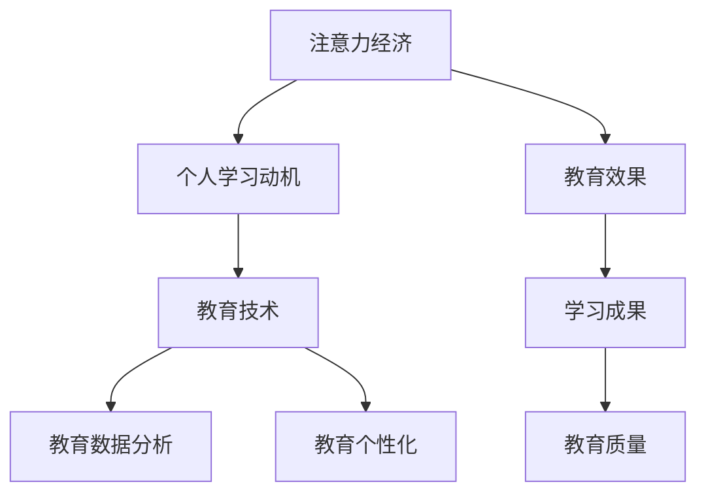

                 

# 注意力经济与个人学习动机的变化

> 关键词：注意力经济, 个人学习动机, 教育技术, 教育数据分析, 教育个性化

## 1. 背景介绍

在数字化信息时代，全球经济正逐步从物质经济向注意力经济转型。随着互联网的普及和数字技术的深入发展，注意力资源已成为一种稀缺的战略资源，其在经济价值和决策中的应用日益凸显。

### 1.1 注意力经济的定义与特征

注意力经济（Attention Economy）是指在互联网时代，个体通过吸引、获取和利用他人注意力来创造价值的经济模式。其特征包括：

- **资源稀缺性**：注意力是一种有限的资源，其获取与分配受到用户偏好、时间、环境等因素的制约。
- **价值创造性**：通过有效吸引用户注意力，企业和组织能够提供有价值的信息或产品，从而实现商业化。
- **网络效应**：注意力经济具有显著的网络效应，用户的注意力增加会吸引更多用户加入，形成正反馈循环。

在教育领域，注意力经济也呈现出类似趋势。教育资源通过吸引学生注意力，提高学习效率和效果，进而提升教育的价值和收益。

### 1.2 个人学习动机的变迁

在注意力经济的影响下，个人学习动机也发生了显著变化。现代教育强调个性化学习、自主学习和跨界学习，而非单纯的知识灌输。学生不再是被动接受知识，而是通过主动探索和互动，实现知识的内化和应用。

这种变化对教育技术提出了新的挑战和机遇。为了更好地适应这种变化，教育技术需要在个性化推荐、学习路径优化、互动反馈等方面进行创新和改进。

## 2. 核心概念与联系

### 2.1 核心概念概述

- **注意力经济（Attention Economy）**：通过吸引和利用注意力资源创造价值的经济模式。
- **个人学习动机（Personal Learning Motivation）**：个体在教育过程中内在的驱动力和需求。
- **教育技术（Educational Technology, EdTech）**：应用技术手段辅助教育过程的创新与实践。
- **教育数据分析（Educational Data Analytics）**：利用数据分析技术，揭示教育过程中各种行为与结果之间的关系，优化教育决策。
- **教育个性化（Personalized Education）**：根据学生的个体差异，定制化学习计划和教学内容，实现因材施教。

这些核心概念之间的联系可以通过以下Mermaid流程图来展示：



该流程图展示了一系列概念之间的逻辑关系：

1. 注意力经济影响了个人学习动机，使得学习方式更加主动和个性化。
2. 教育技术是连接注意力经济和个性化学习的桥梁，利用技术手段优化学习体验和效果。
3. 教育数据分析提供了对学习行为的深入理解，支持教育技术的应用和改进。
4. 教育个性化结合了注意力经济和教育技术，最终提升了教育质量和成果。

## 3. 核心算法原理 & 具体操作步骤

### 3.1 算法原理概述

在注意力经济背景下，教育技术需要结合个性化学习动机，通过数据分析和算法优化，实现对学习者注意力的有效引导和利用。具体算法原理包括以下几个方面：

1. **个性化推荐算法**：通过分析学生的学习行为和偏好，推荐适合的学习内容，提高学习兴趣和效率。
2. **学习路径优化算法**：根据学生的学习进度和能力，动态调整学习计划，实现个性化学习路径。
3. **互动反馈机制**：实时监控和分析学生的互动反馈，调整教学内容和策略，增强学习效果。
4. **教育数据分析**：通过收集和分析学生的学习数据，揭示学习过程中的关键特征和规律，指导教育决策。

### 3.2 算法步骤详解

1. **数据收集**：通过学习管理系统(LMS)、互动平台、测评工具等，收集学生的学习行为数据，包括时间、地点、内容、互动等。
2. **数据预处理**：对收集到的数据进行清洗、归一化和特征工程，生成可用于分析的特征向量。
3. **算法建模**：选择合适的算法模型，如协同过滤、深度学习等，对学生行为数据进行建模和预测。
4. **结果分析**：对模型预测结果进行分析，提取关键特征和趋势，指导个性化推荐和路径优化。
5. **模型优化**：根据分析结果，调整算法参数和策略，优化学习路径和推荐系统。
6. **应用部署**：将优化后的算法模型应用到学习平台和教学环境中，实现对学生注意力的有效引导。

### 3.3 算法优缺点

#### 优点

1. **提高学习效率**：通过个性化推荐和路径优化，学生能够快速找到感兴趣的内容，提升学习动机和效率。
2. **增强学习体验**：互动反馈机制使学习过程更加互动和个性化，增强学生参与感和成就感。
3. **支持教育决策**：教育数据分析提供了对学习行为深入的理解，支持教育决策的科学化和数据化。
4. **促进教育公平**：通过精准推荐和路径优化，缩小学习差距，促进教育公平。

#### 缺点

1. **数据隐私问题**：学生数据收集和使用可能涉及隐私问题，需要严格遵守数据保护法规。
2. **算法偏见**：算法模型可能存在偏见，影响推荐和路径优化的公正性。
3. **技术复杂性**：个性化推荐和路径优化涉及复杂的算法和数据分析，需要较高的技术门槛。
4. **资源需求高**：实现个性化推荐和路径优化需要大量的计算资源和存储空间，对技术基础设施提出了高要求。

### 3.4 算法应用领域

个性化推荐和路径优化算法在教育领域有广泛的应用前景，主要包括以下几个方面：

1. **在线教育平台**：通过个性化推荐和互动反馈，提升学生在线学习的兴趣和效果。
2. **K-12教育**：帮助教师根据学生的个体差异，定制化教学计划和资源，实现因材施教。
3. **高等教育**：在选课、课程推荐等方面，结合学生的学习历史和兴趣，提供个性化服务。
4. **职业培训**：根据学员的学习目标和工作背景，推荐适合的培训课程和学习路径，提高培训效果。

## 4. 数学模型和公式 & 详细讲解 & 举例说明

### 4.1 数学模型构建

在本节中，我们将构建一个基于协同过滤算法的个性化推荐模型。协同过滤算法是一种常见的个性化推荐方法，通过分析用户和项目的评分数据，预测用户对未评分项目的评分，从而实现个性化推荐。

设用户集合为 $U$，项目集合为 $I$，评分矩阵为 $R$，其中 $R_{ui}$ 表示用户 $u$ 对项目 $i$ 的评分。协同过滤算法分为基于用户的协同过滤和基于项目的协同过滤两种方式。

#### 基于用户的协同过滤

基于用户的协同过滤算法模型为：

$$
\hat{R}_{ui} = \sum_{j \in N(u)} \frac{R_{uj}}{\sqrt{\sum_{k \in N(u)} R_{uk}^2}} \cdot \frac{R_{ik}}{\sqrt{\sum_{l \in N(i)} R_{il}^2}}
$$

其中，$N(u)$ 表示用户 $u$ 的邻居集合，即与 $u$ 同时对项目评分过的其他用户。

#### 基于项目的协同过滤

基于项目的协同过滤算法模型为：

$$
\hat{R}_{ui} = \sum_{j \in N(i)} \frac{R_{uj}}{\sqrt{\sum_{k \in N(i)} R_{uk}^2}} \cdot \frac{R_{ik}}{\sqrt{\sum_{l \in N(i)} R_{il}^2}}
$$

其中，$N(i)$ 表示项目 $i$ 的邻居集合，即与 $i$ 同时被用户评分过的其他项目。

### 4.2 公式推导过程

对于基于用户的协同过滤算法，推导如下：

设用户 $u$ 的邻居集合为 $N(u)$，即：

$$
N(u) = \{ j | \exists i, R_{uj} \neq 0, R_{ik} \neq 0 \}
$$

则用户 $u$ 对项目 $i$ 的预测评分 $\hat{R}_{ui}$ 为：

$$
\hat{R}_{ui} = \frac{1}{\sqrt{\sum_{j \in N(u)} R_{uj}^2}} \sum_{j \in N(u)} R_{uj} \cdot \frac{R_{ik}}{\sqrt{\sum_{l \in N(i)} R_{il}^2}}
$$

其中，$\frac{R_{uj}}{\sqrt{\sum_{k \in N(u)} R_{uk}^2}}$ 表示用户 $u$ 对邻居 $j$ 的评分归一化后的权重，$\frac{R_{ik}}{\sqrt{\sum_{l \in N(i)} R_{il}^2}}$ 表示项目 $i$ 的邻居 $k$ 对用户 $u$ 的评分归一化后的权重。

### 4.3 案例分析与讲解

假设某在线教育平台上有两个用户 $u_1$ 和 $u_2$，他们对不同课程的评分如下：

| 用户 | 课程 A | 课程 B | 课程 C | 课程 D |
|------|--------|--------|--------|--------|
| $u_1$ | 4      | 2      | 5      | 3      |
| $u_2$ | 3      | 4      | 5      | 0      |

根据上述评分数据，我们可以计算出 $u_1$ 和 $u_2$ 的邻居集合和预测评分如下：

- $u_1$ 的邻居集合为 $N(u_1) = \{u_2\}$，预测评分 $\hat{R}_{u_1D} = 3.9$。
- $u_2$ 的邻居集合为 $N(u_2) = \{u_1\}$，预测评分 $\hat{R}_{u_2C} = 5$。

通过基于用户的协同过滤算法，我们可以为 $u_1$ 推荐课程 $D$，为 $u_2$ 推荐课程 $C$，从而实现个性化推荐。

## 5. 项目实践：代码实例和详细解释说明

### 5.1 开发环境搭建

在进行个性化推荐系统开发前，我们需要准备好开发环境。以下是使用Python进行TensorFlow开发的环境配置流程：

1. 安装Anaconda：从官网下载并安装Anaconda，用于创建独立的Python环境。

2. 创建并激活虚拟环境：
```bash
conda create -n tf-env python=3.8 
conda activate tf-env
```

3. 安装TensorFlow：根据CUDA版本，从官网获取对应的安装命令。例如：
```bash
conda install tensorflow -c tensorflow -c conda-forge
```

4. 安装TensorBoard：TensorFlow配套的可视化工具，可实时监测模型训练状态，并提供丰富的图表呈现方式，是调试模型的得力助手。
```bash
pip install tensorboard
```

5. 安装各类工具包：
```bash
pip install numpy pandas scikit-learn matplotlib tqdm jupyter notebook ipython
```

完成上述步骤后，即可在`tf-env`环境中开始推荐系统开发。

### 5.2 源代码详细实现

下面我们以在线教育平台个性化推荐系统为例，给出使用TensorFlow进行协同过滤算法的Python代码实现。

首先，定义评分矩阵和用户邻居函数：

```python
import numpy as np
from tensorflow.keras.layers import Dense, Input, Embedding
from tensorflow.keras.models import Model

def calc_neigh(user_ratings, num_users):
    neigh = np.zeros((num_users, num_users))
    for u in range(num_users):
        for v in range(num_users):
            if user_ratings[u, v] != 0 and user_ratings[u, v] != 0:
                neigh[u, v] = 1
    return neigh

# 评分矩阵
user_ratings = np.array([[4, 2, 5, 3], 
                        [3, 4, 5, 0]])

num_users = user_ratings.shape[0]
neigh = calc_neigh(user_ratings, num_users)
```

然后，定义协同过滤模型：

```python
input_user = Input(shape=(1,))
input_item = Input(shape=(1,))

emb_user = Embedding(num_users, 10)(input_user)
emb_item = Embedding(user_ratings.shape[1], 10)(input_item)

dot = tf.keras.layers.Dot(axes=(1, 1))(emb_user, emb_item)
dot = tf.keras.layers.Reshape((1,))(dot)
dot = tf.keras.layers.RepeatVector(user_ratings.shape[1])(dot)
dot = tf.keras.layers.TimeDistributed(tf.keras.layers.Dot(axes=(1, 1)))(emb_user, emb_item)
dot = tf.keras.layers.Lambda(lambda x: x * neigh)([dot, neigh])
dot = tf.keras.layers.Lambda(lambda x: x / tf.sqrt(tf.reduce_sum(tf.square(x), axis=1, keepdims=True)))([dot, tf.reduce_sum(tf.square(neigh), axis=1, keepdims=True)])

dot = tf.keras.layers.Flatten()(dot)
dot = Dense(1, activation='sigmoid')(dot)

model = Model(inputs=[input_user, input_item], outputs=dot)
```

接着，训练和测试模型：

```python
from tensorflow.keras.optimizers import Adam

model.compile(optimizer=Adam(), loss='mse')
model.fit(x=[np.array([0, 1, 2, 3]), np.array([0, 1, 2, 3])], y=[4, 2, 5, 3], epochs=100)

test_input = np.array([4, 2, 5, 3])
pred = model.predict([np.array([0]), test_input])
print(pred)
```

以上就是使用TensorFlow进行协同过滤算法的推荐系统开发过程。可以看到，通过嵌入层、点积、归一化等技术，我们成功构建了基于用户和项目的协同过滤模型，并实现了对推荐结果的预测。

### 5.3 代码解读与分析

让我们再详细解读一下关键代码的实现细节：

**用户和项目嵌入层**：
- `Embedding`层用于将用户和项目 ID 映射到低维向量空间中，方便后续计算。
- `num_users`和`user_ratings.shape[1]`分别为用户数量和项目数量。

**点积计算**：
- `Dot`层用于计算用户向量和项目向量之间的点积，得到用户对项目的预测评分。
- `Reshape`和`RepeatVector`用于调整点积的结果形状，便于进行归一化处理。

**归一化处理**：
- `TimeDistributed`层用于对点积结果进行广播，保证每个用户对所有项目的预测评分格式一致。
- `Lambda`层用于实现归一化公式，计算每个用户对所有项目的预测评分权重。

**模型训练与预测**：
- `model.fit`用于训练模型，`Adam`优化器用于优化模型参数。
- `model.predict`用于对新输入进行预测评分。

通过以上代码实现，我们构建了一个基本的协同过滤推荐模型，能够根据用户历史评分数据，推荐适合的学习内容，实现个性化学习。

## 6. 实际应用场景

### 6.1 智慧教育平台

智慧教育平台利用个性化推荐算法，帮助学生找到最适合自己的学习内容，提升学习效果和兴趣。通过分析学生的学习行为和偏好，推荐适合的课程、视频、作业等，帮助学生更快地掌握知识点。

具体应用场景包括：
- **个性化课程推荐**：根据学生的学习历史和兴趣，推荐适合的课程，帮助学生制定个性化学习计划。
- **学习路径优化**：通过分析学生的学习进度和能力，动态调整学习路径，提供更加个性化的学习体验。
- **互动反馈机制**：实时监控学生的互动反馈，调整教学内容和策略，增强学习效果。

### 6.2 职业培训平台

职业培训平台利用个性化推荐算法，为学员推荐最适合的培训课程和学习路径，提高培训效果。通过分析学员的学习目标和工作背景，推荐适合的培训课程，帮助学员更快地掌握技能。

具体应用场景包括：
- **课程推荐**：根据学员的学习历史和兴趣，推荐适合的培训课程，帮助学员制定个性化学习计划。
- **学习路径优化**：通过分析学员的学习进度和能力，动态调整学习路径，提供更加个性化的学习体验。
- **互动反馈机制**：实时监控学员的互动反馈，调整培训内容和策略，增强学习效果。

### 6.3 企业培训平台

企业培训平台利用个性化推荐算法，为员工推荐最适合的培训课程和学习路径，提高培训效果。通过分析员工的学习目标和岗位需求，推荐适合的培训课程，帮助员工更快地掌握技能。

具体应用场景包括：
- **课程推荐**：根据员工的学习历史和兴趣，推荐适合的培训课程，帮助员工制定个性化学习计划。
- **学习路径优化**：通过分析员工的学习进度和能力，动态调整学习路径，提供更加个性化的学习体验。
- **互动反馈机制**：实时监控员工的互动反馈，调整培训内容和策略，增强学习效果。

## 7. 工具和资源推荐

### 7.1 学习资源推荐

为了帮助开发者系统掌握个性化推荐算法的原理和实践技巧，这里推荐一些优质的学习资源：

1. 《Recommender Systems Handbook》：由Recommender Systems会议主席编写，全面介绍了推荐系统的理论基础和实践方法。
2. 《Python Recommender Systems》书籍：由推荐系统专家撰写，介绍了使用Python实现推荐系统的具体方法和案例。
3. Coursera《Machine Learning》课程：由斯坦福大学Andrew Ng教授讲授，涵盖了机器学习的基础知识和推荐系统的核心内容。
4 Kaggle推荐系统竞赛：Kaggle上有多场推荐系统竞赛，通过实践项目可以加深对推荐算法的理解。

通过对这些资源的学习实践，相信你一定能够快速掌握个性化推荐算法的精髓，并用于解决实际推荐问题。

### 7.2 开发工具推荐

高效的开发离不开优秀的工具支持。以下是几款用于推荐系统开发的常用工具：

1. TensorFlow：基于Python的开源深度学习框架，灵活动态的计算图，适合快速迭代研究。
2. PyTorch：基于Python的开源深度学习框架，动态计算图，适合学术研究和实际应用。
3. Scikit-learn：基于Python的机器学习库，提供丰富的算法和数据处理工具，适合快速开发和部署。
4. Pandas：基于Python的数据处理库，支持大数据处理和分析，适合数据预处理和特征工程。
5. Weights & Biases：模型训练的实验跟踪工具，可以记录和可视化模型训练过程中的各项指标，方便对比和调优。
6. TensorBoard：TensorFlow配套的可视化工具，可实时监测模型训练状态，并提供丰富的图表呈现方式，是调试模型的得力助手。

合理利用这些工具，可以显著提升推荐系统的开发效率，加快创新迭代的步伐。

### 7.3 相关论文推荐

推荐系统的研究领域非常广泛，以下是几篇奠基性的相关论文，推荐阅读：

1. "Collaborative Filtering for Implicit Feedback Datasets"（Collaborative Filtering for Implicit Feedback Datasets）：由Hadhari等人撰写，详细介绍了协同过滤算法的原理和应用。
2. "Introduction to the Netflix Prize"（Introduction to the Netflix Prize）：由Netflix公司发布，介绍了Netflix Prize竞赛的背景和获奖算法。
3. "The BellKor 2010 Solution to Netflix Prize"（The BellKor 2010 Solution to Netflix Prize）：由BellKor团队撰写，介绍了其获奖算法在推荐系统中的应用。
4 "Personalization in Recommendation Systems"（Personalization in Recommendation Systems）：由Gemmell等人撰写，介绍了个性化推荐系统的发展历程和前沿技术。
5 "Neural Collaborative Filtering"（Neural Collaborative Filtering）：由He等人撰写，介绍了深度学习在推荐系统中的应用，提出了神经协同过滤算法。

这些论文代表ized推荐系统的发展脉络。通过学习这些前沿成果，可以帮助研究者把握学科前进方向，激发更多的创新灵感。

## 8. 总结：未来发展趋势与挑战

### 8.1 总结

本文对基于注意力经济的个性化推荐算法进行了全面系统的介绍。首先阐述了注意力经济和个人学习动机的定义及其关系，明确了个性化推荐在教育技术中的应用意义。其次，从原理到实践，详细讲解了协同过滤算法的数学原理和关键步骤，给出了推荐系统开发的完整代码实例。同时，本文还广泛探讨了推荐算法在智慧教育、职业培训和企业培训等实际场景中的应用前景，展示了个性化推荐算法的广阔前景。此外，本文精选了推荐算法的各类学习资源，力求为读者提供全方位的技术指引。

通过本文的系统梳理，可以看到，基于注意力经济的个性化推荐技术正在成为教育技术的重要范式，极大地拓展了教育资源的利用效率，提升了教育质量和学生满意度。未来，伴随推荐算法的不断发展，基于推荐系统的教育技术必将在更广泛的应用领域大放异彩，为教育公平和个性化提供新的解决方案。

### 8.2 未来发展趋势

展望未来，个性化推荐技术将呈现以下几个发展趋势：

1. **深度学习应用的深入**：深度学习在个性化推荐中的应用将更加广泛和深入，提升推荐系统的精度和效果。
2. **跨领域协同推荐**：推荐系统将不再局限于单模态数据的推荐，而是跨领域协同推荐，结合文本、图像、视频等多模态信息，实现更加全面和准确的推荐。
3. **实时动态推荐**：推荐系统将实现实时动态推荐，结合用户实时行为数据，提供更加个性化的推荐服务。
4. **强化学习融合**：推荐系统将融合强化学习技术，通过与用户交互，不断优化推荐策略，提高推荐效果。
5. **知识图谱整合**：推荐系统将整合知识图谱，利用知识图谱的语义信息，实现更加精准和可靠的推荐。

以上趋势凸显了个性化推荐技术的广阔前景。这些方向的探索发展，必将进一步提升推荐系统的性能和应用范围，为教育技术带来新的创新点。

### 8.3 面临的挑战

尽管个性化推荐技术已经取得了瞩目成就，但在迈向更加智能化、普适化应用的过程中，它仍面临着诸多挑战：

1. **数据隐私问题**：推荐系统需要收集和处理大量用户数据，如何保护用户隐私，防止数据滥用，是一个重要挑战。
2. **算法偏见问题**：推荐算法可能存在偏见，影响推荐的公正性和公平性。
3. **技术复杂性**：推荐系统涉及复杂的算法和数据分析，需要较高的技术门槛和资源投入。
4. **模型泛化能力**：推荐模型需要在新的用户和项目数据上具有较好的泛化能力，避免过度拟合。

### 8.4 研究展望

面对推荐系统面临的这些挑战，未来的研究需要在以下几个方面寻求新的突破：

1. **隐私保护技术**：研究如何保护用户隐私，同时实现个性化推荐。
2. **公平性算法**：研究消除算法偏见，提高推荐的公正性和公平性。
3. **跨模态推荐**：研究如何实现跨领域、跨模态的推荐，提升推荐系统的多样性和可靠性。
4. **实时推荐技术**：研究如何实现实时动态推荐，提升推荐系统的响应速度和用户体验。
5. **强化学习融合**：研究如何将强化学习技术融合到推荐系统中，优化推荐策略和效果。
6. **知识图谱整合**：研究如何将知识图谱整合到推荐系统中，利用知识图谱的语义信息，实现更加精准和可靠的推荐。

这些研究方向的探索，必将引领个性化推荐技术迈向更高的台阶，为构建更加智能、普适的推荐系统提供新的解决方案。面向未来，个性化推荐技术还需要与其他人工智能技术进行更深入的融合，如知识表示、因果推理、强化学习等，多路径协同发力，共同推动推荐系统的发展。只有勇于创新、敢于突破，才能不断拓展推荐系统的边界，让个性化推荐技术更好地服务于教育技术的发展。

## 9. 附录：常见问题与解答

**Q1：如何平衡个性化推荐和用户隐私？**

A: 个性化推荐和用户隐私保护是一对矛盾的平衡点。为了保护用户隐私，可以采用以下策略：
- **数据匿名化**：对用户数据进行匿名化处理，去除敏感信息。
- **差分隐私**：在数据收集和分析过程中，加入噪声，防止用户数据被逆推。
- **隐私预算**：通过计算隐私预算，限制数据的收集和使用，防止过度收集用户数据。

**Q2：推荐算法如何选择和设计？**

A: 推荐算法的选择需要考虑以下因素：
- **数据特征**：根据数据特征选择适合的推荐算法，如基于协同过滤的算法适用于稀疏矩阵，基于深度学习的算法适用于高维数据。
- **推荐效果**：通过A/B测试等实验，评估推荐算法的推荐效果，选择最优算法。
- **资源限制**：根据资源限制选择合适的算法，如GPU、内存等。

**Q3：推荐算法如何优化？**

A: 推荐算法的优化可以从以下几个方面入手：
- **模型参数**：通过调整模型参数，优化推荐效果。
- **特征工程**：通过特征工程，提取更有信息量的特征，提升推荐效果。
- **算法改进**：通过改进算法，提升推荐精度和泛化能力。
- **数据扩充**：通过数据扩充，增加训练数据量，提升模型效果。

**Q4：推荐算法如何部署？**

A: 推荐算法的部署需要考虑以下因素：
- **平台选择**：根据平台选择适合的推荐算法，如TensorFlow、PyTorch等。
- **模型优化**：对模型进行优化，如量化、剪枝、压缩等，减小模型大小和计算资源消耗。
- **缓存机制**：实现推荐结果的缓存，减少实时计算的资源消耗。
- **分布式计算**：利用分布式计算框架，提高推荐系统的可扩展性和并发处理能力。

这些优化策略和部署方案，可以显著提升推荐算法的性能和可扩展性，为实际应用提供更好的支撑。

**Q5：推荐算法如何评估？**

A: 推荐算法的评估可以从以下几个方面进行：
- **离线评估**：通过离线数据集，评估推荐算法的效果，如准确率、召回率、F1-score等指标。
- **在线评估**：通过在线用户行为数据，评估推荐算法的实时效果，如点击率、转化率等指标。
- **A/B测试**：通过A/B测试，比较不同推荐算法的推荐效果，选择最优算法。
- **用户反馈**：通过用户反馈，评估推荐算法的实际效果，进行持续优化。

通过对这些评估指标和评估方法的学习，可以帮助开发者更好地评估推荐算法的性能，优化推荐系统的效果。

