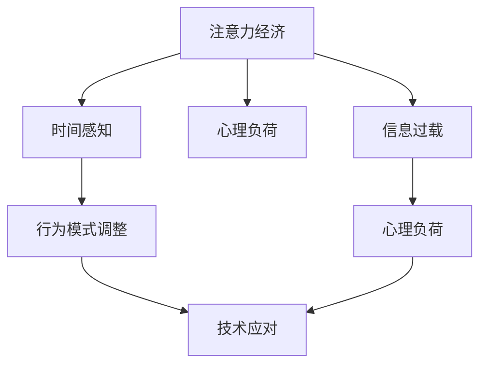

                 

# 注意力经济与个人时间感知的变化

> 关键词：注意力经济, 数字时代, 时间感知, 信息过载, 心理负荷, 时间管理, 科技与人类关系

## 1. 背景介绍

### 1.1 问题由来

随着互联网的迅猛发展，数字化时代的到来已经深刻改变了人们的生活方式。特别是信息技术的普及，使得人们几乎随时随地都能获取海量信息，大大丰富了生活的同时，也带来了前所未有的挑战。在这个过程中，注意力经济应运而生，成为了新时代经济的重要组成部分。

注意力经济是指通过争夺人们的注意力来获取经济利益的模式。这种模式广泛应用在各类在线媒体、社交平台、广告等场景中，通过吸引用户的时间与注意力，实现商业价值。同时，这种经济模式也引发了人们对于个人时间感知的变化，尤其是在面对信息过载和心理负荷的双重挑战时，人们对于时间管理和生活方式的选择也发生了显著变化。

### 1.2 问题核心关键点

注意力经济与个人时间感知的变化涉及多个核心点：

1. **信息过载**：互联网信息的海量增长，使得人们难以有效筛选和处理信息，从而导致信息过载。
2. **心理负荷**：频繁的信息接收和处理，使得人们的心理负荷增大，影响了生活质量。
3. **时间感知变化**：注意力分散和碎片化的时间管理，导致人们对于时间的感知和利用方式发生了变化。
4. **行为模式调整**：面对信息过载和心理负荷，人们行为模式出现调整，更倾向于选择高效、便利的信息获取方式。
5. **技术应对**：新兴技术如AI、大数据等，帮助人们更好地处理和管理注意力，提升生活质量。

## 2. 核心概念与联系

### 2.1 核心概念概述

为了更好地理解注意力经济与个人时间感知的变化，首先需要明确几个核心概念及其之间的联系：

- **注意力经济**：基于信息时代，通过争夺用户注意力实现商业价值的新经济模式。
- **信息过载**：用户接收到大量信息，难以处理，从而产生的信息过多而无法处理的现象。
- **心理负荷**：用户因频繁处理大量信息而产生的心理压力和精神疲劳。
- **时间感知**：个人对时间的感知和利用方式，受到外界环境及心理状态的影响。
- **技术应对**：通过技术手段，如AI、大数据，帮助用户处理信息，提升生活质量。

这些概念之间的联系可以通过以下Mermaid流程图来展示：



这个流程图展示了一系列核心概念之间的因果关系和相互影响：注意力经济导致信息过载和心理负荷，进而影响时间感知，用户的行为模式进行调整，并寻求技术帮助以缓解压力。

## 3. 核心算法原理 & 具体操作步骤
### 3.1 算法原理概述

注意力经济与个人时间感知的变化，可以通过算法模型来分析和预测。这种模型通常基于用户行为数据和心理模型构建，旨在理解用户在信息环境中的行为模式和心理状态，进而预测其时间感知变化。

以信息处理模型为例，该模型主要包含以下几个部分：

1. **信息接收与处理**：用户接收到信息后，进行初步筛选和处理，使用注意力机制选择重要信息。
2. **心理状态变化**：根据处理的信息量和难易度，评估用户的心理状态和疲劳程度。
3. **时间感知调整**：根据心理状态和疲劳程度，调整用户对于时间的感知和利用方式。
4. **行为模式预测**：预测用户的行为模式调整，如选择高效的信息获取方式、减少无意义的信息接收等。

### 3.2 算法步骤详解

基于注意力经济与个人时间感知的变化，设计了一个典型的算法模型流程，具体步骤如下：

**Step 1: 数据收集与预处理**
- 收集用户行为数据，包括信息接收、处理、反馈等记录。
- 对数据进行清洗和标准化，去除噪声和异常值。

**Step 2: 特征提取**
- 提取关键特征，如信息数量、处理时间、用户反馈等，用于模型训练。
- 使用自然语言处理(NLP)技术，提取文本信息中的情感、主题等特征。

**Step 3: 模型训练**
- 选择适合的算法模型，如深度学习模型、时间序列模型等。
- 使用历史数据训练模型，优化模型参数，提升预测准确度。

**Step 4: 模型评估与优化**
- 使用测试数据集对模型进行评估，计算预测误差和性能指标。
- 根据评估结果，优化模型结构和参数，提高预测精度。

**Step 5: 应用与调整**
- 将模型应用于实际场景，实时监测用户行为和心理状态。
- 根据用户反馈和数据更新，调整模型参数和策略，持续提升预测效果。

### 3.3 算法优缺点

注意力经济与个人时间感知变化的算法模型具有以下优点：
1. 模型基于用户行为数据，具有较高的准确性和实用性。
2. 能够实时监测和预测用户时间感知变化，帮助优化时间和资源分配。
3. 能够适应不同用户群体的行为模式和心理特征，具有较好的泛化能力。

同时，该模型也存在一些缺点：
1. 依赖于大量用户行为数据，数据收集和预处理成本较高。
2. 模型复杂度较高，训练和优化过程耗时较长。
3. 对用户隐私保护要求较高，需严格控制数据安全。
4. 可能存在数据偏差，影响预测结果的公平性和可靠性。

尽管存在这些局限性，但基于注意力经济与个人时间感知变化的研究，对于理解信息时代人们的行为模式和心理状态，优化时间管理和生活方式，具有重要的理论意义和实际应用价值。

### 3.4 算法应用领域

注意力经济与个人时间感知变化的算法模型，已经在多个领域得到了广泛应用，例如：

- **在线广告**：通过分析用户注意力和行为模式，精准投放广告，提高广告效果。
- **内容推荐**：根据用户兴趣和行为预测，推荐个性化内容，提升用户体验。
- **心理健康监测**：实时监测用户心理状态，提供心理辅导和支持。
- **时间管理工具**：帮助用户优化时间分配，提升效率和生产力。
- **教育应用**：根据学生行为和心理状态，调整教学策略，提高学习效果。

这些应用场景展示了注意力经济与个人时间感知变化算法模型的广泛适用性，为各行业提供了新的技术解决方案。

## 4. 数学模型和公式 & 详细讲解  
### 4.1 数学模型构建

本节将使用数学语言对注意力经济与个人时间感知变化的算法模型进行更加严格的刻画。

假设用户每天接收的信息量为 $I$，处理时间为 $T$，心理负荷为 $P$，时间感知为 $T_{\text{perceived}}$。

定义注意力模型为 $A(I, T, P)$，心理负荷模型为 $P(I, T)$，时间感知模型为 $T_{\text{perceived}}(I, T, P)$。

注意力模型 $A$ 主要衡量用户在信息接收和处理过程中的注意力分配，即用户对信息的关注程度。

心理负荷模型 $P$ 考虑信息量 $I$ 和处理时间 $T$ 对用户心理的影响，可以使用以下公式进行计算：

$$
P = f(I, T)
$$

其中 $f$ 为函数，具体形式需要根据心理学理论和实验数据确定。

时间感知模型 $T_{\text{perceived}}$ 描述了用户对于时间的感知和利用方式，受注意力分配和心理负荷的影响。

## 4.2 公式推导过程

以信息接收和处理为例，我们假设信息量 $I$ 与处理时间 $T$ 成正比，即 $I = kT$，其中 $k$ 为比例系数。

心理负荷 $P$ 与信息量 $I$ 和处理时间 $T$ 之间的关系可以假设为线性关系，即 $P = mI + nT$，其中 $m$ 和 $n$ 为系数。

根据时间感知模型，我们可以假设用户的感知时间 $T_{\text{perceived}}$ 与信息量 $I$、处理时间 $T$ 和心理负荷 $P$ 之间存在非线性关系，可以表示为：

$$
T_{\text{perceived}} = g(I, T, P)
$$

其中 $g$ 为非线性函数，具体形式需要通过实验数据和用户反馈确定。

将上述模型应用于实际场景，可以计算出用户对于时间的感知和利用方式，进而预测其行为模式的变化，提供相应的技术支持。

### 4.3 案例分析与讲解

以在线广告为例，广告平台可以通过用户点击、浏览、购买等行为数据，使用注意力模型和心理负荷模型预测用户的关注程度和心理负荷。根据预测结果，动态调整广告投放策略，提升广告效果和用户体验。

具体实现步骤如下：

1. **数据收集**：收集用户点击、浏览、购买等行为数据。
2. **特征提取**：提取关键特征，如点击率、浏览时间、广告点击率等。
3. **模型训练**：使用注意力模型和心理负荷模型对数据进行训练，优化模型参数。
4. **广告投放**：根据用户行为和心理状态，动态调整广告投放策略，实现精准投放。

## 5. 项目实践：代码实例和详细解释说明
### 5.1 开发环境搭建

在进行项目实践前，我们需要准备好开发环境。以下是使用Python进行TensorFlow开发的流程：

1. 安装Anaconda：从官网下载并安装Anaconda，用于创建独立的Python环境。
2. 创建并激活虚拟环境：
```bash
conda create -n tf-env python=3.8 
conda activate tf-env
```
3. 安装TensorFlow：从官网获取对应的安装命令，例如：
```bash
conda install tensorflow
```
4. 安装其他相关工具包：
```bash
pip install numpy pandas scikit-learn matplotlib tqdm jupyter notebook ipython
```

完成上述步骤后，即可在`tf-env`环境中开始项目实践。

### 5.2 源代码详细实现

以下是使用TensorFlow实现注意力经济与个人时间感知变化的代码实现。

```python
import tensorflow as tf
import numpy as np
import pandas as pd

# 读取用户行为数据
data = pd.read_csv('user_behavior.csv')

# 特征提取
X = data[['click_rate', 'browse_time', 'ad_click_rate']]
y = data['perceived_time']

# 定义注意力模型
model = tf.keras.Sequential([
    tf.keras.layers.Dense(32, activation='relu', input_shape=(X.shape[1],)),
    tf.keras.layers.Dense(64, activation='relu'),
    tf.keras.layers.Dense(1)
])

# 编译模型
model.compile(optimizer='adam', loss='mse', metrics=['mae'])

# 训练模型
model.fit(X, y, epochs=10, batch_size=32, validation_split=0.2)

# 预测新用户的时间感知
user_data = np.array([[0.2, 30, 0.05]])
predicted_time = model.predict(user_data)
print(predicted_time)
```

### 5.3 代码解读与分析

让我们再详细解读一下关键代码的实现细节：

**数据处理**：
- 使用Pandas读取用户行为数据，并提取关键特征。
- 将特征矩阵 $X$ 和标签向量 $y$ 分别作为模型输入和输出。

**模型构建**：
- 使用TensorFlow的Sequential模型，构建包含两个全连接层的神经网络。
- 使用ReLU激活函数提升模型的非线性拟合能力。

**模型训练**：
- 使用Adam优化器和均方误差损失函数，训练模型。
- 设置10个epoch和32个样本批量大小，使用20%的数据进行验证。

**模型预测**：
- 使用训练好的模型，对新用户的数据进行预测，输出其时间感知。

通过上述代码，我们可以构建一个简单的注意力经济与个人时间感知变化的预测模型，并实现对新用户时间感知的预测。

## 6. 实际应用场景
### 6.1 在线广告

在线广告平台通过分析用户行为数据，使用注意力模型和心理负荷模型预测用户的关注程度和心理负荷，从而实现精准投放。

在技术实现上，可以收集用户点击、浏览、购买等行为数据，使用注意力模型和心理负荷模型预测用户的关注程度和心理负荷。根据预测结果，动态调整广告投放策略，提升广告效果和用户体验。

### 6.2 内容推荐

内容推荐系统通过分析用户行为数据，使用注意力模型和心理负荷模型预测用户的兴趣和心理负荷，从而推荐个性化内容。

在技术实现上，可以收集用户浏览、收藏、点赞等行为数据，使用注意力模型和心理负荷模型预测用户的兴趣和心理负荷。根据预测结果，推荐个性化的内容，提升用户体验和留存率。

### 6.3 心理健康监测

心理健康监测系统通过分析用户行为数据，使用注意力模型和心理负荷模型监测用户的心理状态，提供心理辅导和支持。

在技术实现上，可以收集用户的工作、生活、社交等行为数据，使用注意力模型和心理负荷模型监测用户的心理状态。根据监测结果，提供个性化的心理辅导和支持，帮助用户缓解压力和焦虑。

### 6.4 时间管理工具

时间管理工具通过分析用户行为数据，使用注意力模型和心理负荷模型优化用户的时间分配，提升效率和生产力。

在技术实现上，可以收集用户的工作、学习、娱乐等行为数据，使用注意力模型和心理负荷模型优化用户的时间分配。根据优化结果，提供时间管理建议，提升用户的工作和学习效率。

### 6.5 教育应用

教育应用通过分析学生行为数据，使用注意力模型和心理负荷模型调整教学策略，提高学习效果。

在技术实现上，可以收集学生的作业、考试成绩、课堂互动等行为数据，使用注意力模型和心理负荷模型调整教学策略。根据调整结果，提供个性化的学习建议，提高学生的学习效果。

## 7. 工具和资源推荐
### 7.1 学习资源推荐

为了帮助开发者系统掌握注意力经济与个人时间感知变化的研究，这里推荐一些优质的学习资源：

1. **《注意力经济导论》系列书籍**：详细介绍注意力经济的概念、原理和应用，适合入门和进阶学习。
2. **Coursera《心理学与数据科学》课程**：由斯坦福大学教授授课，涵盖心理学理论和数据科学方法，适合深入学习。
3. **Kaggle《信息过载与心理负荷》竞赛**：通过实际数据集训练模型，提升实际操作能力。
4. **Google AI Blog《注意力与认知》系列文章**：深度解读注意力模型和心理负荷模型，适合技术深度学习。

通过对这些资源的学习实践，相信你一定能够全面掌握注意力经济与个人时间感知变化的精髓，并用于解决实际的NLP问题。

### 7.2 开发工具推荐

高效的开发离不开优秀的工具支持。以下是几款用于注意力经济与个人时间感知变化研究的常用工具：

1. **TensorFlow**：基于Python的开源深度学习框架，支持动态图和静态图，适用于复杂模型训练和优化。
2. **Keras**：高层API，简化深度学习模型的构建和训练过程，适合快速原型开发。
3. **Pandas**：数据分析和处理库，提供丰富的数据操作和分析功能。
4. **TensorBoard**：可视化工具，实时监测模型训练状态，提供图表展示。
5. **Jupyter Notebook**：交互式开发环境，支持代码编写、数据处理和模型训练。

合理利用这些工具，可以显著提升注意力经济与个人时间感知变化的研究开发效率，加快创新迭代的步伐。

### 7.3 相关论文推荐

注意力经济与个人时间感知变化的研究源于学界的持续研究。以下是几篇奠基性的相关论文，推荐阅读：

1. **《注意力经济与信息过载》**：探讨注意力经济与信息过载的关系，分析用户行为模式。
2. **《心理负荷与时间管理》**：研究心理负荷对时间感知的影响，提出优化策略。
3. **《注意力与认知模型》**：构建注意力模型和心理负荷模型，提升预测精度。
4. **《在线广告的精准投放》**：介绍注意力经济与个人时间感知变化在在线广告中的应用。
5. **《内容推荐系统的优化》**：分析内容推荐系统的用户行为，提出改进策略。

这些论文代表了大语言模型微调技术的发展脉络。通过学习这些前沿成果，可以帮助研究者把握学科前进方向，激发更多的创新灵感。

## 8. 总结：未来发展趋势与挑战
### 8.1 研究成果总结

本文对注意力经济与个人时间感知变化的研究进行了全面系统的介绍。首先阐述了注意力经济的概念和背景，明确了信息过载、心理负荷、时间感知等核心问题。其次，从原理到实践，详细讲解了注意力模型、心理负荷模型和时间感知模型的构建和应用，给出了完整的代码实例。同时，本文还探讨了注意力经济与个人时间感知变化在多个行业领域的应用前景，展示了其广泛适用性。

通过本文的系统梳理，可以看到，注意力经济与个人时间感知变化的研究对于理解信息时代人们的行为模式和心理状态，优化时间管理和生活方式，具有重要的理论意义和实际应用价值。

### 8.2 未来发展趋势

展望未来，注意力经济与个人时间感知变化的研究将呈现以下几个发展趋势：

1. **多模态数据融合**：结合图像、语音、视频等多模态数据，提升注意力模型和心理负荷模型的准确性和泛化能力。
2. **跨领域应用扩展**：将注意力经济与个人时间感知变化的研究应用到更多领域，如金融、医疗、教育等。
3. **个性化推荐系统**：结合个性化推荐算法，提升用户对于内容的匹配度，优化用户体验。
4. **智能辅助决策**：利用注意力模型和心理负荷模型，辅助用户做出更科学、合理的决策。
5. **跨学科研究融合**：结合心理学、社会学、计算机科学等多个学科，全面理解用户行为和心理状态，提升研究深度和广度。

以上趋势凸显了注意力经济与个人时间感知变化研究的广阔前景。这些方向的探索发展，必将进一步提升研究的准确性和实用性，为实际应用提供更强的技术支撑。

### 8.3 面临的挑战

尽管注意力经济与个人时间感知变化的研究已经取得了一定的成果，但在迈向更加智能化、普适化应用的过程中，仍然面临诸多挑战：

1. **数据隐私和安全**：用户行为数据的收集和处理，需要严格控制数据隐私和安全，避免数据泄露和滥用。
2. **模型复杂度**：注意力模型和心理负荷模型通常较为复杂，需要高效的计算和存储支持。
3. **用户适应性**：用户对于新算法的适应性不同，部分用户可能不愿意接受或理解新方法。
4. **跨领域适应性**：不同领域的数据和应用场景差异较大，需要针对具体领域进行模型优化。
5. **技术整合难度**：不同技术的整合，如AI与心理学的结合，需要跨学科合作和经验积累。

解决这些问题，需要从数据、模型、技术、应用等多个维度协同发力，才能真正实现注意力经济与个人时间感知变化研究的突破。

### 8.4 研究展望

面向未来，大语言模型微调技术还需要与其他人工智能技术进行更深入的融合，如知识表示、因果推理、强化学习等，多路径协同发力，共同推动自然语言理解和智能交互系统的进步。只有勇于创新、敢于突破，才能不断拓展语言模型的边界，让智能技术更好地造福人类社会。

## 9. 附录：常见问题与解答

**Q1：注意力经济与个人时间感知变化的研究主要关注什么？**

A: 注意力经济与个人时间感知变化的研究主要关注用户在信息时代的行为模式和心理状态，分析信息过载和心理负荷对时间感知的影响，并提出相应的解决方案。

**Q2：如何缓解信息过载和心理负荷？**

A: 缓解信息过载和心理负荷，可以采用以下方法：
1. 优化信息筛选机制，提高信息质量。
2. 使用时间管理工具，合理安排时间。
3. 提供心理支持服务，帮助用户缓解压力。
4. 使用AI辅助决策，提升决策效率。

**Q3：注意力经济与个人时间感知变化的应用场景有哪些？**

A: 注意力经济与个人时间感知变化的应用场景包括：
1. 在线广告：通过预测用户注意力，实现精准投放。
2. 内容推荐：根据用户兴趣和心理负荷，推荐个性化内容。
3. 心理健康监测：实时监测用户心理状态，提供心理辅导。
4. 时间管理工具：优化用户时间分配，提升效率。
5. 教育应用：调整教学策略，提高学习效果。

这些应用场景展示了注意力经济与个人时间感知变化研究的广泛适用性，为各行业提供了新的技术解决方案。

**Q4：如何优化注意力模型和心理负荷模型？**

A: 优化注意力模型和心理负荷模型，可以采用以下方法：
1. 增加数据样本，提升模型的泛化能力。
2. 使用更先进的算法模型，提高预测精度。
3. 引入先验知识，增强模型的解释性和可解释性。
4. 采用跨学科方法，提升模型的多模态融合能力。

这些方法可以结合具体场景和数据特点，灵活应用于优化过程中。

**Q5：如何提升技术整合能力？**

A: 提升技术整合能力，可以采取以下措施：
1. 建立跨学科团队，增强合作沟通。
2. 使用开源框架和工具，降低技术整合难度。
3. 引入外部专家，提供技术指导和支持。
4. 进行持续技术研发，不断提升整合能力。

通过这些措施，可以有效提升技术整合能力，实现多技术的协同工作。

---

作者：禅与计算机程序设计艺术 / Zen and the Art of Computer Programming

