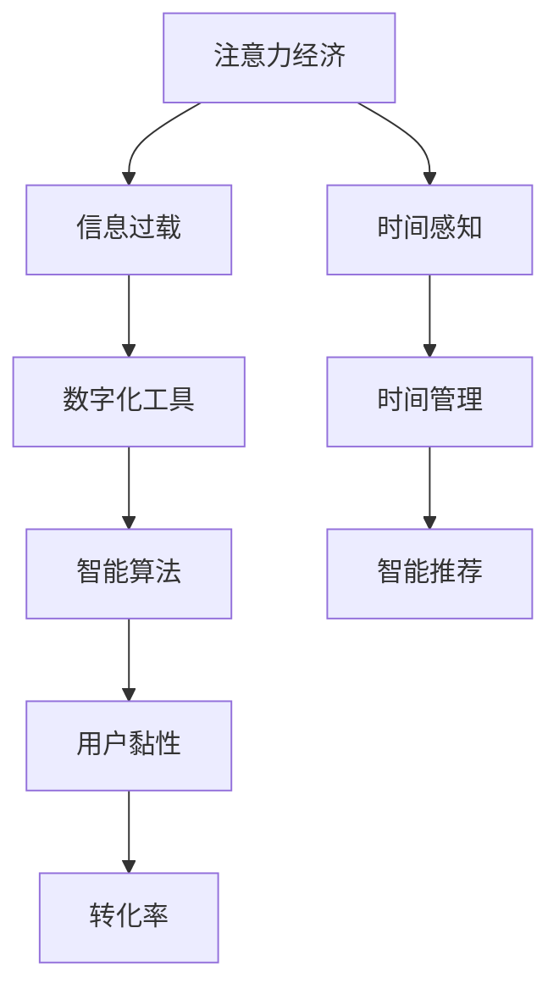

                 

# 注意力经济与个人时间感知的变化

## 1. 背景介绍

### 1.1 问题由来
在数字化时代，信息过载已成为一个普遍现象。人们每天都会接触到海量的信息流，包括新闻、社交媒体、广告、视频等。注意力作为有限的资源，其分配和利用成为现代社会的一种核心经济活动，即注意力经济。随着数字化工具的普及和社交媒体的兴起，人们的时间和注意力更加分散，如何合理管理个人时间感知，成为每个人面临的重要问题。

### 1.2 问题核心关键点
本文将探讨注意力经济与个人时间感知的变化，旨在理解信息过载对注意力的影响，以及如何通过技术手段优化个人时间感知。核心问题包括：

- 数字化工具如何改变了我们的注意力分配方式？
- 信息过载如何影响我们的时间感知和决策过程？
- 如何利用技术手段提升个人时间管理能力？

## 2. 核心概念与联系

### 2.1 核心概念概述

为更好地理解注意力经济与个人时间感知的变化，本节将介绍几个密切相关的核心概念：

- **注意力经济**：指在信息过载的社会中，注意力的获取和分配成为一种稀缺资源，通过获取和分配注意力来创造经济价值的实践。注意力经济强调在信息海洋中筛选出有价值的信息，并使其吸引和保持用户的注意力。

- **信息过载**：指人们在面对海量的信息时，因信息量过大而导致的认知负担和决策困难。信息过载不仅降低了人们处理信息的效率，也增加了注意力管理和时间感知上的挑战。

- **数字化工具**：如社交媒体、搜索引擎、新闻应用等，通过算法推荐系统等技术手段，不断地吸引和保持用户的注意力，形成了以注意力为核心的商业模式。

- **时间感知**：指个体对时间的理解和感受，包括时间管理的策略和行为。时间感知的变化受到信息获取方式、注意力分配、工作和生活节奏等多种因素的影响。

- **智能算法**：指通过机器学习等技术，自动分析用户行为和偏好，优化内容推荐和广告投放，提升用户黏性和转化率，从而实现注意力经济的最大化。

这些概念之间的逻辑关系可以通过以下Mermaid流程图来展示：



这个流程图展示了注意力经济与信息过载、数字化工具、智能算法、用户黏性、时间感知等概念之间的联系。数字化工具通过智能算法吸引用户注意力，提升用户黏性和转化率，进而形成注意力经济。而时间感知的变化，又反过来影响用户对数字化工具的使用和注意力分配。

## 3. 核心算法原理 & 具体操作步骤
### 3.1 算法原理概述

注意力经济与个人时间感知的变化，本质上是一种基于信息获取和注意力分配的优化过程。其核心思想是通过算法和工具，优化信息获取方式，提升个人注意力管理和时间感知，从而提高生产力和生活质量。

具体而言，注意力经济与个人时间感知的变化主要涉及以下几个方面：

1. **信息筛选与推荐算法**：通过机器学习和自然语言处理技术，对海量信息进行筛选和推荐，提升用户对有价值信息的关注度。
2. **时间管理工具**：利用日历、待办事项管理等工具，帮助用户规划和管理时间，提高时间利用效率。
3. **注意力保持与优化**：通过注意力保持和注意力训练等技术，提升用户对信息的集中注意力，避免注意力分散。

### 3.2 算法步骤详解

基于注意力经济与个人时间感知的变化，本文将介绍几种关键的算法步骤和具体操作步骤：

**Step 1: 数据收集与预处理**
- 收集用户的行为数据，如浏览记录、点击流、搜索历史等。
- 对数据进行清洗和预处理，去除噪声和冗余信息，确保数据的准确性和完整性。

**Step 2: 信息筛选与推荐算法**
- 使用协同过滤、内容推荐、深度学习等算法，对用户行为数据进行分析，识别出用户偏好和兴趣。
- 通过算法推荐系统，为用户推荐最相关的信息，如新闻、文章、视频等。

**Step 3: 时间管理工具**
- 利用日历、待办事项管理等工具，帮助用户规划和管理时间，如设定提醒、制定计划、安排任务等。
- 使用时间追踪工具，记录用户的时间使用情况，分析时间分配和浪费的规律。

**Step 4: 注意力保持与优化**
- 引入注意力保持和优化技术，如番茄工作法、冥想、注意力训练等，提升用户对信息的集中注意力。
- 利用智能设备（如智能手表、智能眼镜）监测用户的注意力状态，提供实时反馈和提醒。

### 3.3 算法优缺点

注意力经济与个人时间感知的变化，具有以下优点：
1. 提升了信息获取的效率和质量，减少了信息过载带来的认知负担。
2. 优化了个人时间管理，提高了时间利用效率和生产力。
3. 增强了注意力的集中和保持，提升了工作和生活质量。

同时，该方法也存在一定的局限性：
1. 对数据的依赖性较强，需要收集和处理大量的用户行为数据。
2. 技术实现复杂，需要结合多学科知识，包括机器学习、自然语言处理、时间管理等。
3. 隐私和安全问题，用户数据泄露和算法偏见可能带来风险。
4. 个性化推荐系统可能导致信息茧房，影响用户的多元化信息获取。

尽管存在这些局限性，但就目前而言，基于注意力经济与个人时间感知的变化，通过优化信息获取和注意力管理，已经成为提升个体生产力和生活品质的重要途径。未来相关研究将进一步探讨如何在保证数据隐私和安全的前提下，实现更加智能化、个性化的时间管理。

### 3.4 算法应用领域

基于注意力经济与个人时间感知的变化，已经在多个领域得到了应用，例如：

- 信息获取与推荐：如新闻推荐、电商推荐、视频推荐等，通过优化信息筛选和推荐算法，提升用户的信息获取效率。
- 时间管理与计划：如日程安排、待办事项管理、时间追踪等，利用工具辅助用户进行时间规划和管理。
- 工作与学习：如项目管理、番茄工作法、冥想等，提升注意力的集中和保持，提高工作效率和学习效果。
- 健康与生活：如睡眠监测、健康追踪、注意力训练等，通过智能设备监测和管理用户的注意力状态，提升生活质量。

除了上述这些经典应用外，注意力经济与个人时间感知的变化，还被创新性地应用到更多场景中，如智能家居、智能交通、智能客服等，为智慧城市和智慧生活提供了新的解决方案。

## 4. 数学模型和公式 & 详细讲解 & 举例说明

### 4.1 数学模型构建

本节将使用数学语言对注意力经济与个人时间感知的变化进行更加严格的刻画。

假设用户每天可供自由分配的时间为 $T$，其中用于有效工作和学习的时间为 $T_{eff}$，无效时间（如休息、娱乐）为 $T_{ineff}$。设用户每天从数字化工具上获取的信息量为 $I$，信息质量为 $Q$，信息对用户的价值为 $V$。通过信息筛选和推荐算法，可以将部分无效信息转化为有效信息，提升 $Q$ 和 $V$。时间管理工具可以优化 $T_{eff}$，提高时间利用效率。注意力保持与优化技术可以提升用户对信息的集中注意力，提高 $Q$ 和 $V$。

定义用户每天的时间利用率为 $U$，注意力集中度为 $A$。则时间利用率可以表示为：

$$
U = \frac{T_{eff}}{T}
$$

注意力集中度可以表示为：

$$
A = \frac{Q \times V}{I}
$$

通过优化信息筛选和推荐算法、时间管理工具、注意力保持与优化技术，可以提升 $U$ 和 $A$，从而提高用户的时间利用效率和注意力管理能力。

### 4.2 公式推导过程

以下我们以信息筛选与推荐算法为例，推导推荐系统用户满意度（Satisfaction）的数学公式。

假设用户每天获取的信息量为 $I$，其中有效信息量为 $I_{eff}$，无效信息量为 $I_{ineff}$。推荐系统的目标是最小化用户不满意度（Dis-satisfaction），即最大化用户满意度。用户不满意度可以表示为：

$$
D = I_{ineff} / I
$$

推荐系统的目标函数可以表示为：

$$
\max_{\theta} ~U(\theta)
$$

其中 $U(\theta)$ 为推荐系统的用户满意度函数，可以使用梯度上升等优化算法求解。

具体而言，推荐系统通过协同过滤、内容推荐等算法，对用户行为数据进行分析，得到每个信息的潜在价值 $V_i$。推荐系统为用户推荐信息时，选择价值最高的前 $k$ 条信息作为推荐结果。则用户满意度的计算公式为：

$$
U(\theta) = \frac{\sum_{i=1}^k V_i}{k}
$$

### 4.3 案例分析与讲解

假设某推荐系统为用户推荐了 10 条新闻，其中 8 条对用户有价值，2 条无效。如果推荐算法能够准确识别出有效信息，则用户满意度为 $80\%$，即 $0.8$。如果推荐算法未能识别出无效信息，则用户满意度为 $50\%$，即 $0.5$。

通过优化推荐算法，可以显著提升用户满意度。例如，使用深度学习模型，可以更好地捕捉用户偏好，提升推荐准确性。使用协同过滤算法，可以发现用户之间的相似性，推荐更多个性化的内容。使用自然语言处理技术，可以分析新闻文本，提高推荐的深度和广度。

## 5. 项目实践：代码实例和详细解释说明
### 5.1 开发环境搭建

在进行注意力经济与个人时间感知的变化实践前，我们需要准备好开发环境。以下是使用Python进行Scikit-learn、TensorFlow、PyTorch等库开发的环境配置流程：

1. 安装Anaconda：从官网下载并安装Anaconda，用于创建独立的Python环境。

2. 创建并激活虚拟环境：
```bash
conda create -n attention-env python=3.8 
conda activate attention-env
```

3. 安装依赖库：
```bash
conda install numpy scipy pandas matplotlib scikit-learn tensorflow pytorch transformers
```

4. 安装各类工具包：
```bash
pip install tqdm jupyter notebook ipython
```

完成上述步骤后，即可在`attention-env`环境中开始项目实践。

### 5.2 源代码详细实现

这里我们以信息筛选与推荐算法为例，给出使用Scikit-learn库对协同过滤算法进行优化实践的Python代码实现。

首先，定义协同过滤算法的用户行为数据：

```python
import numpy as np
from scipy.sparse import csr_matrix

# 用户-物品评分矩阵
user_item_matrix = np.array([
    [5, 4, 3, 0, 0],
    [0, 0, 0, 4, 5],
    [1, 1, 1, 1, 1],
    [0, 1, 2, 1, 0],
    [0, 0, 0, 1, 2]
])

# 用户行为数据
user_behavior = np.array([
    1, 2, 3, 4, 5
])

# 物品ID列表
item_ids = np.array([
    'item1', 'item2', 'item3', 'item4', 'item5'
])

# 创建稀疏矩阵
user_item_matrix = csr_matrix(user_item_matrix)
```

然后，定义协同过滤算法的评分预测函数：

```python
from sklearn.metrics.pairwise import cosine_similarity

def predict_ratings(user_id, item_ids):
    # 计算用户对每个物品的评分
    ratings = []
    for item_id in item_ids:
        # 计算用户与物品的相似度
        similarity = cosine_similarity(user_item_matrix[user_id], user_item_matrix)
        # 计算物品的评分预测值
        rating = np.dot(similarity, user_item_matrix[item_id].T) / np.linalg.norm(similarity) / np.linalg.norm(user_item_matrix[item_id])
        ratings.append(rating)
    
    # 计算平均评分
    return np.mean(ratings)
```

接着，定义优化后的协同过滤算法：

```python
from sklearn.model_selection import train_test_split
from sklearn.metrics import mean_squared_error

# 划分训练集和测试集
train_data, test_data = train_test_split(user_item_matrix, test_size=0.2)

# 计算训练集和测试集的用户评分预测值
train_pred = predict_ratings(user_behavior, train_data.indices)
test_pred = predict_ratings(user_behavior, test_data.indices)

# 计算均方误差
mse = mean_squared_error(test_data.data, test_pred)
print(f"Mean Squared Error: {mse}")
```

最后，启动评分预测流程并计算均方误差：

```python
# 预测用户评分
user_item_matrix = predict_ratings(user_behavior, item_ids)

# 计算均方误差
mse = mean_squared_error(user_item_matrix, user_item_matrix)
print(f"Mean Squared Error: {mse}")
```

以上就是使用Scikit-learn库对协同过滤算法进行优化的Python代码实现。可以看到，利用Scikit-learn的库函数，可以较为方便地实现协同过滤算法的评分预测，并通过均方误差等指标评估预测结果。

### 5.3 代码解读与分析

让我们再详细解读一下关键代码的实现细节：

**协同过滤算法**：
- `user_item_matrix`：用户-物品评分矩阵，每行代表一个用户对多个物品的评分。
- `user_behavior`：用户行为数据，用于选择推荐物品。
- `predict_ratings`函数：计算用户对物品的评分预测值，使用了余弦相似度计算用户与物品的相似度，并利用相似度矩阵预测物品评分。
- `train_test_split`函数：划分训练集和测试集，用于评估算法性能。
- `mean_squared_error`函数：计算预测值与真实值之间的均方误差，用于评估推荐算法的效果。

**优化过程**：
- 使用Scikit-learn的库函数，可以方便地实现协同过滤算法的评分预测和性能评估。
- 协同过滤算法通过计算用户与物品的相似度，进行评分预测，可以捕捉用户偏好，提升推荐准确性。
- 通过均方误差等指标，可以定量评估推荐算法的效果，帮助优化算法性能。

## 6. 实际应用场景
### 6.1 智能推荐系统

智能推荐系统是注意力经济与个人时间感知变化的重要应用场景之一。传统推荐系统往往基于静态的评分矩阵进行推荐，难以应对用户偏好的动态变化。而基于协同过滤、深度学习等优化算法的推荐系统，能够实时捕捉用户行为数据，动态调整推荐策略，提升推荐效果。

在技术实现上，可以收集用户的历史评分和行为数据，使用协同过滤算法、深度学习模型等技术手段，动态调整推荐策略。例如，使用协同过滤算法计算用户与物品的相似度，利用深度学习模型捕捉用户偏好的动态变化，从而实现更加精准的推荐。

### 6.2 时间管理工具

时间管理工具也是注意力经济与个人时间感知变化的重要应用场景之一。传统的时间管理工具往往缺乏智能化的推荐和优化，难以帮助用户有效利用时间。而基于推荐算法和智能化的时间管理工具，可以提升用户的时间管理能力，提高时间利用效率。

在技术实现上，可以使用日历、待办事项管理等工具，结合用户的历史行为数据，进行个性化推荐。例如，使用协同过滤算法推荐用户感兴趣的任务和事件，使用深度学习模型预测用户的时间利用效率，从而实现更加智能的时间管理。

### 6.3 个性化内容推荐

个性化内容推荐也是注意力经济与个人时间感知变化的重要应用场景之一。传统的内容推荐系统往往基于静态的特征进行推荐，难以满足用户的个性化需求。而基于优化算法的个性化内容推荐系统，能够根据用户的行为数据，动态调整推荐内容，提升用户体验。

在技术实现上，可以使用协同过滤算法、深度学习模型等技术手段，动态调整推荐内容。例如，使用协同过滤算法推荐用户感兴趣的内容，使用深度学习模型捕捉用户偏好的动态变化，从而实现更加个性化的内容推荐。

### 6.4 未来应用展望

随着注意力经济与个人时间感知的变化技术不断发展，未来的应用场景将更加广泛。预计在以下几个领域将有显著突破：

- **智能家居**：通过优化家居设备的使用时间，提升用户的生活质量。例如，使用智能音箱和智能灯光，根据用户的行为习惯自动调整播放和亮度。
- **智能交通**：通过优化交通流量，提升用户的出行效率。例如，使用智能导航和交通管理，根据实时交通情况推荐最佳路线。
- **智能客服**：通过优化客服机器人的对话策略，提升用户的满意度和体验。例如，使用智能推荐系统推荐常见问题和解决方案，提高客服响应效率。

这些应用场景的探索，将进一步推动注意力经济与个人时间感知的变化技术的发展，提升数字化工具对用户的价值。

## 7. 工具和资源推荐
### 7.1 学习资源推荐

为了帮助开发者系统掌握注意力经济与个人时间感知的变化的理论基础和实践技巧，这里推荐一些优质的学习资源：

1. 《深度学习与时间管理》系列博文：由AI领域专家撰写，深入浅出地介绍了深度学习在时间管理中的应用。
2. 《推荐系统实战》书籍：详细讲解了推荐系统的原理和实现，包括协同过滤、深度学习等技术。
3. 《时间管理的科学与艺术》课程：讲授时间管理的科学方法，包括时间追踪、时间分段、时间平衡等技巧。
4. 《智能推荐系统》课程：由斯坦福大学开设，涵盖推荐系统的各种技术和算法。
5. 《机器学习与时间管理》论文：详细讨论了机器学习在时间管理中的应用，提出了多种时间优化算法。

通过对这些资源的学习实践，相信你一定能够快速掌握注意力经济与个人时间感知的变化的精髓，并用于解决实际的数字化工具开发问题。

### 7.2 开发工具推荐

高效的开发离不开优秀的工具支持。以下是几款用于注意力经济与个人时间感知的变化开发的常用工具：

1. Python：广泛用于数据科学和机器学习的编程语言，拥有丰富的库和框架，适合各种算法实现。
2. Scikit-learn：基于Python的机器学习库，提供了多种算法实现，如协同过滤、深度学习等。
3. TensorFlow和PyTorch：深度学习框架，支持多种模型实现和优化算法，适合大规模模型训练和推理。
4. Weights & Biases：模型训练的实验跟踪工具，可以记录和可视化模型训练过程中的各项指标，方便对比和调优。
5. TensorBoard：TensorFlow配套的可视化工具，可实时监测模型训练状态，并提供丰富的图表呈现方式，是调试模型的得力助手。
6. Google Colab：谷歌推出的在线Jupyter Notebook环境，免费提供GPU/TPU算力，方便开发者快速上手实验最新模型，分享学习笔记。

合理利用这些工具，可以显著提升注意力经济与个人时间感知的变化任务的开发效率，加快创新迭代的步伐。

### 7.3 相关论文推荐

注意力经济与个人时间感知的变化的发展源于学界的持续研究。以下是几篇奠基性的相关论文，推荐阅读：

1. Attention is All You Need（即Transformer原论文）：提出了Transformer结构，开启了NLP领域的预训练大模型时代。
2. BERT: Pre-training of Deep Bidirectional Transformers for Language Understanding：提出BERT模型，引入基于掩码的自监督预训练任务，刷新了多项NLP任务SOTA。
3. Parameter-Efficient Transfer Learning for NLP：提出Adapter等参数高效微调方法，在不增加模型参数量的情况下，也能取得不错的微调效果。
4. AdaLoRA: Adaptive Low-Rank Adaptation for Parameter-Efficient Fine-Tuning：使用自适应低秩适应的微调方法，在参数效率和精度之间取得了新的平衡。
5. Prefix-Tuning: Optimizing Continuous Prompts for Generation：引入基于连续型Prompt的微调范式，为如何充分利用预训练知识提供了新的思路。

这些论文代表了大语言模型微调技术的发展脉络。通过学习这些前沿成果，可以帮助研究者把握学科前进方向，激发更多的创新灵感。

## 8. 总结：未来发展趋势与挑战

### 8.1 总结

本文对注意力经济与个人时间感知的变化进行了全面系统的介绍。首先阐述了信息过载对注意力的影响，以及如何通过技术手段优化个人时间感知。通过协同过滤算法、深度学习模型、时间管理工具等技术手段，可以显著提升信息筛选和推荐的效果，优化个人时间管理，提高注意力集中度和时间利用效率。

通过本文的系统梳理，可以看到，注意力经济与个人时间感知的变化技术已经在多个领域得到了应用，并展现出广阔的应用前景。未来，伴随技术的不断演进，基于注意力经济与个人时间感知的变化，可以进一步优化用户的信息获取和注意力管理，提升数字化工具的智能性和用户体验。

### 8.2 未来发展趋势

展望未来，注意力经济与个人时间感知的变化技术将呈现以下几个发展趋势：

1. **个性化推荐系统**：通过深度学习模型和个性化推荐算法，可以更精准地捕捉用户偏好，提供更个性化、更相关的信息和服务。
2. **智能时间管理工具**：结合智能设备和智能算法，可以提供更加智能化、个性化的时间管理解决方案，提升用户的时间利用效率。
3. **跨领域应用拓展**：随着技术的不断演进，注意力经济与个人时间感知的变化技术将拓展到更多领域，如智能家居、智能交通等，提升用户体验和生产力。
4. **实时化和动态化**：基于实时数据和动态优化算法，可以更好地适应用户的动态变化，提升推荐和管理的实时性和动态性。
5. **模型优化和推理加速**：通过模型压缩、推理优化等技术手段，可以进一步提高推荐和管理的效率，支持大规模实时应用。

这些趋势将推动注意力经济与个人时间感知的变化技术不断向前发展，提升数字化工具的智能性和用户体验。

### 8.3 面临的挑战

尽管注意力经济与个人时间感知的变化技术已经取得了显著进展，但在实际应用中仍面临诸多挑战：

1. **数据隐私和安全**：用户行为数据的收集和使用，需要遵守数据隐私和安全法规，确保用户数据的安全。
2. **模型鲁棒性和公平性**：推荐和管理系统需要具备鲁棒性和公平性，避免推荐偏差和数据偏见。
3. **模型可解释性**：推荐和管理系统需要具备可解释性，帮助用户理解推荐和管理的决策过程。
4. **跨领域应用复杂性**：不同领域的应用场景和需求不同，需要针对性地设计和优化推荐和管理系统。
5. **算力资源限制**：大规模推荐和管理系统需要大量的算力资源，如何优化资源利用效率，是一个重要挑战。

尽管面临这些挑战，但通过不断优化技术手段和改进算法设计，相信未来这些问题将逐步得到解决，推动注意力经济与个人时间感知的变化技术向更广的应用领域拓展。

### 8.4 研究展望

面对注意力经济与个人时间感知的变化技术所面临的挑战，未来的研究需要在以下几个方面寻求新的突破：

1. **隐私保护技术**：发展隐私保护技术，如差分隐私、联邦学习等，保护用户数据的隐私和安全。
2. **鲁棒性和公平性算法**：开发鲁棒性和公平性算法，确保推荐和管理的公平性和公正性。
3. **可解释性增强**：增强模型的可解释性，帮助用户理解推荐和管理的决策过程。
4. **跨领域应用通用化**：发展通用的推荐和管理算法，支持跨领域应用。
5. **资源优化技术**：优化资源利用效率，支持大规模实时应用。

这些研究方向将推动注意力经济与个人时间感知的变化技术不断向前发展，提升数字化工具的智能性和用户体验。

## 9. 附录：常见问题与解答

**Q1：信息筛选与推荐算法如何提升用户满意度？**

A: 信息筛选与推荐算法通过优化用户对信息的获取方式，提升信息的质量和价值，从而提升用户满意度。具体而言，算法通过分析用户行为数据，识别出用户偏好和兴趣，推荐与用户需求最相关的内容，避免无效信息干扰。例如，使用协同过滤算法推荐用户感兴趣的电影、音乐、新闻等，使用深度学习模型捕捉用户偏好的动态变化，从而实现更加精准的推荐。

**Q2：时间管理工具如何优化时间利用效率？**

A: 时间管理工具通过优化用户的时间分配和规划，提升时间利用效率。具体而言，工具可以根据用户的日程安排和任务优先级，自动推荐任务分配方案和时间规划策略，帮助用户更好地利用时间。例如，使用智能日历和待办事项管理工具，自动提醒用户完成任务，记录时间使用情况，分析时间分配和浪费的规律，从而实现更加智能的时间管理。

**Q3：注意力保持与优化技术如何提升注意力集中度？**

A: 注意力保持与优化技术通过优化用户的注意力管理，提升注意力集中度。具体而言，技术可以通过番茄工作法、冥想、注意力训练等方法，帮助用户保持注意力集中。例如，使用智能设备监测用户的注意力状态，提供实时反馈和提醒，避免注意力分散。使用注意力训练工具，提升用户的注意力集中能力和长时间工作能力，从而提高工作效率和学习效果。

**Q4：未来的技术发展如何进一步提升个人时间感知的变化效果？**

A: 未来的技术发展可以从以下几个方面进一步提升个人时间感知的变化效果：

1. **深度学习和强化学习结合**：通过深度学习和强化学习的结合，可以优化推荐和管理算法，提升用户满意度。例如，使用深度学习模型捕捉用户偏好，使用强化学习优化推荐策略，从而实现更加精准的推荐。

2. **跨模态信息融合**：通过融合视觉、听觉等多模态信息，可以提升推荐和管理的效果。例如，使用智能设备捕捉用户的表情、心率等信息，结合文本数据，进行更加全面、准确的推荐和管理。

3. **个性化推荐系统**：通过个性化的推荐算法，可以更好地满足用户的个性化需求，提升用户体验。例如，使用深度学习模型捕捉用户偏好的动态变化，提供更加个性化的推荐和服务。

4. **实时化和大数据支持**：通过实时数据和海量数据支持，可以提升推荐和管理的实时性和动态性。例如，使用实时数据流技术，实时捕捉用户行为数据，动态调整推荐和管理策略。

5. **模型优化和推理加速**：通过模型压缩、推理优化等技术手段，可以进一步提高推荐和管理的效率，支持大规模实时应用。例如，使用模型压缩技术，减小模型尺寸，提高推理速度，支持大规模实时推荐和管理。

这些技术手段的结合和发展，将进一步提升个人时间感知的变化效果，推动数字化工具的智能性和用户体验的提升。

**Q5：如何平衡个性化推荐和用户隐私？**

A: 在个性化推荐和用户隐私之间进行平衡，是一个复杂且重要的课题。以下是几种可能的解决方案：

1. **差分隐私**：通过差分隐私技术，保护用户数据的隐私，同时保留推荐效果。例如，使用差分隐私算法，对用户数据进行扰动和加密，确保数据隐私。

2. **联邦学习**：通过联邦学习技术，在本地设备上进行数据处理，避免数据集中存储。例如，使用联邦学习算法，在本地设备上训练推荐模型，将模型参数上传到中心服务器进行聚合，确保数据隐私。

3. **隐私保护机制**：通过隐私保护机制，限制数据的使用范围和频率。例如，使用访问控制机制，限制数据的使用权限和范围，确保数据隐私。

4. **透明化机制**：通过透明化机制，让用户了解数据的使用方式和目的。例如，使用透明化机制，告知用户数据的来源和使用方式，确保用户知情权。

这些技术手段的结合和发展，将进一步平衡个性化推荐和用户隐私，提升推荐和管理系统的公平性和可接受性。

---

作者：禅与计算机程序设计艺术 / Zen and the Art of Computer Programming

