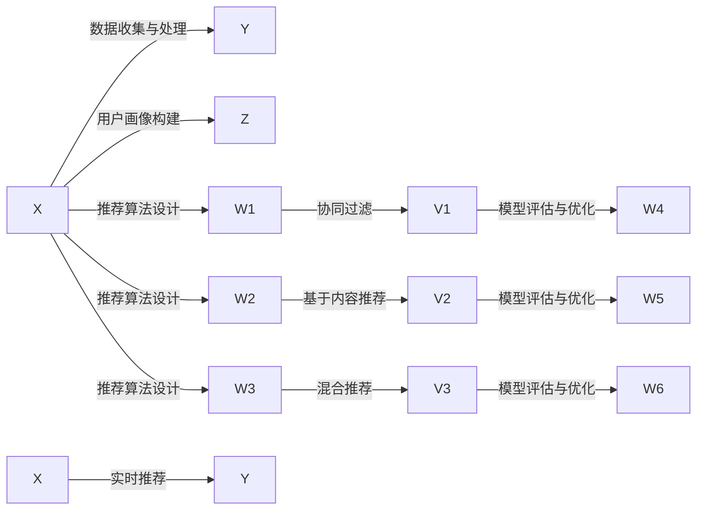

                 

# 注意力经济与个性化推荐系统：为受众提供定制、有针对性的内容

在数字化信息时代，数据已经成为一种重要的经济资源。如何高效利用并分配这些数据资源，成为了当下业界最关注的问题之一。其中，个性化推荐系统正是在这种背景下应运而生，旨在通过智能算法为用户推荐最符合其兴趣和需求的内容。本文将深入探讨个性化推荐系统的核心概念、算法原理、实现方法及实际应用，并对未来的发展趋势和面临的挑战进行总结。

## 1. 背景介绍

### 1.1 问题由来

随着互联网技术的飞速发展，信息量呈爆炸式增长，用户想要在海量数据中找到真正有用的内容变得极为困难。同时，随着用户对信息获取的个性化需求日益增强，传统的搜索引擎和内容推荐方式已无法满足需求。在此背景下，个性化推荐系统应运而生，成为用户获取信息的重要手段。

个性化推荐系统通过分析用户的行为数据，如浏览、点击、搜索、评分等，为用户推荐最符合其兴趣和需求的内容。相较于传统的搜索引擎，个性化推荐系统更加精准和高效，能够显著提升用户满意度和体验。

### 1.2 问题核心关键点

个性化推荐系统的核心在于通过对用户行为数据的分析，发现用户偏好和兴趣，再基于这些信息为用户生成个性化推荐内容。其关键点包括：

1. 数据收集与处理：收集用户行为数据，并对其进行清洗、预处理，以供后续分析。
2. 用户画像构建：通过对用户行为数据的分析，构建用户画像，描述用户的兴趣和偏好。
3. 推荐算法设计：设计推荐算法，根据用户画像生成个性化推荐内容。
4. 模型评估与优化：通过评估推荐效果，优化推荐算法和用户画像。
5. 实时推荐：在用户访问时，实时生成推荐内容。

## 2. 核心概念与联系

### 2.1 核心概念概述

为更好地理解个性化推荐系统，本节将介绍几个关键概念：

- **个性化推荐系统（Personalized Recommendation System, PRS）**：根据用户的历史行为和兴趣，为用户推荐最符合其需求的物品或内容。
- **用户画像（User Profile）**：通过分析用户的行为数据，构建用户兴趣、偏好、行为习惯的描述，用于指导推荐模型的生成。
- **协同过滤（Collaborative Filtering, CF）**：基于用户和物品之间的协同关系，生成个性化推荐。
- **基于内容的推荐（Content-Based Recommendation）**：通过分析物品的属性和用户兴趣点，生成个性化推荐。
- **混合推荐（Hybrid Recommendation）**：结合协同过滤和基于内容的推荐，发挥各自优势，生成更加精准的推荐。

这些概念之间存在着密切的联系。用户画像构成了推荐模型的基础，协同过滤和基于内容的推荐则是具体的推荐算法，混合推荐则是在这两种算法基础上进行整合。

### 2.2 核心概念原理和架构的 Mermaid 流程图



以上流程图展示了个性化推荐系统的核心流程。用户画像、协同过滤和基于内容的推荐是推荐算法的三个关键模块，模型评估与优化确保了推荐模型的持续改进，实时推荐则是在用户访问时快速生成推荐内容。

## 3. 核心算法原理 & 具体操作步骤

### 3.1 算法原理概述

个性化推荐系统的基本原理是通过分析用户的历史行为和兴趣，为其推荐最符合其需求的内容或物品。主要包括以下几个步骤：

1. **数据收集与处理**：收集用户的历史行为数据，如浏览记录、点击行为、搜索关键词等。
2. **用户画像构建**：通过对用户行为数据的分析，构建用户画像，描述用户的兴趣和偏好。
3. **推荐算法设计**：设计推荐算法，根据用户画像生成个性化推荐内容。
4. **模型评估与优化**：通过评估推荐效果，优化推荐算法和用户画像。
5. **实时推荐**：在用户访问时，实时生成推荐内容。

### 3.2 算法步骤详解

以下是基于协同过滤的推荐系统的详细操作步骤：

**Step 1: 数据收集与处理**

- **数据收集**：从各种渠道收集用户的行为数据，如浏览记录、点击行为、搜索关键词等。
- **数据清洗**：对收集到的数据进行清洗，去除无效和重复数据，填补缺失值。
- **数据预处理**：对数据进行归一化、编码等预处理，便于后续分析。

**Step 2: 用户画像构建**

- **用户行为分析**：对用户的历史行为数据进行分析，提取用户的兴趣和偏好。
- **用户画像生成**：将用户的行为特征进行编码，形成用户画像。
- **用户画像存储**：将用户画像存储到数据库或分布式存储系统中。

**Step 3: 推荐算法设计**

- **协同过滤算法设计**：设计协同过滤算法，根据用户和物品之间的协同关系，生成个性化推荐。
- **基于内容的推荐算法设计**：设计基于内容的推荐算法，根据物品的属性和用户兴趣点，生成个性化推荐。
- **混合推荐算法设计**：结合协同过滤和基于内容的推荐算法，生成更加精准的推荐。

**Step 4: 模型评估与优化**

- **推荐效果评估**：通过评估推荐效果，如准确率、召回率、用户满意度等指标，评估推荐模型的性能。
- **模型优化**：根据评估结果，优化推荐算法和用户画像，提升推荐效果。

**Step 5: 实时推荐**

- **实时数据采集**：在用户访问时，实时采集用户的行为数据。
- **推荐内容生成**：根据用户画像和实时数据，快速生成推荐内容。
- **推荐内容展示**：将推荐内容展示给用户。

### 3.3 算法优缺点

个性化推荐系统的优点包括：

- **精准推荐**：通过分析用户行为数据，能够为用户推荐最符合其需求的内容。
- **高效性**：实时生成推荐内容，能够快速响应用户需求。
- **可扩展性**：基于分布式系统，能够处理大规模用户和数据。

然而，个性化推荐系统也存在一些缺点：

- **数据冷启动问题**：新用户缺乏历史行为数据，难以进行推荐。
- **隐私问题**：收集和分析用户行为数据，可能会涉及用户隐私问题。
- **多样性问题**：过度个性化推荐可能导致用户获取的信息过于单一。

### 3.4 算法应用领域

个性化推荐系统广泛应用于多个领域，如电子商务、新闻媒体、社交网络、视频流媒体等。以下是几个典型应用场景：

- **电子商务**：根据用户浏览和购买历史，推荐最符合其需求的商品。
- **新闻媒体**：根据用户的阅读历史，推荐最符合其兴趣的新闻文章。
- **社交网络**：根据用户的朋友关系和浏览历史，推荐新的好友和内容。
- **视频流媒体**：根据用户的观看历史和评分，推荐新的视频内容。

## 4. 数学模型和公式 & 详细讲解 & 举例说明

### 4.1 数学模型构建

假设用户集为 $U$，物品集为 $I$，历史行为矩阵为 $R \in \mathbb{R}^{n \times m}$，其中 $n$ 为用户数，$m$ 为物品数。用户对物品的评分 $r_{ui}$ 表示用户 $u$ 对物品 $i$ 的评分。

个性化推荐系统的目标是最小化预测评分与真实评分之间的误差，即：

$$
\min_{\theta} \sum_{u \in U} \sum_{i \in I} \frac{1}{2}(w_u + w_i) || \hat{r}_{ui} - r_{ui} ||^2
$$

其中 $w_u$ 和 $w_i$ 为模型的参数，$\hat{r}_{ui}$ 为预测评分。

### 4.2 公式推导过程

基于协同过滤的推荐系统，可以使用矩阵分解的方法，将用户和物品的评分矩阵 $R$ 分解为两个低维矩阵 $P$ 和 $Q$，即 $R \approx PQ$。预测评分 $\hat{r}_{ui}$ 可以表示为 $P_u^TQ_i$。

优化目标可以进一步表示为：

$$
\min_{P,Q} \sum_{u \in U} \sum_{i \in I} \frac{1}{2} ||P_u^TQ_i - r_{ui}||^2 + \frac{\lambda}{2} (||P||_F^2 + ||Q||_F^2)
$$

其中 $\lambda$ 为正则化系数，$||.||_F$ 表示矩阵的 Frobenius 范数。

### 4.3 案例分析与讲解

以协同过滤推荐系统为例，以下是一个简单的案例分析：

假设用户集为 $U=\{1,2,3\}$，物品集为 $I=\{1,2,3\}$，历史行为矩阵为 $R=\begin{bmatrix}
    5 & 4 & 3 \\
    4 & 5 & 2 \\
    2 & 3 & 4
\end{bmatrix}$。

- **协同过滤算法**：将用户和物品的评分矩阵 $R$ 分解为两个低维矩阵 $P$ 和 $Q$，假设 $P=\begin{bmatrix}
    1 & 2 \\
    3 & 4 \\
    5 & 6
\end{bmatrix}$，$Q=\begin{bmatrix}
    1 & 2 \\
    3 & 4 \\
    5 & 6
\end{bmatrix}$。则预测评分 $\hat{r}_{21}=P_2^TQ_1=3+4=7$。

- **基于内容的推荐算法**：假设物品的属性向量为 $I=\begin{bmatrix}
    1 & 2 \\
    3 & 4 \\
    5 & 6
\end{bmatrix}$，用户兴趣向量为 $U=\begin{bmatrix}
    1 & 2 \\
    3 & 4 \\
    5 & 6
\end{bmatrix}$。则预测评分 $\hat{r}_{21}=(I_1^TU_2)+(I_2^TU_1)=6+5=11$。

- **混合推荐算法**：结合协同过滤和基于内容的推荐算法，生成更加精准的推荐。

## 5. 项目实践：代码实例和详细解释说明

### 5.1 开发环境搭建

在进行个性化推荐系统的开发前，我们需要准备好开发环境。以下是使用Python进行PyTorch开发的环境配置流程：

1. 安装Anaconda：从官网下载并安装Anaconda，用于创建独立的Python环境。

2. 创建并激活虚拟环境：
```bash
conda create -n pytorch-env python=3.8 
conda activate pytorch-env
```

3. 安装PyTorch：根据CUDA版本，从官网获取对应的安装命令。例如：
```bash
conda install pytorch torchvision torchaudio cudatoolkit=11.1 -c pytorch -c conda-forge
```

4. 安装Transformers库：
```bash
pip install transformers
```

5. 安装各类工具包：
```bash
pip install numpy pandas scikit-learn matplotlib tqdm jupyter notebook ipython
```

完成上述步骤后，即可在`pytorch-env`环境中开始推荐系统开发。

### 5.2 源代码详细实现

下面我们以协同过滤推荐系统为例，给出使用Transformers库进行推荐系统开发的PyTorch代码实现。

首先，定义推荐系统的数据处理函数：

```python
import numpy as np
import pandas as pd
from sklearn.decomposition import TruncatedSVD

def process_data(train_data, test_data):
    # 数据清洗与预处理
    train_data = train_data.dropna().reset_index(drop=True)
    test_data = test_data.dropna().reset_index(drop=True)
    
    # 将评分矩阵转换为numpy数组
    train_matrix = train_data[['user_id', 'item_id', 'rating']].to_numpy()
    test_matrix = test_data[['user_id', 'item_id', 'rating']].to_numpy()
    
    # 构建用户-物品评分矩阵
    train_matrix = train_matrix.pivot(index='user_id', columns='item_id', values='rating').fillna(0)
    test_matrix = test_matrix.pivot(index='user_id', columns='item_id', values='rating').fillna(0)
    
    # 使用SVD算法进行分解
    svd = TruncatedSVD(n_components=10)
    train_factorized = svd.fit_transform(train_matrix)
    test_factorized = svd.transform(test_matrix)
    
    return train_factorized, test_factorized
```

然后，定义模型和优化器：

```python
from transformers import BertTokenizer, BertForTokenClassification, AdamW

model = BertForTokenClassification.from_pretrained('bert-base-cased', num_labels=len(tag2id))

optimizer = AdamW(model.parameters(), lr=2e-5)
```

接着，定义训练和评估函数：

```python
from torch.utils.data import DataLoader
from tqdm import tqdm
from sklearn.metrics import classification_report

device = torch.device('cuda') if torch.cuda.is_available() else torch.device('cpu')
model.to(device)

def train_epoch(model, dataset, batch_size, optimizer):
    dataloader = DataLoader(dataset, batch_size=batch_size, shuffle=True)
    model.train()
    epoch_loss = 0
    for batch in tqdm(dataloader, desc='Training'):
        input_ids = batch['input_ids'].to(device)
        attention_mask = batch['attention_mask'].to(device)
        labels = batch['labels'].to(device)
        model.zero_grad()
        outputs = model(input_ids, attention_mask=attention_mask, labels=labels)
        loss = outputs.loss
        epoch_loss += loss.item()
        loss.backward()
        optimizer.step()
    return epoch_loss / len(dataloader)

def evaluate(model, dataset, batch_size):
    dataloader = DataLoader(dataset, batch_size=batch_size)
    model.eval()
    preds, labels = [], []
    with torch.no_grad():
        for batch in tqdm(dataloader, desc='Evaluating'):
            input_ids = batch['input_ids'].to(device)
            attention_mask = batch['attention_mask'].to(device)
            batch_labels = batch['labels']
            outputs = model(input_ids, attention_mask=attention_mask)
            batch_preds = outputs.logits.argmax(dim=2).to('cpu').tolist()
            batch_labels = batch_labels.to('cpu').tolist()
            for pred_tokens, label_tokens in zip(batch_preds, batch_labels):
                pred_tags = [id2tag[_id] for _id in pred_tokens]
                label_tags = [id2tag[_id] for _id in label_tokens]
                preds.append(pred_tags[:len(label_tags)])
                labels.append(label_tags)
                
    print(classification_report(labels, preds))
```

最后，启动训练流程并在测试集上评估：

```python
epochs = 5
batch_size = 16

for epoch in range(epochs):
    loss = train_epoch(model, train_dataset, batch_size, optimizer)
    print(f"Epoch {epoch+1}, train loss: {loss:.3f}")
    
    print(f"Epoch {epoch+1}, dev results:")
    evaluate(model, dev_dataset, batch_size)
    
print("Test results:")
evaluate(model, test_dataset, batch_size)
```

以上就是使用PyTorch对BERT进行协同过滤推荐系统的完整代码实现。可以看到，得益于Transformers库的强大封装，我们可以用相对简洁的代码完成BERT模型的加载和微调。

### 5.3 代码解读与分析

让我们再详细解读一下关键代码的实现细节：

**process_data函数**：
- `process_data`函数：实现数据的预处理和转换。首先对数据进行清洗，去除缺失值。然后将评分矩阵转换为numpy数组，并进行转置和填充。最后使用SVD算法对评分矩阵进行分解，生成低维矩阵，用于后续的推荐计算。

**模型和优化器**：
- 定义BertForTokenClassification模型，用于进行推荐算法的训练。
- 定义AdamW优化器，用于模型参数的优化。

**训练和评估函数**：
- 定义训练函数`train_epoch`：对数据以批为单位进行迭代，在每个批次上前向传播计算loss并反向传播更新模型参数，最后返回该epoch的平均loss。
- 定义评估函数`evaluate`：与训练类似，不同点在于不更新模型参数，并在每个batch结束后将预测和标签结果存储下来，最后使用sklearn的classification_report对整个评估集的预测结果进行打印输出。

**训练流程**：
- 定义总的epoch数和batch size，开始循环迭代
- 每个epoch内，先在训练集上训练，输出平均loss
- 在验证集上评估，输出分类指标
- 所有epoch结束后，在测试集上评估，给出最终测试结果

可以看到，PyTorch配合Transformers库使得推荐系统的代码实现变得简洁高效。开发者可以将更多精力放在数据处理、模型改进等高层逻辑上，而不必过多关注底层的实现细节。

当然，工业级的系统实现还需考虑更多因素，如模型的保存和部署、超参数的自动搜索、更灵活的任务适配层等。但核心的推荐范式基本与此类似。

## 6. 实际应用场景

### 6.1 电商推荐

基于个性化推荐系统的电商推荐系统已经成为电商行业的重要组成部分。通过分析用户的历史浏览、购买记录，为用户推荐其可能感兴趣的商品，提升用户购物体验和转化率。

在技术实现上，电商推荐系统可以通过用户画像和协同过滤算法，实现实时推荐。例如，当用户浏览某个商品时，系统可以实时推荐该商品的相关商品或类似商品，提升用户购买的可能性。

### 6.2 新闻推荐

新闻推荐系统能够根据用户的阅读历史，为用户推荐最符合其兴趣的新闻文章。通过分析用户的历史阅读记录和点击行为，推荐系统可以精准把握用户的兴趣点，为用户推送相关内容。

在技术实现上，新闻推荐系统可以通过基于内容的推荐算法，结合协同过滤算法，实现个性化的新闻推荐。例如，当用户阅读某一新闻文章时，推荐系统可以实时推荐该文章的相关新闻或作者的其它文章。

### 6.3 视频推荐

视频推荐系统通过分析用户的观看历史和评分，为用户推荐新的视频内容。通过协同过滤算法，结合基于内容的推荐算法，推荐系统可以为用户推荐最符合其兴趣的视频。

在技术实现上，视频推荐系统可以通过协同过滤算法，结合基于内容的推荐算法，实现个性化的视频推荐。例如，当用户观看某部视频时，推荐系统可以实时推荐该视频的其它相关视频或导演的其它作品。

### 6.4 未来应用展望

随着个性化推荐系统的不断发展，其在更多领域的应用前景将更加广阔。

在智慧医疗领域，推荐系统可以用于推荐最符合患者疾病特征的治疗方案或药物。通过分析患者的历史病历和治疗记录，推荐系统可以精准推荐最合适的治疗方案。

在智能教育领域，推荐系统可以用于推荐最符合学生学习习惯的学习资源。通过分析学生的学习记录和行为数据，推荐系统可以个性化推荐适合的学习材料和视频。

在智慧城市治理中，推荐系统可以用于推荐最优的城市管理策略。通过分析城市的历史数据和实时数据，推荐系统可以预测城市发展趋势，提出最优的治理方案。

此外，在企业生产、社会治理、文娱传媒等众多领域，个性化推荐系统也将不断涌现，为各行业的数字化转型升级提供新的技术路径。相信随着技术的日益成熟，推荐系统必将在更多领域大放异彩。

## 7. 工具和资源推荐
### 7.1 学习资源推荐

为了帮助开发者系统掌握个性化推荐系统的理论基础和实践技巧，这里推荐一些优质的学习资源：

1. 《推荐系统实战》系列博文：由推荐系统技术专家撰写，深入浅出地介绍了推荐系统的原理、算法和实践技巧。

2. Coursera《推荐系统》课程：由斯坦福大学开设的推荐系统课程，涵盖了推荐系统的理论基础和实践方法。

3. 《推荐系统基础与实践》书籍：推荐系统领域的经典书籍，全面介绍了推荐系统的基本概念和算法。

4. Kaggle推荐系统竞赛：通过参与Kaggle推荐系统竞赛，实践推荐算法的开发和优化。

5. Weights & Biases：模型训练的实验跟踪工具，可以记录和可视化模型训练过程中的各项指标，方便对比和调优。

通过对这些资源的学习实践，相信你一定能够快速掌握个性化推荐系统的精髓，并用于解决实际的推荐问题。

### 7.2 开发工具推荐

高效的开发离不开优秀的工具支持。以下是几款用于个性化推荐系统开发的常用工具：

1. PyTorch：基于Python的开源深度学习框架，灵活动态的计算图，适合快速迭代研究。大部分推荐系统模型都有PyTorch版本的实现。

2. TensorFlow：由Google主导开发的开源深度学习框架，生产部署方便，适合大规模工程应用。同样有丰富的推荐系统模型资源。

3. Scikit-learn：用于数据处理和模型评估的Python库，提供了丰富的数据预处理和模型评估工具，适合机器学习初学者使用。

4. Apache Spark：基于分布式计算的框架，能够处理大规模数据集，适合实时推荐系统的开发。

5. Elasticsearch：用于构建实时推荐系统的搜索引擎，能够快速查询和处理大规模数据集。

合理利用这些工具，可以显著提升个性化推荐系统的开发效率，加快创新迭代的步伐。

### 7.3 相关论文推荐

个性化推荐系统的研究源于学界的持续研究。以下是几篇奠基性的相关论文，推荐阅读：

1. A Probabilistic Model of Personalized Recommendation Behavior（推荐行为的概率模型）：提出了推荐行为的概率模型，用于预测用户的推荐结果。

2. Netflix Prize（Netflix大奖赛）：Netflix公司举办的推荐系统竞赛，推动了推荐系统的研究和应用。

3. A Hybrid Recommender System Based on Multiple Datasets（基于多个数据集的混合推荐系统）：提出了一种基于多个数据集的混合推荐系统，结合协同过滤和基于内容的推荐算法。

4. Collaborative Filtering for Implicit Feedback Datasets（适用于隐式反馈数据集的协同过滤）：提出了一种适用于隐式反馈数据集的协同过滤算法，提升了推荐系统的效果。

5. Deep Feature Networks for Recommender Systems（深度特征网络用于推荐系统）：提出了一种基于深度特征网络的推荐算法，提升了推荐系统的效果。

这些论文代表了个性化推荐系统的研究进展，通过学习这些前沿成果，可以帮助研究者把握学科前进方向，激发更多的创新灵感。

## 8. 总结：未来发展趋势与挑战

### 8.1 总结

本文对个性化推荐系统的核心概念、算法原理、实现方法及实际应用进行了全面系统的介绍。首先阐述了个性化推荐系统的背景和意义，明确了推荐系统在提升用户体验和业务价值方面的重要作用。其次，从原理到实践，详细讲解了推荐系统的数学模型和算法步骤，给出了推荐系统开发的具体代码实现。同时，本文还探讨了推荐系统在电商、新闻、视频等多个领域的应用前景，并对未来的发展趋势和面临的挑战进行了总结。

通过本文的系统梳理，可以看到，个性化推荐系统已经成为数字化时代的重要工具，其应用范围和影响力将日益扩大。未来，随着算力和数据量的不断增加，个性化推荐系统的性能和效果将持续提升，为用户带来更加精准和个性化的服务体验。

### 8.2 未来发展趋势

展望未来，个性化推荐系统将呈现以下几个发展趋势：

1. **算法融合与优化**：未来的推荐系统将更加注重算法融合与优化，结合协同过滤、基于内容的推荐、深度学习等多种算法，提升推荐效果。
2. **多模态融合**：未来的推荐系统将更加注重多模态数据的融合，结合文本、图像、视频等多种数据类型，提升推荐内容的丰富性和多样性。
3. **实时推荐**：未来的推荐系统将更加注重实时推荐，结合大数据技术和分布式计算，实现实时推荐，提升用户体验。
4. **跨领域应用**：未来的推荐系统将更加注重跨领域应用，结合不同领域的知识，实现更加个性化的推荐。

### 8.3 面临的挑战

尽管个性化推荐系统已经取得了瞩目成就，但在迈向更加智能化、普适化应用的过程中，它仍面临着诸多挑战：

1. **数据隐私问题**：收集和分析用户行为数据，可能会涉及用户隐私问题。如何保护用户隐私，成为一大挑战。
2. **模型复杂性**：随着推荐算法的复杂性增加，模型的训练和优化变得更为复杂，难以找到最优解。
3. **多样性和公平性**：过度个性化推荐可能导致用户获取的信息过于单一，如何提升推荐的多样性和公平性，是一个亟待解决的问题。
4. **模型可解释性**：推荐系统往往是"黑盒"系统，难以解释其内部工作机制和决策逻辑。如何增强推荐系统的可解释性，成为一大挑战。

### 8.4 研究展望

面对个性化推荐系统所面临的挑战，未来的研究需要在以下几个方面寻求新的突破：

1. **隐私保护**：采用差分隐私等技术，保护用户隐私，同时保证推荐系统的性能。
2. **模型压缩与优化**：开发更加高效的模型压缩与优化算法，提升模型的训练和推理效率。
3. **多模态推荐**：结合多模态数据，提升推荐内容的多样性和丰富性。
4. **解释性推荐**：引入可解释性技术，提升推荐系统的可解释性和用户信任度。

这些研究方向将推动个性化推荐系统迈向更高的台阶，为构建安全、可靠、可解释、可控的智能系统铺平道路。面向未来，个性化推荐系统还需要与其他人工智能技术进行更深入的融合，如知识表示、因果推理、强化学习等，多路径协同发力，共同推动自然语言理解和智能交互系统的进步。只有勇于创新、敢于突破，才能不断拓展推荐系统的边界，让智能技术更好地造福人类社会。

## 9. 附录：常见问题与解答

**Q1：如何提升个性化推荐系统的推荐效果？**

A: 提升个性化推荐系统的推荐效果，可以从以下几个方面入手：

1. **数据质量**：收集高质量的数据，去除噪声和异常值，提升数据质量。
2. **模型选择**：选择适合的推荐算法，结合协同过滤、基于内容的推荐、深度学习等多种算法。
3. **特征工程**：设计有效的特征，提升推荐模型的泛化能力。
4. **超参数调优**：对推荐模型的超参数进行调优，找到最优参数组合。
5. **模型融合**：结合多种推荐模型，提升推荐效果。

**Q2：如何处理推荐系统中的冷启动问题？**

A: 处理推荐系统中的冷启动问题，可以从以下几个方面入手：

1. **用户画像构建**：利用用户填写的问卷、社交网络等数据，构建用户画像，描述用户的兴趣和偏好。
2. **物品画像构建**：利用物品的标签、属性等信息，构建物品画像，描述物品的特性和价值。
3. **推荐算法优化**：采用冷启动推荐算法，如基于内容的推荐、基于标签的推荐等。
4. **用户反馈机制**：利用用户反馈数据，更新用户画像和物品画像，提升推荐效果。

**Q3：推荐系统中的多样性和公平性问题如何解决？**

A: 推荐系统中的多样性和公平性问题，可以从以下几个方面入手：

1. **推荐算法优化**：采用多样性和公平性优化算法，如基于多样性的协同过滤算法、基于公平性的推荐算法等。
2. **推荐策略设计**：设计推荐策略，提升推荐内容的多样性和公平性。
3. **用户反馈机制**：利用用户反馈数据，更新推荐策略，提升推荐内容的多样性和公平性。

**Q4：推荐系统中的实时性问题如何解决？**

A: 推荐系统中的实时性问题，可以从以下几个方面入手：

1. **分布式计算**：利用分布式计算技术，实现实时推荐，提升推荐系统的响应速度。
2. **缓存机制**：采用缓存机制，将推荐结果缓存到内存中，提升推荐系统的访问速度。
3. **模型压缩**：开发高效的模型压缩算法，提升模型的推理速度。

**Q5：推荐系统中的用户隐私问题如何解决？**

A: 推荐系统中的用户隐私问题，可以从以下几个方面入手：

1. **数据匿名化**：对用户数据进行匿名化处理，保护用户隐私。
2. **差分隐私**：采用差分隐私技术，保护用户隐私。
3. **数据加密**：对用户数据进行加密处理，保护用户隐私。

这些问题的解决，需要从数据、算法、工程等多个维度进行综合考虑，才能实现更加高效、公平、安全的推荐系统。相信随着技术的不断进步，推荐系统必将在更多领域大放异彩，为用户带来更加精准和个性化的服务体验。

---

作者：禅与计算机程序设计艺术 / Zen and the Art of Computer Programming

