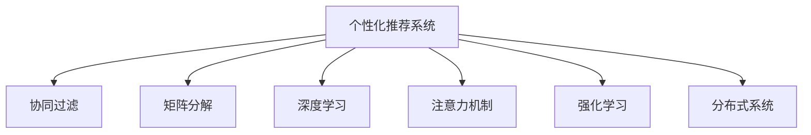

                 

# 注意力经济与个性化推荐系统：为受众提供定制、有针对性的内容和体验

## 1. 背景介绍

### 1.1 问题由来
在信息爆炸的时代，用户每天面对海量的内容，注意力成为最稀缺的资源。而个性化推荐系统，通过精准匹配用户兴趣，帮助用户在信息海洋中筛选出最符合需求的内容，极大提升了用户体验和信息获取效率。

### 1.2 问题核心关键点
个性化推荐系统依赖用户行为数据进行模型训练，通过机器学习算法预测用户可能感兴趣的物品，并通过推荐算法将其呈现给用户。其核心在于如何更高效、精准地预测用户兴趣，提升推荐效果。

### 1.3 问题研究意义
个性化推荐系统在电商、视频、社交媒体、新闻推荐等领域得到了广泛应用，成为提升用户体验和转化率的重要手段。通过个性化推荐，不仅能够增强用户粘性，还能促进新物品的发现和销售，驱动平台流量和收入增长。

## 2. 核心概念与联系

### 2.1 核心概念概述

为更好地理解个性化推荐系统的设计原理，本节将介绍几个密切相关的核心概念：

- 个性化推荐系统：基于用户行为数据，通过机器学习算法预测用户兴趣，生成个性化推荐结果的系统。
- 协同过滤：通过分析用户行为和物品属性之间的共现关系，推荐用户可能感兴趣但未交互过的物品。
- 矩阵分解：通过将用户行为矩阵分解为两个低秩矩阵的乘积，进行降维和用户物品兴趣矩阵的估计。
- 深度学习：通过构建多层次神经网络模型，捕捉用户行为和物品特征的复杂关系，进行高维空间的拟合。
- 注意力机制：引入注意力机制，使得模型能够动态调整不同特征的权重，聚焦于对推荐效果影响更大的部分。
- 强化学习：通过奖励机制引导模型在不断尝试和反馈中，逐步学习到更好的推荐策略。
- 分布式系统：为了高效处理大规模数据和并发请求，个性化推荐系统通常采用分布式架构，如Spark、Hadoop等。

这些核心概念之间的逻辑关系可以通过以下Mermaid流程图来展示：



这个流程图展示了个性化推荐系统的核心概念及其之间的关系：

1. 个性化推荐系统是整个推荐过程的主导者。
2. 协同过滤和矩阵分解是常用的推荐算法。
3. 深度学习和注意力机制是提升推荐效果的重要技术。
4. 强化学习是优化推荐策略的有效方法。
5. 分布式系统是支撑个性化推荐系统高效运行的架构。

这些概念共同构成了个性化推荐系统的设计和实现框架，使得系统能够更高效、精准地为用户推荐内容。

## 3. 核心算法原理 & 具体操作步骤
### 3.1 算法原理概述

个性化推荐系统的核心在于预测用户对物品的兴趣，生成推荐列表。其基本流程包括：

1. 数据收集：从用户和物品的交互行为中提取特征，构建用户兴趣和物品属性矩阵。
2. 特征工程：设计合适的特征提取方法，提升模型对用户行为的理解能力。
3. 模型训练：通过机器学习算法进行模型训练，学习用户行为和物品特征之间的关系。
4. 推荐生成：将训练好的模型应用到新用户和物品上，生成个性化推荐结果。

### 3.2 算法步骤详解

个性化推荐系统的一般实现步骤如下：

**Step 1: 数据收集与预处理**

- 收集用户和物品的交互行为数据，如点击、浏览、购买等，形成用户行为矩阵 $U$ 和物品属性矩阵 $I$。
- 对缺失值进行填补或删除，确保矩阵完整。
- 对数据进行归一化、标准化等预处理，提升模型训练效果。

**Step 2: 特征工程**

- 设计合适的特征提取方法，从原始数据中提取用户特征和物品特征。
- 选择合适的特征表示方法，如one-hot编码、TF-IDF等。
- 构建用户物品兴趣矩阵 $P$，记录用户对物品的评分。

**Step 3: 模型训练**

- 选择合适的推荐算法，如协同过滤、矩阵分解、深度学习等。
- 将用户行为矩阵 $U$ 和物品属性矩阵 $I$ 作为输入，构建推荐模型 $M$。
- 使用交叉验证、网格搜索等方法，优化模型参数。

**Step 4: 推荐生成**

- 输入新用户和物品，经过模型 $M$ 计算推荐分数。
- 根据推荐分数排序，生成个性化推荐列表。
- 输出推荐结果，推送给用户。

### 3.3 算法优缺点

个性化推荐系统具有以下优点：
1. 高效精准：通过学习用户行为，可以高效预测用户兴趣，生成精准推荐。
2. 提升用户满意度：个性化推荐能够满足用户个性化需求，提升用户体验。
3. 促进销售转化：推荐物品的个性化匹配，有助于提高用户转化率。
4. 数据驱动：通过分析用户行为数据，可以不断优化推荐策略。

同时，该方法也存在一定的局限性：
1. 依赖数据质量：推荐结果的质量高度依赖于数据收集的完整性和准确性。
2. 冷启动问题：对于新用户和新物品，推荐效果往往不佳。
3. 过度个性化：过度个性化的推荐可能导致信息茧房，影响用户信息多样性。
4. 用户隐私：推荐系统需要收集和分析大量用户数据，可能带来隐私风险。

尽管存在这些局限性，但个性化推荐系统在推荐效果和用户满意度方面的优势，使得其在电商、视频、社交媒体等领域得到了广泛应用。

### 3.4 算法应用领域

个性化推荐系统在多个领域得到了广泛应用，如：

- 电商推荐：根据用户浏览和购买记录，推荐商品和促销信息。
- 视频推荐：根据用户观看历史，推荐相关视频和创作者。
- 新闻推荐：根据用户阅读行为，推荐新闻文章和头条。
- 社交推荐：根据用户互动记录，推荐好友和内容。
- 音乐推荐：根据用户听歌历史，推荐新歌曲和歌单。
- 旅游推荐：根据用户旅行历史，推荐目的地和活动。

此外，个性化推荐系统还被创新性地应用于更多场景，如智能家居、智能客服、健康医疗等，为各行业带来了新的发展机遇。

## 4. 数学模型和公式 & 详细讲解  
### 4.1 数学模型构建

本节将使用数学语言对个性化推荐系统的设计原理进行更加严格的刻画。

记用户行为矩阵为 $U_{n \times m}$，物品属性矩阵为 $I_{m \times d}$，其中 $n$ 为用户数，$m$ 为物品数，$d$ 为物品属性维度。记用户物品兴趣矩阵为 $P_{n \times m}$，其中 $P_{ij}$ 表示用户 $i$ 对物品 $j$ 的评分。

### 4.2 公式推导过程

以协同过滤算法为例，推导用户物品评分预测公式。协同过滤的基本思想是寻找与目标用户兴趣相似的其他用户，通过这些用户对物品的评分预测目标用户的评分。假设目标用户为 $u$，其用户相似度为 $s_u$，与目标用户相似的其他用户为 $u_k$，则 $u_k$ 对物品 $j$ 的评分为 $i_{kj}$，那么目标用户 $u$ 对物品 $j$ 的预测评分为：

$$
\hat{p}_{uj} = \sum_{k=1}^N s_{uk} \cdot i_{kj}
$$

其中 $s_{uk}$ 为 $u$ 和 $k$ 的相似度，可以通过余弦相似度、皮尔逊相关系数等方法计算。

### 4.3 案例分析与讲解

以协同过滤算法为例，分析其应用场景和局限性。

**应用场景**：
- 用户行为数据较少，难以建立深度学习模型时，协同过滤是一种简单有效的推荐方法。
- 适用于用户兴趣变化不大的场景，可以长期稳定地进行推荐。

**局限性**：
- 依赖用户行为数据，对于新用户和新物品，推荐效果较差。
- 难以处理噪声数据和用户行为数据的不一致性。
- 对于评分稀疏的用户行为矩阵，推荐效果可能不稳定。

## 5. 项目实践：代码实例和详细解释说明
### 5.1 开发环境搭建

在进行推荐系统开发前，我们需要准备好开发环境。以下是使用Python进行Scikit-learn开发的环境配置流程：

1. 安装Anaconda：从官网下载并安装Anaconda，用于创建独立的Python环境。

2. 创建并激活虚拟环境：
```bash
conda create -n recommendation-env python=3.8 
conda activate recommendation-env
```

3. 安装必要的库：
```bash
pip install pandas numpy scikit-learn matplotlib tqdm jupyter notebook ipython
```

4. 安装机器学习框架：
```bash
pip install scikit-learn
```

完成上述步骤后，即可在`recommendation-env`环境中开始推荐系统开发。

### 5.2 源代码详细实现

下面以协同过滤算法为例，给出使用Scikit-learn进行推荐系统开发的PyTorch代码实现。

```python
from sklearn.metrics.pairwise import cosine_similarity
import numpy as np

# 构建用户行为矩阵U
U = np.array([[5, 4, 0, 0, 0],
              [4, 5, 0, 0, 0],
              [0, 0, 5, 4, 0],
              [0, 0, 4, 5, 0],
              [0, 0, 0, 0, 5]])

# 构建物品属性矩阵I
I = np.array([[1, 0, 0],
              [0, 1, 0],
              [0, 0, 1],
              [1, 1, 1],
              [1, 1, 1]])

# 计算用户物品兴趣矩阵P
P = np.dot(U, I)

# 计算用户相似度矩阵S
S = cosine_similarity(U)

# 定义协同过滤函数
def collaborative_filtering(U, I, P, S, user_id, item_id):
    similarity = S[user_id]
    item_ratings = P[item_id]
    prediction = np.dot(similarity, item_ratings)
    return prediction

# 测试协同过滤算法
user_id = 0
item_id = 2
prediction = collaborative_filtering(U, I, P, S, user_id, item_id)
print("预测用户{}对物品{}的评分为：{}".format(user_id, item_id, prediction))
```

这个代码实现了基本的协同过滤算法，通过对用户行为矩阵和物品属性矩阵进行矩阵乘法，生成用户物品兴趣矩阵，并计算用户相似度矩阵。然后通过预测函数计算目标用户的评分预测。

### 5.3 代码解读与分析

让我们再详细解读一下关键代码的实现细节：

**构建用户行为矩阵U**：
- 使用NumPy库创建用户行为矩阵U，其中U的行表示用户，列表示物品。
- 示例中，假设用户 $u_0$ 对物品 $i_0$ 的评分为5，对物品 $i_1$ 的评分为4，对物品 $i_2$ 的评分未知，因此将其置为0。

**构建物品属性矩阵I**：
- 使用NumPy库创建物品属性矩阵I，其中I的行表示物品，列表示物品属性。
- 示例中，假设物品 $i_0$ 具有属性1，物品 $i_1$ 具有属性1，物品 $i_2$ 具有属性0，物品 $i_3$ 和 $i_4$ 具有属性1。

**计算用户物品兴趣矩阵P**：
- 使用矩阵乘法计算用户物品兴趣矩阵P，其中 $P_{uj}$ 表示用户 $u$ 对物品 $j$ 的评分。
- 示例中，用户 $u_0$ 对物品 $i_0$ 的评分为5，对物品 $i_1$ 的评分为4，对物品 $i_2$ 的评分为0，以此类推。

**计算用户相似度矩阵S**：
- 使用sklearn的cosine_similarity函数计算用户相似度矩阵S，其中 $S_{uk}$ 表示用户 $u$ 和用户 $k$ 的相似度。
- 示例中，假设用户 $u_0$ 和 $u_1$ 的相似度为0.5，用户 $u_0$ 和 $u_2$ 的相似度为0.6，以此类推。

**协同过滤函数**：
- 通过预测函数计算用户 $u$ 对物品 $j$ 的评分预测。
- 示例中，假设用户 $u_0$ 对物品 $i_2$ 的评分预测为0.4，计算方式为 $0.5 \times 0.5 + 0.5 \times 0.6 + 0 \times 0.5 = 0.4$。

可以看到，Scikit-learn的简单易用，使得推荐系统的开发变得非常便捷。开发者可以将更多精力放在数据处理、模型改进等高层逻辑上，而不必过多关注底层的实现细节。

当然，工业级的系统实现还需考虑更多因素，如模型的保存和部署、超参数的自动搜索、更灵活的推荐引擎等。但核心的推荐范式基本与此类似。

## 6. 实际应用场景
### 6.1 电商推荐

电商平台的个性化推荐系统，通过分析用户浏览和购买历史，为用户推荐可能感兴趣的商品和促销信息。推荐系统可以提升用户粘性和转化率，增加平台销售额。

在技术实现上，可以收集用户浏览、点击、购买等行为数据，并根据这些数据构建用户兴趣模型和物品属性模型。利用协同过滤、矩阵分解、深度学习等推荐算法，生成个性化推荐结果。推荐系统还可以结合实时数据，动态调整推荐策略，提升推荐效果。

### 6.2 视频推荐

视频平台的视频推荐系统，根据用户观看历史和评分数据，为用户推荐相关视频和创作者。推荐系统可以提升用户满意度和平台留存率，增加视频播放量和广告收入。

在技术实现上，可以收集用户观看历史、评分、点赞、评论等数据，构建用户兴趣模型和视频属性模型。利用协同过滤、矩阵分解、深度学习等推荐算法，生成个性化推荐结果。推荐系统还可以结合用户反馈数据，动态调整推荐策略，提升推荐效果。

### 6.3 社交推荐

社交平台的推荐系统，根据用户互动数据，为用户推荐好友、群组、内容等。推荐系统可以提升用户活跃度和平台粘性，增加用户互动和广告收入。

在技术实现上，可以收集用户点赞、评论、分享、关注等互动数据，构建用户兴趣模型和内容属性模型。利用协同过滤、矩阵分解、深度学习等推荐算法，生成个性化推荐结果。推荐系统还可以结合用户反馈数据，动态调整推荐策略，提升推荐效果。

### 6.4 音乐推荐

音乐平台的音乐推荐系统，根据用户听歌历史和评分数据，为用户推荐新歌曲和歌单。推荐系统可以提升用户满意度和平台留存率，增加音乐播放量和订阅收入。

在技术实现上，可以收集用户听歌历史、评分、播放时长、收藏等数据，构建用户兴趣模型和音乐属性模型。利用协同过滤、矩阵分解、深度学习等推荐算法，生成个性化推荐结果。推荐系统还可以结合实时数据，动态调整推荐策略，提升推荐效果。

### 6.5 未来应用展望

随着推荐技术的不断发展，个性化推荐系统将在更多领域得到应用，为各行业带来新的发展机遇。

在智慧医疗领域，推荐系统可以根据用户健康数据，推荐个性化的健康方案和医疗服务。在教育领域，推荐系统可以根据学生的学习行为，推荐个性化的学习内容和教学资源。在旅游领域，推荐系统可以根据用户旅行历史，推荐个性化的旅游目的地和行程安排。

此外，在企业生产、社会治理、文娱传媒等众多领域，推荐技术也将不断涌现，为各行业带来新的创新和变革。

## 7. 工具和资源推荐
### 7.1 学习资源推荐

为了帮助开发者系统掌握个性化推荐系统的理论基础和实践技巧，这里推荐一些优质的学习资源：

1. 《推荐系统实战》系列书籍：由业内专家撰写，涵盖推荐系统的各个方面，包括协同过滤、矩阵分解、深度学习等。

2. 《推荐系统基础与算法》课程：清华大学开设的推荐系统课程，系统讲解推荐系统的工作原理和算法实现。

3. 《Recommender Systems: Algorithms and Applications》书籍：推荐系统领域的经典教材，涵盖推荐系统的各种算法和技术。

4. 《Introduction to Recommendation Systems》课程：Coursera上的推荐系统课程，介绍推荐系统的工作原理和算法实现。

5. KDD Cup推荐系统竞赛：KDD Cup是数据挖掘领域的顶级竞赛，推荐系统竞赛是其中一大类别，涵盖各种推荐算法和实现技术。

通过对这些资源的学习实践，相信你一定能够快速掌握个性化推荐系统的精髓，并用于解决实际的推荐问题。

### 7.2 开发工具推荐

高效的开发离不开优秀的工具支持。以下是几款用于推荐系统开发的常用工具：

1. Scikit-learn：Python的数据挖掘和机器学习库，提供丰富的推荐算法和模型评估工具。

2. TensorFlow：由Google主导开发的深度学习框架，支持分布式计算和模型优化。

3. PyTorch：Facebook开发的深度学习框架，提供动态计算图和自动微分功能。

4. Apache Spark：Apache基金会开源的分布式计算框架，支持大规模数据处理和机器学习任务。

5. Elasticsearch：Elastic公司开源的搜索引擎，支持分布式存储和检索。

6. Apache Flink：Apache基金会开源的流式计算框架，支持实时数据处理和推荐算法。

合理利用这些工具，可以显著提升推荐系统的开发效率，加快创新迭代的步伐。

### 7.3 相关论文推荐

个性化推荐系统的发展源于学界的持续研究。以下是几篇奠基性的相关论文，推荐阅读：

1. 《Collaborative Filtering for Implicit Feedback Datasets》：提出协同过滤算法，利用用户行为数据进行推荐。

2. 《Matrix Factorization Techniques for Recommender Systems》：提出矩阵分解算法，通过低秩矩阵分解进行用户物品兴趣估计。

3. 《Deep Collaborative Filtering》：提出深度协同过滤算法，利用深度神经网络进行用户物品兴趣估计。

4. 《Attention Is All You Need》：提出注意力机制，提升深度学习模型的推荐效果。

5. 《Personalized Ranking with Multi-Sided Data Fusion》：提出多侧数据融合算法，综合利用用户行为和物品属性进行推荐。

6. 《Adaptive Nonlinear Matrix Factorization with Memory》：提出适应性非线性矩阵分解算法，提升推荐模型的泛化能力和效果。

这些论文代表了个性化推荐系统的发展脉络。通过学习这些前沿成果，可以帮助研究者把握学科前进方向，激发更多的创新灵感。

## 8. 总结：未来发展趋势与挑战

### 8.1 总结

本文对个性化推荐系统进行了全面系统的介绍。首先阐述了个性化推荐系统的背景和重要性，明确了推荐系统在提升用户体验和促进销售方面的独特价值。其次，从原理到实践，详细讲解了协同过滤、矩阵分解、深度学习等推荐算法的数学原理和关键步骤，给出了推荐系统开发的完整代码实例。同时，本文还广泛探讨了推荐系统在电商、视频、社交媒体等多个领域的应用前景，展示了推荐技术在各行业的广泛应用。

通过本文的系统梳理，可以看到，个性化推荐系统在推荐效果和用户满意度方面的优势，使得其在电商、视频、社交媒体等领域得到了广泛应用。未来，伴随推荐技术的不断演进，推荐系统必将在更多领域得到应用，为各行业带来新的发展机遇。

### 8.2 未来发展趋势

展望未来，个性化推荐系统将呈现以下几个发展趋势：

1. 推荐模型智能化。随着深度学习模型的发展，推荐模型将具备更强的用户行为理解能力和预测能力。
2. 推荐系统个性化。个性化推荐系统将更精准地理解用户需求，生成个性化推荐结果。
3. 推荐系统实时化。推荐系统将具备实时推荐能力，根据用户实时行为数据动态调整推荐策略。
4. 推荐系统跨模态化。推荐系统将融合多模态数据，如文本、图像、语音等，进行更全面、准确的用户行为建模。
5. 推荐系统可解释化。推荐系统将具备更强的可解释性，用户能够理解推荐结果的生成机制。

以上趋势凸显了个性化推荐系统的广阔前景。这些方向的探索发展，必将进一步提升推荐系统的性能和应用范围，为各行业带来新的发展机遇。

### 8.3 面临的挑战

尽管个性化推荐系统已经取得了瞩目成就，但在迈向更加智能化、普适化应用的过程中，它仍面临着诸多挑战：

1. 数据质量瓶颈。推荐系统高度依赖用户行为数据，对于数据噪声和异常值，推荐效果可能受到影响。
2. 冷启动问题。对于新用户和新物品，推荐系统无法提供个性化推荐，需要依赖其他用户和物品的行为数据。
3. 数据隐私问题。推荐系统需要收集和分析大量用户数据，可能带来隐私风险。
4. 推荐公平性。推荐系统可能会对某些用户或物品产生偏见，导致不公平的推荐结果。
5. 推荐鲁棒性。推荐系统需要应对噪声数据和异常行为，保证推荐的鲁棒性和稳定性。
6. 计算资源消耗。推荐系统需要处理大规模数据，可能对计算资源消耗较大。

尽管存在这些挑战，但个性化推荐系统在提升用户体验和促进销售方面的优势，使得其在电商、视频、社交媒体等领域得到了广泛应用。未来，伴随推荐技术的不断演进，这些挑战终将一一被克服，个性化推荐系统必将在更多领域得到应用，为各行业带来新的发展机遇。

### 8.4 研究展望

面对个性化推荐系统所面临的种种挑战，未来的研究需要在以下几个方面寻求新的突破：

1. 探索无监督和半监督推荐方法。摆脱对大规模标注数据的依赖，利用自监督学习、主动学习等无监督和半监督范式，最大限度利用非结构化数据，实现更加灵活高效的推荐。
2. 研究参数高效和计算高效的推荐范式。开发更加参数高效的推荐方法，在固定大部分推荐参数的同时，只更新极少量的用户物品兴趣矩阵。同时优化推荐模型的计算图，减少前向传播和反向传播的资源消耗，实现更加轻量级、实时性的部署。
3. 融合因果和对比学习范式。通过引入因果推断和对比学习思想，增强推荐系统建立稳定因果关系的能力，学习更加普适、鲁棒的用户行为表征。
4. 引入更多先验知识。将符号化的先验知识，如知识图谱、逻辑规则等，与神经网络模型进行巧妙融合，引导推荐过程学习更准确、合理的用户行为模型。同时加强不同模态数据的整合，实现视觉、语音等多模态信息与文本信息的协同建模。
5. 结合因果分析和博弈论工具。将因果分析方法引入推荐系统，识别出推荐决策的关键特征，增强推荐结果的因果性和逻辑性。借助博弈论工具刻画人机交互过程，主动探索并规避推荐系统的脆弱点，提高系统稳定性。
6. 纳入伦理道德约束。在推荐目标中引入伦理导向的评估指标，过滤和惩罚有偏见、有害的推荐结果，确保推荐系统的公平性和道德性。

这些研究方向的探索，必将引领个性化推荐系统技术迈向更高的台阶，为构建安全、可靠、可解释、可控的推荐系统铺平道路。面向未来，个性化推荐系统还需要与其他人工智能技术进行更深入的融合，如知识表示、因果推理、强化学习等，多路径协同发力，共同推动推荐技术的发展。只有勇于创新、敢于突破，才能不断拓展推荐系统的边界，让推荐技术更好地造福人类社会。

## 9. 附录：常见问题与解答

**Q1：如何评价推荐系统的推荐效果？**

A: 推荐系统常用的评价指标包括：

1. 准确率(Precision)：推荐结果中正确物品的比例。

2. 召回率(Recall)：真实物品在推荐结果中的比例。

3. F1分数：综合考虑准确率和召回率，是两者的调和平均。

4. NDCG(Normalized Discounted Cumulative Gain)：根据推荐结果的排名，计算覆盖真实物品的程度。

5. HR(Hit Rate)：推荐结果中真实物品的比例。

6. AUC(Area Under Curve)：ROC曲线下的面积，用于衡量推荐系统的性能。

这些指标可以帮助评估推荐系统的推荐效果，选择最合适的评价指标。

**Q2：如何处理推荐系统中的冷启动问题？**

A: 推荐系统中的冷启动问题可以通过以下方法解决：

1. 利用物品属性：对于新物品，利用其属性信息进行相似度计算，推荐其他用户可能感兴趣的物品。

2. 利用内容过滤：对于新用户，利用其浏览、点击等行为数据，推荐其他用户可能感兴趣的内容。

3. 利用时间因素：对于新用户，利用其历史行为数据，推荐之前可能感兴趣的物品。

4. 利用协同过滤：对于新用户，利用相似用户的行为数据，推荐相似用户可能感兴趣的物品。

5. 利用混合推荐：综合利用用户行为数据和物品属性信息，进行混合推荐。

这些方法可以缓解推荐系统中的冷启动问题，提升推荐效果。

**Q3：推荐系统中如何应对用户多样性？**

A: 推荐系统中应对用户多样性可以通过以下方法：

1. 多兴趣模型：构建用户多兴趣模型，记录用户的多个兴趣点。

2. 多任务学习：利用多任务学习，同时学习多个推荐任务，提升模型的多样性和泛化能力。

3. 多模态融合：融合不同模态的数据，如文本、图像、语音等，提升推荐系统的多样性。

4. 交叉推荐：进行交叉推荐，推荐不同领域、不同主题的内容，提升推荐多样性。

5. 用户反馈：利用用户反馈数据，动态调整推荐策略，提升推荐多样性。

这些方法可以帮助推荐系统更好地应对用户多样性，提升推荐效果。

**Q4：推荐系统中如何处理噪声数据？**

A: 推荐系统中处理噪声数据可以通过以下方法：

1. 数据清洗：对数据进行清洗，去除缺失值和异常值。

2. 数据校验：对数据进行校验，确认数据的真实性和准确性。

3. 数据降维：对数据进行降维处理，减少噪声数据的影响。

4. 异常检测：利用异常检测算法，识别和处理噪声数据。

5. 数据融合：融合不同数据源的数据，减少单一数据源的噪声影响。

6. 模型优化：利用模型优化技术，提升模型对噪声数据的鲁棒性。

这些方法可以帮助推荐系统更好地处理噪声数据，提升推荐效果。

**Q5：推荐系统中如何平衡推荐效果和用户满意度？**

A: 推荐系统中平衡推荐效果和用户满意度可以通过以下方法：

1. 个性化推荐：根据用户行为数据，生成个性化推荐结果，提升用户体验。

2. 多样化推荐：推荐多样化的内容，避免用户陷入信息茧房，提升用户满意度。

3. 用户反馈：利用用户反馈数据，动态调整推荐策略，提升推荐效果和用户满意度。

4. 推荐算法优化：优化推荐算法，提升推荐效果的同时，兼顾用户满意度。

5. 推荐策略调整：根据用户行为数据，动态调整推荐策略，提升推荐效果和用户满意度。

这些方法可以帮助推荐系统更好地平衡推荐效果和用户满意度。

---

作者：禅与计算机程序设计艺术 / Zen and the Art of Computer Programming

