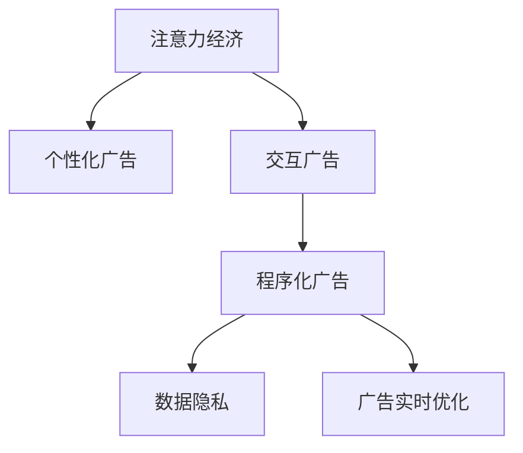

                 

# 注意力经济与在线广告目标与实践：在不牺牲用户体验的情况下吸引受众

## 1. 背景介绍

### 1.1 问题由来

在数字化时代，广告主和消费者之间的互动模式正在发生深刻变革。传统广告模式以单向传播为主，内容往往缺乏针对性和个性化。随着移动互联网和社交媒体的兴起，注意力经济成为商家关注的焦点。如何利用有限的注意力资源，实现高效的广告投放，成为广告学和信息技术交叉研究的重点问题。

### 1.2 问题核心关键点

在注意力经济背景下，在线广告的挑战和机遇并存：

- **用户注意力稀缺**：互联网时代，用户每天面对海量信息，注意力成为最为宝贵的资源。如何高效获取和利用用户注意力，成为在线广告的核心。

- **个性化需求提升**：消费者对个性化、精准化广告的期望日益增长。在线广告应更好地了解用户偏好，实现精准投放。

- **互动体验优化**：互动广告体验逐渐成为用户期待的趋势。如何提升互动广告的参与度和效果，成为广告创新的重要方向。

- **数据隐私保护**：随着隐私保护法规的加强，如何合法合规地获取和使用用户数据，确保广告投放的安全性和合规性，成为重要的考量因素。

### 1.3 问题研究意义

在线广告的研究具有重要意义，它不仅关系到广告主的投资回报，更关系到用户的体验感和消费决策。通过高效利用用户注意力，提升广告精准度和互动性，同时保护用户隐私，将为商家和用户带来双赢局面。

## 2. 核心概念与联系

### 2.1 核心概念概述

为更好地理解在线广告的原理和实践，本节将介绍几个关键概念：

- **注意力经济**：指在信息爆炸的时代，用户注意力的稀缺性成为经济活动的核心。商家通过竞争和创新，争夺用户注意力，实现商业价值。

- **个性化广告**：利用用户行为数据、兴趣标签等，实现广告内容的个性化定制，提升广告相关性和用户参与度。

- **交互广告**：用户与广告之间发生互动的广告形式，如点击、滑动、视频观看等。通过互动广告，商家能够更好地理解用户反馈，优化广告内容。

- **程序化广告**：指通过算法程序自动进行广告投放的管理模式。程序化广告能够实现广告投放的自动化、动态化和优化，提高广告效果和ROI。

- **数据隐私**：用户数据的获取和处理过程中，保障用户隐私和数据安全，避免滥用和泄露，是广告投放的重要前提。

- **广告实时优化**：在广告投放过程中，根据实时反馈数据不断优化广告投放策略，提高广告效果和用户满意度。

这些概念之间的逻辑关系可以通过以下Mermaid流程图来展示：



这个流程图展示了一些核心概念及其相互关联：

1. 注意力经济通过个性化广告和交互广告，利用程序化广告技术，高效获取和利用用户注意力。
2. 个性化广告和交互广告的实施依赖于程序化广告，能够实现广告投放的自动化和动态化。
3. 程序化广告和数据隐私密不可分，只有保障数据隐私，程序化广告才能合法合规地进行。
4. 广告实时优化通过程序化广告，能够根据实时反馈不断调整投放策略，提升广告效果。

## 3. 核心算法原理 & 具体操作步骤
### 3.1 算法原理概述

在线广告的投放过程涉及复杂的决策和优化问题。其中，个性化广告和程序化广告是核心的两大技术手段，其核心算法原理如下：

- **个性化广告算法**：利用机器学习模型，对用户历史行为、兴趣标签、地理位置等信息进行建模，预测用户对不同广告的兴趣程度，实现精准投放。

- **程序化广告算法**：通过实时竞价和优化算法，动态调整广告投放的策略和资源，在保证预算和效果的同时，最大化广告的ROI。

### 3.2 算法步骤详解

#### 3.2.1 个性化广告算法步骤

1. **用户画像构建**：收集用户历史行为数据、兴趣标签、地理位置等信息，构建用户画像。

2. **广告特征提取**：对广告文本、图片、视频等信息进行特征提取，生成特征向量。

3. **用户-广告匹配模型训练**：利用机器学习算法（如逻辑回归、SVM、深度神经网络等），训练用户-广告匹配模型，预测用户对广告的兴趣程度。

4. **广告排序和投放**：根据用户画像和广告特征，对广告进行排序，选择最相关和用户最感兴趣的广告进行投放。

#### 3.2.2 程序化广告算法步骤

1. **广告竞价策略设计**：根据广告主预算和投放目标，设计实时竞价策略。

2. **广告投放平台选择**：选择合适的广告投放平台（如Google Adwords、Facebook Ads等），根据平台特性设计广告投放规则。

3. **实时竞价和广告投放**：根据广告竞价策略和广告平台规则，进行实时竞价和广告投放，动态调整投放策略。

4. **广告效果评估和优化**：利用反馈数据（如点击率、转化率等），评估广告效果，调整投放策略和预算分配。

### 3.3 算法优缺点

#### 3.3.1 个性化广告算法优缺点

**优点**：

- 精准度高：通过机器学习模型，能够精准预测用户对广告的兴趣程度，实现精准投放。
- 用户参与度提升：个性化广告能够提升用户对广告的参与度和转化率，提高广告效果。

**缺点**：

- 数据隐私问题：个性化广告需要大量用户数据，涉及数据隐私和合规问题。
- 模型过拟合：个性化广告算法容易过拟合，需要不断优化和调整模型。

#### 3.3.2 程序化广告算法优缺点

**优点**：

- 自动化高效：程序化广告能够实现广告投放的自动化和动态化，提升广告效率。
- 效果评估和优化：通过实时反馈数据，能够动态调整投放策略，提升广告效果。

**缺点**：

- 技术复杂度高：程序化广告涉及复杂的算法和优化问题，技术门槛较高。
- 预算控制难：程序化广告需要平衡预算和效果，控制不当可能导致预算浪费。

### 3.4 算法应用领域

个性化广告和程序化广告技术在多个领域得到广泛应用：

- **电商广告**：通过个性化广告，提升商品推荐精准度，提高用户转化率和复购率。
- **社交媒体广告**：利用程序化广告，实现广告投放的自动化和个性化，提升广告效果和用户参与度。
- **移动应用广告**：通过实时反馈数据，动态调整广告投放策略，提升广告转化率和用户留存率。
- **在线视频广告**：通过程序化广告，实现视频广告的精准投放和效果评估，提升广告效果和用户满意度。

## 4. 数学模型和公式 & 详细讲解 & 举例说明

### 4.1 数学模型构建

在线广告的算法模型通常基于用户-广告的互动行为数据进行构建。我们以一个简单的线性回归模型为例，介绍个性化广告模型的构建过程。

设广告主有 $N$ 个广告 $A=\{A_i\}_{i=1}^N$，每个广告由 $d$ 个特征 $A_i=[a_{i1},a_{i2},...,a_{id}]$ 组成，每个用户有 $M$ 个行为数据 $U=\{U_j\}_{j=1}^M$，其中每个行为数据 $U_j$ 由 $d$ 个行为特征 $U_j=[u_{j1},u_{j2},...,u_{jd}]$ 组成。我们希望建立一个模型 $f_{\theta}(U,A)$，预测用户对广告的兴趣程度 $y_j$。

其中 $\theta$ 为模型参数，$y_j$ 为用户的广告兴趣程度，通常定义为0-1之间的概率值，表示用户是否点击广告的概率。模型 $f_{\theta}$ 可以采用线性回归的形式：

$$
y_j = \theta_0 + \sum_{i=1}^d \theta_ia_{ij}
$$

在实际应用中，我们需要将用户行为数据和广告特征转化为模型输入，并对模型进行训练和预测。

### 4.2 公式推导过程

以线性回归模型为例，进行公式推导过程：

**训练集损失函数**：

$$
\mathcal{L}_{train}(\theta) = -\frac{1}{M}\sum_{j=1}^M(y_j - f_{\theta}(U_j,A))^2
$$

**测试集损失函数**：

$$
\mathcal{L}_{test}(\theta) = -\frac{1}{M_{test}}\sum_{j=1}^{M_{test}}(y_j - f_{\theta}(U_j,A))^2
$$

其中 $M_{test}$ 为测试集样本数。

**模型参数更新公式**：

$$
\theta \leftarrow \theta - \eta \nabla_{\theta} \mathcal{L}(\theta)
$$

其中 $\eta$ 为学习率，$\nabla_{\theta} \mathcal{L}(\theta)$ 为损失函数对参数 $\theta$ 的梯度。

通过最小化损失函数，不断更新模型参数，直至模型在训练集和测试集上达到满意的性能。

### 4.3 案例分析与讲解

**案例**：电商网站个性化推荐广告

**数据集构建**：收集用户浏览、点击、购买等行为数据，提取商品描述、价格、用户画像等信息。

**模型训练**：利用机器学习算法训练用户-商品兴趣匹配模型，预测用户对商品的兴趣程度。

**广告投放**：根据模型预测结果，选择最相关的商品广告进行个性化投放，实现精准推荐。

## 5. 项目实践：代码实例和详细解释说明

### 5.1 开发环境搭建

在进行在线广告投放实践前，我们需要准备好开发环境。以下是使用Python进行在线广告投放的开发环境配置流程：

1. 安装Python：从官网下载并安装Python，推荐使用Python 3.7及以上版本。

2. 安装Pandas和NumPy：
```bash
pip install pandas numpy
```

3. 安装scikit-learn：
```bash
pip install scikit-learn
```

4. 安装TensorFlow或PyTorch：
```bash
pip install tensorflow
```
或
```bash
pip install torch
```

5. 安装Flask或Django：
```bash
pip install flask
```
或
```bash
pip install django
```

6. 安装广告投放平台SDK：如Google Adwords SDK或Facebook Ads SDK。

完成上述步骤后，即可在开发环境中开始在线广告投放的实现。

### 5.2 源代码详细实现

这里我们以一个简单的电商个性化推荐广告为例，给出使用TensorFlow进行模型训练和广告投放的PyTorch代码实现。

首先，定义模型和数据集：

```python
import tensorflow as tf
import numpy as np
from sklearn.model_selection import train_test_split

# 构建用户行为数据集
user_data = np.random.rand(1000, 10)  # 1000个用户，10个行为特征
ad_data = np.random.rand(100, 5)  # 100个广告，5个特征

# 将数据集划分为训练集和测试集
user_train, user_test, ad_train, ad_test = train_test_split(user_data, ad_data, test_size=0.2)

# 定义模型参数
theta = tf.Variable(tf.zeros([1, 5]), name='theta')

# 定义损失函数和优化器
loss_fn = tf.keras.losses.MeanSquaredError()
optimizer = tf.keras.optimizers.SGD(learning_rate=0.01)

# 定义模型
def f(theta, user, ad):
    return tf.reduce_sum(theta * ad) + theta[0]

# 定义训练函数
def train_model(model, user_train, ad_train, user_test, ad_test, epochs=100):
    for epoch in range(epochs):
        with tf.GradientTape() as tape:
            predictions = model(user_train, ad_train)
            loss = loss_fn(predictions, user_train[:, 0])
        gradients = tape.gradient(loss, model.trainable_variables)
        optimizer.apply_gradients(zip(gradients, model.trainable_variables))
        if epoch % 10 == 0:
            print(f'Epoch {epoch+1}, Loss: {loss.numpy()}')
```

接着，定义广告投放函数：

```python
# 广告投放函数
def serve_ad(user, ad_data):
    # 假设用户行为数据和广告特征都是0-1之间的浮点数
    user_score = f(theta, user, ad_data)
    if user_score > 0.5:
        return 'Click'
    else:
        return 'Not Click'

# 测试广告投放效果
user_test = np.random.rand(200, 10)
ad_test = np.random.rand(20, 5)
for user in user_test:
    print(f'User: {user}, Ad: {ad_test}')
    ad = serve_ad(user, ad_test)
    print(f'Ad Click: {ad}')
```

最后，启动模型训练和广告投放流程：

```python
# 初始化模型参数
theta = tf.Variable(tf.zeros([1, 5]), name='theta')

# 定义损失函数和优化器
loss_fn = tf.keras.losses.MeanSquaredError()
optimizer = tf.keras.optimizers.SGD(learning_rate=0.01)

# 定义模型
def f(theta, user, ad):
    return tf.reduce_sum(theta * ad) + theta[0]

# 训练模型
train_model(f, user_train, ad_train, user_test, ad_test, epochs=100)

# 广告投放测试
user_test = np.random.rand(200, 10)
ad_test = np.random.rand(20, 5)
for user in user_test:
    print(f'User: {user}, Ad: {ad_test}')
    ad = serve_ad(user, ad_test)
    print(f'Ad Click: {ad}')
```

以上就是使用TensorFlow进行电商个性化推荐广告的完整代码实现。可以看到，通过TensorFlow，我们能够快速搭建模型、训练参数、实现广告投放，展示了机器学习在在线广告中的应用潜力。

### 5.3 代码解读与分析

**代码实现要点**：

1. **用户行为数据和广告特征**：我们使用numpy生成随机数据，用于模拟用户行为数据和广告特征。
2. **模型定义和训练**：定义线性回归模型，并使用sklearn的train_test_split函数将数据集划分为训练集和测试集。
3. **广告投放函数**：利用训练好的模型预测用户对广告的兴趣程度，并决定是否进行点击。
4. **测试广告投放效果**：随机生成一组用户行为数据和广告特征，测试广告投放的准确性。

## 6. 实际应用场景

### 6.1 智能推荐系统

基于机器学习的个性化推荐系统，已经成为电商、视频、音乐等行业的标配。通过用户行为数据和广告特征，构建个性化推荐模型，实现精准投放。

**应用场景**：用户登录电商平台后，系统根据其浏览历史、收藏夹、搜索记录等信息，生成推荐商品广告，提升用户购买转化率。

**效果**：电商平台通过个性化推荐系统，将广告预算用于最有可能产生转化的用户，提升了广告效果，减少了广告浪费。

### 6.2 程序化广告平台

程序化广告平台能够实现广告投放的自动化和动态化，极大提升了广告效果和投放效率。

**应用场景**：在线广告主使用程序化广告平台进行广告投放，设置投放规则和预算，平台根据实时数据动态调整广告投放策略。

**效果**：程序化广告平台通过实时竞价和优化算法，实现了广告投放的自动化和动态化，提升了广告效果和用户参与度。

### 6.3 实时广告效果监控

通过实时反馈数据，能够动态调整广告投放策略，提升广告效果。

**应用场景**：广告主在广告投放过程中，实时监控广告点击率、转化率等指标，根据反馈数据动态调整投放策略和预算分配。

**效果**：通过实时监控和动态优化，广告主能够及时发现和解决广告投放中的问题，提升广告效果和投资回报。

## 7. 工具和资源推荐

### 7.1 学习资源推荐

为了帮助开发者系统掌握在线广告的原理和实践，这里推荐一些优质的学习资源：

1. 《推荐系统实战》书籍：全面介绍了推荐系统的设计、实现和优化方法，涵盖个性化广告和程序化广告的核心技术。

2. 《深度学习在广告中的应用》课程：斯坦福大学开设的深度学习课程，介绍了深度学习在广告中的应用，涵盖机器学习算法和广告投放技术。

3. 《在线广告优化实战》博客：大厂广告优化工程师撰写的实战经验分享，涵盖广告投放、优化和效果评估的方方面面。

4. Google Ads、Facebook Ads官方文档：详细的广告投放平台文档，提供了丰富的API接口和优化建议。

5. DNNs for Advertising（Google AI博客）：谷歌AI博客，介绍了深度神经网络在广告中的应用，展示了前沿技术。

通过对这些资源的学习实践，相信你一定能够快速掌握在线广告的技术精髓，并用于解决实际的广告投放问题。

### 7.2 开发工具推荐

高效的开发离不开优秀的工具支持。以下是几款用于在线广告开发常用的工具：

1. TensorFlow：基于Python的深度学习框架，支持分布式计算，适合大规模广告投放和优化任务。

2. PyTorch：基于Python的深度学习框架，灵活高效，适合研究和实验性质的广告投放任务。

3. Scikit-learn：基于Python的机器学习库，提供了丰富的算法和评估工具，适合构建广告推荐和分类模型。

4. Dask：Python的分布式计算库，支持大规模广告数据的处理和分析。

5. TensorBoard：TensorFlow配套的可视化工具，可实时监测模型训练状态，可视化广告投放效果。

6. Flask/Django：Python的Web开发框架，适合搭建广告投放API，提供广告投放和管理接口。

合理利用这些工具，可以显著提升在线广告投放的开发效率，加快创新迭代的步伐。

### 7.3 相关论文推荐

在线广告的研究源于学界的持续研究。以下是几篇奠基性的相关论文，推荐阅读：

1. "An Adaptive Threshold Based Online Learning Algorithm for Programmatic Display Advertising"：提出了基于在线学习的广告投放算法，能够动态调整广告投放策略，提升广告效果。

2. "A Multi-View Learning Framework for Personalized Advertisement"：提出了一种多视图学习框架，结合用户行为数据和广告特征，提升了广告投放的个性化和精准度。

3. "Deep Learning in Online Advertising"：介绍了深度学习在广告中的应用，展示了深度神经网络在广告推荐和效果优化中的潜力。

4. "Real-Time Bidding for Display Advertising"：介绍了程序化广告的实时竞价机制，展示了程序化广告的优势和优化方法。

这些论文代表了大规模广告投放技术的发展脉络。通过学习这些前沿成果，可以帮助研究者把握学科前进方向，激发更多的创新灵感。

## 8. 总结：未来发展趋势与挑战

### 8.1 总结

本文对在线广告的原理和实践进行了全面系统的介绍。首先阐述了在线广告的背景和意义，明确了个性化广告和程序化广告的核心技术。其次，从原理到实践，详细讲解了在线广告的数学模型和实现步骤，给出了广告投放的代码实例。同时，本文还广泛探讨了广告在电商、社交媒体、程序化平台等多个领域的应用前景，展示了在线广告的巨大潜力。此外，本文精选了广告投放的各类学习资源，力求为读者提供全方位的技术指引。

通过本文的系统梳理，可以看到，在线广告技术正在成为互联网商业的重要范式，极大地提升了广告投放的效率和效果。未来，伴随技术演进和市场需求的推动，在线广告还将迎来更多创新突破。

### 8.2 未来发展趋势

展望未来，在线广告技术将呈现以下几个发展趋势：

1. **用户意图理解**：通过自然语言处理技术，理解用户搜索意图和广告需求，实现更加精准的广告投放。

2. **多模态广告**：结合视频、图像、声音等多模态信息，提升广告的互动性和用户体验。

3. **个性化广告推荐**：通过强化学习和深度学习，实现更加个性化的广告推荐，提升用户满意度和转化率。

4. **跨平台广告投放**：实现跨网站、跨应用、跨平台的用户广告投放和效果优化。

5. **实时数据处理**：通过大数据技术和流处理技术，实现实时数据采集和广告投放优化。

6. **隐私保护技术**：引入差分隐私和联邦学习等隐私保护技术，保障用户数据安全和隐私。

以上趋势凸显了在线广告技术的广阔前景。这些方向的探索发展，必将进一步提升广告投放的精准度和效果，为商家和用户带来更多的价值。

### 8.3 面临的挑战

尽管在线广告技术已经取得了瞩目成就，但在迈向更加智能化、普适化应用的过程中，它仍面临着诸多挑战：

1. **数据隐私问题**：在广告投放过程中，如何合法合规地获取和使用用户数据，确保数据隐私和合规性，成为重要考量。

2. **广告效果评估**：在广告投放过程中，如何客观、准确地评估广告效果，避免广告效果评估偏差，提升广告ROI。

3. **用户行为预测**：在广告推荐过程中，如何准确预测用户行为，提升广告相关性和用户参与度。

4. **广告创意多样化**：在广告创意设计过程中，如何设计多样化、有吸引力的广告内容，提升广告效果。

5. **广告投放实时优化**：在广告投放过程中，如何实时动态调整广告投放策略，提升广告效果和用户体验。

6. **广告投放平台稳定性**：在广告投放平台设计过程中，如何保证平台的稳定性和可靠性，避免广告投放中断。

这些挑战凸显了在线广告技术在推广和应用中的复杂性，需要进一步的研究和探索。

### 8.4 研究展望

面对在线广告技术面临的挑战，未来的研究需要在以下几个方面寻求新的突破：

1. **隐私保护技术**：结合差分隐私和联邦学习等隐私保护技术，确保用户数据安全和隐私。

2. **广告效果评估**：引入更加科学合理的广告效果评估指标和模型，提高广告ROI。

3. **用户意图理解**：通过自然语言处理技术，深入理解用户搜索意图和广告需求，实现更加精准的广告投放。

4. **多模态广告**：结合视频、图像、声音等多模态信息，提升广告的互动性和用户体验。

5. **个性化广告推荐**：通过强化学习和深度学习，实现更加个性化的广告推荐，提升用户满意度和转化率。

6. **跨平台广告投放**：实现跨网站、跨应用、跨平台的用户广告投放和效果优化。

7. **广告创意多样化**：设计多样化、有吸引力的广告内容，提升广告效果。

这些研究方向将为在线广告技术带来新的突破，推动广告投放的智能化和普适化进程，提升广告效果和用户体验。

## 9. 附录：常见问题与解答

**Q1: 在线广告的投放过程中，如何保证用户隐私和数据安全？**

A: 在广告投放过程中，用户隐私和数据安全是首要考虑的问题。以下是一些常用的隐私保护技术：

1. **差分隐私**：在数据采集和处理过程中，添加噪音干扰，确保用户数据不可逆识别。

2. **联邦学习**：将数据分散在多个设备或服务器上进行模型训练，不集中存储用户数据。

3. **加密技术**：使用加密算法对用户数据进行加密，确保数据传输和存储的安全性。

4. **匿名化技术**：将用户数据进行匿名化处理，去除可以识别用户身份的信息。

这些技术的应用，可以大大提升广告投放的隐私保护水平，保障用户数据安全和隐私。

**Q2: 在线广告投放过程中，如何评估广告效果？**

A: 广告效果评估是广告投放中的重要环节。常用的评估指标包括点击率、转化率、投资回报率等。以下是一些常用的评估方法：

1. **A/B测试**：将广告投放分为多个版本，通过对比测试，评估广告效果。

2. **点击率-转化率矩阵**：根据用户点击行为和转化行为，评估广告的点击率和转化率，分析广告效果。

3. **转化漏斗分析**：通过分析用户行为数据，评估广告从点击到转化的各个环节，找出影响转化的因素。

4. **ROI分析**：通过广告投放的预算和效果，计算广告的投入产出比，评估广告ROI。

这些评估方法可以帮助广告主更好地理解广告效果，优化投放策略和预算分配。

**Q3: 在线广告推荐系统中，如何实现个性化推荐？**

A: 个性化推荐系统通过机器学习算法，预测用户对不同广告的兴趣程度，实现精准投放。以下是一些常用的个性化推荐方法：

1. **协同过滤算法**：通过用户行为数据和广告特征，预测用户对广告的兴趣程度，实现个性化推荐。

2. **矩阵分解算法**：将用户行为数据和广告特征转化为矩阵形式，通过矩阵分解算法，预测用户对广告的兴趣程度。

3. **深度学习算法**：通过深度神经网络模型，学习用户行为和广告特征的复杂关系，实现更加精准的个性化推荐。

4. **多模态推荐算法**：结合用户行为数据和广告多模态信息，提升广告推荐的精准度和多样性。

这些算法和方法的应用，可以实现更加个性化和精准的广告推荐，提升广告效果和用户满意度。

**Q4: 在线广告投放过程中，如何设计多样化和有吸引力的广告创意？**

A: 广告创意设计是广告投放的重要环节。以下是一些常用的广告创意设计方法：

1. **用户画像分析**：通过用户画像分析，了解用户兴趣和需求，设计符合用户期望的广告创意。

2. **多渠道发布**：将广告发布到不同的渠道和平台，增加广告曝光度和用户参与度。

3. **创意测试**：通过A/B测试等方法，对比不同广告创意的效果，选择最优的广告创意。

4. **互动设计**：设计互动性强的广告创意，如视频、互动游戏等，提升用户参与度和广告效果。

5. **动态生成**：利用自然语言处理和机器学习技术，动态生成广告创意，提升广告的个性化和多样化。

这些方法可以帮助广告主设计多样化、有吸引力的广告创意，提升广告效果和用户满意度。

**Q5: 在线广告投放过程中，如何实现实时动态优化？**

A: 实时动态优化是广告投放中的关键环节。以下是一些常用的实时动态优化方法：

1. **实时竞价**：根据广告主预算和投放目标，进行实时竞价，动态调整广告投放策略。

2. **实时反馈数据处理**：利用实时反馈数据（如点击率、转化率等），动态调整广告投放策略和预算分配。

3. **实时模型训练**：根据实时反馈数据，动态调整模型参数，提升广告效果和投放效率。

4. **实时数据处理技术**：利用大数据技术和流处理技术，实现实时数据采集和广告投放优化。

5. **机器学习算法**：通过机器学习算法，实时优化广告投放策略，提升广告效果和用户体验。

这些方法可以帮助广告主实时动态优化广告投放策略，提升广告效果和用户体验。

综上所述，在线广告技术在互联网商业中具有广泛的应用前景和深远的影响力。通过系统掌握在线广告的原理和实践，不断创新和优化，将为广告主和用户带来更多的价值。

---

作者：禅与计算机程序设计艺术 / Zen and the Art of Computer Programming

