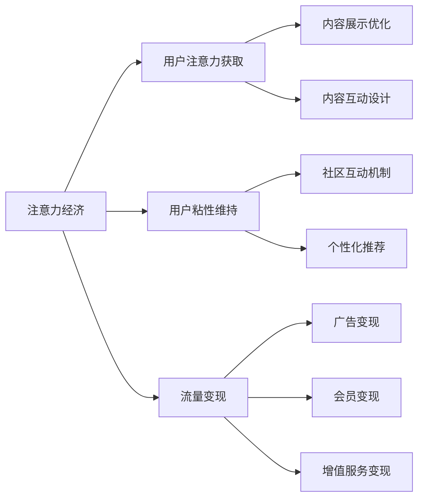

                 

# 注意力经济与在线社区建设指南：吸引并留住忠实的受众

在数字化浪潮的推动下，互联网已经从信息传播的渠道，转变为用户消费注意力、生产经济价值的平台。面对海量信息的冲击，如何吸引用户注意力、培养用户粘性、实现流量变现，成为在线社区和内容平台建设的关键课题。本文将深入探讨注意力经济的核心原理和策略，提供一套系统化的在线社区建设指南，帮助开发者构建高粘性、高变现的社区平台。

## 1. 背景介绍

### 1.1 问题由来
互联网的普及和社交媒体的兴起，使得内容平台成为注意力竞争的重要战场。用户在海量的信息中筛选出有价值的内容，并投入时间和注意力进行互动。然而，由于信息过载和同质化内容泛滥，用户流失率居高不下，内容平台的流量变现也面临巨大挑战。

### 1.2 问题核心关键点
注意力经济的核心在于理解用户注意力作为稀缺资源的价值，如何有效吸引和利用用户注意力。主要包括以下几个方面：
1. 用户注意力获取：通过优化内容展示形式，提升内容吸引力，获取用户点击、停留和互动。
2. 用户粘性维持：通过社区互动机制和个性化推荐，增强用户粘性和参与感。
3. 流量变现：通过广告、会员、增值服务等多元化变现模式，实现流量价值的最大化。

理解这些关键点，并根据不同平台的特点制定相应的策略，是构建成功的在线社区的基石。

## 2. 核心概念与联系

### 2.1 核心概念概述

为了更好地理解注意力经济和在线社区建设的原理和策略，本节将介绍几个核心概念：

- 注意力经济(Attention Economy)：指在信息过载的环境中，用户通过注意力投入获取信息和价值的过程。如何高效利用注意力资源，实现商业变现，是注意力经济的核心。
- 用户粘性(User Retention)：指用户对在线平台的持续参与和留存率。高粘性用户是平台流量变现的重要基础。
- 社区(Community)：指用户围绕共同兴趣和目的形成的虚拟社群，用户通过互动和交流获得心理满足和信息价值。
- 内容推荐(Content Recommendation)：指根据用户历史行为和兴趣，通过算法推荐用户可能感兴趣的内容，提高用户停留时间和互动率。
- 流量变现(Traffic Monetization)：指通过广告、会员、增值服务等方式，将用户注意力转化为经济收益的过程。

这些核心概念共同构成了在线社区建设的框架，通过吸引用户注意力、培养用户粘性、实现流量变现，平台可以形成良性循环，持续创造价值。

### 2.2 核心概念原理和架构的 Mermaid 流程图



## 3. 核心算法原理 & 具体操作步骤

### 3.1 算法原理概述

注意力经济和在线社区建设的核心在于高效获取和利用用户注意力。通过内容优化和推荐算法，提升用户互动率，培养用户粘性，最终实现流量变现。

形式化地，设用户总数为 $N$，在平台上的停留时间为 $T$，平台提供的内容数量为 $M$。则平台的总注意力价值 $V$ 可以表示为：

$$ V = \frac{N \times T}{M} $$

其中 $N \times T$ 为平台消耗的总注意力时间，$M$ 为平台提供的内容数量。提升平台总注意力价值的关键在于提高内容吸引力、增加用户停留时间、优化内容推荐。

### 3.2 算法步骤详解

基于注意力经济的核心原理，构建在线社区建设的策略可以分为以下几个关键步骤：

**Step 1: 内容优化和设计**
- 分析用户兴趣和行为，设计有吸引力的内容形式。如短剧、短视频、图文并茂的文章等。
- 提升内容质量，增加原创和独家内容，减少抄袭和低质内容。
- 通过A/B测试和多渠道推广，不断优化内容展示形式和分发策略。

**Step 2: 互动机制和用户粘性维持**
- 设计互动机制，如点赞、评论、分享、打赏等，增强用户参与感和成就感。
- 引入KOL和意见领袖，提升内容的权威性和吸引力。
- 提供个性化推荐系统，根据用户兴趣和行为推荐相关内容，提高用户停留时间。

**Step 3: 流量变现和商业模式设计**
- 多元化流量变现策略，如广告、会员、增值服务等。
- 优化广告位和展示形式，提高广告效果和点击率。
- 通过会员制和订阅服务，提高用户粘性和长期价值。
- 设计增值服务，如内容付费、个性化定制、社区功能等，增强用户粘性和平台收益。

**Step 4: 数据分析和优化**
- 收集和分析用户行为数据，如停留时间、互动率、转化率等，评估内容和策略的效果。
- 定期进行模型优化和更新，提升推荐系统的精准度和覆盖率。
- 应用A/B测试和多变量测试，持续优化平台策略和算法。

### 3.3 算法优缺点

基于注意力经济和在线社区建设的策略，具有以下优点：
1. 提升用户粘性：通过互动机制和个性化推荐，增强用户参与感和留存率。
2. 多元变现：通过多种流量变现方式，实现流量价值的最大化。
3. 数据驱动：通过数据分析和优化，不断提升平台的运营效率和用户体验。

同时，该策略也存在一些局限性：
1. 内容质量依赖：平台内容质量对用户粘性和变现效果至关重要，需要持续投入资源。
2. 算法复杂性：个性化推荐系统需要复杂的算法和大量数据支持，对技术要求较高。
3. 用户粘性难以保证：高竞争环境下的用户流失率难以完全控制，需要不断优化和调整策略。
4. 数据隐私风险：用户行为数据的收集和分析可能带来隐私风险，需要严格的保护措施。

尽管存在这些局限性，但就目前而言，基于注意力经济的在线社区建设策略仍是大规模内容平台的主流范式。未来相关研究的重点在于如何进一步优化内容推荐算法、提高用户参与度，同时兼顾隐私保护和数据安全等因素。

### 3.4 算法应用领域

基于注意力经济和在线社区建设的策略，已经在各类在线平台和内容平台得到广泛应用，如：

- 社交媒体平台：如微信、微博、抖音等，通过优化内容展示和互动机制，吸引和留住用户，实现广告和会员变现。
- 视频平台：如YouTube、爱奇艺、Bilibili等，通过个性化推荐和多元化内容，提升用户粘性和流量价值。
- 新闻聚合平台：如今日头条、腾讯新闻、网易新闻等，通过推荐算法和内容聚合，提高用户停留时间和广告收入。
- 在线教育平台：如Coursera、Udacity、Khan Academy等，通过内容推荐和互动机制，培养用户学习兴趣和粘性。
- 知识问答平台：如知乎、Quora、豆瓣等，通过高质量内容推荐和专家互动，提升用户参与度和社区价值。

除了上述这些常见领域外，注意力经济和在线社区建设的策略也在其他如电商、金融、健康等诸多领域得到应用，为不同行业的数字化转型提供了新的思路。

## 4. 数学模型和公式 & 详细讲解 & 举例说明

### 4.1 数学模型构建

本节将使用数学语言对注意力经济和在线社区建设的策略进行更加严格的刻画。

设用户总数为 $N$，在平台上的停留时间为 $T$，平台提供的内容数量为 $M$，用户对内容的互动率为 $\eta$。则平台的总注意力价值 $V$ 可以表示为：

$$ V = \frac{N \times T}{M} \times \eta $$

其中 $N \times T$ 为平台消耗的总注意力时间，$\eta$ 为用户对内容的互动率。提升平台总注意力价值的关键在于提高内容吸引力、增加用户停留时间、优化内容推荐。

### 4.2 公式推导过程

以下我们以内容推荐系统的精准度为例，推导推荐算法中的相关公式。

设推荐系统推荐给用户内容 $x$ 的吸引力为 $A_x$，用户对内容 $x$ 的点击率为 $C_x$，用户的兴趣向量为 $\vec{u}$。则推荐系统评估内容 $x$ 的相关性 $R_x$ 可以表示为：

$$ R_x = \langle \vec{u}, A_x \rangle $$

其中 $\langle \cdot, \cdot \rangle$ 为向量点积。假设推荐系统采用线性模型，则相关性可以表示为：

$$ R_x = \sum_{i=1}^{N_x} w_i \cdot A_{xi} $$

其中 $N_x$ 为内容 $x$ 的属性数，$w_i$ 为属性 $i$ 的权重。通过最小化平均误差，得到推荐系统的优化目标为：

$$ \min_{w} \frac{1}{N} \sum_{x=1}^M (R_x - C_x)^2 $$

其中 $M$ 为内容总数，$C_x$ 为实际点击率。求解上述优化问题，得到推荐系统中的权重 $w$，用于调整内容 $x$ 的吸引力 $A_x$。

### 4.3 案例分析与讲解

以YouTube视频推荐为例，用户每次打开YouTube时，系统会推荐一些热门视频和个性化视频。推荐系统的核心在于如何根据用户历史行为和兴趣，评估视频的吸引力，并进行推荐。

YouTube的推荐系统分为离线模型和在线模型。离线模型在训练阶段，通过收集用户历史行为和点击数据，计算出每个视频的吸引力权重。在线模型在推荐阶段，根据用户当前兴趣向量 $\vec{u}$，评估每个视频的吸引力 $A_x$，并进行推荐。

以基于用户兴趣的推荐算法为例，假设用户历史行为数据包含 $N$ 个视频 $\{V_1, V_2, \cdots, V_N\}$，每个视频的吸引力表示为 $\{A_1, A_2, \cdots, A_N\}$。则用户当前兴趣向量 $\vec{u}$ 可以表示为：

$$ \vec{u} = \sum_{i=1}^{N} u_i \cdot A_i $$

其中 $u_i$ 为用户对视频 $V_i$ 的兴趣权重。根据用户历史行为，系统可以自动计算出 $u_i$ 的值，并用于后续的推荐计算。

假设系统推荐视频 $V_j$ 给用户，则推荐相关性可以表示为：

$$ R_{V_j} = \langle \vec{u}, A_{V_j} \rangle $$

其中 $A_{V_j}$ 为视频 $V_j$ 的吸引力。通过最大化推荐相关性 $R_{V_j}$，得到视频 $V_j$ 的推荐概率 $P_{V_j}$，实现个性化推荐。

## 5. 项目实践：代码实例和详细解释说明

### 5.1 开发环境搭建

在进行内容推荐系统的实践前，我们需要准备好开发环境。以下是使用Python进行PyTorch开发的环境配置流程：

1. 安装Anaconda：从官网下载并安装Anaconda，用于创建独立的Python环境。

2. 创建并激活虚拟环境：
```bash
conda create -n pytorch-env python=3.8 
conda activate pytorch-env
```

3. 安装PyTorch：根据CUDA版本，从官网获取对应的安装命令。例如：
```bash
conda install pytorch torchvision torchaudio cudatoolkit=11.1 -c pytorch -c conda-forge
```

4. 安装TensorFlow：
```bash
pip install tensorflow
```

5. 安装各类工具包：
```bash
pip install numpy pandas scikit-learn matplotlib tqdm jupyter notebook ipython
```

完成上述步骤后，即可在`pytorch-env`环境中开始内容推荐系统的开发。

### 5.2 源代码详细实现

下面以YouTube视频推荐系统为例，给出使用TensorFlow进行内容推荐的PyTorch代码实现。

首先，定义视频吸引力的特征表示：

```python
import tensorflow as tf
from tensorflow.keras.layers import Input, Dense, Embedding, DotProduct

# 定义视频特征
video_features = Input(shape=(num_features,), name='video_features')
# 定义用户兴趣
user_interest = Input(shape=(num_interests,), name='user_interest')

# 嵌入层
video_embedding = Embedding(num_features, embedding_dim, name='video_embedding')(video_features)
user_embedding = Embedding(num_interests, embedding_dim, name='user_embedding')(user_interest)

# 注意力机制
attention_weights = DotProduct([video_embedding, user_embedding])
attention_weights = tf.keras.layers.Activation('softmax')(attention_weights)
attention_weights = tf.keras.layers.Reshape((1,1))(tf.keras.layers.Reshape((num_features, num_interests))(attention_weights))

# 加权求和
relevance = tf.keras.layers.Multiply([attention_weights, video_embedding]).sum(axis=1)

# 输出结果
relevance = Dense(1, activation='sigmoid')(relevance)
```

然后，定义训练和评估函数：

```python
from tensorflow.keras.losses import BinaryCrossentropy

# 定义二分类交叉熵损失
def binary_crossentropy(y_true, y_pred):
    return BinaryCrossentropy()(y_true, y_pred)

# 定义模型
model = tf.keras.Sequential([
    input_layer,
    embedding_layer,
    attention_layer,
    relevance_layer,
    output_layer
])

# 编译模型
model.compile(optimizer=tf.keras.optimizers.Adam(learning_rate=0.001), loss=binary_crossentropy)

# 训练模型
model.fit(x_train, y_train, epochs=10, validation_data=(x_val, y_val))

# 评估模型
model.evaluate(x_test, y_test)
```

最后，启动模型训练和评估：

```python
# 训练模型
model.fit(x_train, y_train, epochs=10, validation_data=(x_val, y_val))

# 评估模型
model.evaluate(x_test, y_test)
```

以上就是使用TensorFlow对YouTube视频推荐系统进行内容推荐的完整代码实现。可以看到，通过定义吸引力的特征表示、注意力机制和加权求和等步骤，我们成功实现了内容推荐系统的训练和评估。

### 5.3 代码解读与分析

让我们再详细解读一下关键代码的实现细节：

**video_features和user_interest**：
- 定义视频特征和用户兴趣的输入层，分别表示用户历史行为和兴趣向量。

**embedding_layer**：
- 使用嵌入层对视频特征和用户兴趣进行表示，嵌入维度为embedding_dim。

**attention_layer**：
- 通过点积计算注意力权重，使用softmax激活函数规范化权重，并经过reshape操作将其转换为二维矩阵。

**relevance_layer**：
- 将注意力权重与视频特征进行乘法运算，并使用加权求和操作计算相关性。

**output_layer**：
- 通过sigmoid激活函数输出推荐概率。

**model.compile和model.fit**：
- 定义模型并编译，指定优化器和损失函数，然后使用fit方法训练模型。

**model.evaluate**：
- 评估模型在测试集上的性能，使用evaluate方法计算损失和精度等指标。

以上代码实现了YouTube视频推荐系统的基本功能，即通过用户历史行为和兴趣向量，评估视频的相关性，并输出推荐概率。在实际应用中，还需要根据具体平台的特点和需求，进行更详细的优化和改进。

## 6. 实际应用场景

### 6.1 社交媒体平台

社交媒体平台如微信、微博、抖音等，通过优化内容展示和互动机制，吸引和留住用户，实现广告和会员变现。具体应用包括：

- 智能推送：根据用户历史行为和兴趣，推送相关内容，提升用户停留时间和互动率。
- 个性化广告：通过用户画像和行为分析，投放精准广告，提高广告点击率和转化率。
- 会员订阅：通过内容增值服务和专享权益，提升用户粘性和长期价值。

### 6.2 视频平台

视频平台如YouTube、爱奇艺、Bilibili等，通过个性化推荐和多元化内容，提升用户粘性和流量价值。具体应用包括：

- 视频推荐算法：根据用户历史行为和兴趣，推荐热门视频和个性化视频，提升观看时间和用户满意度。
- 内容优化：增加原创和独家内容，减少抄袭和低质内容，提升平台内容质量。
- 互动机制：设计点赞、评论、分享、打赏等互动机制，增强用户参与感和留存率。

### 6.3 新闻聚合平台

新闻聚合平台如今日头条、腾讯新闻、网易新闻等，通过推荐算法和内容聚合，提高用户停留时间和广告收入。具体应用包括：

- 推荐系统：根据用户历史行为和兴趣，推荐相关新闻和专题，提高用户停留时间和点击率。
- 多渠道分发：通过自有平台和第三方渠道分发新闻内容，扩大用户覆盖和阅读量。
- 广告变现：通过多种广告形式，如横幅广告、原生广告、视频广告等，实现流量变现。

### 6.4 未来应用展望

随着人工智能和互联网技术的不断进步，基于注意力经济和在线社区建设策略的应用场景将不断拓展。未来的趋势包括：

1. 智能推荐系统的升级：引入更多先验知识，如知识图谱、逻辑规则等，增强推荐系统的智能性和可靠性。
2. 多模态内容的融合：将视觉、语音、文本等多模态信息进行融合，提升内容表现力和用户互动性。
3. 内容自动生成：利用生成式模型，自动生成高质量内容，减少人力成本，提升内容生产效率。
4. 增强现实互动：引入增强现实技术，提升用户互动体验，增加平台粘性和参与感。
5. 跨平台协同：通过跨平台数据共享和算法协同，提升平台的覆盖率和用户粘性。

## 7. 工具和资源推荐

### 7.1 学习资源推荐

为了帮助开发者系统掌握注意力经济和在线社区建设的理论基础和实践技巧，这里推荐一些优质的学习资源：

1. 《注意力经济学导论》书籍：由著名经济学家提出，系统讲解注意力经济学的基本原理和应用场景，适合对经济学和互联网有初步了解的读者。
2. 《数据驱动的产品设计》课程：由知名互联网公司提供，讲解如何利用数据驱动产品设计和运营，提高用户粘性和变现能力。
3. 《推荐系统实战》书籍：由推荐系统专家撰写，结合真实案例，详细讲解推荐系统设计的流程和算法，适合系统开发者和产品经理阅读。
4. 《内容变现：打造爆款内容变现的商业策略》书籍：由内容变现专家撰写，讲解如何通过内容变现策略提升平台流量和收益，适合内容创作者和平台运营者阅读。
5. 《社交媒体运营与用户粘性构建》课程：由社交媒体运营专家提供，讲解如何通过互动机制和个性化推荐提升用户粘性和留存率，适合社交媒体运营人员阅读。

通过对这些资源的学习实践，相信你一定能够快速掌握注意力经济和在线社区建设的精髓，并用于解决实际的业务问题。

### 7.2 开发工具推荐

高效的开发离不开优秀的工具支持。以下是几款用于注意力经济和在线社区建设开发的常用工具：

1. TensorFlow：由Google主导开发的开源深度学习框架，生产部署方便，适合大规模工程应用。
2. PyTorch：基于Python的开源深度学习框架，灵活动态的计算图，适合快速迭代研究。
3. HuggingFace：提供丰富的预训练语言模型和深度学习工具，支持自然语言处理任务。
4. Transformers：提供丰富的预训练语言模型和深度学习工具，支持自然语言处理任务。
5. Keras：基于TensorFlow和Theano的高层深度学习API，适合快速原型设计和模型开发。
6. Jupyter Notebook：免费的开源笔记本环境，支持多语言编程和可视化，方便快速迭代实验和开发。

合理利用这些工具，可以显著提升注意力经济和在线社区建设的开发效率，加快创新迭代的步伐。

### 7.3 相关论文推荐

注意力经济和在线社区建设的发展源于学界的持续研究。以下是几篇奠基性的相关论文，推荐阅读：

1. Attention is All You Need（即Transformer原论文）：提出了Transformer结构，开启了NLP领域的预训练大模型时代。
2. Deep Attention for Content Recommendation：提出基于注意力的推荐系统，提高了推荐系统的准确度和覆盖率。
3. Social Recommendation: A Survey and Outlook：系统梳理了社交推荐的研究现状和未来方向，适合对社交推荐感兴趣的研究者阅读。
4. Leveraging Knowledge Graphs for Recommendation Systems：探讨了知识图谱在推荐系统中的应用，提升了推荐系统的智能化水平。
5. Dynamic Attention Mechanism for Personalized Recommendation：提出动态注意力机制，增强了推荐系统的智能性和用户粘性。

这些论文代表了大语言模型微调技术的发展脉络。通过学习这些前沿成果，可以帮助研究者把握学科前进方向，激发更多的创新灵感。

## 8. 总结：未来发展趋势与挑战

### 8.1 研究成果总结

本文对注意力经济和在线社区建设的核心原理和策略进行了全面系统的介绍。首先阐述了注意力经济的核心原理和在线社区建设的策略，明确了内容推荐、用户粘性维持和流量变现的重要性。其次，从原理到实践，详细讲解了内容推荐系统的数学模型和实现方法，提供了完整的代码实例和解释分析。同时，本文还广泛探讨了注意力经济和在线社区建设的实际应用场景，展示了其在各行业领域的广泛应用前景。

通过本文的系统梳理，可以看到，基于注意力经济和在线社区建设的内容推荐策略，正在成为各类内容平台的主流范式，极大地提升了平台的流量变现能力和用户体验。未来，伴随人工智能和互联网技术的不断进步，基于注意力经济和在线社区建设的内容推荐策略将进一步优化和升级，为内容平台带来更广阔的发展空间。

### 8.2 未来发展趋势

展望未来，注意力经济和在线社区建设技术将呈现以下几个发展趋势：

1. 智能推荐系统的升级：引入更多先验知识，如知识图谱、逻辑规则等，增强推荐系统的智能性和可靠性。
2. 多模态内容的融合：将视觉、语音、文本等多模态信息进行融合，提升内容表现力和用户互动性。
3. 内容自动生成：利用生成式模型，自动生成高质量内容，减少人力成本，提升内容生产效率。
4. 增强现实互动：引入增强现实技术，提升用户互动体验，增加平台粘性和参与感。
5. 跨平台协同：通过跨平台数据共享和算法协同，提升平台的覆盖率和用户粘性。

这些趋势凸显了注意力经济和在线社区建设技术的广阔前景。这些方向的探索发展，必将进一步提升内容平台的运营效率和用户体验，为构建高粘性、高变现的社区平台提供坚实基础。

### 8.3 面临的挑战

尽管注意力经济和在线社区建设技术已经取得了瞩目成就，但在迈向更加智能化、普适化应用的过程中，它仍面临着诸多挑战：

1. 内容质量依赖：平台内容质量对用户粘性和变现效果至关重要，需要持续投入资源。
2. 算法复杂性：个性化推荐系统需要复杂的算法和大量数据支持，对技术要求较高。
3. 用户粘性难以保证：高竞争环境下的用户流失率难以完全控制，需要不断优化和调整策略。
4. 数据隐私风险：用户行为数据的收集和分析可能带来隐私风险，需要严格的保护措施。

尽管存在这些挑战，但就目前而言，基于注意力经济和在线社区建设的策略仍是大规模内容平台的主流范式。未来相关研究的重点在于如何进一步优化内容推荐算法、提高用户参与度，同时兼顾隐私保护和数据安全等因素。

### 8.4 研究展望

面对注意力经济和在线社区建设所面临的种种挑战，未来的研究需要在以下几个方面寻求新的突破：

1. 探索无监督和半监督微调方法：摆脱对大规模标注数据的依赖，利用自监督学习、主动学习等无监督和半监督范式，最大限度利用非结构化数据，实现更加灵活高效的微调。
2. 研究参数高效和计算高效的微调范式：开发更加参数高效的微调方法，在固定大部分预训练参数的同时，只更新极少量的任务相关参数。同时优化微调模型的计算图，减少前向传播和反向传播的资源消耗，实现更加轻量级、实时性的部署。
3. 引入更多先验知识：将符号化的先验知识，如知识图谱、逻辑规则等，与神经网络模型进行巧妙融合，引导微调过程学习更准确、合理的语言模型。同时加强不同模态数据的整合，实现视觉、语音等多模态信息与文本信息的协同建模。
4. 融合因果分析和博弈论工具：将因果分析方法引入微调模型，识别出模型决策的关键特征，增强输出解释的因果性和逻辑性。借助博弈论工具刻画人机交互过程，主动探索并规避模型的脆弱点，提高系统稳定性。
5. 纳入伦理道德约束：在模型训练目标中引入伦理导向的评估指标，过滤和惩罚有偏见、有害的输出倾向。同时加强人工干预和审核，建立模型行为的监管机制，确保输出符合人类价值观和伦理道德。

这些研究方向的探索，必将引领注意力经济和在线社区建设技术迈向更高的台阶，为构建安全、可靠、可解释、可控的智能系统铺平道路。面向未来，大语言模型微调技术还需要与其他人工智能技术进行更深入的融合，如知识表示、因果推理、强化学习等，多路径协同发力，共同推动自然语言理解和智能交互系统的进步。只有勇于创新、敢于突破，才能不断拓展语言模型的边界，让智能技术更好地造福人类社会。

## 9. 附录：常见问题与解答

**Q1：为什么注意力经济在互联网时代成为重要概念？**

A: 互联网时代的信息过载和同质化内容泛滥，使得用户对信息的选择和处理变得更加复杂和困难。注意力经济的核心在于理解用户注意力作为稀缺资源的价值，如何高效利用注意力资源，实现商业变现，是注意力经济的关键。

**Q2：内容推荐系统如何设计才能提高用户粘性？**

A: 内容推荐系统设计的关键是提高内容的相关性和吸引力，增强用户参与感。可以通过以下方法：

1. 用户画像：利用用户历史行为和兴趣，构建用户画像，用于指导推荐算法。
2. 个性化推荐：根据用户画像和行为，推荐相关内容，提升用户满意度和粘性。
3. 互动机制：设计点赞、评论、分享、打赏等互动机制，增强用户参与感和留存率。
4. 内容多样性：提供多样化的内容选择，满足不同用户需求，提升用户粘性。

**Q3：内容推荐系统的评价指标有哪些？**

A: 内容推荐系统的评价指标包括但不限于：

1. 点击率（CTR）：用户点击推荐内容的比率。
2. 转化率（CR）：用户完成特定行为（如购买、注册等）的比率。
3. 平均停留时间（ASV）：用户平均在平台上的停留时间。
4. 用户留存率（Churn Rate）：用户在一定时间内的留存比例。
5. 个性化推荐效果：用户对推荐内容的满意度，可以通过问卷调查等方式评估。

这些指标可以综合反映推荐系统的性能，指导系统的优化和改进。

**Q4：如何应对推荐系统的冷启动问题？**

A: 推荐系统的冷启动问题指的是系统初期缺乏足够用户数据，无法进行个性化推荐。可以通过以下方法解决：

1. 通用推荐：利用通用推荐算法，如协同过滤、内容相似度等，先提供非个性化的推荐，逐步引导用户形成兴趣。
2. 内容导向：提供高质量的通用内容，增加用户停留时间和互动率，逐步积累用户数据。
3. 数据采集：通过在线问卷、行为监测等方式，收集用户初步兴趣和行为数据，用于后续个性化推荐。

**Q5：推荐系统如何避免恶意广告和内容？**

A: 推荐系统避免恶意广告和内容的关键在于建立有效的内容过滤和审核机制。可以通过以下方法实现：

1. 内容审核：对推荐内容进行人工审核，过滤有害和虚假信息。
2. 用户举报：设计用户举报机制，用户可以对恶意广告和内容进行举报，系统进行处理和过滤。
3. 算法优化：优化推荐算法，减少恶意内容的推荐概率，提高推荐系统的智能性和可靠性。

这些措施可以提升推荐系统的安全性，保障用户利益和平台声誉。

---

作者：禅与计算机程序设计艺术 / Zen and the Art of Computer Programming

