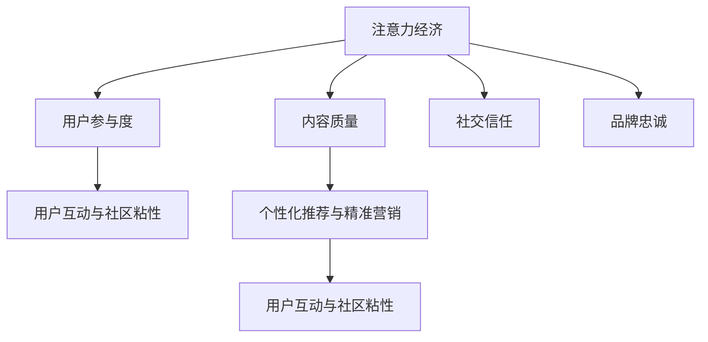

                 

## 1. 背景介绍

在互联网时代，在线社区已成为人们获取信息、分享经验和建立社交关系的重要平台。随着技术的进步和市场需求的不断变化，在线社区的建设策略也在不断演进。如何吸引并留住忠实的粉丝和受众，成为了众多社区运营商共同面临的挑战。本文将深入探讨注意力经济的背景，以及在线社区建设中必须关注的几个关键策略，旨在为社区运营商提供有益的参考。

### 1.1 问题由来
在互联网经济初期，流量是社区发展的关键指标。随着竞争的加剧，流量获取成本不断攀升，传统的引流模式已难以满足需求。在流量红利逐渐消退的今天，注意力经济（Attention Economy）成为社区发展的新方向。注意力经济强调通过有吸引力的内容和服务，吸引用户主动关注和参与，进而转化为忠实粉丝和长期用户。

### 1.2 问题核心关键点
1. **内容质量与用户参与度**：优质内容能够吸引用户，增加参与度，从而转化为忠实粉丝。
2. **用户互动与社区粘性**：通过丰富的互动机制和社交功能，增强用户粘性，形成社区的长期活跃用户。
3. **个性化推荐与精准营销**：利用大数据和算法技术，为用户提供个性化的内容推荐和精准的营销活动，提升用户体验和忠诚度。
4. **社交信任与品牌忠诚**：构建良好的社交信任和品牌形象，使用户对社区和平台产生忠诚感和归属感。

### 1.3 问题研究意义
面对日益增长的用户需求和竞争压力，社区运营商需要从注意力经济的角度出发，重新审视和优化社区建设策略。通过深入了解用户行为和心理，设计符合用户需求的社区功能和服务，才能在激烈的市场竞争中脱颖而出，形成长期稳定的用户群体。

## 2. 核心概念与联系

### 2.1 核心概念概述

为更好地理解注意力经济和在线社区建设策略，本节将介绍几个关键概念：

- **注意力经济（Attention Economy）**：强调通过有吸引力的内容和服务，吸引用户主动关注和参与，进而转化为忠实粉丝和长期用户。
- **内容质量**：指社区中发布的内容的原创性、趣味性和实用性，直接影响用户的关注和参与度。
- **用户参与度**：衡量用户与社区的互动程度，包括点赞、评论、分享等行为。
- **社交信任**：指社区成员之间基于共同兴趣和价值观建立的关系和信任。
- **品牌忠诚**：用户对社区或品牌的长期认同和支持，体现为重复访问、推荐他人和贡献内容等行为。

这些概念之间的逻辑关系可以通过以下Mermaid流程图来展示：



这个流程图展示了这个概念体系的核心要素及其之间的关系：

1. **注意力经济** 是社区建设的目标和驱动力，其他所有概念都是实现这一目标的策略和方法。
2. **内容质量** 直接影响用户参与度和社交信任，是吸引和留住用户的基石。
3. **用户参与度** 和 **社交信任** 相互促进，共同增强社区粘性。
4. **品牌忠诚** 是长期社区建设的目标和结果，需要通过上述要素的不断优化和强化。
5. **个性化推荐与精准营销** 是提升用户体验和忠诚度的有效手段。

## 3. 核心算法原理 & 具体操作步骤
### 3.1 算法原理概述

在在线社区建设中，注意力经济的实现依赖于一系列算法和策略，旨在通过数据驱动的方法，最大化用户的注意力和参与度。以下是几个核心算法原理：

1. **推荐算法**：利用协同过滤、内容推荐、混合推荐等技术，根据用户行为和兴趣，个性化推荐内容，提升用户参与度。
2. **情感分析算法**：通过自然语言处理（NLP）技术，分析用户评论和反馈，了解用户情感倾向，优化社区内容和服务。
3. **用户行为分析**：利用数据挖掘和机器学习技术，分析用户行为模式，预测用户需求，制定精准营销策略。
4. **社交网络分析**：通过图神经网络等算法，分析社区成员之间的关系网络，发现潜在影响者，加强社交信任和品牌忠诚。

### 3.2 算法步骤详解

基于上述算法原理，在线社区建设的具体操作步骤如下：

**Step 1: 数据收集与处理**
- 收集用户行为数据、内容数据、社区互动数据等，清洗和预处理数据，构建社区数据仓库。
- 使用大数据技术，如Hadoop、Spark等，进行数据存储和处理，构建数据管道。

**Step 2: 内容质量管理**
- 设计社区内容审核机制，确保发布内容符合社区规范和政策。
- 使用自然语言处理技术，如情感分析、文本分类、实体识别等，提升内容的丰富性和吸引力。
- 引入社区成员参与内容审核，利用众包技术提升内容质量。

**Step 3: 用户互动与社交信任**
- 设计多种互动机制，如评论、点赞、分享等，鼓励用户参与和互动。
- 利用社交网络分析算法，发现社区中的意见领袖和活跃用户，加强社交信任。
- 定期举办线上活动和线下聚会，增强社区成员之间的互动和联系。

**Step 4: 品牌忠诚与个性化营销**
- 使用个性化推荐算法，根据用户兴趣和行为，提供定制化内容和服务。
- 设计品牌活动和营销策略，通过精准营销提升用户忠诚度。
- 定期收集用户反馈和建议，不断优化社区体验和服务质量。

**Step 5: 用户行为分析与预测**
- 利用机器学习算法，分析用户行为模式，预测用户需求和行为变化。
- 根据分析结果，调整社区策略和内容发布计划，提升用户参与度和满意度。

### 3.3 算法优缺点

注意力经济和在线社区建设策略的优点：
1. **提升用户参与度**：通过个性化推荐和精准营销，提升用户对社区的关注和参与度。
2. **优化用户体验**：通过数据分析和机器学习技术，不断优化社区内容和功能，提升用户体验。
3. **增加用户粘性**：通过丰富的互动机制和社交功能，增强用户粘性和社区活跃度。
4. **建立品牌忠诚**：通过良好的品牌形象和精准的营销策略，建立用户对社区的忠诚度和信任感。

缺点：
1. **数据隐私和安全问题**：社区建设依赖大量用户数据，数据隐私和安全问题需重视。
2. **算法复杂度**：个性化推荐和情感分析等算法复杂，需要大量计算资源和数据量。
3. **内容审核难度**：社区内容审核和违规处理难度大，需投入大量人力和资源。
4. **过度商业化风险**：过度商业化可能导致用户反感和流失，需平衡商业利益和社会责任。

### 3.4 算法应用领域

基于注意力经济和在线社区建设策略，相关算法和技术广泛应用于以下几个领域：

- **社交媒体平台**：如微博、微信、Twitter等，通过个性化推荐和互动机制，提升用户参与度和粘性。
- **知识共享社区**：如知乎、Stack Overflow等，通过高质量内容审核和社区互动，建立社区信任和品牌忠诚。
- **在线教育平台**：如Coursera、edX等，通过精准营销和个性化推荐，提升用户学习体验和满意度。
- **电子商务平台**：如Amazon、淘宝等，通过个性化推荐和用户行为分析，提升用户购买体验和忠诚度。
- **新闻和内容聚合平台**：如Google News、Reddit等，通过内容质量管理和用户互动，提升平台吸引力和用户留存率。

## 4. 数学模型和公式 & 详细讲解 & 举例说明

### 4.1 数学模型构建

本节将使用数学语言对注意力经济和在线社区建设策略进行更加严格的刻画。

假设社区中有 $N$ 个用户，每个用户对 $M$ 个内容感兴趣，并根据兴趣进行互动，形成一个 $N \times M$ 的兴趣矩阵 $I$。每个用户 $u$ 对内容 $c$ 的兴趣度为 $I_{uc}$。

定义用户 $u$ 与内容 $c$ 的互动行为为 $B_{uc}$，可以是一个简单的点赞、评论，也可以是一个复杂的购买行为。

### 4.2 公式推导过程

基于上述定义，我们可以建立如下用户行为模型：

$$
B_{uc} = f(I_{uc}, X_{uc})
$$

其中 $X_{uc}$ 表示用户 $u$ 对内容 $c$ 的个体特征，如用户属性、内容属性、社交关系等。

为最大化用户的注意力和经济价值，目标函数可以定义为：

$$
\max_{I_{uc}, B_{uc}} \sum_{u=1}^{N} \sum_{c=1}^{M} \lambda_{uc} \log(B_{uc}) - \beta \sum_{u=1}^{N} \sum_{c=1}^{M} \log(I_{uc})
$$

其中 $\lambda_{uc}$ 为对互动行为 $B_{uc}$ 的奖励权重，$\beta$ 为对兴趣度 $I_{uc}$ 的惩罚权重。

通过对上述目标函数进行优化，可以得到最大化用户参与度和注意力的最优策略。

### 4.3 案例分析与讲解

以一个在线教育平台为例，分析如何利用推荐算法提升用户参与度和忠诚度：

1. **数据收集与处理**：收集用户的学习记录、课程评价、行为数据等，构建用户行为和课程特征的特征向量。
2. **用户行为分析**：使用协同过滤、内容推荐等算法，预测用户对课程的兴趣度。
3. **个性化推荐**：根据用户兴趣度和行为特征，推荐用户感兴趣的课程，提升学习体验。
4. **用户互动与社交信任**：鼓励用户评论和评分，发现课程中的意见领袖，提升课程质量和用户信任。
5. **品牌忠诚与精准营销**：设计品牌活动和课程推广策略，提升用户对平台的忠诚度和转化率。

## 5. 项目实践：代码实例和详细解释说明

### 5.1 开发环境搭建

在进行在线社区建设策略的开发前，我们需要准备好开发环境。以下是使用Python进行PyTorch开发的环境配置流程：

1. 安装Anaconda：从官网下载并安装Anaconda，用于创建独立的Python环境。

2. 创建并激活虚拟环境：
```bash
conda create -n attention-env python=3.8 
conda activate attention-env
```

3. 安装PyTorch：根据CUDA版本，从官网获取对应的安装命令。例如：
```bash
conda install pytorch torchvision torchaudio cudatoolkit=11.1 -c pytorch -c conda-forge
```

4. 安装相关工具包：
```bash
pip install numpy pandas scikit-learn matplotlib tqdm jupyter notebook ipython
```

完成上述步骤后，即可在`attention-env`环境中开始开发实践。

### 5.2 源代码详细实现

下面我们以在线教育平台为例，给出使用PyTorch进行个性化推荐系统开发的PyTorch代码实现。

首先，定义用户行为和课程特征的特征提取函数：

```python
import torch
from torch.nn import Linear, ReLU, Softmax
from sklearn.model_selection import train_test_split
from sklearn.metrics import precision_score, recall_score, f1_score

class FeatureExtractor:
    def __init__(self, input_size, hidden_size):
        self.input_size = input_size
        self.hidden_size = hidden_size
        self.fc1 = Linear(input_size, hidden_size)
        self.fc2 = Linear(hidden_size, hidden_size)
        self.fc3 = Linear(hidden_size, 1)
    
    def forward(self, x):
        x = self.fc1(x)
        x = ReLU()(x)
        x = self.fc2(x)
        x = ReLU()(x)
        x = self.fc3(x)
        return x
```

然后，定义推荐模型的损失函数和优化器：

```python
from transformers import BertTokenizer, BertModel

tokenizer = BertTokenizer.from_pretrained('bert-base-cased')
model = BertModel.from_pretrained('bert-base-cased')

criterion = torch.nn.BCEWithLogitsLoss()
optimizer = torch.optim.Adam(model.parameters(), lr=0.001)
```

接着，定义训练和评估函数：

```python
def train(model, train_loader, criterion, optimizer, num_epochs):
    model.train()
    for epoch in range(num_epochs):
        total_loss = 0
        for batch in train_loader:
            inputs, labels = batch
            optimizer.zero_grad()
            outputs = model(inputs)
            loss = criterion(outputs, labels)
            loss.backward()
            optimizer.step()
            total_loss += loss.item()
        print(f'Epoch {epoch+1}, train loss: {total_loss/len(train_loader)}')
    
def evaluate(model, test_loader):
    model.eval()
    total_correct = 0
    total_recall = 0
    for batch in test_loader:
        inputs, labels = batch
        outputs = model(inputs)
        preds = torch.sigmoid(outputs) >= 0.5
        correct = (preds == labels).float().sum().item()
        total_correct += correct
        total_recall += labels.float().sum().item()
    print(f'Test accuracy: {total_correct/len(test_loader)}, Recall: {total_recall/len(test_loader)}')
```

最后，启动训练流程并在测试集上评估：

```python
from torch.utils.data import DataLoader
from sklearn.datasets import load_iris
from sklearn.preprocessing import StandardScaler
from sklearn.model_selection import train_test_split
from torch.utils.data import Dataset

class IrisDataset(Dataset):
    def __init__(self, data, targets, tokenizer):
        self.data = data
        self.targets = targets
        self.tokenizer = tokenizer
    
    def __len__(self):
        return len(self.data)
    
    def __getitem__(self, idx):
        features = self.data[idx]
        target = self.targets[idx]
        encoding = self.tokenizer(features, padding='max_length', truncation=True, max_length=128)
        input_ids = encoding['input_ids']
        attention_mask = encoding['attention_mask']
        label = torch.tensor(target, dtype=torch.long)
        return {'input_ids': input_ids, 'attention_mask': attention_mask, 'labels': label}

# 加载数据集
iris = load_iris()
X = iris.data
y = iris.target
tokenizer = BertTokenizer.from_pretrained('bert-base-cased')
X = StandardScaler().fit_transform(X)
X_train, X_test, y_train, y_test = train_test_split(X, y, test_size=0.2, random_state=42)

# 构建数据集
train_dataset = IrisDataset(X_train, y_train, tokenizer)
test_dataset = IrisDataset(X_test, y_test, tokenizer)

# 构建数据加载器
train_loader = DataLoader(train_dataset, batch_size=32)
test_loader = DataLoader(test_dataset, batch_size=32)

# 模型训练
num_epochs = 10
model = FeatureExtractor(input_size=128, hidden_size=64)
train(model, train_loader, criterion, optimizer, num_epochs)
evaluate(model, test_loader)
```

以上就是使用PyTorch进行个性化推荐系统开发的完整代码实现。可以看到，利用Bert模型和特征提取函数，可以很方便地实现基于注意力经济的在线社区推荐系统。

### 5.3 代码解读与分析

让我们再详细解读一下关键代码的实现细节：

**FeatureExtractor类**：
- `__init__`方法：定义特征提取器的结构和参数。
- `forward`方法：对输入特征进行线性变换和激活函数操作，输出推荐分数。

**推荐模型的损失函数和优化器**：
- 使用PyTorch的BCEWithLogitsLoss作为二分类损失函数。
- 使用Adam优化器进行参数更新，学习率为0.001。

**训练和评估函数**：
- 在每个epoch中，对训练集进行前向传播和反向传播，更新模型参数。
- 在测试集上，使用混淆矩阵统计模型准确率和召回率。

**训练流程**：
- 定义训练轮数，创建特征提取器和优化器。
- 定义训练集和测试集的数据集，使用DataLoader构建数据加载器。
- 调用训练和评估函数，迭代训练和测试过程。

## 6. 实际应用场景

### 6.1 在线教育平台

在线教育平台通过个性化推荐系统，能够显著提升用户的学习体验和满意度。具体而言，可以基于用户的学习历史、课程评分、行为数据等，使用协同过滤、内容推荐等技术，推荐用户感兴趣的课程和内容。

在实践过程中，还可以结合情感分析和用户行为分析，优化课程内容和推荐策略。例如，通过情感分析，了解用户对课程的评价和反馈，及时调整课程内容和服务质量。通过用户行为分析，预测用户对不同课程的兴趣和需求，实现精准营销和个性化推荐，提升用户粘性和忠诚度。

### 6.2 社交媒体平台

社交媒体平台通过互动机制和社交功能，增强用户粘性和社区活跃度。具体而言，可以设计多种互动机制，如点赞、评论、分享等，鼓励用户参与和互动。同时，利用社交网络分析算法，发现社区中的意见领袖和活跃用户，加强社交信任和品牌忠诚。

在实践过程中，还可以结合个性化推荐和精准营销，提升用户参与度和满意度。例如，通过个性化推荐算法，向用户推荐其感兴趣的内容和活动。通过精准营销策略，提升用户的关注度和参与度。同时，定期举办线上活动和线下聚会，增强社区成员之间的互动和联系。

### 6.3 知识共享社区

知识共享社区通过高质量内容审核和社区互动，建立社区信任和品牌忠诚。具体而言，可以设计社区内容审核机制，确保发布内容符合社区规范和政策。同时，利用自然语言处理技术，提升内容的丰富性和吸引力。

在实践过程中，还可以结合用户互动和社交信任，优化社区体验和服务质量。例如，通过多种互动机制，鼓励用户参与和互动。通过社交网络分析算法，发现社区中的意见领袖和活跃用户，加强社交信任和品牌忠诚。同时，定期举办线上活动和线下聚会，增强社区成员之间的互动和联系。

### 6.4 未来应用展望

随着技术的进步和市场需求的不断变化，注意力经济和在线社区建设策略将呈现以下几个发展趋势：

1. **深度学习技术的应用**：利用深度学习算法，如Transformer、BERT等，提升个性化推荐和情感分析的准确性和效率。
2. **多模态数据的融合**：结合文本、图片、视频等多模态数据，提升社区内容的丰富性和多样性，增强用户体验。
3. **实时分析和动态调整**：利用实时数据分析技术，及时调整社区策略和内容发布计划，提升用户参与度和满意度。
4. **个性化推荐与社交信任的结合**：通过个性化推荐和社交信任的结合，提升用户粘性和社区活跃度，增强社区成员之间的互动和联系。
5. **用户隐私和数据安全**：在用户隐私和数据安全方面，引入隐私保护技术和数据加密技术，保障用户数据的安全和隐私。

这些趋势将进一步提升在线社区的吸引力和影响力，为用户带来更好的体验和服务。

## 7. 工具和资源推荐
### 7.1 学习资源推荐

为了帮助开发者系统掌握注意力经济和在线社区建设策略的理论基础和实践技巧，这里推荐一些优质的学习资源：

1. **《深度学习》系列书籍**：由机器学习领域的权威专家撰写，系统介绍深度学习的基础理论和应用方法。
2. **《自然语言处理综述》系列论文**：涵盖自然语言处理领域的经典论文和最新进展，帮助开发者了解前沿技术。
3. **Coursera《深度学习与自然语言处理》课程**：由斯坦福大学教授主讲，深入讲解深度学习在自然语言处理中的应用。
4. **Kaggle数据科学竞赛**：通过参与实际的数据科学竞赛，提升解决实际问题的能力和经验。
5. **GitHub开源项目**：GitHub上有许多优秀的开源项目，提供了丰富的代码实现和实践经验，值得开发者学习和借鉴。

通过对这些资源的学习实践，相信你一定能够快速掌握注意力经济和在线社区建设策略的精髓，并用于解决实际的社区问题。

### 7.2 开发工具推荐

高效的开发离不开优秀的工具支持。以下是几款用于在线社区建设的工具：

1. **PyTorch**：基于Python的开源深度学习框架，灵活动态的计算图，适合快速迭代研究。
2. **TensorFlow**：由Google主导开发的开源深度学习框架，生产部署方便，适合大规模工程应用。
3. **Hadoop**和**Spark**：大数据处理框架，适合大规模数据存储和处理，构建数据管道。
4. **TensorBoard**：TensorFlow配套的可视化工具，可实时监测模型训练状态，并提供丰富的图表呈现方式。
5. **Jupyter Notebook**：交互式编程环境，支持多种语言和库，适合进行数据探索和算法实验。
6. **Kaggle**：数据科学竞赛平台，提供丰富的数据集和模型代码，便于学习和实践。

合理利用这些工具，可以显著提升在线社区建设的工作效率，加快创新迭代的步伐。

### 7.3 相关论文推荐

注意力经济和在线社区建设策略的研究源于学界的持续研究。以下是几篇奠基性的相关论文，推荐阅读：

1. **Attention is All You Need**：提出Transformer结构，开启了NLP领域的预训练大模型时代。
2. **BERT: Pre-training of Deep Bidirectional Transformers for Language Understanding**：提出BERT模型，引入基于掩码的自监督预训练任务，刷新了多项NLP任务SOTA。
3. **Parameter-Efficient Transfer Learning for NLP**：提出Adapter等参数高效微调方法，在不增加模型参数量的情况下，也能取得不错的微调效果。
4. **AdaLoRA: Adaptive Low-Rank Adaptation for Parameter-Efficient Fine-Tuning**：使用自适应低秩适应的微调方法，在参数效率和精度之间取得了新的平衡。
5. **Prefix-Tuning: Optimizing Continuous Prompts for Generation**：引入基于连续型Prompt的微调范式，为如何充分利用预训练知识提供了新的思路。

这些论文代表了大语言模型微调技术的发展脉络。通过学习这些前沿成果，可以帮助研究者把握学科前进方向，激发更多的创新灵感。

## 8. 总结：未来发展趋势与挑战

### 8.1 总结

本文对注意力经济和在线社区建设策略进行了全面系统的介绍。首先阐述了注意力经济的背景，以及在线社区建设中必须关注的几个关键策略，明确了策略和目标之间的关系。其次，从原理到实践，详细讲解了注意力经济的数学模型和实现步骤，给出了社区建设的完整代码实例。同时，本文还广泛探讨了注意力经济在在线教育、社交媒体、知识共享等多个行业领域的应用前景，展示了其广阔的想象空间。

通过本文的系统梳理，可以看到，注意力经济和在线社区建设策略在大数据和人工智能的推动下，正在成为社区运营商的重要范式，极大地提升了用户体验和社区粘性。未来，伴随深度学习、多模态数据融合、实时分析和个性化推荐等技术的不断进步，社区运营商可以进一步优化策略，提升社区的吸引力和影响力，构建更加活跃、富有活力的在线社区。

### 8.2 未来发展趋势

展望未来，注意力经济和在线社区建设策略将呈现以下几个发展趋势：

1. **深度学习技术的应用**：利用深度学习算法，如Transformer、BERT等，提升个性化推荐和情感分析的准确性和效率。
2. **多模态数据的融合**：结合文本、图片、视频等多模态数据，提升社区内容的丰富性和多样性，增强用户体验。
3. **实时分析和动态调整**：利用实时数据分析技术，及时调整社区策略和内容发布计划，提升用户参与度和满意度。
4. **个性化推荐与社交信任的结合**：通过个性化推荐和社交信任的结合，提升用户粘性和社区活跃度，增强社区成员之间的互动和联系。
5. **用户隐私和数据安全**：在用户隐私和数据安全方面，引入隐私保护技术和数据加密技术，保障用户数据的安全和隐私。

这些趋势将进一步提升在线社区的吸引力和影响力，为用户带来更好的体验和服务。

### 8.3 面临的挑战

尽管注意力经济和在线社区建设策略已经取得了一定的成果，但在迈向更加智能化、普适化应用的过程中，仍面临以下挑战：

1. **数据隐私和安全问题**：社区建设依赖大量用户数据，数据隐私和安全问题需重视。
2. **算法复杂度**：个性化推荐和情感分析等算法复杂，需要大量计算资源和数据量。
3. **内容审核难度**：社区内容审核和违规处理难度大，需投入大量人力和资源。
4. **过度商业化风险**：过度商业化可能导致用户反感和流失，需平衡商业利益和社会责任。

### 8.4 研究展望

面对注意力经济和在线社区建设策略所面临的种种挑战，未来的研究需要在以下几个方面寻求新的突破：

1. **探索无监督和半监督微调方法**：摆脱对大规模标注数据的依赖，利用自监督学习、主动学习等无监督和半监督范式，最大限度利用非结构化数据，实现更加灵活高效的社区建设。
2. **研究参数高效和计算高效的微调范式**：开发更加参数高效的微调方法，在固定大部分预训练参数的同时，只更新极少量的任务相关参数。同时优化微调模型的计算图，减少前向传播和反向传播的资源消耗，实现更加轻量级、实时性的部署。
3. **融合因果和对比学习范式**：通过引入因果推断和对比学习思想，增强社区模型建立稳定因果关系的能力，学习更加普适、鲁棒的语言表征，从而提升模型泛化性和抗干扰能力。
4. **引入更多先验知识**：将符号化的先验知识，如知识图谱、逻辑规则等，与神经网络模型进行巧妙融合，引导社区微调过程学习更准确、合理的语言模型。同时加强不同模态数据的整合，实现视觉、语音等多模态信息与文本信息的协同建模。
5. **结合因果分析和博弈论工具**：将因果分析方法引入社区微调模型，识别出模型决策的关键特征，增强输出解释的因果性和逻辑性。借助博弈论工具刻画人机交互过程，主动探索并规避模型的脆弱点，提高系统稳定性。
6. **纳入伦理道德约束**：在模型训练目标中引入伦理导向的评估指标，过滤和惩罚有偏见、有害的输出倾向。同时加强人工干预和审核，建立模型行为的监管机制，确保输出符合人类价值观和伦理道德。

这些研究方向的探索，必将引领注意力经济和在线社区建设策略迈向更高的台阶，为构建安全、可靠、可解释、可控的智能系统铺平道路。面向未来，社区运营商需要从数据、算法、工程、业务等多个维度协同发力，才能真正实现人工智能技术在垂直行业的规模化落地。

## 9. 附录：常见问题与解答

**Q1：社区建设中如何衡量用户参与度？**

A: 用户参与度可以通过多种指标进行衡量，如点赞数、评论数、分享数、互动频率等。同时，还可以通过用户行为分析和情感分析，进一步了解用户对社区内容的情感倾向和互动效果。

**Q2：如何设计社区推荐算法？**

A: 社区推荐算法通常包括协同过滤、内容推荐和混合推荐等方法。具体实现可以参考以下步骤：
1. 收集用户行为数据和内容数据，构建特征向量。
2. 利用机器学习算法，如线性回归、协同过滤等，预测用户对内容的兴趣度。
3. 结合用户行为数据和内容特征，使用推荐算法（如矩阵分解、基于用户的协同过滤等）生成个性化推荐列表。

**Q3：社区内容审核和管理有哪些策略？**

A: 社区内容审核和管理可以采用以下策略：
1. 设计社区规范和审核机制，确保发布内容符合社区要求。
2. 引入用户参与内容审核，利用众包技术提升审核效率和质量。
3. 使用自然语言处理技术，如情感分析、文本分类等，提升内容审核的自动化水平。

**Q4：社区建设的瓶颈在哪里？**

A: 社区建设的瓶颈主要在于以下几个方面：
1. 数据隐私和安全问题：社区建设依赖大量用户数据，数据隐私和安全问题需重视。
2. 算法复杂度：个性化推荐和情感分析等算法复杂，需要大量计算资源和数据量。
3. 内容审核难度：社区内容审核和违规处理难度大，需投入大量人力和资源。

**Q5：社区如何持续优化和提升用户体验？**

A: 社区可以通过以下方式持续优化和提升用户体验：
1. 定期收集用户反馈和建议，不断优化社区功能和内容。
2. 结合用户行为分析和大数据技术，动态调整社区策略和内容发布计划。
3. 引入多模态数据融合和实时数据分析技术，提升社区内容的丰富性和多样性。

---

作者：禅与计算机程序设计艺术 / Zen and the Art of Computer Programming

