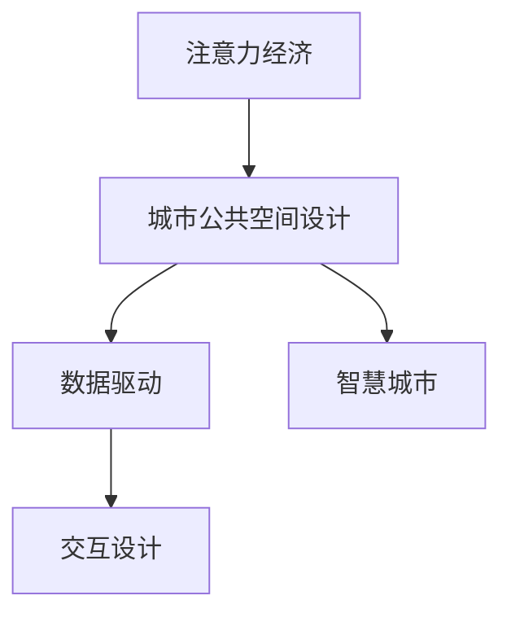

                 

# 注意力经济与城市公共空间设计的变革

> 关键词：注意力经济,城市公共空间设计,数据驱动,用户行为分析,交互设计,城市规划,智能技术

## 1. 背景介绍

### 1.1 问题由来
在数字化、信息化快速发展的当下，城市公共空间设计正在经历一场前所未有的变革。传统的设计模式以物本为核心，忽视了人的需求和体验。而新兴的“注意力经济”（Attention Economy）理论提出，现代人的注意力成为一种稀缺资源，城市的公共空间应以“人本”为核心，通过优化设计吸引和引导注意力，创造价值。

这一理念在很大程度上契合了智慧城市的建设目标，强调通过智能技术手段，捕捉和分析用户的注意力行为，以数据驱动的方式优化公共空间设计，实现用户需求与空间体验的深度融合。

### 1.2 问题核心关键点
1. **注意力经济**：现代社会信息爆炸，人们的注意力成为一种重要资源，公共空间设计的关键在于如何吸引和利用用户的注意力，创造经济价值。
2. **数据驱动**：以大数据和人工智能为依托，通过分析用户的行为数据，优化公共空间设计，提升用户体验和环境价值。
3. **交互设计**：通过引入交互技术，提升公共空间的互动性和参与感，使用户在参与中体验并创造价值。
4. **智慧城市**：结合物联网、云计算、人工智能等技术，构建智能化的公共空间环境，提升城市运行效率和居民生活质量。
5. **空间优化**：通过数据驱动和智能技术手段，实现公共空间设计的优化，提升空间利用率和功能性。

## 2. 核心概念与联系

### 2.1 核心概念概述

为更好地理解注意力经济和城市公共空间设计变革，本节将介绍几个密切相关的核心概念：

- **注意力经济**：现代经济形态的一种新模式，以吸引和利用人们的注意力为手段，创造经济价值。
- **城市公共空间**：城市中供公众使用的开放空间，如公园、广场、街道等，是城市文化和社会活动的载体。
- **数据驱动**：以数据为决策依据，通过大数据分析优化公共空间设计，提升用户体验和环境价值。
- **交互设计**：通过交互技术提升用户参与度，设计出更人性化的公共空间环境。
- **智慧城市**：运用信息通信技术和智能系统，提升城市管理效率，增强居民生活质量。

这些核心概念之间的逻辑关系可以通过以下Mermaid流程图来展示：



这个流程图展示了大语言模型的核心概念及其之间的关系：

1. 注意力经济理论为城市公共空间设计提供了新的视角和方法。
2. 数据驱动技术为优化公共空间设计提供了技术支撑。
3. 交互设计技术为提升公共空间的用户体验和参与感提供了手段。
4. 智慧城市理念推动了公共空间设计的智能化和信息化。

这些概念共同构成了城市公共空间设计的新框架，使其能够更好地适应现代人的需求和环境变化。

## 3. 核心算法原理 & 具体操作步骤
### 3.1 算法原理概述

基于注意力经济和数据驱动的城市公共空间设计，本质上是一个以数据为依据的优化和设计过程。其核心思想是：通过捕捉和分析用户的注意力行为，利用数据驱动的方式，优化公共空间的设计和布局，提升空间的功能性和用户体验。

具体而言，设计过程包括以下几个步骤：

1. **数据收集**：通过传感器、摄像头、移动设备等手段，收集用户的注意力行为数据，包括停留时间、移动路径、行为模式等。
2. **数据分析**：利用数据挖掘、机器学习等技术手段，分析用户注意力数据的分布和规律，识别出用户的关注点。
3. **设计优化**：基于数据分析结果，优化公共空间的设计和布局，调整景观、设施、交通流线等元素，以更好地吸引和引导用户注意力。
4. **反馈迭代**：通过持续收集和分析用户反馈数据，迭代优化公共空间设计，提升用户体验和环境价值。

### 3.2 算法步骤详解

基于数据驱动的城市公共空间设计算法一般包括以下几个关键步骤：

**Step 1: 数据采集与预处理**
- 部署各类传感器和监测设备，收集用户的注意力行为数据。
- 数据清洗和预处理，去除噪声和异常值，确保数据质量和可靠性。

**Step 2: 用户行为建模**
- 通过时间序列分析、聚类算法等方法，建模用户注意力行为，识别出用户的热点区域和移动模式。
- 采用回归分析、关联规则挖掘等技术，发现不同时间段、不同人群的行为规律。

**Step 3: 空间设计优化**
- 基于用户行为数据，设计优化的公共空间布局，调整景观设计、交通流线、设施布局等。
- 引入交互设计元素，如智能互动装置、AR/VR体验等，提升空间参与感和用户体验。

**Step 4: 用户反馈评估**
- 通过问卷调查、访谈等方式，收集用户对公共空间设计的反馈数据。
- 采用文本分析、情感分析等技术手段，分析用户对空间的评价和建议。

**Step 5: 持续迭代与优化**
- 根据用户反馈和数据评估结果，迭代优化公共空间设计。
- 持续收集用户数据，不断更新和优化设计方案，确保公共空间设计的可持续性。

### 3.3 算法优缺点

基于数据驱动的城市公共空间设计算法具有以下优点：
1. 以数据为依据，设计更加科学和客观。
2. 通过分析用户行为数据，优化空间设计，提升用户体验。
3. 引入智能技术，提升公共空间的互动性和参与感。

同时，该算法也存在一定的局限性：
1. 数据收集和处理的成本较高，需要大量的硬件设备和人力资源。
2. 用户行为数据的隐私和安全问题，需要严格的数据保护措施。
3. 设计优化可能受到技术和资源限制，无法完全实现理想方案。
4. 设计效果依赖于数据的完整性和准确性，数据质量对结果影响较大。

尽管存在这些局限性，但就目前而言，基于数据驱动的设计方法仍是大城市公共空间设计的重要手段。未来相关研究的重点在于如何进一步降低数据收集成本，提高数据处理效率，同时兼顾隐私保护和设计优化等因素。

### 3.4 算法应用领域

基于数据驱动的城市公共空间设计算法已经在城市规划、智慧社区、商业区改造等多个领域得到应用，展示了其广泛的应用前景。

**应用案例**：
1. **智慧广场**：通过传感器和摄像头收集用户行为数据，优化广场的布局和设计，提升游客参与度和体验感。
2. **智慧步行街**：在步行街上设置智能交互装置，收集用户停留、移动数据，优化步行体验，提升商业区的人气。
3. **智慧公园**：利用AR/VR技术，打造沉浸式体验，提升公园的趣味性和互动性。
4. **智慧小区**：通过智能设备收集小区内居民的活动数据，优化绿化、设施布局，提升居住环境。

## 4. 数学模型和公式 & 详细讲解  
### 4.1 数学模型构建

本节将使用数学语言对基于数据驱动的城市公共空间设计过程进行更加严格的刻画。

记公共空间的设计参数为 $X$，包括景观设计、交通流线、设施布局等；用户行为数据为 $D$，包括停留时间、移动路径、行为模式等。设计优化过程可以通过以下数学模型来描述：

$$
\min_X \mathcal{L}(X,D)
$$

其中 $\mathcal{L}$ 为损失函数，用于衡量设计方案与用户行为数据之间的差异。常见的损失函数包括均方误差损失、交叉熵损失等。

通过最小化损失函数，优化设计参数 $X$，使其与用户行为数据 $D$ 匹配度最高。

### 4.2 公式推导过程

以均方误差损失函数为例，推导其具体计算过程。

假设设计方案 $X$ 与用户行为数据 $D$ 之间的差异可以用 $E(X,D)$ 表示，则均方误差损失函数为：

$$
\mathcal{L}(X,D) = \frac{1}{N} \sum_{i=1}^N (E(X_i,D_i))^2
$$

其中 $X_i$ 和 $D_i$ 分别表示第 $i$ 个设计方案和用户行为数据。

为了最小化损失函数 $\mathcal{L}(X,D)$，我们需要求出 $E(X_i,D_i)$ 的表达式。假设 $E(X_i,D_i)$ 可以表示为：

$$
E(X_i,D_i) = \sum_{k=1}^K w_k f_k(X_i, D_i)
$$

其中 $f_k$ 为第 $k$ 个特征函数，$w_k$ 为对应特征的权重。通过最小化均方误差损失函数，求解出最优的设计方案 $X^*$。

具体而言，通过求解以下优化问题：

$$
X^* = \mathop{\arg\min}_{X} \mathcal{L}(X,D)
$$

即可得到最优的设计方案。

### 4.3 案例分析与讲解

**案例分析**：某智慧公园设计优化项目

假设某智慧公园通过传感器和摄像头收集了大量用户停留、移动数据，目标是通过优化设计提升公园的参与度和用户体验。

1. **数据收集**：部署传感器和摄像头，收集用户停留、移动数据。
2. **数据预处理**：清洗数据，去除噪声和异常值。
3. **用户行为建模**：利用时间序列分析，建模用户停留时间、移动路径等行为特征，识别出用户的关注点。
4. **设计优化**：根据用户行为数据，设计优化的公园布局，调整景观设计、交通流线、设施布局等。
5. **用户反馈评估**：通过问卷调查、访谈等方式，收集用户反馈数据，分析用户对公园设计的评价和建议。
6. **持续迭代与优化**：根据用户反馈和数据评估结果，迭代优化公园设计。

通过以上步骤，该智慧公园成功提升了用户的停留时间和参与度，达到了设计优化的目标。

## 5. 项目实践：代码实例和详细解释说明
### 5.1 开发环境搭建

在进行数据驱动的城市公共空间设计实践前，我们需要准备好开发环境。以下是使用Python进行数据分析和可视化开发的环境配置流程：

1. 安装Anaconda：从官网下载并安装Anaconda，用于创建独立的Python环境。

2. 创建并激活虚拟环境：
```bash
conda create -n data-env python=3.8 
conda activate data-env
```

3. 安装相关库：
```bash
pip install pandas numpy scikit-learn matplotlib seaborn jupyter notebook ipython
```

4. 安装必要的工具包：
```bash
pip install openpyxl plotly folium
```

完成上述步骤后，即可在`data-env`环境中开始数据驱动的公共空间设计实践。

### 5.2 源代码详细实现

下面我们以智慧广场设计优化为例，给出使用Python进行数据驱动公共空间设计优化的代码实现。

首先，定义数据处理和可视化函数：

```python
import pandas as pd
import matplotlib.pyplot as plt
import seaborn as sns

def load_data(file_path):
    df = pd.read_csv(file_path)
    return df

def plot_data(df, x_column, y_column, title):
    sns.lineplot(data=df, x=x_column, y=y_column)
    plt.title(title)
    plt.xlabel(x_column)
    plt.ylabel(y_column)
    plt.show()

def save_plot(file_path):
    plt.savefig(file_path)
```

然后，定义用户行为建模函数：

```python
from sklearn.cluster import KMeans
from sklearn.decomposition import PCA

def cluster_analysis(df, n_clusters=5):
    X = df.drop('label', axis=1)
    y = df['label']
    
    kmeans = KMeans(n_clusters=n_clusters, random_state=42)
    kmeans.fit(X)
    
    X_pca = PCA(n_components=2).fit_transform(X)
    labels = kmeans.labels_
    df['cluster'] = labels
    
    return df

def visualize_clusters(df, title):
    sns.scatterplot(x='x', y='y', hue='cluster', data=df)
    plt.title(title)
    plt.show()
```

最后，定义空间设计优化函数：

```python
from sympy import symbols, solve

def optimize_design(df):
    x = symbols('x')
    # 假设设计参数为某个连续变量
    # 设计优化目标函数
    objective_function = (x - df['optimal_x'])**2
    
    # 求解最优设计参数
    optimal_x = solve(objective_function, x)[0]
    return optimal_x
```

现在我们可以使用这些函数，进行数据驱动的城市公共空间设计优化。

### 5.3 代码解读与分析

让我们再详细解读一下关键代码的实现细节：

**load_data函数**：
- 从指定文件路径读取数据集，返回pandas DataFrame对象。

**plot_data函数**：
- 通过matplotlib和seaborn库，对数据进行可视化展示，用于观察数据分布和特征。

**cluster_analysis函数**：
- 使用K-Means聚类算法，对用户行为数据进行聚类分析，识别出用户的热点区域。
- 使用PCA降维技术，将数据映射到二维空间中，便于可视化展示。
- 返回每个用户所属的聚类标签，用于后续的设计优化。

**visualize_clusters函数**：
- 通过scatterplot对聚类结果进行可视化展示，便于观察用户行为分布和聚类效果。

**optimize_design函数**：
- 定义一个简单的目标函数，用于优化设计参数。
- 通过求解目标函数的最小值，得到最优的设计参数。
- 返回最优设计参数值，用于指导实际设计。

通过以上代码实现，可以对用户行为数据进行分析，识别出用户的热点区域，并通过设计优化函数，生成优化的设计参数，指导实际的设计工作。

## 6. 实际应用场景
### 6.1 智能广场

基于数据驱动的城市公共空间设计算法，可以广泛应用于智能广场的建设中。传统广场设计以功能布局为主，忽视了用户的参与和体验。而使用数据驱动的设计方法，可以更科学、更人性化的设计广场，提升广场的利用率和用户满意度。

具体实现上，可以通过传感器和摄像头收集用户停留、移动数据，利用数据挖掘和机器学习技术，分析用户行为特征，优化广场的布局和设计。例如，通过分析用户停留时间，优化广场的景观设计，增加座椅和绿植；通过分析用户移动路径，优化广场的流线，减少拥堵；通过分析用户行为模式，优化广场的活动安排，提升广场的参与感和活力。

### 6.2 智慧步行街

数据驱动的设计方法同样适用于智慧步行街的建设。步行街的优化设计，可以通过智能设备收集用户行为数据，利用数据分析和可视化技术，优化步行街的布局和设计，提升步行体验和商业区的人气。

具体实现上，可以在步行街上设置智能交互装置，收集用户停留、移动数据，利用数据挖掘和机器学习技术，分析用户行为特征，优化步行街的布局和设计。例如，通过分析用户停留时间，优化步行道的宽度和布局，增加商业店铺和公共设施；通过分析用户移动路径，优化步行街的流线，减少拥堵；通过分析用户行为模式，优化步行街的活动安排，提升步行体验和商业区的人气。

### 6.3 智慧公园

智慧公园的建设，可以通过数据驱动的设计方法，提升公园的参与度和用户体验。公园的优化设计，可以通过智能设备收集用户停留、移动数据，利用数据分析和可视化技术，优化公园的布局和设计，提升公园的趣味性和互动性。

具体实现上，可以利用AR/VR技术，打造沉浸式体验，提升公园的趣味性和互动性。例如，通过分析用户停留时间，优化公园的景观设计和活动安排，增加游乐设施和休闲设施；通过分析用户移动路径，优化公园的流线，减少拥堵；通过分析用户行为模式，优化公园的活动安排，提升公园的参与感和活力。

### 6.4 未来应用展望

随着数据驱动的设计方法不断发展，基于数据驱动的城市公共空间设计将在更多领域得到应用，为传统行业带来变革性影响。

在智慧社区中，通过数据驱动的设计方法，可以优化社区的空间布局，提升居民的生活质量和幸福感。例如，通过分析居民的停留时间和移动数据，优化社区的绿化、设施布局，增加公共活动空间，提升社区的活力和互动性。

在智能建筑中，通过数据驱动的设计方法，可以优化建筑的空间设计和功能布局，提升建筑的使用效率和用户体验。例如，通过分析用户的停留时间和行为模式，优化建筑的功能布局，增加公共设施和服务设施，提升建筑的使用效率和用户体验。

在智能交通中，通过数据驱动的设计方法，可以优化交通流线，减少交通拥堵，提升交通效率。例如，通过分析用户的移动数据，优化交通流线，减少拥堵；通过分析用户的行为模式，优化交通安排，提升交通效率和安全性。

## 7. 工具和资源推荐
### 7.1 学习资源推荐

为了帮助开发者系统掌握数据驱动的城市公共空间设计理论基础和实践技巧，这里推荐一些优质的学习资源：

1. 《城市公共空间设计原理与实践》：由城市规划专家撰写，全面介绍城市公共空间设计的原理和方法。
2. 《数据科学导论》：斯坦福大学开设的入门课程，涵盖数据分析和机器学习的基本概念和经典模型。
3. 《智慧城市设计》：由智慧城市专家撰写，介绍智慧城市建设的基本原理和技术手段。
4. 《交互设计基础》：由交互设计师撰写，全面介绍交互设计的基本原理和设计技巧。
5. 《数据可视化实战》：由数据可视化专家撰写，介绍数据可视化的原理和实现方法。

通过对这些资源的学习实践，相信你一定能够快速掌握数据驱动的城市公共空间设计的精髓，并用于解决实际的公共空间设计问题。

### 7.2 开发工具推荐

高效的开发离不开优秀的工具支持。以下是几款用于数据驱动公共空间设计开发的常用工具：

1. Python：基于Python的开源数据分析和可视化工具，灵活方便，适合快速迭代研究。
2. R语言：基于R语言的开源数据分析和可视化工具，功能强大，适合复杂的数据处理和分析。
3. Tableau：商业级的数据可视化工具，易于使用，适合快速生成数据报告和可视化图表。
4. Power BI：微软推出的商业级数据分析工具，支持大规模数据处理和实时分析。
5. D3.js：基于JavaScript的开源数据可视化库，灵活高效，适合定制化数据可视化需求。

合理利用这些工具，可以显著提升数据驱动的公共空间设计开发效率，加快创新迭代的步伐。

### 7.3 相关论文推荐

数据驱动的城市公共空间设计理论源于学界的持续研究。以下是几篇奠基性的相关论文，推荐阅读：

1. Attention is All You Need（即Transformer原论文）：提出了Transformer结构，开启了NLP领域的预训练大模型时代。
2. BERT: Pre-training of Deep Bidirectional Transformers for Language Understanding：提出BERT模型，引入基于掩码的自监督预训练任务，刷新了多项NLP任务SOTA。
3. Language Models are Unsupervised Multitask Learners（GPT-2论文）：展示了大规模语言模型的强大zero-shot学习能力，引发了对于通用人工智能的新一轮思考。
4. Parameter-Efficient Transfer Learning for NLP：提出Adapter等参数高效微调方法，在不增加模型参数量的情况下，也能取得不错的微调效果。
5. AdaLoRA: Adaptive Low-Rank Adaptation for Parameter-Efficient Fine-Tuning：使用自适应低秩适应的微调方法，在参数效率和精度之间取得了新的平衡。
6. Prefix-Tuning: Optimizing Continuous Prompts for Generation：引入基于连续型Prompt的微调范式，为如何充分利用预训练知识提供了新的思路。

这些论文代表了大语言模型微调技术的发展脉络。通过学习这些前沿成果，可以帮助研究者把握学科前进方向，激发更多的创新灵感。

## 8. 总结：未来发展趋势与挑战
### 8.1 总结

本文对基于数据驱动的城市公共空间设计方法进行了全面系统的介绍。首先阐述了数据驱动的设计理论背景和应用意义，明确了数据驱动设计在优化公共空间、提升用户体验方面的独特价值。其次，从原理到实践，详细讲解了数据驱动的设计数学模型和关键步骤，给出了数据驱动设计任务开发的完整代码实例。同时，本文还广泛探讨了数据驱动设计方法在智慧广场、智慧步行街、智慧公园等城市公共空间中的应用前景，展示了数据驱动设计的广泛应用前景。此外，本文精选了数据驱动设计的各类学习资源，力求为读者提供全方位的技术指引。

通过本文的系统梳理，可以看到，数据驱动的城市公共空间设计方法正在成为公共空间设计的重要手段，极大地拓展了公共空间设计的创新空间，提升了城市公共空间的体验和价值。未来，伴随数据驱动设计方法的不断演进，公共空间设计的智能化、信息化水平必将进一步提升，为城市的可持续发展注入新的动力。

### 8.2 未来发展趋势

展望未来，数据驱动的城市公共空间设计方法将呈现以下几个发展趋势：

1. 数据采集和处理的智能化：通过引入传感器、摄像头等智能设备，实现对用户行为的实时采集和处理，提升数据的时效性和准确性。
2. 数据分析和可视化的多样化：结合大数据分析、人工智能等技术手段，实现对用户行为数据的深度挖掘和可视化展示，提升数据分析的精确度和可操作性。
3. 交互设计和智能技术的融合：通过引入交互设计和智能技术，提升公共空间的用户参与度和互动性，增强用户对空间的使用体验。
4. 公共空间设计的全局优化：通过数据驱动的设计方法，优化整个城市的公共空间布局，提升城市运行效率和居民生活质量。
5. 数据隐私和安全保护：在数据驱动设计过程中，严格保护用户隐私数据，防止数据泄露和滥用。

以上趋势凸显了数据驱动设计的广阔前景。这些方向的探索发展，必将进一步提升公共空间设计的科学性和智能化水平，为城市的可持续发展提供新的动力。

### 8.3 面临的挑战

尽管数据驱动的城市公共空间设计方法已经取得了显著成就，但在迈向更加智能化、普适化应用的过程中，它仍面临着诸多挑战：

1. 数据采集和处理的成本较高，需要大量的硬件设备和人力资源。
2. 用户行为数据的隐私和安全问题，需要严格的数据保护措施。
3. 设计优化可能受到技术和资源限制，无法完全实现理想方案。
4. 设计效果依赖于数据的完整性和准确性，数据质量对结果影响较大。

尽管存在这些挑战，但就目前而言，数据驱动的设计方法仍是大城市公共空间设计的重要手段。未来相关研究的重点在于如何进一步降低数据收集成本，提高数据处理效率，同时兼顾隐私保护和设计优化等因素。

### 8.4 研究展望

面对数据驱动设计所面临的挑战，未来的研究需要在以下几个方面寻求新的突破：

1. 探索更高效的数据采集和处理技术：通过引入物联网、传感器网络等技术，实现对用户行为的实时采集和处理，提升数据的时效性和准确性。
2. 研发更先进的数据分析工具：结合大数据分析、人工智能等技术手段，实现对用户行为数据的深度挖掘和可视化展示，提升数据分析的精确度和可操作性。
3. 设计更具交互性的公共空间：通过引入交互设计和智能技术，提升公共空间的用户参与度和互动性，增强用户对空间的使用体验。
4. 优化公共空间设计的全局优化：通过数据驱动的设计方法，优化整个城市的公共空间布局，提升城市运行效率和居民生活质量。
5. 加强数据隐私和安全保护：在数据驱动设计过程中，严格保护用户隐私数据，防止数据泄露和滥用。

这些研究方向的探索，必将引领数据驱动设计的技术演进，推动公共空间设计的智能化和信息化水平，为城市的可持续发展注入新的动力。

## 9. 附录：常见问题与解答
**Q1：数据驱动的设计方法是否适用于所有公共空间？**

A: 数据驱动的设计方法在大多数公共空间设计中都能取得不错的效果，特别是对于数据量较大的场景。但对于一些特殊场景，如历史建筑、自然保护区等，数据采集和处理可能存在一定的困难，需要结合其他设计方法进行综合考虑。

**Q2：数据驱动的设计方法是否适用于所有用户群体？**

A: 数据驱动的设计方法适用于大多数用户群体，但需要注意用户行为的隐私保护和数据安全。特别是对于儿童、老年人等特殊群体，需要严格控制数据采集和使用的范围和方式，确保用户隐私权益。

**Q3：数据驱动的设计方法是否会带来设计成本的增加？**

A: 数据驱动的设计方法需要一定的设备投入和技术支持，但随着技术的发展和设备成本的下降，这种成本正在逐渐降低。此外，数据驱动的设计方法可以显著提升公共空间的利用率和用户体验，长远来看，数据驱动的设计方法是值得投入的。

**Q4：数据驱动的设计方法是否会影响公共空间的自然环境和生态？**

A: 数据驱动的设计方法需要合理利用智能设备和传感器，避免对公共空间的自然环境和生态造成不必要的干扰。设计过程中需要充分考虑环境保护和可持续发展，确保公共空间设计的生态友好性。

**Q5：数据驱动的设计方法是否会对公共空间的文化和历史特色产生影响？**

A: 数据驱动的设计方法需要尊重和保护公共空间的文化和历史特色，避免过度依赖数据和技术手段，忽视了公共空间的人文价值。设计过程中需要平衡现代技术和传统文化的关系，确保公共空间的特色和多样性。

---

作者：禅与计算机程序设计艺术 / Zen and the Art of Computer Programming

