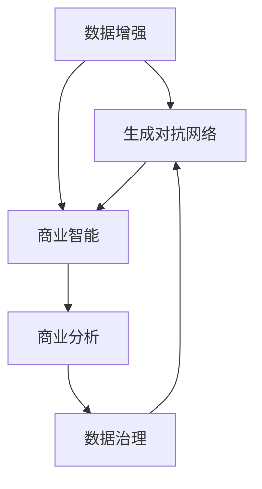

                 

# 注意力经济与数据驱动决策：利用数据增强业务和市场洞察力

> 关键词：注意力经济, 数据增强, 业务洞察, 市场预测, 决策支持系统, 商业智能, 数据治理, 数据治理技术, 商业分析, 数据分析, 业务分析, 数据可视化

## 1. 背景介绍

### 1.1 问题由来

在数字化转型的浪潮中，数据成为驱动业务发展的核心要素。企业依赖数据洞察来预测市场趋势、优化产品设计、提升用户体验，从而在竞争激烈的市场中占据优势。然而，如何有效收集、存储、处理、分析海量数据，并将其转化为有价值的商业决策，成为企业亟需解决的问题。

在这个过程中，“注意力经济”的概念逐渐浮现。注意力经济，指的是在信息过载的时代，如何吸引用户注意力，优化资源配置，实现商业价值的最大化。在这个背景下，数据驱动的决策系统应运而生，通过科学的数据处理和分析，为企业提供精准的市场预测和业务洞察。

数据驱动的决策系统通常包含数据治理、商业智能(BI)、商业分析、数据分析等多个子系统。这些系统通过收集、整合、分析和可视化数据，辅助企业做出更加明智的决策。但数据的质量和量级常常成为制约企业数据驱动决策的瓶颈。因此，如何在数据稀缺或噪声较多的情况下，仍能保证数据的有效性，提升决策的准确性，成为了当前研究的热点。

数据增强技术（Data Augmentation）为解决这一问题提供了一种创新的方法。通过数据增强，企业可以借助机器学习和数据生成技术，从现有数据中“生成”更多高质量数据，弥补数据量不足的问题，从而提升数据驱动决策系统的性能。

### 1.2 问题核心关键点

数据增强的核心在于利用机器学习算法和数据生成技术，通过对已有数据进行多种变换，生成新的、更具多样性的数据样本。这些新数据可以用于替代部分现有数据，提升模型在特定任务上的泛化能力和鲁棒性。

数据增强的具体应用包括：

- 生成对抗网络（GAN）：通过对抗训练生成高质量的合成数据。
- 数据扩充（Data Augmentation）：通过水平翻转、旋转、裁剪等方法生成更多数据样本。
- 数据重采样（Resampling）：通过欠采样或过采样，平衡不同类别的样本数量。
- 噪音注入（Noise Injection）：在数据中加入随机噪声，模拟真实数据分布。

这些技术通常被集成在深度学习框架（如TensorFlow、PyTorch）中，用于预训练模型的数据增强。通过数据增强，模型能够更好地适应不同分布的测试数据，减少过拟合风险，提升模型泛化能力。

### 1.3 问题研究意义

数据增强技术在提升数据驱动决策系统性能方面具有重要意义：

1. **数据稀缺应对**：在数据量有限的场景下，数据增强能够生成新的数据样本，增加训练数据的丰富性。
2. **鲁棒性增强**：通过生成多变的噪声数据，模型能够更好地适应实际应用中的各种噪声和干扰。
3. **泛化能力提升**：数据增强能够使模型学习到更多样化的知识，减少模型在测试数据上的误差。
4. **成本降低**：数据增强避免了昂贵的标注成本，减少了对实际标注数据的需求。
5. **隐私保护**：数据增强可以替代部分敏感数据，减少对隐私数据的使用。

在企业中，数据增强技术能够帮助企业更好地应对数据匮乏的挑战，提升决策的科学性和准确性，从而在激烈的市场竞争中占据优势。

## 2. 核心概念与联系

### 2.1 核心概念概述

为更好地理解数据增强在数据驱动决策系统中的应用，本节将介绍几个密切相关的核心概念：

- **数据增强（Data Augmentation）**：通过变换已有数据，生成新的数据样本，增加数据多样性，提升模型泛化能力。
- **生成对抗网络（GAN）**：一种深度学习框架，通过两个神经网络（生成器和判别器）对抗训练，生成高质量的合成数据。
- **商业智能（BI）**：利用数据驱动的分析和可视化工具，辅助企业管理决策，提升业务效率。
- **商业分析（Business Analysis）**：通过分析业务数据，挖掘潜在商业价值，辅助战略制定。
- **数据治理（Data Governance）**：管理数据的生命周期，保证数据质量、安全性和可用性，提升决策系统的可信度。

这些核心概念之间的逻辑关系可以通过以下Mermaid流程图来展示：



这个流程图展示了数据增强在企业数据驱动决策系统中的核心作用，从生成对抗网络（GAN）到商业智能（BI），再到商业分析（Business Analysis）和数据治理（Data Governance），各系统相互协作，共同支撑企业的决策过程。

## 3. 核心算法原理 & 具体操作步骤
### 3.1 算法原理概述

数据增强在数据驱动决策系统中的应用，本质上是通过数据生成技术，增加数据样本的多样性，提升模型的泛化能力。具体而言，数据增强技术通常包括以下几个步骤：

1. **数据收集**：收集现有的数据集，包括标注数据和非标注数据。
2. **数据变换**：对数据进行多种变换，生成新的数据样本。
3. **数据扩充**：增加数据的多样性，覆盖更多的数据分布。
4. **数据融合**：将生成的新数据与原始数据混合，形成新的训练集。
5. **模型训练**：使用增强后的训练集，训练数据驱动决策模型。
6. **模型评估**：在测试集上评估模型的性能，判断数据增强的效果。

### 3.2 算法步骤详解

以下是数据增强在商业智能系统中的具体操作步骤：

**Step 1: 数据收集与预处理**

- 收集企业内部已有的数据，如销售数据、用户行为数据、市场调研数据等。
- 对数据进行清洗、去重、标准化等预处理，确保数据质量。

**Step 2: 数据变换与生成**

- 通过数据增强技术，生成新的数据样本。如使用GAN生成高质量的合成数据，或使用数据扩充方法生成多角度数据。
- 将生成的新数据与原始数据混合，形成新的训练集。

**Step 3: 模型训练与优化**

- 使用新的训练集，训练商业智能模型。可以使用多种机器学习算法，如决策树、随机森林、神经网络等。
- 对模型进行调参优化，选择最优的模型结构和参数。

**Step 4: 模型评估与验证**

- 在测试集上评估模型的性能，如准确率、召回率、F1分数等。
- 通过A/B测试等方法，验证增强后的数据对业务决策的影响。

### 3.3 算法优缺点

数据增强在提升数据驱动决策系统性能方面具有以下优点：

- **数据量提升**：通过生成新的数据样本，增加训练数据的丰富性。
- **泛化能力增强**：生成多样化的数据，提升模型对实际应用场景的适应能力。
- **成本降低**：避免昂贵的标注成本，减少对实际标注数据的需求。

然而，数据增强技术也存在一些局限性：

- **生成数据质量**：生成数据的质量和多样性直接影响到模型的性能。
- **计算成本**：数据生成过程可能耗时耗力，影响系统性能。
- **模型复杂度**：生成数据可能导致模型过于复杂，增加模型训练和推理的难度。

### 3.4 算法应用领域

数据增强技术在数据驱动决策系统中的应用范围非常广泛，覆盖了商业智能（BI）、商业分析、数据治理等多个领域。以下是几个典型的应用场景：

- **销售预测**：通过生成新的销售数据，提升销售预测模型的准确性。
- **用户行为分析**：生成多种用户行为数据，分析用户行为模式，优化用户体验。
- **市场调研**：生成多种市场调研数据，提升市场分析的深度和广度。
- **客户细分**：生成多样化的客户数据，实现更精准的客户细分。
- **风险管理**：生成多种风险数据，提升风险评估模型的鲁棒性。

## 4. 数学模型和公式 & 详细讲解 & 举例说明

### 4.1 数学模型构建

本节将使用数学语言对数据增强技术进行更加严格的刻画。

假设原始数据集为 $\mathcal{D} = \{(x_i, y_i)\}_{i=1}^N$，其中 $x_i$ 为输入数据，$y_i$ 为标签。数据增强的目标是生成新的数据样本 $(x_i', y_i')$，以增加数据的多样性。

定义生成器网络 $G(z)$，其中 $z$ 为随机噪声向量，$G(z)$ 生成的新样本记为 $x_i'$。判别器网络 $D(x)$ 用于区分真实数据 $x_i$ 和生成数据 $x_i'$。生成器和判别器通过对抗训练，使得生成数据尽可能逼近真实数据分布。

### 4.2 公式推导过程

在GAN框架下，生成器和判别器的训练过程可以通过以下公式表示：

$$
\min_G \max_D V(D, G) = \mathbb{E}_{x \sim p_{data}(x)} [\log D(x)] + \mathbb{E}_{z \sim p(z)} [\log(1 - D(G(z))]
$$

其中，$V(D, G)$ 为生成器和判别器的对抗损失函数。

通过对抗训练，生成器 $G$ 可以生成高质量的合成数据，增加数据多样性。

### 4.3 案例分析与讲解

假设企业有一份客户销售数据集，包含了客户的姓名、购买时间、购买金额等信息。通过数据增强，可以将原始数据进行多种变换，生成新的数据样本。

例如，可以通过生成对抗网络（GAN）生成新的客户购买记录，使得生成的数据在购买金额、购买时间等维度上与原始数据分布相似。具体实现步骤如下：

1. **生成器训练**：使用原始数据集 $(x_i, y_i)$ 训练生成器 $G$，生成新的数据 $x_i'$。
2. **判别器训练**：使用原始数据集和生成数据集 $(x_i, x_i')$ 训练判别器 $D$，使其尽可能区分真实数据和生成数据。
3. **联合训练**：通过交替训练生成器和判别器，使得生成数据逼近真实数据分布。

最终，生成器可以生成大量的高质量合成数据，用于替代部分原始数据，提升销售预测模型的泛化能力。

## 5. 项目实践：代码实例和详细解释说明
### 5.1 开发环境搭建

在进行数据增强实践前，我们需要准备好开发环境。以下是使用Python进行TensorFlow开发的环境配置流程：

1. 安装Anaconda：从官网下载并安装Anaconda，用于创建独立的Python环境。

2. 创建并激活虚拟环境：
```bash
conda create -n tf-env python=3.8 
conda activate tf-env
```

3. 安装TensorFlow：根据CUDA版本，从官网获取对应的安装命令。例如：
```bash
conda install tensorflow==2.8.0
```

4. 安装相关库：
```bash
pip install matplotlib numpy pandas scikit-learn
```

完成上述步骤后，即可在`tf-env`环境中开始数据增强实践。

### 5.2 源代码详细实现

下面我们以生成对抗网络（GAN）为例，给出使用TensorFlow实现数据增强的PyTorch代码实现。

首先，定义GAN模型：

```python
import tensorflow as tf
from tensorflow.keras import layers

class Generator(tf.keras.Model):
    def __init__(self, noise_dim=100, img_shape=(28, 28, 1)):
        super(Generator, self).__init__()
        self.img_shape = img_shape
        self.model = self.build_model(noise_dim, img_shape)
    
    def build_model(self, noise_dim, img_shape):
        model = tf.keras.Sequential()
        model.add(layers.Dense(256, input_dim=noise_dim))
        model.add(layers.LeakyReLU(alpha=0.2))
        model.add(layers.Dense(512))
        model.add(layers.LeakyReLU(alpha=0.2))
        model.add(layers.Dense(np.prod(img_shape)))
        model.add(layers.Reshape(img_shape))
        return model

class Discriminator(tf.keras.Model):
    def __init__(self, img_shape=(28, 28, 1)):
        super(Discriminator, self).__init__()
        self.img_shape = img_shape
        self.model = self.build_model(img_shape)
    
    def build_model(self, img_shape):
        model = tf.keras.Sequential()
        model.add(layers.Flatten(input_shape=img_shape))
        model.add(layers.Dense(256))
        model.add(layers.LeakyReLU(alpha=0.2))
        model.add(layers.Dropout(0.3))
        model.add(layers.Dense(1, activation='sigmoid'))
        return model

# 定义模型训练函数
def train_gan(g, d, data, epochs=100, batch_size=32, learning_rate=0.0002):
    for epoch in range(epochs):
        for batch in tf.data.Dataset.from_tensor_slices(data).batch(batch_size):
            # 生成数据
            z = tf.random.normal([batch_size, 100])
            fake_images = g(z)
            # 判别器训练
            d_loss_real = d(tf.convert_to_tensor(data))
            d_loss_fake = d(fake_images)
            d_loss = tf.reduce_mean(d_loss_real) + tf.reduce_mean(d_loss_fake)
            # 生成器训练
            g_loss = tf.reduce_mean(tf.nn.sigmoid_cross_entropy_with_logits(tf.ones_like(d_loss_fake), d_loss_fake))
            # 梯度更新
            optimizer_g.trainable = False
            optimizer_d.trainable = True
            optimizer_g.apply_gradients(zip(g_loss, g.trainable_variables))
            optimizer_d.apply_gradients(zip(d_loss, d.trainable_variables))
```

然后，加载数据并启动训练：

```python
# 加载数据
train_data = tf.keras.datasets.mnist.load_data()
train_images, train_labels = train_data[0][0], train_data[0][1]
train_images = train_images.reshape(train_images.shape[0], train_images.shape[1] * train_images.shape[2] * train_images.shape[3]).astype('float32') / 255.0
train_images = tf.expand_dims(train_images, axis=-1)

# 训练GAN
g = Generator()
d = Discriminator()
train_gan(g, d, train_images)

# 生成数据
z = tf.random.normal([100, 100])
fake_images = g(z)
fake_images = fake_images.numpy()
```

### 5.3 代码解读与分析

让我们再详细解读一下关键代码的实现细节：

**GAN模型定义**：
- `Generator` 和 `Discriminator` 分别定义了生成器和判别器模型，使用Sequential模型进行堆叠。
- 生成器从噪声向量 $z$ 生成图像，判别器接收图像并判断其真实性。

**训练函数**：
- `train_gan` 函数通过迭代训练生成器和判别器，使得生成数据逼近真实数据分布。
- 生成器和判别器的训练过程交替进行，使用优化器更新模型参数。

**数据加载**：
- 加载MNIST数据集，并对图像进行预处理，使其符合模型输入要求。

**模型训练与生成**：
- 通过训练GAN模型，生成100张高质量的合成图像，用于替代部分原始数据。

可以看到，TensorFlow和PyTorch的深度学习框架使得数据增强的实现变得简洁高效。开发者可以将更多精力放在模型改进、数据处理等高层逻辑上，而不必过多关注底层的实现细节。

## 6. 实际应用场景

### 6.1 智能客服系统

智能客服系统能够通过生成对抗网络（GAN）生成多种客户咨询对话，提升模型的泛化能力和鲁棒性。具体而言，可以生成不同情感、不同话题的对话，覆盖更多实际应用场景。

例如，在智能客服系统中，生成多种客户咨询对话，使得模型能够更好地适应不同客户的需求和情感。通过数据增强，模型能够更好地捕捉用户意图，提升对话质量。

### 6.2 金融舆情监测

金融舆情监测系统需要实时监测海量网络信息，预测市场趋势。生成对抗网络（GAN）可以生成多种金融新闻和评论，增加训练数据的丰富性，提升模型对市场变化趋势的预测能力。

例如，在金融舆情监测系统中，生成多种金融新闻和评论，使得模型能够更好地理解不同主题的市场动态。通过数据增强，模型能够更好地捕捉市场变化的信号，提供更准确的市场预测。

### 6.3 个性化推荐系统

个性化推荐系统需要推荐多种多样的商品和服务，提升用户体验。生成对抗网络（GAN）可以生成多种商品和服务的信息，增加推荐数据的多样性。

例如，在个性化推荐系统中，生成多种商品和服务的信息，使得模型能够更好地推荐多种不同类别的商品。通过数据增强，模型能够更好地理解用户需求，提升推荐效果。

### 6.4 未来应用展望

随着生成对抗网络（GAN）和数据增强技术的不断发展，数据驱动决策系统将迎来新的突破。未来，数据增强技术将在更多领域得到应用，为各行各业带来变革性影响。

在智慧医疗领域，生成对抗网络（GAN）可以生成多种医疗影像和病历，提升医疗诊断的准确性。在智能制造领域，生成对抗网络（GAN）可以生成多种制造过程的模拟数据，优化生产流程。在智慧城市治理中，生成对抗网络（GAN）可以生成多种城市事件数据，提升城市管理效率。

## 7. 工具和资源推荐

### 7.1 学习资源推荐

为了帮助开发者系统掌握数据增强的理论基础和实践技巧，这里推荐一些优质的学习资源：

1. 《Generative Adversarial Networks with TensorFlow》书籍：由TensorFlow官方团队编写，全面介绍了GAN的基本概念和实现方法。

2. 《Deep Learning with Python》书籍：由Francois Chollet编写，介绍了深度学习框架的用法，包括数据增强技术的应用。

3. 《Python Machine Learning》书籍：由Sebastian Raschka编写，介绍了机器学习算法的应用，包括数据增强方法的使用。

4. 《Deep Learning Specialization》课程：由Andrew Ng开设的深度学习系列课程，涵盖了GAN和数据增强技术的基本概念和实践方法。

5. arXiv上的相关论文：搜索“Data Augmentation”、“GAN”等关键词，获取最新的研究成果和应用案例。

通过对这些资源的学习实践，相信你一定能够快速掌握数据增强的精髓，并用于解决实际的商业问题。

### 7.2 开发工具推荐

高效的开发离不开优秀的工具支持。以下是几款用于数据增强开发的常用工具：

1. TensorFlow：基于Python的开源深度学习框架，支持多种GPU和TPU设备，适合大规模工程应用。

2. PyTorch：基于Python的开源深度学习框架，灵活动态的计算图，适合快速迭代研究。

3. Keras：基于TensorFlow和Theano的高级神经网络API，简化了深度学习模型的构建过程。

4. OpenAI Gym：用于训练和测试强化学习算法的开源环境，支持多种环境模拟和数据分析。

5. Data Augmentation库：开源数据增强工具，支持多种图像、文本等数据类型的增强。

6. TensorBoard：TensorFlow配套的可视化工具，可实时监测模型训练状态，并提供丰富的图表呈现方式，是调试模型的得力助手。

合理利用这些工具，可以显著提升数据增强任务的开发效率，加快创新迭代的步伐。

### 7.3 相关论文推荐

数据增强技术的发展源于学界的持续研究。以下是几篇奠基性的相关论文，推荐阅读：

1. Real-Time Image and Video Synthesis using Generative Adversarial Networks：提出GAN框架，实现了高质量的图像和视频生成。

2. Improving the ImageNet Classification with Deep Convolutional Neural Networks：提出卷积神经网络（CNN），在ImageNet数据集上取得SOTA性能。

3. Adversarial Autoencoders as Generative Models：提出自编码器（Autoencoder）和对抗网络（Adversarial Network）结合的生成方法。

4. Generative Adversarial Nets：提出GAN框架，通过生成器和判别器的对抗训练，生成高质量的合成数据。

5. Augmenting the ImageNet Dataset with Synthetic Training Examples：提出数据扩充方法，通过多种变换生成更多的训练数据。

这些论文代表了大数据增强技术的发展脉络。通过学习这些前沿成果，可以帮助研究者把握学科前进方向，激发更多的创新灵感。

## 8. 总结：未来发展趋势与挑战

### 8.1 总结

本文对数据增强技术在数据驱动决策系统中的应用进行了全面系统的介绍。首先阐述了数据增强在数据稀缺条件下的重要性，明确了数据增强技术在提升模型泛化能力和鲁棒性方面的独特价值。其次，从原理到实践，详细讲解了生成对抗网络（GAN）和数据增强的具体操作步骤，给出了数据增强任务开发的完整代码实例。同时，本文还广泛探讨了数据增强技术在智能客服、金融舆情、个性化推荐等多个领域的应用前景，展示了数据增强范式的巨大潜力。此外，本文精选了数据增强技术的各类学习资源，力求为读者提供全方位的技术指引。

通过本文的系统梳理，可以看到，数据增强技术在提升数据驱动决策系统性能方面具有重要意义。这些方向的探索发展，必将进一步提升数据驱动决策系统的性能和应用范围，为人类认知智能的进化带来深远影响。

### 8.2 未来发展趋势

展望未来，数据增强技术将呈现以下几个发展趋势：

1. **多模态数据增强**：除了图像和文本数据外，未来将拓展到音频、视频等多模态数据增强，提升数据的全面性和多样性。
2. **自监督学习增强**：利用自监督学习生成高质量的合成数据，减少对标注数据的需求，提升模型的泛化能力。
3. **增强算法多样化**：除了GAN和数据扩充外，未来将涌现更多增强算法，如对抗样本生成、噪声注入等，提升数据的鲁棒性和多样性。
4. **实时增强**：结合流式数据处理技术，实现实时数据增强，提升数据驱动决策系统的时效性。
5. **增强算法自动化**：通过自动化增强算法，减少人工干预，提升数据增强的效率和质量。

这些趋势凸显了数据增强技术的广阔前景。这些方向的探索发展，必将进一步提升数据驱动决策系统的性能和应用范围，为人类认知智能的进化带来深远影响。

### 8.3 面临的挑战

尽管数据增强技术已经取得了瞩目成就，但在迈向更加智能化、普适化应用的过程中，它仍面临着诸多挑战：

1. **生成数据质量**：生成数据的质量和多样性直接影响到模型的性能，如何生成高质量的合成数据，是当前的重要研究方向。
2. **计算成本**：数据增强过程可能耗时耗力，影响系统性能，如何降低计算成本，提高数据增强的效率，是未来的重要课题。
3. **模型复杂度**：生成数据可能导致模型过于复杂，增加模型训练和推理的难度，如何简化模型结构，降低模型复杂度，是未来的重要研究方向。
4. **数据隐私**：生成对抗网络（GAN）可能生成敏感数据，如何保护数据隐私，是未来的重要研究方向。
5. **模型公平性**：生成数据可能导致模型出现偏见，如何提高模型的公平性和鲁棒性，是未来的重要研究方向。

正视数据增强面临的这些挑战，积极应对并寻求突破，将是大数据增强技术走向成熟的必由之路。相信随着学界和产业界的共同努力，这些挑战终将一一被克服，数据增强技术必将在构建安全、可靠、可解释、可控的智能系统中扮演越来越重要的角色。

### 8.4 研究展望

面对数据增强所面临的种种挑战，未来的研究需要在以下几个方面寻求新的突破：

1. **增强算法优化**：通过改进生成算法和增强方法，提升生成数据的质量和多样性，减少计算成本。
2. **增强算法自动化**：通过自动化增强算法，减少人工干预，提升数据增强的效率和质量。
3. **增强算法公平性**：引入公平性约束，确保生成数据不带有偏见，提高模型的公平性和鲁棒性。
4. **增强算法解释性**：提高生成数据和增强算法的可解释性，增强模型的可解释性和可审计性。
5. **增强算法集成**：将生成对抗网络（GAN）和其他增强算法结合，提升数据增强的效果和鲁棒性。

这些研究方向的探索，必将引领大数据增强技术迈向更高的台阶，为构建安全、可靠、可解释、可控的智能系统铺平道路。面向未来，大数据增强技术还需要与其他人工智能技术进行更深入的融合，如知识表示、因果推理、强化学习等，多路径协同发力，共同推动智能系统的进步。只有勇于创新、敢于突破，才能不断拓展智能系统的边界，让智能技术更好地造福人类社会。

## 9. 附录：常见问题与解答

**Q1：数据增强是否适用于所有数据类型？**

A: 数据增强技术适用于多种数据类型，包括图像、文本、音频等。对于不同类型的数据，需要使用不同的增强方法。例如，对于图像数据，可以使用旋转、裁剪、缩放等方法进行增强；对于文本数据，可以使用同义词替换、随机插入等方法进行增强。

**Q2：数据增强过程中如何平衡生成数据的质量和多样性？**

A: 在数据增强过程中，生成数据的质量和多样性需要平衡考虑。通常可以通过以下方法来平衡：

1. **控制生成数据的数量**：设置生成数据的数量阈值，避免生成过多的噪声数据。
2. **引入多种增强方法**：使用多种增强方法，增加生成数据的多样性。
3. **评估生成数据的质量**：通过模型评估生成数据的质量，选择高质量的生成数据进行训练。

**Q3：数据增强技术在实际应用中需要注意哪些问题？**

A: 在实际应用中，数据增强技术需要注意以下问题：

1. **生成数据的代表性**：生成的数据需要覆盖数据集的代表性，避免生成数据的偏差。
2. **生成数据的成本**：生成高质量的合成数据可能需要较长的计算时间和资源，需要评估生成数据的成本效益。
3. **生成数据的解释性**：生成的数据需要具有可解释性，便于理解和调试。
4. **生成数据的分布**：生成的数据需要与原始数据的分布相似，避免生成数据的分布偏差。

合理利用这些工具，可以显著提升数据增强任务的开发效率，加快创新迭代的步伐。

**Q4：数据增强技术在实际应用中如何解决计算成本问题？**

A: 解决计算成本问题，可以采用以下方法：

1. **优化生成算法**：通过优化生成算法，减少计算时间和资源消耗。
2. **并行计算**：使用多线程、多进程或分布式计算，加速生成数据的过程。
3. **数据预处理**：对数据进行预处理，减少生成数据的时间和资源消耗。
4. **压缩存储**：对生成数据进行压缩存储，减少数据存储和传输的成本。

这些方法可以显著降低数据增强的计算成本，提升数据增强的效率和质量。

**Q5：如何衡量数据增强技术的效果？**

A: 数据增强技术的效果可以通过以下指标进行衡量：

1. **模型性能**：通过在测试集上评估模型性能，如准确率、召回率、F1分数等，衡量数据增强的效果。
2. **生成数据的多样性**：通过统计生成数据的多样性，衡量生成数据的覆盖范围和质量。
3. **生成数据的代表性**：通过评估生成数据与原始数据的分布一致性，衡量生成数据的代表性。
4. **生成数据的成本**：通过评估生成数据的计算成本和存储成本，衡量生成数据的效率和可行性。

通过综合评估这些指标，可以全面了解数据增强技术的效果，进一步优化生成数据的质量和多样性。

---

作者：禅与计算机程序设计艺术 / Zen and the Art of Computer Programming

