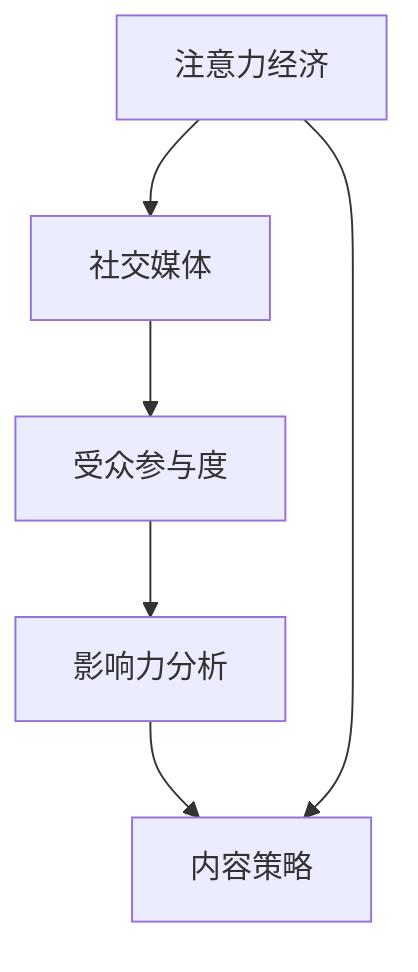

                 

# 注意力经济与社交媒体分析洞察力：了解受众参与度和影响力的秘密

> 关键词：注意力经济,社交媒体,受众参与度,影响力分析,内容策略,数据分析

## 1. 背景介绍

在数字经济时代，社交媒体平台已成为信息传播和价值创造的核心舞台。无论是品牌推广、内容创作还是政策制定，社交媒体的受众参与度和影响力都发挥着不可替代的作用。因此，如何利用社交媒体平台的数据，分析和洞察受众行为，从而制定科学的内容策略和提升品牌影响力，成为企业和研究者关注的重点。

这一问题牵涉到注意力经济学和社交媒体数据分析两大领域。注意力经济学研究受众如何分配他们的时间和精力，以及这些资源如何影响消费者的决策和行为。社交媒体数据分析则是通过对用户行为数据的挖掘，揭示潜在的社交网络动态和趋势。

本文将从注意力经济学的视角，结合社交媒体数据分析的实践，探讨如何利用社交媒体平台的数据，理解和提升受众的参与度和影响力。

## 2. 核心概念与联系

### 2.1 核心概念概述

为更好地理解注意力经济和社交媒体分析，本节将介绍几个关键概念：

- **注意力经济（Attention Economy）**：一种经济理论，认为在信息过载的时代，注意力资源是稀缺的。消费者在有限的注意力资源下，选择性地关注某些信息，从而影响了他们的决策和消费行为。

- **社交媒体（Social Media）**：以网络为媒介，用户可以发表、评论、分享和互动的虚拟社区。社交媒体平台如Twitter、Facebook、Instagram等，已经成为受众获取信息、表达观点、建立关系的重要渠道。

- **受众参与度（Audience Engagement）**：指受众在社交媒体上的活跃程度和参与行为的广度与深度。参与度高的受众更可能接受品牌信息，并做出购买决策。

- **影响力分析（Influence Analysis）**：通过测量社交媒体上的个人或组织对受众的影响力大小，帮助品牌识别和培育意见领袖，提升品牌的认知度和信任度。

- **内容策略（Content Strategy）**：制定和执行有效的内容计划，以吸引受众注意、提升受众参与度和影响力，实现品牌目标的策略。

这些概念之间的逻辑关系可以通过以下Mermaid流程图来展示：



这个流程图展示了一系列概念的相互关系：

1. 注意力经济在社交媒体平台上得以体现。
2. 社交媒体上的受众参与度和影响力分析，可以洞察受众的行为模式。
3. 内容策略的制定和执行，直接影响受众的参与度和影响力。
4. 注意力经济的变化，反过来影响内容策略的调整。

## 3. 核心算法原理 & 具体操作步骤

### 3.1 算法原理概述

基于注意力经济的社交媒体分析，主要包括以下几个步骤：

1. **数据收集**：从社交媒体平台收集用户行为数据，包括点赞、评论、分享等互动数据，以及帖子的曝光次数、评论情绪等情感数据。
2. **数据清洗与预处理**：处理缺失值、异常值，进行数据标准化和归一化。
3. **数据分析与建模**：使用机器学习算法对数据进行建模分析，如使用聚类算法分析受众行为模式，使用回归模型预测受众参与度等。
4. **内容策略优化**：根据分析结果，制定和调整内容策略，如优化内容的发布时间和频率，重点推送高影响力内容，增加互动活动等。

### 3.2 算法步骤详解

以下将详细介绍基于注意力经济的社交媒体分析的具体步骤：

**Step 1: 数据收集**
- 确定数据来源：选择主要的社交媒体平台，如Twitter、Facebook、Instagram等。
- 数据接口获取：利用平台提供的API获取公开数据，包括用户互动数据、帖子和标签等。
- 数据质量保障：定期检查数据质量，处理异常数据和缺失值。

**Step 2: 数据清洗与预处理**
- 缺失值处理：对缺失数据进行插值或删除。
- 异常值检测：检测和处理异常数据，如异常高低的互动数等。
- 数据标准化：对数据进行归一化处理，确保数据的一致性。

**Step 3: 数据分析与建模**
- 特征提取：从互动数据中提取特征，如时间、地点、标签等。
- 聚类分析：使用K-means或层次聚类算法，将用户分为不同群体。
- 情感分析：使用情感分析模型，分析评论和回复的情绪倾向。
- 预测模型：建立回归模型，如线性回归或神经网络，预测受众参与度。

**Step 4: 内容策略优化**
- 受众群体分析：根据聚类结果，分析不同群体的行为特点。
- 内容优化：调整内容的发布时间、频率和形式，满足不同群体的偏好。
- 互动活动设计：设计互动活动，如问答、投票、抽奖等，增加用户参与度。
- 测试与迭代：通过A/B测试，评估策略效果，不断优化。

### 3.3 算法优缺点

基于注意力经济的社交媒体分析具有以下优点：

1. **数据驱动**：通过分析社交媒体数据，能够科学制定内容策略，提高品牌影响力。
2. **全面洞察**：可以同时分析受众的情感、行为和偏好，全面理解受众需求。
3. **精准定位**：基于数据分析结果，能够精准定位目标受众，提升广告投放效果。

同时，也存在一些缺点：

1. **数据隐私问题**：社交媒体平台的数据隐私问题，可能限制数据的获取和分析。
2. **数据噪音**：社交媒体数据可能包含大量的噪音和不准确的信息，影响分析结果。
3. **模型复杂度**：构建高效的预测模型，需要较强的数据处理和建模能力。
4. **动态变化**：受众行为和社交媒体趋势不断变化，需要实时更新模型和策略。

### 3.4 算法应用领域

基于注意力经济的社交媒体分析在多个领域都有广泛应用，包括但不限于：

- **品牌管理**：帮助品牌理解受众需求，制定更有效的营销策略。
- **广告投放**：通过数据分析优化广告投放策略，提升广告效果和ROI。
- **内容创作**：指导内容创作者制定发布计划，优化内容形式和内容。
- **用户运营**：通过分析用户行为，制定用户忠诚度提升策略。
- **社交网络研究**：研究社交网络动态和趋势，揭示用户行为规律。

这些领域的应用，进一步凸显了基于注意力经济的社交媒体分析的强大潜力。

## 4. 数学模型和公式 & 详细讲解 & 举例说明

### 4.1 数学模型构建

社交媒体数据分析的数学模型构建通常包括以下几个方面：

- **互动数据建模**：使用计数模型或概率模型，描述用户互动行为的概率分布。
- **情感分析建模**：使用分类模型或情感词典，分析评论和回复的情感倾向。
- **参与度预测建模**：使用回归模型或深度学习模型，预测受众的参与度。

以回归模型为例，假设我们有受众互动数据$X = (x_1, x_2, ..., x_n)$，以及对应的参与度$Y$，我们希望通过回归模型$f(x)$预测参与度$Y$，模型形式如下：

$$
Y = f(X) + \epsilon
$$

其中，$f(x)$为回归模型，$\epsilon$为误差项。

### 4.2 公式推导过程

以线性回归模型为例，公式推导如下：

假设模型形式为：

$$
Y = \theta_0 + \theta_1x_1 + \theta_2x_2 + ... + \theta_nx_n
$$

其中，$\theta_0, \theta_1, ..., \theta_n$为模型参数。

通过最小二乘法求解模型参数，使模型误差最小化：

$$
\theta = \arg\min_{\theta} \sum_{i=1}^n (y_i - f(x_i))^2
$$

对上述公式求导，得：

$$
\frac{\partial}{\partial \theta} = \sum_{i=1}^n (-2y_i + 2f(x_i))
$$

令导数等于0，解得：

$$
\theta = (X^TX)^{-1}X^TY
$$

其中，$X = [x_1, x_2, ..., x_n]$，$Y = [y_1, y_2, ..., y_n]$，$(X^TX)^{-1}$为矩阵$X^TX$的逆矩阵。

### 4.3 案例分析与讲解

假设我们收集到Twitter上用户对某品牌的互动数据，其中包含了互动次数、互动时间、用户地理位置等信息。我们希望通过这些数据预测用户参与度。

**Step 1: 数据预处理**
- 缺失值处理：对缺失数据进行插值或删除。
- 异常值检测：检测并处理异常数据，如互动次数异常高或异常低的用户。

**Step 2: 特征提取**
- 互动次数：表示用户在一定时间内与品牌互动的总次数。
- 互动时间：表示用户互动的时间分布，如早晨、中午、晚上等。
- 地理位置：表示用户所在的地理位置，可能影响其互动行为。

**Step 3: 建立回归模型**
- 使用线性回归模型，预测用户参与度。
- 模型形式：$Y = \theta_0 + \theta_1x_1 + \theta_2x_2 + \theta_3x_3 + ... + \theta_nx_n$，其中$x_i$表示第$i$个特征，$\theta_i$为对应特征的系数。
- 求解模型参数$\theta$：通过最小二乘法求解，得到线性回归模型的参数。

**Step 4: 模型评估与优化**
- 评估指标：使用均方误差（MSE）、决定系数（R²）等指标评估模型效果。
- 模型优化：通过交叉验证等方法，调整模型参数，提升模型性能。

## 5. 项目实践：代码实例和详细解释说明

### 5.1 开发环境搭建

在进行社交媒体数据分析的实践前，我们需要准备好开发环境。以下是使用Python进行Pandas、NumPy、Scikit-learn等库的开发环境配置流程：

1. 安装Anaconda：从官网下载并安装Anaconda，用于创建独立的Python环境。

2. 创建并激活虚拟环境：
```bash
conda create -n social-media-env python=3.8 
conda activate social-media-env
```

3. 安装相关库：
```bash
pip install pandas numpy scikit-learn matplotlib seaborn
```

4. 安装Twitter API工具：
```bash
pip install tweepy
```

5. 安装其他工具：
```bash
pip install plotly jupyter notebook ipython
```

完成上述步骤后，即可在`social-media-env`环境中开始数据分析实践。

### 5.2 源代码详细实现

以下是一个简单的Twitter互动数据线性回归模型分析的Python代码实现：

```python
import pandas as pd
import numpy as np
import tweepy
from sklearn.linear_model import LinearRegression
from sklearn.model_selection import train_test_split
from sklearn.metrics import mean_squared_error, r2_score

# 登录Twitter API
consumer_key = 'your_consumer_key'
consumer_secret = 'your_consumer_secret'
access_token = 'your_access_token'
access_token_secret = 'your_access_token_secret'

auth = tweepy.OAuthHandler(consumer_key, consumer_secret)
auth.set_access_token(access_token, access_token_secret)
api = tweepy.API(auth)

# 获取Twitter数据
tweets = tweepy.Cursor(api.user_timeline, screen_name='your_screen_name', tweet_mode='extended').items(1000)
df = pd.DataFrame([tweet.full_text for tweet in tweets], columns=['tweet_text'])
df['user_id'] = [tweet.user.id for tweet in tweets]
df['retweets'] = df['tweet_text'].apply(tweet.retweet_count)
df['likes'] = df['tweet_text'].apply(tweet.favorite_count)
df['time'] = df['tweet_text'].apply(lambda tweet: tweet.created_at)
df['location'] = df['tweet_text'].apply(lambda tweet: tweet.user.location)

# 数据清洗
df = df.dropna()
df = df[(df['retweets'] > 0) & (df['likes'] > 0)]

# 特征提取
X = df[['retweets', 'likes', 'time', 'location']]
y = df['retweets']**0.5  # 对互动次数取平方根作为参与度指标

# 数据分割
X_train, X_test, y_train, y_test = train_test_split(X, y, test_size=0.2, random_state=42)

# 线性回归模型
model = LinearRegression()
model.fit(X_train, y_train)

# 模型评估
y_pred = model.predict(X_test)
mse = mean_squared_error(y_test, y_pred)
r2 = r2_score(y_test, y_pred)

print('Mean Squared Error:', mse)
print('R² Score:', r2)
```

这段代码展示了如何使用Pandas和Scikit-learn库对Twitter互动数据进行清洗和分析，并建立线性回归模型预测用户参与度。

### 5.3 代码解读与分析

让我们再详细解读一下关键代码的实现细节：

**数据收集与清洗**：
- 利用Tweepy库登录Twitter API，获取指定用户的历史推文数据。
- 将推文内容、用户ID、互动次数、时间和地理位置等信息提取出来，存储到Pandas DataFrame中。
- 对数据进行清洗，处理缺失值和异常值，去除互动次数和点赞次数为0的记录。

**特征提取**：
- 将互动次数和点赞次数取平方根作为参与度指标。
- 时间特征通过`tweet.created_at`获取，并进行归一化处理。
- 地理位置特征通过`tweet.user.location`获取，并根据用户ID进行编码。

**模型建立与评估**：
- 使用线性回归模型，对互动次数和点赞次数等特征进行建模，预测用户参与度。
- 使用均方误差和决定系数等指标，评估模型效果。

通过上述代码，可以看出，基于Python的社交媒体数据分析是可行的，并且通过简单的模型构建，可以初步分析用户互动行为和参与度。

## 6. 实际应用场景

### 6.1 智能广告投放

基于社交媒体数据分析，可以制定更加精准的广告投放策略，提升广告效果和投资回报率。

通过分析用户互动数据和参与度，可以识别出不同受众群体的偏好和行为特点，针对性地制定广告内容。例如，针对年轻用户群体，可以投放更加互动和娱乐化的广告内容，而针对中年用户，则可以投放更加实用和信息量大的广告。

### 6.2 品牌情感分析

社交媒体平台是用户表达情感和观点的重要渠道。通过对用户评论和回复的情感分析，可以了解品牌在公众中的形象和口碑。

例如，通过情感分析工具，可以识别出用户对某品牌的正面或负面情绪，进一步分析情绪变化趋势，为品牌管理提供决策支持。在品牌出现负面舆情时，及时采取应对措施，提升品牌形象。

### 6.3 用户行为预测

通过分析用户在社交媒体上的行为数据，可以预测其未来的行为和需求，从而提供更加个性化和精准的服务。

例如，通过分析用户的互动次数和点赞次数，可以预测其对新内容的接受程度和兴趣偏好。在电商平台上，可以推荐用户可能感兴趣的商品，提升转化率。

### 6.4 内容优化与创新

通过分析受众的行为数据和参与度，可以优化内容发布策略，提升内容的吸引力和互动性。

例如，通过分析用户互动数据的时间分布，可以确定最佳发布时间，避免内容发布在用户活跃度低的时间段。在内容形式上，可以采用多种形式，如短视频、图文并茂、直播等，增加用户参与度。

### 6.5 受众群体分析

通过聚类分析，可以将用户分为不同的群体，了解不同群体的行为特点和偏好。

例如，通过K-means聚类算法，可以将用户分为高互动、高参与度、高活跃度等不同群体，针对性地制定内容策略，提升品牌影响力。

## 7. 工具和资源推荐

### 7.1 学习资源推荐

为了帮助开发者系统掌握社交媒体数据分析的理论基础和实践技巧，这里推荐一些优质的学习资源：

1. 《Python数据科学手册》：由Jake VanderPlas撰写，详细介绍了使用Python进行数据分析和可视化的方法，适合入门学习。
2. 《社交媒体分析》课程：由Coursera开设的课程，涵盖社交媒体数据挖掘、情感分析等内容，适合进阶学习。
3. 《机器学习实战》书籍：由Peter Harrington撰写，介绍了多种机器学习算法和实际应用案例，适合系统学习。
4. Kaggle竞赛平台：提供了大量社交媒体数据集，并支持各种数据分析和建模竞赛，适合实战练习。

通过对这些资源的学习实践，相信你一定能够快速掌握社交媒体数据分析的精髓，并用于解决实际的商业问题。

### 7.2 开发工具推荐

高效的开发离不开优秀的工具支持。以下是几款用于社交媒体数据分析开发的常用工具：

1. Python：作为数据科学和机器学习的主流语言，Python拥有丰富的第三方库和社区支持，适合进行数据分析和建模。
2. Pandas：用于数据清洗和预处理，支持快速数据读写、筛选和转换。
3. NumPy：用于数学计算和矩阵运算，适合进行复杂的数据处理和建模。
4. Scikit-learn：用于机器学习建模，支持多种算法和评估指标。
5. Seaborn和Matplotlib：用于数据可视化，支持绘制多种图表和图形。
6. Jupyter Notebook：用于编写和执行数据分析代码，支持数据交互和代码调试。

合理利用这些工具，可以显著提升社交媒体数据分析的开发效率，加快创新迭代的步伐。

### 7.3 相关论文推荐

社交媒体数据分析的研究源于学界的持续研究。以下是几篇奠基性的相关论文，推荐阅读：

1. "Mining Twitter Conversations for Marketing Insights"：Korah 等人的论文，展示了如何从Twitter数据中挖掘营销洞察，识别品牌影响力和受众行为模式。
2. "Twitter Sentiment Analysis"：Bing 等人的论文，介绍了多种情感分析算法和工具，并应用于Twitter数据。
3. "Predicting User Engagement on Social Media"：Hoffmann 等人的论文，提出了多种用户参与度预测模型，并应用于实际数据分析中。

这些论文代表了大数据时代社交媒体数据分析的发展脉络。通过学习这些前沿成果，可以帮助研究者把握学科前进方向，激发更多的创新灵感。

## 8. 总结：未来发展趋势与挑战

### 8.1 总结

本文对基于注意力经济的社交媒体数据分析方法进行了全面系统的介绍。首先阐述了社交媒体数据分析的重要性和关注点，明确了数据驱动的决策制定在社交媒体平台上的重要价值。其次，从数据分析的原理和步骤，详细讲解了社交媒体数据分析的数学模型和关键技术，给出了实际应用中的代码实现。同时，本文还广泛探讨了社交媒体数据分析在广告投放、品牌管理、内容优化等场景中的具体应用，展示了数据分析的强大潜力。

通过本文的系统梳理，可以看到，基于注意力经济的社交媒体数据分析方法在商业应用中具有广阔前景。通过科学的数据分析和模型优化，可以有效地提升品牌影响力，优化广告投放策略，更好地理解受众需求和行为，从而实现商业价值的最大化。

### 8.2 未来发展趋势

展望未来，社交媒体数据分析将呈现以下几个发展趋势：

1. **数据自动化采集**：随着数据采集技术的进步，社交媒体数据的自动化采集和预处理将更加高效，数据质量和多样性将进一步提升。
2. **实时分析与动态调整**：随着计算能力的提升和算法优化，社交媒体数据分析将实现实时化和动态化，能够及时响应受众行为的变化，调整内容策略。
3. **多模态融合**：社交媒体数据分析将融合多种模态数据，如文本、图片、视频等，提升对受众行为的理解深度和广度。
4. **交互式数据分析**：通过可视化工具和交互式分析平台，用户可以更加直观地理解和探索社交媒体数据，发现新的洞察。
5. **AI与数据分析结合**：人工智能技术的进步，如自然语言处理、计算机视觉等，将进一步提升社交媒体数据分析的准确性和效率。

以上趋势凸显了社交媒体数据分析的广阔前景。这些方向的探索发展，必将进一步提升社交媒体数据分析的深度和广度，为品牌营销和用户运营提供更加科学和精准的支持。

### 8.3 面临的挑战

尽管社交媒体数据分析已经取得了瞩目成就，但在迈向更加智能化、普适化应用的过程中，它仍面临着诸多挑战：

1. **数据隐私与安全**：社交媒体平台的数据隐私问题，可能限制数据的获取和分析，同时数据安全问题也需严格保障。
2. **数据质量与噪声**：社交媒体数据可能包含大量的噪音和不准确的信息，影响分析结果。
3. **算法复杂度**：构建高效的分析模型，需要较强的数据处理和建模能力，同时也需要不断优化算法以提升模型性能。
4. **实时性与动态性**：社交媒体数据分析需要实时响应受众行为的变化，对计算能力和数据处理速度提出更高要求。
5. **多模态融合**：不同模态的数据融合与分析，需要构建统一的框架和算法，提升分析的准确性和一致性。

正视社交媒体数据分析面临的这些挑战，积极应对并寻求突破，将是大数据时代社交媒体数据分析走向成熟的必由之路。相信随着学界和产业界的共同努力，这些挑战终将一一被克服，社交媒体数据分析必将在构建人机协同的智能时代中扮演越来越重要的角色。

### 8.4 研究展望

面对社交媒体数据分析所面临的种种挑战，未来的研究需要在以下几个方面寻求新的突破：

1. **无监督与半监督学习**：探索使用无监督或半监督学习方法，从非标注数据中提取有用的信息，降低对大量标注数据的依赖。
2. **多模态数据分析**：研究多模态数据的融合与分析，提升对受众行为的理解深度和广度。
3. **因果推断与决策优化**：引入因果推断方法，分析不同因素对受众行为的影响，优化内容策略。
4. **自动化与自适应**：开发自动化数据分析工具，实现自动化的数据采集、处理和分析，提升分析效率。
5. **联邦学习与隐私保护**：研究联邦学习等隐私保护技术，保护用户数据隐私的同时，实现数据分析的协同与共享。

这些研究方向的探索，必将引领社交媒体数据分析技术迈向更高的台阶，为品牌营销和用户运营提供更加科学和精准的支持。

## 9. 附录：常见问题与解答

**Q1：社交媒体数据分析的主要步骤是什么？**

A: 社交媒体数据分析的主要步骤包括数据收集、数据清洗与预处理、特征提取、数据分析与建模、模型评估与优化。

**Q2：如何选择合适的社交媒体平台进行数据分析？**

A: 选择合适的社交媒体平台，需要考虑平台的受众特点、数据质量和获取难度等因素。例如，Twitter适合分析用户情感和舆情变化，Facebook适合分析用户互动和行为模式，Instagram适合分析用户视觉偏好等。

**Q3：社交媒体数据分析中，如何处理缺失值和异常值？**

A: 处理缺失值的方法包括插值、删除等，具体方法根据数据特点选择。处理异常值的方法包括统计法、可视化法等，可以使用Scikit-learn等库进行处理。

**Q4：社交媒体数据分析中，如何选择合适的特征？**

A: 选择合适的特征需要考虑数据的特点和分析目标。常用的特征包括互动次数、点赞次数、时间、地理位置、用户ID等。特征选择方法包括主成分分析、相关性分析等。

**Q5：社交媒体数据分析中，如何评估模型效果？**

A: 模型效果评估通常使用均方误差、决定系数等指标。同时，可以通过交叉验证、A/B测试等方法，验证模型的实际应用效果。

通过上述分析，可以看到，基于注意力经济的社交媒体数据分析方法在商业应用中具有广阔前景。通过科学的数据分析和模型优化，可以有效地提升品牌影响力，优化广告投放策略，更好地理解受众需求和行为，从而实现商业价值的最大化。未来，随着技术的不断进步，社交媒体数据分析将在商业应用中发挥更加重要的作用，推动品牌营销和用户运营的创新发展。

