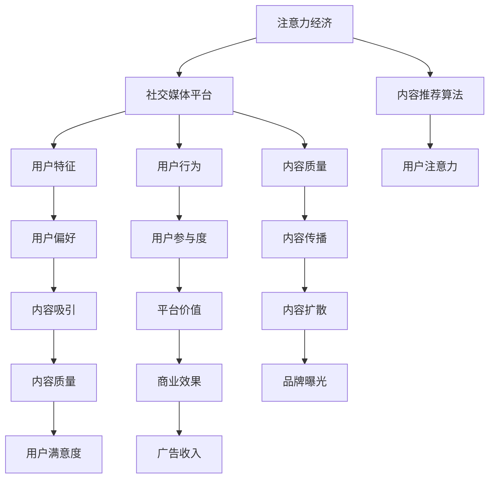

                 

# 注意力经济与社交媒体影响因素分析：了解算法和受众参与

## 1. 背景介绍

### 1.1 问题由来
在数字经济时代，社交媒体和在线内容平台已经成为人们获取信息和交流互动的主要渠道。伴随数字营销、网络广告等商业模式的兴起，社交媒体平台逐渐成为商业运作的“战场”，围绕用户注意力展开激烈的竞争。如何高效获取、分配和管理用户注意力，成为社交媒体平台发展的核心目标。这一现象衍生出了“注意力经济”这一全新商业模式，其本质是通过对用户注意力的争夺和合理配置，创造和分配价值。

### 1.2 问题核心关键点
注意力经济的核心在于理解和控制用户注意力，使得内容平台能以更有效的模式吸引、保持和转换用户关注。但注意力经济中存在诸多变量和影响因素，如内容质量、用户特征、算法策略等，这些因素共同作用于用户行为，影响平台的用户参与度和商业效果。

### 1.3 问题研究意义
研究社交媒体中的注意力经济及其影响因素，对于优化内容推荐算法、提升用户参与度、增强平台商业价值具有重要意义。深入分析这些因素，不仅有助于平台优化运营策略，还能为商业合作和用户关系管理提供数据支撑，促进平台与用户之间建立更加紧密、健康的互动关系。

## 2. 核心概念与联系

### 2.1 核心概念概述

注意力经济关注的是如何在数字平台上利用和分配用户注意力，进而实现商业价值的最大化。在这一过程中，社交媒体平台起到了关键作用。用户注意力的获取与维持，受到多种因素的影响，包括内容质量、算法机制、用户行为等。本节将介绍这些核心概念及其联系。

- 注意力经济(Attention Economy)：在数字经济时代，利用用户注意力进行商业运作的商业模式，强调对用户注意力的争夺和分配。
- 社交媒体平台(Social Media Platform)：借助互联网技术，用户可以发布和分享信息的社交互动平台，典型如Facebook、Twitter、抖音等。
- 内容推荐算法(Content Recommendation Algorithm)：社交媒体平台的核心功能，通过算法对内容进行推荐，影响用户注意力的获取与维持。
- 用户特征(User Features)：用户的年龄、性别、兴趣、历史行为等，影响其对内容的偏好和互动行为。
- 用户行为(User Behavior)：用户在社交媒体上的行为模式，如阅读、点赞、评论、分享等，对平台内容的传播与互动有重要影响。
- 内容质量(Content Quality)：内容的原创性、价值性、趣味性等，直接影响用户的点击率和停留时间。

这些核心概念之间相互关联，共同构成社交媒体中的注意力经济生态。

### 2.2 核心概念原理和架构的 Mermaid 流程图



## 3. 核心算法原理 & 具体操作步骤
### 3.1 算法原理概述

社交媒体平台的核心算法以内容推荐为核心，其核心原理可归纳为以下两点：

- **协同过滤算法(Collaborative Filtering)**：根据用户历史行为，通过相似度匹配推荐其他用户可能感兴趣的内容。
- **内容相关性算法(Content-Based Filtering)**：根据内容特征，通过计算相似度匹配推荐与已有内容相关的新内容。

内容推荐算法通常由以下步骤组成：

1. **数据收集**：收集用户的历史行为数据和内容特征数据。
2. **特征表示**：将用户和内容表示为高维向量。
3. **相似度计算**：计算用户与内容之间的相似度。
4. **排名排序**：根据相似度排序，推荐得分最高的内容。

### 3.2 算法步骤详解

社交媒体平台的内容推荐算法一般包括以下步骤：

**Step 1: 数据准备**
- 收集用户历史数据：如浏览记录、点赞记录、评论记录等。
- 收集内容特征数据：如文章标题、关键词、作者、发布时间等。
- 预处理数据：去除噪声数据，进行归一化和标准化处理。

**Step 2: 特征提取**
- 使用TF-IDF、Word2Vec等技术将文本数据转换为向量形式。
- 提取用户特征：如用户兴趣、社交关系、设备特征等。

**Step 3: 相似度计算**
- 计算用户和内容之间的相似度：如余弦相似度、欧式距离等。
- 计算内容之间的相似度：如TF-IDF相似度、Jaccard相似度等。

**Step 4: 排名排序**
- 利用评分模型对内容进行评分。
- 根据评分对内容进行排序，推荐得分最高的内容。

**Step 5: 迭代优化**
- 使用在线学习算法对模型进行实时优化，提升推荐效果。

### 3.3 算法优缺点

内容推荐算法具有以下优点：
- 精准性高：通过用户行为数据，推荐符合用户偏好的内容，提高用户满意度。
- 个性化强：能够根据用户特征和内容特征，进行个性化推荐。
- 实时性高：能够实时调整推荐策略，提高平台的用户粘性。

同时，也存在以下局限：
- 冷启动问题：新用户或新内容缺乏历史数据，难以进行推荐。
- 数据隐私：用户行为数据可能涉及隐私，存在泄露风险。
- 内容多样性：推荐的过度集中可能导致内容多样性降低。
- 算法复杂性：算法的实现和优化需要较高的技术门槛。

### 3.4 算法应用领域

内容推荐算法广泛应用于社交媒体平台、视频网站、新闻网站等领域，帮助用户发现感兴趣的内容，提高平台的用户参与度和留存率。例如：

- 抖音：通过兴趣标签匹配，推荐用户感兴趣的视频内容。
- Netflix：根据用户观影历史，推荐其他可能喜欢的电影和剧集。
- Amazon：基于用户购买记录，推荐相关商品。

## 4. 数学模型和公式 & 详细讲解 & 举例说明

### 4.1 数学模型构建

社交媒体平台的内容推荐算法通常基于协同过滤和内容相关性，利用矩阵分解、协同矩阵分解等技术进行建模。

- **协同过滤算法**：假设用户行为可以用一个用户-项目评分矩阵 $\mathbf{U}$ 表示，内容特征可以用一个内容-特征评分矩阵 $\mathbf{V}$ 表示。设用户-内容评分矩阵 $\mathbf{R}$，则推荐模型的目标是最小化预测误差 $\mathbf{E}$：

$$
\min_{\mathbf{P}, \mathbf{Q}} ||\mathbf{R}-\mathbf{PUV}^T||_F^2
$$

其中 $\mathbf{P}$ 和 $\mathbf{Q}$ 为低秩矩阵， $\mathbf{U}$ 和 $\mathbf{V}$ 为特征矩阵， $\mathbf{R}$ 为评分矩阵， $||.||_F^2$ 表示矩阵的 Frobenius 范数。

- **内容相关性算法**：假设内容可以用一个特征向量表示 $\mathbf{c}$，用户偏好可以用一个偏好向量表示 $\mathbf{p}$，则推荐模型可以表示为：

$$
\mathbf{r} = \mathbf{c} \odot \mathbf{p}
$$

其中 $\odot$ 表示向量点积。

### 4.2 公式推导过程

对于协同过滤算法，目标是最小化矩阵分解误差，通过SVD分解得到低秩矩阵 $\mathbf{P}$ 和 $\mathbf{Q}$：

$$
\min_{\mathbf{P}, \mathbf{Q}} ||\mathbf{R}-\mathbf{PUV}^T||_F^2
$$

将 $\mathbf{U}$ 和 $\mathbf{V}$ 分解为若干个矩阵 $\mathbf{U} = \mathbf{U}_1 \times \mathbf{U}_2$ 和 $\mathbf{V} = \mathbf{V}_1 \times \mathbf{V}_2$，利用交替最小二乘法进行迭代优化。

对于内容相关性算法，目标是最小化向量点积误差，通过计算用户偏好向量 $\mathbf{p}$ 与内容特征向量 $\mathbf{c}$ 的点积实现推荐。

### 4.3 案例分析与讲解

以Netflix推荐系统为例，Netflix使用协同过滤和内容相关性算法进行内容推荐。Netflix收集用户观影历史数据和电影特征数据，利用协同过滤算法计算用户与电影之间的相似度，利用内容相关性算法计算电影与用户的兴趣匹配度，最后结合两者对用户进行推荐。

Netflix的推荐系统是一个典型的协同过滤和内容相关性融合的推荐算法，在保证推荐精度的情况下，提高了推荐的多样性，使用户能够发现更多的新奇内容，增加了平台的用户粘性。

## 5. 项目实践：代码实例和详细解释说明
### 5.1 开发环境搭建

在进行推荐算法实践前，我们需要准备好开发环境。以下是使用Python进行Pandas、Scikit-Learn、TensorFlow等库的开发环境配置流程：

1. 安装Anaconda：从官网下载并安装Anaconda，用于创建独立的Python环境。

2. 创建并激活虚拟环境：
```bash
conda create -n recommendation-env python=3.8 
conda activate recommendation-env
```

3. 安装必要的库：
```bash
pip install pandas scikit-learn tensorflow joblib tqdm
```

完成上述步骤后，即可在`recommendation-env`环境中开始推荐算法实践。

### 5.2 源代码详细实现

下面我们以协同过滤算法为例，给出使用TensorFlow实现Netflix推荐系统的代码实现。

首先，定义协同过滤算法的数据结构：

```python
import tensorflow as tf
from tensorflow.keras import layers

class CollaborativeFiltering(tf.keras.Model):
    def __init__(self, num_users, num_items, embedding_dim, num_factors):
        super(CollaborativeFiltering, self).__init__()
        self.num_users = num_users
        self.num_items = num_items
        self.embedding_dim = embedding_dim
        self.num_factors = num_factors
        
        # 定义用户嵌入层
        self.user_embeddings = layers.Embedding(num_users, embedding_dim)
        # 定义内容嵌入层
        self.item_embeddings = layers.Embedding(num_items, embedding_dim)
        # 定义用户-内容评分矩阵
        self.uuv = layers.Dense(num_factors, activation='relu')
        # 定义内容-内容评分矩阵
        self.ccv = layers.Dense(num_factors, activation='relu')
        
    def call(self, user_ids, item_ids):
        # 获取用户和内容的嵌入
        user_embedding = self.user_embeddings(user_ids)
        item_embedding = self.item_embeddings(item_ids)
        
        # 计算用户与内容的评分
        uuv = tf.matmul(user_embedding, self.uuv)
        ccv = tf.matmul(item_embedding, self.ccv)
        return uuv, ccv
```

然后，定义协同过滤算法的训练函数：

```python
def train_cf(model, user_ids, item_ids, uuv, ccv, loss_fn):
    with tf.GradientTape() as tape:
        # 计算预测评分与真实评分之间的误差
        pred = model(user_ids, item_ids)
        error = loss_fn(pred, uuv)
    # 计算梯度
    grads = tape.gradient(error, model.trainable_variables)
    # 更新模型参数
    optimizer.apply_gradients(zip(grads, model.trainable_variables))
```

最后，启动训练流程：

```python
# 设置超参数
num_users = 10000
num_items = 1000
embedding_dim = 16
num_factors = 10

# 加载数据集
user_ids = ...
item_ids = ...
uuv = ...
ccv = ...

# 定义模型和损失函数
model = CollaborativeFiltering(num_users, num_items, embedding_dim, num_factors)
loss_fn = tf.keras.losses.MeanSquaredError()

# 训练模型
epochs = 10
batch_size = 64
for epoch in range(epochs):
    for i in range(0, len(user_ids), batch_size):
        user_ids_batch = user_ids[i:i+batch_size]
        item_ids_batch = item_ids[i:i+batch_size]
        uuv_batch = uuv[i:i+batch_size]
        ccv_batch = ccv[i:i+batch_size]
        
        train_cf(model, user_ids_batch, item_ids_batch, uuv_batch, ccv_batch, loss_fn)
```

以上就是使用TensorFlow实现协同过滤算法的推荐系统代码实现。可以看到，通过TensorFlow，我们可以非常方便地搭建和训练推荐模型。

### 5.3 代码解读与分析

让我们再详细解读一下关键代码的实现细节：

**CollaborativeFiltering类**：
- 定义协同过滤算法模型的架构，包含用户嵌入层、内容嵌入层、用户-内容评分矩阵和内容-内容评分矩阵。
- 使用TensorFlow的Embedding层进行用户和内容的嵌入操作。
- 使用Dense层进行用户与内容评分矩阵的计算。

**train_cf函数**：
- 使用TensorFlow的GradientTape功能进行自动微分，计算模型的梯度。
- 使用AdamW优化器进行模型参数的更新。
- 通过循环迭代的方式，在训练集上对模型进行多次训练，每次更新一批数据。

**训练流程**：
- 设置超参数，包括用户数、物品数、嵌入维度和因子数。
- 加载数据集，包括用户ID、物品ID、用户-物品评分矩阵和物品-物品评分矩阵。
- 定义模型和损失函数。
- 在训练集上循环迭代，每次更新一批数据。

可以看到，TensorFlow使得协同过滤算法的实现和训练变得非常简单高效。开发者可以轻松地对模型进行调试和优化，加速推荐系统的开发。

## 6. 实际应用场景
### 6.1 智能推荐系统

社交媒体平台通过智能推荐系统，为用户提供个性化的内容推荐，提高用户的使用体验和粘性。例如，抖音通过兴趣标签推荐，增加用户观看时长和分享量；Netflix通过协同过滤推荐，提高用户观影满意度和留存率。

智能推荐系统通过收集用户历史行为数据，计算用户和内容之间的相似度，实现精准推荐。用户通过使用推荐系统，发现更多感兴趣的内容，增强平台的用户粘性和满意度。

### 6.2 用户行为分析

社交媒体平台通过分析用户行为数据，了解用户兴趣和行为模式，优化内容推荐策略。例如，Facebook通过分析用户点赞、分享、评论等行为数据，改进新闻推荐算法，提升用户活跃度。

用户行为分析通常通过A/B测试、用户访谈等方式进行，收集用户行为数据，分析用户兴趣和行为模式。平台利用这些数据优化推荐算法，提高用户满意度。

### 6.3 广告投放

社交媒体平台通过精准推荐广告，提升广告效果和商业价值。例如，Twitter通过推荐与用户兴趣相关的内容，提升广告的点击率和转化率。

广告投放通常需要结合推荐算法和用户行为数据，精准定位目标用户，实现广告的精准投放。平台通过优化推荐算法和广告投放策略，提升广告效果和商业价值。

### 6.4 未来应用展望

伴随数据量的不断增长和算法技术的不断进步，社交媒体中的注意力经济将迎来更大的发展机遇。未来，智能推荐系统将更加精准、多样化，用户行为分析将更加深入、全面，广告投放将更加高效、定向。

智能推荐系统将结合多模态数据，进行更加全面的用户画像分析，优化推荐算法，提高用户满意度。用户行为分析将结合更多数据源和数据融合技术，进行更加深入的用户行为模式分析，优化推荐策略。广告投放将结合智能推荐和精准投放技术，实现更高的广告效果和商业价值。

## 7. 工具和资源推荐
### 7.1 学习资源推荐

为了帮助开发者掌握社交媒体中的注意力经济及其影响因素，这里推荐一些优质的学习资源：

1. 《推荐系统实践》书籍：详细介绍了推荐系统的工作原理和应用场景，涵盖协同过滤、内容相关性等多种推荐算法。
2. 《深度学习与推荐系统》课程：由Coursera开设的深度学习与推荐系统课程，由斯坦福大学教授讲授，涵盖推荐系统的基本原理和实现技术。
3. Kaggle竞赛：参加推荐系统相关的Kaggle竞赛，实战练习推荐算法，提升算法能力。
4. Scikit-Learn官方文档：Scikit-Learn的官方文档，提供了丰富的推荐系统代码和示例。

通过对这些资源的学习实践，相信你一定能够系统掌握社交媒体中的注意力经济及其影响因素，并为实际应用提供数据支持和算法保障。

### 7.2 开发工具推荐

高效的开发离不开优秀的工具支持。以下是几款用于推荐系统开发的常用工具：

1. TensorFlow：谷歌开源的深度学习框架，支持分布式计算和GPU加速，适合大规模工程应用。
2. PyTorch：Facebook开源的深度学习框架，灵活高效，适合快速迭代研究。
3. Keras：谷歌开源的高级深度学习框架，易于使用，支持TensorFlow、Theano等多种后端。
4. scikit-learn：开源机器学习库，提供丰富的机器学习算法和工具。
5. Pandas：数据处理和分析库，支持数据清洗、特征工程等任务。
6. Jupyter Notebook：交互式开发环境，支持代码运行、结果展示、数据可视化等功能。

合理利用这些工具，可以显著提升推荐系统的开发效率，加速算法创新的迭代过程。

### 7.3 相关论文推荐

社交媒体中的注意力经济及其影响因素是一个新兴的研究领域，以下是几篇奠基性的相关论文，推荐阅读：

1. 《推荐系统十大算法》：总结了推荐系统的十大算法，包括协同过滤、内容相关性、基于矩阵分解的推荐算法等。
2. 《基于社交网络的推荐系统》：研究了基于社交网络的推荐算法，探讨了社交关系对推荐效果的影响。
3. 《深度学习在推荐系统中的应用》：介绍了深度学习在推荐系统中的应用，包括神经网络、卷积神经网络等。
4. 《内容推荐算法中的信息过滤》：研究了内容推荐算法中的信息过滤技术，探讨了如何提高推荐效果和用户体验。
5. 《智能推荐系统中的多目标优化》：探讨了智能推荐系统中的多目标优化问题，研究了如何平衡推荐效果和用户满意度。

这些论文代表了大数据和深度学习在推荐系统中的应用方向，对于理解社交媒体中的注意力经济及其影响因素具有重要参考价值。

## 8. 总结：未来发展趋势与挑战
### 8.1 总结

本文对社交媒体中的注意力经济及其影响因素进行了全面系统的介绍。首先阐述了注意力经济和社交媒体平台的背景和核心概念，明确了推荐算法在用户注意力获取中的重要性。其次，从原理到实践，详细讲解了协同过滤和内容相关性等推荐算法的数学模型和操作步骤，给出了推荐系统开发的完整代码实例。同时，本文还广泛探讨了推荐系统在智能推荐、用户行为分析、广告投放等多个领域的应用前景，展示了算法范式的广阔前景。此外，本文精选了推荐系统的各类学习资源，力求为读者提供全方位的技术指引。

通过本文的系统梳理，可以看到，社交媒体平台通过推荐系统高效获取和分配用户注意力，优化用户参与度和商业效果，推动了数字经济的发展。未来，伴随推荐算法的不断进步和数据量的持续增长，社交媒体平台将更加精准、高效地分配用户注意力，优化用户体验，提升商业价值。

### 8.2 未来发展趋势

展望未来，社交媒体中的注意力经济将呈现以下几个发展趋势：

1. 深度学习技术的发展将进一步提升推荐算法的准确性和多样性，推荐系统将更加智能和个性化。
2. 用户行为分析将结合更多数据源和数据融合技术，进行更加深入的用户行为模式分析，优化推荐策略。
3. 广告投放将结合智能推荐和精准投放技术，实现更高的广告效果和商业价值。
4. 多模态推荐将结合文本、图像、视频等多种数据源，进行更加全面的用户画像分析，优化推荐算法。
5. 推荐系统的公平性和透明性将成为新的研究热点，探索如何提高推荐系统的公平性和可解释性。

这些趋势凸显了社交媒体中的注意力经济及其影响因素的广阔前景。这些方向的探索发展，必将进一步提升社交媒体平台的运营效率和商业价值，为数字经济带来更大的增长动力。

### 8.3 面临的挑战

尽管社交媒体中的注意力经济已经取得了显著进展，但在迈向更加智能化、普适化应用的过程中，它仍面临诸多挑战：

1. 数据隐私：用户行为数据的隐私保护，数据合规性问题，用户数据泄露风险。
2. 冷启动问题：新用户或新内容缺乏历史数据，难以进行推荐。
3. 多样性不足：推荐系统容易产生内容同质化现象，导致用户疲劳。
4. 算法复杂性：推荐算法的实现和优化需要较高的技术门槛。
5. 公平性和透明性：推荐系统可能存在偏见，影响用户公平体验。
6. 系统鲁棒性：推荐系统面对异常数据和攻击时，鲁棒性不足。

这些挑战需要进一步的探索和解决，才能真正实现社交媒体中的注意力经济及其影响因素的可持续发展。

### 8.4 研究展望

未来在社交媒体中的注意力经济及其影响因素的研究中，需要在以下几个方面寻求新的突破：

1. 数据隐私保护：开发更加高效的数据隐私保护技术，保障用户数据的安全。
2. 推荐系统公平性：研究如何提高推荐系统的公平性和可解释性，确保用户体验的公平性。
3. 冷启动策略：探索冷启动问题的解决策略，提高推荐系统的普适性。
4. 多模态推荐：研究多模态数据的融合技术，提高推荐系统的多样性和精准度。
5. 推荐系统透明性：研究如何提高推荐系统的透明度和可解释性，增强用户信任。
6. 系统鲁棒性：研究推荐系统的鲁棒性，提升系统的应对异常数据和攻击能力。

这些研究方向的探索，必将引领社交媒体中的注意力经济及其影响因素迈向更高的台阶，为数字经济带来更大的价值。

## 9. 附录：常见问题与解答

**Q1：协同过滤和内容相关性算法的区别是什么？**

A: 协同过滤算法基于用户历史行为数据，通过相似度匹配推荐用户可能感兴趣的内容。内容相关性算法基于内容特征，通过计算相似度匹配推荐与已有内容相关的新内容。

**Q2：推荐系统的冷启动问题如何解决？**

A: 推荐系统的冷启动问题可以通过以下方法解决：
1. 利用用户的基本信息进行推荐，如兴趣标签、职业等。
2. 使用基线推荐算法，如基于用户人口统计特征的推荐。
3. 通过协同矩阵分解等方法，对用户和内容进行预训练，提高推荐效果。

**Q3：如何提高推荐系统的多样性？**

A: 提高推荐系统的多样性可以通过以下方法实现：
1. 引入多样性约束，限制推荐列表中相似内容的占比。
2. 利用协同过滤和内容相关性算法的结合，平衡推荐效果和多样性。
3. 引入噪声内容或随机推荐，增加推荐内容的多样性。

**Q4：推荐系统的公平性如何保证？**

A: 推荐系统的公平性可以通过以下方法保证：
1. 引入公平性约束，限制某些类别的内容推荐。
2. 利用多样性约束，防止推荐内容的同质化。
3. 研究推荐系统的透明性，确保用户对推荐内容有足够的了解和控制权。

这些方法可以帮助推荐系统在保证推荐效果的同时，提高系统的公平性和用户满意度。

**Q5：推荐系统的实时性如何提升？**

A: 推荐系统的实时性可以通过以下方法提升：
1. 使用缓存技术，将高频访问的内容缓存到本地，减少网络延迟。
2. 优化算法模型，提高推荐速度。
3. 采用分布式计算技术，提升算法的并行化能力。

这些方法可以帮助推荐系统在保证推荐效果的同时，提升系统的响应速度和用户体验。

---

作者：禅与计算机程序设计艺术 / Zen and the Art of Computer Programming

