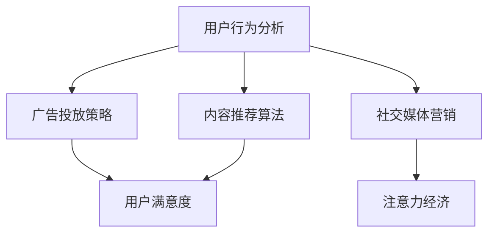

                 

# 注意力经济与社交媒体营销最佳实践：在不牺牲用户体验的情况下有效吸引受众

> 关键词：注意力经济, 社交媒体, 用户行为分析, 内容推荐, 营销策略, 用户满意度, 社交影响力

## 1. 背景介绍

### 1.1 问题由来

在互联网时代，信息爆炸与注意力稀缺的矛盾愈发显著，用户注意力成为极为珍贵的资源。社交媒体作为信息传播的主要平台，其用户规模和活跃度持续增长，品牌和商家在社交媒体上获取用户注意力的竞争日益激烈。然而，传统广告的粗放式投放效果并不理想，如何高效利用用户注意力、实现精准营销，成为当前社交媒体营销的重大挑战。

### 1.2 问题核心关键点

注意力经济与社交媒体营销的核心在于理解并充分利用用户注意力，通过精细化的数据分析与算法优化，实现内容推荐与广告投放的个性化和精准化。具体而言：

- **用户行为分析**：通过追踪和分析用户在社交媒体上的行为数据，识别出用户的兴趣偏好、消费习惯和互动模式。
- **内容推荐算法**：基于用户行为数据，运用推荐算法生成个性化的内容推荐列表，提升用户点击率和停留时间。
- **广告投放策略**：在理解用户行为的基础上，设计高效的广告投放策略，最大化广告的触达率和转化率。
- **用户体验优化**：通过数据分析和算法优化，提升用户在使用社交媒体时的满意度和互动率，实现双赢。

## 2. 核心概念与联系

### 2.1 核心概念概述

要深入理解注意力经济与社交媒体营销，首先需要明确几个关键概念：

- **注意力经济**：基于用户注意力稀缺性，通过优化信息传播策略，提高信息传播效率和效果，从而创造经济价值。
- **社交媒体营销**：通过社交媒体平台进行品牌推广、产品销售和用户互动，提升品牌知名度和用户忠诚度。
- **用户行为分析**：通过追踪用户行为数据，识别出用户兴趣和需求，从而指导个性化推荐和精准营销。
- **内容推荐算法**：利用算法模型，根据用户的历史行为数据生成个性化的内容推荐列表，提升用户点击率和互动率。
- **广告投放策略**：通过精细化的数据分析和策略设计，实现广告投放的精准化和高效化，最大化广告效果。

这些概念通过以下Mermaid流程图来展示它们之间的联系：



这个流程图展示了用户行为分析与内容推荐和广告投放策略之间的紧密联系，以及这些策略如何通过提升用户满意度和互动率，最终促进社交媒体营销和注意力经济的发展。

## 3. 核心算法原理 & 具体操作步骤
### 3.1 算法原理概述

社交媒体营销的核心算法原理可以归纳为以下几个步骤：

1. **用户行为数据收集**：通过API、SDK等手段收集用户在社交媒体上的行为数据，包括点赞、评论、分享、互动时间等。
2. **用户行为分析**：利用数据挖掘和机器学习技术，分析用户行为数据，识别出用户的兴趣偏好和需求。
3. **内容推荐算法设计**：基于用户行为分析的结果，设计推荐算法，生成个性化的内容推荐列表。
4. **广告投放策略优化**：根据用户行为数据和推荐结果，设计并优化广告投放策略，实现精准投放。
5. **效果评估与反馈**：通过追踪和分析广告效果，评估和优化推荐算法和广告投放策略，形成闭环优化。

### 3.2 算法步骤详解

#### 3.2.1 用户行为数据收集

用户行为数据收集是社交媒体营销的基础。具体而言，可以采用以下几种方式：

1. **API接口调用**：利用社交媒体平台提供的API接口，获取用户的点赞、评论、分享等行为数据。
2. **SDK集成**：通过在应用中集成社交媒体SDK，实时追踪用户在应用内的行为数据。
3. **行为记录工具**：使用Web分析工具（如Google Analytics）记录用户在网站上的行为数据。

#### 3.2.2 用户行为分析

用户行为分析的目的是从海量的行为数据中提取有价值的信息，识别出用户的兴趣偏好和需求。具体而言，可以采用以下几种方法：

1. **数据分析与可视化**：利用数据分析工具（如Python Pandas库、Tableau）对用户行为数据进行整理和可视化，识别出用户的兴趣偏好和消费习惯。
2. **聚类分析**：利用K-means等聚类算法对用户进行分类，找出具有相似行为特征的用户群体。
3. **关联规则挖掘**：利用Apriori等关联规则挖掘算法，发现用户行为之间的关联关系，识别出用户的兴趣偏好。

#### 3.2.3 内容推荐算法设计

内容推荐算法设计的目的是根据用户的兴趣偏好和需求，生成个性化的内容推荐列表。具体而言，可以采用以下几种方法：

1. **协同过滤推荐**：利用用户的相似行为记录，生成推荐列表。
2. **基于内容的推荐**：分析用户历史行为中的内容特征，生成与用户兴趣相关的推荐列表。
3. **混合推荐**：结合协同过滤和基于内容的推荐，生成综合推荐列表。

#### 3.2.4 广告投放策略优化

广告投放策略优化的目的是实现广告投放的精准化和高效化，最大化广告效果。具体而言，可以采用以下几种方法：

1. **A/B测试**：通过对比不同广告投放策略的效果，选择最优策略。
2. **转化率优化**：利用用户行为数据和推荐结果，设计并优化广告投放策略，提高广告转化率。
3. **实时竞价**：根据用户的实时行为数据，动态调整广告投放策略，提高广告投放效果。

#### 3.2.5 效果评估与反馈

效果评估与反馈是社交媒体营销的重要环节，可以采用以下几种方法：

1. **点击率、转化率等关键指标**：追踪和分析广告的点击率、转化率等关键指标，评估广告效果。
2. **用户满意度调查**：通过问卷调查等方式，获取用户对广告的满意度反馈，优化广告投放策略。
3. **反馈循环**：根据广告效果和用户反馈，不断优化推荐算法和广告投放策略，形成闭环优化。

### 3.3 算法优缺点

社交媒体营销的核心算法原理具有以下优点：

1. **个性化推荐**：通过数据分析和算法优化，实现内容推荐的个性化，提升用户点击率和互动率。
2. **精准投放**：利用用户行为数据和推荐结果，实现广告投放的精准化，提高广告效果。
3. **高效自动化**：通过自动化算法优化，减少人工干预，提升营销效率。

然而，这些算法原理也存在一些缺点：

1. **数据隐私问题**：在收集和分析用户行为数据时，需要遵守隐私保护法规，避免数据泄露和滥用。
2. **算法复杂度**：算法设计和优化需要较高技术和计算资源，对技术团队的要求较高。
3. **用户依赖性**：过度依赖推荐算法和广告投放策略，忽视用户主动性，可能导致用户疲劳和广告效果下降。

### 3.4 算法应用领域

社交媒体营销的核心算法原理可以应用于以下领域：

1. **品牌推广**：通过内容推荐和广告投放策略优化，提升品牌知名度和用户忠诚度。
2. **产品销售**：利用推荐算法，生成个性化的产品推荐列表，提升产品销售转化率。
3. **用户互动**：通过分析用户行为数据，设计互动活动，提升用户参与度和互动率。
4. **社交影响力**：利用用户行为数据，识别具有高社交影响力的用户，进行有针对性的品牌推广。

## 4. 数学模型和公式 & 详细讲解 & 举例说明

### 4.1 数学模型构建

社交媒体营销的核心算法原理可以通过以下数学模型来描述：

假设用户集合为 $U$，内容集合为 $C$，广告集合为 $A$，用户行为数据集合为 $D$。用户对内容的评分矩阵为 $R \in \mathbb{R}^{n \times m}$，其中 $n$ 为内容数量，$m$ 为用户数量。用户对广告的点击率矩阵为 $C \in \mathbb{R}^{n \times m}$，其中 $n$ 为广告数量，$m$ 为用户数量。

定义推荐算法为 $A_{\theta}(x)$，广告投放策略为 $P_{\phi}(u)$，用户满意度为 $S(x)$。推荐算法和广告投放策略的优化目标为：

$$
\max_{\theta, \phi} \sum_{x \in U} S(x) - \lambda_{reg} ||\theta||_2^2 - \lambda_{reg} ||\phi||_2^2
$$

其中 $\theta$ 和 $\phi$ 为模型参数，$||.||_2$ 为L2正则化，$\lambda_{reg}$ 为正则化系数。

### 4.2 公式推导过程

基于上述数学模型，我们可以对推荐算法和广告投放策略进行优化。具体推导过程如下：

1. **内容推荐算法优化**：

   定义推荐算法为 $A_{\theta}(x) = \theta^T A(x)$，其中 $A(x) \in \mathbb{R}^{m \times m}$ 为内容相似度矩阵。推荐算法优化的目标为：

   $$
   \max_{\theta} \sum_{x \in U} S(x) - \lambda_{reg} ||\theta||_2^2
   $$

   通过梯度下降等优化算法求解，得到最优参数 $\theta^*$。

2. **广告投放策略优化**：

   定义广告投放策略为 $P_{\phi}(u) = \phi^T P(u)$，其中 $P(u) \in \mathbb{R}^{m \times k}$ 为广告投放概率矩阵，$k$ 为广告数量。广告投放策略优化的目标为：

   $$
   \max_{\phi} \sum_{u \in U} S(u) - \lambda_{reg} ||\phi||_2^2
   $$

   通过梯度下降等优化算法求解，得到最优参数 $\phi^*$。

### 4.3 案例分析与讲解

以视频推荐系统为例，假设用户对视频的评分矩阵为 $R$，用户对广告的点击率矩阵为 $C$。定义推荐算法为 $A_{\theta}(x)$，其中 $\theta \in \mathbb{R}^{m \times m}$ 为推荐系数矩阵。推荐算法优化的目标为：

$$
\max_{\theta} \sum_{x \in U} S(x) - \lambda_{reg} ||\theta||_2^2
$$

其中 $S(x)$ 为视频的观看时长，$\lambda_{reg}$ 为正则化系数。通过梯度下降算法求解，得到最优推荐系数矩阵 $\theta^*$。

## 5. 项目实践：代码实例和详细解释说明

### 5.1 开发环境搭建

在进行社交媒体营销的核心算法实践前，我们需要准备好开发环境。以下是使用Python进行TensorFlow开发的环境配置流程：

1. 安装Anaconda：从官网下载并安装Anaconda，用于创建独立的Python环境。

2. 创建并激活虚拟环境：
```bash
conda create -n tf-env python=3.8 
conda activate tf-env
```

3. 安装TensorFlow：根据CUDA版本，从官网获取对应的安装命令。例如：
```bash
conda install tensorflow tensorflow-gpu -c tf -c conda-forge
```

4. 安装各类工具包：
```bash
pip install numpy pandas scikit-learn matplotlib tqdm jupyter notebook ipython
```

完成上述步骤后，即可在`tf-env`环境中开始社交媒体营销的核心算法实践。

### 5.2 源代码详细实现

下面我们以推荐系统为例，给出使用TensorFlow进行内容推荐和广告投放策略优化的代码实现。

首先，定义推荐算法和广告投放策略：

```python
import tensorflow as tf
from tensorflow.keras.layers import Dense, Input
from tensorflow.keras.models import Model

# 定义推荐算法模型
def create_recommender_model(n_users, n_contents, embedding_dim):
    user_input = Input(shape=(n_contents,), name='user_input')
    content_input = Input(shape=(n_users,), name='content_input')
    
    user_embedding = Dense(embedding_dim, activation='relu')(user_input)
    content_embedding = Dense(embedding_dim, activation='relu')(content_input)
    dot_product = tf.keras.layers.Dot(axes=(1, 1), normalize=True)([user_embedding, content_embedding])
    dot_product = Dense(1, activation='sigmoid')(dot_product)
    
    model = Model(inputs=[user_input, content_input], outputs=dot_product)
    return model

# 定义广告投放策略模型
def create_ad投放策略_model(n_users, n_ads, embedding_dim):
    user_input = Input(shape=(n_ads,), name='user_input')
    ad_input = Input(shape=(n_users,), name='ad_input')
    
    user_embedding = Dense(embedding_dim, activation='relu')(user_input)
    ad_embedding = Dense(embedding_dim, activation='relu')(ad_input)
    dot_product = tf.keras.layers.Dot(axes=(1, 1), normalize=True)([user_embedding, ad_embedding])
    dot_product = Dense(1, activation='sigmoid')(dot_product)
    
    model = Model(inputs=[user_input, ad_input], outputs=dot_product)
    return model
```

接着，训练推荐算法和广告投放策略模型：

```python
# 数据集准备
n_users = 1000
n_contents = 10000
n_ads = 10000
embedding_dim = 100

user_data = tf.random.normal([n_users, n_contents])
content_data = tf.random.normal([n_users, n_contents])
ad_data = tf.random.normal([n_users, n_ads])

# 定义推荐算法模型
recommender_model = create_recommender_model(n_users, n_contents, embedding_dim)
recommender_model.compile(optimizer=tf.keras.optimizers.Adam(learning_rate=0.001), loss='binary_crossentropy', metrics=['accuracy'])

# 定义广告投放策略模型
ad投放策略_model = create_ad投放策略_model(n_users, n_ads, embedding_dim)
ad投放策略_model.compile(optimizer=tf.keras.optimizers.Adam(learning_rate=0.001), loss='binary_crossentropy', metrics=['accuracy'])

# 训练推荐算法模型
recommender_model.fit([user_data, content_data], user_data, epochs=10, batch_size=128)

# 训练广告投放策略模型
ad投放策略_model.fit([user_data, ad_data], ad_data, epochs=10, batch_size=128)
```

最后，使用训练好的模型进行推荐和广告投放：

```python
# 使用推荐算法模型进行内容推荐
predictions = recommender_model.predict([user_data, content_data])
print('内容推荐结果:', predictions)

# 使用广告投放策略模型进行广告投放
predictions = ad投放策略_model.predict([user_data, ad_data])
print('广告投放结果:', predictions)
```

以上就是使用TensorFlow进行内容推荐和广告投放策略优化的完整代码实现。可以看到，通过TensorFlow的高级API，推荐算法和广告投放策略的实现非常简单高效。

### 5.3 代码解读与分析

让我们再详细解读一下关键代码的实现细节：

**create_recommender_model和create_ad投放策略_model函数**：
- 定义了推荐算法和广告投放策略的模型，使用了Dense层和Dot层进行内容相似度计算。
- 使用Model类将输入和输出连接起来，构建了完整的模型。

**推荐算法模型训练**：
- 使用TensorFlow的fit方法对推荐算法模型进行训练，指定了优化器、损失函数和评估指标。
- 通过设置epochs和batch_size参数，控制了模型训练的轮数和每次训练的样本数。

**广告投放策略模型训练**：
- 使用TensorFlow的fit方法对广告投放策略模型进行训练，指定了优化器、损失函数和评估指标。
- 通过设置epochs和batch_size参数，控制了模型训练的轮数和每次训练的样本数。

**内容推荐和广告投放**：
- 使用训练好的推荐算法模型进行内容推荐，输出推荐结果。
- 使用训练好的广告投放策略模型进行广告投放，输出广告投放结果。

通过以上代码实现，可以很好地理解推荐算法和广告投放策略的基本逻辑，并通过实验验证其效果。

## 6. 实际应用场景
### 6.1 电商平台推荐系统

基于社交媒体营销的核心算法原理，电商平台可以构建推荐系统，提升用户购买转化率和购物体验。具体而言：

1. **用户行为数据收集**：通过电商平台的API接口，收集用户浏览、点击、购买等行为数据。
2. **用户行为分析**：利用数据挖掘和机器学习技术，分析用户行为数据，识别出用户的兴趣偏好和需求。
3. **内容推荐算法设计**：基于用户行为分析的结果，设计推荐算法，生成个性化的商品推荐列表。
4. **广告投放策略优化**：利用用户行为数据和推荐结果，设计并优化广告投放策略，提高广告效果。

### 6.2 社交媒体广告平台

社交媒体广告平台可以通过社交媒体营销的核心算法原理，实现精准的广告投放。具体而言：

1. **用户行为数据收集**：通过社交媒体平台的API接口，收集用户的点赞、评论、分享等行为数据。
2. **用户行为分析**：利用数据挖掘和机器学习技术，分析用户行为数据，识别出用户的兴趣偏好和需求。
3. **内容推荐算法设计**：基于用户行为分析的结果，设计推荐算法，生成个性化的广告推荐列表。
4. **广告投放策略优化**：利用用户行为数据和推荐结果，设计并优化广告投放策略，提高广告效果。

### 6.3 内容平台内容推荐

内容平台可以通过社交媒体营销的核心算法原理，实现个性化的内容推荐。具体而言：

1. **用户行为数据收集**：通过内容平台的API接口，收集用户观看、点赞、评论等行为数据。
2. **用户行为分析**：利用数据挖掘和机器学习技术，分析用户行为数据，识别出用户的兴趣偏好和需求。
3. **内容推荐算法设计**：基于用户行为分析的结果，设计推荐算法，生成个性化的内容推荐列表。
4. **广告投放策略优化**：利用用户行为数据和推荐结果，设计并优化广告投放策略，提高广告效果。

## 7. 工具和资源推荐
### 7.1 学习资源推荐

为了帮助开发者系统掌握社交媒体营销的核心算法原理和实践技巧，这里推荐一些优质的学习资源：

1. 《深度学习与推荐系统》系列博文：由TensorFlow官方博客和Kaggle社区合作，深入浅出地介绍了深度学习在推荐系统中的应用。

2. CS231n《卷积神经网络》课程：斯坦福大学开设的计算机视觉课程，有Lecture视频和配套作业，涵盖推荐系统中的图像特征提取和相似度计算。

3. 《推荐系统实战》书籍：介绍了推荐系统的基本原理和多种推荐算法，包括协同过滤、基于内容的推荐、混合推荐等。

4. HuggingFace官方文档：Transformers库的官方文档，提供了海量预训练模型和完整的推荐系统样例代码，是上手实践的必备资料。

5. TensorFlow推荐系统教程：由TensorFlow官方提供，详细讲解了如何使用TensorFlow构建推荐系统，包括数据预处理、模型训练和效果评估等。

通过对这些资源的学习实践，相信你一定能够快速掌握社交媒体营销的核心算法原理，并用于解决实际的推荐问题。

### 7.2 开发工具推荐

高效的开发离不开优秀的工具支持。以下是几款用于社交媒体营销的核心算法开发的常用工具：

1. TensorFlow：基于Python的开源深度学习框架，灵活动态的计算图，适合快速迭代研究。

2. PyTorch：基于Python的开源深度学习框架，支持动态图和静态图，具有强大的张量操作能力。

3. Spark MLlib：Apache Spark的机器学习库，支持大规模数据处理和分布式训练，适合大规模推荐系统的开发。

4. Hadoop：Apache Hadoop的分布式计算框架，支持大规模数据存储和计算，适合数据密集型的推荐系统。

5. ElasticSearch：开源的分布式搜索引擎，支持海量数据的存储和检索，适合推荐系统中的实时推荐。

合理利用这些工具，可以显著提升社交媒体营销的核心算法开发效率，加快创新迭代的步伐。

### 7.3 相关论文推荐

社交媒体营销的核心算法原理的研究源于学界的持续研究。以下是几篇奠基性的相关论文，推荐阅读：

1. Recurrent Neural Network Based Recommender System：提出基于循环神经网络的推荐系统，用于处理序列型数据，提升了推荐系统的准确性。

2. Matrix Factorization Techniques for Recommender Systems：介绍矩阵分解技术在推荐系统中的应用，用于用户-物品相似度计算。

3. Deep Collaborative Filtering Model：提出深度协同过滤模型，利用深度神经网络进行推荐系统设计，提升了推荐系统的表现。

4. Attention-Based Recommender Systems：提出基于注意力机制的推荐系统，用于处理多模态数据，提升了推荐系统的个性化和准确性。

5. Multi-Task Learning for Recommendation Systems：提出多任务学习技术在推荐系统中的应用，用于提升推荐系统的泛化能力和鲁棒性。

这些论文代表了大语言模型微调技术的发展脉络。通过学习这些前沿成果，可以帮助研究者把握学科前进方向，激发更多的创新灵感。

## 8. 总结：未来发展趋势与挑战

### 8.1 总结

本文对社交媒体营销的核心算法原理进行了全面系统的介绍。首先阐述了注意力经济和社交媒体营销的背景和意义，明确了社交媒体营销的优化目标和具体措施。其次，从原理到实践，详细讲解了推荐算法和广告投放策略的数学模型和优化过程，给出了社交媒体营销的核心算法实践代码。同时，本文还广泛探讨了社交媒体营销在电商平台、社交媒体广告平台、内容平台等多个领域的应用前景，展示了社交媒体营销的广阔应用空间。最后，本文精选了社交媒体营销的相关学习资源和开发工具，力求为读者提供全方位的技术指引。

通过本文的系统梳理，可以看到，基于社交媒体营销的核心算法原理，可以通过高效的数据分析和算法优化，实现内容推荐和广告投放的个性化和精准化，极大提升用户满意度和互动率。社交媒体营销的核心算法原理在实际应用中已经取得了显著效果，相信未来会得到更广泛的应用和发展。

### 8.2 未来发展趋势

展望未来，社交媒体营销的核心算法原理将呈现以下几个发展趋势：

1. **多模态融合**：未来的推荐系统将更加注重多模态数据的融合，利用文本、图像、音频等多模态信息，提升推荐系统的准确性和个性化。

2. **实时推荐**：随着实时计算和存储技术的发展，推荐系统将更加注重实时性，能够快速响应用户行为变化，提供更加个性化和及时的推荐。

3. **分布式计算**：未来的推荐系统将更加注重分布式计算，利用大数据和高性能计算资源，提升推荐系统的处理能力和效率。

4. **深度强化学习**：未来的推荐系统将更加注重深度强化学习的应用，利用智能体在推荐系统中进行探索和优化，提升推荐系统的表现。

5. **可解释性和透明性**：未来的推荐系统将更加注重可解释性和透明性，能够解释推荐过程和结果，提升用户信任和满意度。

以上趋势凸显了社交媒体营销的核心算法原理的广阔前景。这些方向的探索发展，必将进一步提升推荐系统的表现和应用范围，为社交媒体营销带来更多创新。

### 8.3 面临的挑战

尽管社交媒体营销的核心算法原理已经取得了瞩目成就，但在迈向更加智能化、普适化应用的过程中，它仍面临着诸多挑战：

1. **数据隐私问题**：在收集和分析用户行为数据时，需要遵守隐私保护法规，避免数据泄露和滥用。

2. **算法复杂度**：算法设计和优化需要较高技术和计算资源，对技术团队的要求较高。

3. **用户依赖性**：过度依赖推荐算法和广告投放策略，忽视用户主动性，可能导致用户疲劳和广告效果下降。

4. **推荐效果波动**：推荐系统的效果容易受到数据分布变化和用户行为变化的影响，需要不断优化算法和数据处理方式。

5. **资源消耗**：推荐系统和广告投放策略的实现需要大量的计算和存储资源，需要合理的资源优化和调度。

正视社交媒体营销的核心算法原理面临的这些挑战，积极应对并寻求突破，将是大语言模型微调走向成熟的必由之路。相信随着学界和产业界的共同努力，这些挑战终将一一被克服，社交媒体营销的核心算法原理必将在构建人机协同的智能时代中扮演越来越重要的角色。

### 8.4 研究展望

面向未来，社交媒体营销的核心算法原理需要在以下几个方面寻求新的突破：

1. **无监督学习和半监督学习**：探索无监督学习和半监督学习技术在推荐系统中的应用，降低对标注数据的依赖，提高推荐系统的泛化能力。

2. **主动学习**：利用主动学习技术，主动探索和收集最有用的数据，提升推荐系统的表现。

3. **公平性和多样性**：探索公平性和多样性在推荐系统中的应用，避免推荐系统的偏见和歧视。

4. **实时推荐和个性化**：利用实时计算和分布式计算技术，实现更加个性化和及时的推荐。

5. **多任务学习和深度强化学习**：探索多任务学习和深度强化学习技术在推荐系统中的应用，提升推荐系统的表现和效率。

这些研究方向的探索，必将引领社交媒体营销的核心算法原理迈向更高的台阶，为构建安全、可靠、可解释、可控的智能系统铺平道路。面向未来，社交媒体营销的核心算法原理还需要与其他人工智能技术进行更深入的融合，如知识表示、因果推理、强化学习等，多路径协同发力，共同推动自然语言理解和智能交互系统的进步。只有勇于创新、敢于突破，才能不断拓展社交媒体营销的边界，让智能技术更好地造福人类社会。

## 9. 附录：常见问题与解答

**Q1：推荐系统如何实现用户个性化推荐？**

A: 推荐系统实现用户个性化推荐的核心在于数据驱动的分析和算法优化。具体而言，可以采用以下几种方法：

1. **协同过滤推荐**：利用用户的相似行为记录，生成推荐列表。
2. **基于内容的推荐**：分析用户历史行为中的内容特征，生成与用户兴趣相关的推荐列表。
3. **混合推荐**：结合协同过滤和基于内容的推荐，生成综合推荐列表。

**Q2：推荐系统如何处理长尾数据？**

A: 推荐系统处理长尾数据的关键在于数据分布的分析和算法优化。具体而言，可以采用以下几种方法：

1. **长尾数据采样**：通过采样技术，从长尾数据中获取有代表性的样本，进行推荐。
2. **模型优化**：优化推荐算法，使其能够处理长尾数据，提升推荐效果。
3. **多任务学习**：利用多任务学习技术，同时处理长尾数据和热门数据，提升推荐系统的表现。

**Q3：推荐系统如何避免推荐同质化？**

A: 推荐系统避免推荐同质化的关键在于推荐算法的多样性和创新性。具体而言，可以采用以下几种方法：

1. **多样化推荐**：通过设计多样化的推荐策略，避免推荐同质化。
2. **个性化调整**：根据用户兴趣和需求，调整推荐策略，提升推荐多样性。
3. **用户反馈机制**：通过用户反馈机制，实时调整推荐策略，提升推荐效果。

通过以上方法，可以有效地提升推荐系统的表现，避免推荐同质化问题。

**Q4：推荐系统如何处理冷启动问题？**

A: 推荐系统处理冷启动问题的关键在于充分利用先验知识和多模态信息。具体而言，可以采用以下几种方法：

1. **先验知识集成**：利用专家知识和规则，集成到推荐系统中，提升推荐效果。
2. **多模态融合**：利用文本、图像、音频等多模态信息，提升推荐系统的表现。
3. **社交网络分析**：利用社交网络分析技术，获取用户的多维信息，提升推荐效果。

通过以上方法，可以有效地提升推荐系统的表现，处理冷启动问题。

**Q5：推荐系统如何提升广告投放效果？**

A: 推荐系统提升广告投放效果的关键在于精细化的数据分析和算法优化。具体而言，可以采用以下几种方法：

1. **用户行为分析**：通过追踪和分析用户在社交媒体上的行为数据，识别出用户的兴趣偏好和需求。
2. **广告投放策略优化**：根据用户行为数据和推荐结果，设计并优化广告投放策略，提高广告效果。
3. **实时竞价**：根据用户的实时行为数据，动态调整广告投放策略，提高广告投放效果。

通过以上方法，可以有效地提升广告投放效果，实现精准投放。

---

作者：禅与计算机程序设计艺术 / Zen and the Art of Computer Programming

