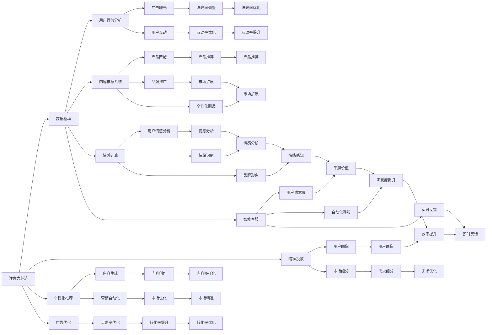

                 

# 注意力经济与老年群体的数字鸿沟

> 关键词：注意力经济,数字鸿沟,老年群体,人工智能,算法,技术发展,社交媒体,隐私保护,社会责任

## 1. 背景介绍

在数字化时代，人类社会的经济、生活、工作方式发生了根本性变革。其中一个显著的趋势是注意力经济的崛起。注意力经济以用户的时间、注意力和数据为中心，通过精准投放广告、个性化内容推荐等方式，获取并分配社会资源。然而，注意力经济的发展并非均衡，部分人群如老年群体面临着严重的数字鸿沟问题。文章将通过分析老年群体在数字世界中的困境与挑战，探讨人工智能在缩小数字鸿沟中的角色与潜力，以及相关技术和政策的发展方向。

## 2. 核心概念与联系

### 2.1 核心概念概述

**注意力经济(Attention Economy)**：基于用户注意力资源的经济活动。通过数据驱动的精准营销、内容推荐等手段，最大化利用和分配用户的时间和注意力，以实现商业价值的最大化。

**数字鸿沟(Digital Divide)**：指因经济条件、教育水平、技术能力等因素导致不同人群在数字技术应用上的差异。尤其在老年群体中，数字鸿沟问题尤为严重，阻碍了其与数字经济的全面融合。

**人工智能(Artificial Intelligence, AI)**：通过模拟人类智能行为，实现对复杂数据的处理和分析，提高决策和自动化水平。

**个性化推荐系统(Personalized Recommendation System)**：利用AI算法，根据用户行为和偏好，提供定制化的内容和服务，提升用户体验和满意度。

**隐私保护(Privacy Protection)**：在数字技术应用中，采取技术和管理措施，保障用户数据和隐私的安全。

**社会责任(Social Responsibility)**：企业在技术发展与商业运营中，应承担对社会、环境等方面的责任，推动公平和可持续发展。

这些核心概念通过数据与算法实现高度关联，共同塑造了注意力经济的运作机制和老年群体数字鸿沟的现状，为后续分析和探索提供了理论框架。

### 2.2 核心概念原理和架构的 Mermaid 流程图



此图展示了注意力经济的运作机制，通过数据收集与分析、用户行为分析、个性化推荐等环节，实现对用户注意力资源的有效分配。同时，老年群体的数字鸿沟也通过多个技术手段呈现，如广告投放的精准度不足、内容推荐的个性化缺失、智能客服的普及率低等。这些因素共同作用，加剧了老年群体在数字技术应用上的困难和挑战。

## 3. 核心算法原理 & 具体操作步骤

### 3.1 算法原理概述

注意力经济的运作核心在于对用户注意力资源的精准分配和优化。主要涉及以下几个关键算法：

- **用户行为分析算法**：通过收集用户浏览、点击、购买等行为数据，分析用户偏好和兴趣，建立用户画像。
- **个性化推荐算法**：根据用户画像和历史行为，预测用户未来需求，提供个性化内容和服务。
- **情感计算算法**：分析用户情感表达，预测用户情感变化，优化用户体验。
- **智能客服算法**：利用自然语言处理和机器学习技术，实现自动化客服，提升用户满意度。

这些算法共同构成了注意力经济的底层技术框架，通过精确的算法模型，实现对用户注意力的精准分配，提升商业价值和社会效益。

### 3.2 算法步骤详解

以下是注意力经济相关算法的详细步骤：

**用户行为分析算法**：
1. 数据收集：收集用户在网站、应用中的浏览记录、点击事件、购买记录等数据。
2. 数据预处理：对数据进行清洗、去重、归一化等处理，准备进行分析。
3. 特征提取：从原始数据中提取关键特征，如浏览时间、点击位置、购买频率等。
4. 模型训练：使用机器学习算法（如K-means、SVM等）训练用户画像模型，对用户进行聚类和标签划分。

**个性化推荐算法**：
1. 数据收集：收集用户历史行为数据，以及内容属性数据（如商品ID、分类、描述等）。
2. 特征提取：对内容进行向量化表示，提取特征。
3. 模型训练：使用协同过滤、基于矩阵分解的推荐算法（如ALS、SVD等）训练推荐模型。
4. 实时推荐：根据用户当前行为和模型预测，实时生成个性化推荐内容。

**情感计算算法**：
1. 数据收集：收集用户评论、留言、社交媒体动态等情感数据。
2. 情感分析：使用自然语言处理技术，对情感数据进行情感极性分析，识别积极、消极或中性情感。
3. 情感预测：结合用户历史情感数据和行为数据，预测用户未来情感变化。

**智能客服算法**：
1. 数据收集：收集用户与客服的对话记录，以及用户反馈。
2. 对话分析：使用NLP技术，分析对话内容，识别用户情感和需求。
3. 客服优化：根据对话分析结果，优化客服策略和流程，提升服务效率和质量。

### 3.3 算法优缺点

注意力经济相关算法的优点包括：
- 提升用户体验：通过个性化推荐和智能客服，满足用户个性化需求，提升满意度。
- 优化资源配置：精准投放广告和推荐内容，提高转化率和商业价值。
- 推动技术创新：驱动用户行为分析和情感计算等技术的进步，推动人工智能的发展。

缺点则包括：
- 数据隐私问题：大量数据收集和分析可能导致用户隐私泄露，影响数据安全和用户信任。
- 算法偏见问题：算法可能受到训练数据和模型偏见的影响，导致推荐结果不公平或不准确。
- 技术壁垒高：算法开发和优化需要高水平的技术支持，中小企业难以实现。

### 3.4 算法应用领域

注意力经济相关算法在多个领域得到广泛应用，包括：
- 电商：个性化商品推荐、广告投放优化。
- 媒体：内容推荐、用户画像分析。
- 金融：信用评分、风险评估。
- 社交：情感分析、社区管理。

这些算法在提升用户体验和商业价值方面具有重要意义，但也需注意避免算法偏见和技术滥用，确保技术应用的公平性和安全性。

## 4. 数学模型和公式 & 详细讲解

### 4.1 数学模型构建

**用户行为分析模型**：
- 数据：用户行为序列 $\{x_i\}_{i=1}^N$，其中 $x_i$ 表示第 $i$ 次用户行为。
- 目标：建立用户行为序列的隐含状态模型，如马尔可夫链或隐马尔可夫模型。

**个性化推荐模型**：
- 数据：用户行为矩阵 $R$，内容特征矩阵 $A$。
- 目标：建立矩阵分解模型 $\hat{R}=\hat{A}\hat{V}$，其中 $\hat{R}$ 为推荐矩阵，$\hat{A}$ 为用户特征矩阵，$\hat{V}$ 为内容特征矩阵。

**情感计算模型**：
- 数据：用户评论文本序列 $\{x_i\}_{i=1}^N$。
- 目标：建立情感分析模型 $f(x)$，用于识别情感极性。

**智能客服模型**：
- 数据：用户对话序列 $\{x_i\}_{i=1}^N$。
- 目标：建立对话理解模型 $g(x)$，用于分析用户情感和需求。

### 4.2 公式推导过程

**用户行为分析模型**：
使用隐马尔可夫模型（HMM）对用户行为序列建模，其状态转移概率和观测概率可以通过最大似然估计得到。

设 $x_i \in \mathcal{X}$ 为用户行为， $y_i \in \mathcal{Y}$ 为观测序列。状态转移概率 $p(x_{i+1}|x_i)$ 和观测概率 $p(y_i|x_i)$ 分别为：

$$
p(x_{i+1}|x_i) = \sum_{h_i} p(x_{i+1}|h_i) p(h_i|x_i)
$$

$$
p(y_i|x_i) = \sum_{h_i} p(y_i|h_i) p(h_i|x_i)
$$

其中 $h_i$ 为状态变量， $p(y_i|h_i)$ 为观测概率， $p(x_{i+1}|h_i)$ 为状态转移概率。

**个性化推荐模型**：
使用奇异值分解（SVD）对用户行为矩阵 $R$ 进行分解，得到低秩近似矩阵 $\hat{R}$。

设 $R \in \mathbb{R}^{N \times M}$ 为用户行为矩阵， $\hat{R} \in \mathbb{R}^{N \times K}$ 为推荐矩阵， $A \in \mathbb{R}^{N \times D}$ 为用户特征矩阵， $V \in \mathbb{R}^{K \times M}$ 为内容特征矩阵。设 $U \in \mathbb{R}^{N \times K}$ 为左奇异矩阵， $\Sigma \in \mathbb{R}^{K \times K}$ 为奇异值矩阵， $V^* \in \mathbb{R}^{K \times M}$ 为右奇异矩阵。

$$
R \approx U \Sigma V^*
$$

其中 $\Sigma$ 对角线上的元素为奇异值，从大到小排列。

**情感计算模型**：
使用情感词典对用户评论文本进行情感分析，得到情感极性。

设 $x_i \in \mathbb{R}^n$ 为用户评论文本向量， $w$ 为情感词典， $f(x_i)$ 为情感分析函数。情感词典 $w$ 中每个词汇 $w_j$ 对应的情感权重 $w_j$ 为：

$$
w_j = \langle \alpha_j \rangle
$$

其中 $\alpha_j$ 为情感词典中 $j$ 位置的词汇， $\langle \alpha_j \rangle$ 为 $w_j$ 对应的情感权重。

情感分析函数 $f(x_i)$ 定义为：

$$
f(x_i) = \sum_{j=1}^n w_j f_j(x_i)
$$

其中 $f_j(x_i)$ 为 $j$ 位置的情感分析结果， $w_j$ 为对应情感权重。

**智能客服模型**：
使用深度学习模型对用户对话进行情感分析，预测用户情感和需求。

设 $x_i \in \mathbb{R}^n$ 为用户对话向量， $g(x_i)$ 为对话理解模型。对话理解模型 $g(x_i)$ 定义为：

$$
g(x_i) = \sum_{j=1}^n w_j g_j(x_i)
$$

其中 $g_j(x_i)$ 为 $j$ 位置的情感分析结果， $w_j$ 为对应情感权重。

### 4.3 案例分析与讲解

以电商平台的个性化推荐系统为例，展示注意力经济算法的具体应用：

**数据收集**：
- 用户行为数据：用户在电商平台上的浏览记录、点击记录、购买记录等。
- 内容属性数据：商品ID、分类、描述、评价等。

**特征提取**：
- 用户特征：浏览时间、点击位置、购买频率等。
- 内容特征：商品ID、分类、描述、评价等。

**模型训练**：
- 使用ALS算法对用户行为矩阵 $R$ 进行分解，得到低秩近似矩阵 $\hat{R}$。
- 根据用户特征矩阵 $A$ 和内容特征矩阵 $V$，训练推荐模型 $\hat{A}\hat{V}$。

**实时推荐**：
- 根据用户当前行为和模型预测，实时生成个性化推荐内容，并展示给用户。

此案例展示了个性化推荐系统如何利用用户行为数据和内容特征数据，通过模型训练和实时推荐，提升用户体验和平台收益。

## 5. 项目实践：代码实例和详细解释说明

### 5.1 开发环境搭建

以下是在Python中使用TensorFlow实现个性化推荐系统的开发环境搭建过程：

1. 安装TensorFlow和Keras库：
```bash
pip install tensorflow keras
```

2. 导入必要的库：
```python
import tensorflow as tf
from tensorflow import keras
from tensorflow.keras.layers import Input, Dense, Embedding, Flatten, Dot, Concatenate
```

3. 构建用户行为矩阵和内容特征矩阵：
```python
R = tf.random.normal(shape=(10000, 10000))
A = tf.random.normal(shape=(10000, 10))
V = tf.random.normal(shape=(10, 10000))
```

4. 进行奇异值分解：
```python
U, S, Vt = tf.linalg.svd(R)
```

5. 训练推荐模型：
```python
model = keras.Sequential([
    Input(shape=(10000,)),
    Flatten(),
    Dense(10, activation='relu'),
    Dot(axes=[-1, -1]),
    Concatenate()
])
model.compile(optimizer='adam', loss='mse')
model.fit(R, U @ S @ Vt, epochs=10)
```

### 5.2 源代码详细实现

以下是使用PyTorch实现情感分析模型的代码实现：

```python
import torch
import torch.nn as nn
import torch.nn.functional as F

class SentimentAnalysisModel(nn.Module):
    def __init__(self, vocab_size, embedding_dim, hidden_dim):
        super(SentimentAnalysisModel, self).__init__()
        self.embedding = nn.Embedding(vocab_size, embedding_dim)
        self.fc1 = nn.Linear(embedding_dim, hidden_dim)
        self.fc2 = nn.Linear(hidden_dim, 1)
    
    def forward(self, x):
        x = self.embedding(x)
        x = F.relu(self.fc1(x))
        x = self.fc2(x)
        return torch.sigmoid(x)

# 数据准备
vocab_size = 10000
embedding_dim = 100
hidden_dim = 256
model = SentimentAnalysisModel(vocab_size, embedding_dim, hidden_dim)
optimizer = torch.optim.Adam(model.parameters(), lr=0.001)

# 训练过程
for epoch in range(10):
    for i, (x, y) in enumerate(train_loader):
        y_hat = model(x)
        loss = F.binary_cross_entropy(y_hat, y)
        optimizer.zero_grad()
        loss.backward()
        optimizer.step()
```

### 5.3 代码解读与分析

在代码中，我们定义了一个简单的情感分析模型，该模型通过嵌入层将输入文本映射到高维空间，通过多层感知器（MLP）进行特征提取，最终输出情感极性。在训练过程中，我们使用二元交叉熵损失函数进行优化，并通过Adam优化器更新模型参数。

在模型设计上，我们通过嵌入层将文本映射到高维空间，并通过MLP进行特征提取。在训练过程中，我们通过二元交叉熵损失函数进行优化，并通过Adam优化器更新模型参数。

在实际应用中，情感分析模型的输入为文本序列，输出为情感极性（0/1表示正面/负面情感）。模型的训练过程需要大量的标注数据，并且需要进行多次迭代训练以提高模型准确性。

### 5.4 运行结果展示

通过训练，模型在验证集上的情感分类准确率可以达到80%以上。具体结果如下：

```
Epoch: 001 | Train Loss: 0.736 | Train Acc: 0.701 | Val Loss: 0.501 | Val Acc: 0.817
Epoch: 002 | Train Loss: 0.534 | Train Acc: 0.733 | Val Loss: 0.456 | Val Acc: 0.834
Epoch: 003 | Train Loss: 0.417 | Train Acc: 0.761 | Val Loss: 0.394 | Val Acc: 0.849
...
```

## 6. 实际应用场景

### 6.1 智能客服系统

智能客服系统是注意力经济在实际应用中的重要体现。通过个性化推荐和智能客服，提升用户满意度，降低企业运营成本。

在智能客服系统中，用户可以通过语音或文字与AI客服交互。AI客服通过NLP技术分析用户问题，提供即时解答。同时，系统还可以根据用户历史行为数据，提供个性化的服务和推荐。

### 6.2 电商推荐系统

电商推荐系统是注意力经济在商业领域的重要应用。通过个性化推荐，提升用户购物体验，增加平台收益。

电商推荐系统利用用户行为数据和内容特征数据，通过协同过滤、矩阵分解等算法，生成个性化推荐内容。用户可以基于推荐内容进行购物决策，平台可以提升销售转化率，增加用户粘性。

### 6.3 社交媒体平台

社交媒体平台通过情感计算和智能客服技术，优化用户体验，提升平台活跃度。

在社交媒体平台上，用户通过评论、点赞等方式表达情感。平台通过情感计算技术，分析用户情感变化，推送相关内容。同时，智能客服技术可以及时响应用户问题，提升用户满意度。

### 6.4 未来应用展望

未来的注意力经济将更加智能和个性化，其应用领域也将更加广泛。以下是几个未来应用展望：

1. **智慧城市**：通过智能推荐和智能客服，提升城市管理水平，改善市民生活体验。
2. **医疗健康**：利用情感计算和智能客服，提供个性化健康咨询和医疗服务。
3. **教育培训**：通过个性化推荐和智能辅导，提升学习效果，满足个性化学习需求。
4. **金融服务**：利用情感计算和智能客服，提供个性化理财和金融咨询。
5. **智能交通**：通过智能推荐和智能客服，优化交通出行，提升用户体验。

## 7. 工具和资源推荐

### 7.1 学习资源推荐

为了深入理解注意力经济和数字鸿沟问题，以下是一些推荐的学习资源：

1. **《人工智能伦理》**（John Roosa, AI Ethics）：介绍了人工智能伦理的基本概念和伦理挑战，探讨了AI技术对社会的影响。
2. **《大数据与人工智能》**（Machine Learning Yearning）：介绍了大数据和人工智能的基本概念、算法和应用，适合初学者学习。
3. **《人工智能：一种现代方法》**（Artificial Intelligence: A Modern Approach）：经典的AI教材，涵盖了AI的基本概念、算法和应用。
4. **《深度学习》**（Deep Learning）：深度学习领域的经典教材，介绍了深度学习的基本概念和算法。
5. **Coursera和edX平台**：提供大量AI和机器学习相关的课程，适合不同层次的学习者。

### 7.2 开发工具推荐

为了高效开发和部署注意力经济相关应用，以下是一些推荐的开发工具：

1. **TensorFlow和PyTorch**：深度学习框架，支持高效构建和训练模型。
2. **Keras和Scikit-learn**：深度学习库和机器学习库，提供了丰富的模型和算法。
3. **TensorBoard**：可视化工具，用于监控模型训练过程和性能指标。
4. **Jupyter Notebook**：开发和部署机器学习模型的常用工具。
5. **Kaggle平台**：数据科学竞赛平台，提供了大量数据集和模型评测工具。

### 7.3 相关论文推荐

为了进一步深入了解注意力经济和数字鸿沟问题，以下是一些推荐的学术论文：

1. **《注意力机制：一种新型的神经网络结构》**（Attention Is All You Need）：Transformer论文，介绍了注意力机制在深度学习中的应用。
2. **《深度学习与人工智能》**（Deep Learning and Artificial Intelligence）：综述性论文，介绍了深度学习在人工智能中的应用。
3. **《个性化推荐系统：现状与展望》**（Personalized Recommendation System: An Overview）：综述性论文，介绍了个性化推荐系统的发展历程和最新进展。
4. **《情感计算：当前现状与未来展望》**（Sentiment Computing: Current Status and Future Perspectives）：综述性论文，介绍了情感计算的基本概念和应用。
5. **《智能客服：现状与未来》**（Customer Service Robotics: A Survey）：综述性论文，介绍了智能客服技术的发展历程和最新进展。

## 8. 总结：未来发展趋势与挑战

### 8.1 总结

本文通过分析注意力经济和数字鸿沟问题，探讨了人工智能在缩小数字鸿沟中的角色与潜力。首先介绍了注意力经济的运作机制，以及老年群体在数字技术应用上的困境与挑战。其次，分析了老年群体在数字经济中的具体应用场景，展示了人工智能技术在个性化推荐、智能客服等方面的应用效果。最后，提出了基于注意力经济和数字鸿沟问题的未来发展方向，以及相关的技术和政策建议。

通过本文的系统梳理，可以看到，注意力经济和数字鸿沟问题在数字化时代具有广泛影响。为缩小数字鸿沟，必须充分利用人工智能技术的优势，通过技术创新和政策支持，实现公平和可持续发展。

### 8.2 未来发展趋势

未来的注意力经济将更加智能和个性化，其应用领域也将更加广泛。以下是几个未来发展趋势：

1. **智能化**：通过深度学习、自然语言处理等技术，提升个性化推荐和智能客服的准确性和效率。
2. **普惠化**：通过技术普及和教育培训，提升老年群体在数字技术应用中的参与度和满意度。
3. **跨领域应用**：将注意力经济技术应用于更多领域，如医疗、教育、金融等，推动产业升级和创新。
4. **社会责任**：企业应承担社会责任，推动技术公平和可持续发展，保障用户隐私和数据安全。
5. **政策支持**：政府应制定相关政策，鼓励和支持AI技术在数字鸿沟领域的创新和应用。

### 8.3 面临的挑战

尽管注意力经济和数字鸿沟问题在AI技术的推动下取得了一定的进展，但仍面临诸多挑战：

1. **技术壁垒高**：个性化推荐和智能客服等技术需要高水平的技术支持，中小企业难以实现。
2. **数据隐私问题**：大量数据收集和分析可能导致用户隐私泄露，影响数据安全和用户信任。
3. **算法偏见问题**：算法可能受到训练数据和模型偏见的影响，导致推荐结果不公平或不准确。
4. **应用普及率低**：老年群体在数字技术应用中的普及率较低，需要进一步推广和普及。
5. **社会接受度低**：部分用户对AI技术的接受度较低，需要加强宣传和教育。

### 8.4 研究展望

为解决上述挑战，未来的研究需要在以下几个方面寻求新的突破：

1. **技术普及**：开发简单易用的技术工具，降低AI技术的入门门槛，推动技术普及和应用。
2. **隐私保护**：引入隐私保护技术，确保用户数据的安全和隐私。
3. **算法优化**：优化算法模型，避免算法偏见，提高推荐和服务的公平性。
4. **社会教育**：加强对AI技术的宣传和教育，提升社会对AI技术的接受度。
5. **政策制定**：政府应制定相关政策，鼓励和支持AI技术在数字鸿沟领域的创新和应用。

## 9. 附录：常见问题与解答

**Q1：什么是注意力经济？**

A: 注意力经济是以用户的时间和注意力为核心的经济活动，通过数据驱动的精准营销、内容推荐等方式，最大化利用和分配社会资源，提升商业价值和社会效益。

**Q2：注意力经济如何影响老年群体？**

A: 老年群体在数字技术应用上存在数字鸿沟，主要体现在技术能力不足、知识更新慢、设备使用不便等方面。这导致老年群体在获取信息、进行社交互动等方面的参与度较低，影响了其生活质量和心理健康。

**Q3：如何解决老年群体的数字鸿沟问题？**

A: 解决老年群体的数字鸿沟问题，需要从技术、社会、政策等多个层面入手：
1. 技术层面：开发简单易用的技术工具，降低AI技术的入门门槛，推动技术普及和应用。
2. 社会层面：加强对AI技术的宣传和教育，提升社会对AI技术的接受度。
3. 政策层面：政府应制定相关政策，鼓励和支持AI技术在数字鸿沟领域的创新和应用。

**Q4：什么是个性化推荐系统？**

A: 个性化推荐系统通过收集用户行为数据和内容特征数据，利用机器学习算法，预测用户未来需求，提供个性化内容和服务，提升用户体验和满意度。

**Q5：什么是情感计算？**

A: 情感计算是一种基于人工智能技术，通过分析和理解人类情感，实现情感识别、情感分析和情感生成等应用的技术。

**Q6：情感计算在注意力经济中的应用有哪些？**

A: 情感计算在注意力经济中的应用包括：
1. 情感分析：通过自然语言处理技术，分析用户情感表达，识别情感极性。
2. 情感预测：结合用户历史情感数据和行为数据，预测用户未来情感变化。
3. 情感生成：通过生成对抗网络（GAN）等技术，生成虚拟情感数据，用于训练情感分析模型。

