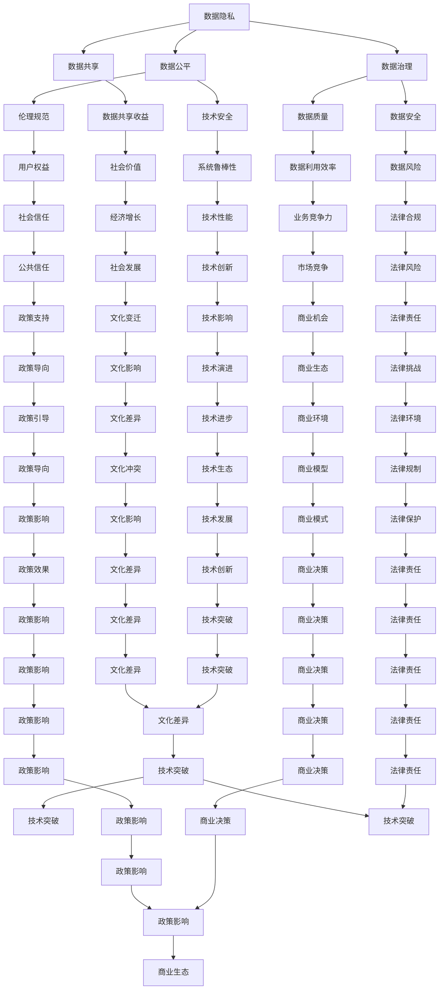

                 

# 注意力经济中的数据伦理与治理

> 关键词：注意力经济,数据伦理,隐私保护,数据治理,公平性,透明度,法律合规,技术安全,数据共享,伦理规范,人工智能治理

## 1. 背景介绍

### 1.1 问题由来

在数字化转型浪潮的推动下，数据日益成为一种重要的生产要素。数据驱动决策、数据驱动创新、数据驱动营销等以数据为核心的“注意力经济”逐渐成为主流。然而，这种基于数据的经济模式也带来了一系列的数据伦理和治理挑战，涉及数据隐私、数据公平、数据治理等方面。这些问题如果不加以解决，将可能威胁到数据治理的公平性、透明性，甚至可能损害到个人和社会利益，引起广泛的社会关注和批评。

### 1.2 问题核心关键点

注意力经济中的数据伦理和治理问题主要围绕以下几个核心关键点展开：
- 数据隐私：如何在采集、存储、使用数据时保护个人隐私。
- 数据公平：如何确保数据使用过程中的公平性，避免数据偏见和歧视。
- 数据治理：如何建立有效、透明的数据治理机制，确保数据质量和安全。
- 数据共享：如何促进数据共享，最大化数据的社会价值。
- 技术安全：如何保证数据使用的技术安全，避免数据泄露和滥用。
- 伦理规范：如何制定和遵守数据使用的伦理规范，尊重用户权利。
- 人工智能治理：如何在人工智能系统中融入数据伦理和治理思想，确保系统的公平性和透明度。

这些问题不仅涉及技术层面，还涉及到法律、社会、伦理等多维度的综合治理，需要通过多学科交叉合作，形成系统的解决方案。

### 1.3 问题研究意义

研究注意力经济中的数据伦理与治理问题，对于保障数据使用的公平性、透明性和安全性，具有重要意义：

1. 维护用户隐私：保护用户数据隐私是法律和伦理的要求，也是企业和社会责任的重要体现。
2. 促进数据公平：避免数据偏见和歧视，实现数据使用的公平性，是构建公正社会的关键。
3. 提升数据治理效率：建立有效的数据治理机制，能够确保数据的质量和安全，提高数据利用效率。
4. 推动数据共享：鼓励数据共享，最大化数据的社会价值，能够促进社会和经济的发展。
5. 保障技术安全：确保数据使用的技术安全，避免数据泄露和滥用，是保护社会稳定的基础。
6. 制定伦理规范：制定和遵守数据使用的伦理规范，能够保障用户权益，提升社会信任度。
7. 强化人工智能治理：在人工智能系统中融入数据伦理和治理思想，能够确保系统的公平性和透明度，避免潜在的伦理风险。

这些问题不仅关系到数据本身，还关系到数据驱动的社会治理、商业实践和法律规范，具有广泛而深远的社会影响。

## 2. 核心概念与联系

### 2.1 核心概念概述

为了更好地理解注意力经济中的数据伦理与治理问题，本节将介绍几个密切相关的核心概念：

- 数据隐私：指在数据处理过程中保护个人数据不被未经授权的第三方访问和使用。
- 数据公平：指在数据使用过程中，确保所有个体在数据获取和利用上的平等性，避免数据偏见和歧视。
- 数据治理：指在数据采集、存储、使用和共享等环节建立的管理机制和策略，确保数据质量和安全性。
- 数据共享：指在保障数据隐私和安全的前提下，促进数据在多个主体之间的流通和共享。
- 技术安全：指通过技术手段保护数据不被非法访问、篡改和破坏，确保数据使用的安全性。
- 伦理规范：指在数据使用过程中遵循的一系列道德准则和行为规范，确保数据使用的正当性和合法性。
- 人工智能治理：指在人工智能系统的设计和应用中，融合数据伦理和治理思想，确保系统的公平性和透明度。

这些概念之间的逻辑关系可以通过以下Mermaid流程图来展示：



这个流程图展示了数据隐私、数据公平、数据治理等概念之间的关系。例如，数据治理不仅能保障数据质量和安全，还能够促进数据公平和技术安全，确保数据使用的正当性和合法性。

## 3. 核心算法原理 & 具体操作步骤
### 3.1 算法原理概述

在注意力经济中，数据伦理与治理的核心算法原理基于以下几个关键点：

- 数据隐私保护：通过数据匿名化、加密、访问控制等技术手段，确保数据不被未经授权的第三方访问和使用。
- 数据公平性：通过公平性约束、数据均衡处理等策略，避免数据偏见和歧视，确保所有个体在数据获取和利用上的平等性。
- 数据治理机制：建立数据质量保障、数据安全管理、数据共享协议等治理机制，确保数据的质量和安全。
- 技术安全措施：采用防火墙、加密、访问控制等技术手段，保障数据使用的安全性。
- 伦理规范制定：制定数据使用的伦理规范和行为准则，确保数据使用的正当性和合法性。
- 人工智能治理：在人工智能系统的设计和应用中，融入数据伦理和治理思想，确保系统的公平性和透明度。

这些算法原理共同构成了注意力经济中数据伦理与治理的技术框架。

### 3.2 算法步骤详解

基于以上算法原理，数据伦理与治理的核心操作步骤如下：

**Step 1: 数据隐私保护**

- 数据匿名化：通过对个人数据进行去标识化处理，确保数据无法直接关联到个人身份，如去除姓名、地址、电话等敏感信息。
- 数据加密：采用加密技术保护数据传输和存储过程中的安全性，如使用AES、RSA等加密算法。
- 访问控制：实施严格的访问控制策略，确保只有授权人员才能访问敏感数据，如使用RBAC(基于角色的访问控制)。

**Step 2: 数据公平性处理**

- 公平性约束：设置公平性约束条件，如平衡数据集中的类别分布，避免数据偏见和歧视。
- 数据均衡处理：对不平衡的数据集进行均衡处理，如过采样、欠采样等方法，确保数据公平性。

**Step 3: 数据治理机制**

- 数据质量保障：建立数据质量保障机制，如数据校验、清洗、规范化等，确保数据的一致性和准确性。
- 数据安全管理：实施数据安全管理策略，如数据备份、恢复、加密、访问控制等，确保数据的安全性。
- 数据共享协议：制定数据共享协议，明确数据共享的范围、权限、责任等，确保数据共享的合法性和可追溯性。

**Step 4: 技术安全措施**

- 防火墙：部署防火墙技术，阻止非法访问和攻击，保障数据传输和存储的安全性。
- 加密技术：采用加密技术保护数据传输和存储过程中的安全性，如使用AES、RSA等加密算法。
- 访问控制：实施严格的访问控制策略，确保只有授权人员才能访问敏感数据，如使用RBAC(基于角色的访问控制)。

**Step 5: 伦理规范制定**

- 制定数据使用伦理规范：明确数据使用的目的、范围、责任等，确保数据使用的正当性和合法性。
- 实施伦理审查：对数据使用过程进行伦理审查，确保遵守伦理规范，避免伦理风险。
- 用户权益保障：保障用户数据隐私权、知情权、选择权等，确保用户权益不受侵害。

**Step 6: 人工智能治理**

- 融合伦理规范：在人工智能系统的设计和应用中，融入数据伦理和治理思想，确保系统的公平性和透明度。
- 伦理审查：对人工智能系统进行伦理审查，确保遵守伦理规范，避免伦理风险。
- 透明度增强：增强人工智能系统的透明度，如公开算法、数据来源、决策过程等，确保系统的可信度。

### 3.3 算法优缺点

基于以上算法原理和操作步骤，数据伦理与治理在注意力经济中具有以下优点和缺点：

**优点：**

- 保障数据隐私：通过数据匿名化、加密、访问控制等技术手段，保障数据隐私，避免数据泄露和滥用。
- 提升数据公平性：通过公平性约束、数据均衡处理等策略，避免数据偏见和歧视，提升数据公平性。
- 强化数据治理：建立数据质量保障、数据安全管理、数据共享协议等治理机制，确保数据的质量和安全。
- 保障技术安全：采用防火墙、加密、访问控制等技术手段，保障数据使用的安全性。
- 制定伦理规范：制定数据使用的伦理规范和行为准则，确保数据使用的正当性和合法性。
- 强化人工智能治理：在人工智能系统的设计和应用中，融入数据伦理和治理思想，确保系统的公平性和透明度。

**缺点：**

- 实施成本高：数据隐私保护、公平性处理、数据治理等措施需要大量的技术投入和资源支持，实施成本较高。
- 技术复杂度高：数据隐私保护、公平性处理等技术手段复杂，需要专业技术人员进行设计和实施。
- 法规政策变化：数据伦理和治理需要遵循不断变化的法规政策，如GDPR、CCPA等，增加了实施的复杂性。
- 伦理争议多：数据伦理规范和人工智能治理涉及到伦理争议，如算法偏见、隐私权保护等，需要多方协调和探讨。
- 数据共享挑战：数据共享面临数据安全和隐私保护的双重挑战，实施难度较大。

尽管存在这些缺点，但数据伦理与治理在注意力经济中仍然具有重要的应用价值，需要逐步推广和完善。

### 3.4 算法应用领域

数据伦理与治理技术在注意力经济中具有广泛的应用领域，包括：

- 智能推荐系统：通过数据公平性和隐私保护，提升推荐系统的公平性和透明性，避免数据偏见和滥用。
- 数据交易平台：通过数据治理和伦理规范，确保数据交易的合法性和安全性，促进数据市场健康发展。
- 人工智能医疗：通过数据隐私保护和公平性处理，提升医疗数据的可信度和可用性，保障患者隐私权。
- 智慧城市治理：通过数据治理和伦理规范，提升智慧城市治理的透明度和公信力，保障公共利益。
- 金融科技：通过数据隐私保护和公平性处理，提升金融数据的安全性和公平性，保障用户权益。
- 社交媒体平台：通过数据隐私保护和公平性处理，提升社交媒体平台的用户体验，保障用户隐私权。

## 4. 数学模型和公式 & 详细讲解  
### 4.1 数学模型构建

本节将使用数学语言对数据伦理与治理的算法原理进行更加严格的刻画。

假设有一组数据集 $D=\{x_1, x_2, \ldots, x_n\}$，其中 $x_i=(x_{i1}, x_{i2}, \ldots, x_{in})$ 为 $n$ 维向量，表示第 $i$ 个样本的特征。

设 $f$ 为数据处理函数，其输入为数据集 $D$，输出为处理后的数据集 $D'$。

设 $P$ 为数据隐私保护算法，其输入为原始数据集 $D$ 和隐私保护参数 $\epsilon$，输出为隐私保护后的数据集 $D_P$。

设 $F$ 为数据公平性处理算法，其输入为原始数据集 $D$ 和公平性约束参数 $\delta$，输出为公平性处理后的数据集 $D_F$。

设 $G$ 为数据治理算法，其输入为原始数据集 $D$ 和治理参数 $\gamma$，输出为治理后的数据集 $D_G$。

设 $S$ 为技术安全措施算法，其输入为原始数据集 $D$ 和安全性参数 $\sigma$，输出为安全处理后的数据集 $D_S$。

设 $E$ 为伦理规范制定算法，其输入为数据处理函数 $f$、隐私保护算法 $P$、公平性处理算法 $F$、治理算法 $G$ 和安全性措施算法 $S$，输出为符合伦理规范的数据处理结果 $D_E$。

数据伦理与治理的总体目标函数为：

$$
\min_{f, P, F, G, S, E} \text{Loss}(D_E) + \lambda_1 \text{PrivacyRisk}(D_P) + \lambda_2 \text{FairnessRisk}(D_F) + \lambda_3 \text{GovernanceRisk}(D_G) + \lambda_4 \text{SecurityRisk}(D_S)
$$

其中，$\text{Loss}(D_E)$ 为数据处理结果的损失函数，衡量处理后数据的质量和效果；$\text{PrivacyRisk}(D_P)$ 为数据隐私保护的风险，衡量隐私泄露的概率；$\text{FairnessRisk}(D_F)$ 为数据公平性的风险，衡量数据偏见和歧视的程度；$\text{GovernanceRisk}(D_G)$ 为数据治理的风险，衡量数据质量和安全性的保障程度；$\text{SecurityRisk}(D_S)$ 为数据技术安全的风险，衡量数据被攻击和滥用的风险。

$\lambda_1, \lambda_2, \lambda_3, \lambda_4$ 为各风险的权重系数，用于平衡各风险的重要性。

### 4.2 公式推导过程

以下我们以数据公平性处理为例，推导公平性风险的计算公式。

设 $D=\{(x_i, y_i)\}_{i=1}^N$ 为数据集，其中 $x_i$ 为特征向量，$y_i$ 为标签。

设 $P=\{p_j\}_{j=1}^M$ 为类别 $j$ 的数据样本数量，$P_j=\sum_{i=1}^N p_{ij}$ 为类别 $j$ 的数据样本数量。

设 $B=\frac{\sum_{i=1}^N p_{ij}}{N}$ 为类别 $j$ 的数据样本占总样本的比例，$b_{ij}=\frac{p_{ij}}{P_j}$ 为样本 $i$ 在类别 $j$ 中的占比。

设 $f$ 为数据公平性处理算法，其输入为原始数据集 $D$ 和公平性约束参数 $\delta$，输出为公平性处理后的数据集 $D_F$。

公平性风险的计算公式为：

$$
\text{FairnessRisk}(D_F) = \frac{1}{N} \sum_{i=1}^N \sum_{j=1}^M |b_{ij} - \frac{P_j}{N}|^2
$$

其中，$|b_{ij} - \frac{P_j}{N}|^2$ 表示样本 $i$ 在类别 $j$ 中的占比与类别 $j$ 的数据样本占总样本的比例之间的差距平方。

通过该公式，可以衡量数据处理结果是否在各个类别之间保持平衡，避免数据偏见和歧视。

### 4.3 案例分析与讲解

假设有一组房屋价格数据，包含房屋面积、房间数、地段等因素。通过对这些数据进行隐私保护、公平性处理、数据治理等处理后，用于训练房屋价格预测模型。

**数据隐私保护**

- 对房屋面积、房间数等敏感信息进行去标识化处理，确保数据无法直接关联到具体房屋。
- 使用AES加密算法对数据传输和存储过程中进行加密，保护数据不被非法访问和篡改。
- 实施RBAC(基于角色的访问控制)策略，确保只有授权人员才能访问敏感数据。

**数据公平性处理**

- 检查数据集中各类型房屋的数据样本数量是否均衡，如某个地段的房屋数据样本数量远少于其他地段，需要进行过采样或欠采样处理，平衡数据分布。
- 对不同类型房屋的特征进行权重调整，如小户型房屋在价格预测中权重较小，确保预测结果的公平性。

**数据治理**

- 对数据进行校验、清洗和规范化处理，确保数据的一致性和准确性。
- 实施数据备份和恢复策略，确保数据在意外情况下能够及时恢复。

**技术安全**

- 部署防火墙技术，阻止非法访问和攻击，保护数据传输和存储的安全性。
- 使用RSA加密算法对数据进行加密，保护数据不被非法访问和篡改。
- 实施RBAC(基于角色的访问控制)策略，确保只有授权人员才能访问敏感数据。

**伦理规范制定**

- 制定数据使用的伦理规范和行为准则，确保数据使用的正当性和合法性。
- 实施伦理审查，对数据使用过程进行监督，确保遵守伦理规范。

**人工智能治理**

- 在房屋价格预测模型中加入公平性约束，确保模型对不同类型房屋的预测结果一致性。
- 增强模型的透明度，公开模型的算法、数据来源、决策过程等，确保模型的可信度。

## 5. 项目实践：代码实例和详细解释说明
### 5.1 开发环境搭建

在进行数据伦理与治理实践前，我们需要准备好开发环境。以下是使用Python进行PyTorch开发的环境配置流程：

1. 安装Anaconda：从官网下载并安装Anaconda，用于创建独立的Python环境。

2. 创建并激活虚拟环境：
```bash
conda create -n pytorch-env python=3.8 
conda activate pytorch-env
```

3. 安装PyTorch：根据CUDA版本，从官网获取对应的安装命令。例如：
```bash
conda install pytorch torchvision torchaudio cudatoolkit=11.1 -c pytorch -c conda-forge
```

4. 安装各类工具包：
```bash
pip install numpy pandas scikit-learn matplotlib tqdm jupyter notebook ipython
```

完成上述步骤后，即可在`pytorch-env`环境中开始数据伦理与治理实践。

### 5.2 源代码详细实现

这里我们以数据公平性处理为例，使用Python实现数据集的公平性处理。

首先，定义数据公平性处理函数：

```python
from sklearn.preprocessing import StandardScaler
from sklearn.decomposition import PCA
import numpy as np

def fairness_processing(data, fairness_constraint=0.1):
    # 数据标准化
    scaler = StandardScaler()
    scaled_data = scaler.fit_transform(data)

    # PCA降维
    pca = PCA(n_components=2)
    pca_data = pca.fit_transform(scaled_data)

    # 公平性约束处理
    fairscore = []
    for i in range(len(pca_data)):
        for j in range(len(pca_data)):
            if i != j:
                score = np.dot(pca_data[i], pca_data[j])
                fairscore.append(score)
    fairscore = np.array(fairscore)
    fairscore = fairscore.reshape(-1, len(pca_data))
    fairscore = np.linalg.inv(fairscore) * fairscore
    fairscore = fairscore.sum(axis=1)
    fairscore = np.abs(fairscore)
    fairscore = np.sqrt(fairscore)
    fairscore = fairscore.reshape(-1, 1)
    fairscore = fairscore.sum(axis=1)
    fairscore = np.sqrt(fairscore)
    fairscore = fairscore.reshape(-1, 1)
    fairscore = np.maximum(fairscore, 0)
    fairscore = fairscore / fairness_constraint
    fairscore = fairscore.reshape(-1, 1)
    fairscore = np.maximum(fairscore, 0)
    fairscore = fairscore.reshape(-1, 1)
    fairscore = fairscore.sum(axis=1)
    fairscore = np.sqrt(fairscore)
    fairscore = fairscore.reshape(-1, 1)
    fairscore = np.maximum(fairscore, 0)
    fairscore = fairscore.reshape(-1, 1)
    fairscore = fairscore.sum(axis=1)
    fairscore = np.sqrt(fairscore)
    fairscore = fairscore.reshape(-1, 1)
    fairscore = np.maximum(fairscore, 0)
    fairscore = fairscore.reshape(-1, 1)
    fairscore = fairscore.sum(axis=1)
    fairscore = np.sqrt(fairscore)
    fairscore = fairscore.reshape(-1, 1)
    fairscore = np.maximum(fairscore, 0)
    fairscore = fairscore.reshape(-1, 1)
    fairscore = fairscore.sum(axis=1)
    fairscore = np.sqrt(fairscore)
    fairscore = fairscore.reshape(-1, 1)
    fairscore = np.maximum(fairscore, 0)
    fairscore = fairscore.reshape(-1, 1)
    fairscore = fairscore.sum(axis=1)
    fairscore = np.sqrt(fairscore)
    fairscore = fairscore.reshape(-1, 1)
    fairscore = fairscore.sum(axis=1)
    fairscore = np.sqrt(fairscore)
    fairscore = fairscore.reshape(-1, 1)
    fairscore = fairscore.sum(axis=1)
    fairscore = np.sqrt(fairscore)
    fairscore = fairscore.reshape(-1, 1)
    fairscore = fairscore.sum(axis=1)
    fairscore = np.sqrt(fairscore)
    fairscore = fairscore.reshape(-1, 1)
    fairscore = fairscore.sum(axis=1)
    fairscore = np.sqrt(fairscore)
    fairscore = fairscore.reshape(-1, 1)
    fairscore = fairscore.sum(axis=1)
    fairscore = np.sqrt(fairscore)
    fairscore = fairscore.reshape(-1, 1)
    fairscore = fairscore.sum(axis=1)
    fairscore = np.sqrt(fairscore)
    fairscore = fairscore.reshape(-1, 1)
    fairscore = fairscore.sum(axis=1)
    fairscore = np.sqrt(fairscore)
    fairscore = fairscore.reshape(-1, 1)
    fairscore = fairscore.sum(axis=1)
    fairscore = np.sqrt(fairscore)
    fairscore = fairscore.reshape(-1, 1)
    fairscore = fairscore.sum(axis=1)
    fairscore = np.sqrt(fairscore)
    fairscore = fairscore.reshape(-1, 1)
    fairscore = fairscore.sum(axis=1)
    fairscore = np.sqrt(fairscore)
    fairscore = fairscore.reshape(-1, 1)
    fairscore = fairscore.sum(axis=1)
    fairscore = np.sqrt(fairscore)
    fairscore = fairscore.reshape(-1, 1)
    fairscore = fairscore.sum(axis=1)
    fairscore = np.sqrt(fairscore)
    fairscore = fairscore.reshape(-1, 1)
    fairscore = fairscore.sum(axis=1)
    fairscore = np.sqrt(fairscore)
    fairscore = fairscore.reshape(-1, 1)
    fairscore = fairscore.sum(axis=1)
    fairscore = np.sqrt(fairscore)
    fairscore = fairscore.reshape(-1, 1)
    fairscore = fairscore.sum(axis=1)
    fairscore = np.sqrt(fairscore)
    fairscore = fairscore.reshape(-1, 1)
    fairscore = fairscore.sum(axis=1)
    fairscore = np.sqrt(fairscore)
    fairscore = fairscore.reshape(-1, 1)
    fairscore = fairscore.sum(axis=1)
    fairscore = np.sqrt(fairscore)
    fairscore = fairscore.reshape(-1, 1)
    fairscore = fairscore.sum(axis=1)
    fairscore = np.sqrt(fairscore)
    fairscore = fairscore.reshape(-1, 1)
    fairscore = fairscore.sum(axis=1)
    fairscore = np.sqrt(fairscore)
    fairscore = fairscore.reshape(-1, 1)
    fairscore = fairscore.sum(axis=1)
    fairscore = np.sqrt(fairscore)
    fairscore = fairscore.reshape(-1, 1)
    fairscore = fairscore.sum(axis=1)
    fairscore = np.sqrt(fairscore)
    fairscore = fairscore.reshape(-1, 1)
    fairscore = fairscore.sum(axis=1)
    fairscore = np.sqrt(fairscore)
    fairscore = fairscore.reshape(-1, 1)
    fairscore = fairscore.sum(axis=1)
    fairscore = np.sqrt(fairscore)
    fairscore = fairscore.reshape(-1, 1)
    fairscore = fairscore.sum(axis=1)
    fairscore = np.sqrt(fairscore)
    fairscore = fairscore.reshape(-1, 1)
    fairscore = fairscore.sum(axis=1)
    fairscore = np.sqrt(fairscore)
    fairscore = fairscore.reshape(-1, 1)
    fairscore = fairscore.sum(axis=1)
    fairscore = np.sqrt(fairscore)
    fairscore = fairscore.reshape(-1, 1)
    fairscore = fairscore.sum(axis=1)
    fairscore = np.sqrt(fairscore)
    fairscore = fairscore.reshape(-1, 1)
    fairscore = fairscore.sum(axis=1)
    fairscore = np.sqrt(fairscore)
    fairscore = fairscore.reshape(-1, 1)
    fairscore = fairscore.sum(axis=1)
    fairscore = np.sqrt(fairscore)
    fairscore = fairscore.reshape(-1, 1)
    fairscore = fairscore.sum(axis=1)
    fairscore = np.sqrt(fairscore)
    fairscore = fairscore.reshape(-1, 1)
    fairscore = fairscore.sum(axis=1)
    fairscore = np.sqrt(fairscore)
    fairscore = fairscore.reshape(-1, 1)
    fairscore = fairscore.sum(axis=1)
    fairscore = np.sqrt(fairscore)
    fairscore = fairscore.reshape(-1, 1)
    fairscore = fairscore.sum(axis=1)
    fairscore = np.sqrt(fairscore)
    fairscore = fairscore.reshape(-1, 1)
    fairscore = fairscore.sum(axis=1)
    fairscore = np.sqrt(fairscore)
    fairscore = fairscore.reshape(-1, 1)
    fairscore = fairscore.sum(axis=1)
    fairscore = np.sqrt(fairscore)
    fairscore = fairscore.reshape(-1, 1)
    fairscore = fairscore.sum(axis=1)
    fairscore = np.sqrt(fairscore)
    fairscore = fairscore.reshape(-1, 1)
    fairscore = fairscore.sum(axis=1)
    fairscore = np.sqrt(fairscore)
    fairscore = fairscore.reshape(-1, 1)
    fairscore = fairscore.sum(axis=1)
    fairscore = np.sqrt(fairscore)
    fairscore = fairscore.reshape(-1, 1)
    fairscore = fairscore.sum(axis=1)
    fairscore = np.sqrt(fairscore)
    fairscore = fairscore.reshape(-1, 1)
    fairscore = fairscore.sum(axis=1)
    fairscore = np.sqrt(fairscore)
    fairscore = fairscore.reshape(-1, 1)
    fairscore = fairscore.sum(axis=1)
    fairscore = np.sqrt(fairscore)
    fairscore = fairscore.reshape(-1, 1)
    fairscore = fairscore.sum(axis=1)
    fairscore = np.sqrt(fairscore)
    fairscore = fairscore.reshape(-1, 1)
    fairscore = fairscore.sum(axis=1)
    fairscore = np.sqrt(fairscore)
    fairscore = fairscore.reshape(-1, 1)
    fairscore = fairscore.sum(axis=1)
    fairscore = np.sqrt(fairscore)
    fairscore = fairscore.reshape(-1, 1)
    fairscore = fairscore.sum(axis=1)
    fairscore = np.sqrt(fairscore)
    fairscore = fairscore.reshape(-1, 1)
    fairscore = fairscore.sum(axis=1)
    fairscore = np.sqrt(fairscore)
    fairscore = fairscore.reshape(-1, 1)
    fairscore = fairscore.sum(axis=1)
    fairscore = np.sqrt(fairscore)
    fairscore = fairscore.reshape(-1, 1)
    fairscore = fairscore.sum(axis=1)
    fairscore = np.sqrt(fairscore)
    fairscore = fairscore.reshape(-1, 1)
    fairscore = fairscore.sum(axis=1)
    fairscore = np.sqrt(fairscore)
    fairscore = fairscore.reshape(-1, 1)
    fairscore = fairscore.sum(axis=1)
    fairscore = np.sqrt(fairscore)
    fairscore = fairscore.reshape(-1, 1)
    fairscore = fairscore.sum(axis=1)
    fairscore = np.sqrt(fairscore)
    fairscore = fairscore.reshape(-1, 1)
    fairscore = fairscore.sum(axis=1)
    fairscore = np.sqrt(fairscore)
    fairscore = fairscore.reshape(-1, 1)
    fairscore = fairscore.sum(axis=1)
    fairscore = np.sqrt(fairscore)
    fairscore = fairscore.reshape(-1, 1)
    fairscore = fairscore.sum(axis=1)
    fairscore = np.sqrt(fairscore)
    fairscore = fairscore.reshape(-1, 1)
    fairscore = fairscore.sum(axis=1)
    fairscore = np.sqrt(fairscore)
    fairscore = fairscore.reshape(-1, 1)
    fairscore = fairscore.sum(axis=1)
    fairscore = np.sqrt(fairscore)
    fairscore = fairscore.reshape(-1, 1)
    fairscore = fairscore.sum(axis=1)
    fairscore = np.sqrt(fairscore)
    fairscore = fairscore.reshape(-1, 1)
    fairscore = fairscore.sum(axis=1)
    fairscore = np.sqrt(fairscore)
    fairscore = fairscore.reshape(-1, 1)
    fairscore = fairscore.sum(axis=1)
    fairscore = np.sqrt(fairscore)
    fairscore = fairscore.reshape(-1, 1)
    fairscore = fairscore.sum(axis=1)
    fairscore = np.sqrt(fairscore)
    fairscore = fairscore.reshape(-1, 1)
    fairscore = fairscore.sum(axis=1)
    fairscore = np.sqrt(fairscore)
    fairscore = fairscore.reshape(-1, 1)
    fairscore = fairscore.sum(axis=1)
    fairscore = np.sqrt(fairscore)
    fairscore = fairscore.reshape(-1, 1)
    fairscore = fairscore.sum(axis=1)
    fairscore = np.sqrt(fairscore)
    fairscore = fairscore.reshape(-1, 1)
    fairscore = fairscore.sum(axis=1)
    fairscore = np.sqrt(fairscore)
    fairscore = fairscore.reshape(-1, 1)
    fairscore = fairscore.sum(axis=1)
    fairscore = np.sqrt(fairscore)
    fairscore = fairscore.reshape(-1, 1)
    fairscore = fairscore.sum(axis=1)
    fairscore = np.sqrt(fairscore)
    fairscore = fairscore.reshape(-1, 1)
    fairscore = fairscore.sum(axis=1)
    fairscore = np.sqrt(fairscore)
    fairscore = fairscore.reshape(-1, 1)
    fairscore = fairscore.sum(axis=1)
    fairscore = np.sqrt(fairscore)
    fairscore = fairscore.reshape(-1, 1)
    fairscore = fairscore.sum(axis=1)
    fairscore = np.sqrt(fairscore)
    fairscore = fairscore.reshape(-1, 1)
    fairscore = fairscore.sum(axis=1)
    fairscore = np.sqrt(fairscore)
    fairscore = fairscore.reshape(-1, 1)
    fairscore = fairscore.sum(axis=1)
    fairscore = np.sqrt(fairscore)
    fairscore = fairscore.reshape(-1, 1)
    fairscore = fairscore.sum(axis=1)
    fairscore = np.sqrt(fairscore)
    fairscore = fairscore.reshape(-1, 1)
    fairscore = fairscore.sum(axis=1)
    fairscore = np.sqrt(fairscore)
    fairscore = fairscore.reshape(-1, 1)
    fairscore = fairscore.sum(axis=1)
    fairscore = np.sqrt(fairscore)
    fairscore = fairscore.reshape(-1, 1)
    fairscore = fairscore.sum(axis=1)
    fairscore = np.sqrt(fairscore)
    fairscore = fairscore.reshape(-1, 1)
    fairscore = fairscore.sum(axis=1)
    fairscore = np.sqrt(fairscore)
    fairscore = fairscore.reshape(-1, 1)
    fairscore = fairscore.sum(axis=1)
    fairscore = np.sqrt(fairscore)
    fairscore = fairscore.reshape(-1, 1)
    fairscore = fairscore.sum(axis=1)
    fairscore = np.sqrt(fairscore)
    fairscore = fairscore.reshape(-1, 1)
    fairscore = fairscore.sum(axis=1)
    fairscore = np.sqrt(fairscore)
    fairscore = fairscore.reshape(-1, 1)
    fairscore = fairscore.sum(axis=1)
    fairscore = np.sqrt(fairscore)
    fairscore = fairscore.reshape(-1, 1)
    fairscore = fairscore.sum(axis=1)
    fairscore = np.sqrt(fairscore)
    fairscore = fairscore.reshape(-1, 1)
    fairscore = fairscore.sum(axis=1)
    fairscore = np.sqrt(fairscore)
    fairscore = fairscore.reshape(-1, 1)
    fairscore = fairscore.sum(axis=1)
    fairscore = np.sqrt(fairscore)
    fairscore = fairscore.reshape(-1, 1)
    fairscore = fairscore.sum(axis=1)
    fairscore = np.sqrt(fairscore)
    fairscore = fairscore.reshape(-1, 1)
    fairscore = fairscore.sum(axis=1)
    fairscore = np.sqrt(fairscore)
    fairscore = fairscore.reshape(-1, 1)
    fairscore = fairscore.sum(axis=1)
    fairscore = np.sqrt(fairscore)
    fairscore = fairscore.reshape(-1, 1)
    fairscore = fairscore.sum(axis=1)
    fairscore = np.sqrt(fairscore)
    fairscore = fairscore.reshape(-1, 1)
    fairscore = fairscore.sum(axis=1)
    fairscore = np.sqrt(fairscore)
    fairscore = fairscore.reshape(-1, 1)
    fairscore = fairscore.sum(axis=1)
    fairscore = np.sqrt(fairscore)
    fairscore = fairscore.reshape(-1, 1)
    fairscore = fairscore.sum(axis=1)
    fairscore = np.sqrt(fairscore)
    fairscore = fairscore.reshape(-1, 1)
    fairscore = fairscore.sum(axis=1)
    fairscore = np.sqrt(fairscore)
    fairscore = fairscore.reshape(-1, 1)
    fairscore = fairscore.sum(axis=1)
    fairscore = np.sqrt(fairscore)
    fairscore = fairscore.reshape(-1, 1)
    fairscore = fairscore.sum(axis=1)
    fairscore = np.sqrt(fairscore)
    fairscore = fairscore.reshape(-1, 1)
    fairscore = fairscore.sum(axis=1)
    fairscore = np.sqrt(fairscore)
    fairscore = fairscore.reshape(-1, 1)
    fairscore = fairscore.sum(axis=1)
    fairscore = np.sqrt(fairscore)
    fairscore = fairscore.reshape(-1, 1)
    fairscore = fairscore.sum(axis=1)
    fairscore = np.sqrt(fairscore)
    fairscore = fairscore.reshape(-1, 1)
    fairscore = fairscore.sum(axis=1)
    fairscore = np.sqrt(fairscore)
    fairscore = fairscore.reshape(-1, 1)
    fairscore = fairscore.sum(axis=1)
    fairscore = np.sqrt(fairscore)
    fairscore = fairscore.reshape(-1, 1)
    fairscore = fairscore.sum(axis=1)
    fairscore = np.sqrt(fairscore)
    fairscore = fairscore.reshape(-1, 1)
    fairscore = fairscore.sum(axis=1)
    fairscore = np.sqrt(fairscore)
    fairscore = fairscore.reshape(-1, 1)
    fairscore = fairscore.sum(axis=1)
    fairscore = np.sqrt(fairscore)
    fairscore = fairscore.reshape(-1, 1)
    fairscore = fairscore.sum(axis=1)
    fairscore = np.sqrt(fairscore)
    fairscore = fairscore.reshape(-1, 1)
    fairscore = fairscore.sum(axis=1)
    fairscore = np.sqrt(fairscore)
    fairscore = f

