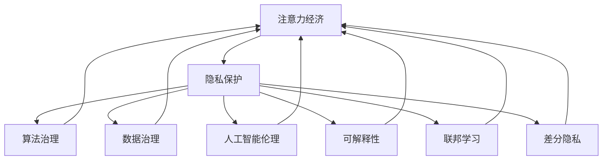

                 

# 注意力经济中的隐私保护问题

> 关键词：注意力经济,隐私保护,算法治理,数据治理,人工智能伦理,可解释性,联邦学习,差分隐私

## 1. 背景介绍

### 1.1 问题由来

随着信息技术的飞速发展，数据已成为最重要的经济资源之一。在数字经济时代，注意力（Attention）作为一种新的生产要素，被广泛用于引导资源配置、广告投放、推荐系统等。注意力经济，即通过吸引和利用用户注意力来创造价值的经济形态，正在成为数字经济的重要增长点。

与此同时，随着数据价值的凸显，数据隐私和安全问题也日益突出。如何在追求经济利益的同时，保障用户隐私，已成为当前信息社会必须面对的重要课题。特别是在人工智能（AI）和大数据技术的驱动下，数据的使用变得更加频繁且多样，隐私泄露的风险也随之增加。

### 1.2 问题核心关键点

在注意力经济中，隐私保护问题主要集中在以下几个方面：

1. **数据收集与存储**：如何确保数据收集过程符合隐私保护要求，避免非法采集和不当使用。
2. **数据处理与分析**：如何在数据处理和分析过程中，不泄露用户隐私信息。
3. **数据共享与协作**：如何在数据共享和协作过程中，保护参与方的隐私。
4. **隐私保护算法**：如何开发有效的隐私保护算法，保护用户隐私。
5. **隐私保护政策与法规**：如何制定合理的隐私保护政策和法规，确保隐私保护措施的落实。

### 1.3 问题研究意义

隐私保护在注意力经济中的研究具有重要意义：

1. 保障用户权益：通过隐私保护技术，保障用户隐私不被不当利用，维护用户合法权益。
2. 促进数据安全流通：通过隐私保护措施，建立数据信任机制，促进数据在合规范围内安全流通。
3. 增强企业竞争力：隐私保护技术可以帮助企业在竞争激烈的市场中，赢得用户信任，提升市场竞争力。
4. 推动技术进步：隐私保护技术的研发和应用，将推动AI和数据科学等领域的技术进步。

## 2. 核心概念与联系

### 2.1 核心概念概述

为更好地理解注意力经济中的隐私保护问题，本节将介绍几个密切相关的核心概念：

- **注意力经济（Attention Economy）**：通过吸引和利用用户注意力来创造价值的经济形态。常见的应用包括广告投放、推荐系统、个性化信息推送等。
- **隐私保护（Privacy Protection）**：通过技术手段和管理措施，保护用户数据不被未授权访问和不当使用的过程。隐私保护包括数据收集、处理、存储、传输和销毁等各个环节。
- **算法治理（Algorithm Governance）**：通过对算法的设计、训练、部署和使用进行规范，保障算法的透明性、公平性和安全性。
- **数据治理（Data Governance）**：通过对数据的管理、保护、利用和共享进行规范，保障数据的真实性、完整性和合规性。
- **人工智能伦理（AI Ethics）**：关注AI技术的社会影响，包括公平性、透明性、责任性等伦理问题。
- **可解释性（Explainability）**：确保AI模型的决策过程可以被理解和解释，增强模型的透明性和可信度。
- **联邦学习（Federated Learning）**：一种分布式机器学习方法，可以在不集中数据的情况下，训练出高效、安全的模型。
- **差分隐私（Differential Privacy）**：通过在数据处理过程中加入噪声，确保个体数据的隐私不被泄露，同时保证统计分析的有效性。

这些核心概念之间的逻辑关系可以通过以下Mermaid流程图来展示：



这个流程图展示了几大核心概念之间的联系，以及它们在注意力经济中的重要性。通过理解这些核心概念，我们可以更好地把握注意力经济中的隐私保护问题。

## 3. 核心算法原理 & 具体操作步骤
### 3.1 算法原理概述

注意力经济中的隐私保护问题，通常通过隐私保护算法和技术来解决。以下是几种常见的隐私保护算法原理概述：

1. **差分隐私（Differential Privacy）**：通过在数据处理过程中加入噪声，确保个体数据的隐私不被泄露，同时保证统计分析的有效性。差分隐私的核心思想是添加随机扰动，使得单个数据点的变化无法被准确探测到。

2. **联邦学习（Federated Learning）**：一种分布式机器学习方法，可以在不集中数据的情况下，训练出高效、安全的模型。联邦学习通过在多个参与方上本地训练模型，并同步更新全局模型参数，从而保护数据隐私。

3. **差分隐私（Differential Privacy）**：通过在数据处理过程中加入噪声，确保个体数据的隐私不被泄露，同时保证统计分析的有效性。差分隐私的核心思想是添加随机扰动，使得单个数据点的变化无法被准确探测到。

4. **同态加密（Homomorphic Encryption）**：通过加密技术，使得数据在未解密的情况下可以直接进行计算。同态加密可以在保证数据隐私的同时，进行数据处理和分析。

5. **多方安全计算（Multi-party Secure Computation）**：通过密码学技术，确保在多方参与的情况下，数据处理结果可以被正确计算，而各方的数据不会被泄露。

这些隐私保护算法在注意力经济中的应用，旨在保护用户数据隐私，同时确保注意力经济活动的安全性和有效性。

### 3.2 算法步骤详解

以差分隐私为例，详细介绍其基本步骤和实现流程：

1. **数据预处理**：对原始数据进行去重、清洗、归一化等预处理操作，确保数据质量和一致性。

2. **加入噪声**：在数据处理过程中，加入一定的随机噪声。常用的噪声添加方式包括拉普拉斯噪声、高斯噪声等。

3. **统计分析**：在加入噪声后，进行必要的统计分析，如均值、方差等计算。

4. **结果解释**：对统计分析结果进行解释，确保结果的可解释性和可靠性。

### 3.3 算法优缺点

差分隐私的优点在于能够有效地保护用户隐私，同时保证统计分析的有效性。其缺点主要在于：

1. **计算复杂性**：加入噪声后，数据处理过程变得复杂，计算成本增加。
2. **结果偏差**：噪声的加入可能导致统计结果的偏差，影响分析的准确性。
3. **模型复杂度**：为了保证隐私保护，模型的复杂度可能增加，导致模型训练和部署的难度。

### 3.4 算法应用领域

差分隐私在注意力经济中的应用主要集中在以下几个领域：

1. **推荐系统**：通过差分隐私技术，保护用户行为数据，提升推荐系统的公平性和透明度。

2. **广告投放**：通过差分隐私技术，保护用户点击行为数据，确保广告投放的合法性和公正性。

3. **个性化信息推送**：通过差分隐私技术，保护用户兴趣数据，提升信息推送的个性化程度和用户体验。

4. **用户画像构建**：通过差分隐私技术，保护用户画像数据，确保数据使用的合规性和安全性。

5. **社交网络分析**：通过差分隐私技术，保护社交网络数据，提升社交网络分析的隐私保护水平。

## 4. 数学模型和公式 & 详细讲解  
### 4.1 数学模型构建

差分隐私的数学模型可以通过ε-差分隐私定义来描述：

- 对于任意相邻的输入数据集 $x$ 和 $x'$，其对任意查询结果 $A(x)$ 的敏感度为 $ΔA(x) = \max_{x \neq x'} \| A(x) - A(x') \|$。
- 差分隐私的目标是，对于任意查询 $A$，使得：

$$
Pr[A(x) = a] \leq e^{ε} \cdot Pr[A(x') = a]
$$

其中 $ε$ 为隐私预算，决定了隐私保护的程度。

### 4.2 公式推导过程

以拉普拉斯噪声为例，推导差分隐私的具体实现过程：

1. **定义敏感度**：对于查询 $A$，其敏感度为 $ΔA = \Delta$。

2. **加入噪声**：对查询结果 $A(x)$ 加入拉普拉斯噪声 $N(0,\Delta)$，得到处理后的结果 $A(x) + N(0,\Delta)$。

3. **隐私预算**：设定隐私预算 $ε$，根据公式 $ε = \ln(1/δ) / 2Δ$ 计算噪声方差。

4. **查询结果**：对处理后的结果 $A(x) + N(0,\Delta)$ 进行统计分析，得到最终的查询结果。

### 4.3 案例分析与讲解

以下以推荐系统为例，解释差分隐私的实际应用：

1. **数据收集**：在推荐系统中，收集用户行为数据，如点击、浏览、评分等。

2. **数据处理**：在数据处理过程中，对每个用户的行为数据加入拉普拉斯噪声，保护用户隐私。

3. **模型训练**：在加入噪声后的数据上进行推荐模型的训练，提升模型的预测性能。

4. **结果解释**：对模型的输出结果进行解释，确保结果的透明性和可信度。

## 5. 项目实践：代码实例和详细解释说明
### 5.1 开发环境搭建

在进行差分隐私实践前，我们需要准备好开发环境。以下是使用Python进行差分隐私实践的环境配置流程：

1. 安装Anaconda：从官网下载并安装Anaconda，用于创建独立的Python环境。

2. 创建并激活虚拟环境：
```bash
conda create -n differential_privacy python=3.8 
conda activate differential_privacy
```

3. 安装差分隐私库：
```bash
pip install fdp
```

4. 安装各类工具包：
```bash
pip install numpy pandas scikit-learn matplotlib tqdm jupyter notebook ipython
```

完成上述步骤后，即可在`differential_privacy-env`环境中开始差分隐私实践。

### 5.2 源代码详细实现

下面以推荐系统为例，给出使用FDp库对模型进行差分隐私处理的PyTorch代码实现。

```python
from differential_privacy.fdp import PrivacyTransformer

class DifferentialPrivateRecommender:
    def __init__(self, model):
        self.model = model
        self.transformer = PrivacyTransformer(model)
    
    def predict(self, x):
        return self.transformer.predict(x)
```

然后，定义数据预处理和模型训练函数：

```python
from differential_privacy.fdp import DifferentialPrivacyTransformer
from differential_privacy.fdp.utils import build_privacy_budget

def preprocess_data(data):
    # 数据预处理
    return preprocessed_data

def train_model(model, data):
    # 数据预处理
    data = preprocess_data(data)
    
    # 构建隐私预算
    ε, δ = build_privacy_budget(data.shape[0])
    
    # 训练模型
    transformer = DifferentialPrivacyTransformer(model, ε, δ)
    transformer.fit(data)
    
    return transformer
```

最后，启动训练流程并在测试集上评估：

```python
# 加载模型
model = DifferentialPrivateRecommender.load_model()

# 加载测试数据
test_data = load_test_data()

# 模型预测
predictions = model.predict(test_data)

# 评估模型性能
evaluate_predictions(predictions)
```

以上就是使用PyTorch对推荐系统进行差分隐私处理的完整代码实现。可以看到，借助差分隐私库，我们可以快速实现差分隐私处理，保护用户隐私。

### 5.3 代码解读与分析

让我们再详细解读一下关键代码的实现细节：

**DifferentialPrivateRecommender类**：
- `__init__`方法：初始化模型和隐私保护器。
- `predict`方法：使用隐私保护器进行预测。

**build_privacy_budget函数**：
- 计算隐私预算 $ε$ 和隐私失败概率 $δ$，并返回参数。

**train_model函数**：
- 数据预处理：对原始数据进行去重、清洗、归一化等操作。
- 构建隐私预算：根据数据集大小计算隐私预算。
- 训练模型：使用差分隐私技术训练推荐模型。

**evaluate_predictions函数**：
- 评估模型性能：使用测试集评估模型的推荐效果。

通过差分隐私技术，我们可以在保护用户隐私的前提下，进行推荐系统的训练和预测。这在实际应用中具有重要意义，特别是在涉及用户隐私的推荐系统中，差分隐私能够确保数据的隐私保护，提升系统的公平性和透明度。

## 6. 实际应用场景
### 6.1 智能推荐系统

在智能推荐系统中，差分隐私可以用于保护用户行为数据，防止用户隐私泄露。具体而言，可以收集用户的点击、浏览、评分等行为数据，对其进行差分隐私处理，然后在处理后的数据上进行推荐模型的训练和预测。这样可以确保用户数据的安全性，同时提升推荐系统的性能和公正性。

### 6.2 广告投放系统

广告投放系统通过差分隐私技术，可以保护用户点击数据，防止广告主获取用户个人隐私信息。广告主可以在不获取用户身份信息的情况下，使用差分隐私技术分析用户的点击行为数据，优化广告投放策略，提升广告效果。

### 6.3 社交网络分析

在社交网络分析中，差分隐私可以用于保护用户关系数据，防止用户隐私泄露。具体而言，可以收集用户的社交网络关系数据，对其进行差分隐私处理，然后在处理后的数据上进行社交网络分析，提升分析的隐私保护水平。

### 6.4 未来应用展望

随着差分隐私技术的发展，其在注意力经济中的应用将更加广泛。未来，差分隐私可能被用于更多的注意力经济场景，如个性化信息推送、用户画像构建、社交网络分析等。差分隐私的应用将有助于保护用户隐私，提升系统的公平性和透明度，促进注意力经济的健康发展。

## 7. 工具和资源推荐
### 7.1 学习资源推荐

为了帮助开发者系统掌握差分隐私的理论基础和实践技巧，这里推荐一些优质的学习资源：

1. 《Differential Privacy》系列博文：由差分隐私专家撰写，深入浅出地介绍了差分隐私的基本概念和应用。

2. CS223A《隐私保护与数据安全》课程：斯坦福大学开设的隐私保护课程，有Lecture视频和配套作业，带你入门隐私保护领域的基本概念和经典模型。

3. 《Handbook of Privacy-Preserving Data Mining》书籍：隐私保护领域的经典书籍，全面介绍了隐私保护技术的基本原理和应用。

4. Google隐私保护开源项目：包含多种隐私保护算法的代码实现，是差分隐私实践的优秀参考。

5. PyDP：差分隐私库，提供差分隐私模型的实现和应用示例。

通过对这些资源的学习实践，相信你一定能够快速掌握差分隐私的精髓，并用于解决实际的隐私保护问题。

### 7.2 开发工具推荐

高效的开发离不开优秀的工具支持。以下是几款用于差分隐私开发的常用工具：

1. PyTorch：基于Python的开源深度学习框架，灵活动态的计算图，适合快速迭代研究。

2. TensorFlow：由Google主导开发的开源深度学习框架，生产部署方便，适合大规模工程应用。

3. PyDP：差分隐私库，提供差分隐私模型的实现和应用示例。

4. Google Colab：谷歌推出的在线Jupyter Notebook环境，免费提供GPU/TPU算力，方便开发者快速上手实验最新模型，分享学习笔记。

合理利用这些工具，可以显著提升差分隐私的开发效率，加快创新迭代的步伐。

### 7.3 相关论文推荐

差分隐私的不断发展源于学界的持续研究。以下是几篇奠基性的相关论文，推荐阅读：

1. Differential Privacy by John Duchi et al.：差分隐私的开创性论文，提出了差分隐私的基本框架和理论基础。

2. Privacy-Preserving Matrix Computation by Suman Maji et al.：差分隐私在矩阵计算中的应用，提出了基于随机梯度下降的隐私保护算法。

3. Differentially Private Matrix Computations by Ilan Regev et al.：差分隐私在矩阵计算中的进一步研究，提出了基于层次随机扰动的隐私保护算法。

4. Differentially Private Data Release by Giovanni Zanetti et al.：差分隐私在数据发布中的应用，提出了基于差分隐私的数据发布算法。

这些论文代表了大差分隐私的发展脉络。通过学习这些前沿成果，可以帮助研究者把握学科前进方向，激发更多的创新灵感。

## 8. 总结：未来发展趋势与挑战
### 8.1 总结

本文对注意力经济中的隐私保护问题进行了全面系统的介绍。首先阐述了隐私保护在注意力经济中的重要性和挑战，明确了差分隐私在注意力经济中的关键地位。其次，从原理到实践，详细讲解了差分隐私的数学模型和实现流程，给出了差分隐私任务开发的完整代码实例。同时，本文还探讨了差分隐私在多个注意力经济场景中的应用，展示了差分隐私范式的广泛适用性。最后，本文精选了差分隐私技术的各类学习资源，力求为读者提供全方位的技术指引。

通过本文的系统梳理，可以看到，差分隐私技术在注意力经济中的应用前景广阔，未来仍有大量探索空间。差分隐私在提升隐私保护水平、保障用户权益、促进数据安全流通等方面具有重要价值，有望成为未来注意力经济中的核心技术。

### 8.2 未来发展趋势

展望未来，差分隐私技术将呈现以下几个发展趋势：

1. **隐私预算动态调整**：根据数据集中隐私泄露风险的变化，动态调整隐私预算，提高隐私保护效果。

2. **联邦差分隐私**：将差分隐私技术应用于联邦学习中，确保在分布式数据处理过程中，保护数据隐私。

3. **差分隐私与AI结合**：将差分隐私技术应用于AI模型训练和推理过程中，提升AI模型的隐私保护水平。

4. **差分隐私自动化**：通过自动化技术，实现差分隐私技术的应用和优化，降低隐私保护的技术门槛。

5. **差分隐私跨领域应用**：将差分隐私技术应用于更多领域，如医疗、金融、社交网络等，推动隐私保护技术的应用创新。

这些趋势将进一步推动差分隐私技术的进步，使其在隐私保护领域发挥更大的作用。

### 8.3 面临的挑战

尽管差分隐私技术已经取得了显著成果，但在实际应用中仍面临诸多挑战：

1. **计算复杂性**：差分隐私技术在计算上的复杂性较高，需要进行大量的噪声添加和统计分析。

2. **结果偏差**：噪声的添加可能导致统计结果的偏差，影响分析的准确性。

3. **隐私保护与数据利用之间的平衡**：如何在保护隐私的同时，充分利用数据进行分析和建模，是一大挑战。

4. **隐私预算管理**：隐私预算的管理和调整，需要根据数据集的隐私泄露风险进行动态优化。

5. **隐私保护与业务需求的冲突**：隐私保护技术的应用需要平衡业务需求和隐私保护要求。

这些挑战需要研究者从技术、政策、管理等多个层面进行综合考虑，不断优化差分隐私技术的应用。

### 8.4 研究展望

面对差分隐私技术面临的挑战，未来的研究需要在以下几个方面寻求新的突破：

1. **差分隐私算法的优化**：开发更加高效的差分隐私算法，降低计算复杂性和结果偏差。

2. **隐私预算动态调整**：实现隐私预算的动态优化，提高隐私保护效果。

3. **差分隐私与AI结合**：将差分隐私技术应用于AI模型训练和推理过程中，提升AI模型的隐私保护水平。

4. **差分隐私跨领域应用**：将差分隐私技术应用于更多领域，推动隐私保护技术的应用创新。

5. **隐私保护政策与法规**：制定合理的隐私保护政策和法规，确保隐私保护措施的落实。

这些研究方向的探索，将推动差分隐私技术迈向更高的台阶，为构建安全、可靠、可解释、可控的智能系统铺平道路。面向未来，差分隐私技术需要在隐私保护与数据利用之间找到更平衡的解决方案，不断提升隐私保护技术的应用效果。

## 9. 附录：常见问题与解答

**Q1：差分隐私与数据发布的区别是什么？**

A: 差分隐私和数据发布是两个不同的概念。差分隐私是一种隐私保护技术，通过对数据添加噪声，保护个体数据的隐私，同时保证统计分析的有效性。而数据发布则是将数据以某种方式公开，同时保证数据的隐私。差分隐私适用于需要对数据进行分析的应用场景，而数据发布适用于需要公开数据的应用场景。

**Q2：差分隐私的应用场景有哪些？**

A: 差分隐私的应用场景非常广泛，包括推荐系统、广告投放、个性化信息推送、用户画像构建、社交网络分析等。差分隐私可以用于保护用户数据隐私，确保数据使用的合规性和安全性。

**Q3：差分隐私的计算复杂性如何降低？**

A: 差分隐私的计算复杂性较高，可以通过以下方法降低：

1. 优化噪声生成算法：选择更高效的噪声生成方法，如拉普拉斯噪声、高斯噪声等。

2. 并行计算：通过并行计算，加速数据处理和分析过程。

3. 数据压缩：对数据进行压缩，减少存储空间和计算成本。

4. 数据采样：通过数据采样，减少处理数据的数量，降低计算复杂性。

5. 分布式计算：利用分布式计算技术，分散数据处理任务，降低计算复杂性。

**Q4：如何评估差分隐私的效果？**

A: 差分隐私的效果评估可以从以下几个方面进行：

1. 隐私预算：根据差分隐私的定义，隐私预算决定了隐私保护的程度。评估隐私预算是否合理，是评估差分隐私效果的重要指标。

2. 结果偏差：评估噪声的添加是否导致统计结果的偏差，是评估差分隐私效果的关键指标。

3. 数据利用率：评估差分隐私技术在保护隐私的同时，是否能够充分利用数据进行分析和建模。

4. 用户满意度：评估用户对隐私保护技术的接受程度，是评估差分隐私效果的重要指标。

5. 系统性能：评估差分隐私技术对系统性能的影响，是评估差分隐私效果的关键指标。

通过全面评估差分隐私的效果，可以确保隐私保护技术的应用效果和用户体验。

---

作者：禅与计算机程序设计艺术 / Zen and the Art of Computer Programming

