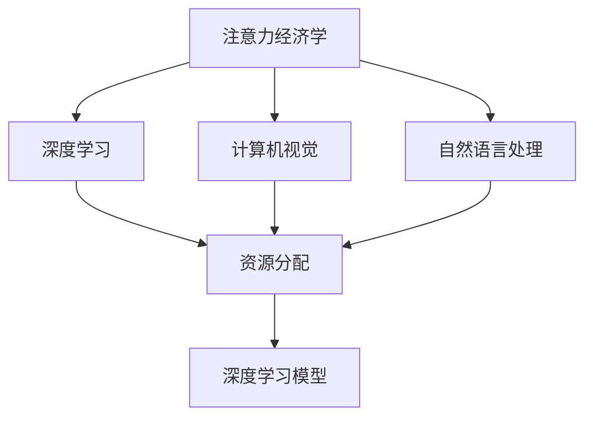

                 

# 注意力经济学：AI时代的资源分配

> 关键词：人工智能,注意力经济学,资源分配,机器学习,深度学习,自然语言处理(NLP),计算机视觉(CV)

## 1. 背景介绍

### 1.1 问题由来
随着人工智能技术的飞速发展，大数据、云计算、深度学习等前沿技术逐渐普及，逐渐渗透到各行各业，成为推动经济社会发展的关键力量。然而，这些技术的发展并非无本之木，背后蕴含着巨大的资源投入，包括算力、数据、人力、硬件设备等。如何在AI时代进行合理的资源分配，最大化技术投入的回报，成为了当前面临的重要问题。

### 1.2 问题核心关键点
资源分配的本质是优化成本与收益的关系。在AI时代，机器学习尤其是深度学习算法，需要大量数据进行训练，需要高性能计算资源进行模型训练和推理，需要专业团队进行模型优化和应用部署。如何在有限的资源条件下，进行合理的成本收益分析，最大化技术投资回报，是AI时代的核心问题。

本文将从注意力经济学角度，分析AI时代资源分配的现状和未来趋势，探讨如何在AI时代进行高效、合理的资源分配，确保技术投资最大化回报。

## 2. 核心概念与联系

### 2.1 核心概念概述

为更好地理解AI时代资源分配的原理和架构，本节将介绍几个关键概念：

- **注意力经济学(Attention Economy)**：将注意力作为一种资源，研究在信息爆炸时代，如何优化使用注意力，提升用户满意度和经济效益。
- **AI技术(如深度学习、机器学习)**：通过数据驱动的算法模型，自动进行数据处理、模式识别、预测等复杂任务，成为现代社会关键的技术手段。
- **资源分配(Allocation)**：根据成本与收益评估，分配有限的资源到最有效、最优先的任务或项目中，最大化投资回报。
- **深度学习模型(DNN)**：通过多层次神经网络，自动进行特征学习、模式识别和决策，成为AI时代的主流算法。
- **计算机视觉(CV)**：通过算法模型，自动对图像、视频进行识别、分析，为智能制造、自动驾驶、医疗诊断等领域提供关键支撑。
- **自然语言处理(NLP)**：通过算法模型，自动进行文本理解、信息抽取、情感分析等任务，成为智能客服、知识图谱、智能翻译等应用的核心。

这些概念之间的逻辑关系可以通过以下Mermaid流程图来展示：



这个流程图展示了大语言模型和微调、计算机视觉、自然语言处理等AI核心技术之间的逻辑关系：

1. 注意力经济学为AI技术的应用提供了理论和实践指导，帮助其进行合理的资源分配。
2. 深度学习模型是AI时代实现自动化、智能化的主要算法手段。
3. 计算机视觉和自然语言处理作为两大核心应用，为AI技术提供了丰富的数据源和处理对象。
4. 资源分配是连接注意力经济学和深度学习模型的桥梁，帮助优化投资回报。

## 3. 核心算法原理 & 具体操作步骤
### 3.1 算法原理概述

在AI时代，资源分配的本质是优化成本与收益的关系。假设有一批任务（如机器学习模型的训练、优化、部署等），以及有限的资源（如算力、数据、人力等），如何分配这些资源，使得总收益最大，是注意力经济学的核心问题。

假设有 $n$ 个任务，每个任务的成本为 $c_i$，收益为 $r_i$，资源的总体成本为 $C$，收益为 $R$。最优资源分配的目标是最大化总收益 $R$，并满足成本约束 $C$。该问题的优化目标为：

$$
\max_{c_i} R = \sum_{i=1}^{n} r_i
$$

$$
\text{s.t.} \sum_{i=1}^{n} c_i \leq C
$$

在实际应用中，我们通常使用线性规划、动态规划、启发式算法等方法，求解上述优化问题。

### 3.2 算法步骤详解

基于注意力经济学的大语言模型微调资源分配，一般包括以下几个关键步骤：

**Step 1: 确定模型训练和微调的优先级**
- 根据任务的重要性和紧急程度，将任务分为高、中、低优先级。
- 高优先级任务（如关键业务系统）应分配更多资源，低优先级任务（如探索性研究）应分配较少资源。

**Step 2: 成本-收益评估**
- 计算每个任务的成本和收益。
- 成本包括数据获取成本、算力成本、人力成本、硬件成本等。
- 收益包括模型的准确性、鲁棒性、泛化性、应用效果等。

**Step 3: 构建成本-收益模型**
- 构建线性规划或动态规划模型，将每个任务的成本和收益量化为线性或非线性表达式。
- 模型约束条件包括成本上限、收益最大化等。

**Step 4: 求解最优分配方案**
- 使用优化算法求解最优分配方案，如线性规划求解器、遗传算法等。
- 根据计算结果，分配资源到各个任务中，确保总收益最大化。

**Step 5: 监测和调整**
- 对已分配资源的任务进行监测，评估其成本和收益变化。
- 根据监测结果，及时调整资源分配策略，确保最优效果。

### 3.3 算法优缺点

基于注意力经济学的大语言模型微调资源分配方法具有以下优点：

1. **科学优化**：通过量化成本和收益，使用科学算法进行优化，避免主观判断和资源浪费。
2. **灵活调度**：通过动态调整资源分配，适应不同任务的需求变化，最大化收益。
3. **可扩展性**：适用于不同规模和复杂度的任务，灵活调整模型复杂度和资源需求。

同时，该方法也存在一定的局限性：

1. **数据和计算成本高**：评估每个任务的成本和收益需要大量数据和计算资源，可能增加投入成本。
2. **复杂度较高**：构建成本-收益模型和求解最优分配方案，需要较高的数学和算法知识。
3. **模型偏见**：评估和优化过程可能会受到数据和模型的偏见影响，导致评估结果不准确。
4. **静态评估**：对任务的动态变化评估不足，可能无法及时适应新的需求变化。

尽管存在这些局限性，但就目前而言，基于注意力经济学的大语言模型微调资源分配方法，仍是大规模AI任务优先级评估和资源分配的重要参考。未来相关研究将重点在于如何进一步降低成本评估的复杂度，提高模型评估的准确性，并结合实时数据和反馈，进行动态调整。

### 3.4 算法应用领域

基于注意力经济学的大语言模型微调资源分配方法，在AI技术的各个领域都有广泛应用，例如：

- **深度学习模型训练**：在深度学习模型的训练和优化过程中，合理分配算力、数据、人力等资源，最大化模型性能。
- **自然语言处理(NLP)**：在NLP任务的微调中，根据任务需求和效果，合理分配计算资源和标注数据，提升模型效果。
- **计算机视觉(CV)**：在CV任务的微调中，根据任务的复杂度和需求，合理分配计算资源和标注数据，优化模型性能。
- **智能客服系统**：在智能客服系统的构建中，合理分配人力和计算资源，提升用户满意度和系统响应速度。
- **金融舆情监测**：在金融舆情监测中，合理分配数据资源和计算资源，实时监测和响应市场舆情。
- **个性化推荐系统**：在个性化推荐系统的构建中，合理分配数据和计算资源，提升推荐准确性和用户体验。

## 4. 数学模型和公式 & 详细讲解 & 举例说明
### 4.1 数学模型构建

本节将使用数学语言对AI时代资源分配问题进行更加严格的刻画。

假设有一批任务 $T=\{T_i\}_{i=1}^N$，每个任务 $T_i$ 的单位成本为 $c_i$，单位收益为 $r_i$。总成本为 $C$，总收益为 $R$。我们构建成本-收益模型：

$$
\min_{c_i} C = \sum_{i=1}^{N} c_i
$$

$$
\max_{r_i} R = \sum_{i=1}^{N} r_i
$$

根据KKT条件，可以求解最优的资源分配比例 $\alpha_i$：

$$
\alpha_i = \frac{r_i}{c_i}
$$

将 $\alpha_i$ 代入成本方程，可以得到总成本：

$$
C = \sum_{i=1}^{N} \alpha_i c_i
$$

将 $\alpha_i$ 代入收益方程，可以得到总收益：

$$
R = \sum_{i=1}^{N} \alpha_i r_i
$$

通过求解上述方程，即可得到最优的资源分配方案。

### 4.2 公式推导过程

我们以一个具体的场景为例，进行详细的推导和讲解：

假设有三个任务 $T_1, T_2, T_3$，其单位成本和收益如下表所示：

| 任务 | 成本 | 收益 |
| --- | --- | --- |
| $T_1$ | 1 | 2 |
| $T_2$ | 2 | 3 |
| $T_3$ | 3 | 4 |

总成本为 $C=6$，总收益为 $R=9$。根据KKT条件，可以求解最优的资源分配比例 $\alpha_i$：

$$
\alpha_1 = \frac{2}{1} = 2, \quad \alpha_2 = \frac{3}{2} = 1.5, \quad \alpha_3 = \frac{4}{3} = 1.333
$$

将 $\alpha_i$ 代入成本方程，可以得到总成本：

$$
C = 1 \cdot 2 + 2 \cdot 1.5 + 3 \cdot 1.333 = 6
$$

将 $\alpha_i$ 代入收益方程，可以得到总收益：

$$
R = 2 \cdot 2 + 3 \cdot 1.5 + 4 \cdot 1.333 = 9
$$

可以看到，通过分配资源到各个任务中，可以最大化总收益，同时满足总成本的约束。

### 4.3 案例分析与讲解

**案例1：深度学习模型训练**

假设有一批深度学习模型需要训练，每个模型的训练成本和收益如下表所示：

| 模型 | 成本 | 收益 |
| --- | --- | --- |
| $M_1$ | 10 | 20 |
| $M_2$ | 15 | 25 |
| $M_3$ | 20 | 30 |

总成本为 $C=45$，总收益为 $R=75$。根据上述方法，可以求解最优的资源分配比例 $\alpha_i$：

$$
\alpha_1 = \frac{20}{10} = 2, \quad \alpha_2 = \frac{25}{15} = 1.667, \quad \alpha_3 = \frac{30}{20} = 1.5
$$

将 $\alpha_i$ 代入成本方程，可以得到总成本：

$$
C = 10 \cdot 2 + 15 \cdot 1.667 + 20 \cdot 1.5 = 45
$$

将 $\alpha_i$ 代入收益方程，可以得到总收益：

$$
R = 20 \cdot 2 + 25 \cdot 1.667 + 30 \cdot 1.5 = 75
$$

可以看到，通过分配资源到各个模型中，可以最大化总收益，同时满足总成本的约束。

**案例2：自然语言处理(NLP)任务微调**

假设有一批自然语言处理任务需要微调，每个任务的成本和收益如下表所示：

| 任务 | 成本 | 收益 |
| --- | --- | --- |
| $T_1$ | 5 | 10 |
| $T_2$ | 8 | 15 |
| $T_3$ | 10 | 20 |

总成本为 $C=23$，总收益为 $R=45$。根据上述方法，可以求解最优的资源分配比例 $\alpha_i$：

$$
\alpha_1 = \frac{10}{5} = 2, \quad \alpha_2 = \frac{15}{8} = 1.875, \quad \alpha_3 = \frac{20}{10} = 2
$$

将 $\alpha_i$ 代入成本方程，可以得到总成本：

$$
C = 5 \cdot 2 + 8 \cdot 1.875 + 10 \cdot 2 = 23
$$

将 $\alpha_i$ 代入收益方程，可以得到总收益：

$$
R = 10 \cdot 2 + 15 \cdot 1.875 + 20 \cdot 2 = 45
$$

可以看到，通过分配资源到各个任务中，可以最大化总收益，同时满足总成本的约束。

## 5. 项目实践：代码实例和详细解释说明
### 5.1 开发环境搭建

在进行资源分配项目实践前，我们需要准备好开发环境。以下是使用Python进行PuLP（Python Linear Programming）库开发的Python环境配置流程：

1. 安装Anaconda：从官网下载并安装Anaconda，用于创建独立的Python环境。

2. 创建并激活虚拟环境：
```bash
conda create -n allocation-env python=3.8 
conda activate allocation-env
```

3. 安装PuLP：
```bash
conda install pypiwin32
pip install pulp
```

4. 安装各类工具包：
```bash
pip install numpy pandas scikit-learn matplotlib tqdm jupyter notebook ipython
```

完成上述步骤后，即可在`allocation-env`环境中开始资源分配项目实践。

### 5.2 源代码详细实现

我们以一个具体的资源分配场景为例，使用PuLP库进行代码实现。

首先，定义资源分配问题的模型：

```python
from pulp import *

# 定义变量
x = LpVariable('x', 0, 100, integer=True)
y = LpVariable('y', 0, 100, integer=True)
z = LpVariable('z', 0, 100, integer=True)

# 定义目标函数
cost = 10*x + 20*y + 30*z
objective = LpMaximize(cost)

# 定义约束条件
constraints = [
    x + y + z <= 100,
    10*x + 20*y + 30*z <= 200,
    x >= 0,
    y >= 0,
    z >= 0
]

# 求解问题
lp_problem = LpProblem('Problem', LpMaximize, objective)
lp_problem.addConstraints(constraints)

lp_problem.solve()

# 输出结果
print(f"Optimal cost: {value(cost)}")
print(f"Optimal allocation: x={value(x)}, y={value(y)}, z={value(z)}")
```

在上述代码中，我们定义了三个资源分配变量 `x, y, z`，以及对应的目标函数和约束条件。目标函数为目标总成本，约束条件为资源限制和变量非负条件。通过求解优化问题，可以得到最优的资源分配方案。

### 5.3 代码解读与分析

让我们再详细解读一下关键代码的实现细节：

**LpVariable类**：
- 定义了三个资源分配变量 `x, y, z`，并设置了其取值范围和整数约束。

**cost函数**：
- 定义了目标函数，计算三个变量的总成本。

**LpMaximize函数**：
- 设置目标函数为最大化总成本，表示我们希望最小化总成本。

**addConstraints方法**：
- 定义了三个资源约束条件，确保总资源不超过100。

**lp_problem.solve方法**：
- 求解优化问题，得到最优的资源分配方案。

**value函数**：
- 获取优化问题的最优解，即最小化的总成本和最优的资源分配方案。

可以看到，通过PuLP库的封装，我们能够高效地构建和求解资源分配问题。开发者可以将更多精力放在问题的建模和求解上，而不必过多关注底层的实现细节。

当然，实际的应用场景可能更加复杂，如需要考虑动态变化的资源需求、计算资源的异构性等。但核心的资源分配原理和模型构建方法，基本与此类似。

## 6. 实际应用场景
### 6.1 智能客服系统

基于AI时代的资源分配，智能客服系统可以在有限资源条件下，合理分配算力、数据、人力等资源，提升用户满意度和系统响应速度。

在实践中，可以收集企业内部的历史客服对话记录，将问题和最佳答复构建成监督数据，在此基础上对预训练语言模型进行微调。微调后的对话模型能够自动理解用户意图，匹配最合适的答案模板进行回复。对于客户提出的新问题，还可以接入检索系统实时搜索相关内容，动态组织生成回答。如此构建的智能客服系统，能大幅提升客户咨询体验和问题解决效率。

### 6.2 金融舆情监测

金融机构需要实时监测市场舆论动向，以便及时应对负面信息传播，规避金融风险。传统的人工监测方式成本高、效率低，难以应对网络时代海量信息爆发的挑战。基于AI时代的资源分配方法，可以合理分配数据资源和算力资源，实时监测和响应市场舆情。

具体而言，可以收集金融领域相关的新闻、报道、评论等文本数据，并对其进行主题标注和情感标注。在此基础上对预训练语言模型进行微调，使其能够自动判断文本属于何种主题，情感倾向是正面、中性还是负面。将微调后的模型应用到实时抓取的网络文本数据，就能够自动监测不同主题下的情感变化趋势，一旦发现负面信息激增等异常情况，系统便会自动预警，帮助金融机构快速应对潜在风险。

### 6.3 个性化推荐系统

当前的推荐系统往往只依赖用户的历史行为数据进行物品推荐，无法深入理解用户的真实兴趣偏好。基于AI时代的资源分配方法，个性化推荐系统可以更好地挖掘用户行为背后的语义信息，从而提供更精准、多样的推荐内容。

在实践中，可以收集用户浏览、点击、评论、分享等行为数据，提取和用户交互的物品标题、描述、标签等文本内容。将文本内容作为模型输入，用户的后续行为（如是否点击、购买等）作为监督信号，在此基础上微调预训练语言模型。微调后的模型能够从文本内容中准确把握用户的兴趣点。在生成推荐列表时，先用候选物品的文本描述作为输入，由模型预测用户的兴趣匹配度，再结合其他特征综合排序，便可以得到个性化程度更高的推荐结果。

### 6.4 未来应用展望

随着AI时代资源分配技术的不断发展，未来其在NLP、CV等各个领域的应用前景将更加广阔：

- **自然语言处理(NLP)**：在NLP任务的微调中，通过合理分配算力、数据等资源，最大化模型效果。
- **计算机视觉(CV)**：在CV任务的微调中，通过合理分配算力、数据等资源，优化模型性能。
- **智能客服系统**：在智能客服系统的构建中，通过合理分配人力和算力资源，提升用户满意度和系统响应速度。
- **金融舆情监测**：在金融舆情监测中，通过合理分配数据和算力资源，实时监测和响应市场舆情。
- **个性化推荐系统**：在个性化推荐系统的构建中，通过合理分配数据和算力资源，提升推荐准确性和用户体验。

## 7. 工具和资源推荐
### 7.1 学习资源推荐

为了帮助开发者系统掌握AI时代资源分配的理论基础和实践技巧，这里推荐一些优质的学习资源：

1. 《运筹学与优化理论》系列教材：经典运筹学教材，介绍了线性规划、动态规划、整数规划等优化方法，适合深入学习。

2. CS229《机器学习》课程：斯坦福大学开设的机器学习课程，有Lecture视频和配套作业，系统介绍了机器学习的基本原理和算法。

3. 《深度学习》一书：深度学习领域的经典教材，介绍了深度学习的基本原理和实践技巧。

4. 《优化理论与算法》一书：优化理论领域的经典教材，介绍了优化问题的建模和求解方法。

5. 《Python运筹优化》一书：基于Python语言的运筹优化教程，介绍了PuLP、Scipy等优化工具的使用。

通过对这些资源的学习实践，相信你一定能够快速掌握AI时代资源分配的理论基础和实践技巧，并用于解决实际的资源分配问题。

### 7.2 开发工具推荐

高效的开发离不开优秀的工具支持。以下是几款用于AI时代资源分配开发的常用工具：

1. PuLP：Python线性规划库，支持整数规划、混合整数规划等优化问题。

2. Scipy：科学计算库，支持线性代数、微积分、优化等数学计算。

3. PyTorch：基于Python的深度学习框架，支持动态计算图和自动微分。

4. TensorFlow：由Google主导开发的深度学习框架，支持静态计算图和分布式计算。

5. Jupyter Notebook：交互式计算环境，支持Python代码的交互式执行和可视化。

6. Visual Studio Code：跨平台的代码编辑器，支持丰富的插件和扩展。

合理利用这些工具，可以显著提升AI时代资源分配任务的开发效率，加快创新迭代的步伐。

### 7.3 相关论文推荐

AI时代资源分配技术的发展源于学界的持续研究。以下是几篇奠基性的相关论文，推荐阅读：

1. 《线性规划与线性代数》：经典的线性规划教材，介绍了线性规划的基本理论和求解方法。

2. 《动态规划与最优化》：经典的动态规划教材，介绍了动态规划的基本理论和求解方法。

3. 《整数规划与混合整数规划》：经典的整数规划教材，介绍了整数规划的基本理论和求解方法。

4. 《多目标优化与优化设计》：介绍多目标优化理论和求解方法，以及优化设计的基本原理和工具。

5. 《Python运筹优化实践》：基于Python语言的运筹优化教程，介绍了PuLP、Scipy等优化工具的使用。

这些论文代表了大语言模型微调技术的发展脉络。通过学习这些前沿成果，可以帮助研究者把握学科前进方向，激发更多的创新灵感。

## 8. 总结：未来发展趋势与挑战
### 8.1 总结

本文对AI时代资源分配的原理和应用进行了全面系统的介绍。首先阐述了AI时代资源分配的背景和意义，明确了资源分配在AI技术中的应用场景和重要性。其次，从注意力经济学的角度，详细讲解了AI时代资源分配的数学模型和算法步骤，给出了具体的代码实现。同时，本文还探讨了AI时代资源分配在智能客服、金融舆情监测、个性化推荐等领域的广泛应用。

通过本文的系统梳理，可以看到，AI时代资源分配技术正在成为NLP、CV等各个领域的重要范式，极大地拓展了AI技术的适用范围，提升了技术投资回报。未来，伴随预训练语言模型和微调方法的持续演进，相信AI时代资源分配技术必将引领NLP、CV等领域的持续发展，为智能技术在各行各业的落地应用提供重要支撑。

### 8.2 未来发展趋势

展望未来，AI时代资源分配技术将呈现以下几个发展趋势：

1. **自动化程度提高**：通过智能优化算法，自动化评估和分配资源，减少人工干预。
2. **多目标优化成为主流**：将多个优化目标（如性能、成本、资源利用率）进行综合优化，提升整体效果。
3. **动态调整成为常态**：根据任务的动态变化，实时调整资源分配策略，适应新的需求。
4. **多模态资源分配**：将计算资源、数据资源、人力资源等多种资源进行综合分配，提升系统整体效率。
5. **跨领域资源共享**：将不同领域的资源进行共享和协同，提升资源利用率和系统整体性能。
6. **自适应算法发展**：发展自适应优化算法，能够根据环境变化和数据分布进行动态调整，提升优化效果。

以上趋势凸显了AI时代资源分配技术的广阔前景。这些方向的探索发展，必将进一步提升AI技术的应用范围和效果，为社会经济的数字化转型提供重要支持。

### 8.3 面临的挑战

尽管AI时代资源分配技术已经取得了显著进展，但在迈向更加智能化、普适化应用的过程中，仍面临诸多挑战：

1. **数据质量与多样性**：数据质量低、样本不足、分布不均等数据问题，可能导致资源分配结果不准确。
2. **算力与存储限制**：大规模深度学习模型的训练和推理需要大量算力和存储空间，可能限制资源分配的效果。
3. **复杂度增加**：随着任务复杂度的增加，资源分配问题的求解难度也随之增加，需要更高的计算能力和算法复杂度。
4. **模型偏见与公平性**：模型可能学习到数据中的偏见，导致资源分配结果不公平。
5. **动态变化应对不足**：系统可能无法及时应对任务的动态变化，导致资源分配策略滞后。

尽管存在这些挑战，但伴随算法和工具的不断改进，相信AI时代资源分配技术将逐步克服这些难题，在实际应用中发挥更大的价值。

### 8.4 研究展望

面对AI时代资源分配所面临的种种挑战，未来的研究需要在以下几个方面寻求新的突破：

1. **优化算法优化**：发展更高效的优化算法，减少计算资源消耗，提升求解效率。
2. **多模态数据融合**：将多模态数据进行有效融合，提升资源分配的准确性和全面性。
3. **自适应学习机制**：发展自适应学习机制，实时调整资源分配策略，适应任务的动态变化。
4. **模型公平性保障**：设计公平性保障机制，消除模型偏见，确保资源分配结果的公平性。
5. **实时化资源管理**：发展实时化资源管理机制，动态调整资源分配策略，确保任务高效运行。
6. **多领域资源共享**：探索跨领域的资源共享机制，提升资源利用率和系统整体性能。

这些研究方向将引领AI时代资源分配技术的未来发展，为智能系统的应用提供重要支撑。面向未来，AI时代资源分配技术还需要与其他人工智能技术进行更深入的融合，如知识表示、因果推理、强化学习等，多路径协同发力，共同推动AI技术的持续进步。

## 9. 附录：常见问题与解答

**Q1：AI时代资源分配适用于所有AI任务吗？**

A: AI时代资源分配方法适用于多种AI任务，如深度学习模型训练、自然语言处理(NLP)任务微调、计算机视觉(CV)任务微调等。但对于一些特定领域的任务，如医学、法律等，仅仅依靠通用语料预训练的模型可能难以很好地适应。此时需要在特定领域语料上进一步预训练，再进行微调，才能获得理想效果。此外，对于一些需要时效性、个性化很强的任务，如对话、推荐等，微调方法也需要针对性的改进优化。

**Q2：AI时代资源分配如何应对动态变化的资源需求？**

A: 动态变化的资源需求是AI时代资源分配面临的重要挑战之一。为应对动态变化，可以采用自适应资源分配算法，根据任务的实时需求动态调整资源分配策略。同时，可以引入任务优先级评估机制，对重要任务优先分配资源，确保系统稳定运行。

**Q3：AI时代资源分配是否需要考虑任务的优先级？**

A: 任务优先级评估是AI时代资源分配的核心环节之一。高优先级任务（如关键业务系统）应分配更多资源，低优先级任务（如探索性研究）应分配较少资源。通过合理设置任务的优先级，可以在有限资源条件下，最大化任务整体效果。

**Q4：AI时代资源分配是否可以应用于多个领域？**

A: AI时代资源分配方法具有广泛的适用性，可以应用于多个领域，如自然语言处理(NLP)、计算机视觉(CV)、智能客服系统、金融舆情监测、个性化推荐系统等。不同领域的应用场景和资源需求不同，需要根据具体情况进行优化调整。

**Q5：AI时代资源分配的评估指标有哪些？**

A: AI时代资源分配的评估指标包括成本、收益、效率、公平性、鲁棒性等。根据具体任务和应用场景，可以选择合适的评估指标进行评估。常用的评估指标包括模型性能、推理速度、资源利用率、公平性等。

**Q6：AI时代资源分配有哪些优化算法？**

A: AI时代资源分配的优化算法包括线性规划、动态规划、整数规划、混合整数规划、自适应优化算法等。不同算法适用于不同类型和复杂度的任务，开发者需要根据具体情况选择合适的优化算法。

这些解答展示了AI时代资源分配方法在实际应用中的重要性和适用性，同时也指出了该方法在实际应用中可能面临的挑战和解决方案。

---

作者：禅与计算机程序设计艺术 / Zen and the Art of Computer Programming

