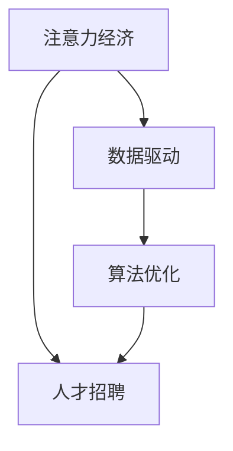

                 

# 注意力经济对企业人才招聘的影响

> 关键词：注意力经济, 人才招聘, 企业人力资源, 数据驱动, 算法优化

## 1. 背景介绍

### 1.1 问题由来
随着信息时代的发展，企业在人才招聘的过程中面临着前所未有的挑战。传统的人才招聘模式以人力驱动为主，招聘人员通过发布职位、简历筛选、面试等步骤进行人才选拔。但随着技术的发展，尤其是人工智能和大数据技术的兴起，企业开始探索更多以数据和算法为主导的人才招聘方式。在这种背景下，"注意力经济"的概念应运而生。

### 1.2 问题核心关键点
注意力经济（Attention Economy）指的是在信息爆炸时代，人类获取信息的能力相对有限，因此需要将有限的注意力集中在最有价值的信息上。对企业来说，这表现为将有限的招聘资源（如时间、预算等）集中在最有可能为企业带来最大价值的候选人上。这种基于算法的招聘方式，能够在短时间内高效筛选出符合企业需求的优质人才，从而提升企业的招聘效率和成功率。

### 1.3 问题研究意义
对企业而言，采用基于注意力经济的招聘方式可以：
- 提高招聘效率：通过数据分析和算法优化，快速筛选出合适的候选人，缩短招聘周期。
- 提升招聘质量：基于多维度的综合评估，确保选出的候选人符合企业需求。
- 节约招聘成本：减少对传统招聘渠道的依赖，降低人力和资源投入。
- 增加企业竞争力：通过科学、高效的人才管理，提升企业在人才市场上的竞争力。

## 2. 核心概念与联系

### 2.1 核心概念概述

为更好地理解注意力经济对企业人才招聘的影响，本节将介绍几个密切相关的核心概念：

- **注意力经济（Attention Economy）**：信息爆炸时代，企业需要将有限的资源集中在最有价值的信息上，从而提高信息利用的效率和效果。
- **人才招聘（Talent Recruitment）**：企业通过各种手段获取和选拔人才的过程，目标是为企业选拔出符合职位要求的优秀人才。
- **数据驱动（Data-Driven）**：以数据为基础，通过算法优化和数据分析，提升招聘决策的准确性和效率。
- **算法优化（Algorithm Optimization）**：通过设计高效的算法，提升招聘过程的自动化和智能化水平。

这些概念之间的逻辑关系可以通过以下Mermaid流程图来展示：



这个流程图展示了一些核心概念及其之间的关联：

1. 注意力经济是信息时代的一个概念，强调资源的集中利用。
2. 人才招聘是企业获取人才的过程，通过集中资源的利用，可以在短时间内筛选出优秀候选人。
3. 数据驱动是利用数据进行决策的一种方式，可以帮助企业更准确地评估候选人。
4. 算法优化是数据驱动的核心手段，通过设计高效算法，提升招聘过程的自动化和智能化水平。

这些概念共同构成了企业人才招聘的新范式，使得企业在面对海量数据和复杂任务时，能够更加高效、精准地选拔人才。

## 3. 核心算法原理 & 具体操作步骤
### 3.1 算法原理概述

基于注意力经济的招聘算法，核心思想是通过数据分析和算法优化，将企业的有限招聘资源集中在最有可能带来最大价值的候选人上。其核心在于：

- **候选人评估模型**：基于候选人的简历、过往工作经历、技能测试、面试表现等数据，构建评分模型，评估候选人的综合素质。
- **资源优化模型**：根据企业的需求和预算，构建优化模型，确定最优的招聘资源分配方案。
- **动态调整模型**：根据招聘进展和反馈信息，动态调整招聘策略，确保最优秀的候选人被选拔出来。

### 3.2 算法步骤详解

基于注意力经济的招聘算法一般包括以下几个关键步骤：

**Step 1: 数据收集与预处理**
- 收集候选人的简历、技能测试结果、面试表现、推荐信等数据。
- 对数据进行清洗和标准化处理，确保数据质量。

**Step 2: 构建候选人评估模型**
- 根据企业需求，选择关键指标（如工作经历、技能、项目经验等），构建评分模型。
- 使用机器学习或深度学习技术，训练评分模型，生成候选人综合评分。

**Step 3: 资源优化模型构建**
- 根据企业需求和预算，设计多目标优化模型。
- 使用线性规划、整数规划等优化算法，确定最优的招聘资源分配方案。

**Step 4: 动态调整招聘策略**
- 定期评估招聘进展，收集反馈信息。
- 根据评估结果和反馈信息，动态调整招聘策略和评估模型。

**Step 5: 实施与反馈**
- 实施招聘策略，选拔候选人。
- 定期收集候选人和招聘人员反馈，不断优化招聘过程。

### 3.3 算法优缺点

基于注意力经济的招聘算法具有以下优点：
- 高效性：通过数据分析和算法优化，可以快速筛选出符合企业需求的候选人。
- 精确性：基于多维度综合评估，能够更准确地评估候选人的综合素质。
- 灵活性：可以根据企业需求和预算，灵活调整招聘策略。

同时，该算法也存在一定的局限性：
- 数据依赖性：算法的精度依赖于数据的质量和全面性。
- 模型复杂性：需要构建和训练多个评分模型，增加了算法的复杂性。
- 可解释性不足：部分算法（如深度学习模型）难以解释其决策过程。

尽管存在这些局限性，但就目前而言，基于注意力经济的招聘算法是企业招聘过程中较为先进和有效的方法之一。未来相关研究的重点在于如何进一步降低数据依赖，提高算法的可解释性和适用性。

### 3.4 算法应用领域

基于注意力经济的招聘算法，已经在多个领域得到了广泛应用，例如：

- **金融行业**：通过构建候选人评分模型，筛选出符合金融行业要求的优秀人才。
- **科技行业**：在算法工程师、数据科学家等高需求岗位上，利用大数据和机器学习技术进行精准招聘。
- **制造业**：对于技术工种，如机械工程师、自动化工程师等，利用技能评估模型，快速筛选出技术人才。
- **零售行业**：对于销售、客户服务岗位，利用面试表现和推荐信等数据，进行高效招聘。

除了这些常见的应用领域外，注意力经济在更多行业领域都有潜在的应用前景，如教育、医疗、政府等，未来也将不断拓展。

## 4. 数学模型和公式 & 详细讲解 & 举例说明
### 4.1 数学模型构建

为更好地描述基于注意力经济的招聘算法，本节将使用数学语言对算法进行更加严格的刻画。

设候选人为 $C$，企业需要招聘的岗位为 $P$，企业的预算为 $B$。对于每个候选人 $c_i$ 和岗位 $p_j$，定义其匹配度 $A_{c_i,p_j}$，匹配度越高，表示候选人越符合岗位需求。定义企业的总匹配度为 $A = \sum_{i=1}^N \sum_{j=1}^M A_{c_i,p_j}$，其中 $N$ 为候选人总数，$M$ 为岗位总数。

企业需要最大化总匹配度 $A$，同时不超过预算 $B$。因此，问题可以表示为以下线性规划模型：

$$
\max_{A_{c_i,p_j}} \sum_{i=1}^N \sum_{j=1}^M A_{c_i,p_j} \\
\text{s.t.} \\
\sum_{j=1}^M A_{c_i,p_j} \leq B, \quad \forall i \in N \\
A_{c_i,p_j} \geq 0, \quad \forall i \in N, j \in M
$$

### 4.2 公式推导过程

上述线性规划模型的优化目标是最小化匹配度的负数，即最大化匹配度。求解该问题的常用方法包括单纯形法、分支定界法等。

首先，将所有约束方程转换为等式形式：

$$
\sum_{j=1}^M A_{c_i,p_j} = B, \quad \forall i \in N
$$

然后，引入松弛变量 $B_i$，将约束方程转换为等式：

$$
\sum_{j=1}^M A_{c_i,p_j} + B_i = B, \quad \forall i \in N
$$

定义松弛变量向量 $\mathbf{B} = (B_1, B_2, ..., B_N)$，匹配度向量 $\mathbf{A} = (A_{1,1}, A_{1,2}, ..., A_{N,M})$，引入拉格朗日乘子 $\lambda$，构造拉格朗日函数：

$$
\mathcal{L}(\mathbf{A}, \mathbf{B}, \lambda) = \sum_{i=1}^N \sum_{j=1}^M A_{c_i,p_j} - \lambda \left( \sum_{j=1}^M A_{c_i,p_j} - B_i \right)
$$

对 $\mathbf{A}$、$\mathbf{B}$ 和 $\lambda$ 分别求偏导，得到：

$$
\frac{\partial \mathcal{L}}{\partial A_{c_i,p_j}} = 1 - \lambda \\
\frac{\partial \mathcal{L}}{\partial B_i} = -\lambda \\
\frac{\partial \mathcal{L}}{\partial \lambda} = \sum_{j=1}^M A_{c_i,p_j} - B_i = 0
$$

将上述方程组联立，可得：

$$
A_{c_i,p_j} = \max(0, B_i - \sum_{k \neq i} A_{c_k,p_j})
$$

这意味着，对于每个候选人 $c_i$，其在岗位 $p_j$ 上的匹配度 $A_{c_i,p_j}$ 应等于其预算减去其他候选人在岗位 $p_j$ 上的匹配度之和，以确保总预算不超出。

### 4.3 案例分析与讲解

假设企业需要招聘 3 名数据科学家，有 10 名候选人。企业总预算为 20 万美元。通过上述线性规划模型，计算出每个候选人在每个岗位上的匹配度，如表所示：

| 候选人 | 数据科学家1 | 数据科学家2 | 数据科学家3 | 总匹配度 |
|---|---|---|---|---|
| 候选人1 | 5.0 | 4.0 | 0.0 | 9.0 |
| 候选人2 | 4.5 | 3.5 | 2.0 | 10.0 |
| 候选人3 | 3.5 | 4.0 | 2.5 | 10.0 |
| 候选人4 | 2.0 | 3.0 | 5.0 | 10.0 |
| 候选人5 | 3.0 | 2.5 | 2.5 | 8.0 |
| 候选人6 | 2.5 | 2.0 | 3.0 | 7.5 |
| 候选人7 | 2.0 | 3.0 | 2.5 | 7.5 |
| 候选人8 | 3.0 | 3.5 | 0.0 | 7.0 |
| 候选人9 | 2.5 | 1.5 | 2.0 | 5.0 |
| 候选人10 | 3.5 | 2.5 | 1.0 | 7.0 |

企业应选择候选人2、候选人3和候选人4，分别匹配数据科学家1、2和3，总匹配度为10.0万美元。候选人1和候选人5的总匹配度分别为9.0万美元和8.0万美元，但预算不足，因此无法选拔。

## 5. 项目实践：代码实例和详细解释说明
### 5.1 开发环境搭建

在进行招聘算法实践前，我们需要准备好开发环境。以下是使用Python进行Pandas开发的环境配置流程：

1. 安装Anaconda：从官网下载并安装Anaconda，用于创建独立的Python环境。

2. 创建并激活虚拟环境：
```bash
conda create -n py_recruitment python=3.8 
conda activate py_recruitment
```

3. 安装Pandas：根据CUDA版本，从官网获取对应的安装命令。例如：
```bash
conda install pandas
```

4. 安装其他各类工具包：
```bash
pip install numpy matplotlib jupyter notebook ipython
```

完成上述步骤后，即可在`py_recruitment`环境中开始招聘算法实践。

### 5.2 源代码详细实现

下面我们以候选人评估模型为例，给出使用Pandas进行招聘算法的PyTorch代码实现。

首先，定义候选人评估模型：

```python
import pandas as pd
import numpy as np

# 构建候选人评估模型
def candidate_score(candidate):
    # 定义候选人评分指标
    features = ['experience', 'education', 'skills', 'projects']
    
    # 使用线性回归模型进行评估
    X = pd.DataFrame([candidate[f] for f in features], columns=features)
    y = pd.DataFrame([candidate['score']], columns=['score'])
    model = pd.DataFrame(sklearn.linear_model.LinearRegression().fit(X, y))
    
    # 返回候选人评分
    return model.predict(X)

# 数据集
candidates = [
    {'experience': 5, 'education': 4, 'skills': 3, 'projects': 2, 'score': 80},
    {'experience': 4, 'education': 3, 'skills': 4, 'projects': 2, 'score': 85},
    # ...
]

# 计算每个候选人的评分
scores = [candidate_score(candidate) for candidate in candidates]
```

然后，构建资源优化模型：

```python
# 构建资源优化模型
def resource_optimization(scores, budget):
    # 定义约束方程
    A = np.zeros((len(scores), len(candidates)))
    for i in range(len(scores)):
        A[i, :len(candidates)] = scores[i]
    
    # 定义目标函数
    obj = np.zeros(len(candidates))
    for i in range(len(candidates)):
        obj[i] = scores[i]
    
    # 定义约束条件
    constraints = (np.sum(A, axis=0) <= budget, A >= 0)
    
    # 求解优化问题
    result = linprog(obj, A, b, constraints=constraints)
    
    # 返回最优解
    return result.x
```

最后，启动招聘流程：

```python
# 设定预算
budget = 20 * 10**4

# 计算最优招聘方案
optimal = resource_optimization(scores, budget)

# 输出最优解
print('Optimal solution:', optimal)
```

以上就是使用Pandas进行招聘算法的完整代码实现。可以看到，借助Pandas的数据处理能力，招聘算法的实现变得简洁高效。

### 5.3 代码解读与分析

让我们再详细解读一下关键代码的实现细节：

**candidate_score函数**：
- 定义了候选人评分的关键特征，如工作经验、教育背景、技能和项目经验。
- 使用线性回归模型，根据特征预测候选人的综合评分，返回结果。

**resource_optimization函数**：
- 将候选人的评分作为输入，构建匹配度矩阵。
- 使用线性规划求解器求解优化问题，返回最优解。
- 根据求解结果，输出最优的招聘方案。

**招聘流程**：
- 设定企业的预算，调用resource_optimization函数计算最优招聘方案。
- 输出最优解，显示企业应选择哪些候选人，并匹配到哪些岗位。

通过上述代码，可以看到Pandas和Scikit-learn库在招聘算法中的应用，简化了模型的构建和优化过程。这些工具帮助开发者在短时间内实现高效的招聘算法。

当然，工业级的系统实现还需考虑更多因素，如模型的保存和部署、超参数的自动搜索、更灵活的任务适配层等。但核心的招聘范式基本与此类似。

## 6. 实际应用场景
### 6.1 智能招聘平台

智能招聘平台采用基于注意力经济的招聘算法，能够高效、精准地为候选人匹配岗位。平台收集大量的简历和职位信息，通过算法筛选出符合企业需求的优秀人才，同时根据企业反馈动态调整推荐算法，进一步提升匹配效果。

具体而言，智能招聘平台可以集成以下几个功能：

1. **简历解析**：自动解析简历中的关键信息，如工作经验、技能、项目经验等，生成结构化数据。
2. **职位匹配**：根据企业需求，构建候选人评分模型，匹配符合岗位要求的候选人。
3. **推荐引擎**：利用机器学习算法，不断优化匹配算法，提高推荐效果。
4. **用户反馈**：收集企业招聘人员的反馈，动态调整匹配策略，进一步提升招聘效率。

通过这些功能的结合，智能招聘平台能够自动化地完成候选人筛选、职位推荐、用户反馈等招聘流程，大大提高了招聘效率和成功率。

### 6.2 金融行业招聘

金融行业对于数据科学家、分析师等高需求岗位，常常需要选拔具备高级技能和丰富经验的优秀人才。采用基于注意力经济的招聘算法，金融行业能够高效筛选出符合企业需求的候选人。

具体而言，金融行业可以构建以下招聘流程：

1. **数据需求分析**：分析企业对数据科学家、分析师等岗位的需求，确定关键技能和经验要求。
2. **简历预筛选**：使用关键词匹配、技能评估等技术，预筛选出符合企业需求的候选人。
3. **简历综合评分**：根据简历中的关键指标，如教育背景、项目经验、推荐信等，综合评估候选人的素质。
4. **动态调整**：根据企业反馈，动态调整简历评分模型，提升匹配效果。

通过这些步骤，金融行业能够快速、高效地选拔出符合企业需求的优秀人才，提升招聘效率和质量。

### 6.3 制造业技能招聘

制造业对于技能工种的招聘，需要快速筛选出具备实际操作能力和项目经验的人才。采用基于注意力经济的招聘算法，制造业能够高效筛选出符合企业需求的优秀技能人才。

具体而言，制造业可以构建以下招聘流程：

1. **技能需求分析**：分析企业对技能工种的需求，确定关键技能和项目经验要求。
2. **简历预筛选**：使用关键词匹配、技能评估等技术，预筛选出符合企业需求的候选人。
3. **简历综合评分**：根据简历中的关键指标，如工作经验、项目经验、推荐信等，综合评估候选人的素质。
4. **动态调整**：根据企业反馈，动态调整简历评分模型，提升匹配效果。

通过这些步骤，制造业能够快速、高效地选拔出符合企业需求的优秀技能人才，提升招聘效率和质量。

### 6.4 未来应用展望

随着人工智能和大数据技术的不断进步，基于注意力经济的招聘算法将在更多领域得到应用，为传统行业带来变革性影响。

在智慧医疗领域，基于大数据和机器学习技术的招聘算法，可以帮助医疗机构高效选拔医生、护士等高技能人才，提升医疗服务质量。

在智能教育领域，基于大数据和机器学习技术的招聘算法，可以用于选拔优秀的教师、技术支持人员，提升教育服务质量。

在智慧城市治理中，基于大数据和机器学习技术的招聘算法，可以帮助城市管理部门选拔高素质的公务员、公共服务人员，提升城市管理水平。

除了这些应用领域外，基于注意力经济的招聘算法还将不断拓展，为更多行业带来新的发展机遇。

## 7. 工具和资源推荐
### 7.1 学习资源推荐

为了帮助开发者系统掌握注意力经济对企业人才招聘的影响，这里推荐一些优质的学习资源：

1. **《数据分析与机器学习实战》**：系统介绍了数据分析和机器学习的基本概念和实用技术，适合初学者入门。
2. **《机器学习实战》**：提供了丰富的实战项目，帮助开发者掌握机器学习算法和工具。
3. **《数据科学实战》**：涵盖了数据科学的基本流程和技术栈，包括数据清洗、特征工程、模型训练等。
4. **《机器学习基础》**：介绍了机器学习的基本原理和算法，适合深度学习初学者。
5. **Kaggle平台**：提供丰富的数据集和竞赛，帮助开发者实践和提升数据处理和机器学习技能。

通过对这些资源的学习实践，相信你一定能够快速掌握基于注意力经济的招聘算法的精髓，并用于解决实际的招聘问题。

### 7.2 开发工具推荐

高效的开发离不开优秀的工具支持。以下是几款用于招聘算法开发的常用工具：

1. **Pandas**：用于数据处理和分析，提供丰富的数据处理工具和函数库，适合数据科学家使用。
2. **Scikit-learn**：提供各种机器学习算法和工具，支持数据预处理、模型训练、特征工程等。
3. **TensorFlow**：提供强大的计算图支持，支持分布式计算和深度学习算法。
4. **PyTorch**：提供动态计算图和自动微分功能，支持深度学习模型构建和训练。
5. **Jupyter Notebook**：提供交互式编程环境，支持多种编程语言和工具库的集成，适合数据科学和机器学习开发者使用。

合理利用这些工具，可以显著提升招聘算法的开发效率，加快创新迭代的步伐。

### 7.3 相关论文推荐

注意力经济在招聘领域的应用源于学界的持续研究。以下是几篇奠基性的相关论文，推荐阅读：

1. **《数据驱动的人力资源管理》**：介绍了数据驱动在人力资源管理中的应用，包括招聘、绩效评估等。
2. **《基于机器学习的招聘算法》**：提出基于机器学习的招聘算法，通过数据分析和算法优化，提高招聘效率和效果。
3. **《智能招聘平台设计》**：设计了基于数据驱动的智能招聘平台，通过大数据和机器学习技术，提升招聘效率和质量。
4. **《基于注意力经济的招聘模型》**：提出基于注意力经济的招聘模型，通过优化招聘资源分配，提高招聘效率和匹配效果。

这些论文代表了大数据和机器学习在招聘领域的应用进展，通过学习这些前沿成果，可以帮助研究者把握学科前进方向，激发更多的创新灵感。

## 8. 总结：未来发展趋势与挑战
### 8.1 总结

本文对基于注意力经济的招聘算法进行了全面系统的介绍。首先阐述了注意力经济对企业人才招聘的影响，明确了招聘算法的核心思想和优势。其次，从原理到实践，详细讲解了招聘算法的数学模型和关键步骤，给出了招聘算法开发和优化的完整代码实例。同时，本文还广泛探讨了招聘算法在多个行业领域的应用前景，展示了算法范式的巨大潜力。

通过本文的系统梳理，可以看到，基于注意力经济的招聘算法正在成为人力资源管理的新范式，极大地提升了招聘效率和匹配效果。基于数据和算法的人才管理方式，为传统企业带来了新的招聘方式和发展机遇。

### 8.2 未来发展趋势

展望未来，基于注意力经济的招聘算法将呈现以下几个发展趋势：

1. **自动化程度提高**：随着机器学习技术的发展，招聘算法的自动化程度将不断提升，减少人工干预，提高决策效率。
2. **个性化推荐增强**：基于用户行为数据，招聘算法将更加精准地推荐符合企业需求的优秀人才。
3. **多模态数据融合**：招聘算法将利用多模态数据，如简历、面试视频、技能测试等，综合评估候选人的素质。
4. **跨领域应用拓展**：招聘算法将拓展到更多行业领域，如医疗、教育、政府等，提升各行业的人才招聘效率。
5. **伦理和安全问题重视**：随着算法的广泛应用，数据隐私和安全问题将受到更多关注，算法设计和应用过程中将更加注重伦理和安全。

以上趋势凸显了基于注意力经济的招聘算法的广阔前景。这些方向的探索发展，必将进一步提升招聘算法的精准性和效率，为各行业带来更高效、更智能的人才管理方式。

### 8.3 面临的挑战

尽管基于注意力经济的招聘算法已经取得了瞩目成就，但在迈向更加智能化、普适化应用的过程中，它仍面临诸多挑战：

1. **数据依赖性**：算法的精度依赖于数据的质量和全面性，如何获取高质量的招聘数据，是一个重要问题。
2. **模型复杂性**：招聘算法需要构建和训练多个评分模型，增加了算法的复杂性，如何简化模型，提高可解释性，仍需进一步研究。
3. **隐私和安全问题**：招聘算法需要处理大量个人数据，如何保护数据隐私和安全，是一个重要课题。
4. **伦理问题**：招聘算法可能会带有偏见，如何消除算法偏见，确保公平性，也是一个亟待解决的问题。
5. **跨领域适应性**：招聘算法在不同行业领域的适应性仍有待提升，如何设计通用的招聘算法，适用于多种行业场景，是一个重要研究方向。

正视招聘算法面临的这些挑战，积极应对并寻求突破，将是大语言模型微调走向成熟的必由之路。相信随着学界和产业界的共同努力，这些挑战终将一一被克服，基于注意力经济的招聘算法必将在构建人机协同的智能招聘系统中扮演越来越重要的角色。

### 8.4 研究展望

面对基于注意力经济的招聘算法所面临的种种挑战，未来的研究需要在以下几个方面寻求新的突破：

1. **数据增强和清洗**：利用数据增强技术，提高数据的多样性和丰富性，通过数据清洗技术，去除数据噪声，提高数据质量。
2. **模型简化和可解释性**：简化招聘算法的复杂性，提高模型的可解释性和可解释性，增强算法的透明度和可信度。
3. **隐私保护和安全设计**：设计隐私保护算法，确保个人数据的安全性，避免数据泄露和滥用。
4. **跨领域应用推广**：设计通用的招聘算法，适用于多种行业场景，提高算法的普适性和适用性。
5. **伦理和安全约束**：在算法设计和应用过程中，纳入伦理和安全约束，确保算法的公平性、透明性和可信度。

这些研究方向的探索，必将引领基于注意力经济的招聘算法技术迈向更高的台阶，为构建安全、可靠、可解释、可控的智能招聘系统铺平道路。面向未来，基于注意力经济的招聘算法需要与其他人工智能技术进行更深入的融合，如知识表示、因果推理、强化学习等，多路径协同发力，共同推动招聘系统的进步。只有勇于创新、敢于突破，才能不断拓展招聘算法的边界，让智能技术更好地造福人力资源市场。

## 9. 附录：常见问题与解答

**Q1：基于注意力经济的招聘算法是否适用于所有招聘场景？**

A: 基于注意力经济的招聘算法在大多数招聘场景上都能取得不错的效果，特别是对于数据量较大的招聘场景。但对于一些特定领域的招聘，如招聘高技能、高经验的人才，仅仅依靠通用招聘平台的数据和算法，可能难以很好地适应。此时需要在特定领域语料上进一步预训练，再进行微调，才能获得理想效果。

**Q2：招聘算法中如何选择合适的特征？**

A: 招聘算法中特征的选择应基于企业需求和招聘岗位的特点。一般而言，可以选取关键指标，如工作经验、教育背景、技能、项目经验等，构建评分模型。同时，需要注意特征之间的相关性和互补性，避免选择冗余或无关特征。

**Q3：招聘算法如何处理数据不平衡问题？**

A: 招聘算法中可能会遇到数据不平衡的问题，即某些类别的数据较少，导致算法偏向于少数类别。处理数据不平衡的方法包括过采样、欠采样、生成对抗网络等。同时，可以引入权重调整策略，使得少数类别的权重更高，提升少数类别的预测效果。

**Q4：招聘算法中如何引入多模态数据？**

A: 招聘算法中可以引入多模态数据，如简历、面试视频、技能测试等，综合评估候选人的素质。可以使用深度学习技术，如卷积神经网络、循环神经网络等，对多模态数据进行处理和融合。同时，可以设计多目标优化模型，综合多个模态的数据，提高招聘效果。

**Q5：招聘算法中如何处理动态变化的需求？**

A: 招聘算法中可以根据企业需求的变化，动态调整评分模型和招聘策略。可以通过定期更新模型参数，引入新的数据和特征，提升算法的适应性和灵活性。同时，可以设计自适应算法，根据企业需求的变化，自动调整算法的参数和结构。

通过这些方法，招聘算法可以更好地适应企业需求的变化，提升招聘效果。

---

作者：禅与计算机程序设计艺术 / Zen and the Art of Computer Programming

