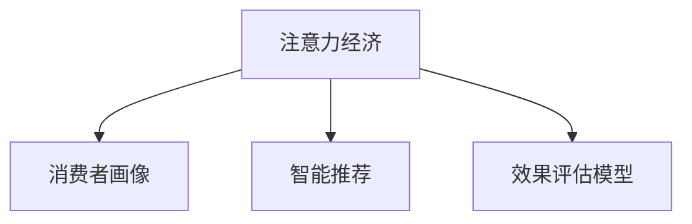

                 

# 注意力经济对企业决策过程的影响

> 关键词：注意力经济, 企业决策, 数字营销, 大数据分析, 人工智能

## 1. 背景介绍

### 1.1 问题由来

在信息爆炸的今天，注意力成为企业竞争中的重要资源。传统的基于内容的营销策略，已经不能有效吸引消费者注意，营销成本越来越高。如何高效获取和利用消费者的注意力，成为企业决策过程中亟待解决的问题。

### 1.2 问题核心关键点

注意力经济的核心在于：如何通过精准的消费者画像和智能的决策模型，将稀缺的注意力资源有效转化为商业价值。

具体来讲，包括以下几个方面：
- **消费者画像**：通过对消费者行为数据的分析，建立精准的消费者画像，理解消费者的兴趣、需求和行为模式。
- **智能推荐**：基于消费者画像，通过智能算法进行个性化推荐，最大化转化率和用户满意度。
- **效果评估**：使用AI技术进行效果评估，实时监控和调整营销策略，优化注意力资源的使用效率。

### 1.3 问题研究意义

掌握注意力经济的管理和运营规律，对于优化企业决策过程、提高资源利用效率、降低营销成本具有重要意义。

1. **提升转化率**：精准的消费者画像和智能推荐系统，能够显著提高营销活动的转化率，减少无效流量的浪费。
2. **优化资源配置**：通过大数据分析和AI决策，优化广告投放和内容创作的策略，提升投入产出比。
3. **增强用户粘性**：智能推荐和个性化服务，提升用户体验，增强用户对品牌的忠诚度和粘性。
4. **降低运营成本**：减少对传统渠道的依赖，优化运营流程，降低人工成本和营销支出。
5. **实现跨领域应用**：注意力经济的管理方法，不仅适用于广告和销售，还能够在社交媒体、内容创作、用户体验等多个领域发挥作用。

## 2. 核心概念与联系

### 2.1 核心概念概述

为了更好地理解注意力经济对企业决策过程的影响，本节将介绍几个关键概念：

- **注意力经济**：指在信息过载的环境下，如何通过优化资源配置和智能决策，高效获取和利用消费者的注意力，从而实现商业价值最大化的经济模式。

- **消费者画像**：指通过数据分析和机器学习技术，对消费者的行为、兴趣、需求等进行建模，构建详细的用户画像。

- **智能推荐系统**：指利用AI算法，对用户的行为数据进行分析和挖掘，为用户推荐个性化的商品、内容或服务。

- **效果评估模型**：指使用AI技术，对营销活动的实际效果进行量化评估，指导后续的优化和调整。

这些核心概念之间的逻辑关系可以通过以下Mermaid流程图来展示：



这个流程图展示了大规模用户数据的收集和分析，通过消费者画像和智能推荐，实现对消费者注意力的精准引导和优化配置，最终通过效果评估模型进行反馈和调整。

## 3. 核心算法原理 & 具体操作步骤

### 3.1 算法原理概述

注意力经济的实现，依赖于多个技术组件的协同工作：

1. **数据收集与处理**：通过多种渠道收集消费者行为数据，包括点击、浏览、购买、社交媒体互动等。
2. **消费者画像建模**：利用机器学习算法，对消费者行为数据进行分析和建模，生成详细的用户画像。
3. **智能推荐系统**：基于用户画像，使用深度学习算法，生成个性化的推荐结果。
4. **效果评估与反馈**：使用效果评估模型，量化营销活动的效果，并根据反馈进行持续优化。

### 3.2 算法步骤详解

基于注意力经济的企业决策过程，一般包括以下几个关键步骤：

**Step 1: 数据收集与处理**
- 从网站、APP、社交媒体等多个渠道，收集消费者的行为数据。
- 数据清洗和预处理，去除异常值和噪音数据。
- 对数据进行结构化处理，便于后续的分析和建模。

**Step 2: 消费者画像建模**
- 选择适合的技术和工具，如Logistic回归、决策树、随机森林等，对消费者行为数据进行建模。
- 生成详细的用户画像，包括基本信息、兴趣、行为模式等。

**Step 3: 智能推荐系统设计**
- 选择合适的推荐算法，如协同过滤、基于内容的推荐、深度学习等，生成个性化的推荐结果。
- 将推荐结果与业务系统集成，实现实时推荐。

**Step 4: 效果评估与优化**
- 设计效果评估模型，量化营销活动的转化率、点击率等指标。
- 使用A/B测试等方法，评估不同策略的效果。
- 根据反馈结果，持续优化推荐模型和策略。

### 3.3 算法优缺点

基于注意力经济的企业决策过程，具有以下优点：
1. **精准性**：通过消费者画像和智能推荐，能够实现精准的目标营销，提升转化率和用户满意度。
2. **高效性**：大数据分析和AI算法，使得注意力资源的使用效率大大提升，降低了运营成本。
3. **可扩展性**：技术框架的灵活性和可扩展性，使得注意力经济的管理方法可以应用于不同场景和领域。

同时，该方法也存在一些局限性：
1. **数据隐私问题**：消费者数据的收集和使用可能涉及隐私问题，需要严格遵守数据保护法规。
2. **算法偏见**：基于数据的推荐系统可能存在算法偏见，需要持续监控和调整。
3. **动态变化挑战**：消费者行为和市场环境是动态变化的，需要持续更新和优化模型。
4. **技术门槛高**：实现有效的注意力经济管理，需要具备较高的技术水平和数据处理能力。

尽管存在这些局限性，但就目前而言，基于注意力经济的方法仍然是企业决策过程中最为有效和高效的手段之一。未来相关研究的重点在于如何进一步降低技术门槛，提高算法的可解释性和公平性，同时兼顾数据隐私保护等因素。

### 3.4 算法应用领域

注意力经济的管理方法，已经在多个行业领域得到应用，例如：

- **电子商务**：通过智能推荐，提高广告点击率和购买转化率。
- **社交媒体**：通过个性化推荐和用户互动，提升用户活跃度和粘性。
- **内容创作**：根据用户偏好，优化内容创作和分发策略，提高内容传播效果。
- **金融服务**：通过智能推荐和风险评估，提升用户满意度和交易安全性。
- **旅游行业**：通过个性化推荐和目的地推荐，提高用户预订率和满意度。

除了上述这些经典应用外，注意力经济的管理方法还在更多新兴领域得到应用，如智能交通、智慧城市、教育培训等，为各行业带来了新的增长点和发展机遇。

## 4. 数学模型和公式 & 详细讲解 & 举例说明

### 4.1 数学模型构建

假设我们有一个用户画像的向量表示为 $x \in \mathbb{R}^n$，其中每个维度表示用户的某个属性或行为特征。设消费者的行为数据为 $y \in \mathbb{R}^m$，其中 $m$ 表示不同维度的行为数据，如点击、购买、浏览等。

定义用户画像与行为数据的矩阵为 $X \in \mathbb{R}^{n \times m}$，行为数据矩阵为 $Y \in \mathbb{R}^{m \times k}$，其中 $k$ 表示样本数量。则用户画像与行为数据的关系可以表示为：

$$
Y = Xw + b
$$

其中 $w \in \mathbb{R}^n$ 为权重向量，$b \in \mathbb{R}^k$ 为偏置向量。

### 4.2 公式推导过程

通过线性回归模型，我们可以对用户画像和行为数据的关系进行建模。具体推导如下：

1. **最小二乘法**：通过最小化损失函数 $L = \frac{1}{2k} \sum_{i=1}^k (y_i - X_iw - b)^2$，求解最优的权重向量 $w$ 和偏置向量 $b$。
2. **正则化**：为了防止过拟合，可以引入正则化项 $L_r = \alpha ||w||_2^2$，其中 $\alpha$ 为正则化系数。
3. **求解公式**：使用梯度下降算法，求解最优的 $w$ 和 $b$：

$$
\frac{\partial L}{\partial w} = \frac{1}{k}(X^TX + \alpha I)w - \frac{1}{k}X^T(Y - Xw - b)
$$
$$
\frac{\partial L}{\partial b} = \frac{1}{k}(Y - Xw - b)
$$

### 4.3 案例分析与讲解

以一个电子商务网站的推荐系统为例，进行详细分析：

- **数据收集**：收集用户的点击、购买、浏览等行为数据。
- **特征工程**：对行为数据进行特征提取，如点击次数、购买金额、浏览时长等。
- **用户画像建模**：使用线性回归模型，将用户行为数据与用户画像向量进行拟合，生成详细的用户画像。
- **智能推荐**：使用协同过滤算法，根据用户画像和商品特征，生成个性化的推荐结果。
- **效果评估**：使用点击率、转化率等指标，评估推荐系统的实际效果，进行持续优化。

## 5. 项目实践：代码实例和详细解释说明

### 5.1 开发环境搭建

在进行注意力经济项目实践前，我们需要准备好开发环境。以下是使用Python进行TensorFlow开发的环境配置流程：

1. 安装Anaconda：从官网下载并安装Anaconda，用于创建独立的Python环境。

2. 创建并激活虚拟环境：
```bash
conda create -n attention-economy python=3.8 
conda activate attention-economy
```

3. 安装TensorFlow：根据CUDA版本，从官网获取对应的安装命令。例如：
```bash
conda install tensorflow tensorflow-gpu -c conda-forge
```

4. 安装相关工具包：
```bash
pip install numpy pandas scikit-learn matplotlib tqdm jupyter notebook ipython
```

完成上述步骤后，即可在`attention-economy`环境中开始项目实践。

### 5.2 源代码详细实现

这里我们以推荐系统为例，给出使用TensorFlow进行推荐算法的PyTorch代码实现。

首先，定义推荐系统的输入和输出：

```python
import tensorflow as tf

class RecommendationSystem(tf.keras.Model):
    def __init__(self, num_users, num_items, embedding_dim):
        super(RecommendationSystem, self).__init__()
        self.num_users = num_users
        self.num_items = num_items
        self.embedding_dim = embedding_dim
        
        self.user_embeddings = tf.keras.layers.Embedding(num_users, embedding_dim)
        self.item_embeddings = tf.keras.layers.Embedding(num_items, embedding_dim)
        self.interaction = tf.keras.layers.Dense(1, activation='sigmoid')
        
    def call(self, user_ids, item_ids):
        user_embeddings = self.user_embeddings(user_ids)
        item_embeddings = self.item_embeddings(item_ids)
        
        # 计算用户-物品交互
        interaction = tf.reduce_sum(user_embeddings * item_embeddings, axis=-1)
        
        # 预测用户对物品的评分
        predictions = self.interaction(interaction)
        
        return predictions
```

然后，训练和评估推荐系统：

```python
from sklearn.model_selection import train_test_split

# 定义数据集
X = # 用户行为矩阵
y = # 用户评分矩阵

# 划分训练集和测试集
X_train, X_test, y_train, y_test = train_test_split(X, y, test_size=0.2)

# 定义模型
model = RecommendationSystem(num_users, num_items, embedding_dim)

# 定义损失函数和优化器
loss_fn = tf.keras.losses.BinaryCrossentropy()
optimizer = tf.keras.optimizers.Adam()

# 定义评估指标
metrics = tf.keras.metrics.BinaryAccuracy(name='accuracy')

# 训练模型
for epoch in range(num_epochs):
    for user_ids, item_ids, true_labels in dataset:
        with tf.GradientTape() as tape:
            predictions = model(user_ids, item_ids)
            loss = loss_fn(true_labels, predictions)
        gradients = tape.gradient(loss, model.trainable_variables)
        optimizer.apply_gradients(zip(gradients, model.trainable_variables))
        
    # 评估模型
    metrics.update_state(true_labels, predictions)

# 输出评估结果
print(f'Accuracy: {metrics.result().numpy() * 100:.2f}%')
```

### 5.3 代码解读与分析

让我们再详细解读一下关键代码的实现细节：

**RecommendationSystem类**：
- `__init__`方法：初始化模型的输入、输出、嵌入层等组件。
- `call`方法：定义模型的前向传播过程，计算用户-物品交互和预测评分。

**数据集划分**：
- 使用`train_test_split`函数将数据集划分为训练集和测试集，用于训练和评估模型。

**模型训练与评估**：
- 使用TensorFlow的`GradientTape`对象，记录模型的梯度，并使用`apply_gradients`函数更新模型参数。
- 使用TensorFlow的`BinaryCrossentropy`和`Adam`优化器，定义损失函数和优化器。
- 使用TensorFlow的`BinaryAccuracy`评估指标，计算模型的准确率。
- 在每个epoch结束时，评估模型的准确率并输出结果。

以上代码展示了使用TensorFlow进行推荐系统训练的完整流程，体现了TensorFlow强大的框架支持和易用性。

## 6. 实际应用场景

### 6.1 智能客服系统

基于注意力经济的智能客服系统，可以广泛应用于企业客服管理。传统的客服系统依赖人工坐席，成本高且效率低。使用智能推荐系统，可以实现自动化的客户分流和问题解答，提升服务效率和用户体验。

在技术实现上，可以收集企业的历史客服对话记录，将问题和最佳答复构建成监督数据，在此基础上对推荐模型进行微调。微调后的模型能够自动理解客户意图，匹配最合适的回答模板进行回复。对于客户提出的新问题，还可以接入检索系统实时搜索相关内容，动态组织生成回答。如此构建的智能客服系统，能大幅提升客户咨询体验和问题解决效率。

### 6.2 金融舆情监测

金融机构需要实时监测市场舆论动向，以便及时应对负面信息传播，规避金融风险。传统的舆情监测依赖人工手动分析，效率低下且容易遗漏。基于注意力经济的舆情监测系统，可以自动分析海量网络文本数据，实时监测舆情变化，及时预警潜在风险。

具体而言，可以收集金融领域相关的新闻、报道、评论等文本数据，并对其进行主题标注和情感标注。在此基础上对推荐模型进行微调，使其能够自动判断文本属于何种主题，情感倾向是正面、中性还是负面。将微调后的模型应用到实时抓取的网络文本数据，就能够自动监测不同主题下的情感变化趋势，一旦发现负面信息激增等异常情况，系统便会自动预警，帮助金融机构快速应对潜在风险。

### 6.3 个性化推荐系统

当前的推荐系统往往只依赖用户的历史行为数据进行物品推荐，无法深入理解用户的真实兴趣偏好。基于注意力经济的推荐系统，可以通过智能推荐和个性化服务，提升用户体验和满意度。

在实践中，可以收集用户浏览、点击、评论、分享等行为数据，提取和用户交互的物品标题、描述、标签等文本内容。将文本内容作为模型输入，用户的后续行为（如是否点击、购买等）作为监督信号，在此基础上微调推荐模型。微调后的模型能够从文本内容中准确把握用户的兴趣点。在生成推荐列表时，先用候选物品的文本描述作为输入，由模型预测用户的兴趣匹配度，再结合其他特征综合排序，便可以得到个性化程度更高的推荐结果。

### 6.4 未来应用展望

随着注意力经济的应用范围不断扩大，未来在更多领域将发挥重要作用：

- **智慧医疗**：基于注意力经济的医疗推荐系统，可以推荐个性化医疗方案，提升诊疗效率和患者满意度。
- **智能教育**：通过智能推荐和学习分析，提供个性化的学习路径和资源，提高教育质量。
- **智慧交通**：基于用户行为数据的智能推荐，优化出行路线和方式，提升出行效率和安全性。
- **智慧城市**：通过用户画像和智能推荐，优化城市资源配置，提升城市管理水平。
- **文化娱乐**：通过智能推荐和个性化服务，提升用户对文化娱乐内容的体验和粘性。

此外，在企业生产、社会治理、文娱传媒等众多领域，基于注意力经济的推荐系统也将不断涌现，为各行各业带来新的增长点和发展机遇。相信随着技术的日益成熟，注意力经济的应用前景将更加广阔，为经济社会发展注入新的动力。

## 7. 工具和资源推荐

### 7.1 学习资源推荐

为了帮助开发者系统掌握注意力经济的相关技术，这里推荐一些优质的学习资源：

1. 《注意力经济：基于数据的消费者行为分析与建模》书籍：全面介绍了注意力经济的基本概念、技术和应用，适合学术研究和工业应用。

2. 《推荐系统实战：从零到一构建推荐引擎》博文：由一线推荐工程师撰写，深入浅出地介绍了推荐系统从数据收集到模型训练的完整流程。

3. 《深度学习：理论与实践》课程：斯坦福大学开设的深度学习课程，涵盖注意力机制的原理和应用，适合系统学习。

4. Coursera《推荐系统》课程：由LinkedIn和IBM联合开设，介绍了推荐系统的经典算法和技术，适合学习者快速入门。

5. Kaggle推荐系统竞赛：通过实际竞赛项目，学习如何设计和实现推荐系统，提升实际应用能力。

通过对这些资源的学习实践，相信你一定能够快速掌握注意力经济的精髓，并用于解决实际的商业问题。

### 7.2 开发工具推荐

高效的开发离不开优秀的工具支持。以下是几款用于注意力经济开发的常用工具：

1. TensorFlow：由Google主导开发的深度学习框架，生产部署方便，适合大规模工程应用。

2. PyTorch：基于Python的开源深度学习框架，灵活易用，适合快速迭代研究。

3. Scikit-learn：Python的机器学习库，提供多种经典算法和模型，适合数据处理和模型训练。

4. Jupyter Notebook：交互式的Python开发环境，支持代码编写、数据分析和模型训练，适合团队协作和分享。

5. Tableau：数据可视化工具，支持复杂的数据分析和报表生成，适合进行用户画像和效果评估。

合理利用这些工具，可以显著提升注意力经济项目的开发效率，加快创新迭代的步伐。

### 7.3 相关论文推荐

注意力经济的研究源于学界的持续探索。以下是几篇奠基性的相关论文，推荐阅读：

1. Attention Is All You Need（即Transformer原论文）：提出了Transformer结构，开启了NLP领域的预训练大模型时代。

2. Transformer-XL: Attentive Language Models Beyond a Fixed-Length Context：提出了Transformer-XL模型，支持自适应长文本处理，进一步提升了NLP任务的性能。

3. MoEL: A Model-agnostic Suggestion Method for Recommender Systems：提出MoEL方法，结合注意力机制和深度学习，提升了推荐系统的精度和效果。

4. Triplet Network for Recommendation System：提出Triplet Network模型，通过三重网络结构优化推荐结果，提高了推荐系统的稳定性和准确性。

5. Attention-based Recommendation System：提出基于注意力机制的推荐系统，通过动态调整注意力权重，提升了个性化推荐的效果。

这些论文代表了大语言模型注意力机制的发展脉络。通过学习这些前沿成果，可以帮助研究者把握学科前进方向，激发更多的创新灵感。

## 8. 总结：未来发展趋势与挑战

### 8.1 总结

本文对基于注意力经济的企业决策过程进行了全面系统的介绍。首先阐述了注意力经济的基本概念和研究背景，明确了其对于优化企业决策过程、提高资源利用效率、降低营销成本的重要意义。其次，从原理到实践，详细讲解了注意力经济在数据收集、用户画像、智能推荐和效果评估等环节的技术实现，给出了完整的项目实践代码。同时，本文还广泛探讨了注意力经济在智能客服、金融舆情、个性化推荐等多个行业领域的应用前景，展示了其广阔的发展空间。

通过本文的系统梳理，可以看到，基于注意力经济的方法正在成为企业决策过程中最为有效和高效的手段之一。它通过精准的消费者画像和智能的推荐系统，最大化地利用稀缺的注意力资源，实现商业价值的最大化。

### 8.2 未来发展趋势

展望未来，注意力经济的管理和运营方法将呈现以下几个发展趋势：

1. **自动化程度提升**：随着技术进步，更多的企业将采用基于AI的自动化工具，实现从数据收集到决策执行的全流程自动化。

2. **多模态融合**：除了文本数据外，更多企业将结合图像、视频、音频等多模态数据，实现更加全面和精准的消费者画像。

3. **动态优化**：基于实时数据的动态优化方法，能够更好地应对消费者行为和市场环境的变化，提升决策的及时性和有效性。

4. **跨领域应用**：注意力经济的管理方法，将在更多行业和领域得到应用，为企业带来新的增长点和竞争优势。

5. **伦理与安全**：随着数据隐私和安全问题日益重要，未来的系统将更加注重伦理和合规性，保护消费者隐私，提升系统的安全性。

6. **智能化升级**：通过引入更多AI技术，如因果推断、强化学习等，提升注意力经济的智能化水平，实现更加全面和精准的决策支持。

以上趋势凸显了注意力经济的管理和运营方法的广阔前景。这些方向的探索发展，必将进一步提升企业决策的效率和效果，推动经济社会的智能化和数字化转型。

### 8.3 面临的挑战

尽管注意力经济的管理和运营方法已经取得了显著成效，但在应用过程中仍面临诸多挑战：

1. **数据隐私和安全**：消费者的行为数据涉及个人隐私，需要严格遵守数据保护法规，避免数据泄露和安全风险。

2. **数据质量与噪声**：数据收集和处理过程中可能存在噪音和偏差，影响模型的精度和效果。

3. **算法公平性和偏见**：基于数据的推荐系统可能存在算法偏见，需要持续监控和调整。

4. **技术门槛高**：实现有效的注意力经济管理，需要具备较高的技术水平和数据处理能力。

5. **动态变化挑战**：消费者行为和市场环境是动态变化的，需要持续更新和优化模型。

6. **资源投入高**：数据收集和处理、模型训练和优化，需要大量的计算资源和时间投入。

正视这些挑战，积极应对并寻求突破，将是大语言模型注意力经济走向成熟的必由之路。相信随着学界和产业界的共同努力，这些挑战终将一一被克服，注意力经济的管理和运营方法必将在构建人机协同的智能时代中扮演越来越重要的角色。

### 8.4 研究展望

面对注意力经济面临的种种挑战，未来的研究需要在以下几个方面寻求新的突破：

1. **数据治理与隐私保护**：引入区块链和联邦学习等技术，保护数据隐私，确保数据安全。

2. **多模态融合与数据协同**：通过多模态数据融合，提升消费者画像的全面性和准确性。

3. **动态优化与实时调整**：开发动态优化算法，实时更新模型，适应市场变化。

4. **跨领域应用与融合**：探索跨领域的应用场景，实现不同领域数据的协同建模。

5. **智能化升级与自动化**：引入更多AI技术，提升系统的智能化水平，实现自动化管理。

6. **伦理与安全约束**：建立系统的伦理和合规性框架，确保注意力经济应用的透明性和公平性。

这些研究方向的探索，必将引领注意力经济的管理和运营方法迈向更高的台阶，为构建安全、可靠、可解释、可控的智能系统铺平道路。面向未来，注意力经济的管理和运营方法还需要与其他人工智能技术进行更深入的融合，共同推动人工智能技术在垂直行业的规模化落地。总之，注意力经济的管理方法需要不断创新和优化，才能真正实现商业价值的最大化。

## 9. 附录：常见问题与解答

**Q1：注意力经济与传统的基于内容的营销策略有何不同？**

A: 传统的基于内容的营销策略，主要依赖人工策划和创作，成本高且效果难以量化。而注意力经济通过数据驱动的消费者画像和智能推荐，能够实现精准的目标营销，提升转化率和用户满意度。

**Q2：注意力经济的管理方法适用于哪些企业？**

A: 任何需要处理海量消费者数据、进行精准营销和客户管理的企业，都可以应用注意力经济的管理方法。尤其适用于电商、金融、媒体、旅游等行业，能够显著提升营销效果和客户体验。

**Q3：注意力经济的管理方法需要哪些技术支持？**

A: 需要数据收集与处理、消费者画像建模、智能推荐系统、效果评估模型等技术支持。其中，数据处理、机器学习和AI算法是核心技术环节。

**Q4：注意力经济的实现过程中需要注意哪些问题？**

A: 注意数据隐私保护、算法偏见、动态变化挑战、技术门槛和资源投入等问题。需要综合考虑技术、业务和伦理等多方面因素，制定合理的策略和方案。

**Q5：如何优化注意力经济的管理方法？**

A: 持续优化模型、算法和流程，引入更多AI技术，提升智能化水平。同时，注重数据治理和隐私保护，确保系统的合法合规性。

通过这些问题的解答，可以看到，注意力经济的管理方法具有广泛的应用前景和重要的实际意义。但同时，实现高效的注意力经济管理，需要跨学科的知识和技术积累，需要各方的共同努力。相信随着技术的发展和应用的推广，注意力经济将为各行业带来更多的价值和机遇。

