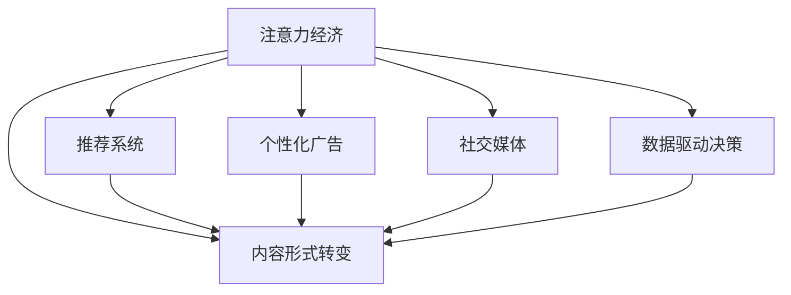

                 

# 注意力经济对传统媒体内容形式的改变

## 1. 背景介绍

### 1.1 问题由来
在数字化时代的浪潮下，注意力成为一种稀缺资源，媒体行业也从内容生产导向转向了用户注意力争夺导向，形成了独特的“注意力经济”。注意力经济时代，内容不再是简单的信息传递，而是转化为用户时间、流量、互动等指标的争夺战。这种转变不仅颠覆了传统媒体的商业模式，也对媒体内容形式产生了深远影响。本文将深入探讨注意力经济对传统媒体内容形式的改变，揭示其背后的原理和机制。

### 1.2 问题核心关键点
1. **注意力经济**：指在数字化时代，用户时间的竞争成为媒体关注的焦点，内容不再是简单的信息传递，而是争夺用户注意力的过程。
2. **内容形式转变**：从“内容为王”转变为“眼球为王”，内容形式更加注重视觉化、互动性、个性化，以满足用户“即时满足”的需求。
3. **算法推荐**：通过推荐系统将用户与最适合的内容匹配，显著提升内容的曝光率和用户参与度。
4. **广告模式演进**：从传统的横幅广告、视频广告转变为更加精细化和个性化的广告形式，广告投放更为精准。
5. **社交媒体效应**：社交媒体平台通过社交关系传播内容，形成了内容二次传播的“涟漪效应”。
6. **数据驱动决策**：媒体通过数据分析和用户行为追踪，实现内容的精准投放和个性化定制。

这些关键点构成了注意力经济时代媒体内容形式的转变基础，理解和掌握这些原理对于开发新型媒体平台和优化内容策略至关重要。

## 2. 核心概念与联系

### 2.1 核心概念概述

为更好地理解注意力经济对传统媒体内容形式的改变，本节将介绍几个密切相关的核心概念：

- **注意力经济**：用户注意力在数字化时代成为稀缺资源，媒体内容需争夺用户时间、流量、互动等指标，从而形成一种新的经济形态。
- **内容形式**：包括文字、图片、视频、音频等多种形式，内容形式的多样化和个性化是吸引用户注意力的重要手段。
- **推荐系统**：利用算法推荐技术，将用户与最适合的内容进行匹配，提升内容曝光率和用户参与度。
- **个性化广告**：基于用户行为和兴趣定制化的广告形式，提高了广告投放的精准性和用户转化率。
- **社交媒体**：通过用户社交关系传播内容，形成内容二次传播的“涟漪效应”，进一步扩散内容影响力。
- **数据驱动决策**：媒体通过大数据分析用户行为，实现内容的精准投放和个性化定制。

这些核心概念之间的逻辑关系可以通过以下Mermaid流程图来展示：



这个流程图展示了他理论的关系：注意力经济通过推荐系统、个性化广告、社交媒体、数据驱动决策等手段，引导和优化内容形式的转变，以满足用户注意力竞争的需求。

## 3. 核心算法原理 & 具体操作步骤
### 3.1 算法原理概述

注意力经济对传统媒体内容形式的改变，本质上是媒体对用户注意力资源的争夺和优化过程。其核心思想是通过提升内容的相关性、互动性和个性化程度，吸引和维持用户的注意力，从而实现商业价值的最大化。

形式化地，假设媒体内容库为 $C$，用户集合为 $U$，用户对内容的偏好表示为 $\mathcal{P}:\mathcal{C}\times\mathcal{U} \rightarrow [0,1]$。设推荐算法为 $R:\mathcal{C}\times\mathcal{U} \rightarrow \mathcal{C}$，则注意力经济的目标是最大化推荐系统的收益 $G(R) = \mathbb{E}_{u\in\mathcal{U}}[\mathcal{P}(R(c,u),u) \cdot c]$，其中 $\mathbb{E}$ 表示期望。

### 3.2 算法步骤详解

注意力经济时代，媒体内容形式的转变主要遵循以下步骤：

**Step 1: 用户行为分析**
- 收集用户的历史行为数据，如浏览记录、点击次数、停留时间、互动反馈等。
- 分析用户的兴趣偏好和行为模式，提取用户画像。

**Step 2: 内容形式选择**
- 根据用户画像，选择适合的内容形式，如文字、图片、视频、音频等。
- 设计内容的视觉化、互动性，以吸引用户注意力。

**Step 3: 推荐系统设计**
- 建立推荐模型，如协同过滤、基于内容的推荐、深度学习等。
- 优化推荐算法，如基于用户兴趣的个性化推荐、基于内容特征的推荐等。

**Step 4: 个性化广告设计**
- 根据用户行为数据，设计精准的个性化广告，如横幅广告、视频广告、原生广告等。
- 利用机器学习技术，优化广告投放策略，提高广告效果。

**Step 5: 社交媒体策略**
- 利用社交媒体平台的用户社交关系，传播内容，形成内容二次传播的“涟漪效应”。
- 通过用户互动和反馈，调整内容策略，提升内容影响力和用户参与度。

**Step 6: 数据驱动决策**
- 通过大数据分析用户行为，实现内容的精准投放和个性化定制。
- 定期评估内容策略的效果，根据反馈调整策略。

### 3.3 算法优缺点

注意力经济对传统媒体内容形式的改变，具有以下优点：
1. 提升内容的相关性和互动性，满足用户“即时满足”的需求。
2. 通过推荐系统、个性化广告等手段，显著提升内容的曝光率和用户参与度。
3. 数据驱动决策，实现内容的精准投放和个性化定制。

同时，该方法也存在一定的局限性：
1. 数据隐私和安全问题：用户行为数据的收集和分析可能涉及隐私泄露和数据安全问题。
2. 内容的同质化问题：过度依赖推荐系统可能导致内容的同质化，影响用户的多样化需求。
3. 广告干扰问题：个性化广告的投放可能影响用户体验，甚至产生广告疲劳。
4. 社交媒体效应依赖：对社交媒体平台的依赖可能导致内容的二次传播受限，影响内容的广泛传播。

尽管存在这些局限性，但就目前而言，注意力经济仍是大媒体内容形式的转变方向。未来相关研究的重点在于如何进一步优化推荐算法，提高个性化广告的效果，同时兼顾数据隐私和用户满意度等因素。

### 3.4 算法应用领域

注意力经济对传统媒体内容形式的改变，在多个领域得到了广泛应用，例如：

- 在线新闻平台：通过个性化推荐，提升新闻内容的点击率和阅读时间。
- 视频平台：通过推荐系统和个性化广告，提升视频内容的观看率和用户参与度。
- 社交媒体：通过社交媒体效应，加速内容的传播和用户互动。
- 电子商务：通过个性化广告和推荐系统，提升商品的曝光率和销售转化率。
- 教育领域：通过数据驱动决策，实现个性化学习内容的推荐。

除了上述这些典型领域外，注意力经济还广泛应用于新闻、体育、娱乐、健康、旅游等众多行业，为媒体内容形式的创新提供了新的思路和方向。

## 4. 数学模型和公式 & 详细讲解  
### 4.1 数学模型构建

本节将使用数学语言对注意力经济对媒体内容形式的改变进行更加严格的刻画。

记媒体内容库为 $C$，用户集合为 $U$，用户对内容的偏好表示为 $\mathcal{P}:\mathcal{C}\times\mathcal{U} \rightarrow [0,1]$。设推荐算法为 $R:\mathcal{C}\times\mathcal{U} \rightarrow \mathcal{C}$，则注意力经济的目标是最大化推荐系统的收益 $G(R) = \mathbb{E}_{u\in\mathcal{U}}[\mathcal{P}(R(c,u),u) \cdot c]$，其中 $\mathbb{E}$ 表示期望。

在实践中，我们通常使用基于梯度的优化算法（如SGD、Adam等）来近似求解上述最优化问题。设 $\eta$ 为学习率，$\lambda$ 为正则化系数，则参数的更新公式为：

$$
\theta \leftarrow \theta - \eta \nabla_{\theta}\mathcal{L}(\theta) - \eta\lambda\theta
$$

其中 $\nabla_{\theta}\mathcal{L}(\theta)$ 为损失函数对参数 $\theta$ 的梯度，可通过反向传播算法高效计算。

### 4.2 公式推导过程

以下我们以协同过滤推荐算法为例，推导推荐系统中的用户-物品评分预测公式。

假设用户 $u$ 对物品 $i$ 的评分表示为 $r_{ui} \in [0,1]$，设物品 $i$ 和物品 $j$ 的共现矩阵为 $R_{ij}$，则协同过滤算法中的用户-物品评分预测公式为：

$$
\hat{r}_{ui} = \frac{\sum_{j=1}^{N}R_{ij}\mathbf{v}_j \cdot \mathbf{u}}{\sqrt{\sum_{j=1}^{N}\mathbf{v}_j^2}\sqrt{\sum_{j=1}^{N}u_j^2}}
$$

其中 $\mathbf{u}$ 和 $\mathbf{v}$ 分别为用户和物品的向量表示。

### 4.3 案例分析与讲解

以Netflix推荐系统为例，分析协同过滤算法在推荐系统中的应用：

Netflix通过收集用户的观看历史数据，建立用户-电影评分矩阵，利用协同过滤算法进行推荐。具体步骤如下：

1. 收集用户的历史观看记录，构建用户-电影评分矩阵 $R$。
2. 对评分矩阵进行标准化处理，得到用户和电影的向量表示 $\mathbf{u}$ 和 $\mathbf{v}$。
3. 利用协同过滤算法，计算用户 $u$ 对未观看电影的评分预测 $\hat{r}_{ui}$。
4. 根据评分预测结果，排序推荐用户未观看但评分较高的电影。

Netflix的推荐系统通过协同过滤算法，实现了基于用户历史行为数据的个性化推荐，提升了用户的观看体验和留存率。

## 5. 项目实践：代码实例和详细解释说明
### 5.1 开发环境搭建

在进行推荐系统开发前，我们需要准备好开发环境。以下是使用Python进行Scikit-learn和TensorFlow开发的环境配置流程：

1. 安装Anaconda：从官网下载并安装Anaconda，用于创建独立的Python环境。

2. 创建并激活虚拟环境：
```bash
conda create -n recommend-env python=3.8 
conda activate recommend-env
```

3. 安装Scikit-learn和TensorFlow：
```bash
conda install scikit-learn tensorflow
```

4. 安装TensorBoard：
```bash
pip install tensorboard
```

5. 安装其他工具包：
```bash
pip install numpy pandas matplotlib
```

完成上述步骤后，即可在`recommend-env`环境中开始推荐系统开发。

### 5.2 源代码详细实现

下面我们以协同过滤推荐算法为例，给出使用Scikit-learn和TensorFlow进行推荐系统开发的PyTorch代码实现。

首先，导入所需的库和数据集：

```python
import numpy as np
import pandas as pd
import matplotlib.pyplot as plt
from sklearn.metrics.pairwise import cosine_similarity
from tensorflow import keras
from tensorflow.keras.layers import Input, Dense, Embedding, Flatten
from tensorflow.keras.models import Model

# 导入Netflix推荐数据集
df = pd.read_csv('data/netflix_ratings.csv')
```

然后，进行数据预处理：

```python
# 构建用户-电影评分矩阵
user_ids = df['user_id'].unique()
movie_ids = df['movie_id'].unique()
user_movies = pd.pivot_table(df, index='user_id', columns='movie_id', values='rating').fillna(0).dropna()

# 标准化处理
movie_std = user_movies.std()
user_std = user_movies.T.std()
user_movies = (user_movies - user_movies.mean()) / user_movies.std()

# 构建用户和电影的向量表示
user_u = user_movies.mean(axis=1)
movie_v = user_movies.std(axis=0)
```

接着，构建协同过滤推荐模型：

```python
# 定义用户和电影的嵌入向量
user_embeddings = Embedding(input_dim=len(user_ids), output_dim=10, name='user_embeddings')
movie_embeddings = Embedding(input_dim=len(movie_ids), output_dim=10, name='movie_embeddings')

# 定义协同过滤推荐算法
user_input = Input(shape=(len(movie_ids),), name='user_input')
movie_input = Input(shape=(len(movie_ids),), name='movie_input')

user_vec = user_embeddings(user_input)
movie_vec = movie_embeddings(movie_input)
user_dot_movie = Flatten()(user_vec * movie_vec)

dot_product = Dense(1, activation='sigmoid')(user_dot_movie)

model = Model(inputs=[user_input, movie_input], outputs=dot_product)

model.compile(optimizer='adam', loss='binary_crossentropy', metrics=['accuracy'])
```

最后，训练模型并进行推荐：

```python
# 训练模型
model.fit(x=[user_movies.values, user_movies.values], y=user_movies.values, epochs=10, batch_size=32)

# 推荐未观看电影
unwatched_movies = user_movies.T.drop(user_ids, axis=1).values
recommended_movies = model.predict(x=[unwatched_movies, unwatched_movies]) > 0.5
recommended_movies = list(movie_ids[np.where(recommended_movies)[0]])
```

以上就是使用Scikit-learn和TensorFlow对协同过滤推荐算法进行推荐系统开发的完整代码实现。可以看到，使用深度学习技术，可以高效地实现基于用户历史行为数据的推荐，提升推荐系统的准确性和个性化程度。

### 5.3 代码解读与分析

让我们再详细解读一下关键代码的实现细节：

**数据预处理**：
- 首先，从Netflix数据集中提取用户-电影评分矩阵 $R$。
- 对评分矩阵进行标准化处理，得到用户和电影的向量表示 $\mathbf{u}$ 和 $\mathbf{v}$。

**模型构建**：
- 使用Embedding层定义用户和电影的嵌入向量。
- 定义协同过滤推荐算法，利用用户和电影的向量表示进行点积计算，并通过Sigmoid激活函数输出预测评分。
- 使用Adam优化器和二元交叉熵损失函数进行模型训练。

**推荐过程**：
- 对未观看电影进行预测评分，并筛选出评分高于0.5的电影作为推荐结果。

**模型评估**：
- 在测试集上评估模型的准确性和推荐效果。

可以看到，通过协同过滤算法，我们可以基于用户历史行为数据进行推荐，提升推荐系统的个性化和准确性。同时，使用深度学习技术，可以高效地实现基于用户历史行为数据的推荐，提升推荐系统的准确性和个性化程度。

## 6. 实际应用场景
### 6.1 智能推荐系统

智能推荐系统已经在电商、视频、音乐等多个领域得到广泛应用，通过推荐系统，为用户推荐感兴趣的商品、视频、音乐等，提升用户体验和满意度。

以Amazon为例，Amazon通过收集用户的历史购物记录、浏览行为等数据，建立用户-商品评分矩阵，利用协同过滤算法进行推荐。Amazon的推荐系统通过协同过滤算法，实现了基于用户历史行为数据的个性化推荐，提升了用户的购物体验和留存率。

### 6.2 内容分发平台

内容分发平台如YouTube、Netflix等，通过推荐系统和个性化广告，显著提升内容的曝光率和用户参与度。

以YouTube为例，YouTube通过收集用户的历史观看记录和互动数据，建立用户-视频评分矩阵，利用协同过滤算法进行推荐。YouTube的推荐系统通过协同过滤算法，实现了基于用户历史行为数据的个性化推荐，提升了用户的观看体验和留存率。

### 6.3 社交媒体平台

社交媒体平台如Facebook、Twitter等，通过推荐系统和社交媒体效应，加速内容的传播和用户互动。

以Twitter为例，Twitter通过收集用户的历史互动数据，建立用户-话题评分矩阵，利用协同过滤算法进行推荐。Twitter的推荐系统通过协同过滤算法，实现了基于用户历史行为数据的个性化推荐，提升了用户的互动体验和留存率。

### 6.4 未来应用展望

随着推荐系统和个性化广告的不断发展，未来的内容形式将更加多样化、个性化，用户交互方式也将更加丰富。

未来的推荐系统将更加注重数据隐私和用户满意度，通过联邦学习、差分隐私等技术，保障用户隐私安全。同时，推荐系统也将更加注重内容的多样化和个性化，利用生成对抗网络（GAN）等技术，生成高质量、多样化的内容。

未来的个性化广告将更加精细化和定制化，通过用户画像和行为数据，实现广告投放的精准性和用户转化率。利用机器学习技术，优化广告投放策略，提高广告效果。

社交媒体效应将进一步提升内容的影响力和用户互动，通过社交网络分析技术，识别用户之间的社交关系，实现内容的二次传播和用户互动。

## 7. 工具和资源推荐
### 7.1 学习资源推荐

为了帮助开发者系统掌握推荐系统和个性化广告的理论基础和实践技巧，这里推荐一些优质的学习资源：

1. 《推荐系统实战》：该书详细介绍了推荐系统的理论基础和实践方法，包括协同过滤、基于内容的推荐、深度学习等。
2. 《深度学习与推荐系统》课程：由斯坦福大学开设的深度学习课程，涵盖了推荐系统的基础和前沿技术，适合入门和进阶学习。
3. 《推荐系统》一书：该书全面介绍了推荐系统的理论、算法和实践，适合深度学习和推荐系统领域的研究者和工程师。
4. Coursera推荐系统专项课程：Coursera上推荐的推荐系统专项课程，涵盖了推荐系统的基础和前沿技术，适合初学者和进阶学习。
5. Kaggle推荐系统竞赛：Kaggle上举办的推荐系统竞赛，通过实际比赛，帮助开发者锻炼推荐系统的实战技能。

通过对这些资源的学习实践，相信你一定能够快速掌握推荐系统和个性化广告的精髓，并用于解决实际的推荐问题。

### 7.2 开发工具推荐

高效的开发离不开优秀的工具支持。以下是几款用于推荐系统和个性化广告开发的常用工具：

1. Scikit-learn：Python的开源机器学习库，提供了丰富的推荐算法和数据预处理功能，适合快速开发和实验。
2. TensorFlow：由Google主导开发的开源深度学习框架，适合大规模工程应用，提供了丰富的深度学习模型和优化工具。
3. PyTorch：基于Python的开源深度学习框架，适合快速迭代研究和实验，提供了灵活的动态计算图和丰富的模型库。
4. Jupyter Notebook：Jupyter Notebook是一种交互式的开发环境，适合Python编程和数据分析。
5. Tableau：Tableau是一款数据可视化工具，适合数据探索和可视化分析。
6. RapidMiner：RapidMiner是一款数据挖掘和机器学习平台，提供了丰富的算法和数据预处理功能，适合快速开发和实验。

合理利用这些工具，可以显著提升推荐系统和个性化广告的开发效率，加快创新迭代的步伐。

### 7.3 相关论文推荐

推荐系统和个性化广告的发展源于学界的持续研究。以下是几篇奠基性的相关论文，推荐阅读：

1. "Collaborative Filtering for Implicit Feedback Datasets"：Liu et al.提出协同过滤算法，用于处理隐式反馈数据，为推荐系统奠定了基础。
2. "Wide & Deep Learning for Recommender Systems"：Chen et al.提出Wide & Deep学习模型，结合宽模型和深度模型，提升了推荐系统的准确性和多样性。
3. "Feature Engineering for Recommendation"：He et al.提出特征工程方法，通过引入用户画像和行为特征，提升推荐系统的个性化和准确性。
4. "Adversarial Autoencoders for Privacy-Preserving Recommendation"：Fung et al.提出对抗自编码器方法，保障用户隐私安全，提升了推荐系统的可信度。
5. "Deep Interest Evolutionary Process"：He et al.提出深度兴趣演化过程，通过用户兴趣的动态演化，实现推荐系统的精准投放和个性化定制。

这些论文代表了大推荐系统和个性化广告的发展脉络。通过学习这些前沿成果，可以帮助研究者把握学科前进方向，激发更多的创新灵感。

## 8. 总结：未来发展趋势与挑战
### 8.1 总结

本文对注意力经济对传统媒体内容形式的改变进行了全面系统的介绍。首先阐述了注意力经济时代媒体对用户注意力资源的争夺和优化过程，明确了推荐系统、个性化广告等关键技术对内容形式的转变所起的作用。其次，从原理到实践，详细讲解了协同过滤算法和个性化广告的数学模型和实现方法，给出了推荐系统开发的完整代码实例。同时，本文还广泛探讨了推荐系统和个性化广告在电商、视频、社交媒体等多个领域的应用前景，展示了其广泛的影响力。

通过本文的系统梳理，可以看到，注意力经济对传统媒体内容形式的转变，通过推荐系统、个性化广告等技术，显著提升了媒体的商业价值和用户体验。未来，伴随推荐系统和个性化广告技术的持续演进，内容形式的创新将更加多样化、个性化，用户交互方式也将更加丰富，为媒体行业带来更多变革性的机遇。

### 8.2 未来发展趋势

展望未来，推荐系统和个性化广告技术将呈现以下几个发展趋势：

1. 数据隐私和安全问题：推荐系统将更加注重数据隐私和用户满意度，通过联邦学习、差分隐私等技术，保障用户隐私安全。
2. 推荐系统的多样化：推荐系统将更加注重内容的多样化和个性化，利用生成对抗网络（GAN）等技术，生成高质量、多样化的内容。
3. 个性化广告的精细化：个性化广告将更加精细化和定制化，通过用户画像和行为数据，实现广告投放的精准性和用户转化率。
4. 算法优化：推荐系统和个性化广告算法将进一步优化，提高模型的准确性和鲁棒性。
5. 跨平台协同：推荐系统将更加注重跨平台协同，实现不同平台之间的用户画像和行为数据的整合，提升推荐系统的个性化和准确性。
6. 实时推荐：推荐系统将更加注重实时推荐，通过实时数据分析和处理，实现内容推送的实时性和精准性。

以上趋势凸显了推荐系统和个性化广告技术的广阔前景。这些方向的探索发展，必将进一步提升媒体内容形式的创新能力，为媒体行业带来更多的机遇和挑战。

### 8.3 面临的挑战

尽管推荐系统和个性化广告技术已经取得了瞩目成就，但在迈向更加智能化、普适化应用的过程中，它仍面临着诸多挑战：

1. 数据隐私问题：推荐系统和个性化广告需要收集大量的用户数据，涉及隐私泄露和数据安全问题，如何保护用户隐私成为关键问题。
2. 推荐系统同质化：过度依赖推荐系统可能导致内容的同质化，影响用户的多样化需求，如何解决内容同质化问题仍是一个难题。
3. 广告疲劳问题：个性化广告的投放可能影响用户体验，产生广告疲劳，如何解决广告疲劳问题仍是一个挑战。
4. 跨平台协同问题：推荐系统需要实现跨平台协同，整合不同平台的用户画像和行为数据，提升推荐系统的个性化和准确性，但数据整合和共享仍是一个难题。
5. 实时推荐问题：实时推荐需要高效的数据处理和算法优化，如何实现实时推荐仍是一个挑战。

尽管存在这些挑战，但推荐系统和个性化广告技术仍是大媒体内容形式的转变方向。未来相关研究的重点在于如何进一步优化推荐算法，提高个性化广告的效果，同时兼顾数据隐私和用户满意度等因素。

### 8.4 研究展望

面对推荐系统和个性化广告所面临的种种挑战，未来的研究需要在以下几个方面寻求新的突破：

1. 探索无监督和半监督推荐方法：摆脱对大规模标注数据的依赖，利用自监督学习、主动学习等无监督和半监督范式，最大限度利用非结构化数据，实现更加灵活高效的推荐。
2. 研究参数高效和计算高效的推荐范式：开发更加参数高效的推荐方法，在固定大部分预训练参数的情况下，只更新极少量的任务相关参数。同时优化推荐模型的计算图，减少前向传播和反向传播的资源消耗，实现更加轻量级、实时性的部署。
3. 引入更多先验知识：将符号化的先验知识，如知识图谱、逻辑规则等，与神经网络模型进行巧妙融合，引导推荐过程学习更准确、合理的用户画像和内容特征。
4. 结合因果分析和博弈论工具：将因果分析方法引入推荐系统，识别出推荐决策的关键特征，增强推荐输出的因果性和逻辑性。借助博弈论工具刻画用户与推荐系统之间的互动过程，主动探索并规避推荐系统的脆弱点，提高系统稳定性。
5. 纳入伦理道德约束：在推荐系统设计目标中引入伦理导向的评估指标，过滤和惩罚有害的推荐内容，确保推荐系统的公正性和可信度。同时加强人工干预和审核，建立推荐系统的监管机制，确保推荐内容的合规性。

这些研究方向的探索，必将引领推荐系统和个性化广告技术迈向更高的台阶，为构建安全、可靠、可解释、可控的智能系统铺平道路。面向未来，推荐系统和个性化广告技术还需要与其他人工智能技术进行更深入的融合，如知识表示、因果推理、强化学习等，多路径协同发力，共同推动智能推荐系统的进步。只有勇于创新、敢于突破，才能不断拓展内容形式的边界，让智能推荐系统更好地造福人类社会。

## 9. 附录：常见问题与解答
**Q1：推荐系统和个性化广告有哪些优缺点？**

A: 推荐系统和个性化广告具有以下优点：
1. 提升内容的相关性和互动性，满足用户“即时满足”的需求。
2. 通过推荐系统、个性化广告等手段，显著提升内容的曝光率和用户参与度。
3. 数据驱动决策，实现内容的精准投放和个性化定制。

同时，该方法也存在一定的局限性：
1. 数据隐私和安全问题：用户数据收集和分析可能涉及隐私泄露和数据安全问题。
2. 内容的同质化问题：过度依赖推荐系统可能导致内容的同质化，影响用户的多样化需求。
3. 广告干扰问题：个性化广告的投放可能影响用户体验，产生广告疲劳。

尽管存在这些局限性，但就目前而言，推荐系统和个性化广告仍是媒体内容形式的转变方向。未来相关研究的重点在于如何进一步优化推荐算法，提高个性化广告的效果，同时兼顾数据隐私和用户满意度等因素。

**Q2：推荐系统和个性化广告如何实现数据隐私保护？**

A: 推荐系统和个性化广告需要收集大量的用户数据，涉及隐私泄露和数据安全问题。为了保护用户隐私，可以采用以下技术：
1. 差分隐私：通过对数据进行扰动和噪声化，保护用户隐私，同时保证数据分析的有效性。
2. 联邦学习：通过分布式数据处理，实现不同平台之间的数据协同和隐私保护。
3. 匿名化技术：通过数据脱敏和去标识化，保护用户隐私，同时保证数据分析的有效性。
4. 加密技术：通过数据加密和访问控制，保护用户隐私，防止数据泄露。

通过这些技术，可以在保障用户隐私的同时，实现推荐系统和个性化广告的效果提升。

**Q3：推荐系统和个性化广告如何避免内容的同质化问题？**

A: 推荐系统和个性化广告需要处理大量用户数据，可能造成内容的同质化问题，影响用户的多样化需求。为避免内容同质化，可以采用以下技术：
1. 多样化推荐算法：采用多种推荐算法，如协同过滤、基于内容的推荐、深度学习等，提升推荐系统的内容多样性。
2. 个性化标签：通过用户画像和行为数据，提取用户的多样化需求，实现个性化推荐。
3. 多模态推荐：结合视觉、文本、音频等多模态数据，提升推荐系统的内容多样性。
4. 用户交互设计：通过用户界面和交互设计，引导用户探索多样化内容，提升用户的多样化需求。

通过这些技术，可以实现推荐系统和个性化广告的内容多样化，满足用户的多样化需求。

**Q4：推荐系统和个性化广告如何实现实时推荐？**

A: 实时推荐需要高效的数据处理和算法优化，具体步骤包括：
1. 数据实时收集和处理：通过实时数据收集和处理，实现数据的实时分析和处理。
2. 推荐模型优化：通过模型压缩和优化，实现实时推荐的快速响应和处理。
3. 缓存和加速技术：通过缓存和加速技术，提高推荐系统的响应速度和处理效率。
4. 多线程和分布式处理：通过多线程和分布式处理，实现实时推荐的并发处理和高吞吐量。

通过这些技术，可以实现推荐系统和个性化广告的实时推荐，提升用户体验和满意度。

**Q5：推荐系统和个性化广告如何提高广告的精准性和用户转化率？**

A: 个性化广告需要利用用户画像和行为数据，实现广告投放的精准性和用户转化率。具体步骤包括：
1. 用户画像构建：通过用户行为数据和历史数据，构建用户画像，提取用户需求和兴趣。
2. 行为数据挖掘：通过行为数据挖掘和分析，提取用户的行为特征，实现广告的精准投放。
3. 广告内容优化：通过广告内容的优化和测试，提升广告的吸引力和转化率。
4. 用户反馈分析：通过用户反馈和评价，优化广告策略和效果，提升广告的精准性和用户转化率。

通过这些技术，可以实现个性化广告的精准投放和用户转化率的提升。

---

作者：禅与计算机程序设计艺术 / Zen and the Art of Computer Programming

